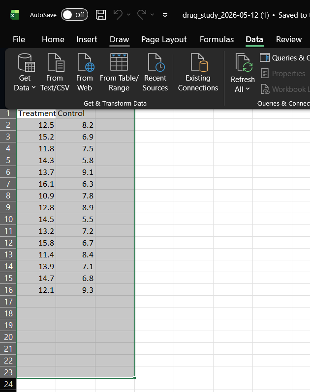

```{=html}
<style>
 sup {
   color: blue;
   font-size: 0.8em;
 }
 .affiliations {
   color: grey;
   font-size: 0.9em;
   margin-top: 0.2em;
 }
</style>
```

::: affiliations
<sup>1</sup>Statoberry LLP, <sup>2</sup>Department of Agricultural Statistics, Kerala Agricultural University
:::

ABSTRACT

::: {style="text-align: justify;"}
The **Two-Sample T-Test** is one of the most widely used statistical procedures for comparing the means of two independent groups, enabling researchers to determine whether a statistically significant difference exists between them. By testing the null hypothesis that both group means are equal, the **Two-Sample T-Test** provides a rigorous framework for inference in biological, agricultural, clinical, and social science research. In **RAISINS**, this test can be performed effortlessly without writing a single line of code, making it accessible to researchers and students alike. This tutorial will guide you through the complete workflow — from data preparation and upload to result interpretation, normality assessment, and visualization — using **RAISINS**. You will obtain publication-ready tables and plots, a formal normality test, AI-assisted interpretation, and access to multivariate analysis including MANOVA and PCA for multi-variable datasets.
:::

<details>

*Hover or click each point to see more information.*

```{=html}
<summary style="color: #5DADE2"; font-weight: bold;">
  Introduction Two-Sample T-Test
</summary>
```

```{=html}
<style>
.hover-img {
  position: relative;
  display: inline-block;
  cursor: help;
  border-bottom: 1px dashed currentColor;
}

.hover-img img {
  position: absolute;
  left: 50%;
  top: 1.6em;
  transform: translateX(-50%);
  width: 260px;
  max-width: 70vw;
  height: auto;
  padding: 6px;
  background: white;
  border: 1px solid rgba(0,0,0,.15);
  border-radius: 12px;
  box-shadow: 0 10px 30px rgba(0,0,0,.18);
  opacity: 0;
  visibility: hidden;
  pointer-events: none;
  transition: opacity .15s ease, transform .15s ease, visibility .15s;
}

.hover-img:hover img {
  opacity: 1;
  visibility: visible;
  transform: translateX(-50%) translateY(6px);
  z-index: 999;
}
</style>
```

<ul><small> The **two-sample t-test**, also known as the independent samples t-test, was formalized in the early 20th century through the foundational work of [William Sealy Gosset]{.hover-img}, an English statistician who published under the pseudonym **"Student"** while working at the Guinness Brewery in Dublin. In 1908, Gosset developed the **t-distribution** to address the problem of making reliable statistical inferences from small samples a practical necessity in quality control and brewing experiments where large datasets were not feasible. His work laid the groundwork for what later became the **Student's t-test**, subsequently extended and formalized by **Ronald A. Fisher**. The two-sample form of the test allows researchers to compare means from two independent groups, becoming a cornerstone method in agricultural trials, medical research, and the life sciences for over a century. </small></ul>

</details>

## Analysis of experiments {#AE}

::: {style="text-align: justify;"}
To get started, visit **RAISINS** [www.raisins.live](https://www.raisins.live) home page and go to **Analysis of experiments**. Here, you can see different single-factor experimental designs and statistical tests. In this tutorial, we focus on the **Two-Sample T-Test**, as shown in @fig-aov.
:::

{#fig-aov fig-align="center"}

## Two-Sample T-Test {#C}

::: {style="text-align: justify;"}
A Two-Sample T-Test is a parametric statistical procedure used to determine whether the means of two independent groups differ significantly from each other. It is appropriate when you have one continuous response variable measured under two distinct, non-overlapping groups for example, comparing the yield of two crop varieties, the blood pressure of a treatment group versus a control, or the germination rate under two irrigation regimes. The test assumes that the observations within each group are independent, that the response variable is approximately normally distributed within each group, and that the variances of the two groups are either equal (Student's t-test) or unequal (Welch's t-test). When the normality assumption is violated, a non-parametric alternative such as the **Mann–Whitney U test** is more appropriate. **RAISINS** automatically performs both the t-test and the Welch correction, alongside formal normality testing, so you can make an informed choice based on your data.
:::

::: callout-tip
#### The Two-Sample T-Test is a parametric statistical test used to compare the means of two independent groups and determine whether any observed difference is statistically significant or attributable to random chance.
:::

## A working example {#W}

::: {style="text-align: justify;"}
This working example presents data for a two-sample t-test using two independent groups: Treatment and Control. Each column contains individual observations collected from the respective groups. The treatment group shows comparatively higher values than the control group, indicating a possible effect of the treatment. These data are used to compare the means of the two groups and determine whether the observed difference is statistically significant. The dataset can also be visualized using plots such as beeswarm plots, boxplots, or violin plots to better understand distribution, spread, and variability.
:::

<!-- REPLACE THIS SCREENSHOT -->

-01.png){#fig-data fig-align="center"}

## How to prepare your data? {#sec-4 .H}

::: {style="text-align: justify;"}
Arranging data for uploading in **RAISINS** is very simple. Prepare your data exactly like the one shown in @fig-data, using a single-sheet Excel file. The first column should contain the group labels (e.g., "Drip_Irrigation" and "Flood_Irrigation"), and all response variables should follow in subsequent columns. Make sure no blank rows are left above the header, and all columns have proper names without spaces or special characters. That is it , your file is ready to upload. If you still have doubts, see @fig-4. To prepare your dataset for analysis in **RAISINS**, you have two options: creating your dataset in MS Excel, or building your dataset directly within the **RAISINS** app.
:::

-01.png){#fig-4 fig-align="center"}

## TWO SAMPLE T -TEST ANALYSE TAB {#sec-5 .T}

::: {style="text-align: justify;"}
In @fig-5, you can see the detailed view of the Analysis tab for the Two-Sample T-Test, along with explanations of what each option does. This section helps you understand the purpose of every setting, so you can select the most appropriate ones for your data and analysis. Upload the prepared file by clicking Browse in the sidebar of the Analysis tab. When the file is uploaded, options to select the Group column and response Variables will appear. Select the appropriate column under Groups and choose the variables you wish to analyse. Once you click the Run Analysis button, all relevant results and outputs including the t-test result, normality test, and plots appear instantly. For some data, when observed variables are not normally distributed, RAISINS provides a built-in transformation option (@sec-6).
:::

<!-- REPLACE THIS SCREENSHOT -->

.png){#fig-5 fig-align="center"}

## Transformation {#sec-6 .T}

::: {style="text-align: justify;"}
Log, square root, and arcsine transformations are often used in statistical analysis to make data more normal and reduce uneven variation. Researchers can apply these transformations when analysing data in **RAISINS** as shown in @fig-6.
:::

.png){#fig-6 fig-align="center"}

::: {style="text-align: justify;"}
**Logarithmic transformation** is a mathematical procedure used to convert a skewed distribution into a more symmetrical one by replacing each data point (x) with its logarithm. This technique is specifically applied to positive, continuous data where the variance is proportional to the mean, a relationship common in phenomena that exhibit multiplicative or exponential growth.

**Square root transformation** is a statistical method used to stabilize variance and reduce right-skewness by replacing each data point (x) with its square root. It is primarily applied to non-negative, discrete count data such as those following a Poisson distribution, where the variance of the data tends to increase in proportion to the mean. By compressing the upper end of the scale more significantly than the lower end, this transformation brings the data closer to a normal distribution, satisfying the homoscedasticity requirements of many parametric statistical tests.

**Arcsine transformation** (also known as the angular transformation) is a mathematical technique specifically designed for data expressed as proportions or percentages bounded between 0 and 1. By taking the inverse sine of the square root of the proportion, this transformation stretches the ends of the distribution near 0 and 1, where variance is naturally small. It is primarily used to achieve homoscedasticity in binomial data.
:::

> After choosing the appropriate transformation proceed to @sec-7 for analysis.

## Analysis results {#sec-7 .AR}

::: {style="text-align: justify;"}
Once your dataset is uploaded and you click Run Analysis, the **Two-Sample T-Test** will be performed. The test compares the means of the two groups and produces a t-statistic along with a p-value, enabling you to conclude whether the difference between the two group means is statistically significant. Results are presented as two key output tables, as described below.
:::

**Table 1: T-Test summary result**

<!-- REPLACE THIS SCREENSHOT -->

{#fig-100 fig-align="center"}

<details>

```{=html}
<summary style="color: #5DADE2"; font-weight: bold;"> T-Test result table </summary>
```

<small> In a Two-Sample T-Test, the null hypothesis states that the means of the two groups are equal (H₀: μ₁ = μ₂), and the alternative hypothesis states that they differ (H₁: μ₁ ≠ μ₂). The test statistic **t** is computed by dividing the difference between the two sample means by the standard error of that difference. Under the null hypothesis, this statistic follows a t-distribution with degrees of freedom determined either by the pooled method (when variances are equal) or by Welch's approximation (when variances are unequal). The computed t-value is compared against a critical t-value at the chosen significance level (α = 0.05 or 0.01). If the absolute computed t-value exceeds the critical value, or equivalently if the p-value is less than α, the null hypothesis is rejected, indicating a statistically significant difference between the two group means.

Significance is indicated by an asterisk ( \* ) for the **5%** level and two asterisks ( \*\* ) for the **1%** level of significance, displayed as superscripts in the table.

**RAISINS** automatically performs both the standard Student's t-test (assuming equal variances) and Welch's t-test (not assuming equal variances), and presents both results so you can choose based on the outcome of the variance equality test. </small>

</details>

### Interpretation from @fig-100

::: {style="text-align: justify;"}
The T-Test result shows that for the variable Yield, the mean for Drip Irrigation (4521.60 kg/plot) is higher than the mean for Flood Irrigation (4102.40 kg/plot). The computed t-statistic is 3.47 with 28 degrees of freedom, and the associated p-value is 0.0017, which is significant at the 1% level. This provides strong evidence to reject the null hypothesis and conclude that Drip Irrigation and Flood Irrigation differ significantly in their effect on Yield. In practical terms, the difference in mean yield between the two irrigation methods is unlikely to have arisen by chance, and the choice of irrigation method has a meaningful influence on crop performance. For variables where the p-value exceeds 0.05, the null hypothesis cannot be rejected and the two group means are considered statistically similar.
:::

**Table 2: Detailed tabular result with group statistics and effect size**

<!-- REPLACE THIS SCREENSHOT -->

<details>

```{=html}
<summary style="color: #5DADE2"; font-weight: bold;">Overview of T-Test Results and Interpretation
</summary>
```

<small>

1.  *Groups and Response Variables*

**Groups**: The two independent categories (e.g., Drip Irrigation and Flood Irrigation) whose means are being compared.

**Response Variable**: The dependent variable or specific measurement (e.g., Yield, Plant_Height) recorded to evaluate the performance of the two groups.

2.  *Test Statistics*

**t-statistic**: The computed test value that quantifies the standardized difference between the two group means relative to the variability in the data.

**Degrees of Freedom (df)**: Determines the shape of the t-distribution used to compute the p-value. In the pooled case, df = n₁ + n₂ − 2; in Welch's approximation, df is adjusted based on the sample variances.

**p-value**: The probability that the observed difference in means (or a larger difference) would arise by chance if the null hypothesis were true. A p-value below 0.05 is conventionally considered statistically significant.

3.  *Group Descriptive Statistics*

**Mean**: The arithmetic average of observations within each group.

**Standard Deviation (SD)**: A measure of variability within each group.

**Standard Error (SE)**: An estimate of how much the sample mean is likely to differ from the true population mean.

4.  *Effect Size*

**Cohen's d**: A standardized measure of effect size that describes the magnitude of the difference between the two group means, expressed in units of standard deviation. Values near 0.20 indicate a small effect, near 0.50 a medium effect, and 0.80 or above indicate a large effect. Cohen's d allows you to assess the practical importance of a statistically significant difference, independent of sample size. </small>

</details>

## Normality test and plots {#sec-8 .MCT}

<details>

```{=html}
<summary style="color: #5DADE2"; font-weight: bold;">
  Why test for normality?
</summary>
```

<ul><small> The Two-Sample T-Test is a parametric test that assumes the response variable is approximately normally distributed within each group. When this assumption is violated particularly in small samples the t-test may produce unreliable p-values. Normality testing helps you decide whether the parametric t-test is appropriate, or whether a non-parametric alternative such as the Mann–Whitney U test should be used instead. For large samples (n \> 30 per group), the Central Limit Theorem generally ensures that the sampling distribution of the mean is approximately normal even if the raw data are not, reducing the need for formal normality testing.</small></ul>

</details>

::: {style="text-align: justify;"}
**RAISINS** performs a formal normality test alongside the Two-Sample T-Test. The **Shapiro–Wilk test** is used as the default normality test for each group, as it is widely regarded as one of the most powerful tests for small to moderate sample sizes. The test statistic W ranges from 0 to 1, where values close to 1 indicate normality. A statistically significant Shapiro–Wilk result (p \< 0.05) indicates a significant departure from normality and suggests that transformation or a non-parametric alternative may be warranted (see @fig-norm).
:::

<!-- REPLACE THIS SCREENSHOT -->

{#fig-norm fig-align="center"}

<details>

```{=html}
<summary style="color: #5DADE2"; font-weight: bold;"> Normality test details </summary>
```

<small>

**Shapiro–Wilk Test**

The **Shapiro–Wilk test** evaluates whether a sample comes from a normally distributed population. It computes a test statistic W by comparing the observed data quantiles with the expected quantiles of a normal distribution. The null hypothesis of the test is that the data are normally distributed; a significant p-value (p \< 0.05) leads to rejection of this null hypothesis. The Shapiro–Wilk test is most reliable for sample sizes between 3 and 50 and is considered more powerful than alternative tests such as Kolmogorov–Smirnov for small samples.

$$W = \frac{\left(\sum_{i=1}^{n} a_i x_{(i)}\right)^2}{\sum_{i=1}^{n}(x_i - \bar{x})^2}$$

where $x_{(i)}$ are the order statistics (sorted values) and $a_i$ are constants derived from the expected values of normal order statistics.

**Levene's Test for Equality of Variances**

Before deciding whether to use the standard Student's t-test or Welch's t-test, **RAISINS** also provides Levene's test for equality of variances. If the p-value for Levene's test is greater than 0.05, the variances of the two groups are considered equal and the pooled t-test is appropriate. If p \< 0.05, the variances differ significantly and Welch's t-test, which does not assume equal variances, should be preferred. </small>

</details>

**Which test to use based on normality?**

::: {style="text-align: justify;"}
The choice of the appropriate test depends on whether the normality assumption is satisfied. If both groups pass the Shapiro–Wilk test (p ≥ 0.05), the **Two-Sample T-Test** (Student's or Welch's, depending on variance equality) is appropriate. If one or both groups fail the normality test, a **logarithmic or square root transformation** (@sec-6) should first be attempted to normalise the data. If data remain non-normal after transformation, the **Mann–Whitney U test** (a non-parametric alternative) is recommended. In the working example, the Shapiro–Wilk test returned W = 0.967 (p = 0.412) for Drip Irrigation and W = 0.971 (p = 0.487) for Flood Irrigation for the Yield variable, confirming that the normality assumption is satisfied and the t-test results are valid.
:::

## Plots and Graphs {#BP}

::: {style="text-align: justify;"}
**RAISINS** is designed for a smooth and hassle-free experience. Once you click the Run Analysis button, all relevant results and outputs appear instantly leaving no room for confusion. We have ensured that every possible plot related to the Two-Sample T-Test is readily available. Simply click on the Plot and Graph tab to view them (see @fig-8). Each plot comes with a gear icon at the top-left corner, allowing you to customise its appearance. You can also download these plots in high-quality PNG format (300 dpi), JPEG, TIFF, PDF, and SVG for use in reports or presentations.
:::

### Customizing plots

::: {style="text-align: justify;"}
**RAISINS** provides users with various customisation features for plots to enhance the visualisation according to the requirements of the user. Click on @fig-8 to get a clear idea of the customising features.
:::

<!-- REPLACE THIS SCREENSHOT -->

.png){#fig-8 fig-align="center"}

::: {style="text-align: justify;"}
From @fig-9 to @fig-13, you can see the different types of plots available in **RAISINS** for the Two-Sample T-Test. Each one is visually illustrated and accompanied by a clear, insightful description, making it easy to understand the distribution and comparison of the two groups.
:::

```{=html}
<script>
document.addEventListener('DOMContentLoaded', function() {
  const descriptions = document.querySelectorAll('.plot-description');
  descriptions.forEach(desc => {
    desc.style.display = 'none';
  });
});

function showDescription(id) {
  document.getElementById(id).style.display = 'flex';
}

function hideDescription(id) {
  document.getElementById(id).style.display = 'none';
}
</script>
```

```{=html}
<style>
.plot-container {
  position: relative;
  display: inline-block;
  cursor: pointer;
  width: 350px;
  height: 300px;
  overflow: hidden;
  margin: 10px;
}

.plot-container img {
  width: 350px;
  height: 300px;
  object-fit: cover;
  border: 3px solid #ddd;
  border-radius: 8px;
  transition: transform 0.3s ease, box-shadow 0.3s ease;
}

.plot-container:hover img {
  transform: scale(1.05);
  box-shadow: 0 4px 12px rgba(0, 0, 0, 0.2);
}

.plot-description {
  display: none !important;
  position: absolute;
  top: 0;
  left: 0;
  width: 100%;
  height: 100%;
  z-index: 1000;
  background: linear-gradient(135deg, rgba(255, 107, 107, 0.8), rgba(255, 142, 83, 0.8));
  color: white;
  padding: 15px;
  border-radius: 8px;
  box-shadow: 0 4px 15px rgba(0, 0, 0, 0.3);
  font-size: 14px;
  line-height: 1.5;
  display: flex;
  align-items: center;
  justify-content: center;
  text-align: center;
  animation: fadeIn 0.3s ease-in;
  pointer-events: none;
  border: 2px solid rgba(255, 255, 255, 0.5);
}

.plot-container:hover .plot-description {
  display: flex !important;
}

@keyframes fadeIn {
  from { opacity: 0; transform: scale(0.95); }
  to { opacity: 1; transform: scale(1); }
}

#boxplot-desc { background: linear-gradient(135deg, rgba(255, 107, 107, 0.8), rgba(255, 142, 83, 0.8)); }
#barplot-desc { background: linear-gradient(135deg, rgba(161, 140, 209, 0.8), rgba(251, 194, 235, 0.8)); }
#connectedplot-desc { background: linear-gradient(135deg, rgba(0, 221, 235, 0.8), rgba(38, 166, 154, 0.8)); }
#meanvalueplot-desc { background: linear-gradient(135deg, rgba(255, 154, 139, 0.8), rgba(255, 106, 136, 0.8)); }
#violinplot-desc { background: linear-gradient(135deg, rgba(132, 250, 176, 0.8), rgba(143, 211, 244, 0.8)); }
</style>
```

::::::::::::::::::::::: grid
:::::: g-col-6
::::: {.plot-container onmouseover="showDescription('boxplot-desc')" onmouseout="hideDescription('boxplot-desc')"}
<!-- REPLACE THIS SCREENSHOT -->

{#fig-9 fallback="https://via.placeholder.com/300x300?text=Box+Plot"}

:::: {#boxplot-desc .plot-description}
::: {style="text-align: justify;"}
A **Box plot with a t-tes**t visually compares the distribution and median of two groups while the t-test statistically checks whether their mean difference is significant. The box plot displays spread, quartiles, and outliers, helping interpret group variation along with the t-test result.
:::
::::
:::::
::::::

:::::: g-col-6
::::: {.plot-container onmouseover="showDescription('violinplot-desc')" onmouseout="hideDescription('violinplot-desc')"}
<!-- REPLACE THIS SCREENSHOT -->

{#fig-10 fallback="https://via.placeholder.com/300x300?text=Violin+Plot"}

:::: {#violinplot-desc .plot-description}
::: {style="text-align: justify;"}
A **Raincloud plot** combines a violin plot, box plot, and scatter plot in a single visualization. It shows data distribution, median, spread, and individual observations together, making it useful for comparing groups and understanding variability clearly.
:::
::::
:::::
::::::

:::::: g-col-6
::::: {.plot-container onmouseover="showDescription('barplot-desc')" onmouseout="hideDescription('barplot-desc')"}
<!-- REPLACE THIS SCREENSHOT -->

{#fig-11 fallback="https://via.placeholder.com/300x300?text=Bar+Plot"}

:::: {#barplot-desc .plot-description}
::: {style="text-align: justify;"}
A **Beeswarm plot** in a two-sample t-test shows individual data points of two groups without overlap. It helps visualize group differences, spread, and outliers before comparing means statistically.
:::
::::
:::::
::::::

:::::: g-col-6
::::: {.plot-container onmouseover="showDescription('meanvalueplot-desc')" onmouseout="hideDescription('meanvalueplot-desc')"}
<!-- REPLACE THIS SCREENSHOT -->

{#fig-12 fallback="https://via.placeholder.com/300x300?text=Mean+Value+Plot"}

:::: {#meanvalueplot-desc .plot-description}
::: {style="text-align: justify;"}
A **Strip chart** with significance displays individual data points of different groups along with statistical significance indicators (such as p-values or asterisks). It helps visualize group distribution and identify whether differences between groups are statistically significant.
:::
::::
:::::
::::::

:::::: g-col-6
::::: {.plot-container onmouseover="showDescription('connectedplot-desc')" onmouseout="hideDescription('connectedplot-desc')"}
<!-- REPLACE THIS SCREENSHOT -->

{#fig-13 fallback="https://via.placeholder.com/300x300?text=Connected+Plot"}

:::: {#connectedplot-desc .plot-description}
::: {style="text-align: justify;"}
A **Half-eye plot** combines a density plot with interval estimates and individual data summaries. It shows the distribution, central tendency, and uncertainty of data in a compact form, making it useful for comparing groups and statistical results visually.
:::
::::
:::::
::::::
:::::::::::::::::::::::

## AI interpretation {#AI}

::: {style="text-align: justify;"}
**RAISINS** is equipped with an AI-powered RAISINS Assistant designed to assist users in comprehending the outcomes of the Two-Sample T-Test and associated analyses. This functionality provides clear and concise summaries of results, identifies whether statistically significant differences exist between the two groups, reports effect sizes, and offers informed suggestions for potential next steps or further analyses. The user can obtain detailed interpretations of the analysis by clicking on AI Interpretation in the Analysis tab, as shown in @fig-ai.
:::

{#fig-ai fig-align="center"}

## Preparing your data {#PRE}

::: {style="text-align: justify;"}
"Your analysis is only as good as your data! Feed **RAISINS** high-quality data, and it will deliver powerful insights feed it messy data, and the results won't be trustworthy."

1.  Create your dataset in MS Excel

2.  Build your dataset directly within the **RAISINS** app
:::

## Preparing data in MS Excel {#EX}

::: {style="text-align: justify;"}
Open a new blank sheet in MS Excel with only one sheet included, and avoid adding any unnecessary content. The dataset should follow a column-based format, where the first column represents the group label the two independent groups being compared (e.g., "Drip_Irrigation" and "Flood_Irrigation"). All response variables under study (e.g., Yield, Plant_Height, Tillers, GrainWeight) should be arranged in separate columns, and each group label should be repeated according to the number of observations in that group. The file can be saved in CSV, XLS, or XLSX format, but CSV is recommended as it is lighter and enables faster loading. Ensure that there are no unwanted spaces in column names or group labels. For reference, see the structure shown in @fig-pp. As illustrated in @fig-data, group labels must appear repeatedly according to the number of replicates per group, and the data can also be arranged as shown in @fig-kk.
:::

{#fig-pp}

{#fig-kk}

<details>

<summary>Dataset Creation Rules</summary>

<small> 1. **Column Naming Convention** - No spaces allowed in column names.\
- Use underscores (`_`) or full stops (`.`) for separation. - Avoid symbols and special characters like %, \# etc. 2. **Data Arrangement** - Start data arrangement towards the upper-left corner.\
- Ensure the row above the data is not blank. 3. **Cell Management** - Avoid typing or deleting in cells without data.\
- If needed, select affected cells, right-click, and select **Clear Contents**. 4. **Column Relevance** - Name all columns meaningfully.\
- Exclude unnecessary columns not required for analysis. 5. **Group Labels** - The group column must contain exactly two distinct labels corresponding to the two groups being compared.\
- Ensure consistent spelling and capitalisation of group labels throughout the column. </small>

</details>

<details>

<summary>How to Save as CSV in MS Excel</summary>

<small> 1. **Open Your Workbook**

```         
-   Ensure your data is arranged properly with only one sheet.
```

2.  **Click 'File' Menu**

    - Go to the top-left corner and click on **File**.

3.  **Choose 'Save As' or 'Save a Copy'**

    - Select the location where you want to save your file.

4.  **Set File Type to CSV**

    - In the **'Save as type'** dropdown menu, choose **CSV (Comma delimited) (\*.csv)**.

5.  **Name Your File**

    - Enter a relevant file name without spaces (use underscores if needed).

6.  **Click 'Save'**

    - Click **Save** to export the file.

> 💡 Tip: Before saving, double-check that your data is on the first sheet and follows the required format (e.g., no empty rows above the data, meaningful column names, exactly two unique group labels in the group column). </small>

</details>

## Creating dataset in RAISINS {#CR}

::: {style="text-align: justify;"}
If you are unsure about the correct format for creating a dataset, do not worry **RAISINS** offers an option to create data directly within the app using the prescribed template. Here is how:

- Navigate to the **Create Data Tab**

- Select the number of **Groups** (set to 2 for a Two-Sample T-Test)

- Select number of **Replications** per group

- Select number of **Characters** (response variables)

- Click on the **Create** button

The model layout will appear as shown in @fig-createdata. You may enter the observations manually into the CSV file once downloaded, or paste the observations straight into the file provided. Once you have entered the observations in the layout, download the CSV file and upload it in Analysis.
:::

-02.png){#fig-createdata}

## Model datasets {#M}

::: {style="text-align: justify;"}
To test the app or better understand the data arrangement, we provide model datasets within the app. You can download them from the Dataset tab.
:::

{#fig-188 fig-align="center"}

## FAQ's {#F}

::: {style="text-align: justify;"}
The app includes a dedicated FAQs section to help clarify common doubts and guide users through various features. This section provides detailed answers to frequently asked questions, offering additional information and helpful tips to ensure a smooth user experience. If you are ever unsure about how something works for example, which test to use when data are not normally distributed, or how to interpret Cohen's d ,the FAQs is a great place to start.
:::

{#fig-148 fig-align="center"}

## View data {#U}

::: {style="text-align: justify;"}
View Data serves as the primary diagnostic tool for ensuring data integrity before analysis. Upon uploading your dataset, the system performs an automated Health Check to validate column types and formatting. For the Two-Sample T-Test, this step is especially important to confirm that the group column contains exactly two unique labels, that all response variable columns contain numeric values, and that there are no missing or incorrectly formatted entries that could distort the test results.
:::

{fig-align="center"}
