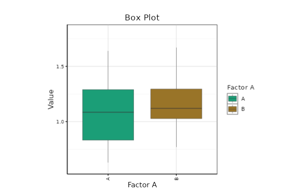
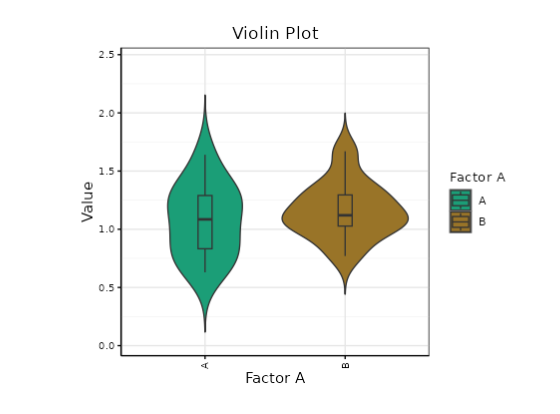
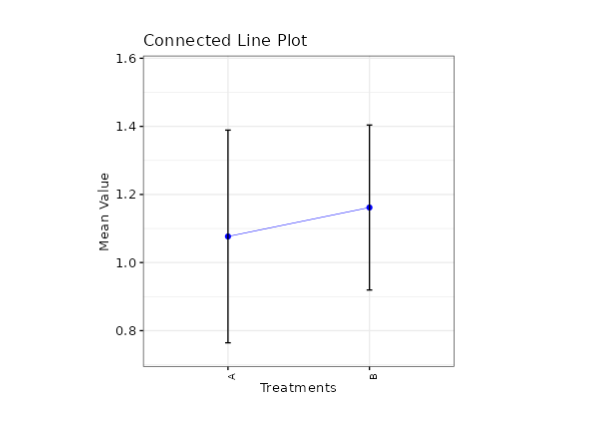

```{r}

```

```{=html}
<style>
 sup {
   color: blue;
   font-size: 0.8em;
 }
 .affiliations {
   color: grey;
   font-size: 0.9em;
   margin-top: 0.2em;
 }
</style>
```

::: affiliations
<sup>1</sup>Statoberry LLP, <sup>2</sup>Department of Agricultural Statistics, Kerala Agricultural University
:::

ABSTRACT

::: {style="text-align: justify;"}
Two Factor Factorial Randomised Block Design **(2F-RBD)** is an experimental design that allows simultaneous evaluation of two factors and their interaction while controlling for variability among experimental blocks. In a 2F-RBD, all treatment combinations formed by the levels of two factors are randomly assigned within each block, enabling the researcher to assess the main effects of each factor, their interaction effect, and block-to-block variation in a single experiment. In **RAISINS** you can perform 2F-RBD very easily without writing a single line of code. This tutorial will guide you, how to perform 2F-RBD very easily in **RAISINS** and interpret the results effectively. In addition, you will get tables and plots ready for publication. You can also perform a multivariate analysis including MANOVA and PCA.
:::

<details>

*Hover or click each point to see more information.*

```{=html}
<summary style="color: #5DADE2"; font-weight: bold;">
  Introduction Two Factor Factorial RBD
</summary>
```

```{=html}
<style>
.hover-img {
  position: relative;
  display: inline-block;
  cursor: help;
  border-bottom: 1px dashed currentColor;
}
.hover-img img {
  position: absolute;
  left: 50%;
  top: 1.6em;
  transform: translateX(-50%);
  width: 260px;
  max-width: 70vw;
  height: auto;
  padding: 6px;
  background: white;
  border: 1px solid rgba(0,0,0,.15);
  border-radius: 12px;
  box-shadow: 0 10px 30px rgba(0,0,0,.18);
  opacity: 0;
  visibility: hidden;
  pointer-events: none;
  transition: opacity .15s ease, transform .15s ease, visibility .15s;
}
.hover-img:hover img {
  opacity: 1;
  visibility: visible;
  transform: translateX(-50%) translateY(6px);
  z-index: 999;
}
</style>
```

<ul><small> The Randomised Block Design has its roots in the pioneering work of **Ronald A Fisher** at Rothamsted Experimental Station during the **1920s and 1930s**. Fisher recognized that natural heterogeneity in experimental fields caused by gradients in soil fertility, moisture, or topography could confound treatment comparisons if left uncontrolled. He proposed grouping experimental units into homogeneous blocks and randomizing treatments separately within each block, thereby isolating and removing block-to-block variability from the error term. This innovation greatly improved the precision of field experiments. When factorial treatment structures were later combined with the block arrangement, the Two Factor Factorial RBD emerged as one of the most widely used designs in agricultural, biological, and industrial research, allowing researchers to study multiple factors and their interactions efficiently while controlling for environmental variability. </small></ul>

</details>

## Analysis of experiments {#AE}

::: {style="text-align: justify;"}
To get started, visit **RAISINS** [www.raisins.live](https://www.raisins.live) home page and go to **Analysis of experiments**. Here, you can see different experimental designs including factorial designs. In this tutorial, we focus on **Two Factor Factorial RBD (2F-RBD)**, as shown in @fig-aov.
:::

<!-- REPLACE THIS SCREENSHOT -->

{#fig-aov fig-align="center"}

## Two Factor Factorial RBD (2F-RBD) {#C}

::: {style="text-align: justify;"}
A Two Factor Factorial Randomized Block Design (2F-RBD) is an experimental design in which two factors, each with two or more levels, are combined to form all possible treatment combinations, and these combinations are then randomly assigned within each homogeneous block. The design enables the researcher to evaluate the main effect of Factor A, the main effect of Factor B, and the interaction effect (A × B) simultaneously, while also accounting for variability among blocks. 2F-RBD is particularly useful in field experiments, greenhouse trials, and any situation where experimental units can be grouped into blocks that are more homogeneous within than between them. By removing block-to-block variation from the experimental error, the design improves the precision of treatment comparisons compared to a Two Factor Factorial CRD. It offers the dual advantage of factorial efficiency and block control, making it the preferred choice when environmental heterogeneity is expected to be a significant source of variation.
:::

<details>

```{=html}
<summary style="color: #5DADE2"; font-weight: bold;">
  2F-RBD Layout
</summary>
```

<ul>

<small>

@fig-lay visually represents a Two Factor Factorial RBD arrangement. In this layout, the treatment combinations are formed by crossing all levels of Factor A with all levels of Factor B. For example, with Factor A having 2 levels (a1, a2) and Factor B having 2 levels (b1, b2), a total of 4 treatment combinations (a1b1, a1b2, a2b1, a2b2) are generated. Each treatment combination appears exactly once within every block, and the assignment within each block is completely randomized. The blocks themselves represent distinct groups of experimental units that share similar characteristics (e.g., rows or columns of a field, growth chambers, or batches of material), thereby controlling for the variation among them.

<!-- REPLACE THIS SCREENSHOT -->

{#fig-lay fig-align="center"}

</small>

</ul>

</details>

::: callout-tip
#### Two Factor Factorial RBD (2F-RBD) is an experimental design that simultaneously evaluates two factors and their interaction by randomly assigning all treatment combinations within homogeneous blocks, thereby controlling for block-to-block variability.
:::

## A working example {#W}

::: {style="text-align: justify;"}
To make things simple and interesting, we'll explain 2F-RBD analysis step by step using a working example, so you can clearly see how it works and why it matters. This data set represents a factorial experiment involving two factors: Factor A and Factor B, each with multiple levels, laid out in a Randomized Block Design. Factor A consists of 2 levels (A1, A2), while Factor B has 2levels (B1, B2). The experiment is conducted in a Randomized Block Design (RBD), where the treatment combinations formed by crossing the levels of Factor A and Factor B are randomly assigned within each of 3 blocks. Observations were recorded for 7 variables. This data set allows for the examination of the individual effects of Factor A and Factor B, as well as their interaction effects, with block effects accounted for to improve precision. Our aim is to test whether the factors and their interaction produce statistically significant differences in the response variables using ANOVA. The arrangement of the data is shown in the @fig-data.
:::

<!-- REPLACE THIS SCREENSHOT -->

{#fig-data fig-align="center"}

::: {style="text-align: justify;"}
Data organized in MS Excel can be directly uploaded to **RAISINS** for analysis. For more details on data preparation see @sec-4. Three terms that we will use frequently are **Factor A**, **Factor B**, and **Variables**. In our example, Factor A has 2 levels, Factor B has 2 levels and the 7 Variables.
:::

## How to prepare your data? {#sec-4 .H}

::: {style="text-align: justify;"}
Arranging data for uploading in **RAISINS** is very simple. Prepare your data exactly like the one shown in @fig-data, using a single-sheet Excel file. The dataset must include columns for Block, Factor A, Factor B, and each response variable. Make sure no blank rows are left above, and all columns have proper names. That's it - your file is ready to upload.

Still if you have doubt, see @fig-4.

To prepare your dataset for analysis in **RAISINS**, you have two options:

Creating dataset in MS Excel

Creating your dataset directly within the **RAISINS** app
:::

<!-- REPLACE THIS SCREENSHOT -->

{#fig-4 fig-align="center"}

## 2F-RBD analysis tab explained {#AO}

::: {style="text-align: justify;"}
In @fig-5, you can see the detailed view of the Analysis tab, along with explanations of what each option does. This section helps you to understand the purpose of every setting, so you can select the most appropriate ones for your data and analysis. Now, upload the prepared file by clicking Browse in the sidebar of the Analysis tab. When the file is uploaded, options to select Block, Factor A, Factor B, and variables will appear. Select the appropriate columns under each category. Once you click the Run Analysis button, all relevant results and outputs appear instantly leaving no room for confusion.
:::

<!-- REPLACE THIS SCREENSHOT -->

.png){#fig-5 fig-align="center"}

::: {style="text-align: justify;"}
For some data, when there are large number of zeros/ discrete values/ when the observed variables are not normally distributed, we need to do transformation on the dataset (@sec-6). Here, **RAISINS** provide inbuilt transformation option.
:::

## Transformation {#sec-6 .T}

::: {style="text-align: justify;"}
Log, square root, and arcsine transformations are often used in 2F-RBD analysis to make data more normal and reduce uneven variation. Researchers can use these transformations when analyzing experimental data in **RAISINS** as shown in @fig-6.
:::

{#fig-6 fig-align="center"}

::: {style="text-align: justify;"}
**Logarithmic transformation** is a mathematical procedure used to convert a skewed distribution into a more symmetrical one by replacing each data point (x) with its logarithm. This technique is specifically applied to positive, continuous data where the variance is proportional to the mean, a relationship common in phenomena that exhibit multiplicative or exponential growth.

**Square root transformation** is a statistical method used to stabilize variance and reduce right-skewness by replacing each data point (x) with its square root. It is primarily applied to non-negative, discrete "count" data such as those following a Poisson distribution, where the variance of the data tends to increase in proportion to the mean. By compressing the upper end of the scale more significantly than the lower end, this transformation brings the data closer to a normal distribution, satisfying the homoscedasticity requirements of many parametric statistical tests.

**Arcsine transformation** (also known as the angular transformation) is a mathematical technique specifically designed for data expressed as proportions or percentages bounded between 0 and 1. By taking the inverse sine of the square root of the proportion, this transformation stretches the ends of the distribution near 0 and 1, where variance is naturally small. It is primarily used to achieve homoscedasticity in binomial data.
:::

> After choosing the appropriate transformation proceed to @sec-7 for analysis.

## Analysis results {#sec-7 .AR}

::: {style="text-align: justify;"}
Once your dataset is uploaded, click on Run Analysis, **two-way ANOVA** (factorial ANOVA) will be performed within a randomized block framework. Analysis of Variance **(ANOVA)** is a statistical technique used to test the significance of differences among population means by partitioning total variation into Blocks, Factor A, Factor B, Interaction (A × B), and error components and comparing them using the F-test.
:::

**Table 1 ANOVA summary**

::: {style="text-align: justify;"}
The ANOVA summary table below presents the mean squares for each source of variation Blocks, Factor A, Factor B, the Interaction (A × B), and the residual Error along with their degrees of freedom and significance indicators for each response variable.
:::

<!-- REPLACE THIS SCREENSHOT -->

{fig-align="center"}

<details>

```{=html}
<summary style="color: #5DADE2"; font-weight: bold;"> ANOVA table </summary>
```

<small> In a Two Factor Factorial RBD (2F-RBD), the analysis of variance **(ANOVA)** is used to test whether there are significant differences due to Blocks, Factor A, Factor B, and their interaction (A × B). The ANOVA partitions the total variation into five components: Blocks (with r − 1 degrees of freedom, where r is the number of blocks), Factor A (with a − 1 degrees of freedom, where a is the number of levels of Factor A), Factor B (with b − 1 degrees of freedom, where b is the number of levels of Factor B), Interaction A × B (with (a − 1)(b − 1) degrees of freedom), and Error (with (r − 1)(ab − 1) degrees of freedom). Each source of variation has a corresponding mean square, and the F-statistic is computed as the ratio of the treatment mean square to the error mean square. Block effects are typically not tested formally but are removed from the error to improve precision. Significance is indicated by an asterisk ( \* ) for the **5%** level and two asterisks (\*\* ) for the **1%** level of significance, displayed as superscripts for each corresponding F stat in the table. If the computed F value exceeds the critical value, the null hypothesis is rejected, indicating that the factor or interaction has a significant effect on the response variable. </small>

</details>

### Interpretation

::: {style="text-align: justify;"}
The ANOVA summary indicates that Factor A shows a significant effect on y1 and y3 (p \< 0.05), while Factor B is non-significant across all traits. The interaction A × B is significant for y2 at the 5% level, suggesting that the combined effect of the two factors influences y2 beyond their individual effects. The error mean squares range from X to Y with Z degrees of freedom.
:::

**Table 2: Factor A - Detailed results with multiple comparisons**

::: {style="text-align: justify;"}
The table below presents the mean values (± standard deviation) for each level of Factor A across the response variables, along with key ANOVA statistics including F stat, p value, critical difference (CD), MSE, SE(m), SE(d), CV(%), and Cohen's F.
:::

<!-- REPLACE THIS SCREENSHOT -->

{fig-align="center"}

**Table 3: Factor B - Detailed results with multiple comparisons**

<!-- REPLACE THIS SCREENSHOT -->

{fig-align="center"}

**Table 4: Interaction (A × B) - Detailed results**

<!-- REPLACE THIS SCREENSHOT -->

{fig-align="center"}

```{=html}
```

<details>

```{=html}
<summary style="color: #5DADE2"; font-weight: bold;">Overview of ANOVA Results and Interpretation
</summary>
```

<small>

1.  *Factors and Response Variables*

**Factor A**: The first independent variable with distinct levels (e.g., a1, a2) being tested to determine its influence on the results.

**Factor B**: The second independent variable with distinct levels (e.g., b1, b2, b3) tested simultaneously with Factor A.

**Blocks**: Groups of experimental units that are more homogeneous within than between them. Blocking accounts for known sources of variability (e.g., field gradients, batch effects) and removes them from the experimental error, thereby improving precision.

**Interaction (A × B)**: The combined effect of Factor A and Factor B that goes beyond the sum of their individual effects.

**Response Variable**: The dependent variable or specific measurement (e.g., y1, y2) recorded to evaluate the performance of the treatment combinations.

2.  *Multiple Comparisons*

**Post hoc Grouping**: A method of using letters (a, b, c) to categorize means. Items sharing the same letter are statistically similar, while those with different letters are significantly different.

3.  *ANOVA Summary*

**F stat**: A numerical value that compares the variance between different groups to the variance within those groups; it determines if the overall differences are statistically significant.

**p value**: The probability that the observed differences occurred by random chance. A value typically below 0.05 indicates that the results are statistically significant.

4.  *Critical Difference (CD) and Error Estimates*

**Critical Difference (CD)**: The minimum mathematical gap required between two means to declare them "significantly different" at a specific confidence level. Separate CD values are computed for Factor A, Factor B, and the Interaction.

**Standard Error (SE)**: A measure of the accuracy of a sample mean compared to the true population mean; it indicates how much the mean might fluctuate.

**Mean Square Error (MSE)**: The average of the squared differences between observed values and the predicted mean; it represents the "noise" or unexplained error in the experiment.

**Coefficient of Variation (CV%)**: A percentage that shows the level of dispersion in the data. A lower CV indicates higher precision and reliability in the experimental measurements.

**Cohen's F**: A standardized measure of effect size that describes the magnitude of the experimental effect, regardless of the sample size. </small>

</details>

### Interpretation

For Factor A, the mean values across levels A1 and A2 show meaningful differences for y1 (F = X.XX, p = 0.0X), with the LSD groupings confirming that A2 (mean = X.XX, group 'a') is significantly higher than a1 (mean = X.XX, group 'b'). For Factor B, ... The interaction A × B reveals significant combined effects for ... The CV(%) values ranging from X to Y suggest moderate/low experimental variability, indicating good precision in the blocking arrangement.

::: callout-tip
#### When a researcher uses Tukey's HSD or DMRT, each pairwise comparison produces a different value because the differences between the group means are unique.
:::

::: callout-tip
#### Cohen's f is a measure of effect size. It tells you how strong or meaningful the treatment effect is, independent of sample size.
:::

## Multiple comparison tests {#sec-8 .MCT}

<details>

```{=html}
<summary style="color: #5DADE2"; font-weight: bold;">
  What is Post-hoc test?
</summary>
```

<ul><small> Post hoc test is a follow-up analysis, performed after finding a significant result in an overall statistical test (like ANOVA). It's purpose is to identify exactly which groups or treatments differ from each other. In other words, it helps to pinpoint where the differences lie between multiple groups, when the initial test shows that not all groups are the same.</small></ul>

</details>

::: {style="text-align: justify;"}
After obtaining a significant F-value in ANOVA under 2F-RBD, multiple comparison tests are employed to identify which factor level means differ significantly. In a factorial design with a block arrangement, post hoc comparisons can be applied separately for each significant factor (Factor A, Factor B) and for the interaction (A × B) when significant. Commonly used post hoc tests include Least Significant Difference (LSD), Tukey's Honest Significant Difference (HSD), and Duncan's Multiple Range Test (DMRT), each differing in their level of error control and suitability depending on the number of treatments and experimental conditions,see @fig-7.
:::

<!-- REPLACE THIS SCREENSHOT -->

{#fig-7 fig-align="center"}

<details>

```{=html}
<summary style="color: #5DADE2"; font-weight: bold;"> Post-hoc test </summary>
```

<small>

When the ANOVA in a **Two Factor Factorial RBD (2F-RBD)** is significant, the following post hoc tests are commonly used for pairwise comparisons: Tukey's Honestly Significant Difference (HSD) test, and Fisher's Least Significant Difference (LSD) test.

**LSD (Least Significant Difference) Test**

The **Least Significant Difference (LSD)** test is a post hoc statistical procedure used to identify which specific factor level means differ significantly after ANOVA has indicated a significant effect. The LSD is calculated as $$\text{LSD} = t_{\alpha/2, \, df_{\text{error}}} \sqrt{\frac{2 \ \text{MSE}}{n}}$$

where, **t₍α/2, dfₑᵣᵣₒᵣ₎** is the critical t-value at the chosen significance level (e.g., 0.05), MSE is the mean square error from the ANOVA, and n is the number of observations per factor level. In a 2F-RBD, the error degrees of freedom are (r − 1)(ab − 1), where r is the number of blocks, a is the number of levels of Factor A, and b is the number of levels of Factor B. The value of n depends on the comparison being made: for Factor A, n is the total number of observations per level of A (i.e., r × b); for Factor B, n is the total number of observations per level of B (i.e., r × a); and for the interaction, n is the number of blocks r per cell.

**Tukey's Honestly Significant Difference (HSD)**

Tukey's test helps you find out exactly which pairs of factor level means differ significantly. It compares all possible pairs of means while controlling the overall Type I error rate, so you avoid false positives when making multiple comparisons. In 2F-RBD, this method works well when the number of factor levels is large and a conservative, family-wise control of error is desired.

**Duncan's Multiple Range Test (DMRT)**

After confirming significant overall differences via ANOVA, DMRT ranks the factor level means and calculates critical differences using the standardized range statistic (Q) and the standard error based on error variance from ANOVA. This systematic and sequential approach provides clear groupings of factor levels and has gained popularity in agricultural research. </small>

</details>

**Which Post hoc test to use?**

::: {style="text-align: justify;"}
The choice of the post hoc test completely relies on the researcher.

**LSD** is used for pairwise comparison of factor level means after a significant ANOVA in 2F-RBD. It is most suitable when the number of factor levels is small and comparisons are limited, offering high sensitivity to detect differences, but it may increase Type I error when many comparisons are made. In agricultural experiments LSD is the most commonly used.

**Tukey's HSD** is preferred when there are four or more levels of a factor in a balanced 2F-RBD. It compares all possible pairs while strictly controlling the family-wise error rate, making it a conservative and reliable method for multiple comparisons.

**DMRT** is commonly used in agricultural experiments with several factor levels. It ranks means step-wise and detects more significant differences than Tukey HSD, though it is less conservative and carries a higher risk of Type I error.

In the example for those characters, a pairwise comparison was performed to identify significant differences between factor levels using Least Significant Difference (LSD) test.
:::

## Basic plots {#BP}

::: {style="text-align: justify;"}
**RAISINS** is designed for a smooth and hassle-free experience. Once you click the Run Analysis button, all relevant results and outputs appear instantly - leaving no room for confusion. We've ensured that every possible plot related to the Two Factor Factorial RBD is readily available. Simply click on the Basic Plots tab to view them,see @fig-8. Each plot comes with a gear icon at the top-left corner, allowing you to customize its appearance. You can also download these plots in high-quality PNG format (300 dpi), JPEG, TIFF, PDF and SVG for use in reports or presentations.
:::

### Customizing plots

::: {style="text-align: justify;"}
**RAISINS** provides users various customization features for the plots to enhance the visualization according to the requirement of the user. **Click** on @fig-8 to get a clear idea on the customizing features.
:::

<!-- REPLACE THIS SCREENSHOT -->

{#fig-8 fig-align="center"}

::: {style="text-align: justify;"}
From @fig-9 to @fig-13, you can see the different types of plots available in RAISINS. Each one is visually illustrated and accompanied by a clear, insightful description below, making it easy to understand.
:::

```{=html}
<script>
document.addEventListener('DOMContentLoaded', function() {
  const descriptions = document.querySelectorAll('.plot-description');
  descriptions.forEach(desc => {
    desc.style.display = 'none';
  });
});

function showDescription(id) {
  document.getElementById(id).style.display = 'flex';
}

function hideDescription(id) {
  document.getElementById(id).style.display = 'none';
}
</script>
```

```{=html}
<style>
.plot-container {
  position: relative;
  display: inline-block;
  cursor: pointer;
  width: 350px;
  height: 300px;
  overflow: hidden;
  margin: 10px;
}
.plot-container img {
  width: 350px;
  height: 300px;
  object-fit: cover;
  border: 3px solid #ddd;
  border-radius: 8px;
  transition: transform 0.3s ease, box-shadow 0.3s ease;
}
.plot-container:hover img {
  transform: scale(1.05);
  box-shadow: 0 4px 12px rgba(0, 0, 0, 0.2);
}
.plot-description {
  display: none !important;
  position: absolute;
  top: 0; left: 0;
  width: 100%; height: 100%;
  z-index: 1000;
  color: white;
  padding: 15px;
  border-radius: 8px;
  box-shadow: 0 4px 15px rgba(0, 0, 0, 0.3);
  font-size: 14px;
  line-height: 1.5;
  display: flex;
  align-items: center;
  justify-content: center;
  text-align: center;
  animation: fadeIn 0.3s ease-in;
  pointer-events: none;
  border: 2px solid rgba(255, 255, 255, 0.5);
}
.plot-container:hover .plot-description {
  display: flex !important;
}
@keyframes fadeIn {
  from { opacity: 0; transform: scale(0.95); }
  to { opacity: 1; transform: scale(1); }
}
#boxplot-desc { background: linear-gradient(135deg, rgba(255, 107, 107, 0.8), rgba(255, 142, 83, 0.8)); }
#barplot-desc { background: linear-gradient(135deg, rgba(161, 140, 209, 0.8), rgba(251, 194, 235, 0.8)); }
#connectedplot-desc { background: linear-gradient(135deg, rgba(0, 221, 235, 0.8), rgba(38, 166, 154, 0.8)); }
#meanvalueplot-desc { background: linear-gradient(135deg, rgba(255, 154, 139, 0.8), rgba(255, 106, 136, 0.8)); }
#violinplot-desc { background: linear-gradient(135deg, rgba(132, 250, 176, 0.8), rgba(143, 211, 244, 0.8)); }
</style>
```

:::::::::::::::::::::::: grid
:::::: g-col-6
::::: {.plot-container onmouseover="showDescription('boxplot-desc')" onmouseout="hideDescription('boxplot-desc')"}
<!-- REPLACE THIS SCREENSHOT -->

{#fig-9}

:::: {#boxplot-desc .plot-description}
::: {style="text-align: justify;"}
A **box plot** compares the distribution of values across different treatment combinations. Each colored box represents a treatment combination and shows key statistics: the median (middle line), the interquartile range (the box itself), and potential outliers (points outside the whiskers). Letters above each box indicate statistical groupings treatment combinations sharing letters are statistically similar, while those with different letters are significantly different.
:::
::::
:::::
::::::

:::::: g-col-6
::::: {.plot-container onmouseover="showDescription('violinplot-desc')" onmouseout="hideDescription('violinplot-desc')"}
<!-- REPLACE THIS SCREENSHOT -->

{#fig-10}

:::: {#violinplot-desc .plot-description}
::: {style="text-align: justify;"}
A **violin plot** compares the distribution of values across different treatment combinations. Each treatment combination is shown as a violin shape that reflects how the data is spread wider sections mean more data points at that value. Inside each violin is a box plot showing the median and interquartile range. Letters above each plot indicate statistical groupings: treatment combinations sharing letters are statistically similar, while those with different letters are significantly different.
:::
::::
:::::
::::::

:::::: g-col-6
::::: {.plot-container onmouseover="showDescription('barplot-desc')" onmouseout="hideDescription('barplot-desc')"}
<!-- REPLACE THIS SCREENSHOT -->

{#fig-11}

:::: {#barplot-desc .plot-description}
::: {style="text-align: justify;"}
A **Bar plot** compares the average values of different treatment combinations, with error bars showing variability. The letters above each bar indicate statistical groupings: treatment combinations sharing letters are similar, while those with different letters are significantly different. It highlights which treatment combinations have higher or lower averages and whether those differences are meaningful.
:::
::::
:::::
::::::

:::::: g-col-6
::::: {.plot-container onmouseover="showDescription('meanvalueplot-desc')" onmouseout="hideDescription('meanvalueplot-desc')"}
<!-- REPLACE THIS SCREENSHOT -->

{#fig-12}

:::: {#meanvalueplot-desc .plot-description}
::: {style="text-align: justify;"}
A **mean value plot** compares the mean values of different treatment combinations, each shown as a colored dot with horizontal error bars indicating variability. Letters next to each point represent statistical groupings: treatment combinations sharing letters are statistically similar, while those with different letters are significantly different.
:::
::::
:::::
::::::

::::::: g-col-6
:::::: {.plot-container onmouseover="showDescription('connectedplot-desc')" onmouseout="hideDescription('connectedplot-desc')"}
::: {style="text-align: center;"}
<!-- REPLACE THIS SCREENSHOT -->

{#fig-13}
:::

:::: {#connectedplot-desc .plot-description}
::: {style="text-align: justify;"}
A **connected line plot** compares the mean values of different treatment combinations, with each point representing a treatment combination's average and error bars showing variability. The points are linked by lines to highlight trends across treatment combinations. Letters above each point indicate statistical groupings: treatment combinations sharing letters are statistically similar, while those with different letters are significantly different.
:::
::::
::::::
:::::::
::::::::::::::::::::::::

## Advanced plots {#AP}

::: {style="text-align: justify;"}
**RAISINS** also provides advanced plots which goes beyond basic bar charts and histograms to give deeper insight into your data, especially distributions, relationships, and deviations from expectations,see @fig-90.
:::

<!-- REPLACE THIS SCREENSHOT -->

{#fig-90 fig-align="center"}

**INTERACTION PLOT**

<!-- REPLACE THIS SCREENSHOT -->

{#fig-14 fig-align="center"}

::: {style="text-align: justify;"}
The interaction plot illustrates how the response variable changes across the levels of two factors in a 2F-RBD. The lines represent factor levels, and their trends show how the effect of one factor varies with the levels of the other factor. Non-parallel or crossing lines indicate the presence of interaction, helping to understand whether the factors jointly influence the response. In a block design, the interaction plot reflects the treatment effects after block variation has been removed from the error.
:::

**3D SCATTER PLOT**

<!-- REPLACE THIS SCREENSHOT -->

{#fig-15 fig-align="center"}

::: {style="text-align: justify;"}
A 3D scatter plot visualizes the relationship between Factor A, Factor B, and the response variable in a three-dimensional space. Each point represents the mean response for a specific combination of factor levels, allowing clear observation of how the response changes across both factors simultaneously. This plot helps in identifying patterns, trends, and possible interaction effects between the factors in the factorial experiment.
:::

**3D SCATTER PLOT WITH LINE**

<!-- REPLACE THIS SCREENSHOT -->

{#fig-16 fig-align="center"}

::: {style="text-align: justify;"}
A 3D scatter plot with connecting lines illustrates the mean response across combinations of Factor A and Factor B in a three-dimensional space. The points represent mean values for each treatment combination, while the lines connect levels within a factor to highlight trends and changes in response. This visualization helps in understanding patterns, comparing factor effects, and identifying possible interaction between the factors.
:::

## AI interpretation {#AI}

::: {style="text-align: justify;"}
RAISINS is equipped with an AI-powered RAISINS Assistant designed to assist users in comprehending the outcomes of statistical tests and data analysis. This functionality provides clear and concise summaries of results, identifies statistically significant differences between groups, and offers informed suggestions for potential next steps or interpretations. The user can get detailed interpretations of the analysis by clicking on AI interpretation on the Analysis as shown below @fig-ai.
:::

<!-- REPLACE THIS SCREENSHOT -->

{#fig-ai fig-align="center"}

## Multivariate {#MUL}

::: {style="text-align: justify;"}
Multivariate analysis in Two Factor Factorial RBD (2F-RBD) helps you to compare different response variables simultaneously. Remember the PCA used for multivariate selection, is an exploratory technique, not an inferential method. Now, in our example of evaluating treatment combinations formed by Factor A and Factor B across blocks, navigate to Multivariate see @fig-mu.
:::

<!-- REPLACE THIS SCREENSHOT -->

{#fig-mu}

::: {style="text-align: justify;"}
MANOVA and PCA will be automatically carried out based on the selected variables. MANOVA table with interpretation appears automatically. PCA results and plots will appear along with automated interpretation.
:::

<!-- REPLACE THIS SCREENSHOT -->

{#fig-MAN2 fig-align="center"}

::: {style="text-align: justify;"}
The table titled 'Eigen Values PCA' given @fig-PC provides information about the eigen values and the percentage of variance explained by each principal component. The principal components PC1 and PC2 typically have eigenvalues greater than one and are considered important for further analysis. PC1 accounts for the largest proportion of variance in the dataset, while PC2 accounts for the next largest share. Together, PC1 and PC2 explain a substantial portion of the total variance (termed as cumulative variance). Since PC1 explains a significant portion of the variance, a PC1-based index score is a strong consideration. Additionally, if both PCs together explain more than 60% of the variance in the data, an index score based on both PCs is also appropriate. The scree plot below illustrates the proportion of variance explained by each principal component.
:::

<!-- REPLACE THIS SCREENSHOT -->

{#fig-PC}

::: {style="text-align: justify;"}
The scree plot given @fig-screeplot illustrates the proportion of variance explained by each principal component.
:::

<!-- REPLACE THIS SCREENSHOT -->

{#fig-screeplot fig-align="center"}

::: {style="text-align: justify;"}
Look upon the loadings of each variable in the given @fig-loadings and decide which PC-based index needs to be selected. Variables with high positive loadings on PC1 contribute positively to that component, while those with negative loadings on PC1 contribute inversely. For instance, if y1 and y3 load positively on PC1, treatment combinations with high y1 and y3 values will score high on the PC1 index. It is recommended to use variables that are highly correlated for PCA, as this helps in constructing a more reliable and meaningful index.
:::

<!-- REPLACE THIS SCREENSHOT -->

{#fig-loadings fig-align="center"}

::: {style="text-align: justify;"}
The biplot gives a visual representation of the relationships among variables and treatment combinations. Treatment combinations with high values for a specific variable are positioned in the direction of that variable. The angle between variables in the biplot indicates their correlation, smaller angles suggest high positive correlation, while larger angles close to 90 degrees suggest weak or no correlation.
:::

<!-- REPLACE THIS SCREENSHOT -->

{#fig-biplot}

::: {style="text-align: justify;"}
In RAISINS, we calculate a scaled index score by converting the index score to a range of 0 to 1, making it easier to interpret and compare. This standardized approach ensures consistency in evaluating treatment combinations based on their index scores. To refine your selection, use the 'Select cutoff for Scaled Index Score' feature given as in @fig-indexscore, where you can choose the cutoff percentage to select treatment combinations above or below a certain threshold. The default cutoff is set at 75%. By toggling the up-arrow and down-arrow buttons below the cutoff selection, you can select the top or bottom percentage of treatment combinations as per your preference. Selected treatment combinations are highlighted in yellow in the table below, providing a clear visual cue. Additionally, a plot based on the index scores is also displayed to aid in your analysis.
:::

<!-- REPLACE THIS SCREENSHOT -->

{#fig-indexscore fig-align="center"}

<!-- REPLACE THIS SCREENSHOT -->

{#fig-index fig-align="center"}

::: {style="text-align: justify;"}
Combining all this information, the experimenter can arrive at an overall conclusion that is statistically sound and contextually relevant to their study.
:::

## Preparing your data {#PRE}

::: {style="text-align: justify;"}
"Your analysis is only as good as your data! Feed RAISINS high-quality data, and it will deliver powerful insights - feed it messy data, and the results won't be trustworthy."

1.  Create your dataset in MS Excel

2.  Build your dataset directly within the RAISINS app
:::

## Preparing data in MS Excel {#EX}

::: {style="text-align: justify;"}
Open a new blank sheet in MS Excel with only one sheet included, and avoid adding any unnecessary content. The dataset should follow a column-based format, where the first column represents Block, the second column represents Factor A, the third column represents Factor B, and subsequent columns represent the response variables (e.g., y1, y2, y3, y4, y5, y6). Each treatment combination (formed by the unique pairing of Factor A and Factor B levels) should appear once within each block. The file can be saved in CSV, XLS, or XLSX format, but CSV is recommended as it is lighter and enables faster loading. Ensure that there are no unwanted spaces in column names or group names. For reference, see the structure shown in @fig-pp. As illustrated in @fig-data, treatment combinations must appear in each block, and the data can also be arranged as shown in @fig-kk.
:::

<!-- REPLACE THIS SCREENSHOT -->

{#fig-pp}

<!-- REPLACE THIS SCREENSHOT -->

{#fig-kk}

<details>

<summary>Dataset Creation Rules</summary>

<small> 1. **Column Naming Convention** - No spaces allowed in column names.\
- Use underscores (`_`) or full stops (`.`) for separation. - Avoid symbols and special characters like %,# etc 2. **Data Arrangement** - Start data arrangement towards the upper-left corner.\
- Ensure the row above the data is not blank. 3. **Cell Management** - Avoid typing or deleting in cells without data.\
- If needed, select affected cells, right-click, and select **Clear Contents**. 4. **Column Relevance** - Name all columns meaningfully.\
- Exclude unnecessary columns not required for analysis. </small>

</details>

<details>

<summary>How to Save as CSV in MS Excel</summary>


<small> 1. **Open Your Workbook**

```         
-   Ensure your data is arranged properly with only one sheet.
```

2.  **Click 'File' Menu**

    - Go to the top-left corner and click on **File**.

3.  **Choose 'Save As' or 'Save a Copy'**

    - Select the location where you want to save your file.

4.  **Set File Type to CSV**

    - In the **'Save as type'** dropdown menu, choose **CSV (Comma delimited) (\*.csv)**.

5.  **Name Your File**

    - Enter a relevant file name without spaces (use underscores if needed).

6.  **Click 'Save'**

    - Click **Save** to export the file.

> Tip: Before saving, double-check that your data is on the first sheet and follows the required format (e.g., no empty rows above the data, meaningful column names). </small>

</details>

## Creating dataset in RAISINS {#CR}

::: {style="text-align: justify;"}
If you're unsure about the correct format for creating a dataset, don't worry - RAISINS offers an option to create data directly within the app using the prescribed template. Here's how:

- Navigate to the **Create Data Tab**

- Select the number of **Factor A levels**

- Select the number of **Factor B levels**

- Select number of **Blocks**

- Select number of **Characters**

- Click on **Create** button

Model layout will appear as shown in @fig-createdata. Now you may enter the observations manually into the CSV file once downloaded, or paste the observations straight into the file provided. Once you have entered the observations in the layout, download the csv file and upload in Analysis.
:::

<!-- REPLACE THIS SCREENSHOT -->

{#fig-createdata}

## Model datasets {#M}

::: {style="text-align: justify;"}
To test the app or better understand the data arrangement, we provide model datasets within the app. You can download them from the Datasets.
:::

<!-- REPLACE THIS SCREENSHOT -->

{#fig-188 fig-align="center"}

## FAQ's {#F}

::: {style="text-align: justify;"}
The app includes a dedicated FAQs to help clarify common doubts and guide users through various features. This section provides detailed answers to frequently asked questions, offering additional information and helpful tips to ensure a smooth user experience. If you're ever unsure about how something works, the FAQ is a great place to start.
:::

<!-- REPLACE THIS SCREENSHOT -->

{#fig-148 fig-align="center"}

## View data {#U}

::: {style="text-align: justify;"}
View Data serves as the primary diagnostic tool for ensuring data integrity before analysis. Upon uploading your dataset, the system performs an automated Health Check to validate column types and formatting.
:::

<!-- REPLACE THIS SCREENSHOT -->

{fig-align="center"}

------------------------------------------------------------------------

::: :::::::::::::::::::
:::
