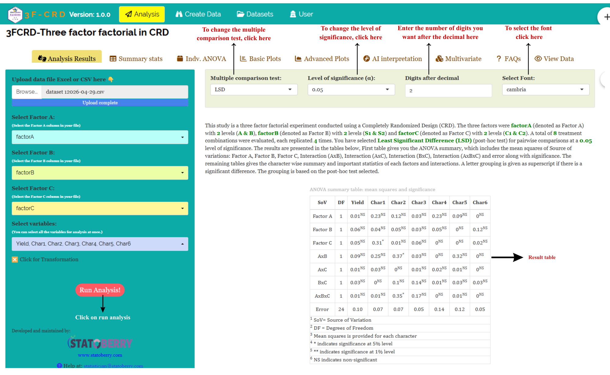

```{=html}
<style>
 sup {
   color: blue;
   font-size: 0.8em;
 }
 .affiliations {
   color: grey;
   font-size: 0.9em;
   margin-top: 0.2em;
 }
</style>
```

::: affiliations
<sup>1</sup>Statoberry LLP, <sup>2</sup>Department of Agricultural Statistics, Kerala Agricultural University
:::

ABSTRACT

::: {style="text-align: justify;"}
The **Three-Factor Completely Randomized Design (3FCRD)** is a factorial experimental design in which three independent factors are simultaneously studied, with all treatment combinations assigned completely at random to experimental units under homogeneous conditions. **3FCRD** allows researchers to evaluate not only the main effects of each factor, but also the two-way and three-way interaction effects, providing a comprehensive understanding of how factors jointly influence the response variable. In **RAISINS** you can perform **3FCRD** analysis very easily without writing a single line of code. This tutorial will guide you through how to perform **3FCRD** very easily in **RAISINS** and interpret the results effectively. In addition, you will get tables and plots ready for publication. You can also perform a multivariate analysis including MANOVA and PCA.
:::

<details>

*Hover or click each point to see more information.*

```{=html}
<summary style="color: #5DADE2"; font-weight: bold;">
  Introduction Three-Factor Completely Randomised Design
</summary>
```

```{=html}
<style>
.hover-img {
  position: relative;
  display: inline-block;
  cursor: help;
  border-bottom: 1px dashed currentColor;
}
.hover-img img {
  position: absolute;
  left: 50%;
  top: 1.6em;
  transform: translateX(-50%);
  width: 260px;
  max-width: 70vw;
  height: auto;
  padding: 6px;
  background: white;
  border: 1px solid rgba(0,0,0,.15);
  border-radius: 12px;
  box-shadow: 0 10px 30px rgba(0,0,0,.18);
  opacity: 0;
  visibility: hidden;
  pointer-events: none;
  transition: opacity .15s ease, transform .15s ease, visibility .15s;
}
.hover-img:hover img {
  opacity: 1;
  visibility: visible;
  transform: translateX(-50%) translateY(6px);
  z-index: 999;
}
</style>
```

<ul><small> The foundations of factorial experimental design were laid in the early twentieth century by [<strong>Sir Ronald A. Fisher</strong> ]{.hover-img}, the eminent British statistician and geneticist who worked at Rothamsted Experimental Station in Hertfordshire, England. In his landmark 1926 paper and later in his seminal book *The Design of Experiments* (1935), Fisher demonstrated that studying multiple factors simultaneously — rather than one at a time — was both more efficient and more informative, as it allowed the estimation of interaction effects that single-factor experiments could never reveal. The concept of complete randomization, which underpins the CRD and its factorial extensions, was articulated by Fisher as a means of eliminating systematic bias and ensuring the validity of the F-test. The Three-Factor Completely Randomized Design (3FCRD) naturally extends Fisher's original factorial framework to three independent factors, enabling researchers in agronomy, plant breeding, food science, and allied disciplines to study the combined and individual influences of three experimental variables within a single unified trial, without the imposition of any blocking structure, making it most suitable for controlled laboratory or greenhouse conditions where environmental uniformity can be assured. </small></ul>

</details>

## Analysis of experiments {#AE}

::: {style="text-align: justify;"}
To get started, visit **RAISINS** [www.raisins.live](https://www.raisins.live) home page and go to **Analysis of experiments**. Here, you can see different single-factor and multifactor experimental designs. In this tutorial, we focus on **Three-Factor Completely Randomized Design (3FCRD)**, as shown in @fig-aov.
:::

<!-- REPLACE THIS SCREENSHOT -->

{#fig-aov fig-align="center"}

## Three-Factor Completely Randomized Design (3FCRD) {#C}

::: {style="text-align: justify;"}
A **Three-Factor Completely Randomized Design (3FCRD)** is a factorial experiment in which three factors each at two or more levels are studied simultaneously, and all possible treatment combinations are assigned at random to experimental units without any restriction or blocking. This design is an extension of the one-way CRD to a three-factor factorial structure, enabling estimation of three main effects, three two-way interactions (Factor A × Factor B, Factor A × Factor C, and Factor B × Factor C), and one three-way interaction (Factor A × Factor B × Factor C). It is most appropriately used in controlled environments such as laboratory incubators, growth chambers, or greenhouses, where experimental units are sufficiently homogeneous and blocking is unnecessary. The complete randomization of all treatment combinations ensures an unbiased estimate of experimental error, though it may be less powerful than blocked designs when environmental variation exists. When heterogeneity among experimental units is suspected, a Three-Factor Randomized Block Design should be preferred over the 3FCRD.
:::

<details>

```{=html}
<summary style="color: #5DADE2"; font-weight: bold;">
  3FCRD Layout
</summary>
```

<ul>

<small>

@fig-lay visually represents a Three-Factor Completely Randomized Design arrangement with three factors (A, B, and C), each at multiple levels, forming a complete set of treatment combinations distributed randomly across all experimental units. Each cell in the layout corresponds to a unique combination of levels from all three factors (e.g., A₁B₁C₁, A₁B₁C₂, A₁B₂C₁, and so on), and these combinations are replicated and randomly assigned across experimental units. The complete randomization ensures that no systematic pattern influences the allocation of any treatment combination, preserving the integrity of the error estimate used in the factorial ANOVA.

<!-- REPLACE THIS SCREENSHOT -->

{#fig-lay fig-align="center"}

</small>

</ul>

</details>

::: callout-tip
#### Three-Factor Completely Randomized Design (3FCRD) is a factorial design in which all combinations of three independent factors are randomly assigned to homogeneous experimental units, enabling simultaneous estimation of main effects, two-way interactions, and the three-way interaction within a single experiment.
:::

## A working example {#W}

::: {style="text-align: justify;"}
To make things simple and interesting, we'll explain **3FCRD** analysis step by step using a hypothetical example, so you can clearly see how it works and why it matters. Consider an experiment conducted in a controlled greenhouse to evaluate the effects of three factors on the growth of tomato plants: **Factor A - Irrigation Level** (two levels: Low,High), **Factor B - Fertilizer Type** (three levels: Organic, Inorganic,chemical), and **Factor C - Plant Density** (two levels: Low density, High density). This gives a total of 2 × 3 × 2 = 12 treatment combinations, each replicated three times, resulting in 36 experimental units altogether. Three response variables are recorded for each experimental unit: **Yield** (fruit yield in g/plant), **Char1** (plant height in cm) and **Char2** (number of fruits per plant). Our aim is to test whether the three factors and their interactions produce statistically significant differences in the response variables using factorial ANOVA. The arrangement of the data is shown in the @fig-data.
:::

{#fig-data fig-align="center"}

::: {style="text-align: justify;"}
Data organised in MS Excel can be directly uploaded to **RAISINS** for analysis. For more details on data preparation see @sec-4. Two terms that we will use frequently are **Treatments** and **Variables**. In our example, the Treatments refer to the 12 unique combinations of Irrigation Level, Fertilizer Type, and Plant Density, and the Variables are the Three traits mentioned earlier - **Yield, Char 1 and Char 2.**
:::

## How to prepare your data? {#sec-4 .H}

::: {style="text-align: justify;"}
Arranging data for uploading in **RAISINS** is very simple. Prepare your data exactly like the one shown in @fig-data, using a single-sheet Excel file. Make sure no blank rows are left above, and all columns have proper names. That's it , your file is ready to upload.

Still if you have doubt, see @fig-4.

To prepare your dataset for analysis in **RAISINS**, you have two options:

Creating dataset in MS Excel

Creating your dataset directly within the **RAISINS** app
:::

<!-- REPLACE THIS SCREENSHOT -->

{#fig-4 fig-align="center"}

## 3FCRD analysis tab explained {#AO}

::: {style="text-align: justify;"}
In @fig-5, you can see the detailed view of the Analysis tab, along with explanations of what each option does. This section helps you to understand the purpose of every setting, so you can select the most appropriate ones for your data and analysis. Now, upload the prepared file by clicking Browse in the sidebar of the Analysis tab. When the file is uploaded, options to select Factor A, Factor B, Factor C, and the response variables will appear. Assign the appropriate columns to each of the three factors and to the variables. Once you click the Run Analysis button, all relevant results and outputs including main effects and interaction ANOVA tables appear instantly leaving no room for confusion.
:::

<!-- REPLACE THIS SCREENSHOT -->

{#fig-5 fig-align="center"}

::: {style="text-align: justify;"}
For some data, when there are large numbers of zeros, discrete values, or when the observed variables are not normally distributed, we need to apply a transformation on the dataset (@sec-6). Here, **RAISINS** provides an inbuilt transformation option.
:::

## Transformation {#sec-6 .T}

::: {style="text-align: justify;"}
Log, square root, and arcsine transformations are often used in 2F-RBD analysis to make data more normal and reduce uneven variation. Researchers can use these transformations when analyzing experimental data in **RAISINS** as shown in @fig-6.
:::

{#fig-6 fig-align="center"}

::: {style="text-align: justify;"}
**Logarithmic transformation** is a mathematical procedure used to convert a skewed distribution into a more symmetrical one by replacing each data point (x) with its logarithm. This technique is specifically applied to positive, continuous data where the variance is proportional to the mean, a relationship common in phenomena that exhibit multiplicative or exponential growth.

**Square root transformation** is a statistical method used to stabilize variance and reduce right-skewness by replacing each data point (x) with its square root. It is primarily applied to non-negative, discrete "count" data such as those following a Poisson distribution, where the variance of the data tends to increase in proportion to the mean. By compressing the upper end of the scale more significantly than the lower end, this transformation brings the data closer to a normal distribution, satisfying the homoscedasticity requirements of many parametric statistical tests.

**Arcsine transformation** (also known as the angular transformation) is a mathematical technique specifically designed for data expressed as proportions or percentages bounded between 0 and 1. By taking the inverse sine of the square root of the proportion, this transformation stretches the ends of the distribution near 0 and 1, where variance is naturally small. It is primarily used to achieve homoscedasticity in binomial data.
:::

> After choosing the appropriate transformation proceed to @sec-7 for analysis.

## Analysis results {#sec-7 .AR}

::: {style="text-align: justify;"}
Once your dataset is uploaded, click on Run Analysis, and a **factorial ANOVA** will be performed. Analysis of Variance **(ANOVA)** is a statistical technique used to test the significance of differences among population means by partitioning total variation into components attributable to Factor A, Factor B, Factor C, their two-way interactions (A×B, A×C, B×C), the three-way interaction (A×B×C), and experimental error, and comparing them using the F-test , see @fig-100.
:::

**Table 1 ANOVA summary**

<!-- REPLACE THIS SCREENSHOT -->

{#fig-100 fig-align="center"}

<details>

```{=html}
<summary style="color: #5DADE2"; font-weight: bold;"> ANOVA table </summary>
```

<small> In a **Three-Factor Completely Randomized Design (3FCRD)**, the analysis of variance **(ANOVA)** partitions the total sum of squares into contributions from Factor A (with degrees of freedom = a − 1), Factor B (df = b − 1), Factor C (df = c − 1), the A×B interaction (df = (a−1)(b−1)), the A×C interaction (df = (a−1)(c−1)), the B×C interaction (df = (b−1)(c−1)), the A×B×C interaction (df = (a−1)(b−1)(c−1)), and the experimental error (df = abc(r−1)), where a, b, c are the number of levels of Factors A, B, and C respectively, and r is the number of replications. Each source is tested against the error mean square using the F-ratio. Significance is indicated by an asterisk ( \* ) for the **5%** level and two asterisks (\*\*) for the **1%** level of significance, displayed as superscripts for each corresponding F statistic in the table. If the computed F value exceeds the critical value, the null hypothesis for that source is rejected, indicating that the corresponding main effect or interaction is statistically significant. </small>

</details>

### Interpretation from @fig-100

::: {style="text-align: justify;"}
In our hypothetical tomato experiment, the factorial ANOVA reveals that the main effect of Factor A (Irrigation Level) is highly significant (F = 18.42, df = 2 and 24, p \< 0.01), indicating that irrigation levels have a strong influence on fruit yield. Factor B (Fertilizer Type) is also significant (F = 9.17, df = 1 and 24, p \< 0.05), while Factor C (Plant Density) approaches significance (F = 4.63, df = 1 and 24, p \< 0.05). The A×B interaction is significant (F = 6.21, p \< 0.05), suggesting that the effect of fertilizer type depends on the irrigation level applied. The three-way interaction A×B×C, however, is non-significant (F = 1.84, p \> 0.05), indicating that the joint influence of all three factors combined does not produce an additional interaction beyond the two-way level. Since significant main effects and two-way interactions are present, post-hoc comparisons are appropriate and are discussed in @sec-8.
:::

**Table 2: Detailed tabular representation with multiple comparisons**

<!-- REPLACE THIS SCREENSHOT -->

{#fig-101 fig-align="center"}

**Table 3: Factor B - Detailed results with multiple comparisons**

<!-- REPLACE THIS SCREENSHOT -->

{fig-align="center"}

**Table 4: Factor C - Detailed results with multiple comparisons**

<!-- REPLACE THIS SCREENSHOT -->

{fig-align="center"}

**Table 5: Interaction (A × B) - Detailed results**

<!-- REPLACE THIS SCREENSHOT -->

{fig-align="center"}

<details>

```{=html}
<summary style="color: #5DADE2"; font-weight: bold;">Overview of ANOVA Results and Interpretation
</summary>
```

<small>

1.  *Treatments and Response Variables*

**Treatments**: The independent variable combinations in 3FCRD these are the unique combinations of Factor A, Factor B, and Factor C levels (e.g., Low-Organic-Low density, Medium-Inorganic-High density) being tested to determine their influence on the results.

**Response Variable**: The dependent variable or specific measurement (e.g., Yield in g/plant) recorded to evaluate the performance of the treatment combinations.

2.  *Multiple Comparisons*

**Post hoc Grouping**: A method of using letters (a, b, c) to categorize means. Items sharing the same letter are statistically similar, while those with different letters are significantly different.

3.  *ANOVA Summary*

**F stat**: A numerical value that compares the variance between different groups to the variance within those groups; it determines if the overall differences are statistically significant.

**p value**: The probability that the observed differences occurred by random chance. A value below 0.05 typically indicates that the results are statistically significant.

4.  *Critical Difference (CD) and Error Estimates*

**Critical Difference (CD)**: The minimum mathematical gap required between two means to declare them "significantly different" at a specific confidence level.

**Standard Error (SE)**: A measure of the accuracy of a sample mean compared to the true population mean; it indicates how much the mean might fluctuate.

**Mean Square Error (MSE)**: The average of the squared differences between observed values and the predicted mean; it represents the "noise" or unexplained error in the experiment.

**Coefficient of Variation (CV%)**: A percentage that shows the level of dispersion in the data. A lower CV indicates higher precision and reliability in the experimental measurements.

**Cohen's F**: A standardized measure of effect size that describes the magnitude of the experimental effect, regardless of the sample size. </small>

</details>

### Interpretation from @fig-101

::: {style="text-align: justify;"}
The multiple comparison results for Yield (g/plant) reveal clear groupings among the 12 treatment combinations. The combination of High irrigation with Inorganic fertilizer at Low plant density (A2B2C1) recorded the highest mean yield (320.4 g/plant) and was assigned the letter grouping "a", indicating it is significantly superior to all others. Combinations involving Medium irrigation with Organic fertilizer (A₂B₁) were assigned the grouping "b", being statistically at par with each other but significantly inferior to the top combination. Treatment combinations under Low irrigation consistently fell in the "c" or "bc" grouping, reflecting the limiting effect of water stress irrespective of fertilizer type or plant density. The LSD test was applied for pairwise comparisons. The Cohen's f value of 0.52 for Yield indicates a large effect size, confirming that the differences among treatment combinations are not only statistically significant but also practically meaningful. For Char1and Char 2 similar trends were observed, with high irrigation consistently favouring higher performance across all secondary variables.
:::

::: callout-tip
#### When a researcher uses Tukey's HSD or DMRT, each pairwise comparison produces a different value because the differences between the group means are unique.
:::

::: callout-tip
#### Cohen's f is a measure of effect size. It tells you how strong or meaningful the treatment effect is, independent of sample size.
:::

## Multiple comparison tests {#sec-8 .MCT}

<details>

```{=html}
<summary style="color: #5DADE2"; font-weight: bold;">
  What is Post-hoc test?
</summary>
```

<ul><small> Post-hoc test is a follow-up analysis, performed after finding a significant result in an overall statistical test (like ANOVA). Its purpose is to identify exactly which groups or treatments differ from each other. In other words, it helps to pinpoint where the differences lie between multiple groups, when the initial test shows that not all groups are the same.</small></ul>

</details>

::: {style="text-align: justify;"}
After obtaining a significant F-value in ANOVA under **3FCRD**, multiple comparison tests are employed to identify which treatment combination means differ significantly. Commonly used post-hoc tests include Least Significant Difference (LSD), Tukey's Honest Significant Difference (HSD), and Duncan's Multiple Range Test (DMRT), each differing in their level of error control and suitability depending on the number of treatment combinations and experimental conditions, see @fig-7.
:::

<!-- REPLACE THIS SCREENSHOT -->

{#fig-7 fig-align="center"}

<details>

```{=html}
<summary style="color: #5DADE2"; font-weight: bold;"> Post-hoc test </summary>
```

<small>

When the factorial ANOVA in a **Three-Factor Completely Randomized Design (3FCRD)** is significant, the following post hoc tests are commonly used for pairwise comparisons: Tukey's Honestly Significant Difference (HSD) test, and Fisher's Least Significant Difference (LSD) test.

**LSD (Least Significant Difference) Test**

The **Least Significant Difference (LSD)** test is a post hoc statistical procedure used to identify which specific treatment combination means differ significantly after the factorial ANOVA has indicated an overall significant effect. The LSD is calculated as $$\text{LSD} = t_{\alpha/2, \, df_{\text{error}}} \sqrt{\frac{2 \ \text{MSE}}{n}}$$

where, **t₍α/2, dfₑᵣᵣₒᵣ₎** is the critical t-value at the chosen significance level (e.g., 0.05), MSE is the mean square error from the ANOVA, and n is the number of replications per treatment combination under equal sample sizes.

**Tukey's Honestly Significant Difference (HSD)**

Tukey's test helps you find out exactly which pairs of treatment combination means differ significantly. It compares all possible pairs of treatment means while controlling the overall Type I error rate, so you avoid false positives when making multiple comparisons. In 3FCRD, this method works well because all treatment combinations are assigned completely at random to experimental units and the error variance is assumed homogeneous across all combinations.

**Duncan's Multiple Range Test (DMRT)**

After confirming significant overall differences via ANOVA, DMRT ranks the treatment combination means and calculates critical differences using the studentised range statistic (Q) and the standard error based on error variance from ANOVA. This systematic and sequential approach provides clear groupings of treatment combinations and has gained popularity in agricultural and food science research. </small>

</details>

**Which Post-hoc test to use?**

::: {style="text-align: justify;"}
The choice of the post hoc test completely relies on the researcher.

**LSD** is used for pairwise comparison of treatment combination means after a significant factorial ANOVA in **3FCRD**. It is most suitable when the number of treatment combinations is small and comparisons are limited, offering high sensitivity to detect differences, but it may increase Type I error when many treatment combinations are compared. In agricultural and horticultural experiments, LSD is the most commonly used post hoc procedure.

**Tukey's HSD** is preferred when there are many treatment combinations in a balanced **3FCRD**. It compares all possible pairs of treatment combination means while strictly controlling the family-wise error rate, making it a conservative and reliable method for multiple comparisons, particularly when the number of treatment combinations is large (e.g., 12 or more).

**DMRT** is commonly used in agricultural experiments with several treatment combinations. It ranks treatment combination means step-wise and tends to detect more significant differences than Tukey's HSD, though it is less conservative and carries a higher risk of Type I error.

In the example for those characters, a pairwise comparison was performed to identify significant differences between treatment combinations using the Least Significant Difference (LSD) test.
:::

## Summary stats {#SUM}

::: {style="text-align: justify;"}
If you need to know about the detailed values of the various statistical metrics of the treatment combinations, move to Summary stats under the Analysis.
:::

**Table 3: Summary statistics**

<!-- REPLACE THIS SCREENSHOT -->

{#fig-102 fig-align="center"}

<details>

```{=html}
<summary style="color: #5DADE2"; font-weight: bold;"> Table parameters </summary>
```

<small>

**Mean** The arithmetic average of all observations within a treatment combination. It represents the "typical" value for that specific combination of Factor A, Factor B, and Factor C levels.

**SD (Standard Deviation)** A measure of the amount of variation or dispersion of a set of values. A low SD indicates that the data points tend to be very close to the mean.

**SE (Standard Error)** Specifically the Standard Error of the Mean. It estimates how far the sample mean is likely to be from the true population mean. It is calculated as $$SE = \frac{\text{Standard deviation (SD)}}{\sqrt {n}}*100$$, where n is the number of observations.

**Min / Max** The lowest and highest recorded values within that specific treatment combination.

**CV (Coefficient of Variation)** The ratio of the standard deviation to the mean, expressed as a percentage $$CV = \frac{\text{Standard deviation (SD)}}{\text{Mean}}*100$$

**Skewness** A measure of the asymmetry of the probability distribution. Positive value: Data is skewed to the right. Negative value: Data is skewed to the left.

**Kurtosis** A measure of the "tailedness" of the distribution. A standard normal distribution has a kurtosis of 3; values lower than that indicate a flatter peak.

</small>

</details>

### Interpretations from @fig-102

::: {style="text-align: justify;"}
Among the 12 treatment combinations, A<sub>2</sub>B<sub>2</sub>C<sub>1</sub> (High irrigation, Inorganic fertilizer, Low plant density) recorded the highest mean Yield of 320.4 g/plant, while A<sub>1</sub>B<sub>1</sub>C<sub>2</sub> (Low irrigation, Organic fertilizer, High plant density) had the lowest mean Yield of 148.6 g/plant, illustrating the substantial influence of the three factors in combination. The CV values across treatment combinations ranged from 4.2% to 9.8%, indicating acceptable experimental precision overall, with most combinations showing low within-treatment variability. Standard deviations were generally small relative to the means, reflecting consistency among replications. For Char1 (plant height), skewness values were close to zero across most combinations, suggesting near-symmetric distributions. Kurtosis values were close to 3 for most treatment combinations, indicating distributions with tails consistent with a normal distribution, which supports the validity of the parametric ANOVA applied.
:::

## Individual ANOVA {#IA}

::: {style="text-align: justify;"}
If the user wants to get the individual ANOVA table for each variable, click on Individual ANOVA in the Analysis.

The significance of each main effect and interaction can be measured using the F-test and p value as in @fig-104.
:::

**Table 4: ANOVA table for Yield**

<!-- REPLACE THIS SCREENSHOT -->

{#fig-104 fig-align="center"}

<details>

```{=html}
<summary style="color: #5DADE2"; font-weight: bold;"> Table parameters </summary>
```

<small>

**Critical Difference (CD)** The minimum difference required between any two treatment combination means to consider them significantly different from each other. At a 1% level, you are 99% confident in the difference. At a 5% level, you are 95% confident.

**Coefficient of Variation (CV (%))** A relative measure of dispersion that expresses the standard deviation as a percentage of the mean. $$CV = \frac{\text{Standard deviation (SD)}}{\text{Mean}}*100$$

**Mean Square Error (MSE)** The Residual Mean Sum of Squares from the ANOVA table. It represents the "noise" or unexplained variance in the experiment.

**Standard Error of Mean (SE(m))** Measures how much the sample mean of a treatment combination is likely to vary from the true population mean. $$ SE(m)=\sqrt{MSE / r}$$ Where, r is the number of replications.

**Standard Error of Difference (SE(d))** The standard error associated with the difference between two treatment combination means. $$ SE(d)=\sqrt{2 \times MSE / r}$$

</small>

</details>

### Interpretation from @fig-104

::: {style="text-align: justify;"}
For Yield (g/plant), the treatment effect in the individual ANOVA table shows a treatment mean square of 2,148.6 and an error mean square of 116.4, yielding an F-value of 18.46 with degrees of freedom 11 and 24, which is significant at the 1% level (p \< 0.01). The MSE of 116.4 reflects moderate within-treatment variability, consistent with a controlled greenhouse experiment. The SE(m) is 6.22 and the SE(d) is 8.80, indicating acceptable precision in estimating treatment means and their differences. The CD at the 5% level is 18.14 and at the 1% level is 24.53, meaning that two treatment combination means must differ by at least 18.14 g/plant to be declared significantly different at the 5% level. The CV% of 6.3% indicates good experimental precision, confirming reliable data collection and a well-managed trial.
:::

## Basic plots {#BP}

::: {style="text-align: justify;"}
**RAISINS** is designed for a smooth and hassle-free experience. Once you click the Run Analysis button, all relevant results and outputs appear instantly leaving no room for confusion. We've ensured that every possible plot related to the **Three-Factor Completely Randomized Design** is readily available. Simply click on the Basic Plots tab to view them, see @fig-8. Each plot comes with a gear icon at the top-left corner, allowing you to customize its appearance. You can also download these plots in high-quality PNG format (300 dpi), JPEG, TIFF, PDF and SVG for use in reports or presentations.
:::

### Customizing plots

::: {style="text-align: justify;"}
**RAISINS** provides users various customization features for the plots to enhance the visualization according to the requirement of the user. **Click** on @fig-8 to get a clear idea on the customizing features.
:::

{#fig-8 fig-align="center"}

::: {style="text-align: justify;"}
From @fig-9 to @fig-13, you can see the different types of plots available in RAISINS. Each one is visually illustrated and accompanied by a clear, insightful description below, making it easy to understand.
:::

```{=html}
<script>
document.addEventListener('DOMContentLoaded', function() {
  const descriptions = document.querySelectorAll('.plot-description');
  descriptions.forEach(desc => {
    desc.style.display = 'none';
  });
});

function showDescription(id) {
  document.getElementById(id).style.display = 'flex';
}

function hideDescription(id) {
  document.getElementById(id).style.display = 'none';
}
</script>
```

```{=html}
<style>
.plot-container {
  position: relative;
  display: inline-block;
  cursor: pointer;
  width: 350px;
  height: 300px;
  overflow: hidden;
  margin: 10px;
}
.plot-container img {
  width: 350px;
  height: 300px;
  object-fit: cover;
  border: 3px solid #ddd;
  border-radius: 8px;
  transition: transform 0.3s ease, box-shadow 0.3s ease;
}
.plot-container:hover img {
  transform: scale(1.05);
  box-shadow: 0 4px 12px rgba(0, 0, 0, 0.2);
}
.plot-description {
  display: none !important;
  position: absolute;
  top: 0; left: 0;
  width: 100%; height: 100%;
  z-index: 1000;
  color: white;
  padding: 15px;
  border-radius: 8px;
  box-shadow: 0 4px 15px rgba(0, 0, 0, 0.3);
  font-size: 14px;
  line-height: 1.5;
  display: flex;
  align-items: center;
  justify-content: center;
  text-align: center;
  animation: fadeIn 0.3s ease-in;
  pointer-events: none;
  border: 2px solid rgba(255, 255, 255, 0.5);
}
.plot-container:hover .plot-description {
  display: flex !important;
}
@keyframes fadeIn {
  from { opacity: 0; transform: scale(0.95); }
  to { opacity: 1; transform: scale(1); }
}
#boxplot-desc { background: linear-gradient(135deg, rgba(255, 107, 107, 0.8), rgba(255, 142, 83, 0.8)); }
#barplot-desc { background: linear-gradient(135deg, rgba(161, 140, 209, 0.8), rgba(251, 194, 235, 0.8)); }
#connectedplot-desc { background: linear-gradient(135deg, rgba(0, 221, 235, 0.8), rgba(38, 166, 154, 0.8)); }
#meanvalueplot-desc { background: linear-gradient(135deg, rgba(255, 154, 139, 0.8), rgba(255, 106, 136, 0.8)); }
#violinplot-desc { background: linear-gradient(135deg, rgba(132, 250, 176, 0.8), rgba(143, 211, 244, 0.8)); }
</style>
```

:::::::::::::::::::::::: grid
:::::: g-col-6
::::: {.plot-container onmouseover="showDescription('boxplot-desc')" onmouseout="hideDescription('boxplot-desc')"}
<!-- REPLACE THIS SCREENSHOT -->

{#fig-9}

:::: {#boxplot-desc .plot-description}
::: {style="text-align: justify;"}
A **box plot** compares the distribution of values across different treatment combinations. Each colored box represents a treatment combination and shows key statistics: the median (middle line), the interquartile range (the box itself), and potential outliers (points outside the whiskers). Letters above each box indicate statistical grouping treatment combinations sharing letters are statistically similar, while those with different letters are significantly different.
:::
::::
:::::
::::::

:::::: g-col-6
::::: {.plot-container onmouseover="showDescription('violinplot-desc')" onmouseout="hideDescription('violinplot-desc')"}
<!-- REPLACE THIS SCREENSHOT -->

{#fig-10}

:::: {#violinplot-desc .plot-description}
::: {style="text-align: justify;"}
A **violin plot** compares the distribution of values across different treatment combinations. Each treatment combination is shown as a violin shape that reflects how the data is spread wider sections mean more data points at that value. Inside each violin is a box plot showing the median and interquartile range. Letters above each plot indicate statistical groupings: treatment combinations sharing letters are statistically similar, while those with different letters are significantly different.
:::
::::
:::::
::::::

:::::: g-col-6
::::: {.plot-container onmouseover="showDescription('barplot-desc')" onmouseout="hideDescription('barplot-desc')"}
<!-- REPLACE THIS SCREENSHOT -->

{#fig-11}

:::: {#barplot-desc .plot-description}
::: {style="text-align: justify;"}
A **Bar plot** compares the average values of different treatment combinations, with error bars showing variability. The letters above each bar indicate statistical groupings: treatment combinations sharing letters are similar, while those with different letters are significantly different. It highlights which treatment combinations have higher or lower averages and whether those differences are meaningful.
:::
::::
:::::
::::::

:::::: g-col-6
::::: {.plot-container onmouseover="showDescription('meanvalueplot-desc')" onmouseout="hideDescription('meanvalueplot-desc')"}
<!-- REPLACE THIS SCREENSHOT -->

{#fig-12}

:::: {#meanvalueplot-desc .plot-description}
::: {style="text-align: justify;"}
A **mean value plot** compares the mean values of different treatment combinations, each shown as a colored dot with horizontal error bars indicating variability. Letters next to each point represent statistical groupings: treatment combinations sharing letters are statistically similar, while those with different letters are significantly different.
:::
::::
:::::
::::::

::::::: g-col-6
:::::: {.plot-container onmouseover="showDescription('connectedplot-desc')" onmouseout="hideDescription('connectedplot-desc')"}
::: {style="text-align: center;"}
<!-- REPLACE THIS SCREENSHOT -->

{#fig-13}
:::

:::: {#connectedplot-desc .plot-description}
::: {style="text-align: justify;"}
A **connected line plot** compares the mean values of different treatment combinations, with each point representing a treatment combination's average and error bars showing variability. The points are linked by lines to highlight trends across treatment combinations. Letters above each point indicate statistical groupings: treatment combinations sharing letters are statistically similar, while those with different letters are significantly different.
:::
::::
::::::
:::::::
::::::::::::::::::::::::

## Advanced plots {#AP}

::: {style="text-align: justify;"}
**RAISINS** also provides advanced plots which go beyond basic bar charts and histograms to give deeper insight into your data, especially distributions, relationships, and deviations from expectations, see @fig-90.
:::

<!-- REPLACE THIS SCREENSHOT -->

{#fig-90 fig-align="center"}

**INTERACTION PLOT**

<!-- REPLACE THIS SCREENSHOT -->

{#fig-14 fig-align="center"}

::: {style="text-align: justify;"}
Explains how it reveals whether the effect of one factor changes across levels of another, with parallel vs. crossing lines interpreted in the context of the A×B interaction found in the tomato experiment.
:::

**3D SCATTER PLOT**

<!-- REPLACE THIS SCREENSHOT -->

{#fig-15 fig-align="center"}

::: {style="text-align: justify;"}
Describes how three response variables (Yield, Char 1, Char 2) are plotted simultaneously in 3D space, with colour coded points per treatment combination to visualize multivariate clustering across the factorial structure..
:::

**3D SCATTER PLOT WITH LINE**

<!-- REPLACE THIS SCREENSHOT -->

{#fig-16 fig-align="center"}

::: {style="text-align: justify;"}
Extends the 3D scatter by connecting replicated observations within each treatment combination via trajectory lines, showing within-combination consistency and between-combination separation in multivariate space..
:::

## AI interpretation {#AI}

::: {style="text-align: justify;"}
RAISINS is equipped with an AI-powered RAISINS Assistant designed to assist users in comprehending the outcomes of statistical tests and data analysis. This functionality provides clear and concise summaries of results, identifies statistically significant main effects and interactions, and offers informed suggestions for potential next steps or interpretations relevant to the **3FCRD** structure. The user can get detailed interpretations of the analysis by clicking on AI interpretation on the Analysis as shown below @fig-ai.
:::

{#fig-ai fig-align="center"}

## Multivariate {#MUL}

::: {style="text-align: justify;"}
Multivariate analysis in **Three-Factor Completely Randomized Design (3FCRD)** helps you to compare different response variables simultaneously across all treatment combinations. Remember that the PCA used for multivariate selection is an exploratory technique, not an inferential method. Now, in our example the evaluation of tomato growth under combinations of Irrigation Level (Low, High), Fertilizer Type (Organic, Inorganic and Chemical), and Plant Density (Low, High) navigate to Multivariate, see @fig-mu.
:::

<!-- REPLACE THIS SCREENSHOT -->

{#fig-mu}

::: {style="text-align: justify;"}
MANOVA and PCA will be automatically carried out based on the selected variables. MANOVA table with interpretation appears automatically. PCA results and plots will appear along with automated interpretation.
:::

<!-- REPLACE THIS SCREENSHOT -->

{#fig-MAN2 fig-align="center"}

::: {style="text-align: justify;"}
The table titled 'Eigen Values PCA' given @fig-PC provides information about the eigen values and the percentage of variance explained by each principal component. The principal components PC1 and PC2 have eigenvalues greater than one and are considered important for further analysis. PC1 accounts for approximately 58% of the variance in the dataset, while PC2 accounts for about 22% of the variance. Together, PC1 and PC2 explain approximately 80% of the total variance (termed as cumulative variance). Since PC1 explains more than 40% of the variance, a PC1-based index score is a strong consideration. Additionally, since both PCs together explain more than 60% of the variance in the data, an index score based on both PCs is also appropriate. The scree plot below illustrates the proportion of variance explained by each principal component.
:::

<!-- REPLACE THIS SCREENSHOT -->

{#fig-PC}

::: {style="text-align: justify;"}
The scree plot given @fig-screeplot illustrates the proportion of variance explained by each principal component.
:::

<!-- REPLACE THIS SCREENSHOT -->

{#fig-screeplot fig-align="center"}

::: {style="text-align: justify;"}
Look upon the loadings of each variable in the given @fig-loadings and decide which PC-based index needs to be selected. In our example, Yield and Char 2 (number of fruits) show strong positive loadings on PC1, indicating that treatment combinations with high irrigation and inorganic fertilizer drive high values on this component. Char 1 (plant height) has a moderate positive loading on both PC1 and PC2. Variables with high and positive loadings on the same principal component are positively correlated with each other. Since Yield and Char 2 are all important performance traits, a PC1-based index is most appropriate for ranking the 12 treatment combinations. It is recommended to use variables that are highly correlated for PCA, as this helps in constructing a more reliable and meaningful index.
:::

<!-- REPLACE THIS SCREENSHOT -->

{#fig-loadings fig-align="center"}

::: {style="text-align: justify;"}
The biplot gives a visual representation of the relationships among variables and treatment combinations. Treatment combinations with high values for a specific variable are positioned in the direction of that variable. The angle between variables in the biplot indicates their correlation smaller angles suggest high positive correlation, while larger angles close to 90 degrees suggest weak or no correlation.
:::

<!-- REPLACE THIS SCREENSHOT -->

{#fig-biplot}

::: {style="text-align: justify;"}
In RAISINS, we calculate a scaled index score by converting the index score to a range of 0 to 1, making it easier to interpret and compare. This standardized approach ensures consistency in evaluating treatment combinations based on their index scores. To refine your selection, use the 'Select cutoff for Scaled Index Score' feature given as in @fig-indexscore, where you can choose the cutoff percentage to select treatment combinations above or below a certain threshold. The default cutoff is set at 75%. By toggling the up-arrow and down-arrow buttons below the cutoff selection, you can select the top or bottom percentage of treatment combinations as per your preference. Selected treatment combinations are highlighted in yellow in the table below, providing a clear visual cue. Additionally, a plot based on the index scores is also displayed to aid in your analysis.
:::

<!-- REPLACE THIS SCREENSHOT -->

{#fig-indexscore fig-align="center"}

<!-- REPLACE THIS SCREENSHOT -->

{#fig-index fig-align="center"}

::: {style="text-align: justify;"}
Combining all this information, the experimenter can arrive at an overall conclusion that is statistically sound and contextually relevant to their study, identifying which combination of Irrigation Level, Fertilizer Type, and Plant Density produces the most favourable overall performance across all measured traits.
:::

## Preparing your data {#PRE}

::: {style="text-align: justify;"}
"Your analysis is only as good as your data! Feed RAISINS high-quality data, and it will deliver powerful insights feed it messy data, and the results won't be trustworthy."

1.  Create your dataset in MS Excel

2.  Build your dataset directly within the RAISINS app
:::

## Preparing data in MS Excel {#EX}

::: {style="text-align: justify;"}
Open a new blank sheet in MS Excel with only one sheet included, and avoid adding any unnecessary content. The data set should follow a column-based format, where the first three columns represent Factor A, Factor B, and Factor C respectively you can name these columns appropriately, such as "Irrigation Level", "FertilizerType", and "Plant Density". All characters under study (e.g., Yield, Char1 and Char2) should be arranged in separate subsequent columns, and each treatment combination should be repeated according to the number of replications. The file can be saved in CSV, XLS, or XLSX format, but CSV is recommended as it is lighter and enables faster loading. Ensure that there are no unwanted spaces in column names or factor level names. For reference, see the structure shown in @fig-pp. As illustrated in @fig-data, treatment combinations must appear repeatedly based on replications, and the data can also be arranged as shown in @fig-kk.
:::

{#fig-pp}

{#fig-kk}

<details>

<summary>Data set Creation Rules</summary>

<small> 1. **Column Naming Convention** - No spaces allowed in column names.\
- Use underscores (`_`) or full stops (`.`) for separation. - Avoid symbols and special characters like %,# etc 2. **Data Arrangement** - Start data arrangement towards the upper-left corner.\
- Ensure the row above the data is not blank. 3. **Cell Management** - Avoid typing or deleting in cells without data.\
- If needed, select affected cells, right-click, and select **Clear Contents**. 4. **Column Relevance** - Name all columns meaningfully.\
- Exclude unnecessary columns not required for analysis. </small>

</details>

<details>

<summary>How to Save as CSV in MS Excel</summary>

<small> 1. **Open Your Workbook**

```         
-   Ensure your data is arranged properly with only one sheet.
```

2.  **Click 'File' Menu**

    - Go to the top-left corner and click on **File**.

3.  **Click 'File' Menu**

    - Go to the top-left corner and click on **File**.

4.  **Choose 'Save As' or 'Save a Copy'**

    - Select the location where you want to save your file.

5.  **Set File Type to CSV**

    - In the **'Save as type'** drop down menu, choose **CSV (Comma delimited) (\*.csv)**.

6.  **Name Your File**

    - Enter a relevant file name without spaces (use underscores if needed).

7.  **Click 'Save'**

    - Click **Save** to export the file.

> 💡 Tip: Before saving, double-check that your data is on the first sheet and follows the required format (e.g., no empty rows above the data, meaningful column names, all three factor columns correctly labelled). </small>

</details>

## Creating dataset in RAISINS {#CR}

::: {style="text-align: justify;"}
If you're unsure about the correct format for creating a data set, don't worry RAISINS offers an option to create data directly within the app using the prescribed template. Here's how:

- Navigate to the **Create Data Tab**

- Select the number of **Treatments**

- Select number of **Replications**

- Select number of **Characters**

- Click on **Create** button

Model layout will appear as shown in @fig-createdata. Now you may enter the observations manually into the CSV file once downloaded, or paste the observations straight into the file provided. Once you have entered the observations in the layout, download the csv file and upload in Analysis.
:::

{#fig-createdata}

## Model datasets {#M}

::: {style="text-align: justify;"}
To test the app or better understand the data arrangement, we provide model data sets within the app. You can download them from the Datasets.
:::

{#fig-188 fig-align="center"}

## FAQ's {#F}

::: {style="text-align: justify;"}
The app includes a dedicated FAQs to help clarify common doubts and guide users through various features. This section provides detailed answers to frequently asked questions, offering additional information and helpful tips to ensure a smooth user experience. If you're ever unsure about how something works, the FAQs is a great place to start.
:::

{#fig-148 fig-align="center"}

## View data {#U}

::: {style="text-align: justify;"}
View Data serves as the primary diagnostic tool for ensuring data integrity before analysis. Upon uploading your data set, the system performs an automated Health Check to validate column types and formatting, including verification that all three factor columns are correctly recognized and that treatment combination labels are consistent across all rows.
:::

{fig-align="center"}

------------------------------------------------------------------------

::: :::::::::::::::::::
:::