```{=html}
<style>
 sup {
   color: blue;
   font-size: 0.8em;
 }
 .affiliations {
   color: grey;
   font-size: 0.9em;
   margin-top: 0.2em;
 }
</style>
```

::: affiliations
<sup>1</sup>Statoberry LLP, <sup>2</sup>Department of Agricultural Statistics, Kerala Agricultural University
:::

ABSTRACT

::: {style="text-align: justify;"}
Three-Factor Randomized Block Design **(3FRBD)** is an advanced experimental design used to evaluate the simultaneous effects of three independent factors and their interactions on one or more response variables, while controlling for extraneous variation through blocking. **3FRBD** assigns treatment combinations formed by crossing all levels of three factors randomly within each block, ensuring that environmental or spatial heterogeneity is accounted for across replications. In **RAISINS** you can perform **3FRBD** very easily without writing a single line of code. This tutorial will guide you, how to perform **3FRBD** very easily in **RAISINS** and interpret the results effectively. In addition, you will get tables and plots ready for publication. You can also perform a multivariate analysis including MANOVA and PCA.
:::

<details>

*Hover or click each point to see more information.*

```{=html}
<summary style="color: #5DADE2"; font-weight: bold;">
  Introduction Three-Factor Randomised Block Design
</summary>
```

```{=html}
<style>
.hover-img {
  position: relative;
  display: inline-block;
  cursor: help;
  border-bottom: 1px dashed currentColor;
}
.hover-img img {
  position: absolute;
  left: 50%;
  top: 1.6em;
  transform: translateX(-50%);
  width: 260px;
  max-width: 70vw;
  height: auto;
  padding: 6px;
  background: white;
  border: 1px solid rgba(0,0,0,.15);
  border-radius: 12px;
  box-shadow: 0 10px 30px rgba(0,0,0,.18);
  opacity: 0;
  visibility: hidden;
  pointer-events: none;
  transition: opacity .15s ease, transform .15s ease, visibility .15s;
}
.hover-img:hover img {
  opacity: 1;
  visibility: visible;
  transform: translateX(-50%) translateY(6px);
  z-index: 999;
}
</style>
```

<ul><small> The foundations of factorial experimental designs were laid in the **1920s and 1930s** by statistician [<strong>Ronald A. Fisher</strong> ]{.hover-img}, who recognized that studying factors one at a time was inefficient and often misleading. Fisher's pioneering work at Rothamsted Experimental Station demonstrated that crossing multiple factors in a single experiment not only saves resources but also reveals interaction effects that single-factor designs cannot detect. The extension of factorial principles to three factors within a randomized block framework evolved naturally from these contributions, allowing researchers to study the combined effects of, for example, variety, fertilizer level, and irrigation regime simultaneously. The **Three-Factor Randomized Block Design (3FRBD)** became indispensable in agricultural, biological, and industrial research wherever multiple interacting factors needed to be assessed under field conditions with heterogeneous experimental units. By incorporating blocks to absorb systematic environmental variation, 3FRBD delivers higher precision than a fully randomized factorial arrangement, making it one of the most powerful and widely used designs in experimental science. </small></ul>

</details>

## Analysis of experiments {#AE}

::: {style="text-align: justify;"}
To get started, visit **RAISINS** [www.raisins.live](https://www.raisins.live) home page and go to **Analysis of experiments**. Here, you can see different multi-factor experimental designs. In this tutorial, we focus on **Three-Factor Randomized Block Design (3FRBD)**, as shown in @fig-aov.
:::

<!-- REPLACE THIS SCREENSHOT -->

{#fig-aov fig-align="center"}

## Three-Factor Randomized Block Design (3FRBD) {#C}

::: {style="text-align: justify;"}
A Three-Factor Randomized Block Design (**3FRBD**) is a factorial experimental design in which all possible combinations of three factors each at two or more levels are arranged within homogeneous blocks, with each complete set of treatment combinations appearing once per block. The design simultaneously evaluates the main effects of each factor and their two-way and three-way interactions, while the blocks absorb variation due to environmental gradients, soil heterogeneity, time, or any other systematic nuisance variable. **3FRBD** is widely used in agricultural field trials, greenhouse experiments, pharmaceutical studies, and industrial process optimization wherever multiple interacting factors must be evaluated under conditions that are not fully homogeneous. Its primary advantage over single-factor designs is the ability to detect interaction effects, which are often the most agronomically important findings; its main limitation is the increased number of treatment combinations, which can make block sizes large and difficult to manage when factors have many levels in such cases, incomplete block designs or split-plot arrangements may be more appropriate.
:::

<details>

```{=html}
<summary style="color: #5DADE2"; font-weight: bold;">
  3FRBD Layout
</summary>
```

<ul>

<small>

@fig-lay visually represents a Three-Factor Randomized Block Design arrangement where three factors Factor A (e.g., Variety: a~1~, a~2~), Factor B (e.g., Fertilizer: b~1~, b~2~), and Factor C (e.g., Irrigation: c~1~, c~2~) are fully crossed to produce 2 × 2 × 2 = 8 treatment combinations. These eight combinations (a~1~b~1~c~1~, a~1~b~1~c~2~, a~1~b~2~c~1~, etc.) are randomized independently within each block, so every combination appears exactly once per block. Each block represents a homogeneous group of experimental units such as a contiguous strip of field or a greenhouse bench, and the blocks are replicated across the experiment to provide the error degrees of freedom needed for hypothesis testing. Randomization within blocks ensures unbiased estimation of treatment effects while blocking removes known sources of environmental variation from the error term, increasing the sensitivity of the F-tests.

<!-- REPLACE THIS SCREENSHOT -->

{#fig-lay fig-align="center"}

</small>

</ul>

</details>

::: callout-tip
#### Three-Factor Randomized Block Design (3FRBD) is a factorial experimental design where all combinations of three factors are randomized within homogeneous blocks, enabling simultaneous estimation of main effects, two-way interactions, and the three-way interaction while controlling for environmental heterogeneity.
:::

## A working example {#W}

::: {style="text-align: justify;"}
To make things simple and interesting, we'll explain **3FRBD** analysis step by step using a hypothetical example, so you can clearly see how it works and why it matters. Consider a field experiment conducted to evaluate the effects of three factors on rice production: **Factor A Variety** (V~1~: IR64, V~2~: Swarna), **Factor B Nitrogen level** (N~1~: 60 kg/ha, N~2~: 90 kg/ha, N~3~ :120 kg/ha) and **Factor C Irrigation frequency** (I~1~: Alternate wetting and drying, I~2~: Continuous flooding). The full factorial crossing of these three factors produces 2 × 3 × 2 = **12 treatment combinations**, replicated across **3 blocks**, giving a total of 36 experimental plots. Observations were recorded for four variables: **yield** (grain yield in kg/ha), **Char1** (plant height in cm) and **Char 2** (number of tillers per plant).Our aim is to test whether the three factors and their interactions produce statistically significant differences in the response variables using ANOVA. The arrangement of the data is shown in @fig-data.
:::

<!-- REPLACE THIS SCREENSHOT -->

{#fig-data fig-align="center"}

::: {style="text-align: justify;"}
Data organized in MS Excel can be directly uploaded to **RAISINS** for analysis. For more details on data preparation see @sec-4. Two terms that we will use frequently are **Treatments** and **Variables**. In our example, the Treatments refer to the 12 treatment combinations formed by crossing Variety, Nitrogen level, and Irrigation frequency, and the Variables are the four traits mentioned earlier **yield, Char 1 and Char 2.**
:::

## How to prepare your data? {#sec-4 .H}

::: {style="text-align: justify;"}
Arranging data for uploading in **RAISINS** is very simple. Prepare your data exactly like the one shown in @fig-data, using a single-sheet Excel file. Make sure no blank rows are left above, and all columns have proper names. That's it - your file is ready to upload.

Still if you have doubt, see @fig-4.

To prepare your dataset for analysis in **RAISINS**, you have two options:

Creating dataset in MS Excel

Creating your dataset directly within the **RAISINS** app
:::

{#fig-4 fig-align="center"}

## 3FRBD analysis tab explained {#AO}

::: {style="text-align: justify;"}
In @fig-5, you can see the detailed view of the Analysis tab, along with explanations of what each option does. This section helps you to understand the purpose of every setting, so you can select the most appropriate ones for your data and analysis. Now, upload the prepared file by clicking Browse in the sidebar of the Analysis tab. When the file is uploaded, options to select Factor A, Factor B, Factor C, Block, and the response variables will appear. Select the appropriate columns under each factor, block, and variables. Once you click the Run Analysis button, all relevant results and outputs appear instantly leaving no room for confusion.
:::

<!-- REPLACE THIS SCREENSHOT -->

{#fig-5 fig-align="center"}

::: {style="text-align: justify;"}
For some data, when there are a large number of zeros, discrete values, or when the observed variables are not normally distributed, we need to apply a transformation on the dataset (@sec-6). Here, **RAISINS** provides an inbuilt transformation option.
:::

## Transformation {#sec-6 .T}

::: {style="text-align: justify;"}
Log, square root, and arcsine transformations are often used in **3FRBD** analysis to make data more normal and reduce uneven variation. Researchers can use these transformations when analyzing experimental data in **RAISINS** as shown in @fig-6.
:::

{#fig-6 fig-align="center"}

::: {style="text-align: justify;"}
**Logarithmic transformation** is a mathematical procedure used to convert a skewed distribution into a more symmetrical one by replacing each data point (x) with its logarithm. This technique is specifically applied to positive, continuous data where the variance is proportional to the mean, a relationship common in phenomena that exhibit multiplicative or exponential growth.

**Square root transformation** is a statistical method used to stabilize variance and reduce right-skewness by replacing each data point (x) with its square root. It is primarily applied to non-negative, discrete "count" data such as those following a Poisson distribution, where the variance of the data tends to increase in proportion to the mean. By compressing the upper end of the scale more significantly than the lower end, this transformation brings the data closer to a normal distribution, satisfying the homoscedasticity requirements of many parametric statistical tests.

**Arcsine transformation** (also known as the angular transformation) is a mathematical technique specifically designed for data expressed as proportions or percentages bounded between 0 and 1. By taking the inverse sine of the square root of the proportion, this transformation stretches the ends of the distribution near 0 and 1, where variance is naturally small. It is primarily used to achieve homoscedasticity in binomial data.
:::

> After choosing the appropriate transformation proceed to @sec-7 for analysis.

## Analysis results {#sec-7 .AR}

::: {style="text-align: justify;"}
Once your dataset is uploaded, click on Run Analysis, and a factorial **ANOVA** will be performed. Analysis of Variance **(ANOVA)** is a statistical technique used to test the significance of differences among population means by partitioning total variation into components attributable to **Factor A**, **Factor B**, **Factor C**, their **two-way interactions (A×B, A×C, B×C)**, the **three-way interaction (A×B×C)**, **Blocks**, and **Error**, and comparing them using the F-test (see @fig-100).
:::

**Table 1 ANOVA summary**

<!-- REPLACE THIS SCREENSHOT -->

{#fig-100 fig-align="center"}

<details>

```{=html}
<summary style="color: #5DADE2"; font-weight: bold;"> ANOVA table </summary>
```

<small> In a Three-Factor Randomized Block Design (**3FRBD**), the analysis of variance **(ANOVA)** partitions the total sum of squares into sources attributable to Blocks, Factor A (Variety), Factor B (Nitrogen), Factor C (Irrigation), and all interaction terms (A×B, A×C, B×C, A×B×C), plus the Residual Error. The degrees of freedom for each source are: Blocks = r−1 (where r = number of blocks), Factor A = a−1, Factor B = b−1, Factor C = c−1, A×B = (a−1)(b−1), A×C = (a−1)(c−1), B×C = (b−1)(c−1), A×B×C = (a−1)(b−1)(c−1), and Error = (r−1)(abc−1). Each mean square is obtained by dividing the sum of squares by its degrees of freedom, and the F-statistic for each source is the ratio of its mean square to the Error mean square. Significance is indicated by an asterisk (\*) for the **5%** level and two asterisks (\*\*) for the **1%** level of significance, displayed as superscripts for each corresponding F stat in the table. If the computed F value exceeds the critical value, the null hypothesis for that source is rejected, indicating a statistically significant effect or interaction. </small>

</details>

### Interpretation from @fig-100

::: {style="text-align: justify;"}
In the hypothetical example, the ANOVA results reveal highly significant main effects for all three factors. Factor A (Variety) shows a treatment mean square of 182,450.60 with an F-ratio of approximately 17.21, with 2 degrees of freedom for treatment and 22 for error, significant at the 1% level. Factor B (Nitrogen) yields an F-ratio of approximately 24.35 (1 df), and Factor C (Irrigation) an F-ratio of approximately 11.78 (1 df), both significant at the 1% level. Among the interaction terms, the A×B interaction is significant at the 5% level (F ≈ 3.94, 2 df), while A×C, B×C, and the three-way A×B×C interaction are non-significant, indicating that the variety-by-nitrogen interaction is the most practically relevant finding. The Block mean square is also significant, confirming that blocking effectively removed meaningful environmental variation. These results indicate that the null hypothesis of no treatment effect can be rejected for the main effects and the A×B interaction, and that further post hoc tests are appropriate for pairwise comparisons. @sec-8 provides detailed information on the multiple comparison tests (Post hoc tests).
:::

**Table 2: Factor A-Detailed tabular representation with multiple comparisons**

<!-- REPLACE THIS SCREENSHOT -->

{#fig-101 fig-align="center"}

**Table 3: Factor B - Detailed results with multiple comparisons**

<!-- REPLACE THIS SCREENSHOT -->

{fig-align="center"}

**Table 4: Factor C - Detailed results with multiple comparisons**

<!-- REPLACE THIS SCREENSHOT -->

{fig-align="center"}

**Table 5: Interaction (A × B) - Detailed results**

<!-- REPLACE THIS SCREENSHOT -->

{fig-align="center"}

<details>

```{=html}
<summary style="color: #5DADE2"; font-weight: bold;">Overview of ANOVA Results and Interpretation
</summary>
```

<small>

1.  *Treatments and Response Variables*

**Treatments**: The independent variable or specific combination of factor levels (e.g., V~2~N~2~I~2~ — Swarna at 90 kg N/ha under continuous flooding) being tested to determine its influence on the results.

**Response Variable**: The dependent variable or specific measurement (e.g., grain yield in kg/ha) recorded to evaluate the performance of the treatment combinations.

2.  *Multiple Comparisons*

**Post hoc Grouping**: A method of using letters (a, b, c) to categorize means. Items sharing the same letter are statistically similar, while those with different letters are significantly different.

3.  *ANOVA Summary*

**F stat**: A numerical value that compares the variance between different groups to the variance within those groups; it determines if the overall differences are statistically significant.

**p value**: The probability that the observed differences occurred by random chance. A value below the chosen significance threshold typically indicates that the results are statistically significant.

4.  *Critical Difference (CD) and Error Estimates*

**Critical Difference (CD)**: The minimum mathematical gap required between two means to declare them "significantly different" at a specific confidence level.

**Standard Error (SE)**: A measure of the accuracy of a sample mean compared to the true population mean; it indicates how much the mean might fluctuate.

**Mean Square Error (MSE)**: The average of the squared differences between observed values and the predicted mean; it represents the "noise" or unexplained error in the experiment.

**Coefficient of Variation (CV%)**: A percentage that shows the level of dispersion in the data. A lower CV indicates higher precision and reliability in the experimental measurements.

**Cohen's F**: A standardized measure of effect size that describes the magnitude of the experimental effect, regardless of the sample size. </small>

</details>

### Interpretation from @fig-101

::: {style="text-align: justify;"}
Treatments are grouped using letters such as **"a", "b", "c"** to indicate statistical similarity based on pairwise comparisons. Overlapping grouping letters (e.g., **ab** or **bc**) indicate that the absolute difference between treatment combination means is less than the critical difference at the chosen level of significance, implying statistical similarity **(on par)**. For example, if treatment combinations V~1~N~2~I~2~ and V~2~N~2~I~2~ both carry the label **"a"**, their yields are statistically similar at the **5%** significance level. Treatment combinations with no common letters (e.g., **a** and **c**) differ significantly, providing a clear visual summary of all pairwise comparisons. For characters exhibiting significant treatment effects, pairwise comparisons of treatment combination means were conducted using the Least Significant Difference (LSD) test. The LSD test provides the critical difference (CD) value, which was used to determine significant differences between pairs of means. Treatments sharing at least one common letter within a character were considered not significantly different. The Cohen's f values in the table quantify the magnitude of treatment effects: values below 0.10 indicate a very small effect, below 0.25 indicate a small effect, below 0.40 indicate a medium effect, and values of 0.40 or higher indicate a large effect. The observed effect sizes for grain yield and biomass traits indicate that the treatment effects are not only statistically significant but also practically relevant and biologically meaningful.
:::

::: callout-tip
#### When a researcher uses Tukey's HSD or DMRT, each pairwise comparison produces a different value because the differences between the group means are unique.
:::

::: callout-tip
#### Cohen's f is a measure of effect size. It tells you how strong or meaningful the treatment effect is, independent of sample size.
:::

## Multiple comparison tests {#sec-8 .MCT}

<details>

```{=html}
<summary style="color: #5DADE2"; font-weight: bold;">
  What is Post-hoc test?
</summary>
```

<ul><small> Post hoc test is a follow-up analysis, performed after finding a significant result in an overall statistical test (like ANOVA). Its purpose is to identify exactly which groups or treatments differ from each other. In other words, it helps to pinpoint where the differences lie between multiple groups, when the initial test shows that not all groups are the same.</small></ul>

</details>

::: {style="text-align: justify;"}
After obtaining a significant F-value in ANOVA under **3FCRD**, multiple comparison tests are employed to identify which treatment combination means differ significantly. Commonly used post hoc tests include Least Significant Difference (LSD), Tukey's Honest Significant Difference (HSD), and Duncan's Multiple Range Test (DMRT), each differing in their level of error control and suitability depending on the number of treatment combinations and experimental conditions (see @fig-7).
:::

<!-- REPLACE THIS SCREENSHOT -->

{#fig-7 fig-align="center"}

<details>

```{=html}
<summary style="color: #5DADE2"; font-weight: bold;"> Post-hoc test </summary>
```

<small>

When the factorial ANOVA in a **Three-Factor Completely Randomized Design (3FCRD)** is significant, the following post hoc tests are commonly used for pairwise comparisons: Tukey's Honestly Significant Difference (HSD) test, and Fisher's Least Significant Difference (LSD) test.

**Least Significant Difference (LSD)**

The LSD test is the simplest post-hoc procedure, computed as:

$$LSD = t_{\alpha/2, df_e} \times \sqrt{\frac{2 \times MSE}{r}}$$

where $t_{\alpha/2, df_e}$ is the critical t-value at significance level α with error degrees of freedom df~e~, MSE is the Mean Square Error from the ANOVA table, and r is the number of replications (blocks). Two treatment combination means are declared significantly different if the absolute difference between them exceeds the LSD value. The LSD test is most appropriate when the number of treatment combinations is small and pre-planned comparisons are made.

**Tukey's Honestly Significant Difference (HSD)**

Tukey's test helps you find out exactly which pairs of treatment combination means differ significantly. It compares all possible pairs of treatment means while controlling the overall Type I error rate, so you avoid false positives when making multiple comparisons. In **3FRBD**, this method works well because treatment combinations are assigned randomly within each block and the error variance is assumed homogeneous across combinations.

**Duncan's Multiple Range Test (DMRT)**

After confirming significant overall differences via ANOVA, DMRT ranks the treatment combination means and calculates critical differences using the standardized range statistic (Q) and the standard error based on error variance from ANOVA. This systematic and sequential approach provides clear groupings of treatment combinations and has gained popularity in agricultural research. </small>

</details>

**Which Post hoc test to use?**

::: {style="text-align: justify;"}
The choice of the post hoc test completely relies on the researcher.

**LSD** is used for pairwise comparison of treatment combination means after a significant ANOVA in **3FRBD**. It is most suitable when the number of treatment combinations is small and comparisons are limited, offering high sensitivity to detect differences, but it may increase Type I error when many combinations are compared. In agricultural experiments LSD is the most commonly used.

**Tukey's HSD** is preferred when there are multiple treatment combinations in a balanced **3FRBD**. It compares all possible treatment combination pairs while strictly controlling the family-wise error rate, making it a conservative and reliable method for multiple comparisons, especially when interactions are present.

**DMRT** is commonly used in agricultural experiments with several treatment combinations. It ranks treatment combination means step-wise and detects more significant differences than Tukey HSD, though it is less conservative and carries a higher risk of Type I error.

In the example for those characters, a pairwise comparison was performed to identify significant differences between treatment combinations using Least Significant Difference (LSD) test.
:::

## Summary stats {#SUM}

::: {style="text-align: justify;"}
If you need to know about the detailed values of the various statistical metrics of treatment combinations, move to Summary stats under the Analysis.
:::

**Table 3: Summary statistics**

<!-- REPLACE THIS SCREENSHOT -->

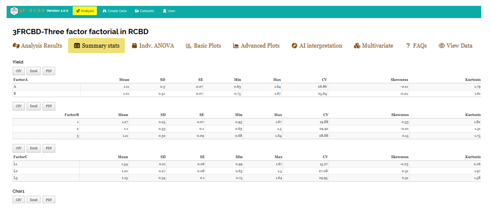{#fig-102 fig-align="center"}

<details>

```{=html}
<summary style="color: #5DADE2"; font-weight: bold;"> Table parameters </summary>
```

<small>

**Mean** The arithmetic average of all observations within a treatment combination. It represents the "typical" value for that specific combination of factor levels.

**SD (Standard Deviation)** A measure of the amount of variation or dispersion of a set of values. A low SD indicates that the data points tend to be very close to the mean.

**SE (Standard Error)** Specifically the Standard Error of the Mean. It estimates how far the sample mean is likely to be from the true population mean. It is calculated as $$SE = \frac{\text{Standard deviation (SD)}}{\sqrt {n}}*100$$, where n is the number of observations.

**Min / Max** The lowest and highest recorded values within that specific treatment combination group.

**CV (Coefficient of Variation)** The ratio of the standard deviation to the mean, expressed as a percentage $$CV = \frac{\text{Standard deviation (SD)}}{\text{Mean}}*100$$

**Skewness** A measure of the asymmetry of the probability distribution. Positive value: Data is skewed to the right. Negative value: Data is skewed to the left.

**Kurtosis** A measure of the "tailedness" of the distribution. A standard normal distribution has a kurtosis of 3; values lower than that indicate a flatter peak.

</small>

</details>

### Interpretations from @fig-102

::: {style="text-align: justify;"}
Among the 12 treatment combinations, the combination V~2~N~2~I~2~ (Swarna at 90 kg N/ha under continuous flooding) recorded the highest mean grain yield (4,825 ± 142.3 kg/ha), while V~1~N~1~I~1~ (IR64 at 60 kg N/ha under alternate wetting and drying) exhibited the lowest mean (3,210 ± 198.7 kg/ha). Variability, as indicated by SD and CV, was highest for combinations under the lower nitrogen level, suggesting that response to reduced nitrogen input is more inconsistent across replications. Combinations under the higher nitrogen level tended to show more consistent performance, with CV values below 8%, reflecting good experimental precision. Most treatment combinations showed near-symmetric distributions (skewness close to zero), confirming that the data are reasonably well-suited for parametric analysis without transformation.
:::

## Individual ANOVA {#IA}

::: {style="text-align: justify;"}
If the user wants to get individual ANOVA tables for each variable click on Individual ANOVA in the Analysis.

The significance of each factor, interaction, and block effect can be measured using the F-test and p value as in @fig-104.
:::

**Table 4: ANOVA table for yield**

<!-- REPLACE THIS SCREENSHOT -->

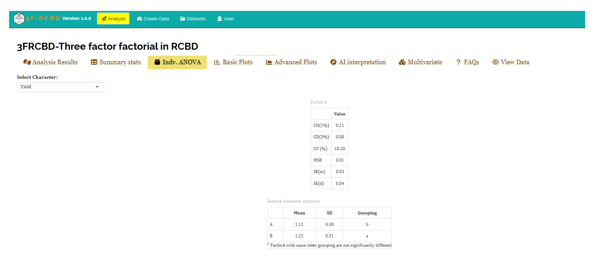{#fig-104 fig-align="center"}

<details>

```{=html}
<summary style="color: #5DADE2"; font-weight: bold;"> Table parameters </summary>
```

<small>

**Critical Difference (CD)** The minimum difference required between any two treatment combination means to consider them significantly different from each other. At a 1% level, you are 99% confident in the difference. At a 5% level, you are 95% confident.

**Coefficient of Variation (CV (%))** A relative measure of dispersion that expresses the standard deviation as a percentage of the mean. $$CV = \frac{\text{Standard deviation (SD)}}{\text{Mean}}*100$$

**Mean Square Error (MSE)** The Residual Mean sum of Squares from the ANOVA table. It represents the "noise" or unexplained variance in the experiment.

**Standard Error of Mean (SE(m))** Measures how much the sample mean of a treatment combination is likely to vary from the true population mean. $$ SE(m)=\sqrt{MSE / r}$$ Where, r is the number of replications (blocks).

**Standard Error of Difference (SE(d))** The standard error associated with the difference between two treatment combination means. $$ SE(d)=\sqrt{2 \times MSE / r}$$

</small>

</details>

### Interpretation from @fig-104

::: {style="text-align: justify;"}
For the character **yield**, the treatment (treatment combination) mean square is 182,450.60, while the error mean square is 10,603.42, yielding an F-value of approximately 17.21 with 11 degrees of freedom for treatment combinations and 22 degrees of freedom for error. This F-value is statistically significant at the 1% level, confirming strong treatment combination effects on grain yield. The MSE of 10,603.42 reflects the within-block variability not accounted for by the model. The SE(m) is approximately 59.41 and the SE(d) is approximately 84.01. The CD at 5% is 172.36 and at 1% is 234.60, indicating the minimum yield difference required to declare any two treatment combinations significantly different. The overall CV% of 6.7% reflects good experimental precision and confirms the reliability of the findings.
:::

## Basic plots {#BP}

::: {style="text-align: justify;"}
**RAISINS** is designed for a smooth and hassle-free experience. Once you click the Run Analysis button, all relevant results and outputs appear instantly leaving no room for confusion. We've ensured that every possible plot related to **Three-Factor Randomized Block Design** is readily available. Simply click on the Basic Plots tab to view them (See @fig-8). Each plot comes with a gear icon at the top-left corner, allowing you to customize its appearance. You can also download these plots in high-quality PNG format (300 dpi), JPEG, TIFF, PDF and SVG for use in reports or presentations.
:::

### Customizing plots

::: {style="text-align: justify;"}
**RAISINS** provides users various customization features for the plots to enhance the visualization according to the requirement of the user. **Click** on @fig-8 to get a clear idea on the customizing features.
:::

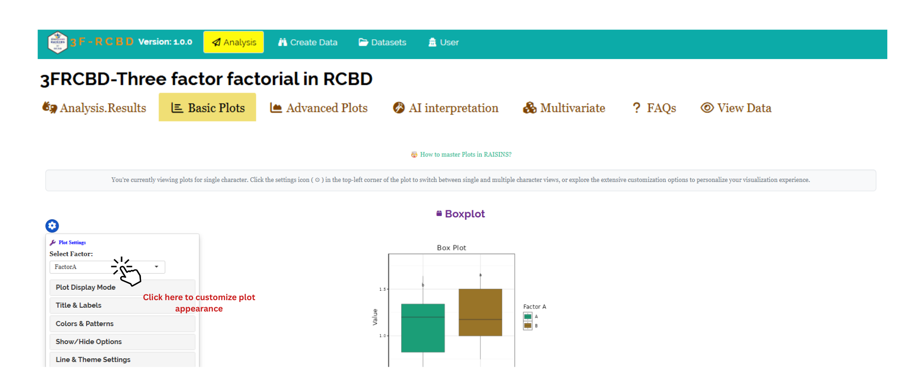{#fig-8 fig-align="center"}

::: {style="text-align: justify;"}
From @fig-9 to @fig-13, you can see the different types of plots available in RAISINS. Each one is visually illustrated and accompanied by a clear, insightful description below, making it easy to understand.
:::

```{=html}
<script>
document.addEventListener('DOMContentLoaded', function() {
  const descriptions = document.querySelectorAll('.plot-description');
  descriptions.forEach(desc => {
    desc.style.display = 'none';
  });
});

function showDescription(id) {
  document.getElementById(id).style.display = 'flex';
}

function hideDescription(id) {
  document.getElementById(id).style.display = 'none';
}
</script>
```

```{=html}
<style>
.plot-container {
  position: relative;
  display: inline-block;
  cursor: pointer;
  width: 350px;
  height: 300px;
  overflow: hidden;
  margin: 10px;
}
.plot-container img {
  width: 350px;
  height: 300px;
  object-fit: cover;
  border: 3px solid #ddd;
  border-radius: 8px;
  transition: transform 0.3s ease, box-shadow 0.3s ease;
}
.plot-container:hover img {
  transform: scale(1.05);
  box-shadow: 0 4px 12px rgba(0, 0, 0, 0.2);
}
.plot-description {
  display: none !important;
  position: absolute;
  top: 0; left: 0;
  width: 100%; height: 100%;
  z-index: 1000;
  color: white;
  padding: 15px;
  border-radius: 8px;
  box-shadow: 0 4px 15px rgba(0, 0, 0, 0.3);
  font-size: 14px;
  line-height: 1.5;
  display: flex;
  align-items: center;
  justify-content: center;
  text-align: center;
  animation: fadeIn 0.3s ease-in;
  pointer-events: none;
  border: 2px solid rgba(255, 255, 255, 0.5);
}
.plot-container:hover .plot-description {
  display: flex !important;
}
@keyframes fadeIn {
  from { opacity: 0; transform: scale(0.95); }
  to { opacity: 1; transform: scale(1); }
}
#boxplot-desc { background: linear-gradient(135deg, rgba(255, 107, 107, 0.8), rgba(255, 142, 83, 0.8)); }
#barplot-desc { background: linear-gradient(135deg, rgba(161, 140, 209, 0.8), rgba(251, 194, 235, 0.8)); }
#connectedplot-desc { background: linear-gradient(135deg, rgba(0, 221, 235, 0.8), rgba(38, 166, 154, 0.8)); }
#meanvalueplot-desc { background: linear-gradient(135deg, rgba(255, 154, 139, 0.8), rgba(255, 106, 136, 0.8)); }
#violinplot-desc { background: linear-gradient(135deg, rgba(132, 250, 176, 0.8), rgba(143, 211, 244, 0.8)); }
</style>
```

:::::::::::::::::::::::: grid
:::::: g-col-6
::::: {.plot-container onmouseover="showDescription('boxplot-desc')" onmouseout="hideDescription('boxplot-desc')"}
<!-- REPLACE THIS SCREENSHOT -->

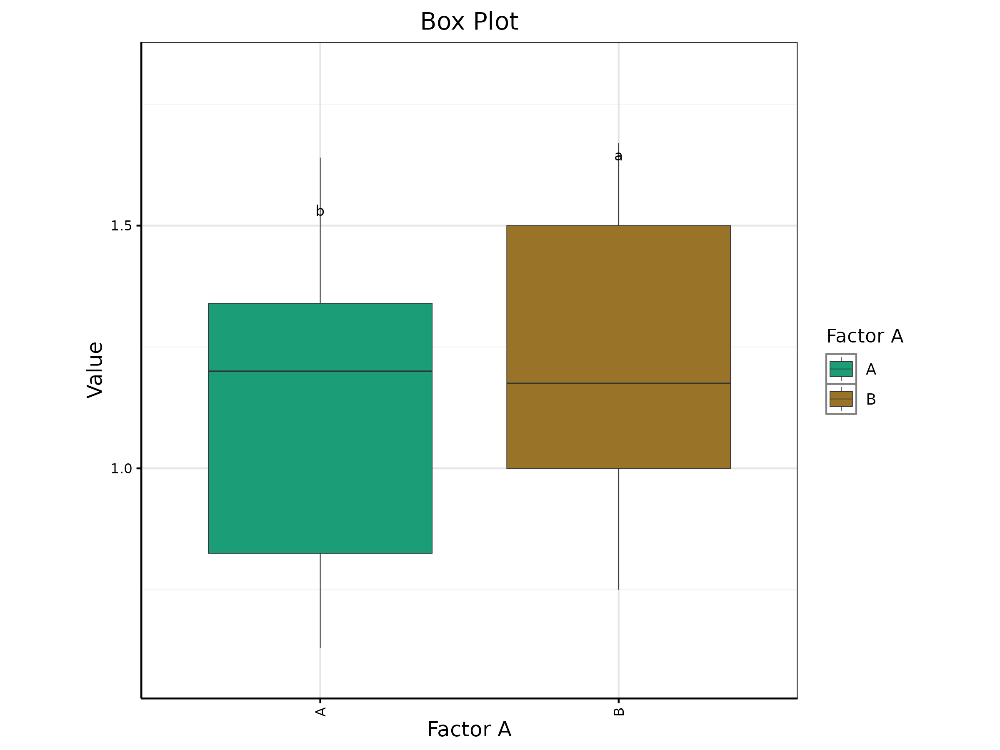{#fig-9}

:::: {#boxplot-desc .plot-description}
::: {style="text-align: justify;"}
A **box plot** compares the distribution of values across different treatment combinations. Each colored box represents a treatment combination and shows key statistics: the median (middle line), the interquartile range (the box itself), and potential outliers (points outside the whiskers). Letters above each box indicate statistical groupings treatment combinations sharing letters are statistically similar, while those with different letters are significantly different.
:::
::::
:::::
::::::

:::::: g-col-6
::::: {.plot-container onmouseover="showDescription('violinplot-desc')" onmouseout="hideDescription('violinplot-desc')"}
<!-- REPLACE THIS SCREENSHOT -->

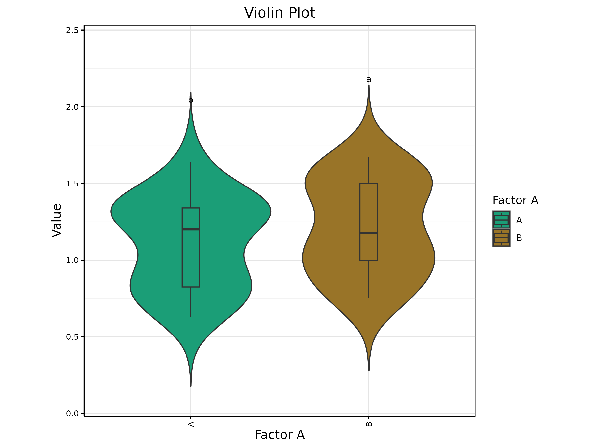{#fig-10}

:::: {#violinplot-desc .plot-description}
::: {style="text-align: justify;"}
A **violin plot** compares the distribution of values across different treatment combinations. Each treatment combination is shown as a violin shape that reflects how the data is spread — wider sections mean more data points at that value. Inside each violin is a box plot showing the median and interquartile range. Letters above each plot indicate statistical groupings: treatment combinations sharing letters are statistically similar, while those with different letters are significantly different.
:::
::::
:::::
::::::

:::::: g-col-6
::::: {.plot-container onmouseover="showDescription('barplot-desc')" onmouseout="hideDescription('barplot-desc')"}
<!-- REPLACE THIS SCREENSHOT -->

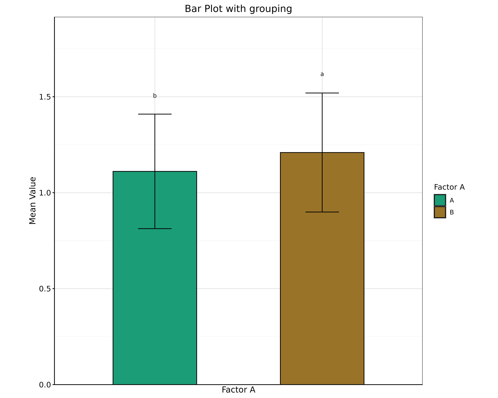{#fig-11}

:::: {#barplot-desc .plot-description}
::: {style="text-align: justify;"}
A **bar plot** compares the average values of different treatment combinations, with error bars showing variability. The letters above each bar indicate statistical groupings: treatment combinations sharing letters are similar, while those with different letters are significantly different. It highlights which combinations have higher or lower averages and whether those differences are meaningful.
:::
::::
:::::
::::::

:::::: g-col-6
::::: {.plot-container onmouseover="showDescription('meanvalueplot-desc')" onmouseout="hideDescription('meanvalueplot-desc')"}
<!-- REPLACE THIS SCREENSHOT -->

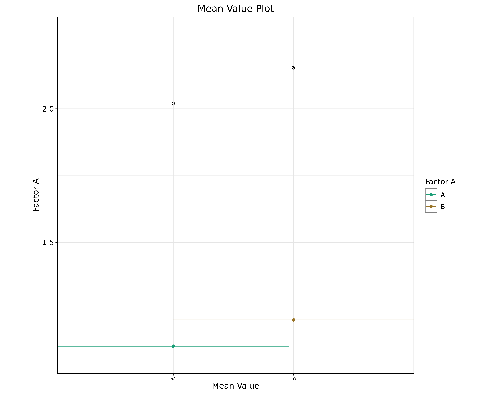{#fig-12}

:::: {#meanvalueplot-desc .plot-description}
::: {style="text-align: justify;"}
A **mean value plot** compares the mean values of different treatment combinations, each shown as a colored dot with horizontal error bars indicating variability. Letters next to each point represent statistical groupings: treatment combinations sharing letters are statistically similar, while those with different letters are significantly different.
:::
::::
:::::
::::::

::::::: g-col-6
:::::: {.plot-container onmouseover="showDescription('connectedplot-desc')" onmouseout="hideDescription('connectedplot-desc')"}
::: {style="text-align: center;"}
<!-- REPLACE THIS SCREENSHOT -->

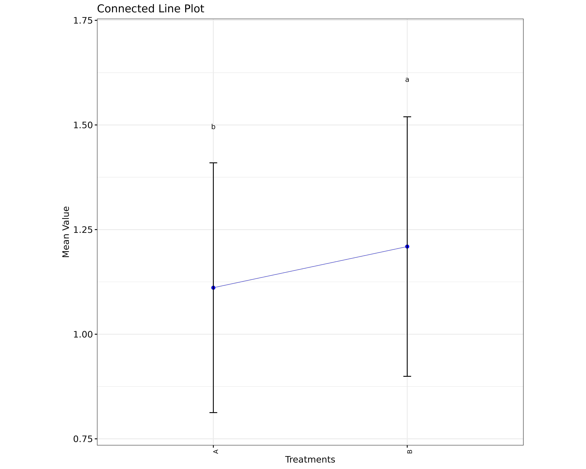{#fig-13}
:::

:::: {#connectedplot-desc .plot-description}
::: {style="text-align: justify;"}
A **connected line plot** compares the mean values of different treatment combinations, with each point representing a combination's average and error bars showing variability. The points are linked by lines to highlight trends across combinations. Letters above each point indicate statistical groupings: treatment combinations sharing letters are statistically similar, while those with different letters are significantly different.
:::
::::
::::::
:::::::
::::::::::::::::::::::::

## Advanced plots {#AP}

::: {style="text-align: justify;"}
**RAISINS** also provides advanced plots which go beyond basic bar charts and histograms to give deeper insight into your data, especially distributions, relationships, and deviations from expectations. (See @fig-90)
:::

<!-- REPLACE THIS SCREENSHOT -->

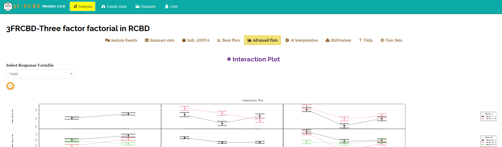{#fig-90 fig-align="center"}

**INTERACTION PLOT**

<!-- REPLACE THIS SCREENSHOT -->

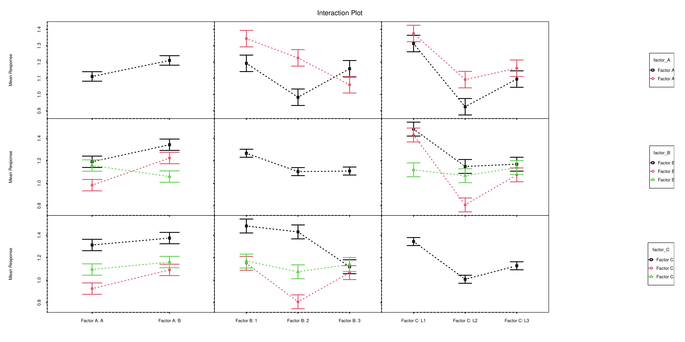{#fig-14 fig-align="center"}

:::: {style="text-align: justify;"}
::: {style="text-align: justify;"}
Explains how it reveals whether the effect of one factor changes across levels of another, with parallel vs. crossing lines interpreted in the context of the A×B interaction found in the experiment.
:::
::::

**3D SCATTER PLOT**

<!-- REPLACE THIS SCREENSHOT -->

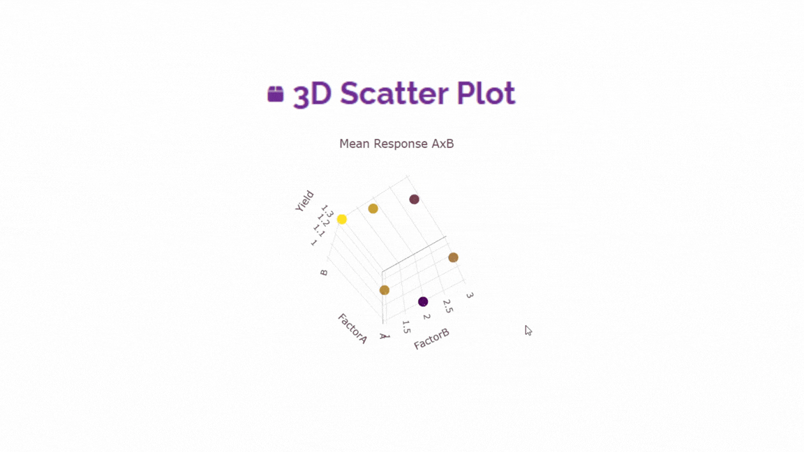{#fig-15 fig-align="center"}

:::: {style="text-align: justify;"}
::: {style="text-align: justify;"}
Describes how three response variables (Yield, Char 1, Char 2) are plotted simultaneously in 3D space, with colour coded points per treatment combination to visualize multivariate clustering across the factorial structure..
:::
::::

**3D SCATTER PLOT WITH LINE**

<!-- REPLACE THIS SCREENSHOT -->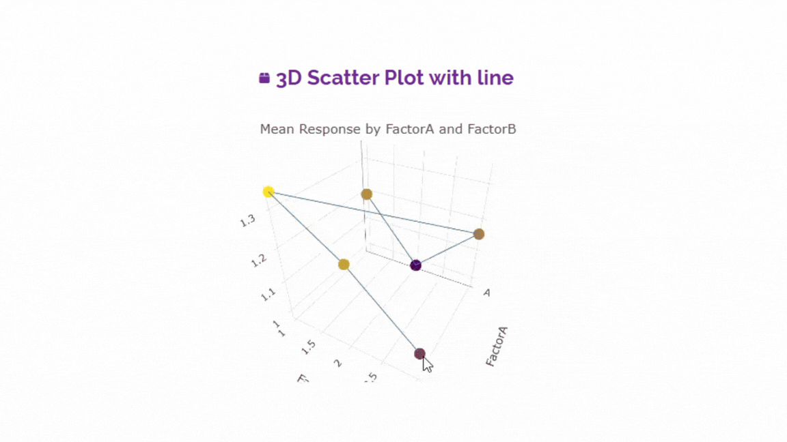

3D SCATTER PLOT WITH LINE

:::: {style="text-align: justify;"}
::: {style="text-align: justify;"}
Extends the 3D scatter by connecting replicated observations within each treatment combination via trajectory lines, showing within-combination consistency and between-combination separation in multivariate space.
:::
::::

## AI interpretation {#AI}

::: {style="text-align: justify;"}
RAISINS is equipped with an AI-powered RAISINS Assistant designed to assist users in comprehending the outcomes of statistical tests and data analysis. This functionality provides clear and concise summaries of results, identifies statistically significant main effects and interactions between factors, and offers informed suggestions for potential next steps or interpretations. The user can get detailed interpretations of the analysis by clicking on AI interpretation on the Analysis as shown below @fig-ai.
:::

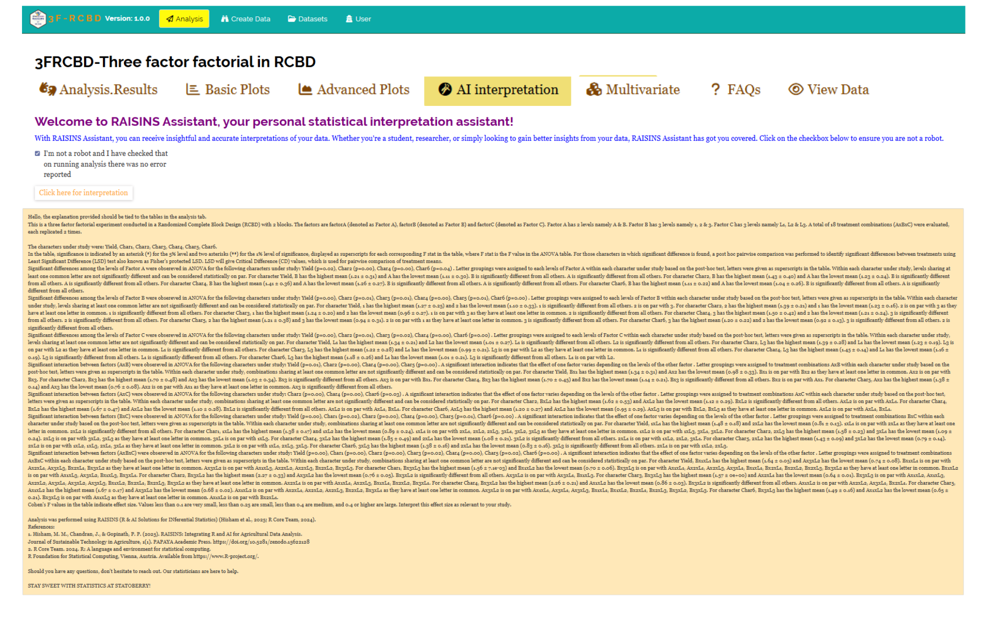{#fig-ai fig-align="center"}

## Multivariate {#MUL}

::: {style="text-align: justify;"}
Multivariate analysis in **Three-Factor Randomized Block Design (3FRBD)** helps you to compare different response variables simultaneously across all treatment combinations. Remember that the PCA used for multivariate selection is an exploratory technique, not an inferential method. Now, in our example, of evaluation of 12 treatment combinations across the four response variables (yield, Char 1 and Char 2) by a crop physiologist, navigate to Multivariate see @fig-mu.
:::

<!-- REPLACE THIS SCREENSHOT -->

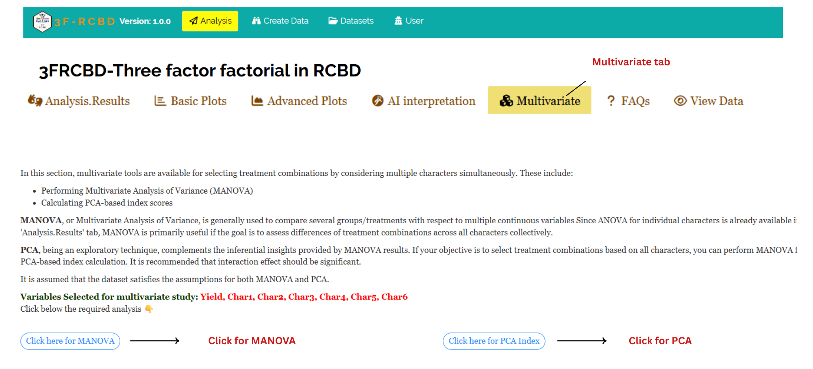{#fig-mu}

::: {style="text-align: justify;"}
MANOVA and PCA will be automatically carried out based on the selected variables. MANOVA table with interpretation appears automatically. PCA results and plots will appear along with automated interpretation.
:::

<!-- REPLACE THIS SCREENSHOT -->

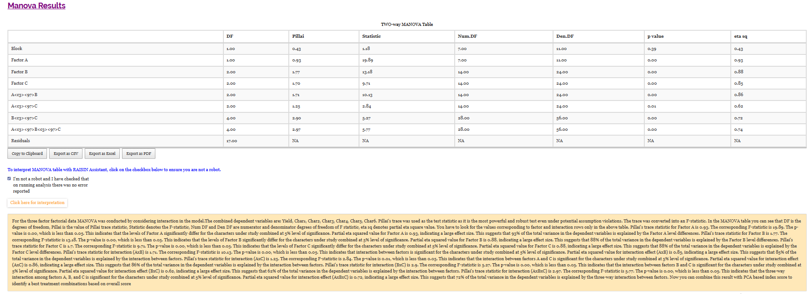{#fig-MAN2 fig-align="center"}

::: {style="text-align: justify;"}
The table titled 'Eigen Values PCA' given @fig-PC provides information about the eigen values and the percentage of variance explained by each principal component. The principal components PC1 and PC2 have eigenvalues greater than one and are considered important for further analysis. PC1 accounts for approximately 54% of the variance in the dataset, while PC2 accounts for about 22% of the variance. Together, PC1 and PC2 explain approximately 76% of the total variance (termed as cumulative variance). Since PC1 explains more than 40% of the variance, a PC1-based index score is a strong consideration. Additionally, since both PCs together explain more than 60% of the variance in the data, an index score based on both PCs is also appropriate. The scree plot below illustrates the proportion of variance explained by each principal component.
:::

<!-- REPLACE THIS SCREENSHOT -->

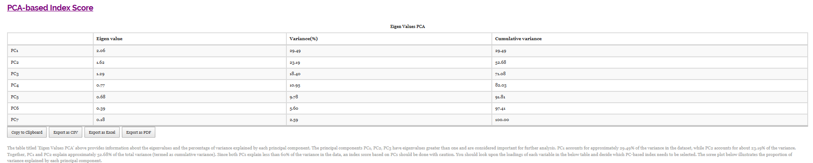{#fig-PC}

::: {style="text-align: justify;"}
The scree plot given @fig-screeplot illustrates the proportion of variance explained by each principal component.
:::

<!-- REPLACE THIS SCREENSHOT -->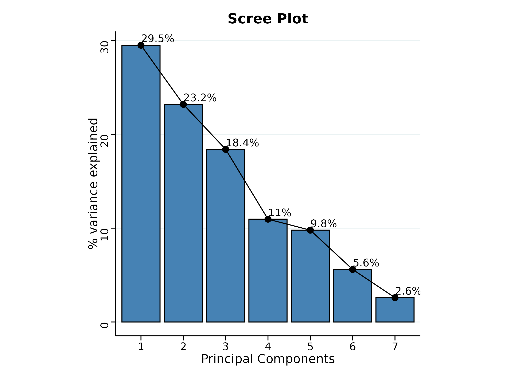{#fig-screeplot}

scree plot

::: {style="text-align: justify;"}
Look upon the loadings of each variable in the given @fig-loadings and decide which PC-based index needs to be selected. In PC1, yield and FW show high positive loadings (approximately +0.62 and +0.58 respectively), while Obs2 also loads positively (+0.41), indicating that treatment combinations with high scores on PC1 perform well across all three of these traits. Obs1 (plant height) loads primarily on PC2 (+0.71), suggesting it captures a dimension of variation that is largely independent of yield. Based on this pattern, a PC1-based index score is most informative for identifying treatment combinations that optimize yield and biomass simultaneously. It is recommended to use variables that are highly correlated for PCA, as this helps in constructing a more reliable and meaningful index.
:::

<!-- REPLACE THIS SCREENSHOT -->

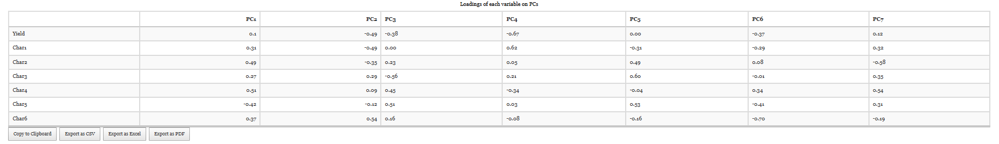{#fig-loadings fig-align="center"}

::: {style="text-align: justify;"}
The biplot gives a visual representation of the relationships among variables and treatment combinations. Treatment combinations with high values for a specific variable are positioned in the direction of that variable's loading vector. The angle between variables in the biplot indicates their correlation smaller angles suggest high positive correlation, while larger angles close to 90 degrees suggest weak or no correlation. In the present example, yield and FW vectors point in approximately the same direction, confirming their strong positive association, while Obs1 points in a direction more orthogonal to yield, confirming its independent contribution.
:::

<!-- REPLACE THIS SCREENSHOT -->

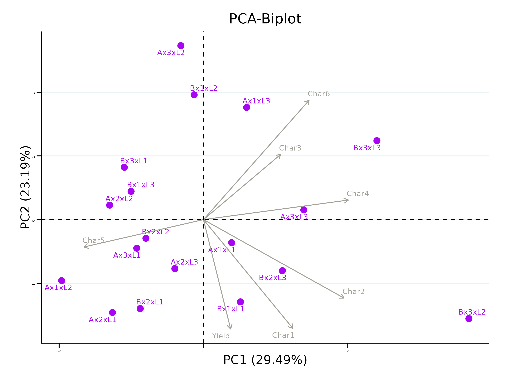

::: {style="text-align: justify;"}
In RAISINS, we calculate a scaled index score by converting the index score to a range of 0 to 1, making it easier to interpret and compare. This standardized approach ensures consistency in evaluating treatment combinations based on their index scores. To refine your selection, use the 'Select cutoff for Scaled Index Score' feature given as in @fig-indexscore, where you can choose the cutoff percentage to select treatment combinations above or below a certain threshold. The default cutoff is set at 75%. By toggling the up-arrow and down-arrow buttons below the cutoff selection, you can select the top or bottom percentage of treatment combinations as per your preference. Selected treatment combinations are highlighted in yellow in the table below, providing a clear visual cue. Additionally, a plot based on the index scores is also displayed to aid in your analysis.
:::

<!-- REPLACE THIS SCREENSHOT -->

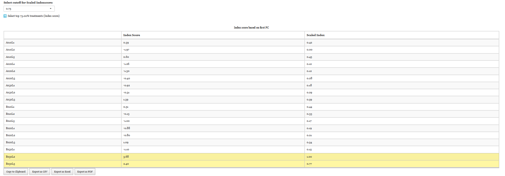{#fig-indexscore fig-align="center"}

<!-- REPLACE THIS SCREENSHOT -->

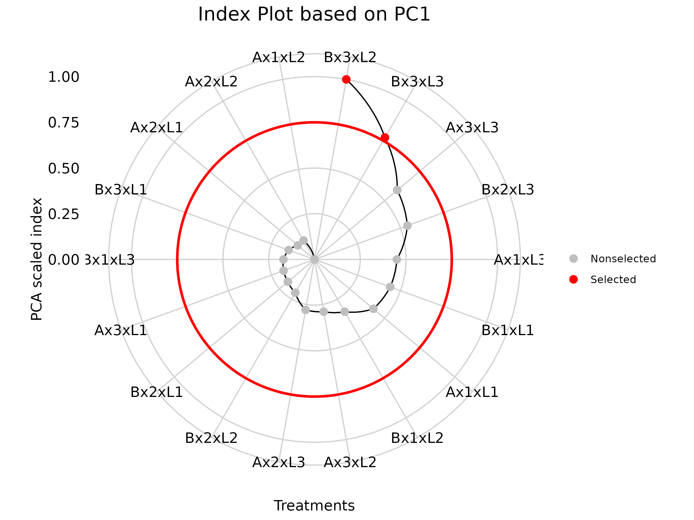{fig-align="center"}

::: {style="text-align: justify;"}
Combining all this information, the experimenter can arrive at an overall conclusion that is statistically sound and contextually relevant to their study. The integration of univariate ANOVA results with multivariate PCA-based index scores allows researchers to identify the most promising treatment combinations for both individual traits and overall multi-trait performance in a **3FRBD** experiment.
:::

## Preparing your data {#PRE}

::: {style="text-align: justify;"}
"Your analysis is only as good as your data! Feed RAISINS high-quality data, and it will deliver powerful insights feed it messy data, and the results won't be trustworthy."

1.  Create your dataset in MS Excel

2.  Build your dataset directly within the RAISINS app
:::

## Preparing data in MS Excel {#EX}

::: {style="text-align: justify;"}
Open a new blank sheet in MS Excel with only one sheet included, and avoid adding any unnecessary content. The dataset should follow a column-based format, where the first column represents the Block (replicate), the second column represents the treatment combination label or, alternatively, separate columns for Factor A, Factor B, and Factor C. You can name these columns appropriately, such as "Block", "Variety", "Nitrogen", "Irrigation". All characters under study (e.g., yield, Char1 and Char 2) should be arranged in separate columns, and each treatment combination should be repeated according to the number of blocks. The file can be saved in CSV, XLS, or XLSX format, but CSV is recommended as it is lighter and enables faster loading. Ensure that there are no unwanted spaces in column names or group names. For reference, see the structure shown in @fig-pp. As illustrated in @fig-data, treatment combinations must appear repeatedly based on the number of blocks, and the data can also be arranged as shown in @fig-kk.
:::

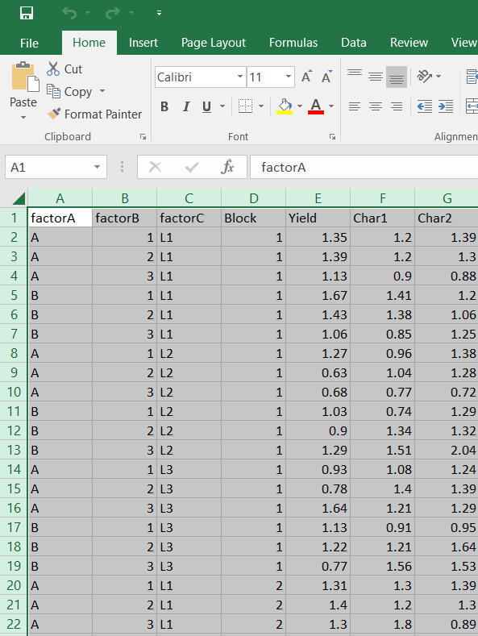{#fig-pp}

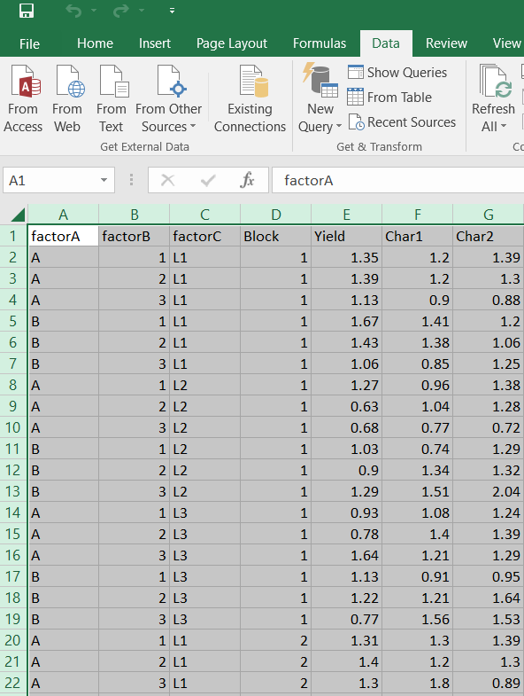{#fig-kk}

<details>

<summary>Dataset Creation Rules</summary>

<small> 1. **Column Naming Convention** - No spaces allowed in column names.\
- Use underscores (`_`) or full stops (`.`) for separation. - Avoid symbols and special characters like %,# etc 2. **Data Arrangement** - Start data arrangement towards the upper-left corner.\
- Ensure the row above the data is not blank. 3. **Cell Management** - Avoid typing or deleting in cells without data.\
- If needed, select affected cells, right-click, and select **Clear Contents**. 4. **Column Relevance** - Name all columns meaningfully.\
- Exclude unnecessary columns not required for analysis. </small>

</details>

<details>

<summary>How to Save as CSV in MS Excel</summary>

<small> 1. **Open Your Workbook**

```         
-   Ensure your data is arranged properly with only one sheet.
```

2.  **Click 'File' Menu**

    -   Go to the top-left corner and click on **File**.

3.  **Choose 'Save As' or 'Save a Copy'**

    -   Select the location where you want to save your file.

4.  **Set File Type to CSV**

    -   In the **'Save as type'** dropdown menu, choose **CSV (Comma delimited) (\*.csv)**.

5.  **Name Your File**

    -   Enter a relevant file name without spaces (use underscores if needed).

6.  **Click 'Save'**

    -   Click **Save** to export the file.

> 💡 Tip: Before saving, double-check that your data is on the first sheet and follows the required format (e.g., no empty rows above the data, meaningful column names). </small>

</details>

## Creating dataset in RAISINS {#CR}

::: {style="text-align: justify;"}
If you're unsure about the correct format for creating a dataset, don't worry RAISINS offers an option to create data directly within the app using the prescribed template. Here's how:

-   Navigate to the **Create Data Tab**

-   Select the number of **Treatments**

-   Select number of **Replications**

-   Select number of **Characters**

-   Click on **Create** button

Model layout will appear as shown in @fig-createdata. Now you may enter the observations manually into the CSV file once downloaded, or paste the observations straight into the file provided. Once you have entered the observations in the layout, download the csv file and upload in Analysis.
:::

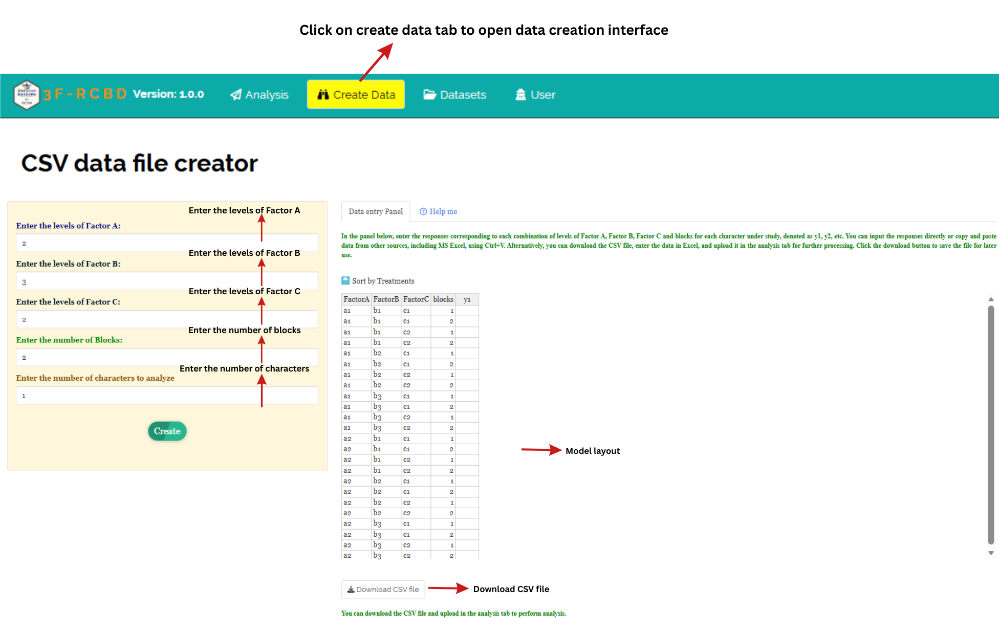{#fig-createdata}

## Model datasets {#M}

::: {style="text-align: justify;"}
To test the app or better understand the data arrangement, we provide model datasets within the app. You can download them from the Datasets.
:::

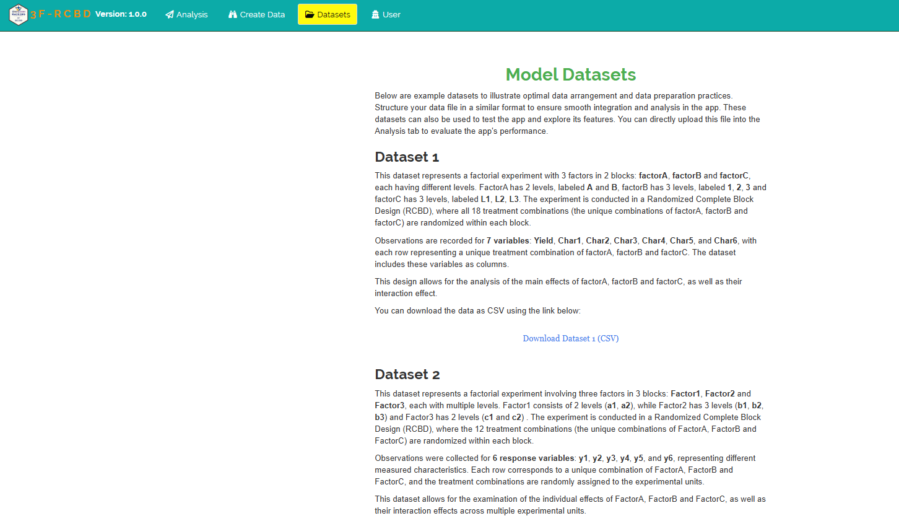{#fig-188 fig-align="center"}

## FAQ's {#F}

::: {style="text-align: justify;"}
The app includes a dedicated FAQs to help clarify common doubts and guide users through various features. This section provides detailed answers to frequently asked questions, offering additional information and helpful tips to ensure a smooth user experience. If you're ever unsure about how something works, the FAQs is a great place to start.
:::

{#fig-148 fig-align="center"}

## View data {#U}

::: {style="text-align: justify;"}
View Data serves as the primary diagnostic tool for ensuring data integrity before analysis. Upon uploading your dataset, the system performs an automated Health Check to validate column types and formatting.
:::

{fig-align="center"}
