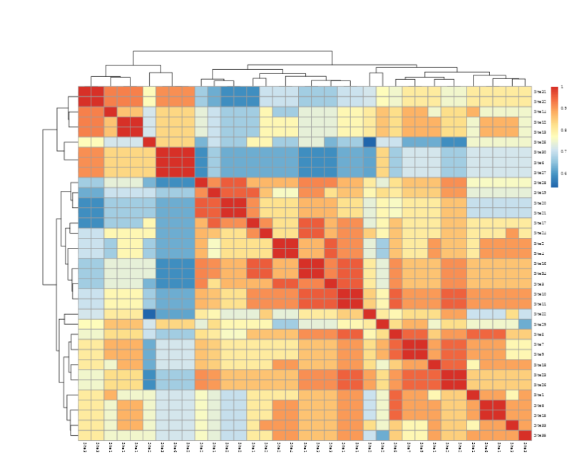

```{=html}
<style>
 sup {
   color: blue;
   font-size: 0.8em;
 }
 .affiliations {
   color: grey;
   font-size: 0.9em;
   margin-top: 0.2em;
 }
</style>
```

::: affiliations
<sup>1</sup>Statoberry LLP, <sup>2</sup>Department of Agricultural Statistics, Kerala Agricultural University
:::

ABSTRACT

::: {style="text-align: justify;"}
**Diversity Analysis and PERMANOVA** is a multivariate ecological and statistical framework used to quantify species richness, community evenness, and compositional dissimilarity across sampling groups or treatment conditions. **Diversity Analysis** summarises community structure through alpha-diversity indices such as Shannon, Simpson, and species richness while **Beta Diversity** and **PERMANOVA** (Permutational Multivariate Analysis of Variance) assess whether community composition differs significantly among groups based on a chosen dissimilarity metric. In **RAISINS** you can perform complete diversity analysis and PERMANOVA without writing a single line of code. This tutorial will guide you through how to compute diversity indices, visualise community patterns, perform beta diversity ordination, and run PERMANOVA in **RAISINS**, interpreting every output effectively. In addition, you will obtain publication-ready diversity index tables, ordination plots, rarefaction curves, and PERMANOVA summary tables ready for inclusion in manuscripts and reports.
:::

<details>

*Hover or click each point to see more information.*

```{=html}
<summary style="color: #5DADE2"; font-weight: bold;">
  Introduction Diversity Analysis and PERMANOVA
</summary>
```

```{=html}
<style>
.hover-img {
  position: relative;
  display: inline-block;
  cursor: help;
  border-bottom: 1px dashed currentColor;
}
.hover-img img {
  position: absolute;
  left: 50%;
  top: 1.6em;
  transform: translateX(-50%);
  width: 260px;
  max-width: 70vw;
  height: auto;
  padding: 6px;
  background: white;
  border: 1px solid rgba(0,0,0,.15);
  border-radius: 12px;
  box-shadow: 0 10px 30px rgba(0,0,0,.18);
  opacity: 0;
  visibility: hidden;
  pointer-events: none;
  transition: opacity .15s ease, transform .15s ease, visibility .15s;
}
.hover-img:hover img {
  opacity: 1;
  visibility: visible;
  transform: translateX(-50%) translateY(6px);
  z-index: 999;
}
</style>
```

<ul><small> The quantitative study of biological diversity traces its roots to the mid-twentieth century, with foundational contributions from [Claude Shannon]{.hover-img}, the American mathematician and electrical engineer who introduced the **Shannon Entropy index** in his landmark paper *A Mathematical Theory of Communication* (1948, Bell System Technical Journal). Although developed in the context of information theory, Shannon's entropy was quickly adopted by ecologists to measure the uncertainty and by analogy, the diversity of species assemblages in a community. Shortly thereafter, Edward H. Simpson proposed the **Simpson's Index** (1949, *Nature*) as a measure of the probability that two randomly selected individuals from a community belong to the same species, providing a complementary concentration-based perspective on diversity. The conceptual distinction between **alpha diversity** (within-sample diversity), **beta diversity** (between-sample compositional turnover), and **gamma diversity** (regional total diversity) was formalised by Robert H. Whittaker in 1960, establishing the hierarchical framework that underpins all modern diversity analysis. The **PERMANOVA** method Permutational Multivariate Analysis of Variance was introduced by [Marti J. Anderson]{.hover-img} in 2001 (*Austral Ecology*) as a robust non-parametric alternative to MANOVA for testing the significance of group differences in multivariate community composition, using any dissimilarity measure and permutation-based inference to avoid distributional assumptions. Together, these methods form the backbone of community ecology, microbiome research, environmental monitoring, and biodiversity assessment. </small></ul>

</details>

## Analysis of experiments {#AE}

::: {style="text-align: justify;"}
To get started, visit **RAISINS** [www.raisins.live](https://www.raisins.live) home page and go to **Analysis of experiments**. Here, you can see different analysis modules including multivariate and community ecology methods. In this tutorial, we focus on **Diversity Analysis and PERMANOVA**, as shown in @fig-aov.
:::

<!-- REPLACE THIS SCREENSHOT -->

.png){#fig-aov fig-align="center"}

## Diversity Analysis and PERMANOVA {#C}

::: {style="text-align: justify;"}
Diversity Analysis is a suite of ecological statistical methods used to characterise and compare biological communities across samples, sites, or treatment groups based on species (or OTU/taxon) abundance data. The analytical framework operates at two complementary levels: **alpha diversity**, which quantifies diversity within a single sample using indices such as species richness, Shannon entropy, Simpson's index, and Pielou's evenness; and **beta diversity**, which quantifies compositional dissimilarity between samples using distance or dissimilarity measures such as Bray-Curtis, Jaccard, or UniFrac. **PERMANOVA** (Permutational Multivariate Analysis of Variance) is the standard non-parametric permutation-based test for evaluating whether the multivariate community composition differs significantly across predefined groups (e.g., treatments, habitats, time points, host types). Unlike classical MANOVA, PERMANOVA makes no assumption of multivariate normality and can accommodate any dissimilarity measure, making it robust and broadly applicable to ecological count data, microbiome relative abundances, and environmental species matrices. **RAISINS** integrates all these analyses alpha diversity indices, rarefaction curves, beta diversity ordination (NMDS/PCoA), PERMANOVA with pairwise tests, and publication-ready visualisations into a single streamlined interface that requires no programming expertise. The module is applicable to any community matrix where rows represent samples and columns represent species, taxa, OTUs, or ASVs, with cell values being counts, relative abundances, or presence-absence indicators.
:::

::: callout-tip
#### Diversity Analysis and PERMANOVA is an integrated ecological analysis framework that quantifies within-sample species diversity (alpha diversity), between-sample compositional dissimilarity (beta diversity), and tests the significance of community-level differences across groups using permutation-based multivariate analysis of variance (PERMANOVA).
:::

## A working example {#W}

::: {style="text-align: justify;"}
To make things simple and interesting, we will explain Diversity Analysis and PERMANOVA step by step using a hypothetical example, so you can clearly see how it works and why it matters.

The image shows the structure of a biodiversity dataset used for diversity and PERMANOVA analysis. The dataset contains four important columns: Species, Location (Loc), Site, and Count. The Species column represents the organism being studied, such as Lepidoptera. The Location column indicates the study area or region (e.g., TVM, KOL, PATH), while the Site column represents different sampling sites within each location. The Count column shows the number of individuals recorded at each site.

This dataset format is useful for ecological and diversity analysis because it organizes species abundance data across multiple locations and sampling sites. The count values help in calculating diversity indices, abundance patterns, community composition, and statistical analyses such as PERMANOVA and ordination methods.The arrangement of the data is shown in @fig-data.
:::

<!-- REPLACE THIS SCREENSHOT -->

.png){#fig-data fig-align="center"}

::: {style="text-align: justify;"}
Data organised in MS Excel can be directly uploaded to **RAISINS** for analysis. For more details on data preparation see @sec-4. Two terms that we will use frequently in this tutorial are **Samples** and **Species/OTUs**. In our example, the **Samples** refer to the 20 soil samples assigned to one of four **Land_Use** groups Forest, Agriculture, Grassland, and Urban and the **Species/OTUs** are the 30 OTU columns (OTU_01 to OTU_30) representing the microbial taxa detected across all samples.
:::

## How to prepare your data? {#sec-4 .H}

::: {style="text-align: justify;"}
Arranging data for uploading in **RAISINS** is very simple. Your primary dataset must be a **community matrix** arranged with samples as rows and species or OTUs as columns, exactly as shown in @fig-data. The first column must contain the **sample identifiers** and the second column must contain the **group label** (e.g., treatment, site, or land-use type) for each sample. All remaining columns contain the abundance or count values for each species or OTU. Use a single-sheet Excel file, ensure no blank rows are left above the data, and make sure all column names are properly formatted without spaces or special characters. That's it your file is ready to upload.

Still if you have doubt, see @fig-4.

To prepare your dataset for analysis in **RAISINS**, you have two options:

Creating dataset in MS Excel

Creating your dataset directly within the **RAISINS** app
:::

.png){#fig-4 fig-align="center"}

## Diversity analysis tab explained {#AO}

::: {style="text-align: justify;"}
In @fig-5, you can see the detailed view of the Diversity Analysis tab, along with explanations of what each option does. This section helps you understand the purpose of every setting so that you can select the most appropriate options for your data. Upload the prepared community matrix by clicking Browse in the sidebar of the Analysis tab. When the file is uploaded, options to select the **Group column** (the metadata column identifying sample groups) and the **OTU/species columns** to include in the analysis will appear. You may also select the preferred **dissimilarity measure** (Bray-Curtis, Jaccard, or Euclidean) and the **ordination method** (NMDS or PCoA) from the dropdown menus provided. Once you click the Run Analysis button, all diversity indices, ordination plots, beta diversity results, and PERMANOVA outputs appear instantly leaving no room for confusion.
:::

<!-- REPLACE THIS SCREENSHOT -->

.png){#fig-5 fig-align="center"}

::: {style="text-align: justify;"}
For community datasets that include rare OTUs or highly uneven sequencing depths across samples, **RAISINS** provides an inbuilt **rarefaction** option that subsamples all samples to a common sequencing depth before computing alpha diversity indices . This step is recommended whenever total read counts vary substantially among samples, as uneven sampling effort can artificially inflate diversity estimates in more deeply sequenced samples.
:::

## Analysis results {#sec-7 .AR}

::: {style="text-align: justify;"}
Once your community matrix is uploaded and the group column and analysis options are selected, click on Run Analysis. **RAISINS** will compute alpha diversity indices for all samples, generate the dissimilarity matrix for beta diversity analysis, perform NMDS or PCoA ordination, and run PERMANOVA presenting all results in a structured, tabbed output panel. The primary result displayed first is the **Alpha Diversity Index Summary Table** shown in @fig-100, which reports diversity metrics for each sample organised by group.
:::

**Table 1 — Alpha Diversity Index Summary**

<!-- REPLACE THIS SCREENSHOT -->

{#fig-100 fig-align="center"}

<details>

```{=html}
<summary style="color: #5DADE2"; font-weight: bold;"> Alpha diversity index table explained </summary>
```

<small> The alpha diversity table produced by **RAISINS** reports the following indices for each sample, along with the group label for convenient comparison:

**Species Richness (S)**: The simplest measure of diversity the total number of distinct species or OTUs observed in a sample, irrespective of their relative abundances. Richness is sensitive to rare taxa and increases with sampling effort.

**Shannon Entropy (H')**: The most widely used alpha diversity index, computed as: $$H' = -\sum_{i=1}^{S} p_i \ln(p_i)$$ where $p_i$ is the relative abundance of the *i*-th species. Higher values indicate greater diversity and more even distribution of abundances. A community dominated by one species has a low H', while a community with many equally abundant species has a high H'.

**Shannon Evenness (Pielou's J)**: A measure of how evenly abundances are distributed among species, computed as: $$J = \frac{H'}{\ln(S)}$$ Values range from 0 (complete dominance by one species) to 1 (perfectly even abundances). Evenness decouples the richness and equitability components of diversity.

**Simpson's Index (D)**: Measures the probability that two randomly selected individuals belong to the same species: $$D = \sum_{i=1}^{S} p_i^2$$ A high D indicates low diversity (one or a few species dominate). The complement **1 – D** (Simpson's Diversity) or the reciprocal **1/D** (Inverse Simpson) are also commonly reported and increase with increasing diversity.

**Chao1 Estimate**: A non-parametric estimator of true species richness that corrects for undetected rare species (singletons and doubletons), particularly useful for rarefied datasets.

Significance is indicated by an asterisk (\*) for the **5%** level and (\*\*) for the **1%** level when group comparisons of diversity indices are performed using Kruskal-Wallis or ANOVA. </small>

</details>

### Interpretation from @fig-100

::: {style="text-align: justify;"}
The alpha diversity summary table for the soil microbial study reveals clear differences in community diversity across the four land-use types. Forest samples consistently recorded the highest Shannon entropy values (mean H' = 3.82 ± 0.21), followed by Grassland (H' = 3.41 ± 0.18), Agriculture (H' = 2.97 ± 0.29), and Urban (H' = 2.54 ± 0.33), suggesting a gradient of decreasing microbial diversity with increasing anthropogenic disturbance. Species richness followed the same trend, with Forest samples harbouring the greatest number of OTUs per sample (mean S = 24.6) and Urban samples the fewest (mean S = 16.2). Pielou's evenness was similarly highest in Forest (J = 0.84) and lowest in Urban (J = 0.71), indicating that not only fewer taxa are present in disturbed sites but that communities are also more strongly dominated by a small number of abundant OTUs. @sec-8 provides detailed information on statistical comparisons of alpha diversity indices across groups.
:::

**Table 2 — Pairwise Group Comparison of Alpha Diversity**

<details>

```{=html}
<summary style="color: #5DADE2"; font-weight: bold;">Overview of pairwise comparison parameters
</summary>
```

<small>

1.  *Group Means and Standard Errors*

**Group**: The categorical variable defining the ecological or treatment grouping, here the land-use type. Each group's mean diversity index value and its standard error are reported for direct comparison.

**Mean ± SE**: The arithmetic mean of the diversity index across all replicate samples within a group, accompanied by the standard error. Lower standard errors indicate more consistent diversity levels within the group.

2.  *Statistical Test Results*

**Test statistic**: For normally distributed index data, a one-way ANOVA F-statistic is reported. For non-normal data or small sample sizes, the non-parametric **Kruskal-Wallis H statistic** is reported instead. **RAISINS** automatically selects the appropriate test based on a Shapiro-Wilk normality check.

**p value**: The probability that the observed differences in mean diversity among groups occurred by chance under the null hypothesis of no group effect. Values below 0.05 indicate statistically significant differences.

3.  *Post-hoc Grouping*

**Post-hoc Grouping**: Pairwise comparisons are performed using Dunn's test (for Kruskal-Wallis) or Tukey's HSD (for ANOVA), and letter groupings (a, b, c) are assigned such that groups sharing a letter are not significantly different from each other. Groups with no common letter differ significantly at the chosen significance level.

4.  *Effect Size*

**Effect size (η² or ε²)**: A standardised measure of the magnitude of the group effect on diversity, independent of sample size. Larger values indicate a stronger association between group membership and diversity.

</small>

</details>

## Diversity Indices {#DI}

::: {style="text-align: justify;"}
The Diversity Indices tab in **RAISINS** provides a comprehensive, sample-level breakdown of all computed alpha diversity indices in a single consolidated table (see @fig-di). This tab is the primary reference for individual sample-level diversity values and complements the group-level summaries provided in the Analysis Results and Summary Stats tabs. Each row in the table corresponds to one sample, and each column corresponds to one diversity index, enabling rapid cross-sample and cross-group comparison of the full diversity profile.
:::

<!-- REPLACE THIS SCREENSHOT -->

{#fig-di fig-align="center"}

::: {style="text-align: justify;"}
The diversity indices table reports the following metrics for every sample in the uploaded community matrix. **Species Richness (S)** counts the number of OTUs or species with at least one read in each sample. **Shannon Entropy (H')** quantifies diversity incorporating both richness and evenness, with higher values indicating more diverse and evenly distributed communities. **Pielou's Evenness (J)** normalises Shannon entropy by the maximum possible entropy (ln S), isolating the equitability component of diversity on a 0–1 scale. **Simpson's Index (D)** and its complement **(1 – D)** provide concentration-based measures of dominance and diversity respectively, with 1 – D approaching 1 for highly diverse communities. The **Inverse Simpson (1/D)** is the effective number of equally dominant species, a particularly intuitive diversity measure for ecological interpretation. **Chao1** provides a bias-corrected richness estimate that accounts for undetected singletons, while **ACE (Abundance-based Coverage Estimator)** provides an alternative non-parametric richness estimate using low-abundance species. All indices are computed after any rarefaction or transformation selected in the Analysis tab options.
:::

{fig-align="center"}

Alpha diversity indexes are statistical measures used to evaluate the diversity within a single sample or community. They describe species richness (number of species) and evenness (distribution of individuals among species). Common alpha diversity indexes include Shannon index, Simpson index, Chao1, and Observed species index. These indexes help assess the complexity and stability of biological communities.

{fig-align="center"}

A heat map in diversity analysis is a color-coded graphical representation used to visualize the abundance or distribution of species, genes, or variables across different samples or treatments. Different colors indicate varying intensity levels, where darker or warmer colors usually represent higher abundance and lighter colors indicate lower abundance. It helps identify patterns, similarities, and clustering among samples easily.

{fig-align="center"}

A PCA (Principal Component Analysis) plot is a multivariate graphical tool used in diversity analysis to reduce complex data into principal components and visualize similarities or differences among samples. Each point in the plot represents a sample, and samples positioned closer together indicate similar characteristics or community composition. PCA plots help identify clustering patterns, variation, and relationships between treatments or groups.

{fig-align="center"}

A correlation plot is a graphical representation used to show the strength and direction of relationships between variables in a dataset. It is commonly displayed as a matrix with colored circles or squares, where positive correlations are shown in one color and negative correlations in another. The plot helps identify patterns, associations, and dependencies among variables in diversity or multivariate analysis.

{fig-align="center"}

A box plot is a statistical graph used to display the distribution of data based on minimum value, first quartile, median, third quartile, and maximum value. The box represents the interquartile range, while the line inside the box shows the median. Whiskers and outlier points help identify data spread, variability, and unusual observations among groups or treatments.

{fig-align="center"}

A standardised alpha index plot is a graphical representation used to compare alpha diversity indices across different samples or treatments after standardization. It helps reduce the effect of differences in sample size or sequencing depth, allowing fair comparison of diversity measures such as Shannon, Simpson, or Chao1 indices. The plot clearly shows variations in species richness and evenness among groups.

<details>

```{=html}
<summary style="color: #5DADE2"; font-weight: bold;"> Mathematical definitions of all diversity indices </summary>
```

<small>

**Species Richness (S)**: Total number of species with non-zero abundance in the sample.

**Shannon Entropy**: $$H' = -\sum_{i=1}^{S} p_i \ln(p_i)$$

**Pielou's Evenness**: $$J = \frac{H'}{\ln(S)}$$

**Simpson's Index**: $$D = \sum_{i=1}^{S} p_i^2$$

**Simpson's Diversity**: $$1 - D = 1 - \sum_{i=1}^{S} p_i^2$$

**Inverse Simpson**: $$\frac{1}{D} = \frac{1}{\sum_{i=1}^{S} p_i^2}$$

**Chao1 Estimator**: $$\hat{S}_{Chao1} = S_{obs} + \frac{f_1^2}{2f_2}$$ where $f_1$ = number of singletons (species with exactly one read) and $f_2$ = number of doubletons (species with exactly two reads).

where in all formulae $p_i$ is the relative abundance of the *i*-th species in the sample (proportion of total reads belonging to species *i*).

</small>

</details>

## Beta Diversity {#BD}

::: {style="text-align: justify;"}
Beta diversity quantifies the compositional dissimilarity between pairs of samples, capturing the degree to which community composition changes across samples, groups, or environmental gradients. In **RAISINS**, the Beta Diversity tab computes the full pairwise dissimilarity matrix from the uploaded community matrix using the selected dissimilarity measure and displays it as a colour-coded heatmap. Additionally, two ordination methods **Non-metric Multidimensional Scaling (NMDS)** and **Principal Coordinates Analysis (PCoA)** are available to visualise the arrangement of samples in low-dimensional space based on their pairwise dissimilarities. Samples that are compositionally similar appear close together in the ordination plot, while compositionally dissimilar samples appear far apart.
:::

{fig-align="center"}

A Sorenson heat map is a color-coded graphical representation based on the Sørensen similarity index, used to show the similarity or dissimilarity between samples or communities. Different color intensities indicate the degree of similarity, where higher similarity values are represented by stronger colors. It helps visualize clustering patterns and relationships among samples in diversity analysis

<!-- REPLACE THIS SCREENSHOT -->

::: {style="text-align: justify;"}
The **Bray-Curtis dissimilarity** is the default measure in **RAISINS** for abundance-based community data. It is computed for each pair of samples *i* and *j* as: $$BC_{ij} = 1 - \frac{2 \sum_{k} \min(x_{ik}, x_{jk})}{\sum_{k} x_{ik} + \sum_{k} x_{jk}}$$ where $x_{ik}$ is the abundance of species *k* in sample *i*. Bray-Curtis values range from 0 (identical communities) to 1 (no shared species with abundance). The **Jaccard dissimilarity** is recommended for presence-absence data and is computed as the proportion of species present in one sample but not the other relative to the total number of species present in either sample. The **Euclidean distance** is available for standardised data but is generally not recommended for raw ecological count data due to its sensitivity to double-zeros. Users may select the preferred dissimilarity measure from the Analysis tab sidebar before running the analysis.
:::

<!-- REPLACE THIS SCREENSHOT -->

{fig-align="center"}

A dendrogram is a tree-like diagram used in cluster analysis to show the similarity or relationship among samples, species, or variables. It groups similar objects into clusters based on their characteristics or distance measures. The length of the branches indicates the degree of similarity or dissimilarity between groups, helping visualize hierarchical relationships in diversity analysis.

{fig-align="center"}

A box plot in beta diversity analysis is used to compare the distribution of dissimilarity or distance values among different groups or treatments. It summarizes variations in community composition using median, quartiles, spread, and outliers of beta diversity distances such as Bray–Curtis or UniFrac distances. This plot helps assess differences in diversity patterns between sample groups.

{fig-align="center"}

A PCoA (Principal Coordinates Analysis) plot is a multivariate visualization used in beta diversity analysis to display similarities or differences among samples based on distance matrices such as Bray–Curtis or UniFrac distances. Each point represents a sample, and samples located closer together have more similar community composition. The plot helps identify clustering patterns, variation, and relationships among different groups or treatments.

{fig-align="center"}

A PCoA plot 2 represents the second dimension or coordinate in Principal Coordinates Analysis, showing additional variation in beta diversity among samples. Together with the first coordinate, it helps explain the overall differences in community composition and reveals clustering or separation patterns between treatments or sample groups more clearly.

::: {style="text-align: justify;"}
The NMDS ordination plot shown in @fig-nmds represents the 20 soil samples in two-dimensional space such that the rank order of distances between points approximates the rank order of their pairwise Bray-Curtis dissimilarities as closely as possible. Points are coloured by land-use type and 95% confidence ellipses are drawn around each group centroid. The **stress value** a goodness-of-fit measure for the NMDS solution is displayed on the plot; values below 0.10 indicate an excellent representation, values between 0.10 and 0.20 indicate a good representation with some distortion, and values above 0.20 suggest that a 3-dimensional solution may be more appropriate. In our example, the stress value of 0.08 indicates an excellent two-dimensional ordination. The clear spatial separation of Forest and Urban clusters in the NMDS plot provides a compelling visual confirmation that these land-use types harbour compositionally distinct microbial communities.
:::

## PERMANOVA {#PER}

::: {style="text-align: justify;"}
**PERMANOVA** (Permutational Multivariate Analysis of Variance) is the formal statistical test used to determine whether community composition differs significantly among the predefined groups. It partitions the total multivariate dissimilarity among samples into between-group and within-group components, analogously to univariate ANOVA, but uses a permutation procedure to assess statistical significance rather than relying on parametric distributional assumptions. In **RAISINS**, PERMANOVA is run automatically when Run Analysis is clicked, using the dissimilarity matrix generated from the selected measure and the group variable specified in the sidebar. The PERMANOVA results table is shown in @fig-per.
:::

<!-- REPLACE THIS SCREENSHOT -->

<details>

```{=html}
<summary style="color: #5DADE2"; font-weight: bold;"> PERMANOVA table explained </summary>
```

<small>

The PERMANOVA table produced by **RAISINS** reports the following parameters:

**Source**: The sources of variation partitioned by PERMANOVA — the **Group** term (between-group variation attributed to the categorical grouping factor) and the **Residuals** term (within-group variation among replicate samples within the same group).

**df (Degrees of Freedom)**: For the Group term, df = number of groups – 1. For Residuals, df = total number of samples – number of groups.

**SS (Sum of Squares)**: The total squared dissimilarity attributable to each source. Between-group SS measures how different the group centroids are from the overall centroid, while within-group SS measures the scatter of samples around their own group centroid.

**MS (Mean Square)**: Sum of Squares divided by degrees of freedom for each source.

**F-statistic (pseudo-F)**: The ratio of between-group MS to within-group MS. Unlike classical ANOVA, this is a pseudo-F because it is based on dissimilarities rather than distances from a normal distribution. A larger pseudo-F indicates greater separation between groups relative to within-group variability.

**R² (R-squared)**: The proportion of total multivariate dissimilarity explained by the grouping factor, analogous to the coefficient of determination in linear regression: $$R^2 = \frac{SS_{Group}}{SS_{Total}}$$ Values range from 0 to 1; higher R² indicates a stronger group effect on community composition.

**p value (permutational)**: The proportion of permuted pseudo-F statistics that equal or exceed the observed pseudo-F, computed from a specified number of random permutations (default 999 in **RAISINS**). A p value below 0.05 indicates that the group differences in community composition are statistically significant.

</small>

</details>

### Interpretation from @fig-per

::: {style="text-align: justify;"}
The PERMANOVA results confirm that land-use type has a highly significant effect on soil microbial community composition (pseudo-F = 8.43, df = 3, 16; R² = 0.61; p = 0.001 based on 999 permutations). The R² value of 0.61 indicates that land-use type accounts for 61% of the total Bray-Curtis dissimilarity among all 20 samples a large and ecologically meaningful proportion. The residual variation (39%) reflects within-group compositional heterogeneity among replicate samples of the same land-use type. The statistically significant PERMANOVA result, combined with the visual separation of groups in the NMDS ordination , provides strong and convergent evidence that the microbial communities of Forest, Grassland, Agriculture, and Urban soils are compositionally distinct from one another. A pairwise PERMANOVA table identifies which specific pairs of land-use groups are significantly different.
:::

<!-- REPLACE THIS SCREENSHOT -->

::: {style="text-align: justify;"}
The pairwise PERMANOVA results show that all pairwise comparisons involving Forest versus Urban (pseudo-F = 14.21, p = 0.002) and Forest versus Agriculture (pseudo-F = 9.87, p = 0.002) are highly significant after Bonferroni correction for multiple comparisons. The Grassland versus Urban comparison is also significant (pseudo-F = 6.44, p = 0.010), while the Agriculture versus Grassland comparison is marginally significant (pseudo-F = 3.91, p = 0.048). The Forest versus Grassland comparison is the least differentiated (pseudo-F = 2.83, p = 0.084), suggesting partial compositional overlap between these two more natural land-use types.
:::

::: callout-tip
#### PERMANOVA tests for differences in community composition (centroid and/or dispersion) between groups, but a significant result does not necessarily mean that group centroids differ it may also reflect differences in within-group dispersion. Always complement PERMANOVA with a PERMDISP (homogeneity of multivariate dispersion) test, which RAISINS runs automatically alongside PERMANOVA.
:::

<!-- REPLACE THIS SCREENSHOT -->

{#fig-per fig-align="center"}

{fig-align="center"}

::: {style="text-align: justify;"}
The **PERMDISP** (Permutational analysis of multivariate dispersions) test assesses whether the within-group spread of samples around their group centroid is homogeneous across groups analogous to Levene's test of variance homogeneity in univariate ANOVA. A significant PERMDISP result (p \< 0.05) indicates that at least one group shows greater or lesser within-group compositional variability than the others, which should be considered when interpreting a significant PERMANOVA result. In our example, the PERMDISP test is non-significant (F = 1.82, p = 0.189), indicating homogeneous within-group dispersions across the four land-use types and confirming that the significant PERMANOVA result reflects genuine differences in group centroids (community composition), not merely differences in within-group variability.
:::

## Visualisation {#VIS}

::: {style="text-align: justify;"}
**RAISINS** is designed for a smooth and hassle-free experience. Once you click the Run Analsis button, all relevant results and outputs appear instantly leaving no room for confusion. The Visualisation tab provides a comprehensive gallery of publication-ready plots for all aspects of the diversity analysis, from alpha diversity box plots to beta diversity ordinations and rarefaction curves (see @fig-8). Each plot comes with a gear icon at the top-left corner allowing you to customise its appearance, and you can download plots in high-quality PNG (300 dpi), JPEG, TIFF, PDF, and SVG formats for use in manuscripts, reports, or presentations.
:::

### Customizing plots

::: {style="text-align: justify;"}
**RAISINS** provides users with various customisation features for the plots to enhance the visualisation according to individual requirements. **Click** on @fig-8 to get a clear idea of the available customising features, including colour palettes, axis label font size, point size, ellipse transparency, and legend positioning.
:::

{#fig-8 fig-align="center"}

::: {style="text-align: justify;"}
From @fig-9 to @fig-10, you can see the different types of plots available in **RAISINS** for Diversity Analysis and PERMANOVA. Each one is visually illustrated and accompanied by a clear, insightful description, making it easy to understand what each plot conveys and when to use it.
:::

```{=html}
<script>
document.addEventListener('DOMContentLoaded', function() {
  const descriptions = document.querySelectorAll('.plot-description');
  descriptions.forEach(desc => {
    desc.style.display = 'none';
  });
});

function showDescription(id) {
  document.getElementById(id).style.display = 'flex';
}

function hideDescription(id) {
  document.getElementById(id).style.display = 'none';
}
</script>
```

```{=html}
<style>
.plot-container {
  position: relative;
  display: inline-block;
  cursor: pointer;
  width: 350px;
  height: 300px;
  overflow: hidden;
  margin: 10px;
}

.plot-container img {
  width: 350px;
  height: 300px;
  object-fit: cover;
  border: 3px solid #ddd;
  border-radius: 8px;
  transition: transform 0.3s ease, box-shadow 0.3s ease;
}

.plot-container:hover img {
  transform: scale(1.05);
  box-shadow: 0 4px 12px rgba(0, 0, 0, 0.2);
}

.plot-description {
  display: none !important;
  position: absolute;
  top: 0;
  left: 0;
  width: 100%;
  height: 100%;
  z-index: 1000;
  background: linear-gradient(135deg, rgba(255, 107, 107, 0.8), rgba(255, 142, 83, 0.8));
  color: white;
  padding: 15px;
  border-radius: 8px;
  box-shadow: 0 4px 15px rgba(0, 0, 0, 0.3);
  font-size: 14px;
  line-height: 1.5;
  display: flex;
  align-items: center;
  justify-content: center;
  text-align: center;
  animation: fadeIn 0.3s ease-in;
  pointer-events: none;
  border: 2px solid rgba(255, 255, 255, 0.5);
}

.plot-container:hover .plot-description {
  display: flex !important;
}

@keyframes fadeIn {
  from { opacity: 0; transform: scale(0.95); }
  to { opacity: 1; transform: scale(1); }
}

#alphabox-desc    { background: linear-gradient(135deg, rgba(255, 107, 107, 0.8), rgba(255, 142, 83, 0.8)); }
#rarefaction-desc { background: linear-gradient(135deg, rgba(161, 140, 209, 0.8), rgba(251, 194, 235, 0.8)); }
#nmds-desc        { background: linear-gradient(135deg, rgba(0, 221, 235, 0.8), rgba(38, 166, 154, 0.8)); }
#heatmap-desc     { background: linear-gradient(135deg, rgba(255, 154, 139, 0.8), rgba(255, 106, 136, 0.8)); }
#barstack-desc    { background: linear-gradient(135deg, rgba(132, 250, 176, 0.8), rgba(143, 211, 244, 0.8)); }
</style>
```

::::::::::: grid
:::::: g-col-6
::::: {.plot-container onmouseover="showDescription('alphabox-desc')" onmouseout="hideDescription('alphabox-desc')"}
<!-- REPLACE THIS SCREENSHOT -->

{#fig-9}

:::: {#alphabox-desc .plot-description}
::: {style="text-align: justify;"}
A **stacked bar graph** is a graphical representation used to display the composition and abundance of different groups within a dataset. In biodiversity analysis, it shows the relative or absolute contribution of species across different locations or sites. Each bar represents a sample or site, and different colored segments within the bar indicate the proportion or count of individual species. This graph helps compare species distribution patterns, dominance, and community structure among sampling locations.
:::
::::
:::::
::::::

:::::: g-col-6
::::: {.plot-container onmouseover="showDescription('rarefaction-desc')" onmouseout="hideDescription('rarefaction-desc')"}
<!-- REPLACE THIS SCREENSHOT -->

{#fig-10}

:::: {#rarefaction-desc .plot-description}
::: {style="text-align: justify;"}
A **relative bar graph** is used to display the proportional abundance or percentage contribution of different species or groups within each sample or site. Instead of showing absolute counts, the values are converted into relative proportions, allowing easy comparison of community composition across locations. In biodiversity studies, it helps visualize species dominance, diversity patterns, and variation in relative abundance among sampling sites.
:::
::::
:::::
::::::
:::::::::::

## AI interpretation {#AI}

::: {style="text-align: justify;"}
**RAISINS** is equipped with an AI-powered **RAISINS Assistant** designed to help users understand and communicate the outcomes of Diversity Analysis and PERMANOVA. Once the analysis is run, the AI assistant accessible via the AI Interpretation tab in the Analysis panel reads all computed outputs including alpha diversity index tables, pairwise comparison results, NMDS stress values, PERMANOVA pseudo-F and R² values, pairwise PERMANOVA results, and PERMDISP results, and generates a structured, plain-language narrative interpretation (see @fig-ai). The assistant identifies which groups are significantly more or less diverse, summarises which group pairs are compositionally distinct in PERMANOVA, flags any heterogeneity of dispersion detected by PERMDISP, and suggests appropriate ecological interpretations and next analytical steps such as indicator species analysis, network analysis, or differential abundance testing. This feature is especially valuable for researchers who are reporting diversity analysis results for the first time or who need to prepare results and discussion sections for manuscripts efficiently.
:::

{#fig-ai fig-align="center"}

## Preparing your data {#PRE}

::: {style="text-align: justify;"}
"Your analysis is only as good as your data! Feed RAISINS high-quality community abundance data, and it will deliver powerful diversity and PERMANOVA insights feed it poorly structured or contaminated data, and the results will not be trustworthy."

1.  Create your dataset in MS Excel

2.  Build your dataset directly within the RAISINS app
:::

## Preparing data in MS Excel {#EX}

::: {style="text-align: justify;"}
Open a new blank sheet in MS Excel with only one sheet included, and avoid adding any unnecessary content. The community matrix for Diversity Analysis and PERMANOVA must follow a **sample-by-species** (rows × columns) format. The first column must contain unique **sample identifiers** (e.g., Sample_01, Sample_02), the second column must contain the **group label** for each sample (e.g., Forest, Agriculture, Grassland, Urban), and all remaining columns must contain the **abundance counts** (or relative abundances, or presence-absence values) for each species or OTU. Column headers for the species columns should be concise species or OTU identifiers without spaces. The file can be saved in CSV, XLS, or XLSX format, but CSV is recommended for faster loading. Ensure that there are no blank rows above the data, no blank species columns, and no negative values in the abundance cells. For reference, see the structure shown in @fig-pp. An alternative arrangement where species are rows and samples are columns the transposed format used by some sequencing pipelines is also accepted by **RAISINS** and can be specified in the Analysis tab options, as illustrated in @fig-kk.
:::

{#fig-pp}

{#fig-kk}

<details>

<summary>Dataset Creation Rules</summary>

<small> 1. **Column Naming Convention** - No spaces allowed in column names.\
- Use underscores (`_`) or full stops (`.`) for separation. - Avoid symbols and special characters like %,# etc. 2. **Data Arrangement** - Start data arrangement towards the upper-left corner.\
- Ensure the row above the data is not blank. 3. **Cell Management** - Avoid typing or deleting in cells without data.\
- If needed, select affected cells, right-click, and select **Clear Contents**. 4. **Column Relevance** - Include only the Sample ID column, the Group column, and the species/OTU abundance columns required for diversity analysis; exclude any unnecessary metadata columns not used in the analysis. 5. **Abundance Values** - All abundance values must be non-negative integers (for count data) or non-negative decimals (for relative abundances). Zero values (species absent from a sample) are valid and must be retained — do not leave absence cells blank. </small>

</details>

<details>

<summary>How to Save as CSV in MS Excel</summary>

<small> 1. **Open Your Workbook**

```         
-   Ensure your data is arranged properly with only one sheet.
```

2.  **Click 'File' Menu**

    - Go to the top-left corner and click on **File**.

3.  **Choose 'Save As' or 'Save a Copy'**

    - Select the location where you want to save your file.

4.  **Set File Type to CSV**

    - In the **'Save as type'** dropdown menu, choose **CSV (Comma delimited) (\*.csv)**.

5.  **Name Your File**

    - Enter a relevant file name without spaces (use underscores if needed).

6.  **Click 'Save'**

    - Click **Save** to export the file.

> 💡 Tip: Before saving, double-check that all species/OTU columns contain numeric values only, that zero values are explicitly entered (not left blank), that the Group column uses consistent spelling across all rows, and that no column names contain spaces or special characters. </small>

</details>

## Creating dataset in RAISINS {#CR}

::: {style="text-align: justify;"}
If you are unsure about the correct format for creating a community matrix dataset, do not worry **RAISINS** offers an option to create your data directly within the app using the prescribed template. Here is how:

- Navigate to the **Create Data Tab**

- Select the number of **Groups**

- Select the number of **Samples per Group** (Replications)

- Select the number of **Species / OTUs** (Characters)

- Click on the **Create** button

The model layout will appear as shown in @fig-createdata. You may then enter the observed abundance counts manually into the downloaded CSV file, or paste them directly into the template. Once all observations have been entered, download the CSV file and upload it in the Analysis tab for diversity analysis.
:::

.png){fig-align="center"}

## Model datasets {#M}

::: {style="text-align: justify;"}
To test the app or to better understand the required community matrix format for Diversity Analysis and PERMANOVA, **RAISINS** provides model datasets within the app. You can download them from the Datasets tab and use them directly to explore the full analysis workflow including diversity index computation, NMDS ordination, and PERMANOVA before uploading your own experimental data.
:::

{#fig-188 fig-align="center"}

## FAQ's {#F}

::: {style="text-align: justify;"}
The app includes a dedicated `FAQs` tab to help clarify common doubts and guide users through all features of the Diversity Analysis and PERMANOVA module. This section provides detailed answers to frequently asked questions about community matrix formatting, choice of dissimilarity measure, interpretation of NMDS stress values, understanding PERMANOVA R² versus p values, the difference between PERMANOVA and PERMDISP, rarefaction depth selection, and how to report diversity results in manuscripts. If you are ever unsure about how something works or what a result means, the `FAQs` tab is the best place to start.
:::

{#fig-148 fig-align="center"}

## View data {#U}

::: {style="text-align: justify;"}
View Data serves as the primary diagnostic tool for ensuring data integrity before running Diversity Analysis and PERMANOVA. Upon uploading your community matrix, the system performs an automated **Health Check** to validate that the Sample ID column contains unique identifiers, the Group column has consistent group labels with at least two groups and at least two samples per group, all species/OTU columns contain non-negative numeric values, zero values are properly represented (not as blank cells), and no columns contain entirely zero observations across all samples (which would indicate a species that was never detected and should be removed). Any formatting issues detected are clearly flagged before the analysis begins, preventing erroneous diversity or PERMANOVA results from poorly structured input data.
:::

{fig-align="center"}

------------------------------------------------------------------------
