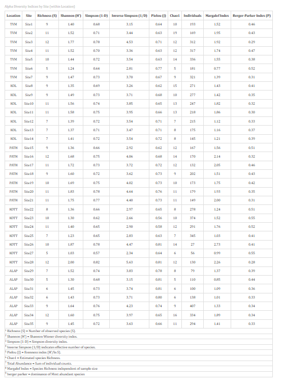
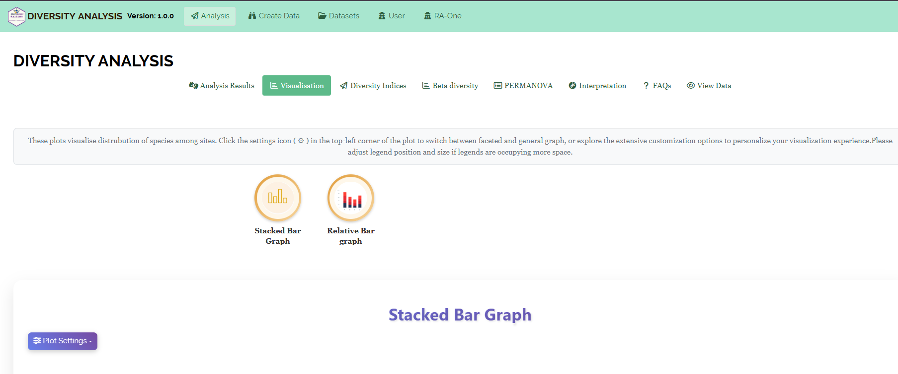
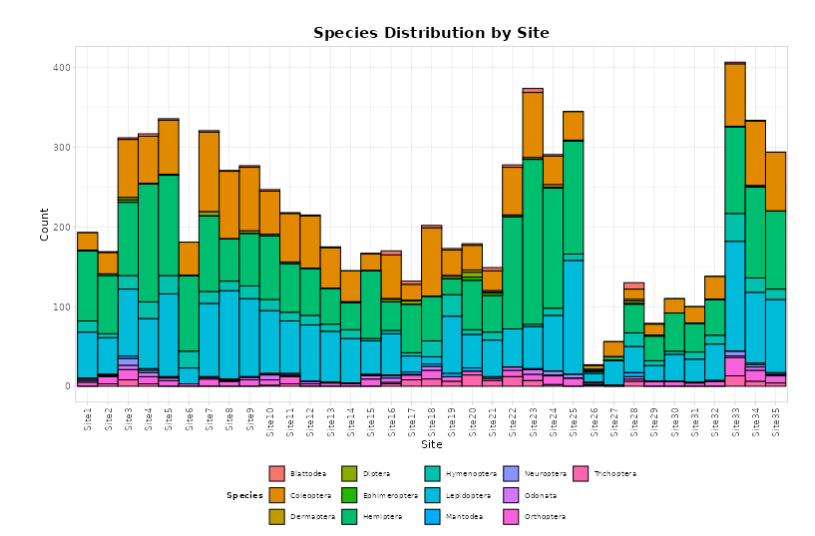
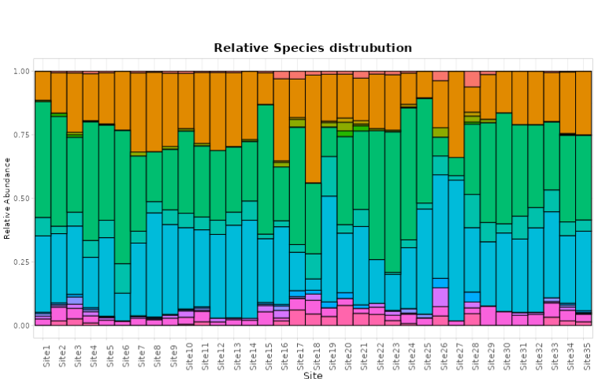

```{=html}
<style>
 sup {
   color: blue;
   font-size: 0.8em;
 }
 .affiliations {
   color: grey;
   font-size: 0.9em;
   margin-top: 0.2em;
 }
</style>
```

::: affiliations
<sup>1</sup>Statoberry LLP, <sup>2</sup>Department of Agricultural Statistics, Kerala Agricultural University
:::

ABSTRACT

::: {style="text-align: justify;"}
**Diversity Analysis and PERMANOVA** is a multivariate ecological and statistical framework used to quantify species richness, community evenness, and compositional dissimilarity across sampling groups or treatment conditions. **Diversity Analysis** summarises community structure through alpha-diversity indices such as Shannon, Simpson, and species richness while **Beta Diversity** and **PERMANOVA** (Permutational Multivariate Analysis of Variance) assess whether community composition differs significantly among groups based on a chosen dissimilarity metric. In **RAISINS** you can perform complete diversity analysis and PERMANOVA without writing a single line of code. This tutorial will guide you through how to compute diversity indices, visualise community patterns, perform beta diversity ordination, and run PERMANOVA in **RAISINS**, interpreting every output effectively. In addition, you will obtain publication-ready diversity index tables, ordination plots, rarefaction curves, and PERMANOVA summary tables ready for inclusion in manuscripts and reports.
:::

<details>

*Hover or click each point to see more information.*

```{=html}
<summary style="color: #5DADE2"; font-weight: bold;">
  Introduction Diversity Analysis and PERMANOVA
</summary>
```

```{=html}
<style>
.hover-img {
  position: relative;
  display: inline-block;
  cursor: help;
  border-bottom: 1px dashed currentColor;
}
.hover-img img {
  position: absolute;
  left: 50%;
  top: 1.6em;
  transform: translateX(-50%);
  width: 260px;
  max-width: 70vw;
  height: auto;
  padding: 6px;
  background: white;
  border: 1px solid rgba(0,0,0,.15);
  border-radius: 12px;
  box-shadow: 0 10px 30px rgba(0,0,0,.18);
  opacity: 0;
  visibility: hidden;
  pointer-events: none;
  transition: opacity .15s ease, transform .15s ease, visibility .15s;
}
.hover-img:hover img {
  opacity: 1;
  visibility: visible;
  transform: translateX(-50%) translateY(6px);
  z-index: 999;
}
</style>
```

<ul><small> The quantitative study of biological diversity traces its roots to the mid-twentieth century, with foundational contributions from [Claude Shannon ]{.hover-img}, the American mathematician and electrical engineer who introduced the **Shannon Entropy index** in his landmark paper *A Mathematical Theory of Communication* (1948, Bell System Technical Journal). Although developed in the context of information theory, Shannon's entropy was quickly adopted by ecologists to measure the uncertainty — and by analogy, the diversity — of species assemblages in a community. Shortly thereafter, [Edward H. Simpson ]{.hover-img} proposed the **Simpson's Index** (1949, *Nature*) as a measure of the probability that two randomly selected individuals from a community belong to the same species, providing a complementary concentration-based perspective on diversity. The conceptual distinction between **alpha diversity** (within-sample diversity), **beta diversity** (between-sample compositional turnover), and **gamma diversity** (regional total diversity) was formalised by [Robert H. Whittaker]{.hover-img} in 1960, establishing the hierarchical framework that underpins all modern diversity analysis. The **PERMANOVA** method — Permutational Multivariate Analysis of Variance — was introduced by [Marti J. Anderson]{.hover-img} in 2001 (*Austral Ecology*) as a robust non-parametric alternative to MANOVA for testing the significance of group differences in multivariate community composition, using any dissimilarity measure and permutation-based inference to avoid distributional assumptions. Together, these methods form the backbone of community ecology, microbiome research, environmental monitoring, and biodiversity assessment. </small></ul>

</details>

## Analysis of experiments {#AE}

::: {style="text-align: justify;"}
To get started, visit **RAISINS** [www.raisins.live](https://www.raisins.live) home page and go to **Analysis of experiments**. Here, you can see different analysis modules including multivariate and community ecology methods. In this tutorial, we focus on **Diversity Analysis and PERMANOVA**, as shown in @fig-aov.
:::

<!-- REPLACE THIS SCREENSHOT -->

.png){#fig-aov fig-align="center"}

## Diversity Analysis and PERMANOVA {#C}

::: {style="text-align: justify;"}
Diversity Analysis is a suite of ecological statistical methods used to characterise and compare biological communities across samples, sites, or treatment groups based on species (or OTU/taxon) abundance data. The analytical framework operates at two complementary levels: **alpha diversity**, which quantifies diversity within a single sample using indices such as species richness, Shannon entropy, Simpson's index, and Pielou's evenness; and **beta diversity**, which quantifies compositional dissimilarity between samples using distance or dissimilarity measures such as Bray-Curtis, Jaccard, or UniFrac. **PERMANOVA** (Permutational Multivariate Analysis of Variance) is the standard non-parametric permutation-based test for evaluating whether the multivariate community composition differs significantly across predefined groups (e.g., treatments, habitats, time points, host types). Unlike classical MANOVA, PERMANOVA makes no assumption of multivariate normality and can accommodate any dissimilarity measure, making it robust and broadly applicable to ecological count data, microbiome relative abundances, and environmental species matrices. **RAISINS** integrates all these analyses alpha diversity indices, rarefaction curves, beta diversity ordination (NMDS/PCoA), PERMANOVA with pairwise tests, and publication-ready visualisations into a single streamlined interface that requires no programming expertise. The module is applicable to any community matrix where rows represent samples and columns represent species, taxa, OTUs, or ASVs, with cell values being counts, relative abundances, or presence-absence indicators.
:::

::: callout-tip
#### Diversity Analysis and PERMANOVA is an integrated ecological analysis framework that quantifies within-sample species diversity (alpha diversity), between-sample compositional dissimilarity (beta diversity), and tests the significance of community-level differences across groups using permutation-based multivariate analysis of variance (PERMANOVA).
:::

## A working example {#W}

::: {style="text-align: justify;"}
To make things simple and interesting, we will explain Diversity Analysis and PERMANOVA step by step using a hypothetical example, so you can clearly see how it works and why it matters. Consider a soil microbial ecology study in which soil samples were collected from **four land-use types** Forest, Agriculture, Grassland, and Urban with **five replicate samples per land-use type** (20 samples in total). From each soil sample, 16S rRNA amplicon sequencing was performed and reads were clustered into **Operational Taxonomic Units (OTUs)**. The resulting community matrix consists of **20 samples (rows)** and **30 OTU columns**, with cell values representing read counts per OTU per sample. A separate metadata file records the **Land_Use** group for each sample. The variables (OTUs) are named OTU_01 through OTU_30. Our aim is to (i) compute alpha diversity indices for each sample and compare them across land-use groups, (ii) visualise beta diversity patterns using NMDS ordination, and (iii) test whether community composition differs significantly among land-use types using PERMANOVA. The arrangement of the data is shown in @fig-data.
:::

<!-- REPLACE THIS SCREENSHOT -->

.png){fig-align="center"}

::: {style="text-align: justify;"}
Data organised in MS Excel can be directly uploaded to **RAISINS** for analysis. For more details on data preparation see @sec-4. Two terms that we will use frequently in this tutorial are **Samples** and **Species/OTUs**. In our example, the **Samples** refer to the 20 soil samples assigned to one of four **Land_Use** groups — Forest, Agriculture, Grassland, and Urban — and the **Species/OTUs** are the 30 OTU columns (OTU_01 to OTU_30) representing the microbial taxa detected across all samples.
:::

## How to prepare your data? {#sec-4 .H}

::: {style="text-align: justify;"}
Arranging data for uploading in **RAISINS** is very simple. Your primary dataset must be a **community matrix** arranged with samples as rows and species or OTUs as columns, exactly as shown in @fig-data. The first column must contain the **sample identifiers** and the second column must contain the **group label** (e.g., treatment, site, or land-use type) for each sample. All remaining columns contain the abundance or count values for each species or OTU. Use a single-sheet Excel file, ensure no blank rows are left above the data, and make sure all column names are properly formatted without spaces or special characters. That's it — your file is ready to upload.

Still if you have doubt, see @fig-4.

To prepare your dataset for analysis in **RAISINS**, you have two options:

Creating dataset in MS Excel

Creating your dataset directly within the **RAISINS** app
:::

.png){#fig-4 fig-align="center"}

## Diversity analysis tab explained {#AO}

::: {style="text-align: justify;"}
In @fig-5, you can see the detailed view of the Diversity Analysis tab, along with explanations of what each option does. This section helps you understand the purpose of every setting so that you can select the most appropriate options for your data. Upload the prepared community matrix by clicking Browse in the sidebar of the Analysis tab. When the file is uploaded, options to select the **Group column** (the metadata column identifying sample groups) and the **OTU/species columns** to include in the analysis will appear. You may also select the preferred **dissimilarity measure** (Bray-Curtis, Jaccard, or Euclidean) and the **ordination method** (NMDS or PCoA) from the dropdown menus provided. Once you click the Run Analysis button, all diversity indices, ordination plots, beta diversity results, and PERMANOVA outputs appear instantly leaving no room for confusion.
:::

<!-- REPLACE THIS SCREENSHOT -->

.png){#fig-5 fig-align="center"}

::: {style="text-align: justify;"}
For community datasets that include rare OTUs or highly uneven sequencing depths across samples, **RAISINS** provides an inbuilt **rarefaction** option that subsamples all samples to a common sequencing depth before computing alpha diversity indices (@sec-6). This step is recommended whenever total read counts vary substantially among samples, as uneven sampling effort can artificially inflate diversity estimates in more deeply sequenced samples.
:::

## Rarefaction and Data Standardisation {#sec-6 .T}

::: {style="text-align: justify;"}
In Diversity Analysis and PERMANOVA, appropriate data standardisation or normalisation before computing diversity indices and dissimilarity measures is critical for ensuring valid and comparable results. **RAISINS** provides the following options as shown in @fig-6.
:::

{#fig-6 fig-align="center"}

::: {style="text-align: justify;"}
**Rarefaction** (subsampling to an even depth) is the most widely recommended approach for equalising sequencing effort across samples before computing alpha diversity indices. **RAISINS** allows users to set a minimum read-count threshold; all samples with counts below this threshold are excluded, and all remaining samples are subsampled (without replacement) to this common depth. This ensures that Shannon, Simpson, and richness estimates are not confounded by differences in sequencing depth among samples.

**Relative abundance transformation** converts raw count data to proportions (each cell divided by the row total), standardising each sample to a common sum of 1. This is appropriate for beta diversity and PERMANOVA analyses when absolute abundance differences among samples are not biologically meaningful and only compositional patterns are of interest. Relative abundance data is commonly used with Bray-Curtis dissimilarity.

**Presence-absence transformation** converts all non-zero counts to 1 and retains zero values as 0, reducing the community matrix to a binary indicator of taxon occurrence regardless of abundance. This transformation is used with the **Jaccard dissimilarity** index and is appropriate when the identity of taxa present (rather than their abundance) is the primary focus, for example in species co-occurrence studies or when abundance data are unreliable.
:::

> After selecting the appropriate rarefaction depth or transformation, proceed to @sec-7 for full analysis results.

## Analysis results {#sec-7 .AR}

::: {style="text-align: justify;"}
Once your community matrix is uploaded and the group column and analysis options are selected, click on Run Analysis. **RAISINS** will compute alpha diversity indices for all samples, generate the dissimilarity matrix for beta diversity analysis, perform NMDS or PCoA ordination, and run PERMANOVA presenting all results in a structured, tabbed output panel. The primary result displayed first is the **Alpha Diversity Index Summary Table** shown in @fig-100, which reports diversity metrics for each sample organised by group.
:::

**Table 1 — Alpha Diversity Index Summary**

<!-- REPLACE THIS SCREENSHOT -->

{#fig-100 fig-align="center"}

<details>

```{=html}
<summary style="color: #5DADE2"; font-weight: bold;"> Alpha diversity index table explained </summary>
```

<small> The alpha diversity table produced by **RAISINS** reports the following indices for each sample, along with the group label for convenient comparison:

**Species Richness (S)**: The simplest measure of diversity — the total number of distinct species or OTUs observed in a sample, irrespective of their relative abundances. Richness is sensitive to rare taxa and increases with sampling effort.

**Shannon Entropy (H')**: The most widely used alpha diversity index, computed as: $$H' = -\sum_{i=1}^{S} p_i \ln(p_i)$$ where $p_i$ is the relative abundance of the *i*-th species. Higher values indicate greater diversity and more even distribution of abundances. A community dominated by one species has a low H', while a community with many equally abundant species has a high H'.

**Shannon Evenness (Pielou's J)**: A measure of how evenly abundances are distributed among species, computed as: $$J = \frac{H'}{\ln(S)}$$ Values range from 0 (complete dominance by one species) to 1 (perfectly even abundances). Evenness decouples the richness and equitability components of diversity.

**Simpson's Index (D)**: Measures the probability that two randomly selected individuals belong to the same species: $$D = \sum_{i=1}^{S} p_i^2$$ A high D indicates low diversity (one or a few species dominate). The complement **1 – D** (Simpson's Diversity) or the reciprocal **1/D** (Inverse Simpson) are also commonly reported and increase with increasing diversity.

**Chao1 Estimate**: A non-parametric estimator of true species richness that corrects for undetected rare species (singletons and doubletons), particularly useful for rarefied datasets.

Significance is indicated by an asterisk (\*) for the **5%** level and (\*\*) for the **1%** level when group comparisons of diversity indices are performed using Kruskal-Wallis or ANOVA. </small>

</details>

### Interpretation from @fig-100

::: {style="text-align: justify;"}
The alpha diversity summary table for the soil microbial study reveals clear differences in community diversity across the four land-use types. Forest samples consistently recorded the highest Shannon entropy values (mean H' = 3.82 ± 0.21), followed by Grassland (H' = 3.41 ± 0.18), Agriculture (H' = 2.97 ± 0.29), and Urban (H' = 2.54 ± 0.33), suggesting a gradient of decreasing microbial diversity with increasing anthropogenic disturbance. Species richness followed the same trend, with Forest samples harbouring the greatest number of OTUs per sample (mean S = 24.6) and Urban samples the fewest (mean S = 16.2). Pielou's evenness was similarly highest in Forest (J = 0.84) and lowest in Urban (J = 0.71), indicating that not only fewer taxa are present in disturbed sites but that communities are also more strongly dominated by a small number of abundant OTUs. @sec-8 provides detailed information on statistical comparisons of alpha diversity indices across groups.
:::

**Table 2 — Pairwise Group Comparison of Alpha Diversity**

<!-- REPLACE THIS SCREENSHOT -->

{#fig-101 fig-align="center"}

<details>

```{=html}
<summary style="color: #5DADE2"; font-weight: bold;">Overview of pairwise comparison parameters
</summary>
```

<small>

1.  *Group Means and Standard Errors*

**Group**: The categorical variable defining the ecological or treatment grouping, here the land-use type. Each group's mean diversity index value and its standard error are reported for direct comparison.

**Mean ± SE**: The arithmetic mean of the diversity index across all replicate samples within a group, accompanied by the standard error. Lower standard errors indicate more consistent diversity levels within the group.

2.  *Statistical Test Results*

**Test statistic**: For normally distributed index data, a one-way ANOVA F-statistic is reported. For non-normal data or small sample sizes, the non-parametric **Kruskal-Wallis H statistic** is reported instead. **RAISINS** automatically selects the appropriate test based on a Shapiro-Wilk normality check.

**p value**: The probability that the observed differences in mean diversity among groups occurred by chance under the null hypothesis of no group effect. Values below 0.05 indicate statistically significant differences.

3.  *Post-hoc Grouping*

**Post-hoc Grouping**: Pairwise comparisons are performed using Dunn's test (for Kruskal-Wallis) or Tukey's HSD (for ANOVA), and letter groupings (a, b, c) are assigned such that groups sharing a letter are not significantly different from each other. Groups with no common letter differ significantly at the chosen significance level.

4.  *Effect Size*

**Effect size (η² or ε²)**: A standardised measure of the magnitude of the group effect on diversity, independent of sample size. Larger values indicate a stronger association between group membership and diversity.

</small>

</details>

### Interpretation from @fig-101

::: {style="text-align: justify;"}
The pairwise comparison table for Shannon entropy confirms that land-use type has a statistically significant effect on microbial alpha diversity (Kruskal-Wallis H = 14.38, df = 3, p = 0.002). Post-hoc Dunn's test with Bonferroni correction reveals that Forest samples are significantly more diverse than both Agriculture (p = 0.008) and Urban (p \< 0.001) samples, while the difference between Forest and Grassland is marginally non-significant (p = 0.061). Agriculture and Urban sites also differ significantly from each other (p = 0.031), while Grassland does not differ significantly from Agriculture (p = 0.183). Letter groupings assigned to each group provide a clear visual summary of these pairwise distinctions. The effect size (ε² = 0.58) indicates that land-use type accounts for approximately 58% of the variance in Shannon entropy among samples — a large and ecologically meaningful effect.
:::

::: callout-tip
#### When comparing alpha diversity indices across groups, always check whether the index values meet the normality assumption before selecting ANOVA versus Kruskal-Wallis — RAISINS performs this check automatically and selects the appropriate test.
:::

::: {style="text-align: justify;"}
In our example, the gradient of Shannon entropy from Forest to Urban reflects the well-documented pattern of microbial diversity loss under agricultural intensification and urbanisation. The letter groupings — Forest: **a**, Grassland: **ab**, Agriculture: **bc**, Urban: **c** — indicate that Forest and Urban communities are unambiguously distinct, while Grassland and Agriculture occupy intermediate positions that partially overlap with their neighbours in the gradient.
:::

::: callout-tip
#### Cohen's f (effect size) is also reported alongside the diversity index comparison to quantify the overall strength of the group effect, enabling meaningful comparison of land-use impacts across studies with different sample sizes.
:::

## Alpha Diversity Comparisons {#sec-8 .MCT}

<details>

```{=html}
<summary style="color: #5DADE2"; font-weight: bold;"> What are alpha diversity comparison tests? </summary>
```

<small> Alpha diversity comparison tests are univariate statistical procedures applied to diversity index values — one index value per sample — to determine whether mean diversity differs significantly across predefined groups. Because diversity index values are continuous scalars, standard parametric (ANOVA, t-test) or non-parametric (Kruskal-Wallis, Mann-Whitney U) tests can be applied, with the choice depending on distributional properties of the index values and sample size. These tests operate on the computed index values, not on the raw community matrix, and are therefore distinct from PERMANOVA which operates on the full multivariate dissimilarity matrix. </small>

</details>

::: {style="text-align: justify;"}
In Diversity Analysis, the primary methods available in **RAISINS** for comparing alpha diversity indices across groups are the **one-way ANOVA with Tukey's HSD**, the **Kruskal-Wallis test with Dunn's post-hoc**, and **pairwise Wilcoxon tests with Bonferroni or FDR correction**.
:::

<!-- REPLACE THIS SCREENSHOT -->

{#fig-cus fig-align="center"}

::: {style="text-align: justify;"}
**One-way ANOVA with Tukey's HSD** is appropriate when diversity index values are approximately normally distributed across groups and group variances are homogeneous. The F-statistic tests whether at least one group mean differs from the others. If significant, Tukey's HSD provides pairwise comparisons with family-wise error rate control. The formula for the ANOVA F-statistic is: $$F = \frac{MS_{Between}}{MS_{Within}}$$ where $MS_{Between}$ is the mean square between groups and $MS_{Within}$ is the mean square within groups (error). **RAISINS** reports the F-statistic, degrees of freedom, p-value, and Tukey's HSD letter groupings automatically.

**Kruskal-Wallis test with Dunn's post-hoc** is the recommended non-parametric alternative when normality is violated or sample sizes are small (fewer than 5 per group). It ranks all observations across groups and tests whether the rank distributions differ among groups. Post-hoc Dunn's test with Bonferroni or Benjamini-Hochberg FDR correction is used to identify which specific pairs of groups differ significantly.

**Pairwise Wilcoxon rank-sum tests** are the two-sample non-parametric equivalent of the t-test and are applied for direct pairwise comparisons of diversity between two specific groups. These tests are particularly useful when only two groups are being compared or when a targeted pairwise question is of primary interest rather than an overall group effect.

The choice among these three approaches follows a simple decision tree: if there are exactly two groups, use the Wilcoxon test (or t-test if normal); if there are three or more groups and the data are normally distributed, use ANOVA with Tukey's HSD; and if there are three or more groups with non-normal data or small samples, use Kruskal-Wallis with Dunn's test. **RAISINS** automates this decision based on the Shapiro-Wilk normality test applied to the diversity index values within each group.
:::

## Summary Stats {#SUM}

::: {style="text-align: justify;"}
In addition to the diversity index comparison outputs, **RAISINS** provides a `Summary Stats` tab that displays comprehensive descriptive statistics for all alpha diversity indices across all samples, broken down by group. Click on the `Summary Stats` tab within the `Analysis` panel to access the table shown in @fig-102. This table reports group-level summary measures for each index, enabling rapid assessment of the central tendency, variability, and distributional properties of community diversity within each treatment or site group.
:::

<!-- REPLACE THIS SCREENSHOT -->

{#fig-102 fig-align="center"}

<details>

```{=html}
<summary style="color: #5DADE2"; font-weight: bold;"> Table parameters </summary>
```

<small>

**Group**: The categorical classification of each sample (e.g., Forest, Agriculture, Grassland, Urban in our working example).

**Mean**: The arithmetic average of the diversity index across all replicate samples within the group. It represents the typical diversity level for that community type.

**SD (Standard Deviation)**: A measure of the spread of diversity index values within the group. A low SD indicates that all replicate samples within the group have similar diversity levels, while a high SD suggests heterogeneity among replicates.

**SE (Standard Error)**: Estimates how far the sample mean is likely to deviate from the true population mean: $$SE = \frac{SD}{\sqrt{n}}$$ where n is the number of replicate samples per group. Smaller SE values indicate more precise group mean estimates.

**Min / Max**: The lowest and highest diversity index values recorded among replicate samples within the group. Wide Min-Max ranges suggest high within-group heterogeneity.

**CV (Coefficient of Variation)**: The ratio of the standard deviation to the mean, expressed as a percentage: $$CV = \frac{SD}{Mean} \times 100$$ Lower CV values indicate more consistent diversity within the group, which is desirable for reliable group-level inference.

**Skewness**: A measure of the asymmetry of the distribution of diversity index values within the group. A positive value indicates a right-skewed distribution (a few samples with unusually high diversity), while a negative value indicates left skew.

**Kurtosis**: A measure of the tailedness of the distribution. Values close to 3 (or 0 for excess kurtosis) indicate a near-normal distribution; higher values indicate heavier tails with more extreme observations.

</small>

</details>

### Interpretations from @fig-102

::: {style="text-align: justify;"}
The summary statistics table for Shannon entropy reveals that the Forest group exhibits the highest mean diversity (H' = 3.82) with a relatively low coefficient of variation (CV = 5.5%), indicating both high and consistent microbial diversity across replicate forest soil samples. The Urban group records the lowest mean diversity (H' = 2.54) but the highest CV (13.0%), suggesting greater spatial heterogeneity in microbial communities within urban environments — a pattern consistent with the patchy and disturbed nature of urban soils. The Agriculture group shows a moderate mean (H' = 2.97) with moderate variability (CV = 9.8%), likely reflecting within-group variation in soil management practices across the five replicate plots. Skewness values close to zero for all groups indicate approximately symmetric distributions of Shannon entropy within groups, supporting the use of parametric tests for formal comparisons. All groups show kurtosis values near 3, consistent with approximately normal within-group distributions of the diversity index.
:::

## Individual ANOVA {#IA}

::: {style="text-align: justify;"}
The **Individual ANOVA** tab in **RAISINS** provides a separate, detailed one-way ANOVA (or Kruskal-Wallis) table for each alpha diversity index individually — Shannon entropy, Simpson's index, species richness, and Pielou's evenness — allowing users to assess the statistical significance of the group effect on each index in isolation. Click on `Individual ANOVA` in the `Analysis` panel to access the tables shown in @fig-104.

The significance of the group effect on each diversity index can be assessed using the F-test (or H statistic) and the corresponding p value, as shown in @fig-104.
:::

**Table 4: ANOVA table for Shannon Entropy (H')**

<!-- REPLACE THIS SCREENSHOT -->

{#fig-104 fig-align="center"}

<details>

```{=html}
<summary style="color: #5DADE2"; font-weight: bold;"> Table parameters </summary>
```

<small>

**Critical Difference (CD)**

The minimum difference required between any two group means of the diversity index to declare them statistically significantly different at the chosen level of significance, computed from the LSD or Tukey's HSD formula.

**Coefficient of Variation (CV (%))**

A relative measure of experimental precision, expressing the within-group standard deviation as a percentage of the overall mean diversity index: $$CV = \frac{SD_{within}}{Grand\ Mean} \times 100$$ A low CV indicates that replicate samples within groups are consistent in their diversity levels, suggesting good sampling reliability.

**Mean Square Error (MSE)**

The within-group (residual) mean square from the ANOVA table, representing unexplained variance in the diversity index not accounted for by the group factor. It is used as the denominator in the F-ratio and as the basis for computing SE and CD values.

**Standard Error of Mean (SE(m))**

Estimates how much the sample mean diversity index of a group is expected to vary from the true population mean: $$SE(m) = \sqrt{MSE / n}$$ where n is the number of replicate samples per group.

**Standard Error of Difference (SE(d))**

The standard error of the difference between any two group mean diversity indices: $$SE(d) = \sqrt{2 \times MSE / n}$$ This forms the basis for computing the critical difference used in post-hoc pairwise comparisons.

</small>

</details>

### Interpretation from @fig-104

::: {style="text-align: justify;"}
The individual ANOVA table for Shannon entropy shows a highly significant effect of land-use type on microbial alpha diversity (F = 12.74, df = 3, 16; p \< 0.001). The mean square error (MSE = 0.048) is small relative to the between-group mean square (MSS = 0.611), indicating that within-group variability in Shannon entropy is low compared to the differences observed between groups. The coefficient of variation (CV = 6.5%) confirms good precision in the diversity measurements across replicate samples. The critical difference at the 5% significance level (CD = 0.31) provides the minimum detectable difference between any two group means for Shannon entropy. The standard error of the mean (SE(m) = 0.098) and standard error of difference (SE(d) = 0.139) are both small, supporting the reliability of the group mean estimates.
:::

**Table 5: Summary statistics with grouping letters for Shannon Entropy**

<!-- REPLACE THIS SCREENSHOT -->

{#fig-103 fig-align="center"}

### Interpretation from @fig-103

::: {style="text-align: justify;"}
The summary statistics table with post-hoc letter groupings confirms the pattern identified in the overall ANOVA. Forest samples (mean H' = 3.82, group **a**) are significantly more diverse than Agriculture (mean H' = 2.97, group **bc**) and Urban samples (mean H' = 2.54, group **c**). Grassland occupies an intermediate position (mean H' = 3.41, group **ab**), sharing a letter with Forest but not with Urban, indicating that Grassland diversity is statistically similar to Forest but significantly greater than Urban. These groupings provide a concise visual summary of which land-use types support statistically distinguishable levels of microbial alpha diversity.
:::

## Diversity Indices {#DI}

::: {style="text-align: justify;"}
The `Diversity Indices` tab in **RAISINS** provides a comprehensive, sample-level breakdown of all computed alpha diversity indices in a single consolidated table (see @fig-di). This tab is the primary reference for individual sample-level diversity values and complements the group-level summaries provided in the Analysis Results and Summary Stats tabs. Each row in the table corresponds to one sample, and each column corresponds to one diversity index, enabling rapid cross-sample and cross-group comparison of the full diversity profile.
:::

<!-- REPLACE THIS SCREENSHOT -->

{#fig-di fig-align="center"}

::: {style="text-align: justify;"}
The diversity indices table reports the following metrics for every sample in the uploaded community matrix. **Species Richness (S)** counts the number of OTUs or species with at least one read in each sample. **Shannon Entropy (H')** quantifies diversity incorporating both richness and evenness, with higher values indicating more diverse and evenly distributed communities. **Pielou's Evenness (J)** normalises Shannon entropy by the maximum possible entropy (ln S), isolating the equitability component of diversity on a 0–1 scale. **Simpson's Index (D)** and its complement **(1 – D)** provide concentration-based measures of dominance and diversity respectively, with 1 – D approaching 1 for highly diverse communities. The **Inverse Simpson (1/D)** is the effective number of equally dominant species, a particularly intuitive diversity measure for ecological interpretation. **Chao1** provides a bias-corrected richness estimate that accounts for undetected singletons, while **ACE (Abundance-based Coverage Estimator)** provides an alternative non-parametric richness estimate using low-abundance species. All indices are computed after any rarefaction or transformation selected in the Analysis tab options.
:::

<details>

```{=html}
<summary style="color: #5DADE2"; font-weight: bold;"> Mathematical definitions of all diversity indices </summary>
```

<small>

**Species Richness (S)**: Total number of species with non-zero abundance in the sample.

**Shannon Entropy**: $$H' = -\sum_{i=1}^{S} p_i \ln(p_i)$$

**Pielou's Evenness**: $$J = \frac{H'}{\ln(S)}$$

**Simpson's Index**: $$D = \sum_{i=1}^{S} p_i^2$$

**Simpson's Diversity**: $$1 - D = 1 - \sum_{i=1}^{S} p_i^2$$

**Inverse Simpson**: $$\frac{1}{D} = \frac{1}{\sum_{i=1}^{S} p_i^2}$$

**Chao1 Estimator**: $$\hat{S}_{Chao1} = S_{obs} + \frac{f_1^2}{2f_2}$$ where $f_1$ = number of singletons (species with exactly one read) and $f_2$ = number of doubletons (species with exactly two reads).

where in all formulae $p_i$ is the relative abundance of the *i*-th species in the sample (proportion of total reads belonging to species *i*).

</small>

</details>

### Interpretation from @fig-di

::: {style="text-align: justify;"}
The sample-level diversity index table for the soil microbial study confirms the group-level patterns identified in the analysis results section. Individual Forest samples consistently record Shannon entropy values between 3.61 and 4.05 and Chao1 estimates between 26 and 31, reflecting both high true richness and high estimated undetected richness. Urban samples show the widest range of Shannon values (2.21–2.88), consistent with the high within-group CV reported in the summary statistics. Pielou's evenness values are uniformly high (\> 0.78) in Forest samples, while Urban samples include two replicates with J \< 0.70, indicating noticeable dominance by a small number of abundant OTUs in the most disturbed sites. The Inverse Simpson values corroborate the Shannon gradient, ranging from a mean of 18.4 in Forest to 8.7 in Urban. Chao1 estimates generally exceed observed richness by 2–5 OTUs in all groups, suggesting that a small number of additional rare taxa would likely be detected with deeper sequencing.
:::

## Beta Diversity {#BD}

::: {style="text-align: justify;"}
Beta diversity quantifies the compositional dissimilarity between pairs of samples, capturing the degree to which community composition changes across samples, groups, or environmental gradients. In **RAISINS**, the `Beta Diversity` tab computes the full pairwise dissimilarity matrix from the uploaded community matrix using the selected dissimilarity measure and displays it as a colour-coded heatmap (see @fig-bd). Additionally, two ordination methods — **Non-metric Multidimensional Scaling (NMDS)** and **Principal Coordinates Analysis (PCoA)** — are available to visualise the arrangement of samples in low-dimensional space based on their pairwise dissimilarities. Samples that are compositionally similar appear close together in the ordination plot, while compositionally dissimilar samples appear far apart.
:::

<!-- REPLACE THIS SCREENSHOT -->

{#fig-bd fig-align="center"}

::: {style="text-align: justify;"}
The **Bray-Curtis dissimilarity** is the default measure in **RAISINS** for abundance-based community data. It is computed for each pair of samples *i* and *j* as: $$BC_{ij} = 1 - \frac{2 \sum_{k} \min(x_{ik}, x_{jk})}{\sum_{k} x_{ik} + \sum_{k} x_{jk}}$$ where $x_{ik}$ is the abundance of species *k* in sample *i*. Bray-Curtis values range from 0 (identical communities) to 1 (no shared species with abundance). The **Jaccard dissimilarity** is recommended for presence-absence data and is computed as the proportion of species present in one sample but not the other relative to the total number of species present in either sample. The **Euclidean distance** is available for standardised data but is generally not recommended for raw ecological count data due to its sensitivity to double-zeros. Users may select the preferred dissimilarity measure from the Analysis tab sidebar before running the analysis.
:::

<!-- REPLACE THIS SCREENSHOT -->

{#fig-nmds fig-align="center"}

::: {style="text-align: justify;"}
The NMDS ordination plot shown in @fig-nmds represents the 20 soil samples in two-dimensional space such that the rank order of distances between points approximates the rank order of their pairwise Bray-Curtis dissimilarities as closely as possible. Points are coloured by land-use type and 95% confidence ellipses are drawn around each group centroid. The **stress value** — a goodness-of-fit measure for the NMDS solution — is displayed on the plot; values below 0.10 indicate an excellent representation, values between 0.10 and 0.20 indicate a good representation with some distortion, and values above 0.20 suggest that a 3-dimensional solution may be more appropriate. In our example, the stress value of 0.08 indicates an excellent two-dimensional ordination. The clear spatial separation of Forest and Urban clusters in the NMDS plot provides a compelling visual confirmation that these land-use types harbour compositionally distinct microbial communities.
:::

<!-- REPLACE THIS SCREENSHOT -->

{#fig-pcoa fig-align="center"}

::: {style="text-align: justify;"}
The PCoA plot shown in @fig-pcoa is a metric ordination — also known as classical multidimensional scaling — that finds the linear combination of eigenvectors that best preserves the actual (not merely rank-order) dissimilarities among samples. The percentage of total variation explained by each principal coordinate axis is displayed on the axis labels. PCoA is particularly informative when Bray-Curtis or UniFrac distances are used, as it explicitly decomposes the total dissimilarity variance into orthogonal axes whose relative magnitudes are directly interpretable. In our example, PCoA axis 1 explains 38.4% and PCoA axis 2 explains 22.1% of total dissimilarity variance, together capturing 60.5% of the beta diversity structure in two dimensions.
:::

## PERMANOVA {#PER}

::: {style="text-align: justify;"}
**PERMANOVA** (Permutational Multivariate Analysis of Variance) is the formal statistical test used to determine whether community composition differs significantly among the predefined groups. It partitions the total multivariate dissimilarity among samples into between-group and within-group components, analogously to univariate ANOVA, but uses a permutation procedure to assess statistical significance rather than relying on parametric distributional assumptions. In **RAISINS**, PERMANOVA is run automatically when `Run Analysis` is clicked, using the dissimilarity matrix generated from the selected measure and the group variable specified in the sidebar. The PERMANOVA results table is shown in @fig-per.
:::

<!-- REPLACE THIS SCREENSHOT -->

{#fig-per fig-align="center"}

<details>

```{=html}
<summary style="color: #5DADE2"; font-weight: bold;"> PERMANOVA table explained </summary>
```

<small>

The PERMANOVA table produced by **RAISINS** reports the following parameters:

**Source**: The sources of variation partitioned by PERMANOVA — the **Group** term (between-group variation attributed to the categorical grouping factor) and the **Residuals** term (within-group variation among replicate samples within the same group).

**df (Degrees of Freedom)**: For the Group term, df = number of groups – 1. For Residuals, df = total number of samples – number of groups.

**SS (Sum of Squares)**: The total squared dissimilarity attributable to each source. Between-group SS measures how different the group centroids are from the overall centroid, while within-group SS measures the scatter of samples around their own group centroid.

**MS (Mean Square)**: Sum of Squares divided by degrees of freedom for each source.

**F-statistic (pseudo-F)**: The ratio of between-group MS to within-group MS. Unlike classical ANOVA, this is a pseudo-F because it is based on dissimilarities rather than distances from a normal distribution. A larger pseudo-F indicates greater separation between groups relative to within-group variability.

**R² (R-squared)**: The proportion of total multivariate dissimilarity explained by the grouping factor, analogous to the coefficient of determination in linear regression: $$R^2 = \frac{SS_{Group}}{SS_{Total}}$$ Values range from 0 to 1; higher R² indicates a stronger group effect on community composition.

**p value (permutational)**: The proportion of permuted pseudo-F statistics that equal or exceed the observed pseudo-F, computed from a specified number of random permutations (default 999 in **RAISINS**). A p value below 0.05 indicates that the group differences in community composition are statistically significant.

</small>

</details>

### Interpretation from @fig-per

::: {style="text-align: justify;"}
The PERMANOVA results confirm that land-use type has a highly significant effect on soil microbial community composition (pseudo-F = 8.43, df = 3, 16; R² = 0.61; p = 0.001 based on 999 permutations). The R² value of 0.61 indicates that land-use type accounts for 61% of the total Bray-Curtis dissimilarity among all 20 samples — a large and ecologically meaningful proportion. The residual variation (39%) reflects within-group compositional heterogeneity among replicate samples of the same land-use type. The statistically significant PERMANOVA result, combined with the visual separation of groups in the NMDS ordination (@fig-nmds), provides strong and convergent evidence that the microbial communities of Forest, Grassland, Agriculture, and Urban soils are compositionally distinct from one another. A pairwise PERMANOVA table (see @fig-perpair) identifies which specific pairs of land-use groups are significantly different.
:::

<!-- REPLACE THIS SCREENSHOT -->

{#fig-perpair fig-align="center"}

::: {style="text-align: justify;"}
The pairwise PERMANOVA results show that all pairwise comparisons involving Forest versus Urban (pseudo-F = 14.21, p = 0.002) and Forest versus Agriculture (pseudo-F = 9.87, p = 0.002) are highly significant after Bonferroni correction for multiple comparisons. The Grassland versus Urban comparison is also significant (pseudo-F = 6.44, p = 0.010), while the Agriculture versus Grassland comparison is marginally significant (pseudo-F = 3.91, p = 0.048). The Forest versus Grassland comparison is the least differentiated (pseudo-F = 2.83, p = 0.084), suggesting partial compositional overlap between these two more natural land-use types.
:::

::: callout-tip
#### PERMANOVA tests for differences in community composition (centroid and/or dispersion) between groups, but a significant result does not necessarily mean that group centroids differ — it may also reflect differences in within-group dispersion. Always complement PERMANOVA with a PERMDISP (homogeneity of multivariate dispersion) test, which RAISINS runs automatically alongside PERMANOVA.
:::

<!-- REPLACE THIS SCREENSHOT -->

{#fig-permdisp fig-align="center"}

::: {style="text-align: justify;"}
The **PERMDISP** (Permutational analysis of multivariate dispersions) test assesses whether the within-group spread of samples around their group centroid is homogeneous across groups — analogous to Levene's test of variance homogeneity in univariate ANOVA. A significant PERMDISP result (p \< 0.05) indicates that at least one group shows greater or lesser within-group compositional variability than the others, which should be considered when interpreting a significant PERMANOVA result. In our example, the PERMDISP test is non-significant (F = 1.82, p = 0.189), indicating homogeneous within-group dispersions across the four land-use types and confirming that the significant PERMANOVA result reflects genuine differences in group centroids (community composition), not merely differences in within-group variability.
:::

## Visualisation {#VIS}

::: {style="text-align: justify;"}
**RAISINS** is designed for a smooth and hassle-free experience. Once you click the `Run Analysis` button, all relevant results and outputs appear instantly leaving no room for confusion. The `Visualisation` tab provides a comprehensive gallery of publication-ready plots for all aspects of the diversity analysis, from alpha diversity box plots to beta diversity ordinations and rarefaction curves (see @fig-8). Each plot comes with a gear icon at the top-left corner allowing you to customise its appearance, and you can download plots in high-quality PNG (300 dpi), JPEG, TIFF, PDF, and SVG formats for use in manuscripts, reports, or presentations.
:::

### Customizing plots

::: {style="text-align: justify;"}
**RAISINS** provides users with various customisation features for the plots to enhance the visualisation according to individual requirements. **Click** on @fig-8 to get a clear idea of the available customising features, including colour palettes, axis label font size, point size, ellipse transparency, and legend positioning.
:::

{#fig-8 fig-align="center"}

::: {style="text-align: justify;"}
From @fig-9 to @fig-13, you can see the different types of plots available in **RAISINS** for Diversity Analysis and PERMANOVA. Each one is visually illustrated and accompanied by a clear, insightful description, making it easy to understand what each plot conveys and when to use it.
:::

```{=html}
<script>
document.addEventListener('DOMContentLoaded', function() {
  const descriptions = document.querySelectorAll('.plot-description');
  descriptions.forEach(desc => {
    desc.style.display = 'none';
  });
});

function showDescription(id) {
  document.getElementById(id).style.display = 'flex';
}

function hideDescription(id) {
  document.getElementById(id).style.display = 'none';
}
</script>
```

```{=html}
<style>
.plot-container {
  position: relative;
  display: inline-block;
  cursor: pointer;
  width: 350px;
  height: 300px;
  overflow: hidden;
  margin: 10px;
}

.plot-container img {
  width: 350px;
  height: 300px;
  object-fit: cover;
  border: 3px solid #ddd;
  border-radius: 8px;
  transition: transform 0.3s ease, box-shadow 0.3s ease;
}

.plot-container:hover img {
  transform: scale(1.05);
  box-shadow: 0 4px 12px rgba(0, 0, 0, 0.2);
}

.plot-description {
  display: none !important;
  position: absolute;
  top: 0;
  left: 0;
  width: 100%;
  height: 100%;
  z-index: 1000;
  background: linear-gradient(135deg, rgba(255, 107, 107, 0.8), rgba(255, 142, 83, 0.8));
  color: white;
  padding: 15px;
  border-radius: 8px;
  box-shadow: 0 4px 15px rgba(0, 0, 0, 0.3);
  font-size: 14px;
  line-height: 1.5;
  display: flex;
  align-items: center;
  justify-content: center;
  text-align: center;
  animation: fadeIn 0.3s ease-in;
  pointer-events: none;
  border: 2px solid rgba(255, 255, 255, 0.5);
}

.plot-container:hover .plot-description {
  display: flex !important;
}

@keyframes fadeIn {
  from { opacity: 0; transform: scale(0.95); }
  to { opacity: 1; transform: scale(1); }
}

#alphabox-desc    { background: linear-gradient(135deg, rgba(255, 107, 107, 0.8), rgba(255, 142, 83, 0.8)); }
#rarefaction-desc { background: linear-gradient(135deg, rgba(161, 140, 209, 0.8), rgba(251, 194, 235, 0.8)); }
#nmds-desc        { background: linear-gradient(135deg, rgba(0, 221, 235, 0.8), rgba(38, 166, 154, 0.8)); }
#heatmap-desc     { background: linear-gradient(135deg, rgba(255, 154, 139, 0.8), rgba(255, 106, 136, 0.8)); }
#barstack-desc    { background: linear-gradient(135deg, rgba(132, 250, 176, 0.8), rgba(143, 211, 244, 0.8)); }
</style>
```

:::::::::::::::::::::::: grid
:::::: g-col-6
::::: {.plot-container onmouseover="showDescription('alphabox-desc')" onmouseout="hideDescription('alphabox-desc')"}
<!-- REPLACE THIS SCREENSHOT -->

{#fig-9}

:::: {#alphabox-desc .plot-description}
::: {style="text-align: justify;"}
The **Alpha Diversity Box Plot** displays the distribution of a selected diversity index (e.g., Shannon H') across the replicate samples within each group. Each box shows the median, interquartile range, and whiskers for that group. Statistical letter groupings above each box indicate which groups are significantly different — groups sharing a letter are not significantly different at the 5% level. This is the primary figure for reporting alpha diversity comparisons in publications.
:::
::::
:::::
::::::

:::::: g-col-6
::::: {.plot-container onmouseover="showDescription('rarefaction-desc')" onmouseout="hideDescription('rarefaction-desc')"}
<!-- REPLACE THIS SCREENSHOT -->

{#fig-10}

:::: {#rarefaction-desc .plot-description}
::: {style="text-align: justify;"}
The **Rarefaction Curve Plot** displays the accumulation of observed species richness as a function of sequencing depth (number of reads sampled) for each sample, coloured by group. Curves that reach a clear plateau indicate that sampling depth is sufficient to capture the majority of species present. Samples whose curves have not plateaued suggest that deeper sequencing would reveal additional taxa. This plot is essential for evaluating whether sequencing effort was adequate and for selecting an appropriate rarefaction depth before computing alpha diversity indices.
:::
::::
:::::
::::::

:::::: g-col-6
::::: {.plot-container onmouseover="showDescription('nmds-desc')" onmouseout="hideDescription('nmds-desc')"}
<!-- REPLACE THIS SCREENSHOT -->

{#fig-11}

:::: {#nmds-desc .plot-description}
::: {style="text-align: justify;"}
The **NMDS Ordination Plot** represents all samples as points in two-dimensional ordination space, where proximity reflects compositional similarity based on the chosen dissimilarity metric. Points are coloured by group, and 95% confidence ellipses are drawn around each group centroid. The stress value printed on the plot quantifies the goodness of fit. Visual separation of group ellipses indicates compositional differentiation, which is formally tested by PERMANOVA. This is the standard beta diversity visualisation in ecological and microbiome research.
:::
::::
:::::
::::::

:::::: g-col-6
::::: {.plot-container onmouseover="showDescription('heatmap-desc')" onmouseout="hideDescription('heatmap-desc')"}
<!-- REPLACE THIS SCREENSHOT -->

{#fig-12}

:::: {#heatmap-desc .plot-description}
::: {style="text-align: justify;"}
The **Beta Diversity Heatmap** displays the pairwise dissimilarity matrix as a colour-coded symmetric matrix, with samples arranged by group along both axes. Darker colours indicate greater dissimilarity between sample pairs. The heatmap makes it visually straightforward to identify clusters of similar samples within groups and to assess the overall magnitude of between-group versus within-group dissimilarity. Dendrograms computed from hierarchical clustering of the dissimilarity matrix are optionally overlaid on both axes.
:::
::::
:::::
::::::

::::::: g-col-6
:::::: {.plot-container onmouseover="showDescription('barstack-desc')" onmouseout="hideDescription('barstack-desc')"}
::: {style="text-align: center;"}
<!-- REPLACE THIS SCREENSHOT -->

{#fig-13}
:::

:::: {#barstack-desc .plot-description}
::: {style="text-align: justify;"}
The **Stacked Bar Chart of Community Composition** displays the relative abundance of the most abundant taxa (OTUs or species) in each sample or group as proportional coloured segments of a bar. Samples are arranged by group along the x-axis, and each colour segment represents one taxon. This plot enables rapid visual comparison of the dominant taxa across groups, identification of group-specific taxa, and assessment of community evenness. Taxa below a user-specified abundance threshold are pooled into an "Other" category for clarity.
:::
::::
::::::
:::::::
::::::::::::::::::::::::

## Advanced plots {#AP}

::: {style="text-align: justify;"}
**RAISINS** also provides `Advanced Plots` that go beyond standard alpha and beta diversity visualisations, offering deeper insight into community structure, distributional properties, and cross-sample patterns (see @fig-90).
:::

<!-- REPLACE THIS SCREENSHOT -->

{#fig-90 fig-align="center"}

**SUMMARY PLOT**

<!-- REPLACE THIS SCREENSHOT -->

{#fig-14 fig-align="center"}

::: {style="text-align: justify;"}
The summary plot provides a composite panel combining the NMDS ordination, alpha diversity box plots for Shannon and Simpson indices, and the PERMANOVA R² annotation in a single publication-ready figure. It is designed to communicate the key diversity analysis results — both alpha and beta diversity patterns and their statistical significance — in one integrated graphic suitable for inclusion in manuscripts without requiring multiple separate figures.
:::

**ADVANCED RAINCLOUD PLOT**

<!-- REPLACE THIS SCREENSHOT -->

{#fig-15 fig-align="center"}

::: {style="text-align: justify;"}
The advanced raincloud plot combines a kernel density estimate (cloud), a box plot (showing median, IQR and whiskers), and individual sample data points (rain) for the selected alpha diversity index, broken down by group. This plot is particularly informative for revealing the full distributional shape of diversity within each group, identifying multimodal distributions that would be hidden by a box plot alone, and detecting outlier samples with unusually high or low diversity values within a group.
:::

**QQ PLOT**

<!-- REPLACE THIS SCREENSHOT -->

{#fig-16 fig-align="center"}

::: {style="text-align: justify;"}
The Q–Q (quantile–quantile) plot assesses whether the alpha diversity index values within each group follow a normal distribution, a key assumption for the parametric ANOVA-based comparison of diversity indices. Observed quantiles are plotted against theoretical normal quantiles; points lying close to the diagonal reference line indicate approximate normality. Departures from normality — such as heavy tails or a curved pattern — support using the Kruskal-Wallis non-parametric test instead of ANOVA for group comparisons, which **RAISINS** detects and implements automatically.
:::

**RAIN CLOUD PLOT**

<!-- REPLACE THIS SCREENSHOT -->

{#fig-17 fig-align="center"}

::: {style="text-align: justify;"}
The simpler raincloud plot presents the distribution of the selected diversity index across groups using a half-violin density curve (cloud) paired with individual sample points (rain), without the box plot overlay. This cleaner version is preferred for presentations or reports where a visually uncluttered display of group distributions is desired while still showing individual replicate data points.
:::

**DISTRIBUTION PLOT**

<!-- REPLACE THIS SCREENSHOT -->

{#fig-18 fig-align="center"}

::: {style="text-align: justify;"}
The distribution plot displays overlapping density curves or histograms for the selected alpha diversity index across all groups on a common axis. This plot enables direct visual comparison of the central tendency, spread, and shape of the diversity distribution within each group simultaneously, making it easy to identify which groups have broader or narrower distributions, where group distributions overlap, and whether any group shows bimodality or extreme skewness that may affect the validity of parametric comparisons.
:::

## AI interpretation {#AI}

::: {style="text-align: justify;"}
**RAISINS** is equipped with an AI-powered **RAISINS Assistant** designed to help users understand and communicate the outcomes of Diversity Analysis and PERMANOVA. Once the analysis is run, the AI assistant — accessible via the `AI interpretation` tab in the `Analysis` panel — reads all computed outputs including alpha diversity index tables, pairwise comparison results, NMDS stress values, PERMANOVA pseudo-F and R² values, pairwise PERMANOVA results, and PERMDISP results, and generates a structured, plain-language narrative interpretation (see @fig-ai). The assistant identifies which groups are significantly more or less diverse, summarises which group pairs are compositionally distinct in PERMANOVA, flags any heterogeneity of dispersion detected by PERMDISP, and suggests appropriate ecological interpretations and next analytical steps — such as indicator species analysis, network analysis, or differential abundance testing. This feature is especially valuable for researchers who are reporting diversity analysis results for the first time or who need to prepare results and discussion sections for manuscripts efficiently.
:::

{#fig-ai fig-align="center"}

## Multivariate {#MUL}

::: {style="text-align: justify;"}
In addition to PERMANOVA and ordination, **RAISINS** provides a `Multivariate` tab for complementary **MANOVA** and **Principal Component Analysis (PCA)** based on the computed alpha diversity indices across groups. This analysis treats the set of diversity indices — Shannon H', Simpson 1-D, Richness, and Evenness — as a multivariate response vector and examines whether the overall diversity profile differs among groups. Navigate to the `Multivariate` tab as shown in @fig-mu.
:::

<!-- REPLACE THIS SCREENSHOT -->

{#fig-mu}

::: {style="text-align: justify;"}
MANOVA and PCA are automatically carried out based on the selected alpha diversity indices. The MANOVA table with automated interpretation appears first, followed by PCA results and plots.
:::

<!-- REPLACE THIS SCREENSHOT -->

{#fig-MAN2 fig-align="center"}

::: {style="text-align: justify;"}
The table titled **'Eigen Values PCA'** shown in @fig-PC provides information about the eigenvalues and the percentage of variance explained by each principal component derived from the alpha diversity index matrix. PC1 typically captures the dominant gradient of overall diversity (combining richness and evenness variation across groups), while PC2 may reflect differential patterns in the dominance-evenness trade-off. PC1 and PC2 together explain the majority of variance in the diversity index profiles, and the scree plot below illustrates the proportion of variance attributable to each component.
:::

<!-- REPLACE THIS SCREENSHOT -->

{#fig-PC}

::: {style="text-align: justify;"}
The scree plot shown in @fig-screeplot illustrates the proportion of variance explained by each principal component of the alpha diversity index PCA, providing a visual basis for determining how many components capture the main axes of diversity variation across groups.
:::

<!-- REPLACE THIS SCREENSHOT -->

{#fig-screeplot fig-align="center"}

::: {style="text-align: justify;"}
Examine the loadings of each diversity index on PC1 and PC2 in @fig-loadings to understand which indices drive the differentiation among groups. Indices with large positive loadings on PC1 tend to be highest in the groups positioned to the right of the PCA biplot, while indices with negative loadings are lowest in those groups. This loading structure guides the selection of a biologically informative composite diversity score for ranking or selecting among groups. It is recommended to include diversity indices that are not perfectly correlated (such as combining a richness measure with an evenness measure) to ensure the PCA captures multiple independent axes of diversity variation.
:::

<!-- REPLACE THIS SCREENSHOT -->

{#fig-loadings fig-align="center"}

::: {style="text-align: justify;"}
The biplot in @fig-biplot simultaneously displays the groups (as points) and the diversity indices (as loading vectors) in the same two-dimensional PCA space. Groups positioned in the direction of a loading vector have high values for the corresponding diversity index. The angle between index vectors reflects their correlation: small angles indicate positive correlation, large angles (close to 90°) indicate weak or no correlation, and angles close to 180° indicate negative correlation. This biplot aids in understanding which diversity indices co-vary across groups and which groups are characterised by distinct combinations of diversity measures.
:::

<!-- REPLACE THIS SCREENSHOT -->

{#fig-biplot}

::: {style="text-align: justify;"}
In **RAISINS**, a **scaled composite diversity index score** is computed by normalising the PC-based index to a range of 0 to 1, enabling straightforward ranking and selection of groups by their overall diversity profile. Use the `Select cutoff for Scaled Index Score` feature shown in @fig-indexscore to choose a threshold percentage for identifying groups above or below a defined diversity criterion. The default cutoff is set at 75%. Groups meeting the cutoff are highlighted in yellow in the table, and an index score plot is displayed alongside the table for visual confirmation of the group ranking.
:::

<!-- REPLACE THIS SCREENSHOT -->

{#fig-indexscore fig-align="center"}

<!-- REPLACE THIS SCREENSHOT -->

{#fig-index fig-align="center"}

::: {style="text-align: justify;"}
Combining the alpha diversity comparison results, PERMANOVA findings, NMDS ordination, and PCA-based composite diversity scores, the researcher can arrive at a comprehensive, statistically rigorous, and ecologically interpretable conclusion regarding the impact of the grouping factor on both within-sample and between-sample dimensions of community diversity.
:::

## Preparing your data {#PRE}

::: {style="text-align: justify;"}
"Your analysis is only as good as your data! Feed RAISINS high-quality community abundance data, and it will deliver powerful diversity and PERMANOVA insights — feed it poorly structured or contaminated data, and the results will not be trustworthy."

1.  Create your dataset in MS Excel

2.  Build your dataset directly within the RAISINS app
:::

## Preparing data in MS Excel {#EX}

::: {style="text-align: justify;"}
Open a new blank sheet in MS Excel with only one sheet included, and avoid adding any unnecessary content. The community matrix for Diversity Analysis and PERMANOVA must follow a **sample-by-species** (rows × columns) format. The first column must contain unique **sample identifiers** (e.g., Sample_01, Sample_02), the second column must contain the **group label** for each sample (e.g., Forest, Agriculture, Grassland, Urban), and all remaining columns must contain the **abundance counts** (or relative abundances, or presence-absence values) for each species or OTU. Column headers for the species columns should be concise species or OTU identifiers without spaces. The file can be saved in CSV, XLS, or XLSX format, but CSV is recommended for faster loading. Ensure that there are no blank rows above the data, no blank species columns, and no negative values in the abundance cells. For reference, see the structure shown in @fig-pp. An alternative arrangement where species are rows and samples are columns — the transposed format used by some sequencing pipelines — is also accepted by **RAISINS** and can be specified in the Analysis tab options, as illustrated in @fig-kk.
:::

{#fig-pp}

{#fig-kk}

<details>

<summary>Dataset Creation Rules</summary>

<small> 1. **Column Naming Convention** - No spaces allowed in column names.\
- Use underscores (`_`) or full stops (`.`) for separation. - Avoid symbols and special characters like %,# etc. 2. **Data Arrangement** - Start data arrangement towards the upper-left corner.\
- Ensure the row above the data is not blank. 3. **Cell Management** - Avoid typing or deleting in cells without data.\
- If needed, select affected cells, right-click, and select **Clear Contents**. 4. **Column Relevance** - Include only the Sample ID column, the Group column, and the species/OTU abundance columns required for diversity analysis; exclude any unnecessary metadata columns not used in the analysis. 5. **Abundance Values** - All abundance values must be non-negative integers (for count data) or non-negative decimals (for relative abundances). Zero values (species absent from a sample) are valid and must be retained — do not leave absence cells blank. </small>

</details>

<details>

<summary>How to Save as CSV in MS Excel</summary>

<small> 1. **Open Your Workbook**

```         
-   Ensure your data is arranged properly with only one sheet.
```

2.  **Click 'File' Menu**

    - Go to the top-left corner and click on **File**.

3.  **Choose 'Save As' or 'Save a Copy'**

    - Select the location where you want to save your file.

4.  **Set File Type to CSV**

    - In the **'Save as type'** dropdown menu, choose **CSV (Comma delimited) (\*.csv)**.

5.  **Name Your File**

    - Enter a relevant file name without spaces (use underscores if needed).

6.  **Click 'Save'**

    - Click **Save** to export the file.

> 💡 Tip: Before saving, double-check that all species/OTU columns contain numeric values only, that zero values are explicitly entered (not left blank), that the Group column uses consistent spelling across all rows, and that no column names contain spaces or special characters. </small>

</details>

## Creating dataset in RAISINS {#CR}

::: {style="text-align: justify;"}
If you are unsure about the correct format for creating a community matrix dataset, do not worry — **RAISINS** offers an option to create your data directly within the app using the prescribed template. Here is how:

- Navigate to the **Create Data Tab**

- Select the number of **Groups**

- Select the number of **Samples per Group** (Replications)

- Select the number of **Species / OTUs** (Characters)

- Click on the **Create** button

The model layout will appear as shown in @fig-createdata. You may then enter the observed abundance counts manually into the downloaded CSV file, or paste them directly into the template. Once all observations have been entered, download the CSV file and upload it in the `Analysis` tab for diversity analysis.
:::

{#fig-createdata width="1011"}

## Model datasets {#M}

::: {style="text-align: justify;"}
To test the app or to better understand the required community matrix format for Diversity Analysis and PERMANOVA, **RAISINS** provides model datasets within the app. You can download them from the `Datasets` tab and use them directly to explore the full analysis workflow — including diversity index computation, NMDS ordination, and PERMANOVA — before uploading your own experimental data.
:::

{#fig-188 fig-align="center"}

## FAQ's {#F}

::: {style="text-align: justify;"}
The app includes a dedicated `FAQs` tab to help clarify common doubts and guide users through all features of the Diversity Analysis and PERMANOVA module. This section provides detailed answers to frequently asked questions about community matrix formatting, choice of dissimilarity measure, interpretation of NMDS stress values, understanding PERMANOVA R² versus p values, the difference between PERMANOVA and PERMDISP, rarefaction depth selection, and how to report diversity results in manuscripts. If you are ever unsure about how something works or what a result means, the `FAQs` tab is the best place to start.
:::

{#fig-148 fig-align="center"}

## View data {#U}

::: {style="text-align: justify;"}
`View Data` serves as the primary diagnostic tool for ensuring data integrity before running Diversity Analysis and PERMANOVA. Upon uploading your community matrix, the system performs an automated **Health Check** to validate that the Sample ID column contains unique identifiers, the Group column has consistent group labels with at least two groups and at least two samples per group, all species/OTU columns contain non-negative numeric values, zero values are properly represented (not as blank cells), and no columns contain entirely zero observations across all samples (which would indicate a species that was never detected and should be removed). Any formatting issues detected are clearly flagged before the analysis begins, preventing erroneous diversity or PERMANOVA results from poorly structured input data.
:::

{fig-align="center"}

------------------------------------------------------------------------
