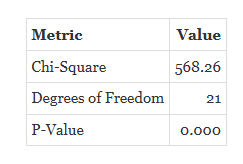
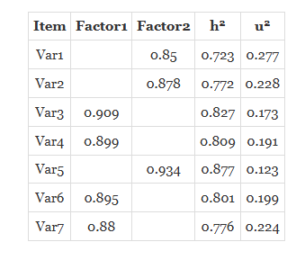

```{=html}
<style>
 sup {
   color: blue;
   font-size: 0.8em;
 }
 .affiliations {
   color: grey;
   font-size: 0.9em;
   margin-top: 0.2em;
 }
</style>
```

::: affiliations
<sup>1</sup>Statoberry LLP, <sup>2</sup>Department of Agricultural Statistics, Kerala Agricultural University
:::

ABSTRACT

::: {style="text-align: justify;"}
**Exploratory Factor Analysis (EFA)** is a multivariate statistical technique used to uncover the underlying latent structure among a set of observed variables by grouping them into a smaller number of interpretable factors. **EFA** identifies patterns of correlation among variables and reduces data complexity without presupposing any particular factor structure, making it ideal for hypothesis generation and scale development in applied research. In **RAISINS**, you can perform **EFA** very easily without writing a single line of code. This tutorial will guide you on how to perform **EFA** in **RAISINS** and interpret the results effectively. In addition, you will get publication-ready tables and plots for your reports. You can also explore the factor loadings, communalities, scree plots, and factor score outputs generated automatically within **RAISINS**.
:::

<details>

*Hover or click each point to see more information.*

```{=html}
<summary style="color: #5DADE2"; font-weight: bold;">
  Introduction Exploratory Factor Analysis
</summary>
```

```{=html}
<style>
.hover-img {
  position: relative;
  display: inline-block;
  cursor: help;
  border-bottom: 1px dashed currentColor;
}
.hover-img img {
  position: absolute;
  left: 50%;
  top: 1.6em;
  transform: translateX(-50%);
  width: 260px;
  max-width: 70vw;
  height: auto;
  padding: 6px;
  background: white;
  border: 1px solid rgba(0,0,0,.15);
  border-radius: 12px;
  box-shadow: 0 10px 30px rgba(0,0,0,.18);
  opacity: 0;
  visibility: hidden;
  pointer-events: none;
  transition: opacity .15s ease, transform .15s ease, visibility .15s;
}
.hover-img:hover img {
  opacity: 1;
  visibility: visible;
  transform: translateX(-50%) translateY(6px);
  z-index: 999;
}
</style>
```

<ul><small> The origins of factor analysis trace back to the early twentieth century, rooted in the study of human intelligence and psychological measurement. [Charles Spearman]{.hover-img}, a British psychologist and statistician, first proposed the concept in 1904 when he observed that different measures of cognitive ability tended to correlate with one another. He theorised that a single general intelligence factor which he called *g* could explain these shared correlations, and he developed the foundations of factor analysis to formally test this idea. Over subsequent decades, the technique was substantially refined by researchers such as Thurstone, who introduced multiple-factor solutions and the concept of simple structure, arguing that a good factor solution should have each variable loading strongly on as few factors as possible. These methodological advances allowed factor analysis to spread well beyond psychology into fields such as sociology, marketing, ecology, and agricultural research, wherever large sets of measured variables needed to be distilled into a manageable number of underlying dimensions. Exploratory Factor Analysis, as distinguished from its confirmatory counterpart, remains the most widely used variant when the researcher has no prior hypothesis about factor structure and instead wishes to let the data reveal its own latent organisation. </small></ul>

</details>

## Analysis of experiments {#AE}

::: {style="text-align: justify;"}
To get started, visit **RAISINS** [www.raisins.live](https://www.raisins.live) home page and go to **Analysis of experiments**. Here, you can see different analytical modules available on the platform. In this tutorial, we focus on **Exploratory Factor Analysis (EFA)**, as shown in @fig-aov.
:::

{#fig-aov fig-align="center"}

## Exploratory Factor Analysis (EFA) {#C}

::: {style="text-align: justify;"}
**Exploratory Factor Analysis (EFA)** is a multivariate statistical procedure designed to identify the underlying latent variables called **factors** that explain the pattern of correlations observed among a larger set of measured variables. Unlike confirmatory approaches, EFA imposes no prior assumptions about which variables belong to which factor; instead it allows the factor structure to emerge from the data itself. EFA is widely used in psychology, social sciences, agronomy, and plant breeding whenever researchers need to reduce a large number of observed traits to a smaller, interpretable set of dimensions. The technique is particularly valuable during scale development, germplasm evaluation, and multivariate trait characterisation, as it helps identify redundant variables and uncovers meaningful groupings that may not be apparent from simple correlation matrices. When the researcher has a well-defined, theory-driven hypothesis about the factor structure, Confirmatory Factor Analysis (CFA) is generally more appropriate.
:::

<details>

```{=html}
<summary style="color: #5DADE2"; font-weight: bold;">
  EFA Conceptual Layout
</summary>
```

<ul>

<small>

@fig-lay visually represents the general structure of an Exploratory Factor Analysis with multiple observed variables (V1, V2, … Vp) loading onto a smaller set of latent factors (F1, F2, … Fk). Each arrow from a factor to a variable represents a **factor loading** a coefficient that reflects the strength and direction of the relationship between that factor and the observed variable. Variables with high loadings on the same factor are interpreted as measuring a common underlying construct. The residual term for each variable (often called **uniqueness** or **specific variance**) captures the portion of variance in that variable not explained by the common factors.

{#fig-lay fig-align="center"}

</small>

</ul>

</details>

::: callout-tip
#### Exploratory Factor Analysis (EFA) is a data-driven multivariate method that identifies a small number of latent factors to explain the correlation structure among a larger set of observed variables, without specifying the factor structure in advance.
:::

## A working example {#W}

::: {style="text-align: justify;"}
To make things simple and interesting, we will explain **EFA** analysis step by step using a hypothetical example, so you can clearly see how it works and why it matters. Suppose an agronomist evaluates **50 rice accessions** across **eight morpho-physiological traits**: Plant Height (PH), Flag Leaf Length (FLL), Flag Leaf Width (FLW), Days to Flowering (DTF), Panicle Length (PL), Number of Grains per Panicle (NGP), 1000-Grain Weight (TGW), and Grain Yield (GY). The objective is to determine whether these eight measured traits can be reduced to a smaller number of latent dimensions such as a "vegetative growth factor" and a "yield component factor" using EFA. The arrangement of the data is shown in @fig-data.
:::

{#fig-data fig-align="center"}

::: {style="text-align: justify;"}
Data organised in MS Excel can be directly uploaded to **RAISINS** for analysis. For more details on data preparation see @sec-4. Two terms that we will use frequently are **Variables** and **Factors**. In our example, the **Variables** refer to the eight morpho-physiological traits measured on each accession **PH, FLL, FLW, DTF, PL, NGP, TGW, and GY** while the **Factors** are the latent dimensions that **RAISINS** extracts from these variables to summarise the underlying correlation structure.
:::

## How to prepare your data? {#sec-4 .H}

::: {style="text-align: justify;"}
Arranging data for uploading in **RAISINS** is very simple. Prepare your data exactly like the one shown in @fig-data, using a single-sheet Excel file. Make sure no blank rows are left above, and all columns have proper names. Each row should represent one observation unit (e.g., one accession, one plot, or one subject), and each column should represent one measured variable. That's it your file is ready to upload.

Still if you have doubt, see @fig-4.

To prepare your dataset for analysis in **RAISINS**, you have two options:

Creating dataset in MS Excel

Creating your dataset directly within the **RAISINS** app
:::

{#fig-4 fig-align="center"}

## EFA analysis tab explained {#AO}

::: {style="text-align: justify;"}
In @fig-5, you can see the detailed view of the **EFA** Analysis tab, along with explanations of what each option does. This section helps you to understand the purpose of every setting, so you can select the most appropriate ones for your data and analysis. Now, upload the prepared file by clicking Browse in the sidebar of the Analysis tab. When the file is uploaded, options to select the variables for factor analysis will appear. Select the appropriate columns under variables. You can also choose the **extraction method** (Principal Axis Factoring or Maximum Likelihood), the **rotation method** (Varimax, Promax, or Oblimin), and the **number of factors** to extract or allow **RAISINS** to determine the optimal number automatically based on eigenvalues greater than one. Once you click the Run Analysis button, all relevant results and outputs appear instantly, leaving no room for confusion.
:::

{#fig-5 fig-align="center"}

::: {style="text-align: justify;"}
For some data particularly when variables are measured on very different scales, or when distributions are highly skewed or contain a large number of discrete values transformation of the dataset (@sec-6) may be appropriate before running EFA. **RAISINS** provides an inbuilt transformation option to handle such situations.
:::

## Analysis results {#sec-7 .AR}

::: {style="text-align: justify;"}
Once your dataset is uploaded and variables are selected, click on Run Analysis. **RAISINS** will compute the correlation matrix, assess its factorability using the Kaiser-Meyer-Olkin (KMO) measure and Bartlett's Test of Sphericity, extract the factors, apply the chosen rotation, and present the full suite of EFA results. The first output is the **Factorability Assessment** table (see @fig-100), which confirms whether the data are suitable for factor analysis before any factors are interpreted.
:::

**Table 1: Factorability Assessment — KMO and Bartlett's Test**

{#fig-100 fig-align="center"}

<details>

```{=html}
<summary style="color: #5DADE2"; font-weight: bold;"> KMO and Bartlett's Test — table explained </summary>
```

<small> Before interpreting any factor solution, it is essential to verify that the correlation matrix contains sufficient shared variance to support factor extraction. Two standard diagnostics are provided. The **Kaiser-Meyer-Olkin (KMO) Measure of Sampling Adequacy** is an index ranging from 0 to 1 that compares the magnitude of observed correlations to the magnitude of partial correlations. Values above 0.70 are considered acceptable, values above 0.80 are meritorious, and values above 0.90 are superb. KMO values below 0.50 indicate that the data are not suitable for EFA. **Bartlett's Test of Sphericity** tests the null hypothesis that the correlation matrix is an identity matrix — that is, all variables are completely uncorrelated. A statistically significant result (p \< 0.05) indicates that at least some correlations exist among the variables and that factor analysis may be applied. The chi-square statistic and associated degrees of freedom are also reported. Both diagnostics should support factorability before proceeding with interpretation. </small>

</details>

### Interpretation from @fig-100

::: {style="text-align: justify;"}
In our hypothetical rice accession example, the KMO measure of sampling adequacy is 0.82, which falls in the "meritorious" range, confirming that the pattern of correlations is compact and suitable for factor analysis. Bartlett's Test of Sphericity yields a chi-square value of 314.67 with 28 degrees of freedom (p \< 0.001), decisively rejecting the null hypothesis that the correlation matrix is an identity matrix. Together, these results confirm that the eight morpho-physiological traits share sufficient common variance and that proceeding with EFA is statistically justified.
:::

**Table 2: Factor Loadings and Communalities**

{#fig-101 fig-align="center"}

<details>

```{=html}
<summary style="color: #5DADE2"; font-weight: bold;">Overview of Factor Loadings Table
</summary>
```

<small>

1.  *Variables and Factors*

**Variables**: The observed, measured traits entered into the EFA — in our example, PH, FLL, FLW, DTF, PL, NGP, TGW, and GY.

**Factors**: The latent dimensions extracted from the correlation matrix. Each factor represents a cluster of variables that tend to move together, interpreted as measuring a shared underlying construct.

2.  *Factor Loadings*

**Factor Loading**: The correlation between a variable and a factor. Loadings range from −1 to +1. A loading above 0.40 in absolute value is generally considered practically significant. Variables with high loadings on the same factor are grouped together and contribute most to that factor's interpretation.

3.  *Communalities*

**Communality (h²)**: The proportion of variance in a variable that is explained by all extracted factors combined. A communality close to 1.0 indicates that the factors account for nearly all of a variable's variance; a low communality (below 0.30) suggests the variable is poorly explained by the factor solution.

4.  *Uniqueness*

**Uniqueness**: The proportion of a variable's variance not explained by the common factors — that is, 1 − h². High uniqueness values indicate that a variable has considerable specific or error variance not shared with others.

5.  *Variance Explained*

**Eigenvalue**: The amount of total variance in the dataset explained by each factor. By convention, factors with eigenvalues greater than 1.0 (Kaiser criterion) are retained.

**% Variance**: The proportion of total variance accounted for by each factor.

**Cumulative %**: The running total of variance explained as successive factors are added. </small>

</details>

### Interpretation from @fig-101

::: {style="text-align: justify;"}
The rotated factor loading matrix (Varimax rotation) from our hypothetical example reveals two meaningful factors. **Factor 1**, with an eigenvalue of 3.41 explaining 42.6% of total variance, shows high positive loadings for PH (0.81), FLL (0.77), FLW (0.72), and PL (0.68). These variables all relate to vegetative and canopy architecture, and this factor is interpreted as a **"Vegetative Growth Factor."** **Factor 2**, with an eigenvalue of 1.89 explaining 23.6% of total variance, loads strongly on NGP (0.84), TGW (0.79), GY (0.86), and moderately on DTF (0.61). These traits collectively reflect grain production capacity, and this factor is labelled the **"Yield Component Factor."** Together, the two factors explain 66.2% of the total variance in the dataset. Communalities are satisfactory for most variables, ranging from 0.58 for DTF to 0.88 for GY, indicating that the factor solution captures a substantial proportion of variance in the majority of traits.
:::

::: callout-tip
#### Variables with factor loadings greater than 0.40 in absolute value are generally considered to have a practically meaningful relationship with that factor; loadings below this threshold are often suppressed in the output for ease of interpretation.
:::

::: callout-tip
#### Communality (h²) reflects how well a variable is represented by the retained factors. Low communalities (below 0.30) may warrant consideration of removing that variable or retaining additional factors.
:::

## Multiple comparison tests {#sec-8 .MCT}

<details>

```{=html}
<summary style="color: #5DADE2"; font-weight: bold;">
  What is Factor Rotation?
</summary>
```

<ul><small> Factor rotation is a mathematical transformation applied to the initial factor solution to make it easier to interpret. The initial, unrotated factor solution often places many variables with moderate loadings on several factors simultaneously, which is difficult to interpret. Rotation redistributes the variance across factors while preserving the total amount of variance explained, so that each variable loads highly on as few factors as possible — a property known as **simple structure**. Rotation does not change the communalities of variables or the overall fit of the model; it only changes how the variance is apportioned among the factors.</small></ul>

</details>

::: {style="text-align: justify;"}
**RAISINS** supports three rotation methods for EFA. The choice of rotation method influences how the factors are oriented and, consequently, how they are interpreted.
:::

{#fig-MCT fig-align="center"}

<details>

```{=html}
<summary style="color: #5DADE2"; font-weight: bold;">
  Rotation Methods — LSD, Varimax, Promax, and Oblimin explained
</summary>
```

<ul>

<small>

**Varimax Rotation**

Varimax is an **orthogonal** rotation method, meaning it keeps the extracted factors uncorrelated with one another. It maximises the variance of squared loadings within each factor, pushing high loadings higher and low loadings lower. This produces clean, easily interpreted factors where each variable tends to load strongly on one factor and weakly on all others. Varimax is the most widely used rotation in applied research and is appropriate when the researcher has reason to believe the underlying constructs are independent.

**Promax Rotation**

Promax is an **oblique** rotation method that allows the factors to be correlated with one another. It is derived by raising the Varimax solution to a power, which sharpens the factor pattern at the cost of allowing factor intercorrelations. Promax is faster to compute than other oblique methods and is appropriate when the researcher expects the latent constructs to be related for example, when different yield components in a crop are known to co-vary. When oblique rotation is used, **RAISINS** reports both a Pattern Matrix (unique contributions of each factor) and a Structure Matrix (total correlations between variables and factors).

**Oblimin Rotation**

Oblimin is another **oblique** rotation method that minimises the covariance of the squared loadings across factors to achieve simple structure. It offers finer control over the degree of obliqueness through a tuning parameter (delta), and generally produces factor patterns that are slightly less extreme than Promax. Oblimin is preferred in confirmatory-adjacent exploratory work where theoretical considerations suggest non-zero factor intercorrelations.

</small>

</ul>

</details>

**Which rotation method to use?**

::: {style="text-align: justify;"}
The choice of rotation method rests with the researcher and should be guided by theoretical considerations about the nature of the latent constructs.

**Varimax** is recommended when the researcher expects the factors to be conceptually independent and orthogonal. It produces the most straightforward pattern matrix and is the default in **RAISINS**, making it the most common starting point for EFA in agricultural and biological research.

**Promax** is appropriate when the factors are expected to be moderately to strongly correlated for instance, when measuring different dimensions of plant productivity that naturally co-vary across genotypes. Oblique solutions often reflect biological reality more faithfully than orthogonal ones.

**Oblimin** offers greater flexibility in the degree of obliqueness and is preferred when the researcher wishes to fine-tune the rotation based on theoretical grounds or when Promax produces factor intercorrelations that are too high (above 0.60), which may indicate that a single general factor underlies the data.

In the working example, Varimax rotation was applied, yielding two clearly interpretable orthogonal factors with simple structure each variable loading predominantly on one factor.
:::

## Basic plots {#BP}

::: {style="text-align: justify;"}
**RAISINS** is designed for a smooth and hassle-free experience. Once you click the Run Analysis button, all relevant results and outputs appear instantly leaving no room for confusion. Every core plot relevant to **Exploratory Factor Analysis** is readily available. Simply click on the Basic Plot tab to view them see @fig-8. Each plot comes with a gear icon at the top-left corner, allowing you to customise its appearance. You can also download these plots in high-quality PNG format (300 dpi), JPEG, TIFF, PDF, and SVG for use in reports or presentations.
:::

### Customizing plots

::: {style="text-align: justify;"}
**RAISINS** provides users various customisation features for the plots to enhance the visualisation according to the requirement of the user. **Click** on @fig-8 to get a clear idea on the customising features.
:::

{#fig-8 fig-align="center"}

::: {style="text-align: justify;"}
From @fig-9 to @fig-13, you can see the different types of plots available in **RAISINS** for **EFA**. Each one is visually illustrated and accompanied by a clear, insightful description below, making it easy to understand the factor structure.
:::

```{=html}
<script>
document.addEventListener('DOMContentLoaded', function() {
  const descriptions = document.querySelectorAll('.plot-description');
  descriptions.forEach(desc => {
    desc.style.display = 'none';
  });
});

function showDescription(id) {
  document.getElementById(id).style.display = 'flex';
}

function hideDescription(id) {
  document.getElementById(id).style.display = 'none';
}
</script>
```

```{=html}
<style>
.plot-container {
  position: relative;
  display: inline-block;
  cursor: pointer;
  width: 350px;
  height: 300px;
  overflow: hidden;
  margin: 10px;
}
.plot-container img {
  width: 350px;
  height: 300px;
  object-fit: cover;
  border: 3px solid #ddd;
  border-radius: 8px;
  transition: transform 0.3s ease, box-shadow 0.3s ease;
}
.plot-container:hover img {
  transform: scale(1.05);
  box-shadow: 0 4px 12px rgba(0, 0, 0, 0.2);
}
.plot-description {
  display: none !important;
  position: absolute;
  top: 0; left: 0;
  width: 100%; height: 100%;
  z-index: 1000;
  color: white;
  padding: 15px;
  border-radius: 8px;
  box-shadow: 0 4px 15px rgba(0, 0, 0, 0.3);
  font-size: 14px;
  line-height: 1.5;
  display: flex;
  align-items: center;
  justify-content: center;
  text-align: center;
  animation: fadeIn 0.3s ease-in;
  pointer-events: none;
  border: 2px solid rgba(255, 255, 255, 0.5);
}
.plot-container:hover .plot-description {
  display: flex !important;
}
@keyframes fadeIn {
  from { opacity: 0; transform: scale(0.95); }
  to { opacity: 1; transform: scale(1); }
}
#screeplot-desc    { background: linear-gradient(135deg, rgba(255, 107, 107, 0.8), rgba(255, 142, 83, 0.8)); }
#loadingplot-desc  { background: linear-gradient(135deg, rgba(161, 140, 209, 0.8), rgba(251, 194, 235, 0.8)); }
#heatmap-desc      { background: linear-gradient(135deg, rgba(0, 221, 235, 0.8), rgba(38, 166, 154, 0.8)); }
#communality-desc  { background: linear-gradient(135deg, rgba(255, 154, 139, 0.8), rgba(255, 106, 136, 0.8)); }
#biplot-desc       { background: linear-gradient(135deg, rgba(132, 250, 176, 0.8), rgba(143, 211, 244, 0.8)); }
</style>
```

:::::::::::::::::::::::::::: grid
:::::: g-col-6
::::: {.plot-container onmouseover="showDescription('screeplot-desc')" onmouseout="hideDescription('screeplot-desc')"}
{#fig-9}

:::: {#screeplot-desc .plot-description}
::: {style="text-align: justify;"}
A **scree plot** in Exploratory Factor Analysis (EFA) is a graphical tool used to determine the number of factors to retain in the analysis. It displays factor numbers on the X-axis and their corresponding eigenvalues on the Y-axis. The plot usually shows a steep decline in eigenvalues for the initial factors, followed by a gradual flattening of the curve. The point where the curve begins to level off, known as the elbow or break point, indicates the optimum number of significant factors to retain, while the remaining factors are considered less important because they explain only a small amount of variation in the data.
:::
::::
:::::
::::::

:::::: g-col-6
::::: {.plot-container onmouseover="showDescription('loadingplot-desc')" onmouseout="hideDescription('loadingplot-desc')"}
{#fig-10}

:::: {#loadingplot-desc .plot-description}
::: {style="text-align: justify;"}
A **factor loading plot** displays the loadings of each variable on two selected factors simultaneously, with variables plotted as labelled points in the two-dimensional factor space. Variables that cluster together share strong loadings on the same factor. Points close to the axes reflect clear, simple-structure loadings, while points far from any axis may cross-load on multiple factors.
:::
::::
:::::
::::::

:::::: g-col-6
::::: {.plot-container onmouseover="showDescription('loadingplot-desc')" onmouseout="hideDescription('loadingplot-desc')"}


:::: {#loadingplot-desc .plot-description}
::: {style="text-align: justify;"}
A **factor diagram** in Exploratory Factor Analysis (EFA) is a visual representation that illustrates the relationship between observed variables and underlying latent factors. The diagram typically shows factors as circles or ellipses and variables as rectangles, with arrows indicating the direction and strength of influence of each factor on the variables. It helps in understanding the factor structure, identifying how variables are grouped under different factors, and simplifying the interpretation of complex multivariate data.
:::
::::
:::::
::::::

:::::: g-col-6
::::: {.plot-container onmouseover="showDescription('heatmap-desc')" onmouseout="hideDescription('heatmap-desc')"}
{#fig-11}

:::: {#heatmap-desc .plot-description}
::: {style="text-align: justify;"}
A **correlation heatmap** is a graphical representation used to display the strength and direction of correlations between variables in a dataset. It presents correlation coefficients in a matrix format, where different colors represent positive, negative, or weak relationships among variables. Strong positive correlations are usually shown in darker or warmer colors, while negative correlations appear in contrasting colors. This plot helps in quickly identifying patterns, relationships, and multicollinearity among variables, making it useful for exploratory data analysis and statistical interpretation.
:::
::::
:::::
::::::

:::::: g-col-6
::::: {.plot-container onmouseover="showDescription('communality-desc')" onmouseout="hideDescription('communality-desc')"}
{#fig-12}

:::: {#communality-desc .plot-description}
::: {style="text-align: justify;"}
A **factor score correlation plot** is a graphical representation used in Exploratory Factor Analysis (EFA) to display the relationships among factor scores extracted from the data. It shows the correlation between different factors, helping researchers understand whether the factors are independent or related to each other. Strong positive or negative correlations indicate a close association between factors, while weak correlations suggest that the factors are relatively distinct. This plot is useful for interpreting factor structures and examining the overall relationship among latent variables in the dataset.
:::
::::
:::::
::::::

::::::: g-col-6
:::::: {.plot-container onmouseover="showDescription('biplot-desc')" onmouseout="hideDescription('biplot-desc')"}
::: {style="text-align: center;"}
{#fig-13}
:::

:::: {#biplot-desc .plot-description}
::: {style="text-align: justify;"}
A **factor loading heatmap** is a visual representation used in Exploratory Factor Analysis (EFA) to illustrate the strength and direction of factor loadings between variables and extracted factors. In the heatmap, variables are arranged in rows and factors in columns, while colors represent the magnitude of the loadings. Strong positive or negative loadings are highlighted with more intense colors, making it easier to identify variable groupings and factor contributions. This plot helps simplify the interpretation of factor structures and provides a clear overview of relationships between variables and factors.
:::
::::
::::::
:::::::
::::::::::::::::::::::::::::

## Advanced plots {#AP}

::: {style="text-align: justify;"}
**RAISINS** also provides Advanced Plot which go beyond basic loading charts and heatmaps to give deeper insight into the factor structure, distributional properties of factor scores, and the diagnostic quality of the EFA solution. See @fig-90
:::

{#fig-90 fig-align="center"}

**FACTOR ANALYSIS SANKEY DIAGRAM**

{#fig-14 fig-align="center"}

::: {style="text-align: justify;"}
A **Sankey diagram** in exploratory factor analysis (EFA) is an advanced visualization used to illustrate the flow and relationship between observed variables and extracted factors. It represents variables as nodes connected to latent factors through weighted links, where the width of each connection corresponds to the magnitude of factor loadings. This diagram helps in understanding how variables contribute to multiple factors and highlights the strength and distribution of associations in a visually intuitive manner. Sankey diagrams are especially useful for interpreting complex factor structures, cross-loadings, and multidimensional relationships in large datasets, making the results of factor analysis easier to communicate and explore visually.
:::

## AI interpretation {#AI}

::: {style="text-align: justify;"}
**RAISINS** is equipped with an AI-powered RAISINS Assistant designed to assist users in comprehending the outcomes of statistical tests and data analysis. For **EFA**, the assistant provides clear and concise summaries of the factor solution, explains the practical meaning of each extracted factor based on the pattern of variable loadings, identifies variables with high and low communalities, and offers informed suggestions regarding factor retention, rotation choice, and appropriate follow-up analyses. The user can obtain detailed interpretations by clicking on AI Interpretation in the Analysis tab as shown below @fig-ai.
:::

{#fig-ai fig-align="center"}

## Preparing your data {#PRE}

::: {style="text-align: justify;"}
"Your analysis is only as good as your data! Feed RAISINS high-quality data, and it will deliver powerful insights feed it messy data, and the results won't be trustworthy."

1.  Create your dataset in MS Excel

2.  Build your dataset directly within the RAISINS app
:::

## Preparing data in MS Excel {#EX}

::: {style="text-align: justify;"}
Open a new blank sheet in MS Excel with only one sheet included, and avoid adding any unnecessary content. For **EFA**, the dataset should follow a column-based format, where each row represents one observation unit (an accession, individual, plot, or subject) and each column represents one measured variable (e.g., PH, FLL, FLW, DTF, PL, NGP, TGW, GY). There should be no treatment grouping column unless the researcher intends to perform group-wise EFA; for a standard EFA all rows are treated as belonging to the same analysis pool. The file can be saved in CSV, XLS, or XLSX format, but CSV is recommended as it is lighter and enables faster loading. Ensure that there are no unwanted spaces in column names. For reference, see the structure shown in @fig-pp. As illustrated in @fig-data, variables must appear in separate columns, and the data can also be arranged as shown in @fig-kk.
:::

{#fig-pp}

{#fig-kk}

<details>

<summary>Dataset Creation Rules</summary>

<small> 1. **Column Naming Convention** - No spaces allowed in column names.\
- Use underscores (`_`) or full stops (`.`) for separation. - Avoid symbols and special characters like %, \# etc. 2. **Data Arrangement** - Start data arrangement towards the upper-left corner.\
- Ensure the row above the data is not blank. 3. **Cell Management** - Avoid typing or deleting in cells without data.\
- If needed, select affected cells, right-click, and select **Clear Contents**. 4. **Column Relevance** - Name all columns meaningfully.\
- Exclude unnecessary columns not required for analysis. - For EFA, include only the numeric variables to be factored; remove identifier columns before upload or ensure they are not selected during variable selection in RAISINS. </small>

</details>

<details>

<summary>How to Save as CSV in MS Excel</summary>

<small> 1. **Open Your Workbook**

```         
-   Ensure your data is arranged properly with only one sheet.
```

2.  **Click 'File' Menu**

    -   Go to the top-left corner and click on **File**.

3.  **Choose 'Save As' or 'Save a Copy'**

    -   Select the location where you want to save your file.

4.  **Set File Type to CSV**

    -   In the **'Save as type'** dropdown menu, choose **CSV (Comma delimited) (\*.csv)**.

5.  **Name Your File**

    -   Enter a relevant file name without spaces (use underscores if needed).

6.  **Click 'Save'**

    -   Click **Save** to export the file.

> 💡 Tip: Before saving, double-check that your data is on the first sheet and follows the required format (e.g., no empty rows above the data, meaningful column names, no identifier or grouping columns included alongside numeric variables). </small>

</details>

## Creating dataset in RAISINS {#CR}

::: {style="text-align: justify;"}
If you're unsure about the correct format for creating a dataset, don't worry **RAISINS** offers an option to create data directly within the app using the prescribed template. Here's how:

-   Navigate to the **Create Data Tab**

-   Select the number of **Variables**

-   Select the number of **Observations** (rows)

-   Select number of **Characters**

-   Click on the **Create** button

A model layout will appear as shown in @fig-createdata. You may enter observations manually into the CSV file once downloaded, or paste the observations straight into the file provided. Once you have entered the data in the layout, download the CSV file and upload it in Analysis.
:::

{#fig-createdata}

## Model datasets {#M}

::: {style="text-align: justify;"}
To test the app or better understand the data arrangement required for **EFA**, we provide model datasets within the app. You can download them from the Datasets tab.
:::

{#fig-188 fig-align="center"}

## FAQ's {#F}

::: {style="text-align: justify;"}
The app includes a dedicated FAQs tab to help clarify common doubts and guide users through various features. This section provides detailed answers to frequently asked questions related to **EFA** and other modules in **RAISINS**, offering additional information and helpful tips to ensure a smooth user experience. If you're ever unsure about how something works such as which extraction method to choose, how many factors to retain, or how to interpret low communalities the FAQs is a great place to start.
:::

{#fig-148 fig-align="center"}

## View data {#U}

::: {style="text-align: justify;"}
View Data serves as the primary diagnostic tool for ensuring data integrity before analysis. Upon uploading your dataset, the system performs an automated Health Check to validate column types and formatting. For **EFA**, this step is particularly important because the analysis relies entirely on the numeric correlation structure of the input variables any non-numeric columns, missing values, or misformatted entries will be flagged here before they can interfere with the factor extraction.
:::

{fig-align="center"}

------------------------------------------------------------------------
