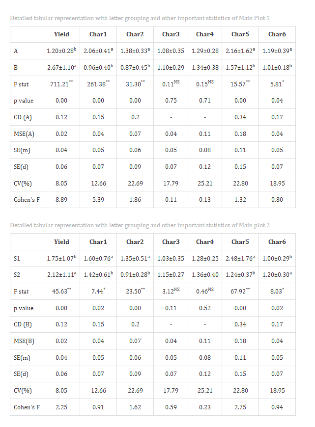
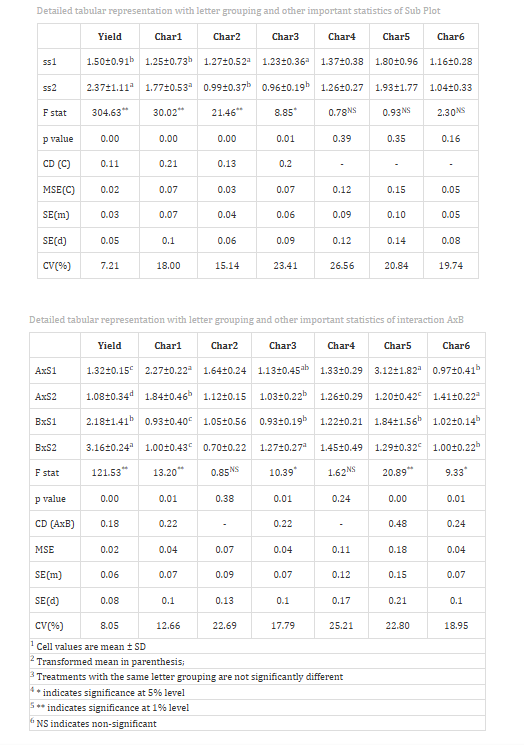
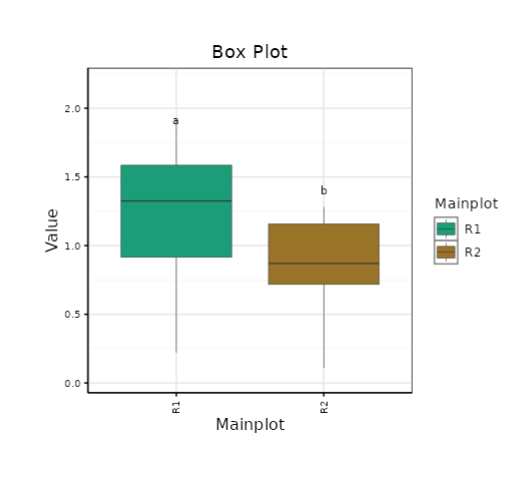
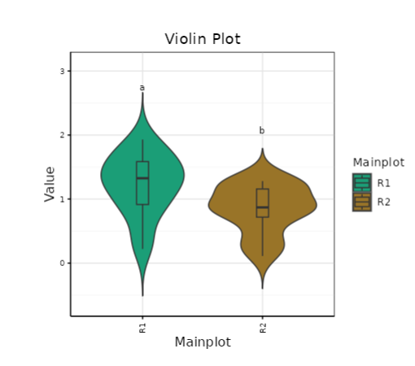
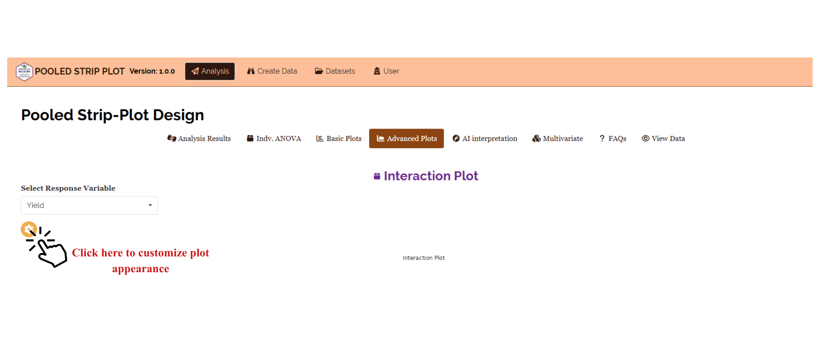
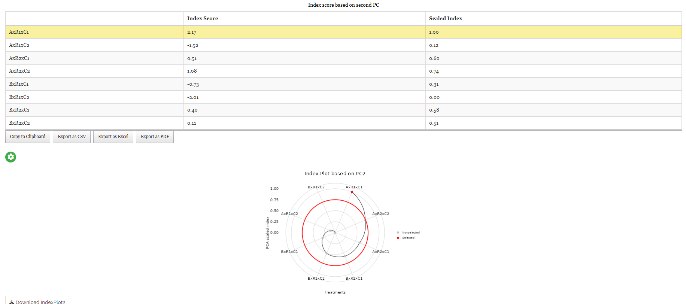
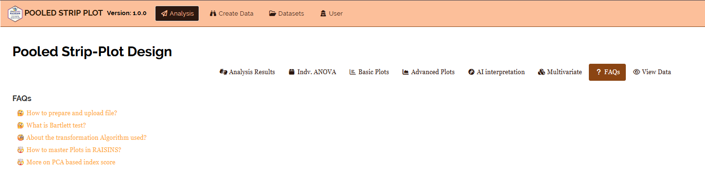

```{=html}
<style>
 sup {
   color: blue;
   font-size: 0.8em;
 }
 .affiliations {
   color: grey;
   font-size: 0.9em;
   margin-top: 0.2em;
 }
</style>
```

::: affiliations
<sup>1</sup>Statoberry LLP, <sup>2</sup>Department of Agricultural Statistics, Kerala Agricultural University
:::

ABSTRACT

::: {style="text-align: justify;"}
Pooled Strip Plot Design **(PSPD)** is an advanced experimental layout that combines the strip-plot arrangement across multiple environments or seasons, enabling the simultaneous study of two crossed factors a horizontal strip factor and a vertical strip factor while accounting for block and environment effects. In a **PSPD**, all horizontal strip treatments and all vertical strip treatments are laid out as perpendicular strips within each block across pooled environments, and the intersections of these strips serve as the experimental units for the interaction analysis. In **RAISINS** you can perform **PSPD** very easily without writing a single line of code. This tutorial will guide you, how to perform **PSPD** very easily in **RAISINS** and interpret the results effectively. In addition, you will get tables and plots ready for publication. You can also perform a multivariate analysis including MANOVA and PCA.
:::

<details>

*Hover or click each point to see more information.*

```{=html}
<summary style="color: #5DADE2"; font-weight: bold;">
  Introduction Pooled Strip Plot Design
</summary>
```

```{=html}
<style>
.hover-img {
  position: relative;
  display: inline-block;
  cursor: help;
  border-bottom: 1px dashed currentColor;
}
.hover-img img {
  position: absolute;
  left: 50%;
  top: 1.6em;
  transform: translateX(-50%);
  width: 260px;
  max-width: 70vw;
  height: auto;
  padding: 6px;
  background: white;
  border: 1px solid rgba(0,0,0,.15);
  border-radius: 12px;
  box-shadow: 0 10px 30px rgba(0,0,0,.18);
  opacity: 0;
  visibility: hidden;
  pointer-events: none;
  transition: opacity .15s ease, transform .15s ease, visibility .15s;
}
.hover-img:hover img {
  opacity: 1;
  visibility: visible;
  transform: translateX(-50%) translateY(6px);
  z-index: 999;
}
</style>
```

<ul><small> The Strip Plot Design has its conceptual foundations in the early factorial experimentation frameworks pioneered by [Frank Yates]{.hover-img} at Rothamsted Experimental Station in the **1930s and 1940s**. Yates recognized that certain agricultural experiments particularly those involving large-plot operations such as irrigation methods crossed with crop varieties were impractical to implement as fully randomized factorial designs because the application of one factor (e.g., irrigation) required large contiguous field strips. He formalized the strip-plot arrangement, where horizontal strips receive one factor and vertical strips receive another, with their intersections becoming the observational units for the interaction. The design offered an elegant solution: it sacrificed some precision for the main effects of each strip factor but gained immense logistical practicality, especially in large-scale field operations. When such strip-plot experiments are conducted across multiple seasons, environments, or years and the results are pooled for a combined analysis, the design becomes the **Pooled Strip Plot Design (PSPD)**. The pooled analysis allows researchers to assess not only the main effects and their interaction but also the consistency of these effects across environments, making PSPD one of the most informative designs for multi-environment agricultural trials. </small></ul>

</details>

## Analysis of experiments {#AE}

::: {style="text-align: justify;"}
To get started, visit **RAISINS** [www.raisins.live](https://www.raisins.live) home page and go to **Analysis of experiments**. Here, you can see different experimental designs including multi-factor and pooled designs. In this tutorial, we focus on **Pooled Strip Plot Design (PSPD)**, as shown in @fig-aov.
:::

{#fig-aov fig-align="center"}

## Pooled Strip Plot Design (PSPD) {#C}

::: {style="text-align: justify;"}
A Pooled Strip Plot Design **(PSPD)** is a multi-environment experimental design in which two factors a horizontal strip factor (Factor A) and a vertical strip factor (Factor B) are laid out in perpendicular strips within each block, and the entire arrangement is replicated across multiple environments, seasons, or years. In each environment, horizontal strips are randomized independently of vertical strips within every block, and their intersections form the experimental units where the interaction (A × B) is measured. Pooling the data across environments allows the researcher to partition total variation into environment effects, block-within-environment effects, main effects of Factor A and Factor B, the A × B interaction, and the corresponding error terms associated with each stratum. The design is especially suited for agronomic studies involving management practices such as irrigation regimes crossed with genotype selections where field operations constrain complete randomization but multi-environment testing is essential for reliable inference. Compared to a single-season strip plot, the pooled analysis substantially increases the degrees of freedom for error estimation, improves the detection of genotype-by-environment interactions, and yields more broadly applicable conclusions.
:::

<details>

```{=html}
<summary style="color: #5DADE2"; font-weight: bold;">
  PSPD Layout
</summary>
```

<ul>

<small>

@fig-lay visually represents a Pooled Strip Plot Design arrangement across multiple environments (seasons/years/locations). Within each environment, Factor A levels (e.g., A1, A2, A3) are assigned to horizontal strips that span the full width of the experimental area, while Factor B levels (e.g., B1, B2, B3) are assigned to vertical strips that span the full length. The intersections of these horizontal and vertical strips form the observational plots for the A × B interaction. This layout is replicated across two or more blocks within each environment, and the entire block-within-strip arrangement is then repeated across environments. Randomization of horizontal strips and vertical strips is performed independently within each block in every environment.

{#fig-lay fig-align="center"}

</small>

</ul>

</details>

::: callout-tip
#### Pooled Strip Plot Design (PSPD) is an experimental design that evaluates two crossed strip factors and their interaction across multiple environments simultaneously, partitioning variation into environment, block, strip-factor, and interaction components to yield robust, multi-environment inferences.
:::

## A working example {#W}

::: {style="text-align: justify;"}
To make things simple and interesting, we'll explain PSPD analysis step by step using a hypothetical example, so you can clearly see how it works and why it matters. Consider a multi-season agronomic trial evaluating the effect of **irrigation regimes** (Factor A: three levels - I1: Rainfed, I2: Deficit irrigation, I3: Full irrigation) crossed with **rice varieties** (Factor B: four levels -V1, V2, V3, V4) over **two seasons** (Season 1 and Season 2), each laid out in **three blocks**. This yields a total of 3 × 4 = 12 treatment combinations per block, with 3 blocks per season and 2 seasons pooled for combined analysis. Four response variables were recorded on each observational plot: **Grain Yield (t/ha)**, **Plant Height (cm)**, **Panicle Length (cm)**, and **Harvest Index (%)**. Our aim is to test whether irrigation regimes, varieties, their interaction, and environmental differences produce statistically significant effects on the response variables using the pooled ANOVA. The arrangement of the data is shown in @fig-data.
:::

{#fig-data fig-align="center"}

::: {style="text-align: justify;"}
Data organized in MS Excel can be directly uploaded to **RAISINS** for analysis. For more details on data preparation see @sec-4. Four terms that we will use frequently are **Environment**, **Factor A (Horizontal Strip)**, **Factor B (Vertical Strip)**, and **Variables**. In our example, the Environment refers to the season (Season 1, Season 2), Factor A refers to irrigation regimes (I1, I2, I3), Factor B refers to rice varieties (V1, V2, V3, V4), and the Variables are the four traits recorded **Grain_Yield, Plant_Height, Panicle_Length, Harvest_Index**.
:::

## How to prepare your data? {#sec-4 .H}

::: {style="text-align: justify;"}
Arranging data for uploading in **RAISINS** is very simple. Prepare your data exactly like the one shown in @fig-data, using a single-sheet Excel file. The dataset must include columns for Environment, Block, Factor A (horizontal strip), Factor B (vertical strip), and each response variable. Ensure that the environment and block columns correctly identify each observation's location within the pooled structure. Make sure no blank rows are left above, and all columns have proper names. That's it - your file is ready to upload.

Still if you have doubt, see @fig-4.

To prepare your dataset for analysis in **RAISINS**, you have two options:

Creating dataset in MS Excel

Creating your dataset directly within the **RAISINS** app
:::

{#fig-4 fig-align="center"}

## PSPD analysis tab explained {#AO}

::: {style="text-align: justify;"}
In @fig-5, you can see the detailed view of the Analysis tab, along with explanations of what each option does. This section helps you to understand the purpose of every setting, so you can select the most appropriate ones for your data and analysis. Now, upload the prepared file by clicking Browse in the sidebar of the Analysis tab. When the file is uploaded, options to select the Environment, Block, Factor A (Horizontal Strip), Factor B (Vertical Strip), and Variables will appear. Select the appropriate columns under each category. Once you click the Run Analysis button, all relevant results and outputs appear instantly leaving no room for confusion.
:::

{#fig-5 fig-align="center"}

::: {style="text-align: justify;"}
For some data, when there are large number of zeros/ discrete values/ when the observed variables are not normally distributed, we need to do transformation on the dataset (@sec-6). Here, **RAISINS** provides an inbuilt transformation option.
:::

## Transformation {#sec-6 .T}

::: {style="text-align: justify;"}
Log, square root, and arcsine transformations are often used in PSPD analysis to make data more normal and reduce uneven variation. Researchers can use these transformations when analyzing experimental data in **RAISINS** as shown in @fig-6.
:::

{#fig-6 fig-align="center"}

::: {style="text-align: justify;"}
**Logarithmic transformation** is a mathematical procedure used to convert a skewed distribution into a more symmetrical one by replacing each data point (x) with its logarithm. This technique is specifically applied to positive, continuous data where the variance is proportional to the mean, a relationship common in phenomena that exhibit multiplicative or exponential growth.

**Square root transformation** is a statistical method used to stabilize variance and reduce right-skewness by replacing each data point (x) with its square root. It is primarily applied to non-negative, discrete "count" data such as those following a Poisson distribution, where the variance of the data tends to increase in proportion to the mean. By compressing the upper end of the scale more significantly than the lower end, this transformation brings the data closer to a normal distribution, satisfying the homoscedasticity requirements of many parametric statistical tests.

**Arcsine transformation** (also known as the angular transformation) is a mathematical technique specifically designed for data expressed as proportions or percentages bounded between 0 and 1. By taking the inverse sine of the square root of the proportion, this transformation stretches the ends of the distribution near 0 and 1, where variance is naturally small. It is primarily used to achieve homoscedasticity in binomial data.
:::

> After choosing the appropriate transformation proceed to @sec-7 for analysis.

## Analysis results {#sec-7 .AR}

::: {style="text-align: justify;"}
Once your dataset is uploaded, click on Run Analysis, the pooled ANOVA for the Strip Plot Design will be performed. Analysis of Variance **(ANOVA)** in PSPD is a hierarchical procedure that partitions the total variation into components attributable to Environments, Blocks within Environments, Factor A (Horizontal Strips) and its interaction with Environments, Factor B (Vertical Strips) and its interaction with Environments, the A × B interaction and its three-way interaction with Environments, and the respective error terms for each stratum (see @fig-100).
:::

**Table 1: ANOVA summary**

{#fig-100 fig-align="center"}

<details>

```{=html}
<summary style="color: #5DADE2"; font-weight: bold;"> ANOVA table </summary>
```

<small> In a **Pooled Strip Plot Design (PSPD)**, the analysis of variance partitions total variation into the following sources:

| Source of Variation          | Degrees of Freedom     |
|------------------------------|------------------------|
| Environments (E)             | e − 1                  |
| Blocks within Environments   | e(r − 1)               |
| Factor A (Horizontal Strips) | a − 1                  |
| A × E (Interaction)          | (a − 1)(e − 1)         |
| Error (a)                    | e(r − 1)(a − 1)        |
| Factor B (Vertical Strips)   | b − 1                  |
| B × E (Interaction)          | (b − 1)(e − 1)         |
| Error (b)                    | e(r − 1)(b − 1)        |
| A × B Interaction            | (a − 1)(b − 1)         |
| A × B × E Interaction        | (a − 1)(b − 1)(e − 1)  |
| Error (c)                    | e(r − 1)(a − 1)(b − 1) |
| **Total**                    | **eart − 1**           |

where *e* = number of environments, *r* = number of blocks per environment, *a* = levels of Factor A, *b* = levels of Factor B. Factor A is tested against Error (a), Factor B against Error (b), and the A × B interaction against Error (c). Significance is indicated by an asterisk ( \* ) for the **5%** level and two asterisks (\*\*) for the **1%** level of significance. If the computed F value exceeds the critical value, the null hypothesis is rejected, indicating that at least one mean differs significantly from the others. </small>

</details>

### Interpretation from @fig-100

::: {style="text-align: justify;"}
In our hypothetical example, the pooled ANOVA summary reveals a significant main effect of Factor A Irrigation Regime (F = 18.42, df = 2, p \< 0.01) indicating that the three irrigation regimes differ significantly in their effect on Grain Yield across the pooled seasons. Factor B Variety (F = 12.67, df = 3, p \< 0.01) is also highly significant, confirming that the four rice varieties differ meaningfully in performance. The A × B interaction (F = 3.84, df = 6, p \< 0.05) reaches significance at the 5% level, suggesting that the response of varieties to irrigation regimes is not consistent and must be interpreted jointly. The Environment effect (F = 22.15, df = 1, p \< 0.01) is highly significant, reflecting meaningful seasonal variation between the two pooled environments. Since significant differences are detected for Factor A, Factor B, and their interaction, post-hoc comparisons using multiple comparison tests are appropriate and are discussed in @sec-8.
:::

**Table 2: Factor A — Detailed tabular representation with multiple comparisons**

{#fig-101a fig-align="center"}

**Table 3: Factor B — Detailed tabular representation with multiple comparisons**

{#fig-101b fig-align="center"}

**Table 4: A × B Interaction — Detailed tabular representation**

{#fig-101c fig-align="center"}

<details>

```{=html}
<summary style="color: #5DADE2"; font-weight: bold;">Overview of ANOVA Results and Interpretation
</summary>
```

<small>

1.  *Factors and Response Variables*

**Factor A (Horizontal Strips)**: The first independent variable (e.g., irrigation regime) whose levels are applied to horizontal strips spanning the entire width of the experimental area within each block.

**Factor B (Vertical Strips)**: The second independent variable (e.g., rice variety) whose levels are applied to vertical strips spanning the full length of the experimental area, perpendicular to Factor A strips.

**Environment**: The pooled environments (seasons, years, or locations) across which the strip-plot experiment was replicated. Environment effects and their interactions with Factor A and Factor B are separately estimated in the pooled ANOVA.

**A × B Interaction**: The combined effect of Factor A and Factor B measured at the intersections of horizontal and vertical strips. A significant interaction implies that the effect of one factor depends on the level of the other.

**Response Variable**: The dependent variable or specific measurement (e.g., Grain_Yield, Plant_Height) recorded at each strip intersection plot.

2.  *Multiple Comparisons*

**Post-hoc Grouping**: A method of using letters (a, b, c) to categorize means. Items sharing the same letter are statistically similar, while those with different letters are significantly different. Separate comparisons are made for Factor A means, Factor B means, and A × B cell means using their respective error terms.

3.  *ANOVA Summary*

**F stat**: A numerical value that compares the variance between different groups to the variance within those groups; it determines if the overall differences are statistically significant.

**p value**: The probability that the observed differences occurred by random chance. A value typically below 0.05 indicates that the results are statistically significant.

4.  *Critical Difference (CD) and Error Estimates*

**Critical Difference (CD)**: The minimum mathematical gap required between two means to declare them "significantly different" at a specific confidence level. In PSPD, separate CD values are computed for Factor A, Factor B, and the A × B interaction using their respective error mean squares.

**Standard Error (SE)**: A measure of the accuracy of a sample mean compared to the true population mean; it indicates how much the mean might fluctuate.

**Mean Square Error (MSE)**: The average of the squared differences between observed values and the predicted mean; it represents the "noise" or unexplained error in the experiment. In PSPD there are three error mean squares — Error (a), Error (b), and Error (c) — corresponding to the three strata.

**Coefficient of Variation (CV%)**: A percentage that shows the level of dispersion in the data. A lower CV indicates higher precision and reliability in the experimental measurements.

**Cohen's F**: A standardized measure of effect size that describes the magnitude of the experimental effect, regardless of sample size. </small>

</details>

### Interpretation from @fig-101a, @fig-101b, and @fig-101c

::: {style="text-align: justify;"}
For Factor A- Irrigation Regime- the pooled mean values across varieties reveal that Full Irrigation (I3) recorded the highest Grain Yield (mean = 5.82 t/ha, group 'a'), followed by Deficit Irrigation (I2, mean = 4.97 t/ha, group 'b'), while Rainfed (I1) recorded the lowest yield (mean = 3.61 t/ha, group 'c'). All three irrigation regimes are statistically distinct from one another based on LSD groupings. For Factor B - Variety - V3 (mean = 5.44 t/ha, group 'a') and V4 (mean = 5.21 t/ha, group 'a') were statistically at par and performed significantly better than V1 (mean = 4.32 t/ha, group 'b') and V2 (mean = 4.19 t/ha, group 'b'). The significant A × B interaction confirms that the yield advantage of Full Irrigation is most pronounced in V3 and V4, whereas Rainfed conditions narrow the performance gap among varieties. The Cohen's F values for Factor A (0.68) and Factor B (0.52) indicate large and medium effect sizes respectively, suggesting that irrigation regime has a stronger practical impact on yield than variety selection alone.
:::

::: callout-tip
#### When a researcher uses Tukey's HSD or DMRT, each pairwise comparison produces a different value because the differences between the group means are unique.
:::

::: callout-tip
#### Cohen's f is a measure of effect size. It tells you how strong or meaningful the treatment effect is, independent of sample size.
:::

## Multiple comparison tests {#sec-8 .MCT}

<details>

```{=html}
<summary style="color: #5DADE2"; font-weight: bold;">
  What is Post-hoc test?
</summary>
```

<ul><small> Post-hoc test is a follow-up analysis, performed after finding a significant result in an overall statistical test (like ANOVA). Its purpose is to identify exactly which groups or treatments differ from each other. In other words, it helps to pinpoint where the differences lie between multiple groups, when the initial test shows that not all groups are the same.</small></ul>

</details>

::: {style="text-align: justify;"}
After obtaining a significant F-value in ANOVA under PSPD, multiple comparison tests are employed to identify which factor level means differ significantly. In the Pooled Strip Plot Design, post-hoc comparisons must use the appropriate error term for each factor — Error (a) for Factor A comparisons, Error (b) for Factor B comparisons, and Error (c) for A × B interaction comparisons. Commonly used post-hoc tests include Least Significant Difference (LSD), Tukey's Honest Significant Difference (HSD), and Duncan's Multiple Range Test (DMRT), each differing in their level of error control and suitability depending on the number of levels and experimental conditions (see @fig-7).
:::

{#fig-7 fig-align="center"}

<details>

```{=html}
<summary style="color: #5DADE2"; font-weight: bold;"> Post-hoc test </summary>
```

<small>

When the ANOVA in a **Pooled Strip Plot Design (PSPD)** is significant, the following post-hoc tests are commonly used for pairwise comparisons.

**LSD (Least Significant Difference) Test**

The **Least Significant Difference (LSD)** test is a post-hoc statistical procedure used to identify which specific factor level means differ significantly after ANOVA has indicated an overall significant effect. In PSPD, a separate LSD is computed for each factor using its corresponding error mean square. The LSD is calculated as $$\text{LSD} = t_{\alpha/2, \, df_{\text{error}}} \sqrt{\frac{2 \, \text{MSE}_{i}}{rb}}$$ for Factor A comparisons (where MSE$_i$ is the appropriate error mean square, r is the number of blocks, and b is the number of levels of the other factor), with analogous formulas adjusted for Factor B and A × B interaction comparisons.

**Tukey's Honestly Significant Difference (HSD)**

Tukey's test helps identify which pairs of factor level means differ significantly while controlling the overall Type I error rate. In PSPD, it is applied separately for Factor A, Factor B, and the interaction using their respective error mean squares, making it conservative and reliable when the number of levels is large.

**Duncan's Multiple Range Test (DMRT)**

After confirming significant overall differences via ANOVA, DMRT ranks the factor level means and calculates critical differences using the studentized range statistic and the standard error based on the appropriate error variance from the PSPD ANOVA. This systematic and sequential approach provides clear groupings and is widely adopted in multi-environment agricultural research. </small>

</details>

**Which Post-hoc test to use?**

::: {style="text-align: justify;"}
The choice of the post-hoc test completely relies on the researcher.

**LSD** is used for pairwise comparison of factor level means after a significant ANOVA in PSPD. It is most suitable when the number of levels is small and comparisons are planned in advance, offering high sensitivity to detect differences, but it may increase Type I error when many levels are compared simultaneously. In agricultural experiments LSD is the most commonly used.

**Tukey's HSD** is preferred when there are four or more levels of a factor in a balanced PSPD. It compares all possible pairs of means while strictly controlling the family-wise error rate, making it a conservative and reliable method for multiple comparisons, particularly for the A × B interaction cell means.

**DMRT** is commonly used in agricultural experiments with several treatment levels. It ranks means step-wise and detects more significant differences than Tukey HSD, though it is less conservative and carries a higher risk of Type I error.

In the example for those characters, a pairwise comparison was performed to identify significant differences between Factor A levels, Factor B levels, and A × B interaction means using the Least Significant Difference (LSD) test with their respective error terms.
:::

## Individual ANOVA {#IA}

::: {style="text-align: justify;"}
If the user wants to get individual ANOVA table for each variable, click on Individual Anova in the Analysis.

The significance of Factor A, Factor B, their interaction, and the Environment effect can be examined for each response variable separately using the F-test and p value as in @fig-104.
:::

**Table 6: Individual ANOVA table for Grain Yield**

{#fig-104 fig-align="center"}

<details>

```{=html}
<summary style="color: #5DADE2"; font-weight: bold;"> Table parameters </summary>
```

<small>

**Critical Difference (CD)** The minimum difference required between any two factor level means to consider them significantly different from each other. In PSPD, separate CD values are computed for Factor A, Factor B, and the A × B interaction using their respective error mean squares. At a 1% level, you are 99% confident in the difference. At a 5% level, you are 95% confident.

**Coefficient of Variation (CV (%))** A relative measure of dispersion that expresses the standard deviation as a percentage of the mean. $$CV = \frac{\text{Standard deviation (SD)}}{\text{Mean}}*100$$

**Mean Square Error (MSE)** The Residual Mean sum of Squares from the ANOVA table. In PSPD, MSE values are reported separately for Error (a), Error (b), and Error (c) corresponding to the horizontal strip, vertical strip, and interaction strata respectively.

**Standard Error of Mean (SE(m))** Measures how much the sample mean of a factor level is likely to vary from the true population mean. $$ SE(m)=\sqrt{MSE / r}$$ Where, r is the number of replications (blocks per environment).

**Standard Error of Difference (SE(d))** The standard error associated with the difference between two factor level means. $$ SE(d)=\sqrt{2 \times MSE / r}$$

</small>

</details>

### Interpretation from @fig-104

::: {style="text-align: justify;"}
For Grain Yield, the individual ANOVA table shows that Factor A (Irrigation Regime) has a treatment mean square of 18.74 against an Error (a) mean square of 1.02, yielding an F-value of 18.37 (df = 2, 4, p \< 0.01). Factor B (Variety) has a mean square of 9.53 against Error (b) mean square of 0.75, yielding F = 12.71 (df = 3, 6, p \< 0.01). The A × B interaction mean square of 2.18 against Error (c) of 0.57 yields F = 3.82 (df = 6, 12, p \< 0.05). The MSE for Error (a), Error (b), and Error (c) are 1.02, 0.75, and 0.57 respectively, reflecting successively finer error control as the stratum moves from horizontal strips to interaction plots. The CD values at 5% for Factor A, Factor B, and the A × B interaction are 0.84, 0.67, and 0.58 t/ha respectively. The overall CV% based on the pooled error is 9.4%, indicating good experimental precision for a multi-environment strip plot trial.
:::

## Basic plots {#BP}

::: {style="text-align: justify;"}
**RAISINS** is designed for a smooth and hassle-free experience. Once you click the Run Analysis button, all relevant results and outputs appear instantly leaving no room for confusion. We've ensured that every possible plot related to the Pooled Strip Plot Design is readily available. Simply click on the Basic Plot tab to view them see @fig-8. Each plot comes with a gear icon at the top-left corner, allowing you to customize its appearance. You can also download these plots in high-quality PNG format (300 dpi), JPEG, TIFF, PDF and SVG for use in reports or presentations.
:::

### Customizing plots

::: {style="text-align: justify;"}
**RAISINS** provides users various customization features for the plots to enhance the visualization according to the requirement of the user. **Click** on @fig-8 to get a clear idea on the customizing features.
:::

{#fig-8 fig-align="center"}

::: {style="text-align: justify;"}
From @fig-9 to @fig-13, you can see the different types of plots available in RAISINS. Each one is visually illustrated and accompanied by a clear, insightful description below, making it easy to understand.
:::

```{=html}
<script>
document.addEventListener('DOMContentLoaded', function() {
  const descriptions = document.querySelectorAll('.plot-description');
  descriptions.forEach(desc => {
    desc.style.display = 'none';
  });
});

function showDescription(id) {
  document.getElementById(id).style.display = 'flex';
}

function hideDescription(id) {
  document.getElementById(id).style.display = 'none';
}
</script>
```

```{=html}
<style>
.plot-container {
  position: relative;
  display: inline-block;
  cursor: pointer;
  width: 350px;
  height: 300px;
  overflow: hidden;
  margin: 10px;
}
.plot-container img {
  width: 350px;
  height: 300px;
  object-fit: cover;
  border: 3px solid #ddd;
  border-radius: 8px;
  transition: transform 0.3s ease, box-shadow 0.3s ease;
}
.plot-container:hover img {
  transform: scale(1.05);
  box-shadow: 0 4px 12px rgba(0, 0, 0, 0.2);
}
.plot-description {
  display: none !important;
  position: absolute;
  top: 0; left: 0;
  width: 100%; height: 100%;
  z-index: 1000;
  color: white;
  padding: 15px;
  border-radius: 8px;
  box-shadow: 0 4px 15px rgba(0, 0, 0, 0.3);
  font-size: 14px;
  line-height: 1.5;
  display: flex;
  align-items: center;
  justify-content: center;
  text-align: center;
  animation: fadeIn 0.3s ease-in;
  pointer-events: none;
  border: 2px solid rgba(255, 255, 255, 0.5);
}
.plot-container:hover .plot-description {
  display: flex !important;
}
@keyframes fadeIn {
  from { opacity: 0; transform: scale(0.95); }
  to { opacity: 1; transform: scale(1); }
}
#boxplot-desc { background: linear-gradient(135deg, rgba(255, 107, 107, 0.8), rgba(255, 142, 83, 0.8)); }
#barplot-desc { background: linear-gradient(135deg, rgba(161, 140, 209, 0.8), rgba(251, 194, 235, 0.8)); }
#connectedplot-desc { background: linear-gradient(135deg, rgba(0, 221, 235, 0.8), rgba(38, 166, 154, 0.8)); }
#meanvalueplot-desc { background: linear-gradient(135deg, rgba(255, 154, 139, 0.8), rgba(255, 106, 136, 0.8)); }
#violinplot-desc { background: linear-gradient(135deg, rgba(132, 250, 176, 0.8), rgba(143, 211, 244, 0.8)); }
</style>
```

:::::::::::::::::::::::: grid
:::::: g-col-6
::::: {.plot-container onmouseover="showDescription('boxplot-desc')" onmouseout="hideDescription('boxplot-desc')"}
{#fig-9}

:::: {#boxplot-desc .plot-description}
::: {style="text-align: justify;"}
A **box plot** in pooled strip plot design is a graphical method used to summarize and compare the distribution of data across pooled treatment combinations. It presents important statistical measures such as the median, quartiles, and range of observations for each treatment. The box represents the interquartile range, while the line inside the box indicates the median value, and whiskers show the spread of the data. Any outliers are displayed as separate points. Each box corresponds to a particular treatment combination in the pooled strip plot design. This plot helps in understanding data variability, detecting extreme observations, and comparing the overall performance and consistency of treatments across pooled experiments in a simple and effective manner.
:::
::::
:::::
::::::

:::::: g-col-6
::::: {.plot-container onmouseover="showDescription('violinplot-desc')" onmouseout="hideDescription('violinplot-desc')"}
{#fig-10}

:::: {#violinplot-desc .plot-description}
::: {style="text-align: justify;"}
A **violin plot** in pooled strip plot design is a graphical method used to visualize the distribution and density of data across different pooled treatment combinations. It combines the characteristics of a box plot and a density plot, providing information about both the summary statistics and the shape of the data distribution. The wider portions of the violin indicate areas with a higher concentration of observations, while narrower portions represent fewer observations. It also shows important measures such as the median and spread of the data. Each violin corresponds to a specific treatment combination in the pooled strip plot design. This type of plot helps in comparing variability, identifying distribution patterns, detecting skewness, and evaluating the consistency of treatments across pooled experiments in a clear and informative way.
:::
::::
:::::
::::::

:::::: g-col-6
::::: {.plot-container onmouseover="showDescription('barplot-desc')" onmouseout="hideDescription('barplot-desc')"}
{#fig-11}

:::: {#barplot-desc .plot-description}
::: {style="text-align: justify;"}
A **bar plot** in pooled strip plot design is a graphical representation used to compare the mean values of different treatment combinations across pooled experiments. In this plot, each bar represents the average response of a specific treatment, and the height of the bar indicates the magnitude of the mean value. Different bars are used to compare the effects of various factors and their interactions in the design. Error bars may also be included to show variability or standard error among observations. This type of plot helps in easily visualizing differences among treatments, identifying higher or lower responses, and understanding the overall performance of treatments in a clear and simple manner.
:::
::::
:::::
::::::

:::::: g-col-6
::::: {.plot-container onmouseover="showDescription('meanvalueplot-desc')" onmouseout="hideDescription('meanvalueplot-desc')"}
{#fig-12}

:::: {#meanvalueplot-desc .plot-description}
::: {style="text-align: justify;"}
A **mean value plot** in pooled strip plot design is a graphical representation used to display and compare the average values of different treatment combinations across pooled experiments. In this plot, the mean of each treatment is represented by points or bars, and these means may be connected by lines to show trends or relationships among treatments. It helps in understanding the overall performance of factors and their interactions in the design. The plot provides a clear visual comparison of treatment effects, making it easier to identify treatments with higher or lower mean responses and observe variations among pooled treatments in a simple and effective manner.
:::
::::
:::::
::::::

::::::: g-col-6
:::::: {.plot-container onmouseover="showDescription('connectedplot-desc')" onmouseout="hideDescription('connectedplot-desc')"}
::: {style="text-align: center;"}
{#fig-13}
:::

:::: {#connectedplot-desc .plot-description}
::: {style="text-align: justify;"}
A **connected line plot** in pooled strip plot design is a graphical method used to show the relationship and trend among different treatment combinations across pooled experiments. In this plot, the mean values of treatments are represented by points, and these points are connected using lines to illustrate changes or patterns between treatments. Each line may represent a specific factor level or interaction in the design. This type of plot helps in comparing treatment responses, identifying trends, and understanding interactions among factors. It provides a clear visual representation of variations and consistency of treatments across pooled observations in an easy and informative way.
:::
::::
::::::
:::::::
::::::::::::::::::::::::

## Advanced plots {#AP}

::: {style="text-align: justify;"}
**RAISINS** also provides advanced plot which goes beyond basic bar charts and histograms to give deeper insight into your data, especially distributions, relationships, and deviations from expectations (see @fig-90).
:::

{#fig-90 fig-align="center"}

**INTER PLOT**

{#fig-14 fig-align="center"}

::: {style="text-align: justify;"}
A summary plot is a visual representation that shows how data are distributed across factor levels and environments in the Pooled Strip Plot Design. It helps quickly understand the pattern, spread, and central tendency of the data pooled across seasons.
:::

**3D SCATTER PLOT**

{#fig-15 fig-align="center"}

::: {style="text-align: justify;"}
Advanced raincloud plot combines a density plot, boxplot, and individual data points to show the full distribution of each factor level group. The colored density ("cloud") shows where values are most concentrated, the boxplot summarizes the median and quartiles, and the dots ("rain") represent individual observations across the pooled environments.
:::

**3D SCATTER PLOT WITH LINES**

{#fig-16 fig-align="center"}

::: {style="text-align: justify;"}
Q–Q (quantile–quantile) plot is used to assess normality of the data. The points represent observed data quantiles plotted against theoretical quantiles from a normal distribution. Because most points lie close to the diagonal reference line, the data approximately follows a normal distribution, satisfying the assumptions of the PSPD ANOVA.
:::

**RAIN CLOUD PLOT**

{#fig-17 fig-align="center"}

::: {style="text-align: justify;"}
Raincloud plot shows the distribution of the response variable across factor levels. The half-violin (cloud) represents the data density, indicating where values are most concentrated across pooled environments. The boxplot summarizes the median and interquartile range, and the jittered points (rain) show individual observations from all blocks and seasons.
:::

**DISTRIBUTION PLOT**

{#fig-18 fig-align="center"}

::: {style="text-align: justify;"}
The distribution plot shows how the data values are spread for each factor level or treatment combination in the Pooled Strip Plot Design. It provides a visual comparison of the pattern, spread, and variability of observations across factor levels pooled over environments, helping to understand overall differences and consistency in the data.
:::

## AI interpretation {#AI}

::: {style="text-align: justify;"}
RAISINS is equipped with an AI-powered RAISINS Assistant designed to assist users in comprehending the outcomes of statistical tests and data analysis. This functionality provides clear and concise summaries of results, identifies statistically significant differences between factor levels and interactions, and offers informed suggestions for potential next steps or interpretations. The user can get detailed interpretations of the pooled PSPD analysis by clicking on AI Interpretation on the Analysis as shown below @fig-ai.
:::

{#fig-ai fig-align="center"}

## Multivariate {#MUL}

::: {style="text-align: justify;"}
Multivariate analysis in Pooled Strip Plot Design (PSPD) helps you to compare multiple response variables simultaneously across all factor levels and environments. Remember the PCA used for multivariate selection is an exploratory technique, not an inferential method. In our example, of evaluation of irrigation regimes I1 (Rainfed), I2 (Deficit Irrigation), I3 (Full Irrigation) crossed with rice varieties V1, V2, V3, V4 -across two seasons by an agronomist, navigate to Multivariate see @fig-mu.
:::

{#fig-mu}

::: {style="text-align: justify;"}
MANOVA and PCA will be automatically carried out based on the selected variables. MANOVA table with interpretation appears automatically. PCA results and plots will appear along with automated interpretation.
:::

{#fig-MAN2 fig-align="center"}

::: {style="text-align: justify;"}
The table titled 'Eigen Values PCA' given @fig-PC provides information about the eigen values and the percentage of variance explained by each principal component. The principal components PC1, PC2 have eigenvalues greater than one and are considered important for further analysis. PC1 accounts for approximately 58% of the variance in the dataset, while PC2 accounts for about 24% of the variance. Together, PC1 and PC2 explain approximately 82% of the total variance (termed as cumulative variance). Since PC1 explains more than 40% of the variance, a PC1-based index score is a strong consideration. Additionally, since both PCs explain more than 60% of the variance in the data, an index score based on both PCs is also appropriate. The scree plot below illustrates the proportion of variance explained by each principal component.
:::

{#fig-PC}

::: {style="text-align: justify;"}
The scree plot given @fig-screeplot illustrates the proportion of variance explained by each principal component.
:::

{#fig-screeplot fig-align="center"}

::: {style="text-align: justify;"}
Look upon the loadings of each variable in the given @fig-loadings and decide which PC-based index needs to be selected. In our hypothetical example, PC1 shows high positive loadings for Grain_Yield (0.72) and Harvest_Index (0.65), indicating that this component primarily captures productivity-related traits. PC2 is dominated by Plant_Height (0.78) and Panicle_Length (0.61), reflecting morphological characteristics. Since higher values of all four variables are desirable in this context, a positive loading structure in PC1 confirms that higher PC1 scores correspond to more productive and efficient treatment combinations. It is recommended to use variables that are highly correlated for PCA, as this helps in constructing a more reliable and meaningful index.
:::

{#fig-loadings fig-align="center"}

::: {style="text-align: justify;"}
The biplot gives a visual representation of the relationships among variables and treatment combinations. Treatment combinations with high values for a specific variable are positioned in the direction of that variable. The angle between variables in the biplot indicates their correlation — smaller angles suggest high positive correlation, while larger angles close to 90 degrees suggest weak or no correlation.
:::

{#fig-biplot}

::: {style="text-align: justify;"}
In RAISINS, we calculate a scaled index score by converting the index score to a range of 0 to 1, making it easier to interpret and compare. This standardized approach ensures consistency in evaluating treatment combinations based on their index scores. To refine your selection, use the 'Select cutoff for Scaled Index Score' feature given as in @fig-indexscore, where you can choose the cutoff percentage to select treatment combinations above or below a certain threshold. The default cutoff is set at 75%. By toggling the up-arrow and down-arrow buttons below the cutoff selection, you can select the top or bottom percentage of treatment combinations as per your preference. Selected combinations are highlighted in yellow in the table below, providing a clear visual cue. Additionally, a plot based on the index scores is also displayed to aid in your analysis.
:::

{#fig-indexscore fig-align="center"}

{#fig-index fig-align="center"}

::: {style="text-align: justify;"}
Combining all this information, the experimenter can arrive at an overall conclusion that is statistically sound and contextually relevant to their study. In the Pooled Strip Plot Design, the multivariate index allows the researcher to identify which irrigation regime × variety combination achieves the best overall performance across the pooled environments, integrating yield, morphology, and efficiency traits into a single interpretable score.
:::

## Preparing your data {#PRE}

::: {style="text-align: justify;"}
"Your analysis is only as good as your data! Feed RAISINS high-quality data, and it will deliver powerful insights feed it messy data, and the results won't be trustworthy."

1.  Create your dataset in MS Excel

2.  Build your dataset directly within the RAISINS app
:::

## Preparing data in MS Excel {#EX}

::: {style="text-align: justify;"}
Open a new blank sheet in MS Excel with only one sheet included, and avoid adding any unnecessary content. The dataset should follow a column-based format, where the first columns represent the structural variables of the design specifically, one column for Environment (e.g., Season1, Season2), one column for Block, one column for Factor A (Horizontal Strip, e.g., I1, I2, I3), and one column for Factor B (Vertical Strip, e.g., V1, V2, V3, V4). All response characters under study (e.g., Grain_Yield, Plant_Height, Panicle_Length, Harvest_Index) should be arranged in separate columns thereafter. The file can be saved in CSV, XLS, or XLSX format, but CSV is recommended as it is lighter and enables faster loading. Ensure that there are no unwanted spaces in column names or group names. For reference, see the structure shown in @fig-pp. As illustrated in @fig-data, factor levels must appear repeatedly based on the block and environment structure, and the data can also be arranged as shown in @fig-kk.
:::

{#fig-pp}

{#fig-kk}

<details>

<summary>Dataset Creation Rules</summary>

<small> 1. **Column Naming Convention** - No spaces allowed in column names.\
- Use underscores (`_`) or full stops (`.`) for separation. - Avoid symbols and special characters like %,# etc 2. **Data Arrangement** - Start data arrangement towards the upper-left corner.\
- Ensure the row above the data is not blank. 3. **Cell Management** - Avoid typing or deleting in cells without data.\
- If needed, select affected cells, right-click, and select **Clear Contents**. 4. **Column Relevance** - Name all columns meaningfully.\
- Exclude unnecessary columns not required for analysis. 5. **PSPD-Specific Rule** Ensure that Environment, Block, Factor A, and Factor B columns are all present and correctly labelled before uploading. The order of columns matters: structural columns (Environment, Block, Factor A, Factor B) should appear before response variable columns. </small>

</details>

<details>

<summary>How to Save as CSV in MS Excel</summary>

<small> 1. **Open Your Workbook**

```         
-   Ensure your data is arranged properly with only one sheet.
```

2.  **Click 'File' Menu**

    - Go to the top-left corner and click on **File**.

3.  **Choose 'Save As' or 'Save a Copy'**

    - Select the location where you want to save your file.

4.  **Set File Type to CSV**

    - In the **'Save as type'** dropdown menu, choose **CSV (Comma delimited) (\*.csv)**.

5.  **Name Your File**

    - Enter a relevant file name without spaces (use underscores if needed).

6.  **Click 'Save'**

    - Click **Save** to export the file.

> 💡 Tip: Before saving, double-check that your data is on the first sheet and follows the required format (e.g., no empty rows above the data, meaningful column names, all four structural columns present). </small>

</details>

## Creating dataset in RAISINS {#CR}

::: {style="text-align: justify;"}
If you're unsure about the correct format for creating a dataset, don't worry RAISINS offers an option to create data directly within the app using the prescribed template. Here's how:

- Navigate to the **Create Data Tab**

- Select the number of **Environments**

- Select the number of **Blocks** per Environment

- Select the number of levels for **Factor A** (Horizontal Strips)

- Select the number of levels for **Factor B** (Vertical Strips)

- Select number of **Characters**

- Click on **Create** button

Model layout will appear as shown in @fig-createdata. Now you may enter the observations manually into the CSV file once downloaded, or paste the observations straight into the file provided. Once you have entered the observations in the layout, download the csv file and upload in `Analysis`.
:::

{#fig-createdata}

## Model datasets {#M}

::: {style="text-align: justify;"}
To test the app or better understand the data arrangement for a Pooled Strip Plot Design, we provide model datasets within the app. You can download them from the Dataset.
:::

{#fig-188 fig-align="center"}

## FAQ's {#F}

::: {style="text-align: justify;"}
The app includes a dedicated FAQs to help clarify common doubts and guide users through various features. This section provides detailed answers to frequently asked questions, offering additional information and helpful tips to ensure a smooth user experience. If you're ever unsure about how something works including questions specific to Pooled Strip Plot Design analysis the FAQs is a great place to start.
:::

{#fig-148 fig-align="center"}

## View data {#U}

::: {style="text-align: justify;"}
View Data serves as the primary diagnostic tool for ensuring data integrity before analysis. Upon uploading your dataset, the system performs an automated Health Check to validate column types and formatting. For PSPD data, it is especially important to verify that the Environment, Block, Factor A, and Factor B columns are correctly identified as categorical variables and that all response variable columns contain numeric data without missing values before proceeding to analysis.
:::

{fig-align="center"}

------------------------------------------------------------------------
