```{=html}
<style>
 sup {
   color: blue;
   font-size: 0.8em;
 }
 .affiliations {
   color: grey;
   font-size: 0.9em;
   margin-top: 0.2em;
 }
</style>
```

::: affiliations
<sup>1</sup>Statoberry LLP, <sup>2</sup>Department of Agricultural Statistics, Kerala Agricultural University
:::

ABSTRACT

::: {style="text-align: justify;"}
**Regression Analysis** is a fundamental statistical technique used to model and quantify the linear relationship between a response variable and one or more predictor variables, enabling researchers to predict outcomes and understand the unique contribution of each predictor. **RAISINS** supports both **Simple Linear Regression (SLR)** and **Multiple Linear Regression (MLR)**, allowing you to build, interpret, and validate regression models without writing a single line of code. This tutorial will guide you through performing regression analysis step by step in **RAISINS** and interpreting the coefficient estimates, model fit statistics, and significance tests effectively. In addition, you will learn how to check the five classical regression assumptions using formal tests and diagnostic plots built into the Assumptions tab. You can expect publication-ready coefficient tables, ANOVA summaries, model fit indices, and a full suite of diagnostic and scatter plots.
:::

<details>

*Hover or click each point to see more information.*

```{=html}
<summary style="color: #5DADE2"; font-weight: bold;">
  Introduction Regression Analysis
</summary>
```

```{=html}
<style>
.hover-img {
  position: relative;
  display: inline-block;
  cursor: help;
  border-bottom: 1px dashed currentColor;
}
.hover-img img {
  position: absolute;
  left: 50%;
  top: 1.6em;
  transform: translateX(-50%);
  width: 260px;
  max-width: 70vw;
  height: auto;
  padding: 6px;
  background: white;
  border: 1px solid rgba(0,0,0,.15);
  border-radius: 12px;
  box-shadow: 0 10px 30px rgba(0,0,0,.18);
  opacity: 0;
  visibility: hidden;
  pointer-events: none;
  transition: opacity .15s ease, transform .15s ease, visibility .15s;
}
.hover-img:hover img {
  opacity: 1;
  visibility: visible;
  transform: translateX(-50%) translateY(6px);
  z-index: 999;
}
</style>
```

<ul><small> The concept of regression was first introduced by [Sir Francis Galton]{.hover-img} in the late nineteenth century, when he observed that the heights of children of exceptionally tall parents tended to be closer to the population average than their parents — a phenomenon he termed *regression to mediocrity*. Galton's insight was purely biological, but it planted the seed of an idea that would reshape empirical science.[Karl Pearson]{.hover-img} subsequently formalized Galton's observations into the mathematical framework of correlation and linear regression that researchers rely upon to this day, developing the method of ordinary least squares as a general tool for fitting lines to data. Over the twentieth century, regression analysis expanded far beyond its biological origins into agriculture, medicine, economics, engineering, and the social sciences, serving simultaneously as a predictive model and as a method for isolating the independent effect of each explanatory variable. **RAISINS** brings this powerful methodology to researchers through an intuitive, code-free interface, making rigorous regression analysis with full assumption diagnostics accessible to students and scientists at every level. </small></ul>

</details>

## Regression Analysis {#AE}

::: {style="text-align: justify;"}
To get started, visit **RAISINS** [www.raisins.live](https://www.raisins.live) home page and navigate to the **Regression Analysis** tab. Here, you can perform both **Simple Linear Regression (SLR)** and **Multiple Linear Regression (MLR)** directly, as shown in @fig-regtab. No prior programming knowledge is required simply upload your data, select your response and predictor variables, and **RAISINS** handles all computation and output generation instantly.
:::

{#fig-regtab fig-align="center"}

## Simple Linear Regression (SLR) {#SLR}

::: {style="text-align: justify;"}
Simple Linear Regression is a statistical method used to model the linear relationship between a single continuous predictor variable (X) and a single continuous response variable (Y). It estimates the best-fitting straight line through the observed data by minimizing the total squared deviations of the observed values from the line the principle of Ordinary Least Squares (OLS). SLR is most appropriate when you have one clearly defined independent variable and wish to predict or explain the variation in a dependent variable. It is widely applied in agricultural research (predicting yield from fertilizer dose), biological studies (growth from nutrient concentration), and quality control, provided that the core assumptions of linearity, independence, constant variance, and normality of residuals are satisfied.
:::

<details>

```{=html}
<summary style="color: #5DADE2"; font-weight: bold;">
  SLR Equation and Terms
</summary>
```

<ul>

<small>

The Simple Linear Regression model is expressed as:

$$Y = \beta_0 + \beta_1 X + \varepsilon$$

where **Y** is the response (dependent) variable, **X** is the predictor (independent) variable, **β₀** is the intercept — the expected value of Y when X equals zero, **β₁** is the slope — the expected change in Y for each one-unit increase in X, and **ε** is the random error term, assumed to be normally distributed with mean zero and constant variance. Both β₀ and β₁ are estimated from the data using OLS, which finds the line that minimises the sum of squared residuals (observed minus predicted values).

</small>

</ul>

</details>

::: callout-tip
#### Simple Linear Regression (SLR) models the linear relationship between one predictor variable (X) and one response variable (Y), estimating the slope and intercept that minimise the total squared deviation of observed points from the fitted line.
:::

## Multiple Linear Regression (MLR) {#MLR}

::: {style="text-align: justify;"}
Multiple Linear Regression extends the simple linear model to situations where two or more predictor variables are used simultaneously to explain or predict a single response variable. By including multiple predictors, MLR allows researchers to control for confounding variables and to assess the independent contribution of each predictor that is, the effect of one predictor after accounting for all others. The model remains linear in its parameters, meaning each predictor enters the equation with an additive slope coefficient. A key concern unique to MLR is **multicollinearity** when two or more predictors are highly correlated with each other, their individual coefficient estimates become unstable and difficult to interpret, even though overall model predictions may remain valid. **RAISINS** automatically computes the **Generalized Variance Inflation Factor (GVIF)** for each predictor, giving you a clear diagnostic for multicollinearity without any manual calculation.
:::

<details>

```{=html}
<summary style="color: #5DADE2"; font-weight: bold;">
  MLR Equation and Terms
</summary>
```

<ul>

<small>

The Multiple Linear Regression model is expressed as:

$$Y = \beta_0 + \beta_1 X_1 + \beta_2 X_2 + \cdots + \beta_k X_k + \varepsilon$$

where **Y** is the response variable, **X₁, X₂, …, Xₖ** are the k predictor variables, **β₀** is the intercept, and **β₁ through βₖ** are the partial regression coefficients — the change in Y for a one-unit increase in Xⱼ, holding all other predictors constant. The **Coefficient of Determination (R²)** quantifies the proportion of total variation in Y explained by the full model:

$$R^2 = 1 - \frac{SS_{Residual}}{SS_{Total}}$$

The **Adjusted R²** penalises for the number of predictors included and is the more reliable index when comparing models with different numbers of variables, since adding predictors always increases R² regardless of their actual usefulness.

</small>

</ul>

</details>

::: callout-tip
#### Multiple Linear Regression (MLR) models the simultaneous linear effect of two or more predictor variables (X₁, X₂, …, Xₖ) on a single response variable (Y), with each partial regression coefficient representing the unique contribution of its predictor while holding all others constant.
:::

## A working example {#W}

::: {style="text-align: justify;"}
To make things clear and practical, we will demonstrate regression analysis step by step using an agricultural dataset, so you can follow the logic and interpret every output with confidence. Consider a study in which a researcher aimed to predict **irrigation water use (litres/plot)** the response variable (Y) from four predictors recorded across 200 plots: **NPK fertiliser dose (kg/ha)** (X₁), **weed growth score** (X₂), **crop yield (kg/plot)** (X₃), and **harvest month** (X₄, a categorical variable with levels January, June, July, and March). The objective was to identify which of these agronomic factors significantly influence irrigation demand and to quantify their effects. The arrangement of the data is shown in @fig-data.
:::

{#fig-data fig-align="center"}

::: {style="text-align: justify;"}
Data organised in MS Excel can be directly uploaded to **RAISINS** for analysis. For more details on data preparation see @sec-4. Two terms that we will use frequently are **Response Variable (Y)** and **Predictor Variable(s) (X)**. In our example, the **Response Variable** is **irrigation (litres/plot)**, and the **Predictor Variables** are the four factors mentioned **NPK dose**, **weed growth**, **yield**, and **harvest month**.
:::

## How to prepare your data? {#sec-4 .H}

::: {style="text-align: justify;"}
Arranging data for uploading in **RAISINS** is very simple. Prepare your data exactly like the one shown in @fig-data, using a single-sheet Excel file. The response variable (Y) and all predictor variables (X) should each occupy their own column, with one row per observation. Make sure no blank rows are left above the data, and all columns carry proper names without spaces or special characters. That is it your file is ready to upload.

Still if you have doubt, see @fig-4.

To prepare your dataset for analysis in **RAISINS**, you have two options:

Creating dataset in MS Excel

Creating your dataset directly within the **RAISINS** app
:::

{#fig-4 fig-align="center"}

## Regression Analysis tab explained {#AO}

::: {style="text-align: justify;"}
Once your dataset is ready, navigate to the Regression Analysis tab in **RAISINS**. In @fig-aotab you can see the detailed view of the Analysis tab, along with explanations of what each option does. Click the Browse button in the sidebar to upload your CSV or Excel file. After upload, use the **Response Variable (Y)** dropdown to select the column representing your dependent variable. Next, use the **Predictor Variable(s) (X)** selector to choose one predictor for SLR or two or more for MLR categorical predictors such as harvest month are automatically recognised and dummy-coded by **RAISINS**. When your selections are complete, click Run Analysis to generate the full regression output. All relevant tables and plots appear instantly. You may navigate to the Assumptions sub-tab at any point after upload to check whether your data satisfies the classical regression assumptions before drawing final conclusions.
:::

{#fig-aotab fig-align="center"}

## Analysis results {#sec-7 .AR}

::: {style="text-align: justify;"}
Once you click Run Analysis, **RAISINS** produces three core output tables that together provide a comprehensive picture of the fitted regression model. The first is the **Model Coefficients** table, which reports the estimated effect of each predictor. The second is the **Model Statistics** table, which summarises overall model fit. The third is the **ANOVA table for Regression**, which tests whether the model as a whole explains a statistically significant portion of the variation in the response.
:::

### Model Coefficients

::: {style="text-align: justify;"}
The Model Coefficients table shown in @fig-res1 is the central output of regression analysis. It provides, for every term in the model, the estimated regression coefficient (β), its Standard Error, the t-statistic, and the p-value for the two-sided test that the true coefficient equals zero. Asterisks indicate the level of significance: \*\*\* for p \< 0.001, \*\* for p \< 0.01, and \* for p \< 0.05.
:::

**Table 1: Model Coefficients**

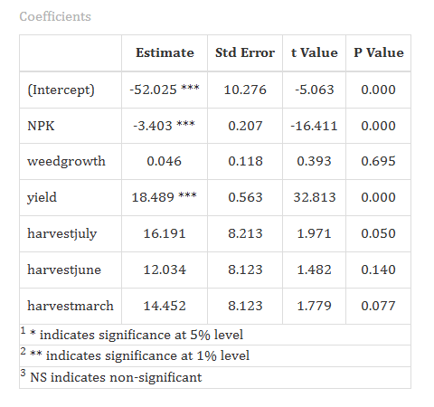{#fig-res1 fig-align="center"}

<details>

```{=html}
<summary style="color: #5DADE2"; font-weight: bold;">
  Understanding the Coefficients Table
</summary>
```

<small>

| Column | Description |
|------------------------------------|------------------------------------|
| **Estimate (β)** | The partial regression coefficient. The expected change in Y for a one-unit increase in the predictor, holding all other predictors constant. |
| **Std. Error** | The standard error of the estimate. A smaller SE relative to the coefficient indicates a more precise estimate. |
| **t Value** | The t-statistic = Estimate ÷ Std. Error. Tests whether the coefficient is significantly different from zero. |
| **P Value** | The probability of observing a t-value this extreme if the true coefficient were zero. p \< 0.05 indicates a statistically significant predictor. |
| **Significance codes** | \*\*\* p \< 0.001 · \*\* p \< 0.01 · \* p \< 0.05 · (blank) not significant |

</small>

</details>

#### Interpretation from @fig-res1 {.unnumbered}

::: {style="text-align: justify;"}
The fitted model for predicting irrigation demand from NPK dose, weed growth, crop yield, and harvest month reveals a clear and informative pattern. The intercept was estimated at −52.03 (p \< 0.001), representing the baseline irrigation level when all predictors are at their reference values. **NPK dose** had a highly significant negative effect on irrigation (β = −3.40, t = −16.41, p \< 0.001), indicating that each additional kg/ha of NPK was associated with a reduction of 3.40 litres/plot in irrigation demand after accounting for the other variables a finding consistent with improved nutrient-driven water use efficiency. **Crop yield** was the strongest predictor in the model (β = 18.49, t = 32.81, p \< 0.001), demonstrating that higher-yielding plots required substantially greater irrigation. **Weed growth** was not a statistically significant predictor (β = 0.046, p = 0.695), suggesting that weed pressure did not independently alter irrigation requirements in this dataset. Among the harvest month contrasts (reference = January), neither July (β = 16.19, p = 0.050), June (β = 12.03, p = 0.140), nor March (β = 14.45, p = 0.077) reached the conventional 5% threshold, though July was borderline significant.
:::

::: callout-tip
#### Interpreting β coefficients: Each β is a *partial* effect the estimated change in the response for a one-unit increase in that predictor, with all other predictors held constant. A significant p-value (\< 0.05) confirms that the predictor's contribution goes beyond what the other variables already explain.
:::

------------------------------------------------------------------------

### Model Statistics

::: {style="text-align: justify;"}
The Model Statistics table shown in @fig-res2 summarises the overall goodness-of-fit of the regression model. These indices tell you how well the set of predictors collectively accounts for the variation in the response variable.
:::

**Table 2: Model Statistics**

{#fig-res2 fig-align="center"}

<details>

```{=html}
<summary style="color: #5DADE2"; font-weight: bold;">
  Understanding Model Statistics
</summary>
```

<small>

| Statistic | Description |
|------------------------------------|------------------------------------|
| **R²** | Coefficient of Determination. The proportion of total variance in Y explained by the model. Ranges from 0 to 1; higher is better. |
| **Adjusted R²** | R² penalised for the number of predictors. More reliable than R² when comparing models of different sizes; always ≤ R². |
| **Residual Error** | The Root Mean Square Error (RMSE) — the standard deviation of the residuals. Measures average prediction error in the same units as Y. |
| **PRESS** | Prediction Residual Error Sum of Squares. A leave-one-out cross-validation statistic assessing how well the model predicts new observations; lower PRESS indicates better predictive ability. |

</small>

</details>

#### Interpretation from @fig-res2 {.unnumbered}

::: {style="text-align: justify;"}
The model achieved an R² of 0.850, indicating that approximately 85% of the total variation in irrigation demand across the 200 plots is accounted for collectively by NPK dose, weed growth, crop yield, and harvest month. The Adjusted R² of 0.846 confirms that this explanatory power is genuine and not inflated by the inclusion of additional predictors. The Residual Standard Error of 40.46 litres/plot quantifies the typical size of prediction error on average, the model's irrigation predictions deviate from observed values by about 40 litres. The PRESS statistic of 344,396 serves as a cross-validation benchmark; a lower PRESS relative to competing models would indicate superior predictive accuracy for new observations.
:::

::: callout-tip
#### Interpreting R²: An R² of 0.85 means 85% of the variability in the response is explained by the model. The remaining 15% reflects factors not included in the model or inherent random variation. R² alone does not confirm that the model is correctly specified always check the Assumptions tab.
:::

------------------------------------------------------------------------

### ANOVA Table for Regression

::: {style="text-align: justify;"}
The ANOVA table for regression shown in @fig-res3 partitions the total variation in Y into the portion explained by the model (Regression SS) and the unexplained residual variation (Error SS). The F-test in this table assesses whether the model as a whole fits the data significantly better than an intercept-only (null) model.
:::

**Table 3: Analysis of Variance**

{#fig-res3 fig-align="center"}

<details>

```{=html}
<summary style="color: #5DADE2"; font-weight: bold;">
  ANOVA Table Structure for Regression
</summary>
```

<small>

| Source     | Df  | Sum_Sq       | Mean_Sq      | F_value | Pr_F     |
|------------|-----|--------------|--------------|---------|----------|
| Regression | 6   | 1,796,229.66 | 299,371.61   | 182.85  | \< 0.001 |
| NPK        | 1   | 6,345.09     | 6,345.09     | 3.88    | 0.050    |
| weedgrowth | 1   | 3,349.21     | 3,349.21     | 2.05    | 0.154    |
| yield      | 1   | 1,778,654.45 | 1,778,654.45 | 1086.37 | \< 0.001 |
| harvest    | 3   | 7,880.92     | 2,626.97     | 1.61    | 0.190    |
| Error      | 193 | 315,989.75   | 1,637.25     | —       | —        |
| Total      | 199 | 2,112,219.40 | —            | —       | —        |

In this table, **Regression** is the overall model row. Each subsequent predictor row shows its individual sequential (Type I) contribution to SS. The **Error** row represents unexplained residual variation, and its Mean Square (MSE = 1,637.25) is the denominator for all F-tests.

</small>

</details>

#### Interpretation from @fig-res3 {.unnumbered}

::: {style="text-align: justify;"}
The overall regression model was highly significant (F₆,₁₉₃ = 182.85, p \< 0.001), confirming that the six predictors collectively explain a statistically meaningful portion of the variation in irrigation demand. Examining individual predictors sequentially, **yield** contributed by far the largest share of explained variation (SS = 1,778,654; F = 1086.37; p \< 0.001), consistent with its dominant coefficient in the Model Coefficients table. **NPK dose** also contributed significantly to the regression SS (F = 3.88; p = 0.050), while **weed growth** (p = 0.154) and the combined **harvest month** factor (F₃ = 1.61; p = 0.190) did not reach significance. The Mean Square Error of 1,637.25 provides the baseline estimate of unexplained variance used to compute all standard errors and F-ratios in the analysis.
:::

## Assumptions {#sec-8 .ASM}

::: {style="text-align: justify;"}
The validity of regression inference depends on five classical assumptions. If these are violated, coefficient estimates may be biased, standard errors incorrect, or significance tests misleading. **RAISINS** provides formal statistical tests and diagnostic outputs for each assumption, accessible directly from the Assumptions sub-tab after running your analysis. Checking assumptions is not optional it is an essential part of responsible regression reporting.
:::

<details>

```{=html}
<summary style="color: #5DADE2"; font-weight: bold;">
  What are Regression Assumptions?
</summary>
```

<ul><small>Regression assumptions are the conditions under which Ordinary Least Squares (OLS) estimators are **BLUE** -Best Linear Unbiased Estimators as guaranteed by the Gauss-Markov theorem. When all assumptions hold, OLS coefficients have minimum variance among all linear unbiased estimators. Different violations have different consequences: non-normality primarily affects small-sample inference; heteroscedasticity produces incorrect standard errors; autocorrelation invalidates standard errors for time-ordered data; multicollinearity destabilises individual coefficient estimates while leaving overall predictions intact.</small></ul>

</details>

### Assumption 1: Independence of Errors

::: {style="text-align: justify;"}
The independence assumption states that the error terms for different observations are uncorrelated with one another. Violation known as autocorrelation most commonly arises in time-series or spatially ordered data, where nearby observations tend to share similar values. **RAISINS** reports the **Durbin-Watson (DW) statistic** (@fig-dw) to test for serial autocorrelation. The DW statistic ranges from 0 to 4: a value near 2 indicates no autocorrelation (DW = 2.194 in our working example; p = 0.877, confirming independence); values below 1.5 suggest positive autocorrelation; values above 2.5 suggest negative autocorrelation. For cross-sectional experimental data such as field trials this assumption is generally expected to hold, and the Durbin-Watson test serves as a confirmatory check.
:::

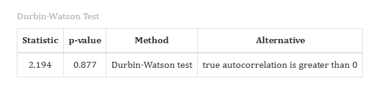{#fig-dw fig-align="center"}

### Assumption 2: Homoscedasticity (Constant Variance)

::: {style="text-align: justify;"}
Homoscedasticity requires that the variance of the residuals is constant across all levels of the fitted values. When variance is non-constant (heteroscedasticity), standard errors of the coefficients are incorrect, producing unreliable hypothesis tests and confidence intervals even if the coefficient estimates themselves are unbiased. **RAISINS** checks this assumption with two complementary tools: the **Scale-Location plot** and the **Non-Constant Variance (NCV) test** (also known as the Breusch-Pagan test), as shown in @fig-asmh. In the Scale-Location plot, a horizontal smoothed line with uniformly scattered points indicates constant variance; a rising or fanning pattern signals heteroscedasticity. In our working example, the NCV test yielded χ²(1) = 13.53, p \< 0.001, indicating significant non-constant variance a violation that may require a variance-stabilizing transformation of the response (e.g., log or square root of Y) or the use of heteroscedasticity-consistent standard errors.
:::

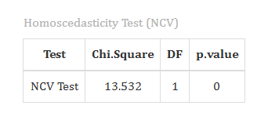{#fig-asmh fig-align="center"}

### Assumption 3: Normality of Residuals

::: {style="text-align: justify;"}
The normality assumption requires that the residuals follow a normal distribution. This is particularly important for the validity of t-tests on individual coefficients and the F-test for the overall model, especially in small samples. In large samples (typically n \> 30) the Central Limit Theorem ensures that OLS estimators are approximately normal regardless of the residual distribution, but formal testing remains good practice. **RAISINS** provides the **Shapiro-Wilk test** and a **Normal QQ plot of residuals** for this purpose, as shown in @fig-asmn. In the QQ plot, residual quantiles are plotted against the corresponding quantiles of a standard normal distribution points lying closely along the diagonal confirm normality, while systematic departures at the tails indicate skewness or heavy tails. In our example, the Shapiro-Wilk statistic W = 0.958 with p \< 0.001 suggests that the residuals depart significantly from normality, a finding common with large datasets and one that should prompt consideration of a response transformation or robust regression.
:::

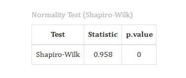{#fig-asmn fig-align="center"}

### Assumption 4: No Multicollinearity (MLR)

::: {style="text-align: justify;"}
Multicollinearity occurs when two or more predictor variables are highly correlated, causing individual coefficient estimates to become imprecise and sensitive to small changes in the data, even though overall model predictions may remain stable. **RAISINS** computes the **Generalized Variance Inflation Factor (GVIF)** for each predictor, generalised to handle categorical variables with multiple dummy codes. The GVIF is calculated using the formula:

$$VIF_j = \frac{1}{1 - R_j^2}$$

where $R_j^2$ is the R² from regressing predictor $X_j$ on all other predictors. For categorical predictors with multiple degrees of freedom, the **Standard GVIF** (reported in **RAISINS** as GVIF\^(1/2df)) is the preferred comparison metric, with values below approximately 2.24 (equivalent to VIF \< 5) indicating acceptable collinearity. As shown in @fig-asmv, in our working example all Standard GVIF values were close to 1 (NPK: 1.288; weed growth: 1.076; yield: 1.230; harvest: 1.008), confirming that multicollinearity is not a concern in this model.
:::

{#fig-asmv fig-align="center"}

<details>

```{=html}
<summary style="color: #5DADE2"; font-weight: bold;">
  Assumptions Summary Table
</summary>
```

<small>

| Assumption | Test / Plot in RAISINS | Acceptable Result | Sub-tab |
|------------------|------------------|------------------|------------------|
| Linearity | Residuals vs Fitted plot | Random scatter around zero | `Assumptions` |
| Independence | Durbin-Watson statistic | 1.5 \< DW \< 2.5; p \> 0.05 | `Assumptions` |
| Homoscedasticity | Scale-Location plot; NCV test | Horizontal band; p \> 0.05 | `Assumptions` |
| Normality | Shapiro-Wilk test; Normal QQ plot | W p \> 0.05; points on diagonal | `Assumptions` |
| No Multicollinearity | GVIF table | Standard GVIF \< 2.24 for all predictors | `Assumptions` |

</small>

</details>

::: {style="text-align: justify;"}
Among the four assumptions,**homoscedasticity** tend to have the most serious practical consequences when violated, since non-linearity produces biased coefficient estimates and heteroscedasticity invalidates standard errors and significance tests. **Normality** matters most in small samples (n \< 30) and becomes less critical as sample size grows, owing to the Central Limit Theorem. **Independence** is most critical when data have a temporal or spatial ordering, and least so in simple cross-sectional field experiments with random treatment allocation. **Multicollinearity** is unique in that it does not bias predictions but makes individual coefficient estimates unreliable and difficult to interpret, which is particularly important when the goal of the analysis is to understand the unique contribution of each predictor rather than merely to predict Y.
:::

## Plot Designs {#BP}

::: {style="text-align: justify;"}
**RAISINS** is designed for a smooth and hassle-free experience. Once you click the Run Analysbutton, all relevant results and plots appear instantly leaving no room for confusion. Navigate to the Plot design sub-tab to access the full suite of diagnostic and visualisation plots for your regression model (see @fig-cust). Each plot comes with a gear icon at the top-left corner, allowing you to customise its appearance. You can also download these plots in high-quality PNG (300 dpi), JPEG, TIFF, PDF, and SVG formats for use in reports and publications.
:::

### Customizing plots

::: {style="text-align: justify;"}
**RAISINS** provides a range of customization features for each plot. Click the gear icon on any plot panel to open the settings shown in @fig-cust, where you can modify the plot title, axis labels, colour palette, point size, line type, and theme. Changes are reflected in real time and the updated plot can be downloaded immediately.
:::

.png){#fig-cust fig-align="center"}

::: {style="text-align: justify;"}
From @fig-9 to @fig-14, you can see the different types of plots available in the Plot Design tab of the Regression Analysis module in **RAISINS**. Each is visually illustrated and accompanied by a clear description below hover over any plot thumbnail to read it.
:::

```{=html}
<script>
document.addEventListener('DOMContentLoaded', function() {
  const descriptions = document.querySelectorAll('.plot-description');
  descriptions.forEach(desc => {
    desc.style.display = 'none';
  });
});

function showDescription(id) {
  document.getElementById(id).style.display = 'flex';
}

function hideDescription(id) {
  document.getElementById(id).style.display = 'none';
}
</script>
```

```{=html}
<style>
.plot-container {
  position: relative;
  display: inline-block;
  cursor: pointer;
  width: 350px;
  height: 300px;
  overflow: hidden;
  margin: 10px;
}

.plot-container img {
  width: 350px;
  height: 300px;
  object-fit: cover;
  border: 3px solid #ddd;
  border-radius: 8px;
  transition: transform 0.3s ease, box-shadow 0.3s ease;
}

.plot-container:hover img {
  transform: scale(1.05);
  box-shadow: 0 4px 12px rgba(0, 0, 0, 0.2);
}

.plot-description {
  display: none !important;
  position: absolute;
  top: 0;
  left: 0;
  width: 100%;
  height: 100%;
  z-index: 1000;
  color: white;
  padding: 15px;
  border-radius: 8px;
  box-shadow: 0 4px 15px rgba(0, 0, 0, 0.3);
  font-size: 14px;
  line-height: 1.5;
  display: flex;
  align-items: center;
  justify-content: center;
  text-align: center;
  animation: fadeIn 0.3s ease-in;
  pointer-events: none;
  border: 2px solid rgba(255, 255, 255, 0.5);
}

.plot-container:hover .plot-description {
  display: flex !important;
}

@keyframes fadeIn {
  from { opacity: 0; transform: scale(0.95); }
  to   { opacity: 1; transform: scale(1); }
}

#scatter-desc    { background: linear-gradient(135deg, rgba(255, 107, 107, 0.88), rgba(255, 142, 83, 0.88)); }
#residfit-desc   { background: linear-gradient(135deg, rgba(161, 140, 209, 0.88), rgba(251, 194, 235, 0.88)); }
#qq-desc         { background: linear-gradient(135deg, rgba(0, 221, 235, 0.88), rgba(38, 166, 154, 0.88)); }
#scaleloc-desc   { background: linear-gradient(135deg, rgba(255, 154, 139, 0.88), rgba(255, 106, 136, 0.88)); }
#cooks-desc      { background: linear-gradient(135deg, rgba(132, 250, 176, 0.88), rgba(143, 211, 244, 0.88)); }
#reslev-desc     { background: linear-gradient(135deg, rgba(255, 200, 80, 0.88),  rgba(255, 140, 0, 0.88)); }
</style>
```

::::::::::::::: grid
:::::: g-col-6
::::: {.plot-container onmouseover="showDescription('scatter-desc')" onmouseout="hideDescription('scatter-desc')"}
{#fig-9}

:::: {#scatter-desc .plot-description}
::: {style="text-align: justify;"}
A regression line plot in regression analysis is a graphical representation used to show the relationship between an independent variable (X) and a dependent variable (Y). It consists of scattered data points along with a fitted regression line that represents the best linear relationship between the variables. The regression line helps in understanding the trend, direction, and strength of the relationship. If the line slopes upward, it indicates a positive relationship, while a downward slope indicates a negative relationship. Regression line plots are widely used to predict values, identify patterns, and analyze the accuracy of regression models.
:::
::::
:::::
::::::

:::::: g-col-6
::::: {.plot-container onmouseover="showDescription('residfit-desc')" onmouseout="hideDescription('residfit-desc')"}
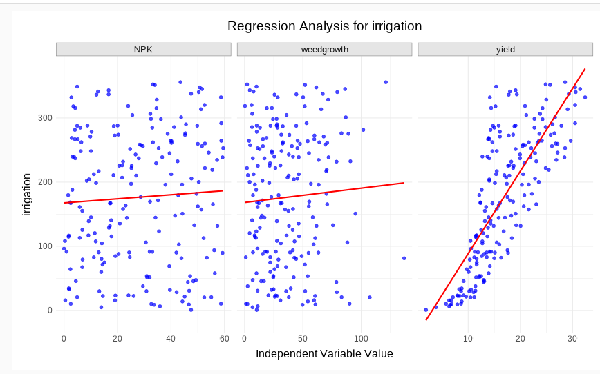{#fig-10}

:::: {#residfit-desc .plot-description}
::: {style="text-align: justify;"}
A **facet regression plot** in regression analysis is an advanced graphical method used to display regression relationships across multiple groups or categories simultaneously. The data is divided into separate panels, called facets, based on a categorical variable, and each panel contains its own scatter plot and regression line. This helps compare trends, patterns, and relationships between variables across different groups in a clear and organized manner. Facet regression plots are useful for identifying variations in regression behavior, detecting group-wise differences, and improving the interpretation of complex datasets.
:::
::::
:::::
::::::

:::::: g-col-6
::::: {.plot-container onmouseover="showDescription('qq-desc')" onmouseout="hideDescription('qq-desc')"}
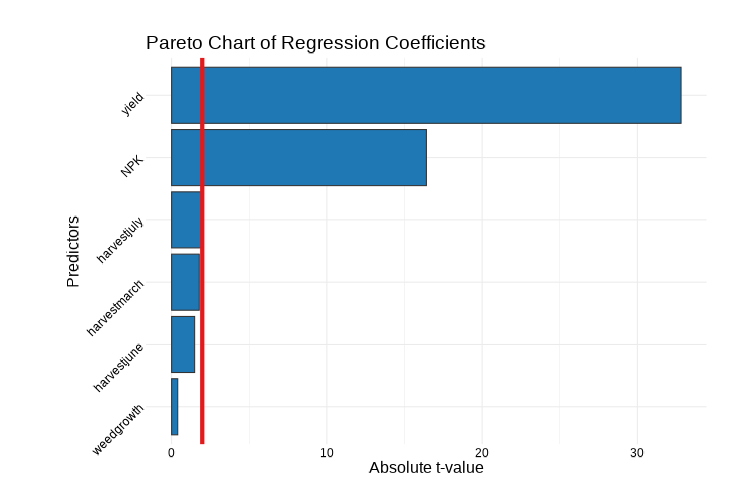{#fig-11}

:::: {#qq-desc .plot-description}
::: {style="text-align: justify;"}
A **Pareto chart of regression coefficients** is a graphical tool used in regression analysis to display the relative importance of predictor variables based on the magnitude of their regression coefficients or standardized effects. The variables are arranged in descending order of their impact, with bars representing the coefficient values and a cumulative percentage line showing the overall contribution. This chart helps identify the most influential variables affecting the response variable and simplifies interpretation by highlighting the key factors in the regression model. Pareto charts are widely used in statistical modeling, quality control, and experimental analysis for effective decision-making.
:::
::::
:::::
::::::
:::::::::::::::

## AI Interpretation {#AI}

::: {style="text-align: justify;"}
**RAISINS** is equipped with an AI-powered RAISINS Assistant designed to help users understand the outputs of regression analysis clearly and confidently. As shown in @fig-ai, the AI provides plain-language summaries of the model coefficients identifying which predictors are statistically significant and explaining the direction and magnitude of each effect in the context of your data. It also interprets the overall model fit (R² and F-test), flags any assumption violations detected in the Assumptions tab, and suggests practical remedies such as response transformations, removal of redundant predictors, or consideration of robust regression when violations are detected. Users can access this feature by clicking on `AI Interpretation` within the Regression Analysis tab.
:::

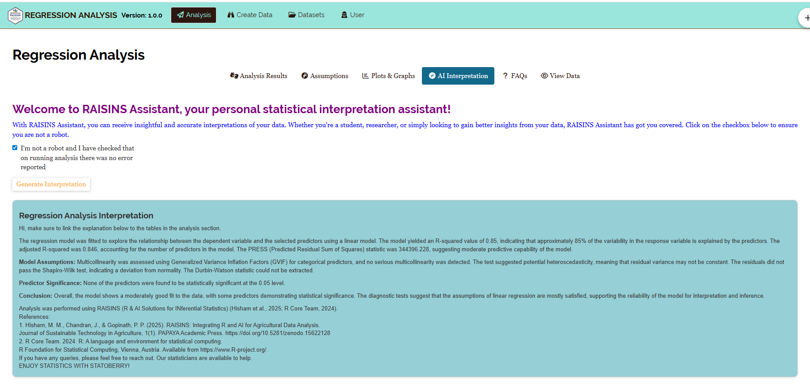{#fig-ai fig-align="center"}

## Preparing your data {#PRE}

::: {style="text-align: justify;"}
"Your analysis is only as good as your data! Feed RAISINS high-quality data, and it will deliver powerful insights feed it messy data, and the results won't be trustworthy."

1.  Create your dataset in MS Excel

2.  Build your dataset directly within the RAISINS app
:::

## Preparing data in MS Excel {#EX}

::: {style="text-align: justify;"}
Open a new blank sheet in MS Excel with only one sheet included, and avoid adding any unnecessary content. The dataset for regression should follow a column-based format: dedicate one column to the **response variable (Y)** and one column to each **predictor variable (X)**. Each row represents one observation. Categorical predictors (such as harvest month) should be entered as text labels **RAISINS** will automatically convert them to the appropriate dummy-coded contrasts. The file can be saved in CSV, XLS, or XLSX format, but CSV is recommended as it is lighter and enables faster loading. Ensure that all variable columns containing measurements are purely numeric, with no text, symbols, or missing-value indicators. For reference, see the structure shown in @fig-pp. The data can also be arranged as shown in @fig-kk.
:::

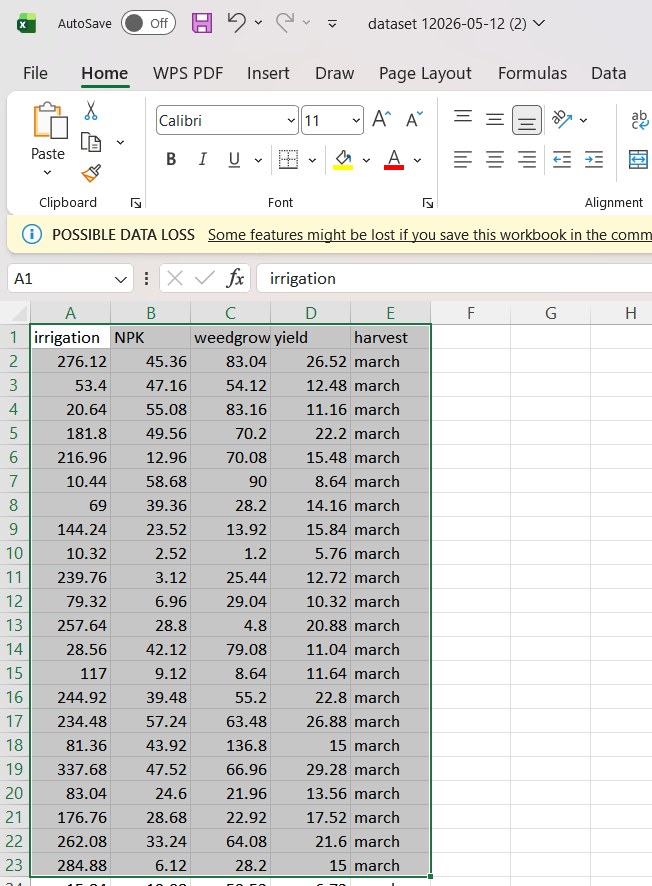{#fig-pp}

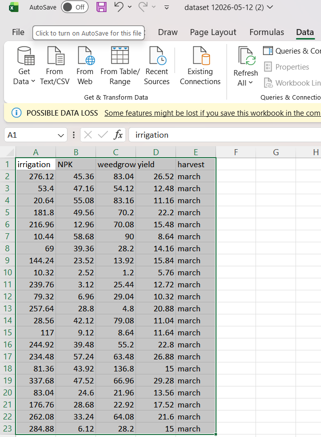{#fig-kk}

<details>

<summary>Dataset Creation Rules</summary>

<small> 1. **Column Naming Convention** - No spaces allowed in column names.\
- Use underscores (`_`) or full stops (`.`) for separation. - Avoid symbols and special characters like %,# etc 2. **Data Arrangement** - Start data arrangement towards the upper-left corner.\
- Ensure the row above the data is not blank. 3. **Cell Management** - Avoid typing or deleting in cells without data.\
- If needed, select affected cells, right-click, and select **Clear Contents**. 4. **Column Relevance** - Name all columns meaningfully.\
- Exclude unnecessary columns not required for analysis. 5. **Numeric Columns** - All response and measurement predictor columns must be purely numeric. Non-numeric entries (e.g., "NA", "–", text) will cause upload errors. Categorical predictors should be entered as consistent text labels (e.g., "January", "July"). </small>

</details>

<details>

<summary>How to Save as CSV in MS Excel</summary>

<small> 1. **Open Your Workbook**

```         
-   Ensure your data is arranged properly with only one sheet.
```

2.  **Click 'File' Menu**

    -   Go to the top-left corner and click on **File**.

3.  **Choose 'Save As' or 'Save a Copy'**

    -   Select the location where you want to save your file.

4.  **Set File Type to CSV**

    -   In the **'Save as type'** dropdown menu, choose **CSV (Comma delimited) (\*.csv)**.

5.  **Name Your File**

    -   Enter a relevant file name without spaces (use underscores if needed).

6.  **Click 'Save'**

    -   Click **Save** to export the file.

> 💡 Tip: Before saving, double-check that your data is on the first sheet, all numeric columns are clean, and categorical columns use consistent labels with no trailing spaces. </small>

</details>

## Creating dataset in RAISINS {#CR}

::: {style="text-align: justify;"}
If you're unsure about the correct format for creating a dataset, don't worry **RAISINS** offers an option to create data directly within the app using a prescribed template. Here's how:

-   Navigate to the **Create Data Tab**

-   Select the number of **Variables** (total columns = 1 response + all predictors)

-   Select the number of **Observations** (number of rows / data points)

-   Click on the **Create** button

The model layout will appear as shown in @fig-createdata. Enter your observations manually into the downloaded CSV file, or paste them directly. Once all values are entered, download the CSV file and upload it in the Regression Analysis tab.
:::

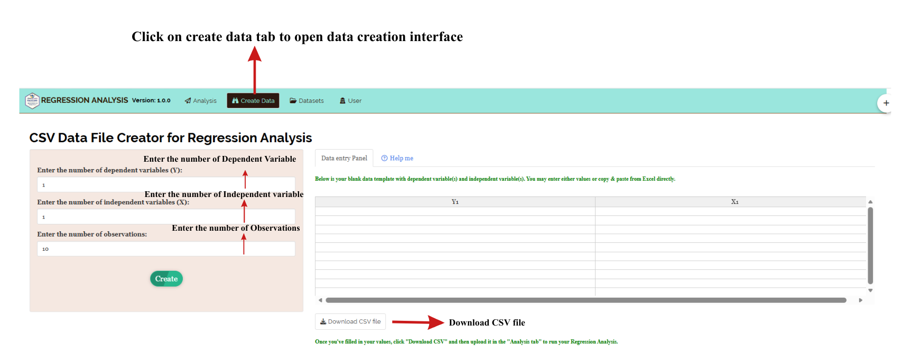{#fig-createdata}

## Model datasets {#M}

::: {style="text-align: justify;"}
To test the app or better understand the expected data arrangement for regression, **RAISINS** provides model datasets within the app. You can download them from the Datasets tab and use them to explore the regression module before uploading your own data.
:::

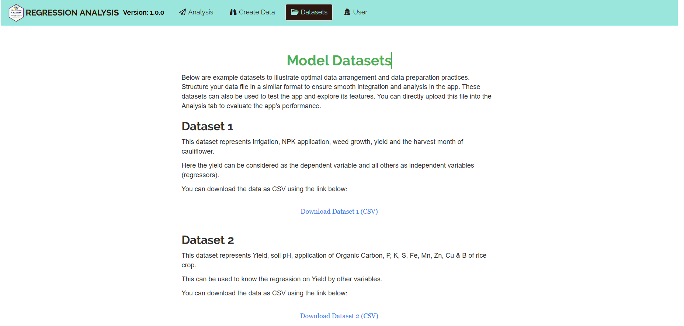{#fig-188 fig-align="center"}

## FAQ's {#F}

::: {style="text-align: justify;"}
The app includes a dedicated FAQs tab to help clarify common doubts and guide users through all features of the Regression Analysis module. This section provides detailed answers to frequently asked questions, covering topics such as how to interpret R² correctly, what to do when assumptions are violated, how to handle categorical predictors, and when to prefer MLR over SLR. If you're ever unsure about how something works in **RAISINS**, the FAQs tab is a great place to start.
:::

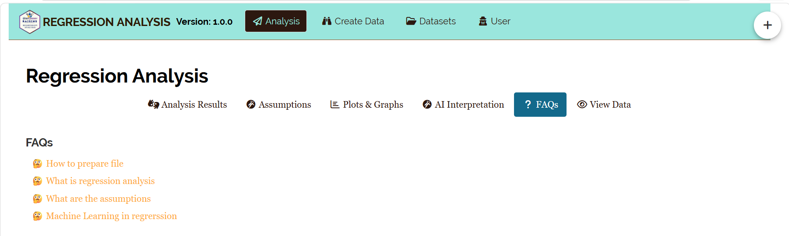{#fig-148 fig-align="center"}

## View data {#U}

::: {style="text-align: justify;"}
View Data serves as the primary diagnostic tool for ensuring data integrity before analysis. Upon uploading your dataset, the system performs an automated Health Check to validate column types and formatting. For regression analysis this step is particularly important **RAISINS** will flag any predictor or response column that contains non-numeric values, missing entries, or formatting inconsistencies that could compromise the regression computation. Resolving these issues before clicking Run Analysis ensures that all outputs are based on clean, correctly typed data.
:::

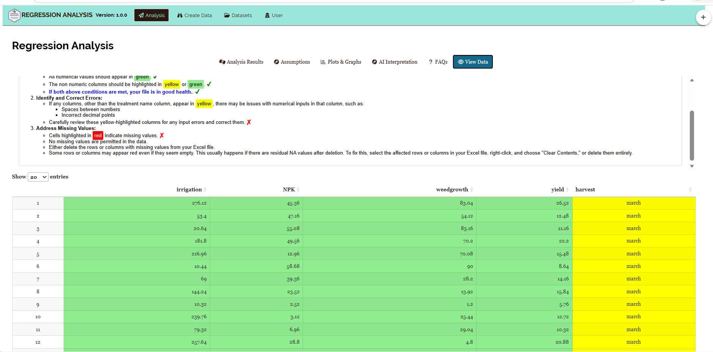{fig-align="center"}

------------------------------------------------------------------------
