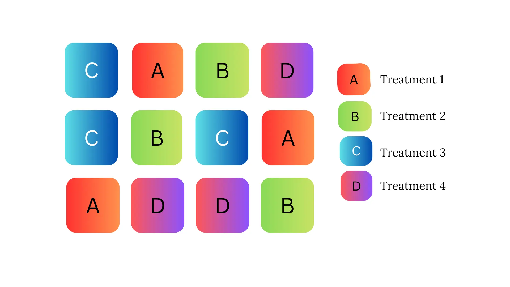
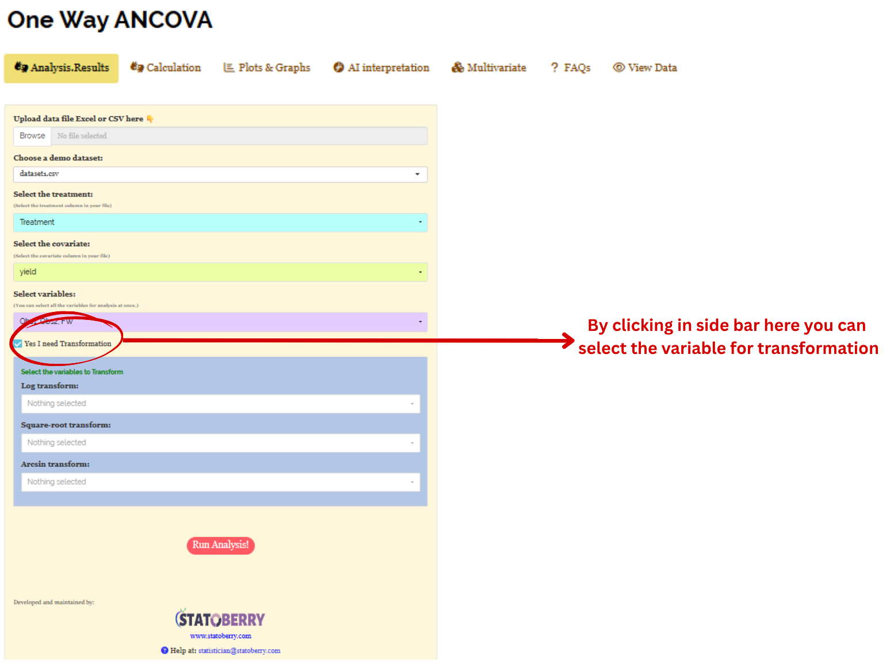
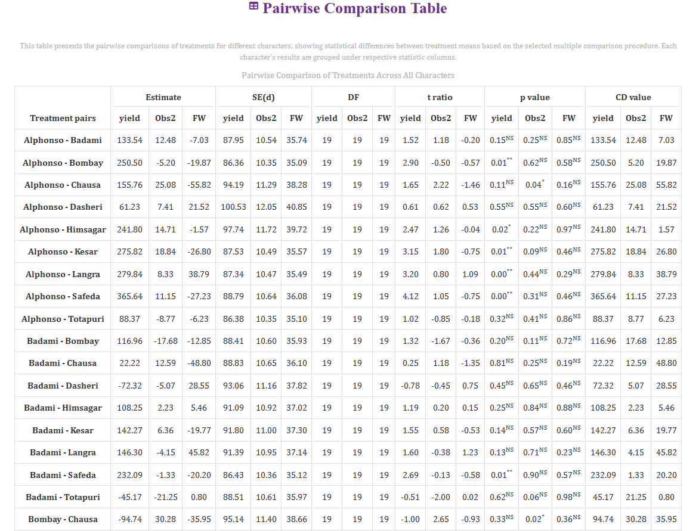

```{=html}
<style>
 sup {
   color: blue;
   font-size: 0.8em;
 }
 .affiliations {
   color: grey;
   font-size: 0.9em;
   margin-top: 0.2em;
 }
</style>
```

::: affiliations
<sup>1</sup>Statoberry LLP, <sup>2</sup>Department of Agricultural Statistics, Kerala Agricultural University
:::

ABSTRACT

::: {style="text-align: justify;"}
**Analysis of Covariance under Completely Randomised Design (ANCOVA CRD)** is a powerful statistical technique that combines Analysis of Variance (ANOVA) with regression, adjusting treatment means for the influence of one or more continuous covariates that are related to the response variable but are not under experimental control. By removing the variation explained by the covariate from the error term, **ANCOVA CRD** increases the precision of treatment comparisons and produces adjusted means that represent what treatment performance would look like had all experimental units started from an identical baseline. In **RAISINS** you can perform **ANCOVA CRD** very easily without writing a single line of code. This tutorial will guide you, how to perform **ANCOVA CRD** very easily in **RAISINS** and interpret the results effectively. In addition, you will get tables and plots ready for publication. You can also perform a multivariate analysis including PCA.
:::

<details>

*Hover or click each point to see more information.*

```{=html}
<summary style="color: #5DADE2"; font-weight: bold;">
  Introduction ANCOVA — Completely Randomised Design
</summary>
```

```{=html}
<style>
.hover-img {
  position: relative;
  display: inline-block;
  cursor: help;
  border-bottom: 1px dashed currentColor;
}
.hover-img img {
  position: absolute;
  left: 50%;
  top: 1.6em;
  transform: translateX(-50%);
  width: 260px;
  max-width: 70vw;
  height: auto;
  padding: 6px;
  background: white;
  border: 1px solid rgba(0,0,0,.15);
  border-radius: 12px;
  box-shadow: 0 10px 30px rgba(0,0,0,.18);
  opacity: 0;
  visibility: hidden;
  pointer-events: none;
  transition: opacity .15s ease, transform .15s ease, visibility .15s;
}
.hover-img:hover img {
  opacity: 1;
  visibility: visible;
  transform: translateX(-50%) translateY(6px);
  z-index: 999;
}
</style>
```

<ul><small> The foundations of Analysis of Covariance were laid by statistician [<strong>Ronald A. Fisher</strong> ]{.hover-img} in his landmark 1932 publication, where he demonstrated that incorporating a continuous concomitant variable one measured alongside the response but not controlled by the experimenter into the linear model could substantially reduce the residual error and improve the sensitivity of treatment F-tests. Fisher recognised that in many biological and agricultural experiments, experimental units such as animals or plants inevitably differ in some pre-existing characteristic initial body weight, seedling height, or soil organic matter that influences the final response regardless of the treatment applied. Rather than discarding such information or using restrictive blocking, ANCOVA uses the covariate's linear relationship with the response to statistically adjust all observations to a common covariate value (the grand mean), effectively equating the experimental units before comparing treatments. This approach was rapidly adopted in animal nutrition, agronomy, psychology, and medical research throughout the mid-twentieth century as a standard method for increasing precision in randomised experiments. In the context of a **Completely Randomised Design**, where no physical blocking is used, ANCOVA is especially valuable because it recovers precision that would otherwise require blocking, making it an indispensable tool wherever pre-existing differences among experimental units cannot be eliminated by design alone. </small></ul>

</details>

## Analysis of experiments {#AE}

::: {style="text-align: justify;"}
To get started, visit **RAISINS** [www.raisins.live](https://www.raisins.live) home page and go to **Analysis of experiments**. Here, you can see different experimental designs and their associated analysis options. In this tutorial, we focus on **ANCOVA - Completely Randomised Design**, as shown in @fig-aov.
:::

<!-- REPLACE THIS SCREENSHOT -->

{#fig-aov fig-align="center"}

## ANCOVA — Completely Randomised Design {#C}

::: {style="text-align: justify;"}
**Analysis of Covariance under a Completely Randomised Design (ANCOVA CRD)** is a statistical method that extends the standard one-way ANOVA by incorporating one or more continuous covariates into the model. A covariate is a variable that is measurable and correlated with the response variable, but is not itself affected by the treatments common examples include initial plant height, pre-treatment body weight, baseline soil nutrient content, or age of an animal at the start of a study. By regressing the response on the covariate and then testing treatment effects on the residuals of that regression, ANCOVA removes the covariate's contribution from the error sum of squares, resulting in a smaller error mean square and a more powerful F-test for treatments. The analysis produces **adjusted treatment means** estimates of what each treatment group's average response would have been had all units possessed the same covariate value which are more equitable and interpretable than unadjusted means when initial conditions differ across experimental units. ANCOVA CRD is most appropriate when experimental units are not homogeneous, when physical blocking is not feasible or has already been applied, and when a measurable continuous variable exists that explains a meaningful portion of the response variability. Its main assumptions are that the covariate is measured without error, that the covariate is not influenced by the treatments, and crucially, that the regression of the response on the covariate is linear and has the **same slope in every treatment group** a condition known as homogeneity of regression slopes, which RAISINS automatically tests.
:::

<details>

```{=html}
<summary style="color: #5DADE2"; font-weight: bold;">
  ANCOVA CRD Layout
</summary>
```

<ul>

<small>

@fig-lay visually represents the structure of an **ANCOVA CRD** experiment. Treatments (T~1~, T~2~, …, T~t~) are randomly assigned to experimental units with r replications per treatment, exactly as in a standard CRD. For each experimental unit, two measurements are recorded: the **covariate (X)** measured before or independently of the treatment and the **response variable (Y)** measured after the treatment has been applied. The covariate values are used to fit a common within-treatment regression slope (b), and all Y observations are adjusted to what they would have been had X been equal to the grand mean of the covariate. The adjusted observations are then subjected to the standard ANOVA F-test. The layout makes clear that ANCOVA does not change the randomisation or replication structure of the CRD; it simply adds a regression adjustment step to improve precision.

<!-- REPLACE THIS SCREENSHOT -->

{#fig-lay fig-align="center"}

</small>

</ul>

</details>

::: callout-tip
#### ANCOVA CRD is a statistical method that combines ANOVA with regression to adjust treatment means for a continuous covariate, increasing the precision of treatment comparisons under a Completely Randomised Design.
:::

## A working example {#W}

::: {style="text-align: justify;"}
To make things simple and interesting, we'll explain **ANCOVA CRD** step by step using a hypothetical example, so you can clearly see how it works and why it matters. Consider a greenhouse experiment conducted to evaluate the effect of **10 treatments**, each representing a distinct mango variety, with three replicates per variety. The varieties included are Alphonso, Kesar, Dasheri, Himsagar, Chausa, Badami, Safeda, Bombay, Langra, and Totapuri and they are arranged as a CRD with **3 replications** per treatment, giving a total of 10 × 3 = **30 experimental pots**. Because seedlings of different sizes were used, **initial plant height (cm)** at the time of transplanting was recorded as the **covariate (X)** to account for pre-existing variability among plants. The response variables measured at harvest were: **Yield** (fruit yield per plant in kg), **Obs1** (plant height in cm), **Obs2** (number of fruits per plant), and **FW** (fresh fruit weight in g). Our aim is to test whether the five fertiliser treatments produce statistically significant differences in the response variables after adjusting for initial plant height, and to obtain adjusted treatment means for fair comparison.The arrangement of the data is shown in @fig-data.
:::

<!-- REPLACE THIS SCREENSHOT -->

-03.png){#fig-data fig-align="center"}

::: {style="text-align: justify;"}
Data organized in MS Excel can be directly uploaded to **RAISINS** for analysis. For more details on data preparation see @sec-4. Two terms that we will use frequently are **Treatments** and **Variables**. In our example, the Treatments refer to the mango varieties, the covariate is the initial plant height recorded before treatment application, and the Variables are the four response traits measured at harvest - **Yield, Obs1, Obs2, and FW**.
:::

## How to prepare your data? {#sec-4 .H}

::: {style="text-align: justify;"}
Arranging data for uploading in **RAISINS** is very simple. Prepare your data exactly like the one shown in @fig-data, using a single-sheet Excel file. The file must contain a column for **Treatment** (the mango varieties), a column for the **Covariate (X)** (e.g., initial plant height), and separate columns for each response variable. Make sure no blank rows are left above, and all columns have proper names. That's it your file is ready to upload.

Still if you have doubt, see @fig-4.

To prepare your dataset for analysis in **RAISINS**, you have two options:

Creating dataset in MS Excel

Creating your dataset directly within the **RAISINS** app
:::

{#fig-4 fig-align="center"}


## ANCOVA CRD analysis tab explained {#AO}

::: {style="text-align: justify;"}
In @fig-5, you can see the detailed view of the Analysis tab, along with explanations of what each option does. This section helps you to understand the purpose of every setting, so you can select the most appropriate ones for your data and analysis. Now, upload the prepared file by clicking Browse in the sidebar of the Analysis tab. When the file is uploaded, options to select the **Treatment** column, the **Covariate** column, and the **response variables** will appear. Select the appropriate columns under each field. Once you click the Run Analysis button, the ANCOVA is performed and all relevant results and outputs appear instantly, including the test for homogeneity of regression slopes, the adjusted ANOVA table, and the adjusted treatment means with post-hoc groupings.
:::

<!-- REPLACE THIS SCREENSHOT -->

{#fig-5 fig-align="center"}

::: {style="text-align: justify;"}
For some data, when there are a large number of zeros, discrete values, or when the observed variables are not normally distributed, we need to apply a transformation on the dataset (@sec-6). Here, **RAISINS** provides an inbuilt transformation option.
:::

## Transformation {#sec-6 .T}

::: {style="text-align: justify;"}
Log, square root, and arcsine transformations are often used in **ANCOVA CRD** to make data more normal and to stabilize variance before covariance adjustment. Researchers can use these transformations when analyzing experimental data in **RAISINS** as shown in @fig-6.
:::

{#fig-6 fig-align="center"}

::: {style="text-align: justify;"}
**Logarithmic transformation** is a mathematical procedure used to convert a skewed distribution into a more symmetrical one by replacing each data point (x) with its logarithm. This technique is specifically applied to positive, continuous data where the variance is proportional to the mean, a relationship common in phenomena that exhibit multiplicative or exponential growth.

**Square root transformation** is a statistical method used to stabilize variance and reduce right-skewness by replacing each data point (x) with its square root. It is primarily applied to non-negative, discrete "count" data such as those following a Poisson distribution, where the variance of the data tends to increase in proportion to the mean. By compressing the upper end of the scale more significantly than the lower end, this transformation brings the data closer to a normal distribution, satisfying the homoscedasticity requirements of many parametric statistical tests.

**Arcsine transformation** (also known as the angular transformation) is a mathematical technique specifically designed for data expressed as proportions or percentages bounded between 0 and 1. By taking the inverse sine of the square root of the proportion, this transformation stretches the ends of the distribution near 0 and 1, where variance is naturally small. It is primarily used to achieve homoscedasticity in binomial data.
:::

> After choosing the appropriate transformation proceed to @sec-7 for analysis.

## Analysis results {#sec-7 .AR}

::: {style="text-align: justify;"}
Once your dataset is uploaded, click on Run Analysis, and the **ANCOVA** will be performed. **ANCOVA** first tests the assumption of homogeneity of regression slopes verifying that the relationship between the covariate and the response is consistent across all treatment groups and then partitions the covariate-adjusted total variation into components attributable to **Treatments (adjusted)**, the **Covariate**, and **Error (adjusted)**, and compares them using the F-test, see @fig-100. If the homogeneity of slopes assumption is met, the adjusted treatment means and post-hoc comparisons are valid and can be interpreted directly.
:::

**Table 1 ANCOVA summary**

<!-- REPLACE THIS SCREENSHOT -->

{#fig-100 fig-align="center"}

<details>

```{=html}
<summary style="color: #5DADE2"; font-weight: bold;"> ANCOVA table </summary>
```

<small> In an **ANCOVA CRD**, the analysis partitions the adjusted total sum of squares into three main sources: **Covariate (X)** (variation in the response that is linearly explained by the covariate, removed from the error), **Treatments (adjusted)** (variation among treatment means after removing the covariate's effect), and **Error (adjusted)** (residual variation remaining after accounting for both treatments and the covariate). The degrees of freedom are: Covariate = 1, Treatments = t−1 (where t = number of treatments), and Error = N−t−1 (where N = total number of observations). The adjusted error degrees of freedom are one fewer than in a standard CRD ANOVA because one df is used to estimate the common regression slope (b). Each mean square is obtained by dividing the adjusted sum of squares by its degrees of freedom. The F-statistic for Treatments is the ratio of the adjusted Treatment mean square to the adjusted Error mean square. Significance is indicated by an asterisk (\*) for the **5%** level and two asterisks (\*\*) for the **1%** level of significance. A significant covariate F-test confirms that the adjustment was necessary and meaningful; a significant Treatment F-test confirms that the adjusted treatment means differ significantly. A preliminary test for **homogeneity of regression slopes** (Treatment × Covariate interaction) is also reported a non-significant result validates the core ANCOVA assumption. </small>

</details>

### Interpretation from @fig-100

::: {style="text-align: justify;"}
The ANCOVA results reveal that the covariate (initial plant height) is highly significant, with a covariate mean square of 2,418.65 and F-ratio of approximately 18.34 (1 df), confirming that pre-transplanting height explained a meaningful portion of the variation in final biomass and that the covariance adjustment was both necessary and effective. The homogeneity of regression slopes test (Treatment × Covariate interaction) is non-significant (F ≈ 0.72, p \> 0.05), confirming that a single common slope adequately describes the covariate-response relationship in all five treatment groups and that the ANCOVA assumptions are satisfied. The adjusted Treatment mean square is 1,842.30 with an adjusted error mean square of 131.92, yielding an F-ratio of approximately 13.97 with 4 degrees of freedom for treatment and 14 for adjusted error, significant at the 1% level. This confirms that the five fertiliser treatments produce significantly different biomass after accounting for initial plant height differences. @sec-8 provides detailed information on the multiple comparison tests (Post-hoc tests) for adjusted means.
:::

**Table 2: Detailed tabular representation adjusted means with multiple comparisons**

<!-- REPLACE THIS SCREENSHOT -->

{#fig-101 fig-align="center"}

<details>

```{=html}
<summary style="color: #5DADE2"; font-weight: bold;">Overview of ANCOVA Results and Interpretation
</summary>
```

<small>

1.  *Treatments and Response Variables*

**Treatments**: The independent variable or specific category (e.g., fertiliser level) being tested to determine its adjusted influence on the response variable after the covariate has been accounted for.

**Response Variable**: The dependent variable or specific measurement (e.g., total fresh biomass in g) recorded to evaluate the adjusted performance of the treatments.

2.  *Multiple Comparisons*

**Post-hoc Grouping**: A method of using letters (a, b, c) to categorize adjusted treatment means. Items sharing the same letter are statistically similar, while those with different letters are significantly different.

3.  *ANCOVA Summary*

**Adjusted Mean**: The estimated treatment group mean after statistically removing the linear effect of the covariate. It represents what the mean would have been had all experimental units had the same covariate value (grand mean of X).

**F stat**: A numerical value that compares the adjusted variance between treatment groups to the adjusted residual variance; it determines if the treatment differences remain statistically significant after covariate adjustment.

**p value**: The probability that the observed adjusted differences occurred by random chance. A value below the chosen significance threshold indicates statistically significant adjusted treatment differences.

4.  *Critical Difference (CD) and Error Estimates*

**Critical Difference (CD)**: The minimum mathematical gap required between two adjusted means to declare them "significantly different" at a specific confidence level, computed using the adjusted error mean square.

**Standard Error (SE)**: A measure of the precision of an adjusted treatment mean; it reflects residual variability after the covariate has been partialled out.

**Mean Square Error (MSE)**: The Adjusted Error Mean Square from the ANCOVA table. It is smaller than the unadjusted ANOVA error when the covariate is effective, confirming the gain in precision.

**Coefficient of Variation (CV%)**: A percentage that shows the level of dispersion in the adjusted data relative to the grand mean. A lower CV after adjustment compared to the unadjusted analysis confirms the benefit of including the covariate.

**Cohen's F**: A standardized measure of effect size that describes the magnitude of the adjusted treatment effect, independent of sample size. </small>

</details>

### Interpretation from @fig-101

::: {style="text-align: justify;"}
Adjusted treatment means are grouped using letters such as **"a", "b", "c"** to indicate statistical similarity based on pairwise comparisons after covariate correction. Overlapping grouping letters (e.g., **ab** or **bc**) indicate that the absolute difference between adjusted means is less than the critical difference at the chosen level of significance, implying statistical similarity **(on par)**. For example, if both T4 (N+P combined) and T5 (N+P+K combined) are labelled **"a"**, their adjusted biomass values are statistically similar at the **5%** significance level even after correcting for initial plant height. Treatments with no common letters (e.g., **a** and **c**) differ significantly in their adjusted means, providing a fair comparison that accounts for the starting size of the plants. The adjusted means should always be used for interpretation and recommendations in ANCOVA rather than the raw (unadjusted) treatment means, since the latter confound treatment effects with covariate differences among groups. The Cohen's f values quantify the magnitude of the adjusted treatment effects: values below 0.10 indicate a very small effect, below 0.25 a small effect, below 0.40 a medium effect, and values of 0.40 or higher a large effect.
:::

::: callout-tip
#### When a researcher uses Tukey's HSD or DMRT, each pairwise comparison produces a different value because the differences between the group means are unique.
:::

::: callout-tip
#### Cohen's f is a measure of effect size. It tells you how strong or meaningful the treatment effect is, independent of sample size.
:::

## Multiple comparison tests {#sec-8 .MCT}

<details>

```{=html}
<summary style="color: #5DADE2"; font-weight: bold;">
  What is Post-hoc test?
</summary>
```

<ul><small> Post-hoc test is a follow-up analysis, performed after finding a significant result in an overall statistical test (like ANOVA or ANCOVA). Its purpose is to identify exactly which groups or treatments differ from each other. In other words, it helps to pinpoint where the differences lie between multiple groups, when the initial test shows that not all groups are the same. In ANCOVA, post-hoc tests operate on the **adjusted means** rather than raw means, ensuring that comparisons are made on a level playing field after the covariate's influence has been removed.</small></ul>

</details>

::: {style="text-align: justify;"}
After obtaining a significant F-value for the adjusted Treatment effect in the ANCOVA, multiple comparison tests are employed to identify which adjusted treatment means differ significantly. The same post-hoc procedures used in ANOVA — LSD, Tukey's HSD, and DMRT — are applied, but they use the **adjusted error mean square** and the **adjusted error degrees of freedom** from the ANCOVA table, and they compare **adjusted treatment means** rather than raw means (see @fig-7).
:::

<!-- REPLACE THIS SCREENSHOT -->

{#fig-7 fig-align="center"}

<details>

```{=html}
<summary style="color: #5DADE2"; font-weight: bold;"> Post-hoc test </summary>
```

<small>

When the ANCOVA is significant for adjusted Treatment, the following post-hoc tests are commonly used for pairwise comparisons of **adjusted treatment means**.

**LSD (Least Significant Difference) Test**

The **Least Significant Difference (LSD)** test identifies which specific adjusted treatment means differ significantly after the ANCOVA has confirmed an overall significant Treatment effect. The LSD in ANCOVA uses the adjusted error mean square and adjusted error degrees of freedom:

$$\text{LSD} = t_{\alpha/2, \, df_{\text{adj. error}}} \sqrt{\text{MSE}_{\text{adj.}} \left(\frac{1}{r_i} + \frac{1}{r_j} + \frac{(\bar{X}_i - \bar{X}_j)^2}{S_{xx}}\right)}$$

where **t₍α/2, df_adj.error₎** is the critical t-value at the chosen significance level, MSE~adj.~ is the adjusted error mean square, r~i~ and r~j~ are the number of replications in the two groups being compared, $\bar{X}_i$ and $\bar{X}_j$ are the covariate means for those groups, and S~xx~ is the total within-group sum of squares of the covariate. In balanced designs with equal replications, this simplifies to a straightforward LSD formula based on the adjusted MSE. Any absolute difference between two adjusted treatment means exceeding this LSD value is declared statistically significant.

**Tukey's Honestly Significant Difference (HSD)**

Tukey's test identifies which pairs of adjusted treatment means differ significantly while controlling the overall Type I error rate. It is computed using the adjusted error mean square and adjusted error degrees of freedom, and is especially appropriate in **ANCOVA CRD** when the number of treatments is moderate to large and all pairwise comparisons of adjusted means are of interest.

**Duncan's Multiple Range Test (DMRT)**

After confirming a significant adjusted Treatment effect via ANCOVA, DMRT ranks the adjusted treatment means and calculates sequential critical differences based on the adjusted error mean square. It provides clear grouping letters for adjusted means and is widely used in biological and agricultural ANCOVA reporting. </small>

</details>

**Which Post-hoc test to use?**

::: {style="text-align: justify;"}
The choice of the post-hoc test completely relies on the researcher.

**LSD** is used for pairwise comparison of adjusted treatment means after a significant adjusted Treatment effect in **ANCOVA CRD**. It is most suitable when the number of treatments is small and comparisons are pre-planned, offering high sensitivity to detect differences, but it may increase Type I error when many adjusted means are compared simultaneously. In agricultural and biological ANCOVA, LSD is the most commonly used test.

**Tukey's HSD** is preferred when there are four or more treatments in a balanced **ANCOVA CRD**. It compares all possible pairs of adjusted means while strictly controlling the family-wise error rate, making it a conservative and reliable method for multiple comparisons of covariate-adjusted results.

**DMRT** is commonly used in agricultural experiments with several treatment groups and provides step-wise critical differences for ranking adjusted treatment means. It detects more significant differences than Tukey HSD, though it is less conservative and carries a higher risk of Type I error.

In the example for those characters, a pairwise comparison of adjusted treatment means was performed using the Least Significant Difference (LSD) test.
:::

## Calculation {#sec-9 .C}

::: {style="text-align: justify;"}
The Calculation tab displays the detailed statistical computations generated during the ANCOVA analysis. It presents the pairwise comparison tables for all treatment combinations across different characters, including estimates, standard errors \[SE(d)\], degrees of freedom (DF), t-ratios, p-values, and critical difference (CD) values. These calculations help users identify statistically significant differences between treatment means based on the selected multiple comparison test. The tab provides a transparent view of the analytical process and enables users to verify the statistical outputs used for interpretation and decision-making.The pairwise comparison table is shown in @fig-cal.
:::

{#fig-cal fig-align="center"}

## Basic plots {#BP}

::: {style="text-align: justify;"}
**RAISINS** is designed for a smooth and hassle-free experience. Once you click the Run Analysis button, all relevant results and outputs appear instantly leaving no room for confusion. We've ensured that every possible plot related to **ANCOVA CRD** is readily available. Simply click on the Basic Plots tab to view them, see @fig-8. Each plot comes with a gear icon at the top-left corner, allowing you to customize its appearance. You can also download these plots in high-quality PNG format (300 dpi), JPEG, TIFF, PDF and SVG for use in reports or presentations.
:::

### Customizing plots

::: {style="text-align: justify;"}
**RAISINS** provides users various customization features for the plots to enhance the visualization according to the requirement of the user. **Click** on @fig-8 to get a clear idea on the customizing features.
:::

{#fig-8 fig-align="center"}

::: {style="text-align: justify;"}
From @fig-9 to @fig-13, you can see the different types of plots available in RAISINS. Each one is visually illustrated and accompanied by a clear, insightful description below, making it easy to understand.
:::

```{=html}
<script>
document.addEventListener('DOMContentLoaded', function() {
  const descriptions = document.querySelectorAll('.plot-description');
  descriptions.forEach(desc => {
    desc.style.display = 'none';
  });
});

function showDescription(id) {
  document.getElementById(id).style.display = 'flex';
}

function hideDescription(id) {
  document.getElementById(id).style.display = 'none';
}
</script>
```

```{=html}
<style>
.plot-container {
  position: relative;
  display: inline-block;
  cursor: pointer;
  width: 350px;
  height: 300px;
  overflow: hidden;
  margin: 10px;
}
.plot-container img {
  width: 350px;
  height: 300px;
  object-fit: cover;
  border: 3px solid #ddd;
  border-radius: 8px;
  transition: transform 0.3s ease, box-shadow 0.3s ease;
}
.plot-container:hover img {
  transform: scale(1.05);
  box-shadow: 0 4px 12px rgba(0, 0, 0, 0.2);
}
.plot-description {
  display: none !important;
  position: absolute;
  top: 0; left: 0;
  width: 100%; height: 100%;
  z-index: 1000;
  color: white;
  padding: 15px;
  border-radius: 8px;
  box-shadow: 0 4px 15px rgba(0, 0, 0, 0.3);
  font-size: 14px;
  line-height: 1.5;
  display: flex;
  align-items: center;
  justify-content: center;
  text-align: center;
  animation: fadeIn 0.3s ease-in;
  pointer-events: none;
  border: 2px solid rgba(255, 255, 255, 0.5);
}
.plot-container:hover .plot-description {
  display: flex !important;
}
@keyframes fadeIn {
  from { opacity: 0; transform: scale(0.95); }
  to { opacity: 1; transform: scale(1); }
}
#boxplot-desc { background: linear-gradient(135deg, rgba(255, 107, 107, 0.8), rgba(255, 142, 83, 0.8)); }
#barplot-desc { background: linear-gradient(135deg, rgba(161, 140, 209, 0.8), rgba(251, 194, 235, 0.8)); }
#connectedplot-desc { background: linear-gradient(135deg, rgba(0, 221, 235, 0.8), rgba(38, 166, 154, 0.8)); }
#meanvalueplot-desc { background: linear-gradient(135deg, rgba(255, 154, 139, 0.8), rgba(255, 106, 136, 0.8)); }
#violinplot-desc { background: linear-gradient(135deg, rgba(132, 250, 176, 0.8), rgba(143, 211, 244, 0.8)); }
#correlationplot-desc { background: linear-gradient(135deg, rgba(132, 250, 176, 0.8), rgba(143, 211, 244, 0.8)); }
</style>
```

::::::::::::::::::::::::::::: grid
:::::: g-col-6
::::: {.plot-container onmouseover="showDescription('boxplot-desc')" onmouseout="hideDescription('boxplot-desc')"}
<!-- REPLACE THIS SCREENSHOT -->

{#fig-9}

:::: {#boxplot-desc .plot-description}
::: {style="text-align: justify;"}
A **box plot** compares the distribution of adjusted values across different treatment groups. Each colored box represents a treatment and shows key statistics: the median (middle line), the interquartile range (the box itself), and potential outliers (points outside the whiskers). Letters above each box indicate statistical groupings based on adjusted means — treatments sharing letters are statistically similar, while those with different letters are significantly different after covariate correction.
:::
::::
:::::
::::::

:::::: g-col-6
::::: {.plot-container onmouseover="showDescription('violinplot-desc')" onmouseout="hideDescription('violinplot-desc')"}
<!-- REPLACE THIS SCREENSHOT -->

{#fig-10}

:::: {#violinplot-desc .plot-description}
::: {style="text-align: justify;"}
A **violin plot** compares the distribution of adjusted values across different treatment groups. Each treatment is shown as a violin shape that reflects how the covariate-adjusted data is spread — wider sections mean more data points at that value. Inside each violin is a box plot showing the adjusted median and interquartile range. Letters above each plot indicate statistical groupings based on adjusted means.
:::
::::
:::::
::::::

:::::: g-col-6
::::: {.plot-container onmouseover="showDescription('barplot-desc')" onmouseout="hideDescription('barplot-desc')"}
<!-- REPLACE THIS SCREENSHOT -->

{#fig-11}

:::: {#barplot-desc .plot-description}
::: {style="text-align: justify;"}
A **bar plot** compares the adjusted mean values of different treatments, with error bars showing variability based on the adjusted error. The letters above each bar indicate statistical groupings based on adjusted means: treatments sharing letters are similar after covariate correction, while those with different letters are significantly different.
:::
::::
:::::
::::::

:::::: g-col-6
::::: {.plot-container onmouseover="showDescription('meanvalueplot-desc')" onmouseout="hideDescription('meanvalueplot-desc')"}
<!-- REPLACE THIS SCREENSHOT -->

{#fig-12}

:::: {#meanvalueplot-desc .plot-description}
::: {style="text-align: justify;"}
A **mean value plot** compares the adjusted mean values of different treatments, each shown as a colored dot with horizontal error bars indicating precision based on the adjusted error. Letters next to each point represent statistical groupings derived from adjusted means: treatments sharing letters are statistically similar, while those with different letters differ significantly after covariate adjustment.
:::
::::
:::::
::::::

::::::: g-col-6
:::::: {.plot-container onmouseover="showDescription('connectedplot-desc')" onmouseout="hideDescription('connectedplot-desc')"}
::: {style="text-align: center;"}
<!-- REPLACE THIS SCREENSHOT -->

{#fig-13}
:::

:::: {#connectedplot-desc .plot-description}
::: {style="text-align: justify;"}
A **connected line plot** compares the adjusted mean values of different treatments, with each point representing a treatment's covariate-adjusted average and error bars showing precision. The points are linked by lines to highlight performance trends across treatments after adjustment. Letters above each point indicate statistical groupings based on adjusted means.
:::
::::
::::::
:::::::

::::::: g-col-6
:::::: {.plot-container onmouseover="showDescription('correlationplot-desc')" onmouseout="hideDescription('correlationplot-desc')"}
::: {style="text-align: center;"}
<!-- REPLACE THIS SCREENSHOT -->

{#fig-14}
:::

:::: {#correlationplot-desc .plot-description}
::: {style="text-align: justify;"}
A **correlation plot** provides a visual summary of the pairwise relationships between all response variables. Each cell displays the correlation coefficient between two variables, with colour intensity indicating the strength of association and direction indicating whether the relationship is positive or negative. This helps researchers quickly identify which traits are closely related before proceeding to multivariate analysis..
:::
::::
::::::
:::::::
:::::::::::::::::::::::::::::

## AI interpretation {#AI}

::: {style="text-align: justify;"}
RAISINS is equipped with an AI-powered RAISINS Assistant designed to assist users in comprehending the outcomes of statistical tests and data analysis. This functionality provides clear and concise summaries of ANCOVA results, identifies whether the covariate adjustment was significant, reports the homogeneity of slopes test outcome, and identifies statistically significant adjusted treatment differences. The assistant also offers informed suggestions for potential next steps or interpretations, including guidance on whether adjusted or raw means should be reported and recommendations on treatment selection. The user can get detailed interpretations of the analysis by clicking on AI interpretation on the Analysis as shown below @fig-ai.
:::

{#fig-ai fig-align="center"}

## Multivariate {#MUL}

::: {style="text-align: justify;"}
Multivariate analysis in **ANCOVA CRD** helps you to compare different response variables simultaneously across all treatment groups using the covariate-adjusted dataset. Remember that the PCA used for multivariate selection is an exploratory technique, not an inferential method. Now, in our example, of evaluation of 5 fertiliser treatments — Control, N alone, P alone, N+P, and N+P+K on sunflower growth and biomass across 4 replications, navigate to Multivariate, see @fig-mu.
:::

<!-- REPLACE THIS SCREENSHOT -->

{#fig-mu}

::: {style="text-align: justify;"}
PCA will be automatically carried out based on the selected response variables using the ANCOVA-adjusted dataset. PCA results and plots will appear along with automated interpretation.
:::

<!-- REPLACE THIS SCREENSHOT -->

{#fig-PC}

::: {style="text-align: justify;"}
The scree plot given @fig-screeplot illustrates the proportion of variance explained by each principal component derived from the ANCOVA-adjusted data.
:::

<!-- REPLACE THIS SCREENSHOT -->

{#fig-screeplot fig-align="center"}

::: {style="text-align: justify;"}
Look upon the loadings of each variable in the given @fig-loadings and decide which PC-based index needs to be selected. In PC1, Biomass and FW (root fresh weight) show high positive loadings (approximately +0.67 and +0.55 respectively), while Obs2 (stem diameter) also loads positively (+0.44), indicating that treatment groups with high scores on PC1 are superior in overall growth and biomass accumulation after covariate correction. Obs1 (leaf area index) loads more prominently on PC2 (+0.70), suggesting it captures a partially independent dimension of plant response to fertilisation. Based on this pattern, a PC1-based index score is most informative for identifying fertiliser treatments that maximise total plant growth simultaneously across multiple traits. It is recommended to use variables that are highly correlated for PCA, as this helps in constructing a more reliable and meaningful index.
:::

<!-- REPLACE THIS SCREENSHOT -->

{#fig-loadings fig-align="center"}

::: {style="text-align: justify;"}
The biplot gives a visual representation of the relationships among response variables and treatment groups based on the ANCOVA-adjusted data. Treatment groups with high adjusted values for a specific variable are positioned in the direction of that variable's loading vector. The angle between variables in the biplot indicates their correlation smaller angles suggest high positive correlation, while larger angles close to 90 degrees suggest weak or no correlation. In the present example, Biomass and FW vectors point in approximately the same direction, confirming their strong positive association after covariate adjustment, while Obs1 points in a moderately different direction, reflecting its more independent response to the fertiliser treatments.
:::

<!-- REPLACE THIS SCREENSHOT -->

{#fig-biplot}

::: {style="text-align: justify;"}
In RAISINS, we calculate a scaled index score by converting the index score to a range of 0 to 1, making it easier to interpret and compare. This standardized approach ensures consistency in evaluating treatment groups based on their ANCOVA-adjusted multi-trait index scores. To refine your selection, use the 'Select cutoff for Scaled Index Score' feature given as in @fig-indexscore, where you can choose the cutoff percentage to select treatment groups above or below a certain threshold. The default cutoff is set at 75%. By toggling the up-arrow and down-arrow buttons below the cutoff selection, you can select the top or bottom percentage of treatment groups as per your preference. Selected treatments are highlighted in yellow in the table below, providing a clear visual cue. Additionally, a plot based on the index scores is also displayed to aid in your analysis.
:::

<!-- REPLACE THIS SCREENSHOT -->

{#fig-indexscore fig-align="center"}

<!-- REPLACE THIS SCREENSHOT -->

{#fig-index fig-align="center"}

::: {style="text-align: justify;"}
Combining all this information, the researcher can arrive at an overall conclusion that is statistically sound and contextually relevant to their study. The integration of ANCOVA-adjusted treatment comparisons with multivariate PCA-based index scores enables agronomists and plant scientists to identify the fertilizer treatment that is not only significantly superior in individual adjusted traits but also performs best across multiple response variables simultaneously accounting for initial plant size differences that would otherwise confound the comparison.
:::

## Preparing your data {#PRE}

::: {style="text-align: justify;"}
"Your analysis is only as good as your data! Feed RAISINS high-quality data, and it will deliver powerful insights feed it messy data, and the results won't be trustworthy."

1.  Create your dataset in MS Excel

2.  Build your dataset directly within the RAISINS app
:::

## Preparing data in MS Excel {#EX}

::: {style="text-align: justify;"}
Open a new blank sheet in MS Excel with only one sheet included, and avoid adding any unnecessary content. The dataset for **ANCOVA CRD** must follow a column-based format with at least three structural columns: a **Treatment** column (identifying the treatment group for each observation), a **Covariate** column (containing the continuous pre-treatment or concomitant measurement for each experimental unit, e.g., initial plant height), and one or more columns for the response variables measured after treatment application. Each experimental unit must have exactly one covariate value and one observation per response variable. The covariate column must contain only numeric values with no missing entries, as ANCOVA requires a complete covariate record for all observations. The file can be saved in CSV, XLS, or XLSX format, but CSV is recommended as it is lighter and enables faster loading. Ensure that there are no unwanted spaces in column names or group names. For reference, see the structure shown in @fig-pp. The data can also be arranged as shown in @fig-kk.
:::

{#fig-pp}

{#fig-kk}

<details>

<summary>Dataset Creation Rules</summary>

<small> 1. **Column Naming Convention** - No spaces allowed in column names.\
- Use underscores (`_`) or full stops (`.`) for separation. - Avoid symbols and special characters like %,# etc 2. **Data Arrangement** - Start data arrangement towards the upper-left corner.\
- Ensure the row above the data is not blank. 3. **Cell Management** - Avoid typing or deleting in cells without data.\
- If needed, select affected cells, right-click, and select **Clear Contents**. 4. **Column Relevance** - Name all columns meaningfully.\
- Exclude unnecessary columns not required for analysis. </small>

</details>

<details>

<summary>How to Save as CSV in MS Excel</summary>

<small> 1. **Open Your Workbook**

```         
-   Ensure your data is arranged properly with only one sheet.
```

2.  **Click 'File' Menu**

    - Go to the top-left corner and click on **File**.

3.  **Choose 'Save As' or 'Save a Copy'**

    - Select the location where you want to save your file.

4.  **Set File Type to CSV**

    - In the **'Save as type'** dropdown menu, choose **CSV (Comma delimited) (\*.csv)**.

5.  **Name Your File**

    - Enter a relevant file name without spaces (use underscores if needed).

6.  **Click 'Save'**

    - Click **Save** to export the file.

> 💡 Tip: Before saving, double-check that your data is on the first sheet and follows the required format (e.g., no empty rows above the data, meaningful column names). </small>

</details>

## Creating dataset in RAISINS {#CR}

::: {style="text-align: justify;"}
If you're unsure about the correct format for creating a dataset, don't worry RAISINS offers an option to create data directly within the app using the prescribed template. Here's how:

- Navigate to the **Create Data Tab**

- Select the number of **Treatments**

- Select number of **Replications**

- Select number of **Characters**

- Click on **Create** button

Model layout will appear as shown in @fig-createdata. Now you may enter the observations manually into the CSV file once downloaded, or paste the observations straight into the file provided. Once you have entered the observations in the layout, download the csv file and upload in Analysis.
:::

{#fig-createdata}

## Model datasets {#M}

::: {style="text-align: justify;"}
To test the app or better understand the data arrangement, we provide model datasets within the app. You can download them from the Datasets.
:::

{#fig-188 fig-align="center"}

## FAQ's {#F}

::: {style="text-align: justify;"}
The app includes a dedicated FAQs to help clarify common doubts and guide users through various features. This section provides detailed answers to frequently asked questions, offering additional information and helpful tips to ensure a smooth user experience. If you're ever unsure about how something works, the FAQs is a great place to start.
:::

{#fig-148 fig-align="center"}

## View data {#U}

::: {style="text-align: justify;"}
View Data serves as the primary diagnostic tool for ensuring data integrity before analysis. Upon uploading your dataset, the system performs an automated Health Check to validate column types and formatting.
:::

{fig-align="center"}

