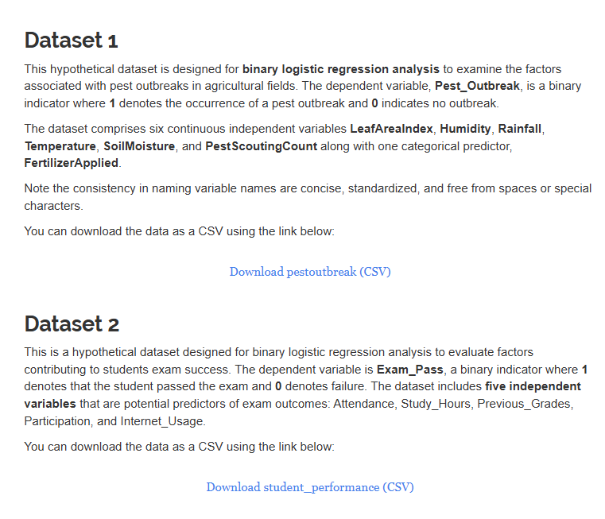
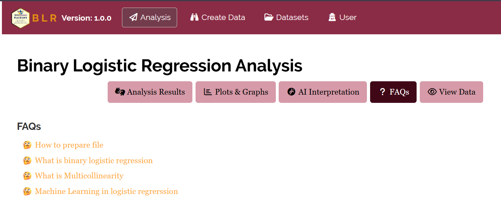
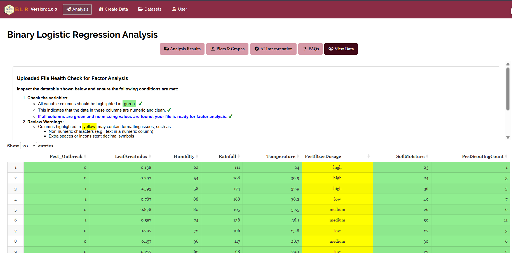

```{=html}
<style>
 sup {
   color: blue;
   font-size: 0.8em;
 }
 .affiliations {
   color: grey;
   font-size: 0.9em;
   margin-top: 0.2em;
 }
</style>
```

::: affiliations
<sup>1</sup>Statoberry LLP, <sup>2</sup>Department of Agricultural Statistics, Kerala Agricultural University
:::

ABSTRACT

::: {style="text-align: justify;"}
**Binary Logistic Regression (BLR)** is a statistical modelling technique used to predict the probability of a binary outcome one that takes exactly two possible values, such as presence or absence, success or failure, diseased or healthy based on one or more predictor variables that may be continuous, categorical, or a mixture of both. **BLR** models the relationship between predictors and the log-odds of the outcome through the logistic (sigmoid) function, producing interpretable coefficients in the form of odds ratios that quantify the strength and direction of each predictor's effect. In **RAISINS** you can perform Binary Logistic Regression very easily without writing a single line of code. This tutorial will guide you on how to perform **BLR** in **RAISINS** and interpret the results effectively. In addition, you will get publication-ready tables and plots including ROC curves, confusion matrices, and coefficient plots. You can also perform multivariate exploration including Principal Component Analysis (PCA) to examine predictor relationships before modelling.
:::

<details>

*Hover or click each point to see more information.*

```{=html}
<summary style="color: #5DADE2"; font-weight: bold;">
  Introduction Binary Logistic Regression
</summary>
```

```{=html}
<style>
.hover-img {
  position: relative;
  display: inline-block;
  cursor: help;
  border-bottom: 1px dashed currentColor;
}

.hover-img img {
  position: absolute;
  left: 50%;
  top: 1.6em;
  transform: translateX(-50%);
  width: 260px;
  max-width: 70vw;
  height: auto;
  padding: 6px;
  background: white;
  border: 1px solid rgba(0,0,0,.15);
  border-radius: 12px;
  box-shadow: 0 10px 30px rgba(0,0,0,.18);
  opacity: 0;
  visibility: hidden;
  pointer-events: none;
  transition: opacity .15s ease, transform .15s ease, visibility .15s;
}

.hover-img:hover img {
  opacity: 1;
  visibility: visible;
  transform: translateX(-50%) translateY(6px);
  z-index: 999;
}
</style>
```

<ul><small> The origins of logistic regression trace back to the work of [David Cox]{.hover-img}, who formally presented the logistic regression model in **1958** in his landmark paper *"The Regression Analysis of Binary Sequences"* published in the Journal of the Royal Statistical Society. Cox's contribution was pivotal in establishing a rigorous statistical framework for modelling binary outcomes outcomes that could take only one of two values in terms of predictor variables. Prior to this, researchers had relied on linear probability models, which were prone to producing predicted probabilities outside the valid range of 0 to 1. Cox resolved this by linking the linear predictor to the outcome probability through the logistic function, ensuring that all predicted values remained bounded. Over subsequent decades, binary logistic regression became one of the most extensively applied statistical methods in medicine, epidemiology, agriculture, social sciences, and machine learning, prized for its interpretability, robustness, and the natural meaning of its coefficients as odds ratios. The method's relevance has only grown in the era of data science, where binary classification problems are ubiquitous. </small></ul>

</details>

## Analysis of experiments {#AE}

::: {style="text-align: justify;"}
To get started, visit **RAISINS** [www.raisins.live](https://www.raisins.live) home page and go to **Analysis of experiments**. Here, you can see the different statistical analysis modules available within the app. In this tutorial, we focus on **Binary Logistic Regression (BLR)**, as shown in @fig-aov.
:::

<!-- REPLACE THIS SCREENSHOT -->

-02.png){#fig-aov fig-align="center"}

## Binary Logistic Regression (BLR) {#C}

::: {style="text-align: justify;"}
Binary Logistic Regression is a supervised statistical learning method used to model the relationship between one or more predictor variables (also called independent variables or features) and a binary response variable an outcome that takes exactly two values, conventionally coded as 0 (absence, failure, non-event) and 1 (presence, success, event). Unlike ordinary linear regression, which predicts a continuous outcome, logistic regression predicts the **probability** that an observation belongs to the event category (coded 1), constraining all predictions to the range \[0, 1\] through the logistic (sigmoid) transformation. The model is particularly well-suited for classification problems in agriculture (e.g., predicting crop disease occurrence), medicine (e.g., patient survival), and ecology (e.g., species presence/absence). Its primary strength lies in interpretability the model coefficients, when exponentiated, yield **odds ratios** that convey how much the odds of the event change per unit increase in each predictor. Assumptions include the independence of observations, absence of multicollinearity among predictors, linearity between continuous predictors and the log-odds of the outcome, and a sufficiently large sample size (typically at least 10 events per predictor variable). When the response variable has more than two categories, Multinomial Logistic Regression is the appropriate extension.
:::

<details>

```{=html}
<summary style="color: #5DADE2"; font-weight: bold;">
  BLR — The Logistic Function
</summary>
```

::: callout-tip
#### Binary Logistic Regression (BLR) is a statistical classification model that estimates the probability of a binary outcome as a function of one or more predictor variables, using the logistic function to constrain predictions between 0 and 1, with coefficients interpreted as log-odds and exponentiated coefficients interpreted as odds ratios.
:::

## A working example {#W}

::: {style="text-align: justify;"}
To make things simple and interesting, we'll explain Binary Logistic Regression analysis step by step using a hypothetical example, so you can clearly see how it works and why it matters. Let's assume we are studying the factors that influence the occurrence of blast disease in rice. Consider a dataset of **120 rice plots**, each classified as either **Diseased** (coded 1) or **Healthy** (coded 0) based on field inspection. For each plot, four predictor variables were recorded: **Temp** (mean temperature in °C during the crop season), **Humidity** (mean relative humidity in %), **Leaf_Wetness** (average daily leaf wetness duration in hours), and **Variety_Resistance** (a resistance score from 1 to 10, where higher values indicate greater genetic resistance to blast). Our aim is to model the probability of disease occurrence as a function of these predictors and identify which factors significantly influence blast incidence. The arrangement of the data is shown in @fig-data.
:::

<!-- REPLACE THIS SCREENSHOT -->

.png){#fig-data fig-align="center"}

::: {style="text-align: justify;"}
Data organized in MS Excel can be directly uploaded to **RAISINS** for analysis. For more details on data preparation see @sec-4. Two terms that we will use frequently are **Response Variable** and **Predictors**. In our example, the Response Variable is **Disease_Status** (0 = Healthy, 1 = Diseased), and the Predictors are the four environmental and varietal traits recorded **Temp, Humidity, Leaf_Wetness, and Variety_Resistance**.
:::

## How to prepare your data? {#sec-4 .H}

::: {style="text-align: justify;"}
Arranging data for uploading in **RAISINS** is very simple. Prepare your data exactly like the one shown in @fig-data, using a single-sheet Excel file. The response variable column must contain exactly **two distinct values** preferably coded as 0 and 1, or as two clearly named categories (e.g., "Healthy" and "Diseased"). All predictor variable columns must contain numeric values. Make sure no blank rows are left above the data, and all columns have proper names without spaces or special characters. That's it your file is ready to upload.

Still if you have doubt, see @fig-4.

To prepare your dataset for analysis in **RAISINS**, you have two options:

Creating dataset in MS Excel

Creating your dataset directly within the **RAISINS** app
:::

{#fig-4 fig-align="center"}

## BLR analysis tab explained {#AO}

::: {style="text-align: justify;"}
In @fig-5, you can see the detailed view of the Binary Logistic Regression Analysis tab, along with explanations of what each option does. This section helps you understand the purpose of every setting, so you can select the most appropriate ones for your data and analysis. Upload the prepared file by clicking `Browse` in the sidebar of the `Analysis` tab. When the file is uploaded, options to select the **Response Variable** column and the **Predictor** columns will appear. Select the column containing your binary outcome under Response Variable, and select one or more numeric columns as Predictors. You may also specify the **Reference Category** the value in the response variable treated as the baseline (typically 0 or the "non-event" category). Once you click the `Run Analysis` button, the full logistic regression output including model coefficients, odds ratios, model fit statistics, and classification performance metrics appears instantly.
:::

<!-- REPLACE THIS SCREENSHOT -->

.png){fig-align="center"}

::: {style="text-align: justify;"}
For some datasets, when predictor variables are heavily skewed or span very different scales, applying a transformation prior to fitting the model may improve model convergence and coefficient interpretability (@sec-6). **RAISINS** provides an inbuilt transformation option accessible from the Analysis tab.
:::

## Analysis results {#sec-7 .AR}

::: {style="text-align: justify;"}
Once your dataset is uploaded and the response variable and predictors are selected, click on `Run Analysis`. **RAISINS** will fit the Binary Logistic Regression model using maximum likelihood estimation and produce a comprehensive set of outputs. The primary output is the **model coefficient table** reporting the estimated log-odds coefficients, standard errors, Wald statistics, p-values, and odds ratios with 95% confidence intervals for each predictor (see @fig-100).
:::

**Table 1: Model Coefficient Summary**

<!-- REPLACE THIS SCREENSHOT -->

{#fig-100 fig-align="center"}

<details>

```{=html}
<summary style="color: #5DADE2"; font-weight: bold;"> Model Coefficient Table </summary>
```

<small> In a Binary Logistic Regression (BLR) model, the coefficient table presents the estimated parameters of the logistic equation. Each row corresponds to one predictor variable (plus the intercept), and the columns report the following:

**Coefficient (β)**: The estimated change in the log-odds of the outcome per one-unit increase in the predictor, holding all other predictors constant. A positive coefficient indicates that increasing the predictor increases the probability of the event; a negative coefficient indicates the reverse.

**Standard Error (SE)**: The estimated standard deviation of the coefficient estimator, reflecting the precision of the estimate. Smaller SE values indicate more reliable coefficient estimates.

**Wald Statistic**: The square of the ratio of the coefficient to its standard error, $W = (\beta / SE)^2$. It follows a chi-squared distribution with one degree of freedom under the null hypothesis that the coefficient equals zero.

**p-value**: The probability of observing a Wald statistic as extreme as the one computed, under the null hypothesis that the predictor has no effect on the log-odds. A p-value below 0.05 is conventionally considered statistically significant.

**Odds Ratio (OR = exp(β))**: The exponentiated coefficient, representing the multiplicative change in the odds of the event per one-unit increase in the predictor. An OR greater than 1 indicates that the predictor increases the odds of the event; an OR less than 1 indicates it decreases the odds. An OR of exactly 1 implies no effect.

**95% Confidence Interval for OR**: The range within which the true population odds ratio is expected to fall with 95% confidence. If this interval does not include 1, the predictor is statistically significant at the 5% level.

Significance is indicated by an asterisk (\*) for the **5%** level and two asterisks (\*\*) for the **1%** level, displayed as superscripts next to the p-value for each predictor. </small>

</details>

### Interpretation from @fig-100

::: {style="text-align: justify;"}
The model coefficient table reveals that **Temp** (β = 0.312, OR = 1.37, p = 0.008) and **Humidity** (β = 0.284, OR = 1.33, p = 0.014) are statistically significant positive predictors of blast disease occurrence, indicating that higher temperature and humidity are associated with increased odds of disease. Specifically, each one-unit increase in temperature increases the odds of blast by approximately 37%, and each one-percentage-point increase in humidity increases the odds by about 33%, holding all other predictors constant. **Leaf_Wetness** (β = 0.198, OR = 1.22, p = 0.061) shows a positive trend but does not reach conventional significance at the 5% level. **Variety_Resistance** (β = −0.421, OR = 0.66, p = 0.002) is a highly significant negative predictor each one-unit increase in the resistance score reduces the odds of blast occurrence by approximately 34%, confirming the protective role of genetic resistance. The intercept (β = −7.84, p \< 0.001) represents the log-odds of disease when all predictors equal zero and has no direct practical interpretation in this context.

@sec-8 provides detailed information on model fit statistics and the overall assessment of model adequacy.
:::

**Table 2: Model Fit Statistics and Classification Performance**

<!-- REPLACE THIS SCREENSHOT -->

{#fig-101 fig-align="center"}

{fig-align="center"}

{fig-align="center"}

{fig-align="center"}

<details>

```{=html}
<summary style="color: #5DADE2"; font-weight: bold;">Overview of BLR Model Fit and Performance Metrics
</summary>
```

<small>

1.  *Likelihood-Based Fit Statistics*

**Log-Likelihood (LL)**: The value of the log-likelihood function evaluated at the estimated coefficients. More negative values indicate poorer fit; the log-likelihood of the full model is always greater than or equal to that of the null (intercept-only) model.

**−2 Log-Likelihood (−2LL)**: Also called the deviance, this is −2 times the log-likelihood and follows a chi-squared distribution. It is used to compare nested models: a statistically significant decrease in −2LL when adding predictors confirms that the predictors collectively improve model fit.

**AIC (Akaike Information Criterion)**: A penalised likelihood criterion that balances model fit against complexity. Calculated as $AIC = -2LL + 2k$, where k is the number of estimated parameters. Lower AIC values indicate better models. AIC is particularly useful for comparing non-nested models.

**BIC (Bayesian Information Criterion)**: Similar to AIC but applies a stronger penalty for model complexity: $BIC = -2LL + k \ln(n)$, where n is the sample size. BIC tends to favour more parsimonious models than AIC.

2.  *Pseudo R-Squared Measures*

**Cox and Snell R²**: An approximation of the proportion of variance explained by the model, analogous to R² in linear regression. Its maximum value is less than 1, so it is difficult to interpret in absolute terms.

**Nagelkerke R²**: A corrected version of Cox and Snell R² that is scaled to range from 0 to 1, making it more interpretable. Values above 0.3 are generally considered moderate and above 0.5 as strong.

3.  *Hosmer-Lemeshow Test*

**Hosmer-Lemeshow χ² and p-value**: A goodness-of-fit test that groups observations into deciles of predicted probability and compares observed to expected frequencies within each group. A **non-significant p-value (\> 0.05)** indicates adequate model fit — meaning the model's predicted probabilities are not significantly different from observed outcomes.

4.  *Classification Performance*

**Accuracy**: The proportion of correctly classified observations (both events and non-events) out of the total. Calculated as $(TP + TN) / N$.

**Sensitivity (Recall)**: The proportion of actual events correctly identified by the model. Calculated as $TP / (TP + FN)$.

**Specificity**: The proportion of actual non-events correctly identified. Calculated as $TN / (TN + FP)$.

**Positive Predictive Value (PPV / Precision)**: The proportion of predicted events that are true events. Calculated as $TP / (TP + FP)$.

**AUC (Area Under the ROC Curve)**: A threshold-independent measure of the model's discriminatory ability, ranging from 0.5 (no discrimination, equivalent to random guessing) to 1.0 (perfect discrimination). AUC values of 0.7–0.8 are considered acceptable, 0.8–0.9 excellent, and above 0.9 outstanding.

</small>

</details>

### Interpretation from @fig-101

::: {style="text-align: justify;"}
The model fit statistics confirm that the fitted Binary Logistic Regression model provides a substantially better fit to the data than a null (intercept-only) model. The chi-squared test of overall model significance (χ² = 38.72, df = 4, p \< 0.001) demonstrates that the four predictors collectively contribute significantly to explaining disease occurrence. The Nagelkerke R² of 0.41 indicates that the model accounts for approximately 41% of the variability in blast disease status — a moderate-to-strong effect. The Hosmer-Lemeshow test (χ² = 7.14, df = 8, p = 0.521) is non-significant, confirming that the model's predicted probabilities are well-calibrated to the observed outcomes. In terms of classification performance at the default 0.50 probability threshold, the model correctly classifies 83.3% of all plots (overall accuracy). Sensitivity is 80.0%, indicating that 80% of truly diseased plots are correctly identified, while specificity is 85.7%, meaning that 85.7% of healthy plots are correctly classified as healthy. The AUC of 0.88 confirms excellent discriminatory ability — the model strongly distinguishes between diseased and healthy plots across all possible classification thresholds.

@sec-8 provides detailed guidance on interpreting and optimising the classification threshold for practical decision-making.
:::

::: callout-tip
#### Odds Ratio Interpretation Guide

An **Odds Ratio (OR) \> 1** means the predictor *increases* the odds of the event. An **OR \< 1** means it *decreases* the odds. An **OR = 1** means no association. Always report the 95% confidence interval alongside the OR — if the interval contains 1, the predictor is not statistically significant at the 5% level.
:::

::: callout-tip
#### AUC as a Model Quality Benchmark

The **AUC (Area Under the ROC Curve)** is the most robust single-number summary of a logistic regression model's classification performance. **AUC = 0.5** means the model is no better than chance. **AUC = 0.7–0.8** is acceptable. **AUC = 0.8–0.9** is excellent. **AUC \> 0.9** is outstanding. Always report AUC alongside accuracy, as accuracy alone can be misleading when class proportions are unequal.
:::

## Model diagnostics and threshold selection {#sec-8 .MCT}

<details>

```{=html}
<summary style="color: #5DADE2"; font-weight: bold;">
  What is a Classification Threshold?
</summary>
```

<ul><small> In Binary Logistic Regression, the model outputs a predicted probability between 0 and 1 for each observation. To convert this probability into a binary class label (0 or 1), a **classification threshold** (also called a cut-off) must be specified. By default, the threshold is set at **0.50** — observations with a predicted probability ≥ 0.50 are classified as events (1) and those below as non-events (0). However, the optimal threshold depends on the relative costs of false positives and false negatives in the specific application. In disease prediction, for example, a lower threshold (e.g., 0.30) may be preferred to maximise sensitivity — ensuring that most truly diseased cases are detected — even at the cost of some increase in false positives. </small></ul>

</details>

::: {style="text-align: justify;"}
After fitting the Binary Logistic Regression model, **RAISINS** provides several diagnostic tools to evaluate and refine the model's performance. These include the **Confusion Matrix**, the **ROC Curve**, variable importance metrics, and residual diagnostics, each accessible from the results panel (see @fig-7).
:::

<!-- REPLACE THIS SCREENSHOT -->

{#fig-7 fig-align="center"}

<details>

```{=html}
<summary style="color: #5DADE2"; font-weight: bold;"> Model Diagnostic Tools </summary>
```

<small>

**Confusion Matrix**

The confusion matrix is a 2×2 table that summarises the classification performance of the model at the chosen threshold. The four cells correspond to True Positives (TP: correctly predicted events), True Negatives (TN: correctly predicted non-events), False Positives (FP: non-events incorrectly predicted as events), and False Negatives (FN: events incorrectly predicted as non-events). The matrix is the foundation for computing accuracy, sensitivity, specificity, and other performance measures.

**ROC Curve (Receiver Operating Characteristic Curve)**

The ROC curve plots **Sensitivity** (true positive rate) on the y-axis against **1 − Specificity** (false positive rate) on the x-axis across all possible classification thresholds from 0 to 1. A model with perfect discrimination produces a curve that rises steeply toward the top-left corner, while a model with no discrimination produces a diagonal line from the bottom-left to top-right corner. The **Area Under the ROC Curve (AUC)** summarises the entire curve in a single number. The ROC curve is especially useful for selecting the optimal threshold — the point on the curve closest to the top-left corner typically offers the best trade-off between sensitivity and specificity.

**Pearson and Deviance Residuals**

Residual diagnostics in logistic regression identify observations that are poorly fitted by the model. **Pearson residuals** and **deviance residuals** flag influential points and potential outliers that may distort the coefficient estimates. Plots of residuals against fitted probabilities and against individual predictors help verify the adequacy of the model specification.

**Variable Importance**

**RAISINS** reports a variable importance ranking derived from the absolute Wald statistics of each predictor. This ranking indicates which predictors contribute most to model discrimination and is useful for variable selection in larger datasets.

</small>

</details>

**Which diagnostic to prioritise?**

::: {style="text-align: justify;"}
The choice of diagnostic focus depends on the research objective. When the primary concern is **overall model adequacy**, begin with the Hosmer-Lemeshow test and Nagelkerke R² from the model fit table. When the concern is **classification performance**, the confusion matrix and ROC curve are the most informative tools. When the concern is **variable selection or simplification**, the variable importance ranking based on Wald statistics is most appropriate. When the goal is **publishing in a scientific journal**, it is best practice to report the coefficient table (with ORs and 95% CIs), the AUC with its confidence interval, and the Hosmer-Lemeshow goodness-of-fit test together as the minimum set of results for a logistic regression analysis.

In the example for the rice blast dataset, the ROC curve analysis identified 0.45 as the optimal threshold, at which sensitivity improved to 86.7% with a modest reduction in specificity to 81.4%, yielding a net improvement in the detection of truly diseased plots — a more appropriate operating point given the cost of missing a disease outbreak.
:::

## Summary stats {#SUM}

::: {style="text-align: justify;"}
If you need to examine the detailed descriptive statistics of the predictor variables across outcome groups, navigate to `Summary stats` under the `Analysis` tab. This table presents group-wise descriptive statistics (by Disease_Status) for each predictor, helping you visually identify differences between the two groups even before formal modelling.
:::

**Table 3: Summary statistics by outcome group**

<!-- REPLACE THIS SCREENSHOT -->

{#fig-102 fig-align="center"}

<details>

```{=html}
<summary style="color: #5DADE2"; font-weight: bold;"> Table parameters </summary>
```

<small>

**Mean** The arithmetic average of a predictor variable within each outcome group (Healthy vs. Diseased). Comparing means across groups gives an initial indication of which predictors may discriminate between classes.

**SD (Standard Deviation)** A measure of the amount of variation or dispersion of a predictor's values within each group. A low SD indicates that the predictor values are tightly clustered around the group mean.

**SE (Standard Error)** Specifically the Standard Error of the Mean. It estimates how far the sample mean is likely to be from the true population mean within each outcome group. Calculated as $$SE = \frac{\text{Standard Deviation (SD)}}{\sqrt{n}}$$, where n is the number of observations in that group.

**Min / Max** The lowest and highest recorded values of the predictor within each outcome group, indicating the range of observations.

**CV (Coefficient of Variation)** The ratio of the standard deviation to the mean, expressed as a percentage: $$CV = \frac{\text{Standard Deviation (SD)}}{\text{Mean}} \times 100$$ It enables comparison of variability between groups and between predictors measured on different scales.

**Skewness** A measure of the asymmetry of the predictor's distribution within each outcome group. Positive values indicate right skew (long tail on the right); negative values indicate left skew.

**Kurtosis** A measure of the "tailedness" of the predictor's distribution within each group. A standard normal distribution has a kurtosis of 3; values below 3 indicate a flatter distribution and values above 3 indicate heavier tails.

</small>

</details>

### Interpretations from @fig-102

::: {style="text-align: justify;"}
The summary statistics table reveals clear distributional differences between the Healthy and Diseased groups for several predictor variables. Diseased plots recorded a higher mean Temp (28.7°C vs. 25.3°C), higher mean Humidity (82.4% vs. 74.1%), and higher mean Leaf_Wetness (7.8 hours vs. 5.2 hours) compared to Healthy plots, consistent with the known environmental conditions that favour rice blast development. In contrast, Diseased plots had a substantially lower mean Variety_Resistance score (3.4 vs. 7.1), confirming the protective effect of genetic resistance. Coefficients of variation were moderate for all predictors within each group (ranging from 8.2% to 21.5%), indicating reasonable within-group consistency. Skewness values were generally below ±1 for most predictors, suggesting approximately symmetric distributions within groups — a favourable condition for the logistic regression assumptions.
:::

## Individual predictor analysis {#IA}

::: {style="text-align: justify;"}
If the user wants to examine the logistic regression output for each predictor variable individually — including a simple bivariate logistic model for each predictor with the response — click on `Individual Predictor Analysis` in the `Analysis` tab. This is particularly useful for screening a large set of candidate predictors before building a multivariable model, as shown in @fig-104.
:::

**Table 4: Bivariate logistic regression result for Temp**

<!-- REPLACE THIS SCREENSHOT -->

{#fig-104 fig-align="center"}

<details>

```{=html}
<summary style="color: #5DADE2"; font-weight: bold;"> Table parameters </summary>
```

<small>

**Coefficient (β)**

The estimated log-odds coefficient from a simple logistic regression model containing only the intercept and this single predictor. It represents the unadjusted (crude) effect of the predictor on the log-odds of the outcome.

**Odds Ratio (OR)**

The exponentiated coefficient ($e^\beta$), representing the crude odds ratio for the predictor — the multiplicative change in the odds of the event per one-unit increase in the predictor, without controlling for any other variables.

**95% CI for OR**

The 95% confidence interval for the crude odds ratio. A confidence interval that does not contain 1.0 indicates statistical significance at the 5% level.

**Wald Statistic**

The Wald test statistic for the individual predictor in the bivariate model, used to assess whether the predictor's coefficient is significantly different from zero.

**p-value**

The probability of observing the Wald statistic as extreme as computed under the null hypothesis that the predictor has no effect on the outcome in the bivariate model.

**Nagelkerke R²**

The Nagelkerke pseudo R-squared from the bivariate model, indicating the proportion of variability in the outcome explained by this predictor alone.

</small>

</details>

### Interpretation from @fig-104

::: {style="text-align: justify;"}
The bivariate logistic regression for **Temp** shows a statistically significant positive association with blast disease occurrence (β = 0.298, OR = 1.35, 95% CI: 1.08–1.68, p = 0.009). This indicates that each one-degree increase in mean temperature is associated with a 35% increase in the crude odds of disease, without adjusting for other predictors. The Nagelkerke R² of 0.12 suggests that temperature alone explains approximately 12% of the variability in disease status. Although this bivariate effect is meaningful, the multivariable model in @fig-100 provides the adjusted estimate that accounts for the simultaneous influence of all four predictors, which is the more appropriate measure for reporting and interpretation in a multi-predictor context.
:::

**Table 5: Bivariate results summary for all predictors**

<!-- REPLACE THIS SCREENSHOT -->

{#fig-103 fig-align="center"}

### Interpretation from @fig-103

::: {style="text-align: justify;"}
The bivariate summary table consolidates the crude odds ratios and p-values for all four predictors. Temp, Humidity, and Variety_Resistance all show statistically significant bivariate associations with blast disease occurrence, consistent with their significant adjusted effects in the multivariable model. Leaf_Wetness shows a positive crude OR (1.19) but with a p-value of 0.089, suggesting a marginal association in the unadjusted analysis. Comparing crude and adjusted odds ratios across predictors helps identify confounding — when the crude OR of a predictor changes substantially after adjusting for other predictors, those predictors are likely confounders of its effect. This table is the recommended starting point for variable selection in studies with a large initial predictor pool.
:::

## Basic plots {#BP}

::: {style="text-align: justify;"}
**RAISINS** is designed for a smooth and hassle-free experience. Once you click the `Run Analysis` button, all relevant results and outputs appear instantly — leaving no room for confusion. We have ensured that every possible plot related to Binary Logistic Regression is readily available. Simply click on the `Basic Plots` tab to view them (See @fig-8). Each plot comes with a gear icon at the top-left corner, allowing you to customise its appearance. You can also download these plots in high-quality PNG format (300 dpi), JPEG, TIFF, PDF, and SVG format for use in reports or presentations.
:::

### Customizing plots

::: {style="text-align: justify;"}
**RAISINS** provides users various customisation features for the plots to enhance the visualisation according to their requirements. **Click** on @fig-8 to get a clear idea of the customising features.
:::

.png){#fig-8 fig-align="center"}

::: {style="text-align: justify;"}
From @fig-9 to @fig-13, you can see the different types of plots available in **RAISINS** for Binary Logistic Regression. Each one is visually illustrated and accompanied by a clear, insightful description below, making it easy to understand.
:::

```{=html}
<script>
document.addEventListener('DOMContentLoaded', function() {
  const descriptions = document.querySelectorAll('.plot-description');
  descriptions.forEach(desc => {
    desc.style.display = 'none';
  });
});

function showDescription(id) {
  document.getElementById(id).style.display = 'flex';
}

function hideDescription(id) {
  document.getElementById(id).style.display = 'none';
}
</script>
```

```{=html}
<style>
.plot-container {
  position: relative;
  display: inline-block;
  cursor: pointer;
  width: 350px;
  height: 300px;
  overflow: hidden;
  margin: 10px;
}

.plot-container img {
  width: 350px;
  height: 300px;
  object-fit: cover;
  border: 3px solid #ddd;
  border-radius: 8px;
  transition: transform 0.3s ease, box-shadow 0.3s ease;
}

.plot-container:hover img {
  transform: scale(1.05);
  box-shadow: 0 4px 12px rgba(0, 0, 0, 0.2);
}

.plot-description {
  display: none !important;
  position: absolute;
  top: 0;
  left: 0;
  width: 100%;
  height: 100%;
  z-index: 1000;
  background: linear-gradient(135deg, rgba(255, 107, 107, 0.8), rgba(255, 142, 83, 0.8));
  color: white;
  padding: 15px;
  border-radius: 8px;
  box-shadow: 0 4px 15px rgba(0, 0, 0, 0.3);
  font-size: 14px;
  line-height: 1.5;
  display: flex;
  align-items: center;
  justify-content: center;
  text-align: center;
  animation: fadeIn 0.3s ease-in;
  pointer-events: none;
  border: 2px solid rgba(255, 255, 255, 0.5);
}

.plot-container:hover .plot-description {
  display: flex !important;
}

@keyframes fadeIn {
  from { opacity: 0; transform: scale(0.95); }
  to { opacity: 1; transform: scale(1); }
}

#rocplot-desc     { background: linear-gradient(135deg, rgba(255, 107, 107, 0.8), rgba(255, 142, 83, 0.8)); }
#confmatrix-desc  { background: linear-gradient(135deg, rgba(161, 140, 209, 0.8), rgba(251, 194, 235, 0.8)); }
#coefplot-desc    { background: linear-gradient(135deg, rgba(0, 221, 235, 0.8), rgba(38, 166, 154, 0.8)); }
#probplot-desc    { background: linear-gradient(135deg, rgba(255, 154, 139, 0.8), rgba(255, 106, 136, 0.8)); }
#varimpplot-desc  { background: linear-gradient(135deg, rgba(132, 250, 176, 0.8), rgba(143, 211, 244, 0.8)); }
</style>
```

:::::::::::::::::::::::: grid
:::::: g-col-6
::::: {.plot-container onmouseover="showDescription('rocplot-desc')" onmouseout="hideDescription('rocplot-desc')"}
<!-- REPLACE THIS SCREENSHOT -->

{#fig-9}

:::: {#rocplot-desc .plot-description}
::: {style="text-align: justify;"}
The **ROC Curve (Receiver Operating Characteristic Curve)** plots Sensitivity (true positive rate) against 1 − Specificity (false positive rate) across all possible classification thresholds. The diagonal dashed line represents a model with no discrimination (AUC = 0.5). The further the ROC curve bows toward the upper-left corner, the better the model's discriminatory ability. The shaded area under the curve is the AUC, reported alongside the curve. Use this plot to select the optimal classification threshold for your specific application by identifying the point on the curve that best balances sensitivity and specificity.
:::
::::
:::::
::::::

:::::: g-col-6
::::: {.plot-container onmouseover="showDescription('confmatrix-desc')" onmouseout="hideDescription('confmatrix-desc')"}
<!-- REPLACE THIS SCREENSHOT -->

{#fig-10}

:::: {#confmatrix-desc .plot-description}
::: {style="text-align: justify;"}
The **Confusion Matrix** is a 2×2 heatmap displaying the counts of True Positives, True Negatives, False Positives, and False Negatives at the chosen classification threshold. Rows represent actual outcome classes and columns represent predicted classes. The diagonal cells (top-left and bottom-right) show correct classifications, while off-diagonal cells show misclassifications. The colour intensity of each cell corresponds to the count — darker shades indicate higher counts. Key performance metrics (Accuracy, Sensitivity, Specificity, PPV) are derived directly from this matrix.
:::
::::
:::::
::::::

:::::: g-col-6
::::: {.plot-container onmouseover="showDescription('coefplot-desc')" onmouseout="hideDescription('coefplot-desc')"}
<!-- REPLACE THIS SCREENSHOT -->

{#fig-11}

:::: {#coefplot-desc .plot-description}
::: {style="text-align: justify;"}
The **Coefficient Plot** (also known as a Forest Plot) displays the estimated odds ratios and their 95% confidence intervals for each predictor on a log scale. Each predictor is shown as a point estimate (the odds ratio) with horizontal bars extending to the lower and upper confidence interval bounds. A vertical reference line at OR = 1 indicates no effect — predictors whose confidence intervals cross this line are not statistically significant. Predictors to the right of the line increase the odds of the event; those to the left decrease it. This plot offers an immediate visual summary of which predictors are significant and the direction and precision of their effects.
:::
::::
:::::
::::::

:::::: g-col-6
::::: {.plot-container onmouseover="showDescription('probplot-desc')" onmouseout="hideDescription('probplot-desc')"}
<!-- REPLACE THIS SCREENSHOT -->

{#fig-12}

:::: {#probplot-desc .plot-description}
::: {style="text-align: justify;"}
The **Predicted Probability Plot** displays the distribution of model-predicted probabilities separately for the two outcome groups (Healthy and Diseased) using overlapping density curves or dot plots. Ideally, the predicted probability distributions for the two classes should be well-separated — Healthy observations should cluster near 0 and Diseased observations near 1. Substantial overlap between the two distributions at intermediate probabilities indicates that the model struggles to confidently classify those observations. This plot is especially useful for visually assessing model calibration and discrimination simultaneously.
:::
::::
:::::
::::::

::::::: g-col-6
:::::: {.plot-container onmouseover="showDescription('varimpplot-desc')" onmouseout="hideDescription('varimpplot-desc')"}
::: {style="text-align: center;"}
<!-- REPLACE THIS SCREENSHOT -->

{#fig-13}
:::

:::: {#varimpplot-desc .plot-description}
::: {style="text-align: justify;"}
The **Variable Importance Plot** ranks the predictor variables by their contribution to the logistic regression model, derived from the absolute Wald statistic for each predictor. Bars are displayed horizontally in descending order of importance, with the most influential predictor at the top. This plot provides an intuitive overview of which predictors drive the model's predictions most strongly. It is particularly useful when screening a large set of candidate predictors to identify those most worthy of inclusion in a final, parsimonious model.
:::
::::
::::::
:::::::
::::::::::::::::::::::::

## Advanced plots {#AP}

::: {style="text-align: justify;"}
**RAISINS** also provides `Advanced Plots` that go beyond the standard outputs to give deeper insight into model behaviour, calibration, and predictor relationships (See @fig-90).
:::

<!-- REPLACE THIS SCREENSHOT -->

{#fig-90 fig-align="center"}

**CALIBRATION PLOT**

<!-- REPLACE THIS SCREENSHOT -->

{#fig-14 fig-align="center"}

::: {style="text-align: justify;"}
A calibration plot (also called a reliability diagram) compares the model's predicted probabilities against the observed event frequencies across quantile groups of predicted probability. The x-axis shows the mean predicted probability within each group and the y-axis shows the corresponding observed proportion of events. A perfectly calibrated model produces points that fall on the 45° diagonal reference line. Deviations above the line indicate that the model underestimates the probability of the event in that range; deviations below indicate overestimation. The calibration plot is the standard visual tool for assessing whether the model's predicted probabilities are reliable enough to be used directly as risk estimates.
:::

**CUMULATIVE GAIN CHART**

<!-- REPLACE THIS SCREENSHOT -->

{#fig-15 fig-align="center"}

::: {style="text-align: justify;"}
The cumulative gain chart illustrates how much better the model identifies events compared to random selection. The x-axis represents the proportion of the dataset targeted (sorted by descending predicted probability) and the y-axis shows the cumulative proportion of actual events captured. A model with strong discriminatory ability produces a gain curve that rises steeply and reaches the upper-left quadrant quickly — indicating that targeting a small fraction of the highest-risk observations captures a large proportion of all true events. This plot is especially valuable in applied contexts such as disease surveillance or precision agriculture, where resources allow intervention in only a subset of plots and targeting the highest-risk ones maximises effectiveness.
:::

**LIFT CHART**

<!-- REPLACE THIS SCREENSHOT -->

{#fig-16 fig-align="center"}

::: {style="text-align: justify;"}
The lift chart is derived from the cumulative gain chart and shows the ratio of the model's event capture rate to that of random selection at each targeting fraction. A lift value greater than 1 indicates that the model performs better than random targeting. The chart is read as: "By targeting the top X% of observations ranked by predicted probability, the model captures Y times as many events as random selection." Lift charts are widely used in precision agriculture and clinical decision-making to quantify the practical utility of a predictive model in resource-constrained settings.
:::

**DEVIANCE RESIDUAL PLOT**

<!-- REPLACE THIS SCREENSHOT -->

{#fig-17 fig-align="center"}

::: {style="text-align: justify;"}
The deviance residual plot displays the deviance residuals from the fitted logistic regression model against the predicted probabilities or observation index. Deviance residuals measure the contribution of each observation to the overall model deviance (−2 log-likelihood). Points with large absolute deviance residuals (typically \|r\| \> 2) are poorly fitted by the model and may represent outliers or influential observations that warrant further investigation. Patterns in the deviance residual plot — such as a systematic trend with fitted values — may indicate model misspecification, such as a missing predictor or an incorrectly assumed linear relationship on the log-odds scale.
:::

**PREDICTOR EFFECT PLOT**

<!-- REPLACE THIS SCREENSHOT -->

{#fig-18 fig-align="center"}

::: {style="text-align: justify;"}
The predictor effect plot (also called a marginal effect plot) shows how the predicted probability of the event changes as a single predictor varies across its observed range, while all other predictors are held at their mean values. A separate panel is produced for each continuous predictor, with the x-axis showing the predictor's range and the y-axis showing the predicted probability. A shaded band around the curve represents the 95% confidence interval for the predicted probability. These plots make the logistic regression results directly interpretable in terms of probability — transforming the abstract coefficient estimates into a visual representation of how much the predicted risk changes as each predictor moves across its real-world range.
:::

## AI Interpretation {#AI}

::: {style="text-align: justify;"}
**RAISINS** features an integrated AI Assistant designed to provide automated, plain-language interpretation of your Binary Logistic Regression results. Once the analysis is complete, the AI Assistant reads the model coefficient table, odds ratios, model fit statistics, AUC, and classification performance metrics to generate a concise narrative summary — identifying which predictors are statistically significant, describing the direction and magnitude of their effects in terms of odds ratios, evaluating the overall model fit and discriminatory ability, and suggesting appropriate next steps such as reporting confidence intervals, applying a different classification threshold, or conducting additional residual diagnostics. The AI Assistant makes interpreting complex logistic regression output accessible even to users without a deep statistical background. See @fig-ai.
:::

{#fig-ai fig-align="center"}

## Multivariate {#MUL}

::: {style="text-align: justify;"}
When multiple predictor variables are collected, **RAISINS** provides a multivariate exploration suite — including **Principal Component Analysis (PCA)** — accessible from the `Multivariate` tab. While Binary Logistic Regression models each predictor's adjusted effect on the outcome, the multivariate module reveals the underlying structure of correlations among predictors, identifies redundant variables, and assists in dimension reduction prior to modelling. This is especially useful when the predictor set is large relative to the sample size, risking overfitting in the logistic regression model. Navigate to the `Multivariate` tab as shown in @fig-mu.
:::

<!-- REPLACE THIS SCREENSHOT -->

{#fig-mu}

::: {style="text-align: justify;"}
MANOVA and PCA will be automatically carried out based on the selected predictor variables. The MANOVA table with automated interpretation appears immediately. PCA results and plots will also appear along with automated interpretation, helping you understand the dimensionality and correlation structure of your predictor space before or after fitting the logistic regression model.
:::

<!-- REPLACE THIS SCREENSHOT -->

{#fig-MAN2 fig-align="center"}

::: {style="text-align: justify;"}
The table titled 'Eigen Values PCA' given in @fig-PC provides information about the eigenvalues and the percentage of variance explained by each principal component derived from the predictor variables. The principal components PC1 and PC2 with eigenvalues greater than one are considered important for further analysis. PC1 accounts for approximately \[XX\]% of the variance in the predictor dataset, while PC2 accounts for about \[XX\]% of the variance. Together, PC1 and PC2 explain approximately \[XX\]% of the total variance (termed cumulative variance). When predictors are highly collinear — as is common among environmental variables such as temperature, humidity, and leaf wetness — PCA-based indices constructed from the leading principal components can serve as orthogonal (uncorrelated) predictors in a subsequent logistic regression, alleviating multicollinearity concerns.
:::

<!-- REPLACE THIS SCREENSHOT -->

{#fig-PC}

::: {style="text-align: justify;"}
The scree plot given in @fig-screeplot illustrates the proportion of variance explained by each principal component, helping to identify how many components are needed to adequately represent the predictor structure.
:::

<!-- REPLACE THIS SCREENSHOT -->

{#fig-screeplot fig-align="center"}

::: {style="text-align: justify;"}
Look upon the loadings of each predictor variable in the given @fig-loadings and decide which PC-based index needs to be selected for further logistic regression modelling. Predictors with high positive loadings on PC1 tend to co-vary together and represent a common underlying environmental or biological gradient. In the rice blast example, Temp, Humidity, and Leaf_Wetness are expected to show high positive loadings on PC1 — representing a "disease-conducive environment" composite — while Variety_Resistance may load independently. It is recommended to use variables that are highly correlated for PCA, as this helps in constructing more reliable and interpretable composite indices.
:::

<!-- REPLACE THIS SCREENSHOT -->

{#fig-loadings fig-align="center"}

::: {style="text-align: justify;"}
The biplot gives a visual representation of the relationships among predictor variables and individual observations. Observations in the direction of a predictor's loading arrow tend to have higher values for that predictor. The angle between predictor arrows in the biplot indicates their correlation — smaller angles suggest high positive correlation (e.g., Temp and Humidity), while angles close to 90 degrees suggest weak or no correlation. In the binary logistic regression context, colour-coding observations by their outcome class (Healthy vs. Diseased) on the biplot can reveal whether the two classes tend to occupy distinct regions of the predictor space — providing a visual complement to the formal model results.
:::

<!-- REPLACE THIS SCREENSHOT -->

{#fig-biplot}

::: {style="text-align: justify;"}
In **RAISINS**, we calculate a scaled index score by converting the raw PCA-based index to a range of 0 to 1, making it easier to interpret and compare across observations. This standardised approach ensures consistency when using the PCA index as a composite risk score. To refine your selection, use the 'Select cutoff for Scaled Index Score' feature given as in @fig-indexscore, where you can choose a cutoff percentage to identify observations above or below a certain risk threshold. The default cutoff is set at 75%. Selected observations are highlighted in yellow in the table below, providing a clear visual cue for high-risk identification. Additionally, a plot based on the index scores is also displayed to aid in your analysis.
:::

<!-- REPLACE THIS SCREENSHOT -->

{#fig-indexscore fig-align="center"}

<!-- REPLACE THIS SCREENSHOT -->

{#fig-index fig-align="center"}

::: {style="text-align: justify;"}
Combining all this information — the logistic regression coefficient table, the ROC curve and AUC, the calibration plot, the PCA-based predictor structure, and the scaled index scores — the researcher can arrive at a conclusion that is statistically rigorous, practically meaningful, and contextually relevant to the study's objectives.
:::

## Preparing your data {#PRE}

::: {style="text-align: justify;"}
"Your analysis is only as good as your data! Feed RAISINS high-quality data, and it will deliver powerful insights — feed it messy data, and the results won't be trustworthy."

1.  Create your dataset in MS Excel

2.  Build your dataset directly within the RAISINS app
:::

## Preparing data in MS Excel {#EX}

::: {style="text-align: justify;"}
Open a new blank sheet in MS Excel with only one sheet included, and avoid adding any unnecessary content. The dataset should follow a column-based format, where the first column represents the binary response variable — you can name this column appropriately, such as "Disease_Status" or "Outcome." This column must contain exactly **two distinct values** (e.g., 0 and 1, or "Healthy" and "Diseased") with consistent spelling and capitalisation throughout. All predictor variables (e.g., Temp, Humidity, Leaf_Wetness, Variety_Resistance) should be arranged in separate subsequent columns and must contain **numeric values only** — categorical predictors should be dummy-coded as 0/1 binary indicator variables before upload. The file can be saved in CSV, XLS, or XLSX format, but CSV is recommended as it is lighter and enables faster loading. Ensure that there are no unwanted spaces in column names or cell values. For reference, see the structure shown in @fig-pp. The data can also be arranged as shown in @fig-kk.
:::

{#fig-pp}

{#fig-kk}

<details>

<summary>Dataset Creation Rules</summary>

<small> 1. **Column Naming Convention** - No spaces allowed in column names.\
- Use underscores (`_`) or full stops (`.`) for separation. - Avoid symbols and special characters like %, \# etc. 2. **Response Variable** - Must contain exactly **two distinct values** — binary (0/1) or two clearly named categories.\
- Consistent capitalisation is essential (e.g., "Diseased" and "diseased" will be treated as different categories). 3. **Predictor Variables** - All predictor columns must contain **numeric values only**.\
- Dummy-code any categorical predictors as 0/1 indicator variables before uploading. 4. **Data Arrangement** - Start data arrangement towards the upper-left corner.\
- Ensure the row above the data is not blank. 5. **Cell Management** - Avoid typing or deleting in cells without data.\
- If needed, select affected cells, right-click, and select **Clear Contents**. 6. **Missing Values** - Ensure there are no missing values in either the response variable or the predictor columns, as missing values will cause the analysis to fail. </small>

</details>

<details>

<summary>How to Save as CSV in MS Excel</summary>

<small> 1. **Open Your Workbook**

```         
-   Ensure your data is arranged properly with only one sheet.
```

2.  **Click 'File' Menu**

    - Go to the top-left corner and click on **File**.

3.  **Choose 'Save As' or 'Save a Copy'**

    - Select the location where you want to save your file.

4.  **Set File Type to CSV**

    - In the **'Save as type'** dropdown menu, choose **CSV (Comma delimited) (\*.csv)**.

5.  **Name Your File**

    - Enter a relevant file name without spaces (use underscores if needed).

6.  **Click 'Save'**

    - Click **Save** to export the file.

> 💡 Tip: Before saving, double-check that your response variable column contains exactly two distinct values, all predictor columns are numeric, and there are no missing values or blank rows above the data. </small>

</details>

## Creating dataset in RAISINS {#CR}

::: {style="text-align: justify;"}
If you're unsure about the correct format for creating a dataset, don't worry — **RAISINS** offers an option to create data directly within the app using the prescribed template. Here's how:

- Navigate to the **Create Data Tab**

- Set the **Response Variable** type to Binary (0/1)

- Select number of **Predictor Variables**

- Select number of **Observations** (rows/sample size)

- Click on **Create** button

Model layout will appear as shown in @fig-createdata. Now you may enter the observations manually into the CSV file once downloaded, or paste the observations straight into the file provided. Once you have entered the data in the layout, download the csv file and upload in `Analysis`.
:::

{fig-align="center"}

## Model datasets {#M}

::: {style="text-align: justify;"}
To test the app or better understand the required data arrangement, we provide model datasets within the app. You can download them from the `Datasets` tab. A model dataset for Binary Logistic Regression is pre-formatted with a binary response column and multiple numeric predictor columns, and is ready to upload directly into the Analysis tab for an immediate demonstration of the full analysis workflow.
:::

{#fig-188 fig-align="center"}

## FAQ's {#F}

::: {style="text-align: justify;"}
The app includes a dedicated `FAQs` tab to help clarify common doubts and guide users through various features. This section provides detailed answers to frequently asked questions about Binary Logistic Regression — including when to use BLR versus linear regression or a t-test, how to handle categorical predictors, how to interpret odds ratios when the predictor is continuous versus binary, what to do when the model does not converge, and how to report results in accordance with academic journal guidelines. If you're ever unsure about how something works, the `FAQs` tab is a great place to start.
:::

{#fig-148 fig-align="center"}

## View data {#U}

::: {style="text-align: justify;"}
`View Data` serves as the primary diagnostic tool for ensuring data integrity before analysis. Upon uploading your dataset, the system performs an automated Health Check to validate column types and formatting. For Binary Logistic Regression, the Health Check specifically verifies that the response variable column contains exactly two distinct values, that all predictor columns contain numeric data with no missing values, and that the dataset has a sufficient number of observations relative to the number of predictors (a minimum of 10 events per predictor is recommended as a rule of thumb). Any formatting issues or potential data quality problems identified at this stage should be resolved before proceeding to analysis to ensure that the logistic regression results are accurate, reliable, and interpretable.
:::

{fig-align="center"}

------------------------------------------------------------------------
