------------------------------------------------------------------------

------------------------------------------------------------------------

--- title: "Completely Randomised Design" format: html:

mainfont: "Times New Roman" fontsize: 0.90em theme: cosmo toc: true lightbox: true number-sections: true number-depth: 3 number-offset: 1 toc-title: "\*\*TABLE OF CONTENTS\*\*" toc-depth: 3 linkcolor: "purple" citations-hover: true css: sty.css ---

```{=html}
<style>
 sup {
   color: blue;
   font-size: 0.8em;  /* smaller superscript */
 }
 .affiliations {
   color: grey;
   font-size: 0.9em;  /* one size smaller than normal */
   margin-top: 0.2em;
 }
</style>
```

::: affiliations
<sup>1</sup>Statoberry LLP, <sup>2</sup>Department of Agricultural Statistics, Kerala Agricultural University
:::

ABSTRACT

::: {style="text-align: justify;"}
Completely Randomized Design **(CRD)** is a basic experimental design for comparing treatments under homogeneous conditions. CRD assigns treatments randomly to experimental units, such as field plots or plants, ensuring each unit has an equal chance of receiving any treatment. In **RAISINS** you can perform CRD very easily without writing a single line of code. This tutorial will guide you, how to perform CRD very easily in **RAISINS** and interpret the results effectively. In addition, you will get tables and plots ready for publication. You can also perform a multivariate analysis including MANOVA and PCA.
:::

<details>

*Hover or click each point to see more information.*

```{=html}
<summary style="color: #5DADE2"; font-weight: bold;">
  Introduction Completely Randomized Design
</summary>
```

```{=html}
<style>
/* container */
.hover-img {
  position: relative;
  display: inline-block;
  cursor: help;
  border-bottom: 1px dashed currentColor;
}

/* image popup */
.hover-img img {
  position: absolute;
  left: 50%;
  top: 1.6em;              /* below the text */
  transform: translateX(-50%);
  width: 260px;            /* change size */
  max-width: 70vw;
  height: auto;
  padding: 6px;
  background: white;
  border: 1px solid rgba(0,0,0,.15);
  border-radius: 12px;
  box-shadow: 0 10px 30px rgba(0,0,0,.18);

  opacity: 0;
  visibility: hidden;
  pointer-events: none;
  transition: opacity .15s ease, transform .15s ease, visibility .15s;
}

/* show on hover */
.hover-img:hover img {
  opacity: 1;
  visibility: visible;
  transform: translateX(-50%) translateY(6px);
  z-index: 999;
}
</style>
```

<!--   In the **1920s**, statistician -->

<!--   <span class="hover-img"> -->

<!--     <strong>Ronald A. Fisher</strong> -->

<!--      -->

<!--   </span> -->

<!--   introduced modern statistical theory. He made significant contributions to the -->

<!--   **Completely Randomized Design (CRD)** and enabled reliable statistical analysis using -->

<!--   **ANOVA**. -->

<!-- <ul> <small> In the **1920s**, statistician <span class="hover-img">[**Ronald A. Fisher**] -->

<!--   </span> introduced modern statistical theory. He made significant contributions to the development of the **Completely Randomized Design (CRD)**, which was first used in the early 20th century. Fisher developed this design to enhance agricultural studies, particularly to identify subtle yet significant variations in crop yields under various fertilizer treatments. His novel approach was to **prevent bias** and enable reliable **statistical analysis** through analysis of variance **(ANOVA)** by randomly assigning treatments to experimental units (like land plots). </small></ul>  -->

<ul><small> In the **1920s**, statistician [<strong>Ronald A. Fisher</strong> ]{.hover-img} introduced modern statistical theory. He made significant contributions to the development of the **Completely Randomized Design (CRD)**, which was first used in the early 20th century. Fisher developed this design to enhance agricultural studies, particularly to identify subtle yet significant variations in crop yields under various fertilizer treatments. His novel approach was to **prevent bias** and enable reliable **statistical analysis** through analysis of variance **(ANOVA)** by randomly assigning treatments to experimental units (like land plots). </small></ul>

</details>

## Analysis of experiments {#AE}

::: {style="text-align: justify;"}
To get started, visit **RAISINS** [www.raisins.live](https://www.raisins.live) home page and go to **Analysis of experiments**. Here, you can see different single-factor experimental designs. In this tutorial, we focus on **Completely Randomized Design (CRD)**, as shown in @fig-aov.
:::

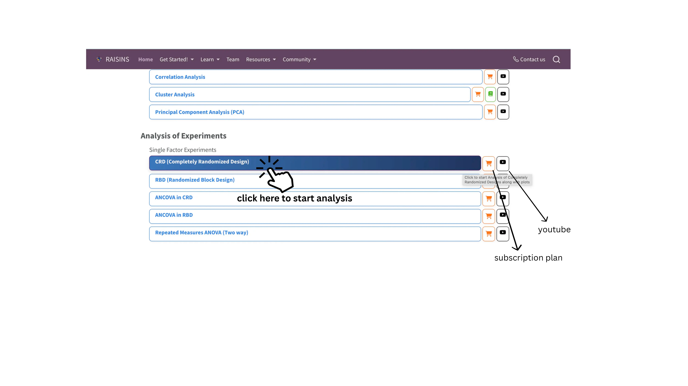{#fig-aov fig-align="center"}

<!-- our code -->

<!-- To get started, visit **RAISINS** [www.raisins.live](https://www.raisins.live) home page, go to Analysis of experiments. Here, you can see different single-factor experimental designs. Select the design you want for analysis.In this tutorial, we will focus on Completely Randomized Design (CRD), as shown in  @fig-aov. -->

<!-- 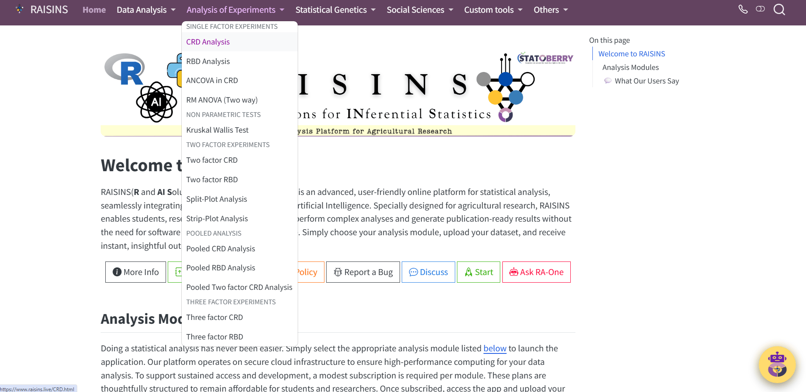{#fig-aov fig-align="center"} -->

## Completely Randomized Design (CRD) {#C}

::: {style="text-align: justify;"}
A Completely Randomized Design (CRD) is the simplest and most fundamental experimental design used in statistics, where all experimental units are randomly assigned to different treatment levels of a single factor, without any blocking or grouping. CRD is used in controlled settings like lab experiments, greenhouse trials, chemical assays, or biological studies where external variability is low and blocking is unnecessary. It excels in simplicity, providing maximum error degrees of freedom for efficiency with small samples, but unsuitable for heterogeneous field conditions; in such cases, a Randomized Block Design (RBD) is more appropriate.
:::

<details>

```{=html}
<summary style="color: #5DADE2"; font-weight: bold;">
  CRD Layout
</summary>
```

<ul>

<small>

@fig-lay visually represents a Completely Randomized Design (CRD) arrangement with four treatments labeled as A, B, C, and D arranged randomly across experimental units.Each square block corresponds to one experimental unit or plot where a treatment is applied.Letters A, B, C, and D represent the four different treatment groups applied to the experimental units randomly and replicated three times.The randomized arrangement inside the grid (3 rows and 4 columns) exemplifies the core principle of CRD, where treatments are assigned entirely at random without restrictions or blocking.The layout shows no pattern by row or column, confirming random allocation, which helps to ensure that uncontrolled variability is minimized by chance.</small>

{#fig-lay fig-align="center"}

</ul>

</details>

::: callout-tip
#### Completely Randomized Design (CRD) is a fundamental statistical experimental design where treatments are assigned to experimental units entirely at random, with each unit having an equal probability of receiving any treatment.
:::

## A working example {#W}

::: {style="text-align: justify;"}
To make things simple and interesting, we’ll explain CRD analysis step by step using a hypothetical example, so you can clearly see how it works and why it matters.Let's assume the experiment is conducted in a field. Consider a dataset containing 10 treatments, each representing a distinct mango variety, with three replicates per variety. The treatments(varieties) are named as follows Alphonso, Kesar, Dasheri, Himsagar, Chausa, Badami, Safeda, Bombay_g, Langra, and Totapuri. Observations were recorded for four variables: **yield, Obs1, Obs2, and FW**.Our aim is to test whether treatments produce statistically significant differences in the response variable using ANOVA. The treatments are evaluated for each variables. The arrangement of the data is shown in the @fig-data .
:::

{#fig-data fig-align="center"}

::: {style="text-align: justify;"}
Data organized in MS Excel can be directly uploaded to **RAISINS** for analysis. For more details on data preparation see @sec-4. Two terms that we will use frequently are **Treatments** and **Variables**. In our example, the Treatments refer to the varieties, and the Variables are the four traits mentioned earlier - **yield, Obs1, Obs2, and FW**.
:::

## How to prepare your data? {#sec-4 .H}

::: {style="text-align: justify;"}
Arranging data for uploading in **RAISINS** is very simple. Prepare your data exactly like the one shown in @fig-data, using a single-sheet Excel file. Make sure no blank rows are left above, and all columns have proper names. That’s it - your file is ready to upload.

Still if you have doubt, see @fig-4 .

To prepare your dataset for analysis in **RAISINS**, you have two options:

Creating dataset in MS Excel

Creating your dataset directly within the **RAISINS** app
:::

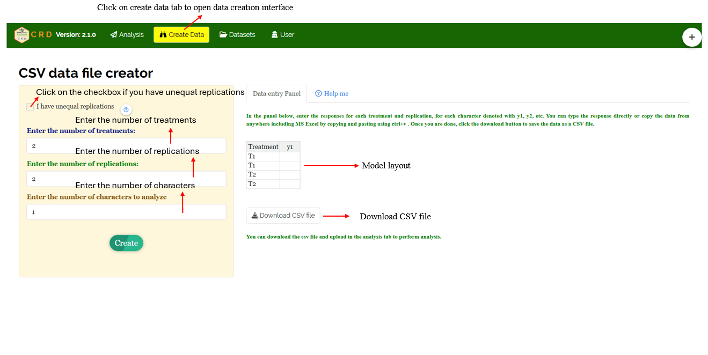{#fig-4 fig-align="center"}

## CRD analysis tab explained {#AO}

::: {style="text-align: justify;"}
In @fig-5 , you can see the detailed view of the Analysis tab, along with explanations of what each option does. This section helps you to understand the purpose of every settings, so you can select the most appropriate ones for your data and analysis. Now, upload the prepared file by clicking Browse in the sidebar of the `Analysis` tab. When the file is uploaded, options to select the Treatment and variables will appear. Select the appropriate column under treatments and variables. Once you click the `Run Analysis` button, all relevant results and outputs appear instantly leaving no room for confusion.
:::

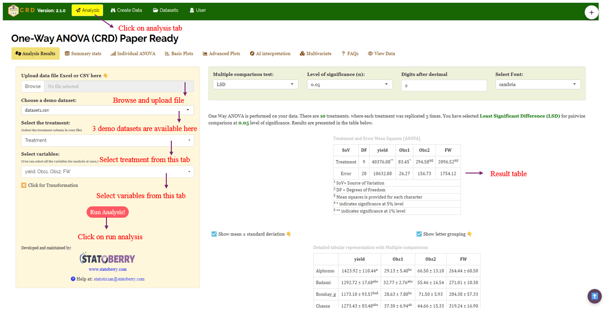{#fig-5 fig-align="center"}

::: {style="text-align: justify;"}
For some data, when there are large number of zeros/ discrete values/ when the observed variables are not normally distributed, we need to do transformation on the dataset (@sec-6) . Here, **RAISINS** provide inbuilt transformation option.
:::

## Transformation {#sec-6 .T}

::: {style="text-align: justify;"}
Log, square root, and arcsine transformations are often used in CRD analysis to make data more normal and reduce uneven variation. Researchers can use these transformations when analyzing experimental data in **RAISINS** as shown in @fig-6.
:::

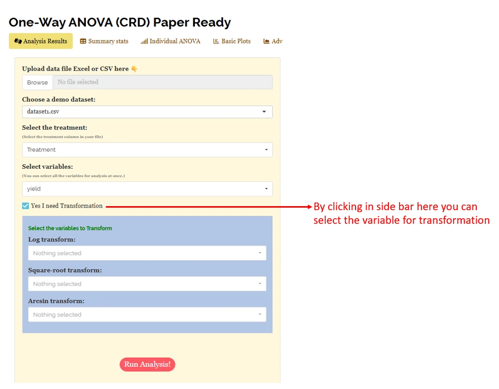{#fig-6 fig-align="center"}

::: {style="text-align: justify;"}
**Logarithmic transformation** is a mathematical procedure used to convert a skewed distribution into a more symmetrical one by replacing each data point (x) with its logarithm. This technique is specifically applied to positive, continuous data where the variance is proportional to the mean, a relationship common in phenomena that exhibit multiplicative or exponential growth.

**Square root transformation** is a statistical method used to stabilize variance and reduce right-skewness by replacing each data point (x) with its square root. It is primarily applied to non-negative, discrete "count" data such as those following a Poisson distribution, where the variance of the data tends to increase in proportion to the mean. By compressing the upper end of the scale more significantly than the lower end, this transformation brings the data closer to a normal distribution, satisfying the homoscedasticity requirements of many parametric statistical tests.

**Arcsine transformation** (also known as the angular transformation) is a mathematical technique specifically designed for data expressed as proportions or percentages bounded between 0 and 1. By taking the inverse sine of the square root of the proportion, this transformation stretches the ends of the distribution near 0 and 1, where variance is naturally small. It is primarily used to achieve homoscedasticity in binomial data.
:::

> After choosing the appropriate transformation proceed to @sec-7 for analysis.

## Analysis results {#sec-7 .AR}

::: {style="text-align: justify;"}
Once your dataset is uploaded, cick on `Run Analysis`, **one-way ANOVA** will be performed. Analysis of Variance **(ANOVA)** is a statistical technique used to test the significance of differences among population means by partitioning total variation into treatment and error components and comparing them using the F-test (see @fig-100 ).
:::

**Table 1 ANOVA summary**

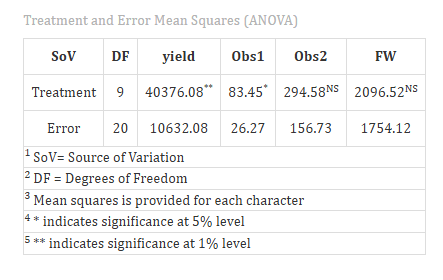{#fig-100 fig-align="center"}

<details>

```{=html}
<summary style="color: #5DADE2"; font-weight: bold;"> ANOVA table </summary>
```

<small> In a Completely Randomised Design (CRD), the analysis of variance **(ANOVA)** is used to test whether there are significant differences among the treatment means. The test statistic-F, follows an F distribution with two degrees of freedom: the numerator degrees of freedom (k-1), where k is the number of treatments, and the denominator degrees of freedom (N-k), where N is the total number of experimental units. To check whether the null hypothesis (all treatment means are equal)can be rejected or not, the calculated F value from the ANOVA table is compared with the critical F value obtained from F distribution table based on the degrees of freedom and the chosen significance level (α).

Significance is indicated by an asterisk ( \* ) for the **5%** level and two asterisks (\*\* ) for the **1%** level of significance, displayed as superscripts for each corresponding F stat in the table.

If the computed F value exceeds the critical value, the null hypothesis is rejected, indicating that at least one treatment mean differs significantly from the others. However, ANOVA alone does not indicate which specific treatments differ. Therefore, if a significant difference is detected, multiple comparison tests such as Fisher’s LSD, Tukey’s HSD or DMRT are performed to make pairwise comparisons between treatments and identify precisely where the differences exist. </small>

</details>

### Interpretation from @fig-100

::: {style="text-align: justify;"}
The ANOVA result show that the treatment mean square (40376.08) is much larger than the error mean square (10632.08), producing F-ratio of approximately 3.79, with 9 degrees of freedom for treatment and 20 for error, this F-value is statistically significant at the 1% level. This indicates that the variation in yield among treatments is highly unlikely to be due to random chance, and the null hypothesis (no treatment effect) can be rejected.

In practical terms, the treatments exerted a strong influence on yield performance, meaning that at least one treatment differs meaningfully from the others. The presence of such significant differences suggests that further post-hoc tests (such as Tukey’s HSD or LSD) would be appropriate to identify which specific treatments contributed to the observed variation.

@sec-8 provide detailed information on the multiple comparison test (Post-hoc test).
:::

**Table 2: Detailed tabular representation with multiple comparisons**

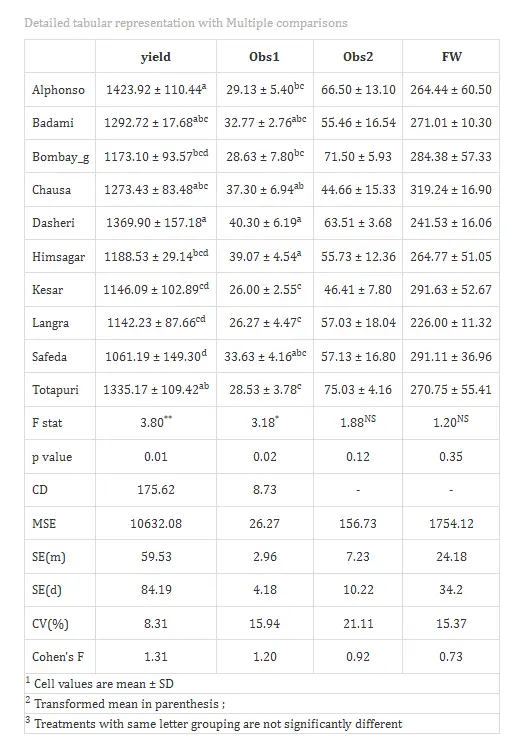{#fig-101 fig-align="center"}

<details>

```{=html}
<summary style="color: #5DADE2"; font-weight: bold;">Overview of ANOVA Results and Interpretation
</summary>
```

<small>

1.  *Treatments and Response Variables*

**Treatments**: The independent variable or specific category (e.g., mango variety) being tested to determine its influence on the results.

**Response Variable**: The dependent variable or specific measurement (e.g., weight or yield) recorded to evaluate the performance of the treatments.

2.  *Multiple Comparisons*

**Post-hoc Grouping**: A method of using letters (a, b, c) to categorize means. Items sharing the same letter are statistically similar, while those with different letters are significantly different.

3.  *ANOVA Summary*

**F stat**: A numerical value that compares the variance between different groups to the variance within those groups; it determines if the overall differences are statistically significant.

**p value**: The probability that the observed differences occurred by random chance. A value typically indicates that the results are statistically significant.

4.  *Critical Difference (CD) and Error Estimates*

**Critical Difference (CD)**: The minimum mathematical gap required between two means to declare them "significantly different" at a specific confidence level.

**Standard Error (SE)**: A measure of the accuracy of a sample mean compared to the true population mean; it indicates how much the mean might fluctuate.

**Mean Square Error (MSE)**: The average of the squared differences between observed values and the predicted mean; it represents the "noise" or unexplained error in the experiment.

**Coefficient of Variation (CV%)**: A percentage that shows the level of dispersion in the data. A lower CV indicates higher precision and reliability in the experimental measurements.

**Cohen’s F**: A standardized measure of effect size that describes the magnitude of the experimental effect, regardless of the sample size. </small>

</details>

### Interpretation from @fig-101

::: {style="text-align: justify;"}
Treatments are then grouped using letters like **"a", "b", "c"**, etc., to indicate statistical similarity. Overlapping of grouping letters (e.g., **ab**/ **bc**) indicates that the absolute difference between treatment means is less than the critical difference at the chosen level of significance, implying statistical similarity **(on par)**. For example, if both Alphonso and Badami are labeled **"a"**, their yields are statistically similar at **5%** significance level. Treatments with no common letters (e.g., **a and c**) differ significantly, providing a clear visual summary of treatment comparisons.

For characters exhibiting significant treatment effects, pairwise comparisons of treatment means were conducted using the Least Significant Difference (LSD) test. The LSD test provides the critical difference (CD) value, which was used to determine significant differences between pairs of treatment means. Based on these comparisons, letter groupings were assigned to each treatment and presented as superscripts. Treatments sharing at least one common letter within a character were considered not significantly different (statistically on par).
:::

::: callout-tip
#### When a researcher uses Tukey's HSD or DMRT, each pairwise comparison produces a different value because the differences between the group means are unique.
:::

::: {style="text-align: justify;"}
In our example for the character yield, Alphonso recorded the highest mean value (1423.92 ± 110.44), whereas Safeda exhibited the lowest mean (1061.19 ± 149.30). Alphonso was statistically at par with Badami, Chausa, Dasheri, and Totapuri, as indicated by common letter groupings, i.e you can see from Table 2. Similarly, Safeda was statistically at par with Bombay green, Himsagar, Kesar, and Langra.

The Cohen’s f values in the table represent the effect size and quantify the magnitude of treatment effects. Values less than 0.10 indicate a very small effect, below 0.25 indicate a small effect, below 0.40 indicate a medium effect, and values of 0.40 or higher indicate a large effect. The observed effect size for yield should therefore be interpreted as substantial and biologically meaningful, confirming that treatment differences are not only statistically significant but also practically relevant to the study.
:::

::: callout-tip
#### Cohen’s f is a measure of effect size.It tells you how strong or meaningful the treatment (variety) effect is, independent of sample size.
:::

## Multiple comparison tests {#sec-8 .MCT}

<details>

```{=html}
<summary style="color: #5DADE2"; font-weight: bold;">
  What is Post-hoc test?
</summary>
```

<ul><small> Post-hoc test is a follow-up analysis, performed after finding a significant result in an overall statistical test (like ANOVA). It's purpose is to identify exactly which groups or treatments differ from each other. In other words, it helps to pinpoint where the differences lie between multiple groups, when the initial test shows that not all groups are the same.</small></ul>

</details>

::: {style="text-align: justify;"}
After obtaining a significant F-value in ANOVA under CRD, multiple comparison tests are employed to identify which treatment means differ significantly. Commonly used post hoc tests include Least Significant Difference (LSD), Tukey’s Honest Significant Difference (HSD), and Duncan’s Multiple Range Test (DMRT), each differing in their level of error control and suitability depending on the number of treatments and experimental conditions (see @fig-7).
:::

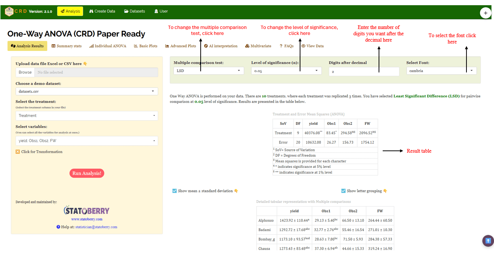{#fig-7 fig-align="center"}

<details>

```{=html}
<summary style="color: #5DADE2"; font-weight: bold;"> Post-hoc test </summary>
```

<small>

When the ANOVA in a **Completely Randomised Design (CRD)** is significant, the following post hoc tests are commonly used for pairwise comparisons: Tukey’s Honestly Significant Difference (HSD) test, and Fisher’s Least Significant Difference (LSD) test. These tests help identify which specific treatment means differ from each other, addressing the limitation of ANOVA in not indicating the exact sources of variation.

**LSD (Least Significant Difference) Test**

The **Least Significant Difference (LSD)** test is a post-hoc statistical procedure used in the context of a Completely Randomized Design (CRD) to identify which specific treatment means differ significantly after a one-way ANOVA has indicated an overall significant effect. When the ANOVA F-test rejects the null hypothesis, it implies that at least one treatment mean is different, but it does not specify which pairs differ. The LSD test addresses this by performing pairwise comparisons between treatment means using a critical difference threshold.

The LSD is calculated as $$\text{LSD} = t_{\alpha/2, \, df_{\text{error}}} \sqrt{\frac{2 \ \text{MSE}}{n}}$$

where, **t₍α/2, dfₑᵣᵣₒᵣ₎** is the critical t-value at the chosen significance level (e.g., 0.05), MSE is the mean square error from the ANOVA, and n is the number of replications per treatment under equal sample sizes. Any absolute difference between two treatment means exceeding this LSD value is declared statistically significant. The test assumes homogeneity of variances and is most valid when the overall F-test is significant, as it uses a pooled error term from all treatments, making it more powerful but also more prone to Type I errors when multiple comparisons are made without adjustment. The LSD test is simple and sensitive,therefore it should be applied cautiously, preferably for planned comparisons or nearby means in ordered data, because using it freely can increase the chance of false results.

**Tukey's Honestly Significant Difference (HSD)**

Tukey's test helps you find out exactly which pairs of treatment means differ significantly. The main idea is that Tukey's HSD compares all possible pairs of treatment means while controlling the overall Type I error rate, so you avoid false positives when making multiple comparisons. It calculates a critical value based on the number of treatments, degrees of freedom for error (from ANOVA), and the mean square error. In CRD, this method works well because treatments are assigned completely at random and the error variance is assumed homogeneous. Tukey's HSD uses the within-group variance from ANOVA (Mean Square Error) and the number of replicates per treatment to assess whether the difference between any two means is "honestly significant."

**Duncan's Multiple Range Test (DMRT)**

After confirming significant overall differences via ANOVA, DMRT ranks the treatment means and calculates critical differences using the studentized range statistic (Q) and the standard error based on error variance from ANOVA. For each pair of means, the observed mean difference is compared to a calculated critical value that increases with the number of means being compared, making DMRT more powerful than simpler tests like LSD. If the difference exceeds the critical threshold, the means are considered significantly different; otherwise, they are grouped together. This systematic and sequential approach provides clear groupings of treatments, ensuring that the probability of discovering real differences is maximized, which is why DMRT has gained popularity in agricultural research. </small>

</details>

**Which Post-hoc test to use?**

::: {style="text-align: justify;"}
The choice of the post-hoc test completely relies on the researcher.

**LSD** is used for pairwise comparison of treatment means after a significant ANOVA in CRD. It is most suitable when the number of treatments is small and comparisons are limited, offering high sensitivity to detect differences, but it may increase Type I error when many treatments are compared.In agricultural experiments LSD is the most commonly used.

**Tukey's HSD** is preferred when there are four or more treatments in a balanced CRD. It compares all possible treatment pairs while strictly controlling the family-wise error (the probability of making at least one false positive (Type I error) when you run multiple hypothesis tests at the same time) rate, making it a conservative and reliable method for multiple comparisons.

**DMRT** is commonly used in agricultural experiments with several treatments. It ranks treatment means step-wise and detects more significant differences than Tukey HSD, though it is less conservative and carries a higher risk of Type I error.

In the example for those characters, a pairwise comparison was performed to identify significant differences between treatments using Least Significant Difference (LSD) test.
:::

## Summary stats {#SUM}

::: {style="text-align: justify;"}
If you need to know about the detailed values of the various statistical metrices of treatments, move to `Summary stats` under the `Analysis`.
:::

**Table 3: Summary statistics**

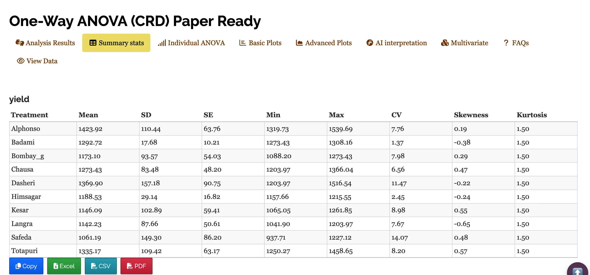{#fig-102 fig-align="center"}

<details>

```{=html}
<summary style="color: #5DADE2"; font-weight: bold;"> Table parameters </summary>
```

<small>

**Mean** The arithmetic average of all observations within a treatment. It represents the "typical" yield for that specific variety.

**SD (Standard Deviation)** A measure of the amount of variation or dispersion of a set of values. A low SD indicates that the data points tend to be very close to the mean.

**SE (Standard Error)** Specifically the Standard Error of the Mean. It estimates how far the sample mean is likely to be from the true population mean. It is calculated as $$SE = \frac{\text{Standard deviation (SD)}}{\sqrt {n}}*100$$,where n is the number of observations.

**Min / Max** The lowest and highest recorded yield values within that specific variety group.

**CV (Coefficient of Variation)** The ratio of the standard deviation to the mean, expressed as a percentage $$CV = \frac{\text{Standard deviation (SD)}}{\text{Mean}}*100$$

It allows you to compare the variability between groups with different scales.

**Skewness** A measure of the asymmetry of the probability distribution. Positive value: Data is skewed to the right (long tail on the right). Negative value: Data is skewed to the left (long tail on the left).

**Kurtosis** A measure of the "tailedness" of the distribution. It describes how much of the data is concentrated in the tails versus the peak. A standard normal distribution has a kurtosis of 3; values lower than that indicate a flatter peak.

</small>

</details>

### Interpretations from @fig-102

::: {style="text-align: justify;"}
The table presents a summary of yield performance across ten treatments, likely representing different mango varieties. Among them, Alphonso recorded the highest average yield (1423.92), followed by Dasheri and Totapuri, while Safeda had the lowest mean yield (1061.19).Varieties like Badami and Himsagar showed low variability in yield, indicated by their small standard deviations and low coefficients of variation (CV), suggesting consistent performance. In contrast, Safeda and Dasheri had higher CVs, pointing to greater fluctuation in yield. Skewness values show that most treatments had slightly asymmetric yield distributions, some leaning toward higher values (positively skewed) and others toward lower (negatively skewed). All treatments had a kurtosis of 1.5, indicating a relatively flat distribution compared to the normal curve.
:::

## Individual ANOVA {#IA}

::: {style="text-align: justify;"}
If the user want to get individual ANOVA table for each variable click on `Individual ANOVA` in the `Analysis`.

The significance of the treatment can be measured using F-test and p value as in @fig-104.
:::

**Table 4: ANOVA table for yield**

{#fig-104 fig-align="center"}

<details>

```{=html}
<summary style="color: #5DADE2"; font-weight: bold;"> Table parameters </summary>
```

<small>

**Critical Difference (CD)**

The minimum difference required between any two treatment means to consider them significantly different from each other.

In your table: At a 1% level (239.55), you are 99% confident in the difference. At a 5% level (175.62), you are 95% confident. You use these values for "mean separation" (e.g., Duncan's test or Tukey's).

**Coefficient of Variation (CV (%))**

A relative measure of dispersion that expresses the standard deviation as a percentage of the mean. $$CV = \frac{\text{Standard deviation (SD)}}{\text{Mean}}*100$$ {#eq-crd}

In your table: 8.31% indicates the experimental error is low, which is excellent for field trials.

**Mean Square Error(MSE)**

The Residual Mean sum of Squares from the ANOVA table. It represents the "noise" or unexplained variance in the experiment.

In your table: 10632.08, this value is used to calculate all the SE and CD values below it.

**Standard Error of Mean(SE(m))**

Measures how much the sample mean of a treatment is likely to vary from the true population mean. $$ SE(m)=\sqrt{MSE / r}$$ Where, r is the number of replications.

**Standard Error of Difference (SE(d))**

The standard error associated with the difference between two treatment means. $$ SE(d)=\sqrt{2 \times MSE / r}$$ It is the foundation for calculating the CD value.

</small>

</details>

### Interpretation from @fig-104

::: {style="text-align: justify;"}
It shows that the treatment mean square (40376.08) is much higher than the error mean square (10632.08), resulting in a calculated F-value of 3.80, which is significant at the 1% level (p = 0.01), indicating that treatments differ significantly in their effect on yield. The mean square error (10632.08) represents random variation and is used to compute precision measures such as standard error of a treatment mean, SE(m) = 59.53 and standard error of difference between two treatment means,SE(d) = 84.19, while the critical differences of 175.62 at 5% and 239.55 at 1% indicate the minimum difference required between two treatment means for significance. The coefficient of variation (8.31%) is low, showing good experimental precision and reliability of the results.
:::

**Table 5: summary statistics**

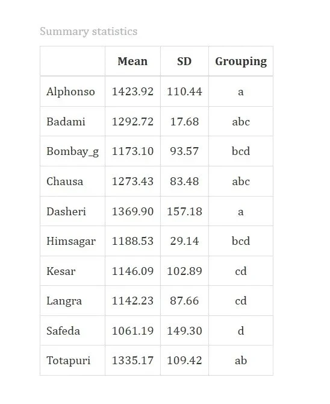{#fig-103 fig-align="center"}

### Interpretation from @fig-103

::: {style="text-align: justify;"}
Table compares different mango varieties based on their average values (Mean), variation (Standard Deviation or SD), and how they are grouped statistically.Alphonso and Dasheri mangoes have the highest average values, showing top performance. Safeda ranks lowest. Varieties are grouped based on statistical similarity, those sharing letters ("abc" or "cd") are not significantly different. This helps identify which mango types truly differ and which are alike.
:::

## Basic plots {#BP}

::: {style="text-align: justify;"}
RAISINS is designed for a smooth and hassle-free experience. Once you click the `Run Analysis` button, all relevant results and outputs appear instantly-leaving no room for confusion. We’ve ensured that every possible plot related to the Completely Randomisd Design is readily available. Simply click on the `Basic Plots` tab to view them (See @fig-8). Each plot comes with a gear icon at the top-left corner, allowing you to customize its appearance. You can also download these plots in high-quality PNG format (300 dpi),JPEG,TIFF,PDF and SVG for use in reports or presentations.
:::

### Customizing plots

::: {style="text-align: justify;"}
**RAISINS** provides user various customization features for the plots to enhance the visualization according to the requirement of the user. **Click** on @fig-8 to get a clear idea on the customizing features.
:::

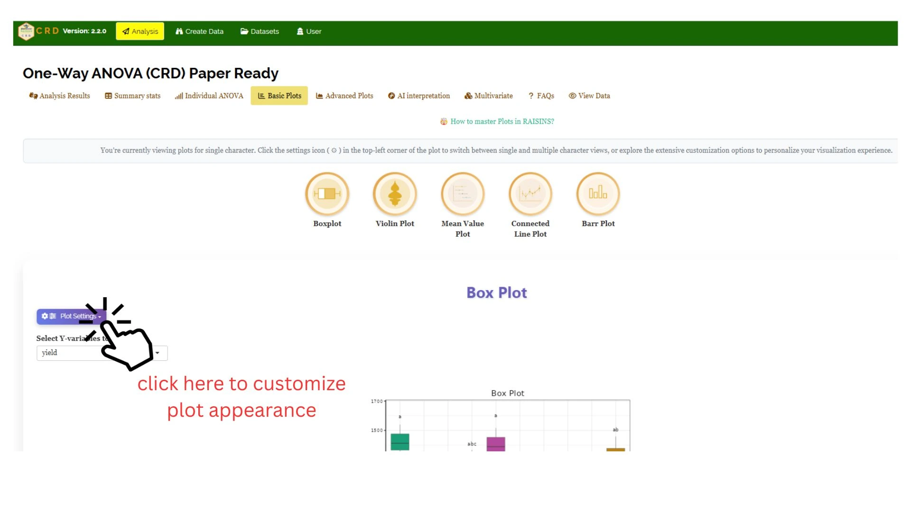{#fig-8 fig-align="center"}

::: {style="text-align: justify;"}
From @fig-9 to @fig-13, you can see the different types of plots available in RAISINS. Each one is visually illustrated and accompanied by a clear, insightful description below, making it easy to understand.
:::

```{=html}
<script>
// Hide all descriptions on page load
document.addEventListener('DOMContentLoaded', function() {
  const descriptions = document.querySelectorAll('.plot-description');
  descriptions.forEach(desc => {
    desc.style.display = 'none';
    console.log('Hiding on load: ' + desc.id); // Debug log
  });
});

function showDescription(id) {
  console.log('Showing description: ' + id); // Debug log
  document.getElementById(id).style.display = 'flex';
}

function hideDescription(id) {
  console.log('Hiding description: ' + id); // Debug log
  document.getElementById(id).style.display = 'none';
}
</script>
```

```{=html}
<style>
.plot-container {
  position: relative;
  display: inline-block;
  cursor: pointer;
  width: 350px; /* Fixed width for container */
  height: 300px; /* Fixed height for container */
  overflow: hidden; /* Ensure content fits within container */
  margin: 10px; /* Add margin to prevent overlap */
}

.plot-container img {
  width: 350px; /* Fixed image width */
  height: 300px; /* Fixed image height */
  object-fit: cover; /* Scale image to cover container */
  border: 3px solid #ddd;
  border-radius: 8px;
  transition: transform 0.3s ease, box-shadow 0.3s ease;
}

.plot-container:hover img {
  transform: scale(1.05);
  box-shadow: 0 4px 12px rgba(0, 0, 0, 0.2);
}

.plot-description {
  display: none !important; /* Ensure hidden by default */
  position: absolute;
  top: 0;
  left: 0;
  width: 100%; /* Cover full image width */
  height: 100%; /* Cover full image height */
  z-index: 1000; /* Ensure description is above image */
  background: linear-gradient(135deg, rgba(255, 107, 107, 0.8), rgba(255, 142, 83, 0.8)); /* Semi-transparent gradient */
  color: white;
  padding: 15px;
  border-radius: 8px;
  box-shadow: 0 4px 15px rgba(0, 0, 0, 0.3);
  font-size: 14px;
  line-height: 1.5;
  display: flex; /* Center text */
  align-items: center; /* Vertical center */
  justify-content: center; /* Horizontal center */
  text-align: center;
  animation: fadeIn 0.3s ease-in;
  pointer-events: none; /* Prevent description from blocking hover */
  border: 2px solid rgba(255, 255, 255, 0.5); /* Visible border for debugging */
}

.plot-container:hover .plot-description {
  display: flex !important; /* Force visibility on hover, using flex for centering */
}

@keyframes fadeIn {
  from { opacity: 0; transform: scale(0.95); }
  to { opacity: 1; transform: scale(1); }
}

/* Unique background gradients for each plot description */
#boxplot-desc { background: linear-gradient(135deg, rgba(255, 107, 107, 0.8), rgba(255, 142, 83, 0.8)); }
#barplot-desc { background: linear-gradient(135deg, rgba(161, 140, 209, 0.8), rgba(251, 194, 235, 0.8)); }
#connectedplot-desc { background: linear-gradient(135deg, rgba(0, 221, 235, 0.8), rgba(38, 166, 154, 0.8)); }
#meanvalueplot-desc { background: linear-gradient(135deg, rgba(255, 154, 139, 0.8), rgba(255, 106, 136, 0.8)); }
#violinplot-desc { background: linear-gradient(135deg, rgba(132, 250, 176, 0.8), rgba(143, 211, 244, 0.8)); }
</style>
```

:::::::::::::::::::::::: grid
:::::: g-col-6
::::: {.plot-container onmouseover="showDescription('boxplot-desc')" onmouseout="hideDescription('boxplot-desc')"}
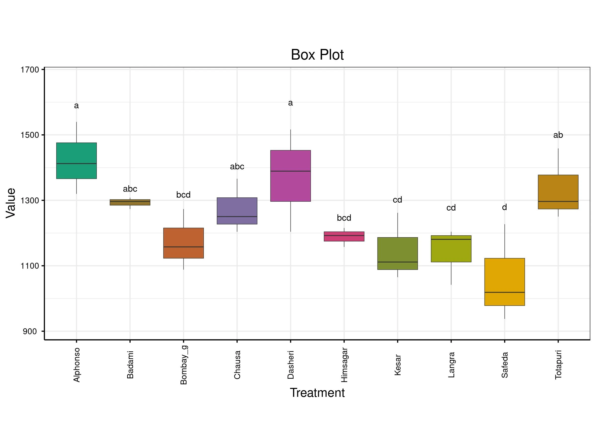{#fig-9 fallback="https://via.placeholder.com/300x300?text=Box+Plot"}

:::: {#boxplot-desc .plot-description}
::: {style="text-align: justify;"}
A **box plot** compares the distribution of values across different treatments. Each colored box represents a treatment and shows key statistics: the median (middle line), the interquartile range (the box itself), and potential outliers (points outside the whiskers). The vertical axis shows the value range, while the horizontal axis lists the treatments. Letters above each box indicate statistical groupings treatments sharing letters are statistically similar, while those with different letters are significantly different.
:::
::::
:::::
::::::

:::::: g-col-6
::::: {.plot-container onmouseover="showDescription('violinplot-desc')" onmouseout="hideDescription('violinplot-desc')"}
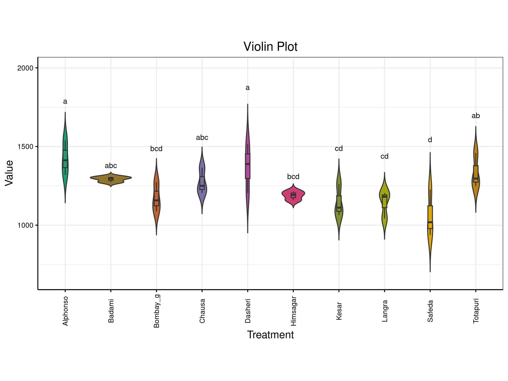{#fig-10 fallback="https://via.placeholder.com/300x300?text=Violin+Plot"}

:::: {#violinplot-desc .plot-description}
::: {style="text-align: justify;"}
A **violin plot** compares the distribution of values across different treatments. Each treatment (like a mango variety) is shown as a violin shape that reflects how the data is spread wider sections mean more data points at that value. Inside each violin is a box plot showing the median and interquartile range. The letters above each plot indicate statistical groupings: treatments sharing letters are statistically similar, while those with different letters are significantly different. This plot helps you see not just the average values, but also how consistent or variable each treatment is.
:::
::::
:::::
::::::

:::::: g-col-6
::::: {.plot-container onmouseover="showDescription('barplot-desc')" onmouseout="hideDescription('barplot-desc')"}
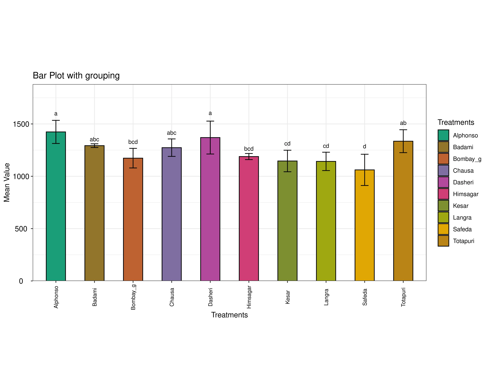{#fig-11 fallback="https://via.placeholder.com/300x300?text=Bar+Plot"}

:::: {#barplot-desc .plot-description}
::: {style="text-align: justify;"}
A **Bar plot** compares the average values of different treatments, with error bars showing variability. The letters above each bar indicate statistical groupings: treatments sharing letters are similar, while those with different letters are significantly different. In short, it highlights which treatments have higher or lower averages and whether those differences are meaningful.
:::
::::
:::::
::::::

:::::: g-col-6
::::: {.plot-container onmouseover="showDescription('meanvalueplot-desc')" onmouseout="hideDescription('meanvalueplot-desc')"}
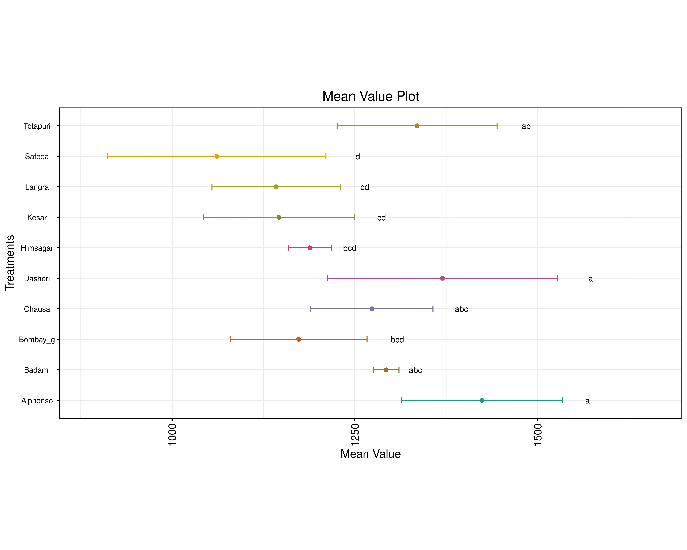{#fig-12 fallback="https://via.placeholder.com/300x300?text=Mean+Value+Plot"}

:::: {#meanvalueplot-desc .plot-description}
::: {style="text-align: justify;"}
A **mean value plot** compares the mean values of different treatments, each shown as a colored dot with horizontal error bars indicating variability. Treatments are listed vertically, and their mean values are plotted along the x-axis. Letters next to each point represent statistical groupings: treatments sharing letters are statistically similar, while those with different letters are significantly different. This layout helps visualize which treatments have higher or lower averages and whether those differences are meaningful.
:::
::::
:::::
::::::

::::::: g-col-6
:::::: {.plot-container onmouseover="showDescription('connectedplot-desc')" onmouseout="hideDescription('connectedplot-desc')"}
::: {style="text-align: center;"}
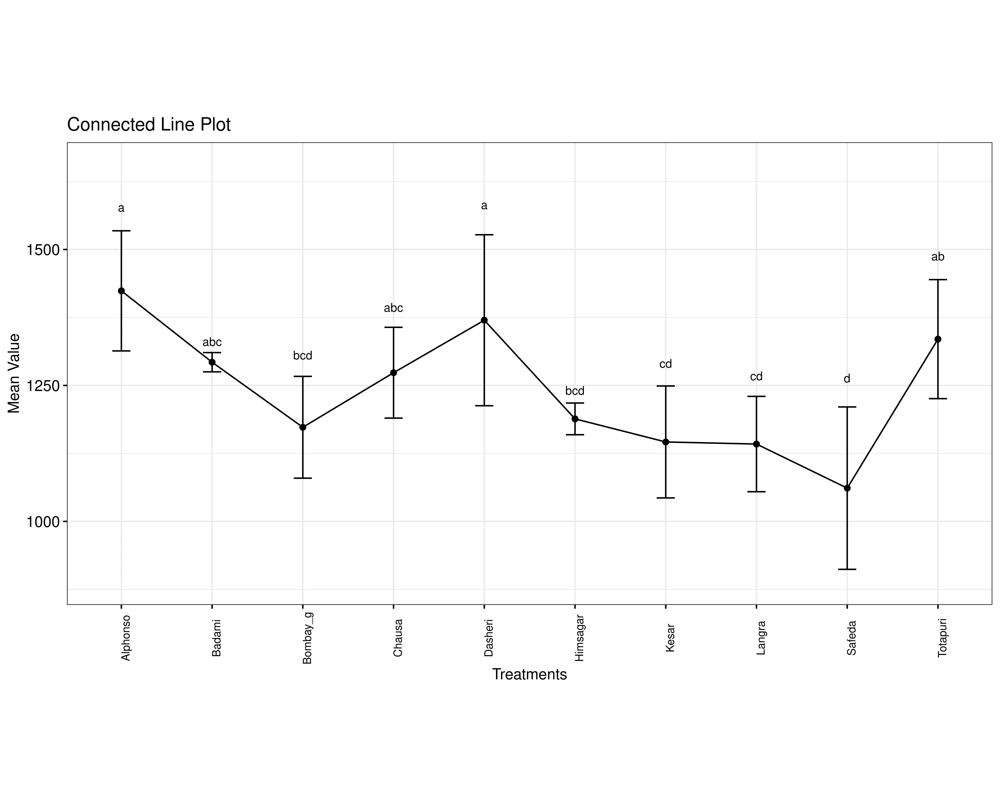{#fig-13 fallback="https://via.placeholder.com/300x300?text=Connected+Plot"}
:::

:::: {#connectedplot-desc .plot-description}
::: {style="text-align: justify;"}
A **connected line plot** compares the mean values of different treatments, with each point representing a treatment's average and error bars showing variability. The points are linked by lines to highlight trends across treatments. Above each point, letters indicate statistical groupings: treatments sharing letters are statistically similar, while those with different letters are significantly different. This plot helps visualize how treatment values change and which ones differ meaningfully from others.
:::
::::
::::::
:::::::
::::::::::::::::::::::::

## Advanced plots {#AP}

::: {style="text-align: justify;"}
**RAISINS** also provides `advanced plots` which goes beyond basic bar charts and histograms to give deeper insight into your data, especially distributions, relationships, and deviations from expectations.(See @fig-90)
:::

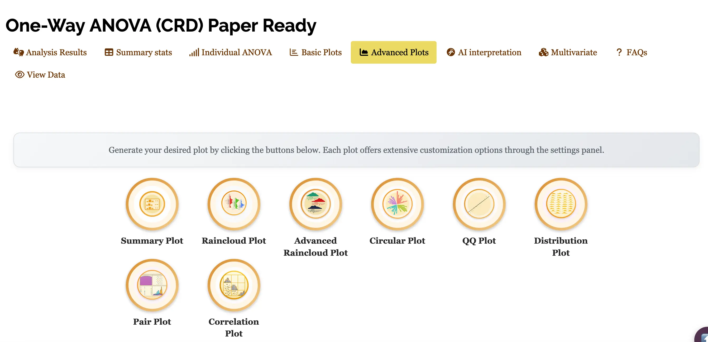{#fig-90 fig-align="center"}

**SUMMARY PLOT**

{#fig-14 fig-align="center"}

::: {style="text-align: justify;"}
A summary plot is a visual representation that shows how data are distributed. It helps quickly understand the pattern, spread, and central tendency of the data.
:::

**ADVANCED RAINCLOUD PLOT**

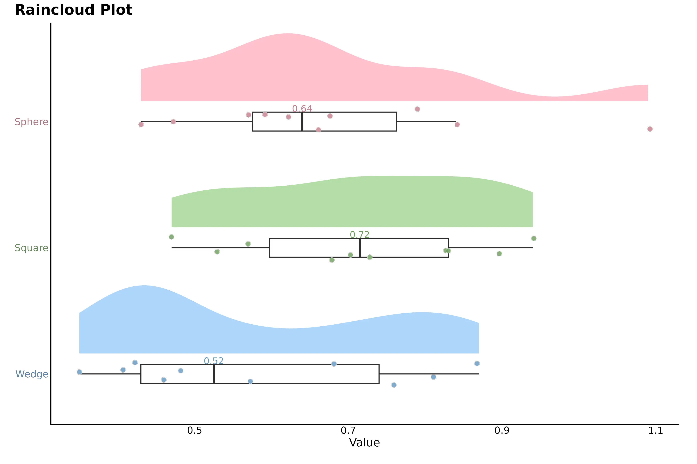{#fig-15 fig-align="center"}

::: {style="text-align: justify;"}
Advanced raincloud plot combines a density plot, boxplot, and individual data points to show the full distribution of each group. The colored density (“cloud”) shows where values are most concentrated, the boxplot summarizes the median and quartiles, and the dots (“rain”) represent individual observations. The numbers indicate summary values (usually mean or median), and the horizontal axis shows the measured variable.
:::

**QQ PLOT**

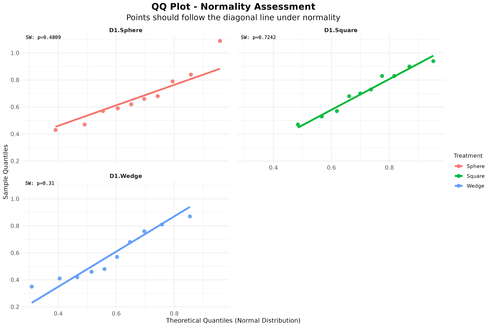{#fig-16 fig-align="center"}

::: {style="text-align: justify;"}
Q–Q (quantile–quantile) plot is used to assess normality of the data. The points represent observed data quantiles plotted against theoretical quantiles from a normal distribution. Because most points lie close to the diagonal reference line, the data approximately follows a normal distribution.
:::

**RAIN CLOUD PLOT**

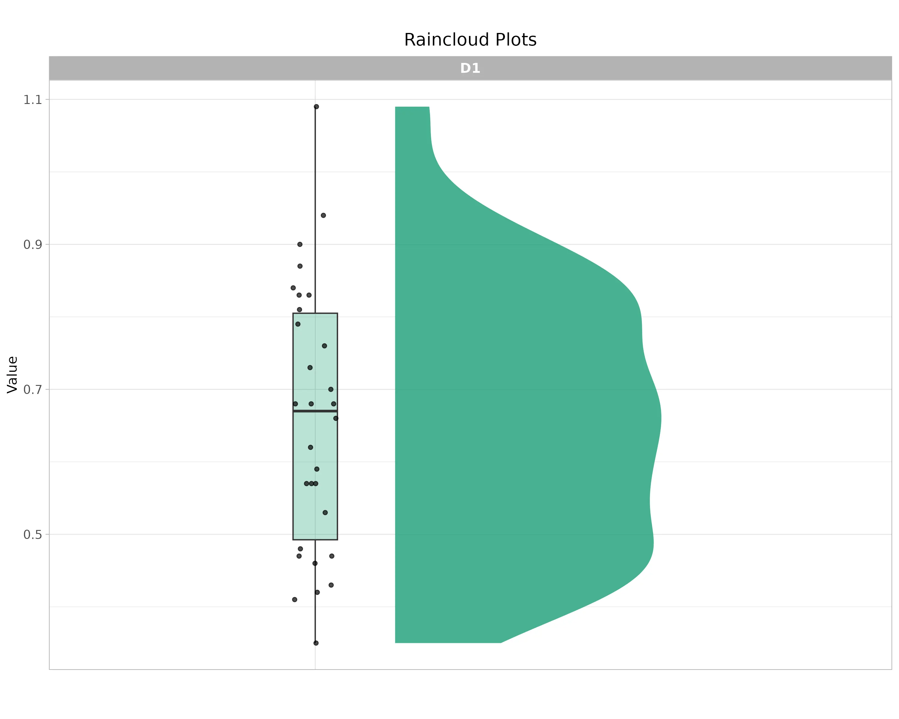{#fig-17 fig-align="center"}

::: {style="text-align: justify;"}
Raincloud plot shows the distribution of the response variable. The half-violin (cloud) represents the data density, indicating where values are most concentrated. The boxplot summarizes the median and interquartile range, and the jittered points (rain) show individual observations.
:::

**DISTRIBUTION PLOT**

{#fig-18 fig-align="center"}

::: {style="text-align: justify;"}
The distribution plot shows how the data values are spread for each treatment. It provides a visual comparison of the pattern, spread, and variability of observations across treatments, helping to understand overall differences and consistency in the data.
:::

## AI interpretation {#AI}

::: {style="text-align: justify;"}
RAISINS is equipped with an AI-powered RAISINS Assistant designed to assist users in comprehending the outcomes of statistical tests and data analysis. This functionality provides clear and concise summaries of results, identifies statistically significant differences between groups, and offers informed suggestions for potential next steps or interpretations.The user can get detailed interpretations of the analysis by clicking on `AI interpretation` on the `Analysis` as shown below @fig-ai .
:::

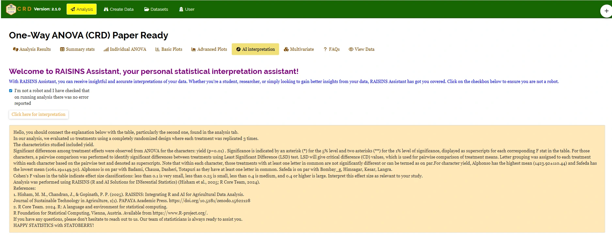{#fig-ai fig-align="center"}

## Multivariate {#MUL}

::: {style="text-align: justify;"}
Multivariate analysis in Completely Randomised Design (CRD) helps you to compare different response variables simultaneously. Remember the PCA used for multivariate selection, is an exploratory technique, not an inferential method. Now, in our example, of evaluation of ten mango cultivars - Alphonso, Kesar, Dasheri, Himsagar, Chausa, Badami, Safeda, Bombay_g, Langra, and Totapuri - by a horticultural scientist, navigate to `Multivariate` see @fig-mu.
:::

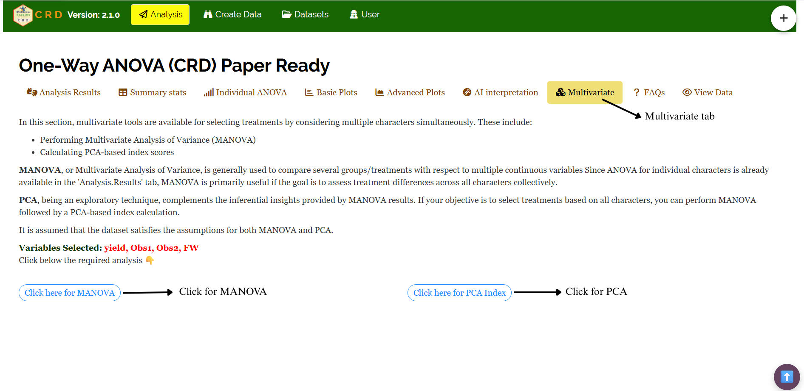{#fig-mu}

::: {style="text-align: justify;"}
MANOVA and PCA will be automatically carried out based on the selected variables. MANOVA table with interpretation appears automatically. PCA results and plots will appear along with automated interpretation.
:::

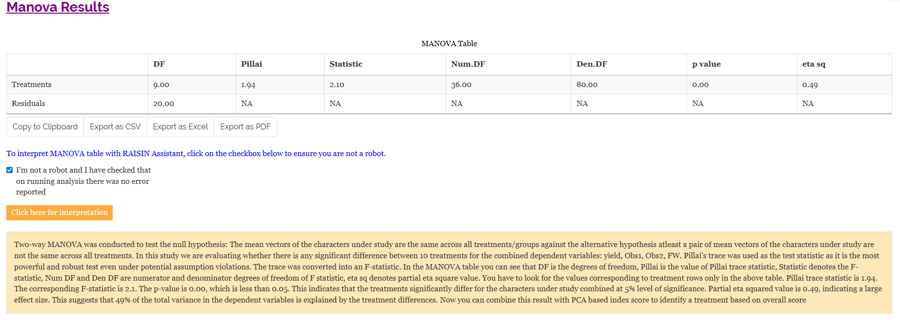{#fig-MAN2 fig-align="center"}

::: {style="text-align: justify;"}
The table titled 'Eigen Values PCA' given @fig-PC provides information about the eigen values and the percentage of variance explained by each principal component. The principal components PC1, PC2 have eigenvalues greater than one and are considered important for further analysis. PC1 accounts for approximately 41.16% of the variance in the dataset, while PC2 accounts for about 29.5% of the variance. Together, PC1 and PC2 explain approximately 70.66% of the total variance (termed as cumulative variance). Since PC1 explains more than 40% of the variance, a PC1-based index score is a strong consideration. Additionally, since both PCs explain more than 60% of the variance in the data, an index score based on both PCs is also appropriate. The scree plot below illustrates the proportion of variance explained by each principal component.
:::

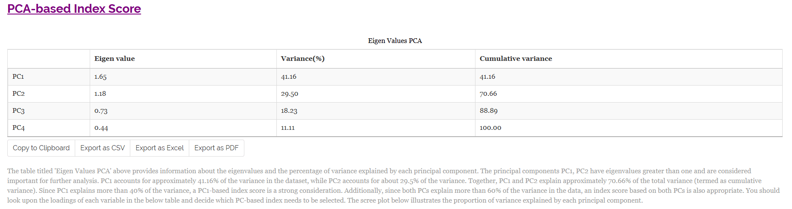{#fig-PC}

::: {style="text-align: justify;"}
The scree plot given @fig-screeplot illustrates the proportion of variance explained by each principal component.
:::

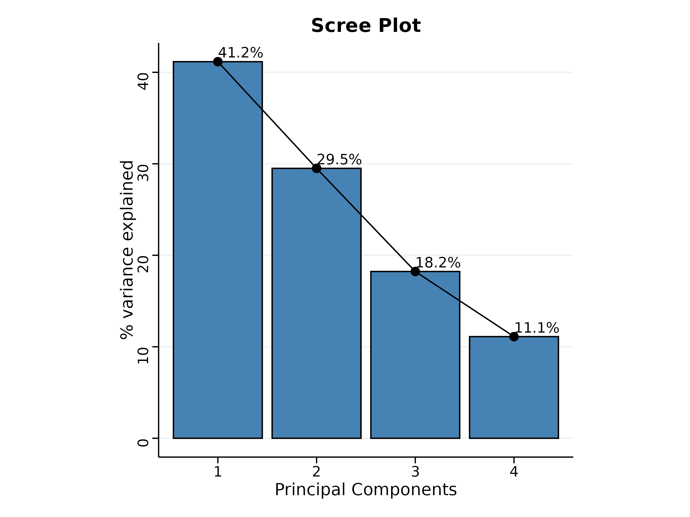{#fig-screeplot fig-align="center"}

::: {style="text-align: justify;"}
Look upon the loadings of each variable in the given @fig-loadings and decide which PC-based index needs to be selected. You can see that the variables yield and Obs2 have positive loadings in PC1. If you are seeking treatments with high values for these variables, consider treatments with a high index score based on PC1. Thus, treatments with high index scores based on PC1 can be considered optimal for improving the above variables. Conversely, the variables Obs1, FW have negative loadings in PC1. If you aim to improve these variables, look for treatments with a low index score based on PC1. For PC2, the variables yield, Obs1 and FW have positive loadings. If these variables are your focus, consider an index score based on PC2. Similarly, the variables Obs2 have negative loadings on PC2, and treatments with low index scores for PC2 would be suitable for these variables. It is recommended to use variables that are highly correlated for PCA, as this helps in constructing a more reliable and meaningful index.
:::

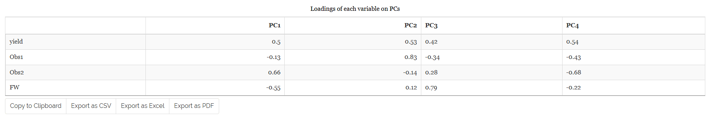{#fig-loadings fig-align="center"}

::: {style="text-align: justify;"}
The biplot gives a visual representation of the relationships among variables and treatments. Treatments with high values for a specific variable are positioned in the direction of that variable. The angle between variables in the biplot indicates their correlation, smaller angles suggest high positive correlation, while larger angles close to 90 degrees suggest weak or no correlation. Thus, the biplot aids in understanding the contributions of variables to each PC and in identifying patterns among treatments.
:::

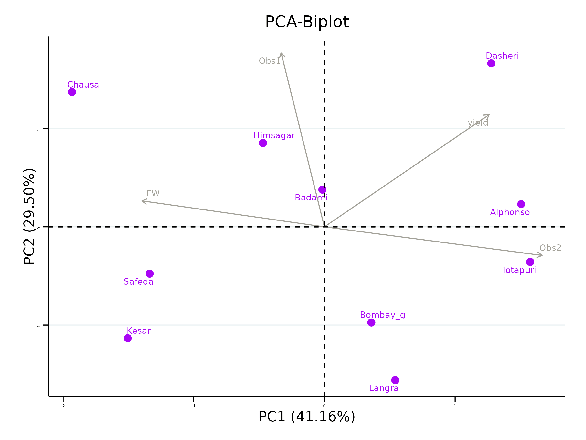{#fig-biplot}

::: {style="text-align: justify;"}
In RAISINS, we calculate a scaled index score by converting the index score to a range of 0 to 1, making it easier to interpret and compare. This standardized approach ensures consistency in evaluating treatments based on their index scores.To refine your selection, use the 'Select cutoff for Scaled Index Score' feature given as in @fig-indexscore, where you can choose the cutoff percentage to select treatments above or below a certain threshold. The default cutoff is set at 75%. By toggling the up-arrow and down-arrow buttons below the cutoff selection, you can select the top or bottom percentage of treatments as per your preference. Selected treatments are highlighted in yellow in the table below, providing a clear visual cue. Additionally, a plot based on the index scores is also displayed to aid in your analysis.
:::

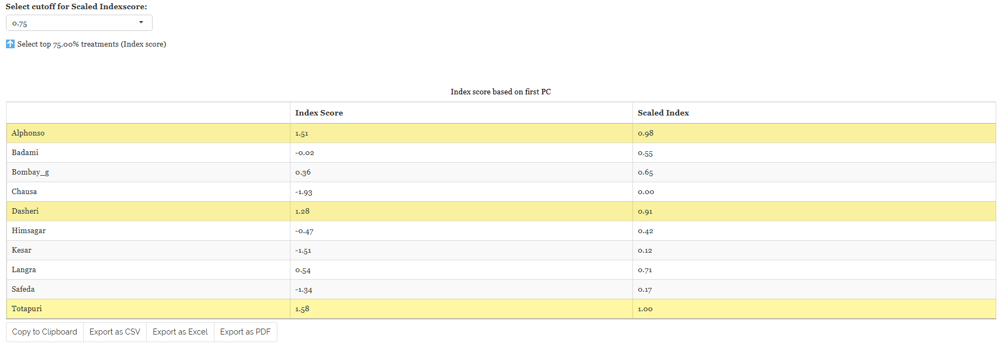{#fig-indexscore fig-align="center"}

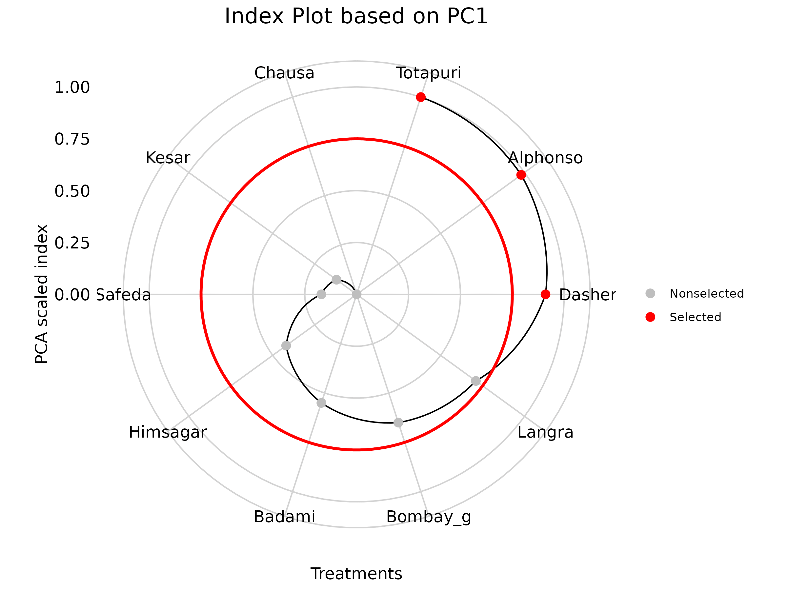{#fig-index fig-align="center"}

::: {style="text-align: justify;"}
Combining all this information, the experimenter can arrive at an overall conclusion that is statistically sound and contextually relevant to their study.
:::

## Preparing your data {#PRE}

::: {style="text-align: justify;"}
"Your analysis is only as good as your data! Feed RAISINS high-quality data, and it will deliver powerful insights feed it messy data, and the results won’t be trustworthy."

1.  Create your dataset in MS Excel

2.  Build your dataset directly within the RAISINS app
:::

## Preparing data in MS Excel {#EX}

::: {style="text-align: justify;"}
Open a new blank sheet in MS Excel with only one sheet included, and avoid adding any unnecessary content. The dataset should follow a column-based format, where the first column represents the treatment or group to be compared-you can name this column appropriately, such as “Group” or “Treatment.” All characters under study (e.g., yield, Obs1, Obs2, FW) should be arranged in separate columns, and each group should be repeated according to the number of replications. The file can be saved in CSV, XLS, or XLSX format, but CSV is recommended as it is lighter and enables faster loading. Ensure that there are no unwanted spaces in column names or group names. For reference, see the structure shown in @fig-pp. As illustrated in @fig-data, groups must appear repeatedly based on replications, and the data can also be arranged as shown in @fig-kk.
:::

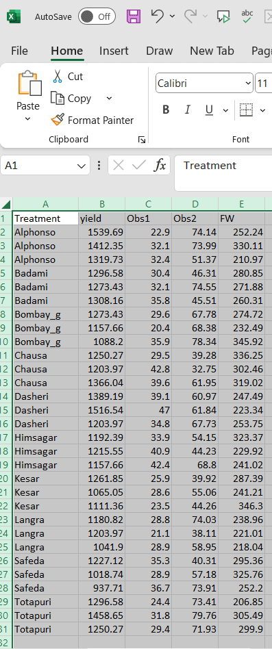{#fig-pp}

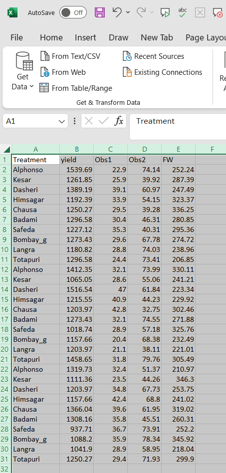{#fig-kk}

<details>

<summary>Dataset Creation Rules</summary>

<small> 1. **Column Naming Convention** - No spaces allowed in column names.\
- Use underscores (`_`) or full stops (`.`) for separation. - Avoid symbols and special characters like %,# etc 2. **Data Arrangement** - Start data arrangement towards the upper-left corner.\
- Ensure the row above the data is not blank. 3. **Cell Management** - Avoid typing or deleting in cells without data.\
- If needed, select affected cells, right-click, and select **Clear Contents**. 4. **Column Relevance** - Name all columns meaningfully.\
- Exclude unnecessary columns not required for analysis. </small>

</details>

<details>

<summary>How to Save as CSV in MS Excel</summary>

<small> 1. **Open Your Workbook**

```         
-   Ensure your data is arranged properly with only one sheet.
```

2.  **Click ‘File’ Menu**

    - Go to the top-left corner and click on **File**.

3.  **Choose ‘Save As’ or ‘Save a Copy’**

    - Select the location where you want to save your file.

4.  **Set File Type to CSV**

    - In the **‘Save as type’** dropdown menu, choose **CSV (Comma delimited) (\*.csv)**.

5.  **Name Your File**

    - Enter a relevant file name without spaces (use underscores if needed).

6.  **Click ‘Save’**

    - Click **Save** to export the file.

> 💡 Tip: Before saving, double-check that your data is on the first sheet and follows the required format (e.g., no empty rows above the data, meaningful column names). </small>

</details>

## Creating dataset in RAISINS {#CR}

::: {style="text-align: justify;"}
If you’re unsure about the correct format for creating a dataset, don’t worry - Raisins offers an option to create data directly within the app using the prescribed template. Here’s how:

- Navigate to the **Create Data Tab**

- Select the number of **Treatments**

- Select number of **Replications**

- Select number of **Characters**

- Click on **Create** button\*\*

Model layout will appear as shown in @fig-createdata. Now you may enter the observations manually into the CSV file once downloaded, or paste the observations straight into the file provided. Once you have entered the observations in the layout, download the csv file and upload in `Analysis`.
:::

{#fig-createdata width="1011"}

## Model datasets {#M}

::: {style="text-align: justify;"}
To test the app or better understand the data arrangement, we provide model datasets within the app. You can download them from the `Datasets`.
:::

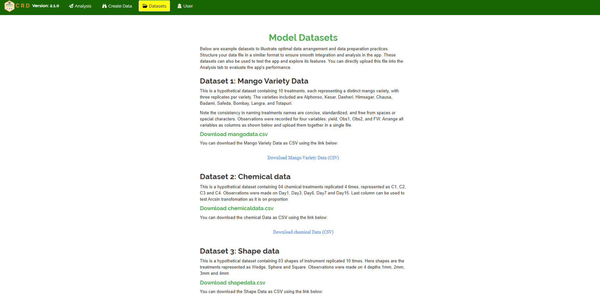{#fig-188 fig-align="center"}

## FAQ’s {#F}

::: {style="text-align: justify;"}
The app includes a dedicated `FAQs` to help clarify common doubts and guide users through various features. This section provides detailed answers to frequently asked questions, offering additional information and helpful tips to ensure a smooth user experience. If you’re ever unsure about how something works, the `FAQs` is a great place to start.
:::

{#fig-148 fig-align="center"}

## View data {#U}

::: {style="text-align: justify;"}
`View Data` serves as the primary diagnostic tool for ensuring data integrity before analysis. Upon uploading your dataset, the system performs an automated Health Check to validate column types and formatting.
:::

{fig-align="center"}

## RA-One

::: {style="text-align: justify;"}
\`RA-One is a simple and interactive tool for analyzing time series data. It helps users easily create and view plots like time series, forecasts, and residuals in one place.

With its easy-to-use interface and built-in assistant, RA-One makes data analysis quick, clear, and user-friendly.
:::

{fig-align="center"}

------------------------------------------------------------------------

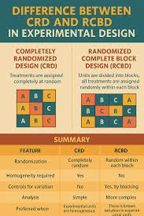](www/Chi-square-test.jpg)

# simple T Test

it is a tool for data analysis

<<<<<<< HEAD
HI I AM NIRU SABU HOW ARE YOU
=======
haiahalya how are you

suganuuu
>>>>>>> a0511a5a30e9bc9de485062f10ebfb1abf88c95f
