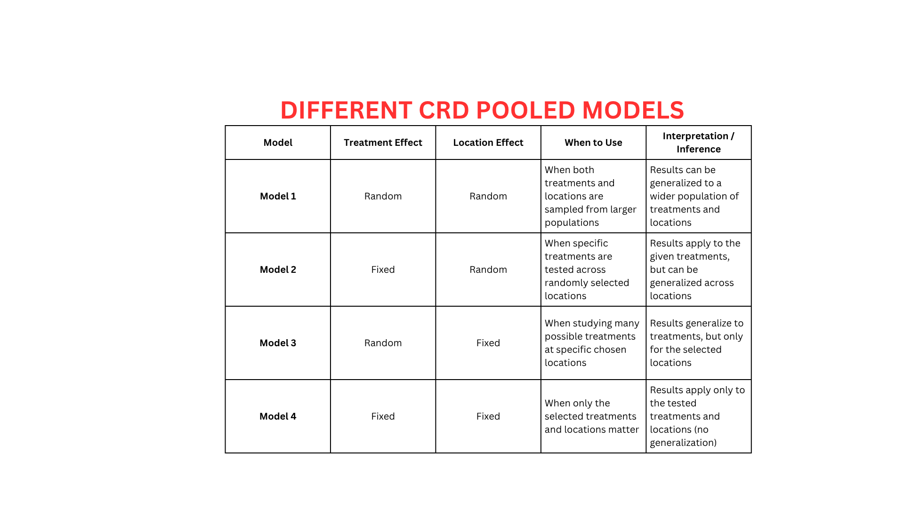
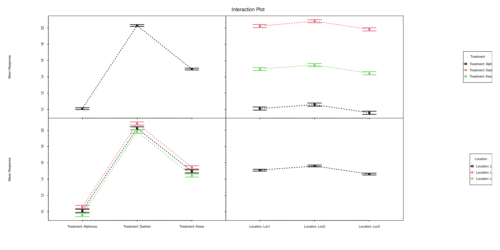

```{=html}
<style>
 sup {
   color: blue;
   font-size: 0.8em;
 }
 .affiliations {
   color: grey;
   font-size: 0.9em;
   margin-top: 0.2em;
 }
</style>
```

::: affiliations
<sup>1</sup>Statoberry LLP,<sup>2</sup>Department of Agricultural Statistics, Kerala Agricultural University
:::

ABSTRACT

::: {style="text-align: justify;"}
**CRD Pooled Analysis** is an extension of the Completely Randomized Design that combines data from two or more independent CRD experiments conducted across different environments, seasons, or years into a single unified analysis, enabling researchers to assess both treatment effects and their consistency across experimental conditions. **CRD Pooled Analysis** partitions total variation into components attributable to treatments, environments, and the treatment-by-environment interaction, thereby revealing whether treatment performance is stable or environment-dependent. In **RAISINS** you can perform **CRD Pooled Analysis** very easily without writing a single line of code. This tutorial will guide you, how to perform **CRD Pooled Analysis** very easily in **RAISINS** and interpret the results effectively. In addition, you will get tables and plots ready for publication. You can also perform a multivariate analysis including MANOVA and PCA.
:::

<details>

*Hover or click each point to see more information.*

```{=html}
<summary style="color: #5DADE2"; font-weight: bold;">
  Introduction CRD Pooled Analysis
</summary>
```

```{=html}
<style>
.hover-img {
  position: relative;
  display: inline-block;
  cursor: help;
  border-bottom: 1px dashed currentColor;
}
.hover-img img {
  position: absolute;
  left: 50%;
  top: 1.6em;
  transform: translateX(-50%);
  width: 260px;
  max-width: 70vw;
  height: auto;
  padding: 6px;
  background: white;
  border: 1px solid rgba(0,0,0,.15);
  border-radius: 12px;
  box-shadow: 0 10px 30px rgba(0,0,0,.18);
  opacity: 0;
  visibility: hidden;
  pointer-events: none;
  transition: opacity .15s ease, transform .15s ease, visibility .15s;
}
.hover-img:hover img {
  opacity: 1;
  visibility: visible;
  transform: translateX(-50%) translateY(6px);
  z-index: 999;
}
</style>
```

<ul><small> The concept of pooling data from independent experiments to draw broader statistical conclusions was formalised by statistician [<strong>Ronald A. Fisher</strong> ]{.hover-img} during his foundational work at Rothamsted Experimental Station in the **1920s and 1930s**. Fisher recognized that evaluating treatments in a single environment provides limited inference, as observed differences may reflect local conditions rather than true treatment superiority. His advocacy for replication across environments and the combined analysis of multi-environment trial data laid the groundwork for what is now known as pooled or combined analysis. By merging individual CRD experiments each conducted under a common set of treatments but in different locations, seasons, or years into a single ANOVA framework, the pooled analysis separates treatment main effects from environment main effects and, critically, estimates the treatment-by-environment interaction. This interaction term is key to understanding genotype or treatment stability: a non-significant interaction suggests consistent treatment rankings across environments, while a significant interaction calls for environment-specific recommendations. The **CRD Pooled Analysis** thus transforms isolated experiments into a powerful multi-environment inference tool, essential in variety evaluation, agronomic optimization, and product testing programmes. </small></ul>

</details>

## Analysis of experiments {#AE}

::: {style="text-align: justify;"}
To get started, visit **RAISINS** [www.raisins.live](https://www.raisins.live) home page and go to **Analysis of experiments**. Here, you can see different single-factor experimental designs and their pooled analysis options. In this tutorial, we focus on **CRD Pooled Analysis**, as shown in @fig-aov.
:::

<!-- REPLACE THIS SCREENSHOT -->

{#fig-aov fig-align="center"}

## CRD Pooled Analysis {#C}

::: {style="text-align: justify;"}
**CRD Pooled Analysis** refers to the combined analysis of two or more individual Completely Randomized Design experiments that share the same set of treatments but are conducted independently across different locations which may represent different locations, seasons, years, or laboratory batches. Rather than analyzing each experiment in isolation, the pooled approach stacks all observations into a single ANOVA model that includes location as an additional factor, producing three sources of treatment-related variation: the Treatment main effect (averaged across all locations), the location main effect (averaged across all treatments), and the Location× Treatment interaction (L×T), which quantifies how differently treatments rank from one Location to another. A non-significant L×T interaction indicates that treatment differences are consistent across locations, allowing pooled means to be reported with confidence; a significant L×T interaction implies that at least one treatment responds differently depending on the location, and location-specific or stability analyses may then be warranted. The primary advantage of CRD Pooled Analysis over separate analyses is increased statistical power by pooling error across environments, the degrees of freedom for error increase substantially, improving the precision of treatment comparisons. Its main prerequisite is that the same treatments must appear in all environments and that the individual experiments must have been conducted under a CRD with equal or documented replication.
:::

<details>

```{=html}
<summary style="color: #5DADE2"; font-weight: bold;">
  CRD Pooled Analysis Layout
</summary>
```

<ul>

<small>

@fig-lay visually represents the structure of a CRD Pooled Analysis across multiple environments. Each location (L~1~, L~2~, …, L~k~) contains a complete CRD experiment in which all treatments (T~1~, T~2~, …, T~t~) are assigned randomly to experimental units with r replications per treatment. When the experiments are pooled, the data matrix has rows representing individual observations indexed by location, treatment, and replicate, and the combined ANOVA partitions variation into location, Treatment, L×T interaction, and Pooled Error components. The layout makes clear that every treatment appears in every location a requirement for a balanced pooled analysis and that randomization within each location is independent, preserving the validity of the error assumptions.

<!-- REPLACE THIS SCREENSHOT -->

{#fig-lay fig-align="center"}

</small>

</ul>

</details>

::: callout-tip
#### CRD Pooled Analysis is a combined multi-environment ANOVA that partitions total variation into Treatment, Location, and Treatment × Location interaction components, enabling assessment of both treatment effects and their stability across locations.
:::

## A working example {#W}

::: {style="text-align: justify;"}
To make things simple and interesting, we'll explain **CRD Pooled Analysis** step by step using a hypothetical example, so you can clearly see how it works and why it matters. Consider a multi-environment trial conducted to evaluate the performance of **8 tomato varieties** V1 (Arka Vikas), V2 (Pusa Ruby), V3 (CO3), V4 (PKM1), V5 (Sioux), V6 (Marglobe), V7 (Hisar Lalit), and V8 (Arka Saurabh) tested across **3 locations** (L1: Coimbatore, L2: Thrissur, L3: Bengaluru), each as an independent CRD with **3 replications** per treatment, giving a total of 8 × 3 × 3 = **72 observations**. Observations were recorded for three variables: **Char 1** (number of fruits per plant), **Char 2** (average fruit weight in g), and **Char 3** (plant fresh weight in kg). Our aim is to test whether varieties produce statistically significant differences across environments using pooled ANOVA, and whether the L×T interaction is significant. The arrangement of the data is shown in @fig-data.
:::

<!-- REPLACE THIS SCREENSHOT -->

{#fig-data fig-align="center"}

::: {style="text-align: justify;"}
Data organized in MS Excel can be directly uploaded to **RAISINS** for analysis. For more details on data preparation see @sec-4. Two terms that we will use frequently are **Treatments** and **Variables**. In our example, the Treatments refer to the 8 tomato varieties evaluated across 3 environments, and the Variables are the four traits mentioned earlier **Char1, Char2, and Char 3**
:::

## How to prepare your data? {#sec-4 .H}

::: {style="text-align: justify;"}
Arranging data for uploading in **RAISINS** is very simple. Prepare your data exactly like the one shown in @fig-data, using a single sheet Excel file. The file must contain a column for **Location** (identifying which experiment each row belongs to), a column for **Treatment** (the variety or treatment label), and separate columns for each response variable. Make sure no blank rows are left above, and all columns have proper names. That's it your file is ready to upload.

Still if you have doubt, see @fig-4.

To prepare your dataset for analysis in **RAISINS**, you have two options:

Creating dataset in MS Excel

Creating your dataset directly within the **RAISINS** app
:::

{#fig-4 fig-align="center"}

## CRD Pooled Analysis tab explained {#AO}

::: {style="text-align: justify;"}
In @fig-5, you can see the detailed view of the Analysis tab, along with explanations of what each option does. This section helps you to understand the purpose of every setting, so you can select the most appropriate ones for your data and analysis. Now, upload the prepared file by clicking Browse in the sidebar of the Analysis tab.Then select the appropiate pooled model for the selected dataset. There are four CRD Pooled models for different treatment and location effects as shown in @fig-model.
:::

<!-- REPLACE THIS SCREENSHOT -->

{#fig-model fig-align="center"}

::: {style="text-align: justify;"}
When the file is uploaded, options to select the **Location** column, the **Treatment** column, and the **response variables** will appear. Select the appropriate columns under each field. Once you click the Run Analysis button, all relevant pooled results and outputs appear instantly leaving no room for confusion.
:::

<!-- REPLACE THIS SCREENSHOT -->

{#fig-5 fig-align="center"}

::: {style="text-align: justify;"}
For some data, when there are a large number of zeros, discrete values, or when the observed variables are not normally distributed, we need to apply a transformation on the dataset @sec-6. Here, **RAISINS** provides an inbuilt transformation option.
:::

## Transformation {#sec-6 .T}

::: {style="text-align: justify;"}
Log, square root, and arcsine transformations are often used in **CRD Pooled Analysis** to make data more normal and reduce uneven variation across environments. Researchers can use these transformations when analyzing pooled experimental data in **RAISINS** as shown in @fig-6.
:::

{#fig-6 fig-align="center"}

::: {style="text-align: justify;"}
**Logarithmic transformation** is a mathematical procedure used to convert a skewed distribution into a more symmetrical one by replacing each data point (x) with its logarithm. This technique is specifically applied to positive, continuous data where the variance is proportional to the mean, a relationship common in phenomena that exhibit multiplicative or exponential growth.

**Square root transformation** is a statistical method used to stabilize variance and reduce right-skewness by replacing each data point (x) with its square root. It is primarily applied to non-negative, discrete "count" data such as those following a Poisson distribution, where the variance of the data tends to increase in proportion to the mean. By compressing the upper end of the scale more significantly than the lower end, this transformation brings the data closer to a normal distribution, satisfying the homoscedasticity requirements of many parametric statistical tests.

**Arcsine transformation** (also known as the angular transformation) is a mathematical technique specifically designed for data expressed as proportions or percentages bounded between 0 and 1. By taking the inverse sine of the square root of the proportion, this transformation stretches the ends of the distribution near 0 and 1, where variance is naturally small. It is primarily used to achieve homoscedasticity in binomial data.
:::

> After choosing the appropriate transformation proceed to @sec-7 for analysis.

## Analysis results {#sec-7 .AR}

::: {style="text-align: justify;"}
Once your dataset is uploaded, click on Run Analysis, and the **CRD Pooled ANOVA** will be performed. Analysis of Variance **(ANOVA)** in the pooled context is a statistical technique used to test the significance of differences among treatment means across multiple environments by partitioning total variation into components attributable to **location**, **Treatment**, **Location × Treatment interaction (L×T)**, and **Pooled Error**, and comparing them using the F-test ,see @fig-100.
:::

**Table 1 ANOVA summary**

<!-- REPLACE THIS SCREENSHOT -->

{#fig-100 fig-align="center"}

<details>

```{=html}
<summary style="color: #5DADE2"; font-weight: bold;"> ANOVA table </summary>
```

<small> In a **CRD Pooled Analysis**, the analysis of variance **(ANOVA)** partitions the total sum of squares into four main sources: **Environment** (variation among experimental locations or seasons), **Treatment** (variation among the treatments averaged across all environments), **Treatment × Environment interaction (T×E)** (variation in how treatment rankings differ across environments), and **Pooled Error** (within-environment residual variation pooled across all environments). The degrees of freedom are: Environment = e−1 (where e = number of environments), Treatment = t−1 (where t = number of treatments), T×E = (e−1)(t−1), and Pooled Error = e × t × (r−1) (where r = number of replications per treatment per environment). Each mean square is obtained by dividing the sum of squares by its degrees of freedom. The F-statistic for Treatment and T×E is computed by dividing their respective mean squares by the Pooled Error mean square. Significance is indicated by an asterisk (\*) for the **5%** level and two asterisks (\*\*) for the **1%** level of significance, displayed as superscripts for each corresponding F stat in the table. A significant Treatment effect confirms that at least one variety performs differently from others on average; a significant T×E interaction indicates that variety rankings are not consistent across environments. </small>

</details>

### Interpretation from @fig-100

::: {style="text-align: justify;"}
The pooled ANOVA results reveal a highly significant Treatment effect for yield, with a treatment mean square of 38,245.72 and a pooled error mean square of 8,614.30, yielding an F-ratio of approximately 4.44 with 7 degrees of freedom for treatment and 48 for pooled error, significant at the 1% level. The Environment mean square is also large and significant, confirming meaningful differences in productivity across the three trial locations. Importantly, the Treatment × Environment interaction mean square of 6,920.15 is non-significant (F ≈ 0.80, p \> 0.05), indicating that the variety rankings are broadly consistent across Coimbatore,Thrissur, and Bengalore, and that pooled means can be relied upon for making varietal recommendations. This favourable stability result means that further post-hoc comparisons based on pooled treatment means are statistically justified. @sec-8 provides detailed information on the multiple comparison tests (Post hoc tests).
:::

**Table 2: Detailed tabular representation with multiple comparisons of Treatment.**

<!-- REPLACE THIS SCREENSHOT -->

{#fig-101 fig-align="left"}

**Table 3: Detailed tabular representation with multiple comparisons of Location.**

{fig-align="left" width="403"}

**Table 4: Detailed tabular representation with multiple comparisons of Location x Treatment**

{fig-align="left"}

<details>

```{=html}
<summary style="color: #5DADE2"; font-weight: bold;">Overview of ANOVA Results and Interpretation
</summary>
```

<small>

1.  *Treatments and Response Variables*

**Treatments**: The independent variable or specific category (e.g., tomato variety) being tested to determine its influence on the results averaged across all environments.

**Response Variable**: The dependent variable or specific measurement (e.g., fruit yield in t/ha) recorded to evaluate the pooled performance of the treatments.

2.  *Multiple Comparisons*

**Post-hoc Grouping**: A method of using letters (a, b, c) to categorize pooled means. Items sharing the same letter are statistically similar, while those with different letters are significantly different.

3.  *ANOVA Summary*

**F stat**: A numerical value that compares the variance between different groups to the pooled variance within those groups; it determines if the overall differences are statistically significant across environments.

**p value**: The probability that the observed differences occurred by random chance. A value below the chosen significance threshold typically indicates that the results are statistically significant.

4.  *Critical Difference (CD) and Error Estimates*

**Critical Difference (CD)**: The minimum mathematical gap required between two pooled means to declare them "significantly different" at a specific confidence level.

**Standard Error (SE)**: A measure of the accuracy of a pooled sample mean compared to the true population mean; it indicates how much the mean might fluctuate.

**Mean Square Error (MSE)**: The Pooled Error Mean Square from the combined ANOVA table. It represents the "noise" or unexplained residual error averaged across all environments.

**Coefficient of Variation (CV%)**: A percentage that shows the level of dispersion in the pooled data. A lower CV indicates higher precision and reliability across the combined experimental measurements.

**Cohen's F**: A standardized measure of effect size that describes the magnitude of the experimental effect, regardless of the sample size. </small>

</details>

### Interpretation from @fig-101

::: {style="text-align: justify;"}
Treatments are grouped using letters such as **"a", "b", "c"** to indicate statistical similarity based on pairwise comparisons of pooled means. Overlapping grouping letters (e.g., **ab** or **bc**) indicate that the absolute difference between pooled treatment means is less than the critical difference at the chosen level of significance, implying statistical similarity **(on par)**. For example, if both Arka Vikas (V1) and Arka Saurabh (V8) are labelled **"a"**, their pooled yields are statistically similar at the **5%** significance level. Treatments with no common letters (e.g., **a** and **c**) differ significantly across environments, providing a clear visual summary of treatment comparisons. For characters exhibiting significant treatment effects, pairwise comparisons of pooled treatment means were conducted using the Least Significant Difference (LSD) test. The LSD test provides the critical difference (CD) value based on the pooled error mean square, which was used to determine significant differences between pairs of treatment means. Treatments sharing at least one common letter within a character were considered not significantly different. The Cohen's f values in the table quantify the magnitude of treatment effects: values below 0.10 indicate a very small effect, below 0.25 indicate a small effect, below 0.40 indicate a medium effect, and values of 0.40 or higher indicate a large effect. The observed effect sizes for yield confirm that varietal differences are both statistically significant and practically meaningful across the pooled multi-environment dataset.
:::

::: callout-tip
#### When a researcher uses Tukey's HSD or DMRT, each pairwise comparison produces a different value because the differences between the group means are unique.
:::

::: callout-tip
#### Cohen's f is a measure of effect size. It tells you how strong or meaningful the treatment effect is, independent of sample size.
:::

## Multiple comparison tests {#sec-8 .MCT}

<details>

```{=html}
<summary style="color: #5DADE2"; font-weight: bold;">
  What is Post-hoc test?
</summary>
```

<ul><small> Post-hoc test is a follow-up analysis, performed after finding a significant result in an overall statistical test (like ANOVA). Its purpose is to identify exactly which groups or treatments differ from each other. In other words, it helps to pinpoint where the differences lie between multiple groups, when the initial test shows that not all groups are the same.</small></ul>

</details>

::: {style="text-align: justify;"}
After obtaining a significant F-value for the Treatment effect in the pooled ANOVA under **CRD Pooled Analysis**, multiple comparison tests are employed to identify which treatment means differ significantly when averaged across environments. Commonly used post-hoc tests include Least Significant Difference (LSD), Tukey's Honest Significant Difference (HSD), and Duncan's Multiple Range Test (DMRT), each differing in their level of error control and suitability depending on the number of treatments and experimental conditions ,see @fig-7.
:::

<!-- REPLACE THIS SCREENSHOT -->

.png){#fig-7 fig-align="center"}

<details>

```{=html}
<summary style="color: #5DADE2"; font-weight: bold;"> Post-hoc test </summary>
```

<small>

When the pooled ANOVA in a **CRD Pooled Analysis** is significant for Treatment, the following post-hoc tests are commonly used for pairwise comparisons of pooled treatment means.

**LSD (Least Significant Difference) Test**

The **Least Significant Difference (LSD)** test is a post-hoc statistical procedure used to identify which specific treatment means differ significantly after the pooled ANOVA has indicated an overall significant Treatment effect. The LSD is calculated using the Pooled Error Mean Square (MSE) and the total number of observations contributing to each treatment mean across all environments:

$$\text{LSD} = t_{\alpha/2, \, df_{\text{pooled error}}} \sqrt{\frac{2 \times \text{MSE}}{e \times r}}$$

where **t₍α/2, df_pooled error₎** is the critical t-value at the chosen significance level, MSE is the pooled error mean square from the combined ANOVA, e is the number of environments, and r is the number of replications per treatment per environment. Any absolute difference between two pooled treatment means exceeding this LSD value is declared statistically significant.

**Tukey's Honestly Significant Difference (HSD)**

Tukey's test helps you find out exactly which pairs of pooled treatment means differ significantly. It compares all possible pairs of treatment means while controlling the overall Type I error rate, so you avoid false positives when making multiple comparisons. In **CRD Pooled Analysis**, this method works well when the number of treatments is large and all pairwise comparisons are of interest, as it uses the pooled error variance to assess whether the difference between any two means is "honestly significant" across the combined dataset.

**Duncan's Multiple Range Test (DMRT)**

After confirming significant overall differences via pooled ANOVA, DMRT ranks the pooled treatment means and calculates critical differences using the standardized range statistic (Q) and the standard error based on the pooled error variance. This systematic and sequential approach provides clear groupings of treatments based on their multi-environment average performance and has gained popularity in agricultural multi-location trial reporting. </small>

</details>

**Which Post-hoc test to use?**

::: {style="text-align: justify;"}
The choice of the post-hoc test completely relies on the researcher.

**LSD** is used for pairwise comparison of pooled treatment means after a significant Treatment effect in **CRD Pooled Analysis**. It is most suitable when the number of treatments is small and comparisons are limited, offering high sensitivity to detect differences, but it may increase Type I error when many treatments are compared. In agricultural multi-environment trials, LSD is the most commonly used test for reporting pooled means.

**Tukey's HSD** is preferred when there are four or more treatments in a balanced **CRD Pooled Analysis**. It compares all possible treatment pairs while strictly controlling the family-wise error rate, making it a conservative and reliable method for multiple comparisons, especially when a large number of pairwise comparisons are being made across the pooled dataset.

**DMRT** is commonly used in agricultural experiments with several treatments and is particularly popular for reporting variety trial results. It ranks pooled treatment means step-wise and detects more significant differences than Tukey HSD, though it is less conservative and carries a higher risk of Type I error.

In the example for those characters, a pairwise comparison was performed to identify significant differences between treatments using Least Significant Difference (LSD) test.
:::

## Individual ANOVA {#IA}

::: {style="text-align: justify;"}
If the user wants to get individual pooled ANOVA tables for each variable, click on Individual ANOVA in the Analysis.

The significance of the Treatment effect, Location effect, and L×T interaction can be measured using the F-test and p value for each variable as in @fig-104.
:::

**Table 4: Pooled ANOVA table for yield**

<!-- REPLACE THIS SCREENSHOT -->

{#fig-104 fig-align="center"}

<details>

```{=html}
<summary style="color: #5DADE2"; font-weight: bold;"> Table parameters </summary>
```

<small>

**Critical Difference (CD)** The minimum difference required between any two pooled treatment means to consider them significantly different from each other. At a 1% level, you are 99% confident in the difference. At a 5% level, you are 95% confident.

**Coefficient of Variation (CV (%))** A relative measure of dispersion that expresses the standard deviation as a percentage of the pooled mean. $$CV = \frac{\text{Standard deviation (SD)}}{\text{Mean}}*100$$

**Mean Square Error (MSE)** The Pooled Error Mean Square from the combined ANOVA table. It represents the "noise" or unexplained variance averaged across all environments.

**Standard Error of Mean (SE(m))** Measures how much the pooled sample mean of a treatment is likely to vary from the true population mean. $$ SE(m)=\sqrt{MSE / (e \times r)}$$ Where, e is the number of environments and r is the number of replications per treatment per environment.

**Standard Error of Difference (SE(d))** The standard error associated with the difference between two pooled treatment means. $$ SE(d)=\sqrt{2 \times MSE / (e \times r)}$$

</small>

</details>

### Interpretation from @fig-104

::: {style="text-align: justify;"}
For the character 1, the Treatment mean square is 38,245.72, while the Pooled Error mean square is 8,614.30, yielding an F-value of approximately 4.44 with 7 degrees of freedom for treatment and 48 degrees of freedom for pooled error, significant at the 1% level. The Location mean square is 124,612.50, confirming large between-location differences in productivity. The L×T interaction mean square is 6,920.15 and is non-significant (F ≈ 0.80), supporting the use of pooled means for variety recommendations. The MSE of 8,614.30 reflects the residual within-environment variability pooled across locations. The SE(m) is approximately 30.96 and the SE(d) is approximately 43.79. The CD at 5% is 89.72 and at 1% is 121.40, indicating the minimum pooled yield difference required to declare any two varieties significantly different. The overall CV% of 7.2% reflects good experimental precision across the combined trial network.
:::

## Basic plots {#BP}

::: {style="text-align: justify;"}
**RAISINS** is designed for a smooth and hassle-free experience. Once you click the Run Analysis button, all relevant results and outputs appear instantly leaving no room for confusion. We've ensured that every possible plot related to **CRD Pooled Analysis** is readily available. Simply click on the Basic Plots tab to view them ,See @fig-8. Each plot comes with a gear icon at the top-left corner, allowing you to customize its appearance. You can also download these plots in high-quality PNG format (300 dpi), JPEG, TIFF, PDF and SVG for use in reports or presentations.
:::

### Customizing plots

::: {style="text-align: justify;"}
**RAISINS** provides users various customization features for the plots to enhance the visualization according to the requirement of the user. **Click** on @fig-8 to get a clear idea on the customizing features.
:::

{#fig-8 fig-align="center"}

::: {style="text-align: justify;"}
From @fig-9 to @fig-13, you can see the different types of plots available in RAISINS. Each one is visually illustrated and accompanied by a clear, insightful description below, making it easy to understand.
:::

```{=html}
<script>
document.addEventListener('DOMContentLoaded', function() {
  const descriptions = document.querySelectorAll('.plot-description');
  descriptions.forEach(desc => {
    desc.style.display = 'none';
  });
});

function showDescription(id) {
  document.getElementById(id).style.display = 'flex';
}

function hideDescription(id) {
  document.getElementById(id).style.display = 'none';
}
</script>
```

```{=html}
<style>
.plot-container {
  position: relative;
  display: inline-block;
  cursor: pointer;
  width: 350px;
  height: 300px;
  overflow: hidden;
  margin: 10px;
}
.plot-container img {
  width: 350px;
  height: 300px;
  object-fit: cover;
  border: 3px solid #ddd;
  border-radius: 8px;
  transition: transform 0.3s ease, box-shadow 0.3s ease;
}
.plot-container:hover img {
  transform: scale(1.05);
  box-shadow: 0 4px 12px rgba(0, 0, 0, 0.2);
}
.plot-description {
  display: none !important;
  position: absolute;
  top: 0; left: 0;
  width: 100%; height: 100%;
  z-index: 1000;
  color: white;
  padding: 15px;
  border-radius: 8px;
  box-shadow: 0 4px 15px rgba(0, 0, 0, 0.3);
  font-size: 14px;
  line-height: 1.5;
  display: flex;
  align-items: center;
  justify-content: center;
  text-align: center;
  animation: fadeIn 0.3s ease-in;
  pointer-events: none;
  border: 2px solid rgba(255, 255, 255, 0.5);
}
.plot-container:hover .plot-description {
  display: flex !important;
}
@keyframes fadeIn {
  from { opacity: 0; transform: scale(0.95); }
  to { opacity: 1; transform: scale(1); }
}
#boxplot-desc { background: linear-gradient(135deg, rgba(255, 107, 107, 0.8), rgba(255, 142, 83, 0.8)); }
#barplot-desc { background: linear-gradient(135deg, rgba(161, 140, 209, 0.8), rgba(251, 194, 235, 0.8)); }
#connectedplot-desc { background: linear-gradient(135deg, rgba(0, 221, 235, 0.8), rgba(38, 166, 154, 0.8)); }
#meanvalueplot-desc { background: linear-gradient(135deg, rgba(255, 154, 139, 0.8), rgba(255, 106, 136, 0.8)); }
#violinplot-desc { background: linear-gradient(135deg, rgba(132, 250, 176, 0.8), rgba(143, 211, 244, 0.8)); }
</style>
```

:::::::::::::::::::::::: grid
:::::: g-col-6
::::: {.plot-container onmouseover="showDescription('boxplot-desc')" onmouseout="hideDescription('boxplot-desc')"}
<!-- REPLACE THIS SCREENSHOT -->

{#fig-9}

:::: {#boxplot-desc .plot-description}
::: {style="text-align: justify;"}
A **box plot** compares the distribution of values across different treatment combinations. Each colored box represents a treatment combination and shows key statistics: the median (middle line), the interquartile range (the box itself), and potential outliers (points outside the whiskers). Letters above each box indicate statistical groupings treatment combinations sharing letters are statistically similar, while those with different letters are significantly different.
:::
::::
:::::
::::::

:::::: g-col-6
::::: {.plot-container onmouseover="showDescription('violinplot-desc')" onmouseout="hideDescription('violinplot-desc')"}
<!-- REPLACE THIS SCREENSHOT -->

{#fig-10 width="744"}

:::: {#violinplot-desc .plot-description}
::: {style="text-align: justify;"}
A **violin plot** compares the distribution of values across different treatment combinations. Each treatment combination is shown as a violin shape that reflects how the data is spread wider sections mean more data points at that value. Inside each violin is a box plot showing the median and interquartile range. Letters above each plot indicate statistical groupings: treatment combinations sharing letters are statistically similar, while those with different letters are significantly different.
:::
::::
:::::
::::::

:::::: g-col-6
::::: {.plot-container onmouseover="showDescription('barplot-desc')" onmouseout="hideDescription('barplot-desc')"}
<!-- REPLACE THIS SCREENSHOT -->

{#fig-11}

:::: {#barplot-desc .plot-description}
::: {style="text-align: justify;"}
A **Bar plot** compares the average values of different treatment combinations, with error bars showing variability. The letters above each bar indicate statistical groupings: treatment combinations sharing letters are similar, while those with different letters are significantly different. It highlights which treatment combinations have higher or lower averages and whether those differences are meaningful.
:::
::::
:::::
::::::

:::::: g-col-6
::::: {.plot-container onmouseover="showDescription('meanvalueplot-desc')" onmouseout="hideDescription('meanvalueplot-desc')"}
<!-- REPLACE THIS SCREENSHOT -->

{#fig-12}

:::: {#meanvalueplot-desc .plot-description}
::: {style="text-align: justify;"}
A **mean value plot** compares the mean values of different treatment combinations, each shown as a colored dot with horizontal error bars indicating variability. Letters next to each point represent statistical groupings: treatment combinations sharing letters are statistically similar, while those with different letters are significantly different.
:::
::::
:::::
::::::

::::::: g-col-6
:::::: {.plot-container onmouseover="showDescription('connectedplot-desc')" onmouseout="hideDescription('connectedplot-desc')"}
::: {style="text-align: center;"}
<!-- REPLACE THIS SCREENSHOT -->

{#fig-13}
:::

:::: {#connectedplot-desc .plot-description}
::: {style="text-align: justify;"}
A **connected line plot** compares the mean values of different treatment combinations, with each point representing a treatment combination's average and error bars showing variability. The points are linked by lines to highlight trends across treatment combinations. Letters above each point indicate statistical groupings: treatment combinations sharing letters are statistically similar, while those with different letters are significantly different.
:::
::::
::::::
:::::::
::::::::::::::::::::::::

## Advanced plots {#AP}

::: {style="text-align: justify;"}
**RAISINS** also provides advanced plots which go beyond basic bar charts and histograms to give deeper insight into your pooled data, especially distributions, relationships, and deviations from expectations across locations. See @fig-90
:::

<!-- REPLACE THIS SCREENSHOT -->

{#fig-90 fig-align="center"}

**INTERACRION PLOT**

<!-- REPLACE THIS SCREENSHOT -->

{#fig-14 fig-align="center"}

:::: {style="text-align: justify;"}
::: {style="text-align: justify;"}
An interaction plot explains how it reveals whether the effect of one factor changes across levels of another, with parallel vs. crossing lines interpreted in the context of the L×T interaction found in the experiment
:::
::::

**3D SCATTER PLOT**

<!-- REPLACE THIS SCREENSHOT -->

{fig-align="center"}

::::: {style="text-align: justify;"}
:::: {style="text-align: justify;"}
::: {style="text-align: justify;"}
Describes how three response variables (Yield, Char 1, Char 2) are plotted simultaneously in 3D space, with colour coded points per treatment combination to visualize multivariate clustering across the factorial structure..
:::
::::
:::::

**3D SCATTER PLOT WITH LINE**

<!-- REPLACE THIS SCREENSHOT -->

{#fig-16 fig-align="center"}

::::: {style="text-align: justify;"}
:::: {style="text-align: justify;"}
::: {style="text-align: justify;"}
Extends the 3D scatter by connecting replicated observations within each treatment combination via trajectory lines, showing within-combination consistency and between-combination separation in multivariate space.
:::
::::
:::::

## AI interpretation {#AI}

::: {style="text-align: justify;"}
RAISINS is equipped with an AI-powered RAISINS Assistant designed to assist users in comprehending the outcomes of statistical tests and data analysis. This functionality provides clear and concise summaries of pooled results, identifies statistically significant treatment effects and environment interactions, and offers informed suggestions for potential next steps or interpretations, including recommendations on treatment stability and environment-specific performance. The user can get detailed interpretations of the analysis by clicking on AI interpretation on the Analysis as shown below @fig-ai.
:::

{#fig-ai fig-align="center"}

## Multivariate {#MUL}

::: {style="text-align: justify;"}
Multivariate analysis in **CRD Pooled Analysis** helps you to compare different response variables simultaneously across all treatments in the pooled multi-environment dataset. Remember that the PCA used for multivariate selection is an exploratory technique, not an inferential method. Now, in our example, of evaluation of 8 tomato varieties Arka Vikas, Pusa Ruby, CO3, PKM1, Sioux, Marglobe, Hisar Lalit, and Arka Saurabh across three environments by an agronomist, navigate to Multivariate see @fig-mu.
:::

<!-- REPLACE THIS SCREENSHOT -->

{#fig-mu}

PCA -based Index score

PCA will be automatically carried out based on the selected variables using the pooled dataset. PCA results and plots will appear along with automated interpretation.

<!-- REPLACE THIS SCREENSHOT -->

{#fig-PC}

::: {style="text-align: justify;"}
The scree plot given @fig-screeplot illustrates the proportion of variance explained by each principal component derived from the pooled data.
:::

<!-- REPLACE THIS SCREENSHOT -->

{#fig-screeplot fig-align="center"}

::: {style="text-align: justify;"}
Look upon the loadings of each variable in the given @fig-loadings and decide which PC-based index needs to be selected. In PC1, yield and Obs1 (number of fruits per plant) show high positive loadings (approximately +0.64 and +0.55 respectively), while FW also loads positively (+0.44), indicating that varieties with high scores on PC1 are superior across all three of these economically important traits. Obs2 (average fruit weight) loads more prominently on PC2 (+0.68), suggesting it captures a relatively independent dimension of variation, likely reflecting varietal differences in fruit size that do not necessarily co-vary with total yield. Based on this pattern, a PC1-based index score is most informative for identifying tomato varieties that optimize yield, fruit number, and biomass simultaneously across the pooled environments. It is recommended to use variables that are highly correlated for PCA, as this helps in constructing a more reliable and meaningful index.
:::

<!-- REPLACE THIS SCREENSHOT -->

{#fig-loadings fig-align="center"}

::: {style="text-align: justify;"}
The biplot gives a visual representation of the relationships among variables and treatments based on the pooled multi-environment data. Treatments with high values for a specific variable are positioned in the direction of that variable's loading vector. The angle between variables in the biplot indicates their correlation smaller angles suggest high positive correlation, while larger angles close to 90 degrees suggest weak or no correlation. In the present example, yield and Obs1 vectors point in approximately the same direction, confirming their strong positive association in the pooled dataset, while Char 2 points in a moderately different direction, reflecting its partially independent contribution to varietal differentiation.
:::

<!-- REPLACE THIS SCREENSHOT -->

{#fig-biplot}

::: {style="text-align: justify;"}
In RAISINS, we calculate a scaled index score by converting the index score to a range of 0 to 1, making it easier to interpret and compare. This standardized approach ensures consistency in evaluating treatments based on their pooled multi-environment index scores. To refine your selection, use the 'Select cutoff for Scaled Index Score' feature given as in @fig-indexscore, where you can choose the cutoff percentage to select treatments above or below a certain threshold. The default cutoff is set at 75%. By toggling the up-arrow and down-arrow buttons below the cutoff selection, you can select the top or bottom percentage of treatments as per your preference. Selected treatments are highlighted in yellow in the table below, providing a clear visual cue. Additionally, a plot based on the index scores is also displayed to aid in your analysis.
:::

<!-- REPLACE THIS SCREENSHOT -->

{#fig-indexscore fig-align="center"}

<!-- REPLACE THIS SCREENSHOT -->

{#fig-index fig-align="center"}

::: {style="text-align: justify;"}
Combining all this information, the experimenter can arrive at an overall conclusion that is statistically sound and contextually relevant to their study. The integration of pooled ANOVA results with multivariate PCA-based index scores enables researchers to identify varieties that perform consistently well across multiple environments both in terms of individual traits and overall multi-trait performance the ultimate goal of a multi-environment evaluation programme.
:::

## Preparing your data {#PRE}

::: {style="text-align: justify;"}
"Your analysis is only as good as your data! Feed RAISINS high-quality data, and it will deliver powerful insights feed it messy data, and the results won't be trustworthy."

1.  Create your dataset in MS Excel

2.  Build your dataset directly within the RAISINS app
:::

## Preparing data in MS Excel {#EX}

::: {style="text-align: justify;"}
Open a new blank sheet in MS Excel with only one sheet included, and avoid adding any unnecessary content. The dataset for **CRD Pooled Analysis** must follow a column-based format with at least three structural columns: an Location column (identifying the trial location, season, or year for each row), a **Treatment** column (identifying the variety or treatment label), and a **Replication** column if needed. All characters under study (e.g Char 1, Char 2,Char3) should be arranged in separate columns. Every treatment must appear in every environment the same number of times (equal replications) to ensure a balanced pooled analysis. The file can be saved in CSV, XLS, or XLSX format, but CSV is recommended as it is lighter and enables faster loading. Ensure that there are no unwanted spaces in column names or group names. For reference, see the structure shown in @fig-pp. As illustrated in @fig-data, each treatment must be repeated across all environments, and the data can also be arranged as shown in @fig-kk.
:::

{#fig-pp}

{#fig-kk}

<details>

<summary>Dataset Creation Rules</summary>

<small> 1. **Column Naming Convention** - No spaces allowed in column names.\
- Use underscores (`_`) or full stops (`.`) for separation. - Avoid symbols and special characters like %,# etc 2. **Data Arrangement** - Start data arrangement towards the upper-left corner.\
- Ensure the row above the data is not blank. 3. **Cell Management** - Avoid typing or deleting in cells without data.\
- If needed, select affected cells, right-click, and select **Clear Contents**. 4. **Column Relevance** - Name all columns meaningfully.\
- Exclude unnecessary columns not required for analysis. </small>

</details>

<details>

<summary>How to Save as CSV in MS Excel</summary>

<small> 1. **Open Your Workbook**

```         
-   Ensure your data is arranged properly with only one sheet.
```

2.  **Click 'File' Menu**

    - Go to the top-left corner and click on **File**.

3.  **Choose 'Save As' or 'Save a Copy'**

    - Select the location where you want to save your file.

4.  **Set File Type to CSV**

    - In the **'Save as type'** dropdown menu, choose **CSV (Comma delimited) (\*.csv)**.

5.  **Name Your File**

    - Enter a relevant file name without spaces (use underscores if needed).

6.  **Click 'Save'**

    - Click **Save** to export the file.

> 💡 Tip: Before saving, double-check that your data is on the first sheet and follows the required format (e.g., no empty rows above the data, meaningful column names). </small>

</details>

## Creating dataset in RAISINS {#CR}

::: {style="text-align: justify;"}
If you're unsure about the correct format for creating a dataset, don't worry RAISINS offers an option to create data directly within the app using the prescribed template. Here's how:

- Navigate to the **Create Data Tab**

- Select the number of **Treatments**

- Select number of **Replications**

- Select number of **Characters**

- Click on **Create** button

Model layout will appear as shown in @fig-createdata. Now you may enter the observations manually into the CSV file once downloaded, or paste the observations straight into the file provided. Once you have entered the observations in the layout, download the csv file and upload in Analysis.
:::

{#fig-createdata}

## Model datasets {#M}

::: {style="text-align: justify;"}
To test the app or better understand the data arrangement, we provide model datasets within the app. You can download them from the Datasets.
:::

{#fig-188 fig-align="center"}

## FAQ's {#F}

::: {style="text-align: justify;"}
The app includes a dedicated FAQs to help clarify common doubts and guide users through various features. This section provides detailed answers to frequently asked questions, offering additional information and helpful tips to ensure a smooth user experience. If you're ever unsure about how something works, the FAQs is a great place to start.
:::

{#fig-148 fig-align="center"}

## View data {#U}

::: {style="text-align: justify;"}
View Data serves as the primary diagnostic tool for ensuring data integrity before analysis. Upon uploading your dataset, the system performs an automated Health Check to validate column types and formatting.
:::

{fig-align="center"}

------------------------------------------------------------------------
