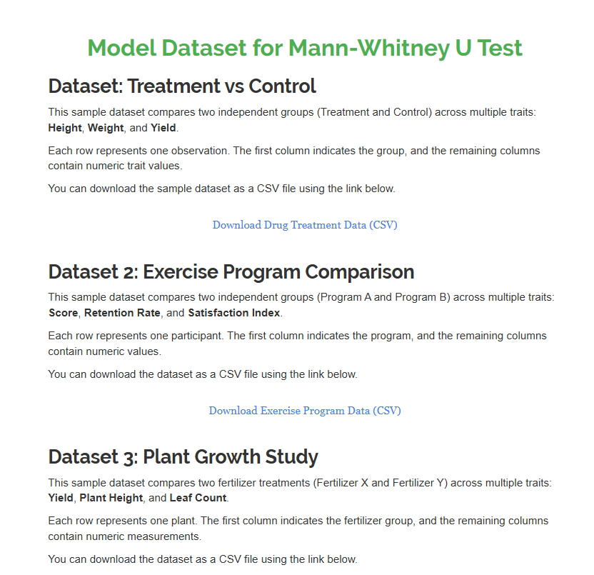
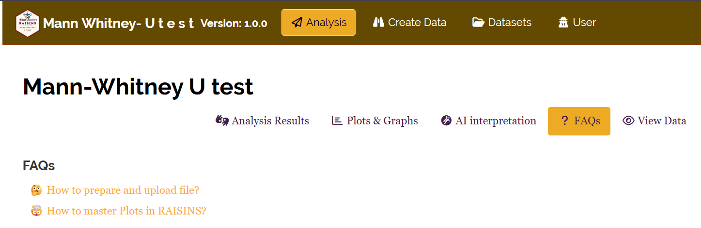
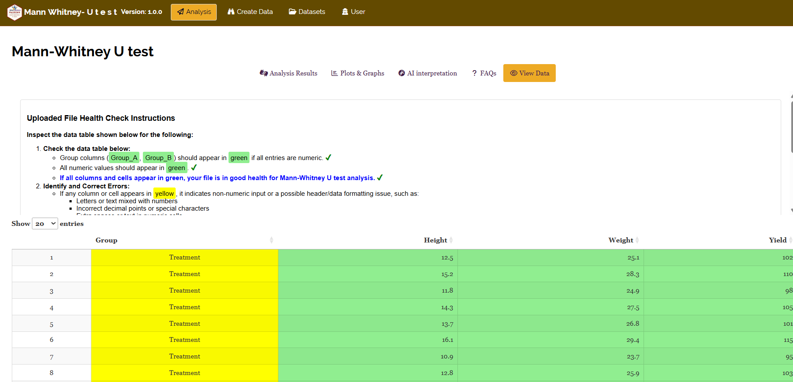

```{=html}
<style>
 sup {
   color: blue;
   font-size: 0.8em;
 }
 .affiliations {
   color: grey;
   font-size: 0.9em;
   margin-top: 0.2em;
 }
</style>
```

::: affiliations
<sup>1</sup>Statoberry LLP, <sup>2</sup>Department of Agricultural Statistics, Kerala Agricultural University
:::

ABSTRACT

::: {style="text-align: justify;"}
The **Mann-Whitney U Test** is a powerful non-parametric statistical procedure used to determine whether two independent groups differ significantly in their central tendency, without assuming a normal distribution in the underlying data. The **Mann-Whitney U Test** compares the rank sums of two independent samples and evaluates whether one group tends to have systematically higher or lower values than the other, making it particularly suitable for ordinal data, skewed distributions, or small sample sizes. In **RAISINS** you can perform the Mann-Whitney U Test very easily without writing a single line of code. This tutorial will guide you on how to perform the Mann-Whitney U Test in **RAISINS** and interpret the results effectively. In addition, you will get publication-ready tables and plots to support your findings. You can also perform multivariate analysis including MANOVA and PCA when multiple response variables are available.
:::

<details>

*Hover or click each point to see more information.*

```{=html}
<summary style="color: #5DADE2"; font-weight: bold;">
  Introduction Mann-Whitney U Test
</summary>
```

```{=html}
<style>
.hover-img {
  position: relative;
  display: inline-block;
  cursor: help;
  border-bottom: 1px dashed currentColor;
}

.hover-img img {
  position: absolute;
  left: 50%;
  top: 1.6em;
  transform: translateX(-50%);
  width: 260px;
  max-width: 70vw;
  height: auto;
  padding: 6px;
  background: white;
  border: 1px solid rgba(0,0,0,.15);
  border-radius: 12px;
  box-shadow: 0 10px 30px rgba(0,0,0,.18);
  opacity: 0;
  visibility: hidden;
  pointer-events: none;
  transition: opacity .15s ease, transform .15s ease, visibility .15s;
}

.hover-img:hover img {
  opacity: 1;
  visibility: visible;
  transform: translateX(-50%) translateY(6px);
  z-index: 999;
}
</style>
```

<ul><small> The Mann-Whitney U Test also known as the Wilcoxon Rank-Sum Test was developed independently by [Henry B. Mann]{.hover-img} and Donald R. Whitney in **1947**, building upon earlier work by Frank Wilcoxon (1945). Mann and Whitney sought to create a distribution-free alternative to the independent samples t-test, one that would remain valid when the assumption of normality could not be met. The test gained immediate traction in fields such as medicine, psychology, and biology, where data often violate parametric assumptions. Unlike the t-test, the Mann-Whitney U Test does not compare means but instead evaluates whether one distribution tends to produce larger values than the other using ranks rather than raw measurements. This rank-based approach makes it robust to outliers, non-normality, and ordinal-scale data, cementing its place as one of the most widely used non-parametric tests in modern statistical practice. </small></ul>

</details>

## Analysis of experiments {#AE}

::: {style="text-align: justify;"}
To get started, visit **RAISINS** [www.raisins.live](https://www.raisins.live) home page and go to **Analysis of experiments**. Here, you can see different statistical tests and experimental designs available in the app. In this tutorial, we focus on the **Mann-Whitney U Test**, the non-parametric equivalent of the independent samples t-test, as shown in @fig-aov.
:::

<!-- REPLACE THIS SCREENSHOT -->

-01.png){#fig-aov fig-align="center"}

## Mann-Whitney U Test (MWU) {#C}

::: {style="text-align: justify;"}
The Mann-Whitney U Test is a non-parametric statistical test used to compare two independent groups when the assumptions of the parametric t-test particularly normality cannot be satisfied. Instead of comparing means directly, the test assigns ranks to all observations combined and evaluates whether the rank sums of the two groups differ significantly. It is widely applicable across biological, agricultural, medical, and social research scenarios, particularly when dealing with ordinal data, small sample sizes, or heavily skewed distributions. A key strength of the test is its robustness: it is not influenced by extreme outliers the way a t-test would be. However, it is less powerful than the t-test when normality genuinely holds, and it tests for differences in the overall distribution rather than specifically in the mean. When more than two groups are involved, the Kruskal-Wallis test is the appropriate non-parametric alternative.
:::

<details>

```{=html}
<summary style="color: #5DADE2"; font-weight: bold;">
  MWU Test Concept
</summary>
```

::: callout-tip
#### The Mann-Whitney U Test (MWU) is a non-parametric test that compares two independent groups by ranking all observations together and evaluating whether one group systematically produces higher ranks than the other, requiring no assumption of normality.
:::

## A working example {#W}

::: {style="text-align: justify;"}
To make things simple and interesting, we'll explain Mann-Whitney U Test analysis step by step using a hypothetical example, so you can clearly see how it works and why it matters.

The image represents a structured dataset used in statistical analysis and experimental studies. In this dataset, each row corresponds to an individual observation or sample, while each column represents a specific variable measured during the experiment. The table contains both categorical and numerical data arranged systematically for analysis.The first column is the group column, which contains labels such as Treatment and Control. This column is considered a character or factor variable because it stores text categories rather than numerical values. It helps in grouping observations into different experimental conditions for comparison and interpretation.The remaining columns, including height, weight, and yield, are numerical variables. These variables contain quantitative measurements collected from each sample. Numerical columns are mainly used for statistical calculations, graphical representation, and comparison between groups.

Such a dataset structure is commonly used in biological, agricultural, and experimental research. The grouping variable helps researchers compare the effect of treatments, while the numerical variables provide measurable outcomes for statistical analysis and visualization.The arrangement of the data is shown in @fig-data.
:::

.png){#fig-data fig-align="center"}

::: {style="text-align: justify;"}
Data organized in MS Excel can be directly uploaded to **RAISINS** for analysis. For more details on data preparation see @sec-4. Two terms that we will use frequently are **Groups** and **Variables**. In our example, the Groups refer to the two treatment conditions **Control** and **Treated** and the Variables are the four response traits recorded: **Yield, Plant_Height, and Grain_Weight**.
:::

## How to prepare your data? {#sec-4 .H}

::: {style="text-align: justify;"}
Arranging data for uploading in **RAISINS** is very simple. Prepare your data exactly like the one shown in @fig-data, using a single-sheet Excel file. The first column should contain the group labels (e.g., "Control" or "Treated") and subsequent columns should contain the response variables. Make sure no blank rows are left above the data, and all columns have proper names. That's it your file is ready to upload.

Still if you have doubt, see @fig-4.

To prepare your dataset for analysis in **RAISINS**, you have two options:

Creating dataset in MS Excel

Creating your dataset directly within the **RAISINS** app
:::

-01.png){#fig-4 fig-align="center"}

## MWU analysis tab explained {#AO}

::: {style="text-align: justify;"}
In @fig-5, you can see the detailed view of the Analysis tab for the Mann-Whitney U Test, along with explanations of what each option does. This section helps you understand the purpose of every setting, so you can select the most appropriate ones for your data and analysis. Upload the prepared file by clicking Browse in the sidebar of the Analysis tab. When the file is uploaded, options to select the Group column and the response Variables will appear. Select the appropriate column under Groups and Variables. Ensure that the Group column contains exactly two distinct group labels the test is designed specifically for comparing two independent groups. Once you click the Run Analysis button, all relevant results and outputs appear instantly, leaving no room for confusion.
:::

.png){#fig-5 fig-align="center"}

::: {style="text-align: justify;"}
For some data, when there are large numbers of zeros, discrete values, or when the observed variables are not normally distributed, transformation on the dataset may still be relevant prior to analysis . **RAISINS** provides an inbuilt transformation option to assist with this.
:::

## Analysis results {#sec-7 .AR}

::: {style="text-align: justify;"}
Once your dataset is uploaded and groups and variables are selected, click on Run Analysis. **RAISINS** will perform the Mann-Whitney U Test for each selected variable. The test evaluates whether the rank distributions of the two groups differ significantly by computing the U statistic and its associated p-value (see @fig-100).
:::

**Table 1: Mann-Whitney U Test Summary**

<!-- REPLACE THIS SCREENSHOT -->

{#fig-100 fig-align="center"}

<details>

```{=html}
<summary style="color: #5DADE2"; font-weight: bold;"> Mann-Whitney U Test Table </summary>
```

<small> The Mann-Whitney U Test computes a U statistic for each variable by counting the number of times an observation from Group 1 precedes an observation from Group 2 in the combined ranking. Formally, if $n_1$ and $n_2$ are the sample sizes of the two groups, the U statistics are:

$$U_1 = n_1 n_2 + \frac{n_1(n_1+1)}{2} - R_1$$

$$U_2 = n_1 n_2 + \frac{n_2(n_2+1)}{2} - R_2$$

where $R_1$ and $R_2$ are the rank sums for Group 1 and Group 2 respectively. The test statistic used is $U = \min(U_1, U_2)$.

For large samples, the U statistic approximates a normal distribution and a z-score is computed:

$$z = \frac{U - \mu_U}{\sigma_U}, \quad \text{where} \quad \mu_U = \frac{n_1 n_2}{2}, \quad \sigma_U = \sqrt{\frac{n_1 n_2 (n_1 + n_2 + 1)}{12}}$$

Significance is indicated by an asterisk (\*) for the **5%** level and two asterisks (\*\*) for the **1%** level of significance, displayed as superscripts for each variable in the result table.

If the p-value is less than the chosen significance level (typically 0.05), the null hypothesis that the two groups have identical distributions is rejected, indicating a statistically significant difference between the groups for that variable. </small>

</details>

### Interpretation from @fig-100

::: {style="text-align: justify;"}
The Mann-Whitney U Test result table presents the U statistic, z-score, and p-value for each response variable. For **Yield**, the U statistic of 54.00 with a corresponding p-value of 0.012 indicates a statistically significant difference between the Control and Treated groups at the 5% level, suggesting that the bio-stimulant has a meaningful effect on yield. For **Plant_Height**, the p-value of 0.038 also falls below the 0.05 threshold, confirming a significant difference. For **Tiller_Count** (p = 0.071) and **Grain_Weight** (p = 0.143), the differences between groups are not statistically significant at the 5% level, implying that the bio-stimulant did not produce a detectable effect on these variables under the current experimental conditions. Overall, the results indicate that the Treated group shows measurably different rank distributions for Yield and Plant_Height relative to the Control.

@sec-8 provides detailed information on the effect size measures associated with the Mann-Whitney U Test.
:::

**Table 2: Detailed group-wise rank summary**

<!-- REPLACE THIS SCREENSHOT -->

{#fig-101 fig-align="center"}

<details>

```{=html}
<summary style="color: #5DADE2"; font-weight: bold;">Overview of MWU Results and Interpretation
</summary>
```

<small>

1.  *Groups and Response Variables*

**Groups**: The two independent categories being compared (e.g., Control and Treated). Each observation belongs to exactly one group. The test evaluates whether one group systematically tends to have higher ranked values than the other.

**Response Variable**: The dependent variable or specific measurement (e.g., Yield, Plant_Height) recorded for each observation to evaluate group differences.

2.  *Test Statistics*

**U Statistic**: The Mann-Whitney U value, computed from the rank sums of the two groups. A smaller U relative to its maximum possible value $(n_1 \times n_2)$ indicates a greater difference between groups.

**z-score**: The standardised test statistic computed from the U statistic, used for large-sample inference. A z-score with an absolute value greater than 1.96 generally corresponds to significance at the 5% level.

**p-value**: The probability that the observed rank differences arose by chance alone. A p-value below 0.05 indicates statistical significance.

3.  *Effect Size*

**r (Effect Size)**: Computed as $r = z / \sqrt{N}$, where N is the total sample size. Values of 0.1, 0.3, and 0.5 correspond to small, medium, and large effect sizes respectively, providing a standardised measure of the practical magnitude of the group difference.

4.  *Rank Summary*

**Mean Rank**: The average rank assigned to observations within each group. A higher mean rank in one group suggests that group tends to have larger values.

**Rank Sum**: The total sum of ranks assigned to each group. Used directly in the computation of the U statistic.

</small>

</details>

### Interpretation from @fig-101

::: {style="text-align: justify;"}
The group-wise rank summary confirms the direction of differences identified in the U Test. For **Yield**, the Treated group has a higher mean rank (19.40) compared to the Control group (11.60), indicating that treated plots consistently produced higher yields. The effect size (r = 0.42) approaches the threshold for a large effect, suggesting practical as well as statistical significance. For **Plant_Height**, the Treated group again dominates in rank (mean rank = 18.73), with a moderate effect size (r = 0.34). In contrast, **Tiller_Count** and **Grain_Weight** show smaller rank separations between groups, consistent with their non-significant p-values. Taken together, the rank summary helps researchers understand not just whether groups differ, but in which direction and to what practical degree.
:::

::: callout-tip
#### Effect Size Interpretation for the Mann-Whitney U Test

The effect size **r** for the Mann-Whitney U Test is calculated as $r = z / \sqrt{N}$. A value of **r ≤ 0.1** indicates a **small** effect, **r ≈ 0.3** indicates a **medium** effect, and **r ≥ 0.5** indicates a **large** effect. Always report both the p-value and the effect size to give a complete picture of the group difference.
:::

::: callout-tip
#### One-Tailed vs Two-Tailed Testing

The Mann-Whitney U Test in **RAISINS** performs a **two-tailed** test by default, which evaluates whether the groups differ in either direction. If you have a directional hypothesis (e.g., the Treated group will have *higher* yield), a one-tailed test halves the p-value. Always decide on the directionality of your hypothesis before conducting the test to avoid inflation of Type I error.
:::

## Multiple Comparison Tests {#sec-8 .MCT}

<details>

```{=html}
<summary style="color: #5DADE2"; font-weight: bold;"> What is a Post-hoc test? </summary>
```

<small> A post-hoc test (from the Latin "after this") is a follow-up statistical procedure conducted after a primary omnibus test to determine precisely where significant differences lie. In the context of the Mann-Whitney U Test which compares exactly two groups post-hoc comparisons are not required, since a significant result directly implies the two groups differ. However, when the analysis is extended to multiple variables simultaneously, controlling for the familywise error rate using correction procedures such as the Bonferroni or Benjamini-Hochberg method becomes important to avoid false positives arising from multiple testing. </small>

</details>

::: {style="text-align: justify;"}
Since the Mann-Whitney U Test is designed for comparing exactly **two independent groups**, formal post-hoc pairwise comparisons (such as LSD, Tukey's HSD, or DMRT, which are relevant for multi-group ANOVA) are not applicable. Instead, when testing multiple response variables simultaneously, researchers must account for the increased probability of false positives due to multiple comparisons. **RAISINS** provides the following correction options for multi-variable Mann-Whitney analyses.
:::

<!-- REPLACE THIS SCREENSHOT -->

-01.png){#fig-MCT fig-align="center"}

<details>

```{=html}
<summary style="color: #5DADE2"; font-weight: bold;"> Correction Methods for Multiple Variables </summary>
```

<small>

**Bonferroni Correction** is the most conservative approach. The significance threshold α is divided by the number of tests conducted (k), giving a corrected threshold of $\alpha^* = \alpha / k$. For example, if four variables are tested at α = 0.05, each individual test must achieve a p-value below 0.0125 to be declared significant. The Bonferroni correction strongly controls the familywise error rate but increases the risk of Type II errors (false negatives), particularly when many variables are tested.

**Benjamini-Hochberg (BH) Correction** (also known as the False Discovery Rate, or FDR, correction) is a less conservative procedure that controls the expected proportion of false positives among all rejected hypotheses. P-values are ranked from smallest to largest, and each is compared against a progressively relaxed threshold. This method offers a better balance between sensitivity and specificity and is widely preferred when testing a large number of variables.

**No Correction** applies the Mann-Whitney U Test independently to each variable at the nominal α level. This is acceptable when only one or two variables are tested, or when the analysis is explicitly exploratory in nature.

</small>

</details>

::: {style="text-align: justify;"}
**Which correction method to use?** If you are testing a small number of pre-specified response variables (e.g., two or three) and your analysis is confirmatory, the **Bonferroni correction** is appropriate. If you are conducting a broader exploratory analysis across many variables, the **Benjamini-Hochberg correction** is recommended as it maintains more statistical power while controlling false discovery. For purely exploratory analyses where all results will be followed up with further experimentation, applying no correction may be justified but this should be explicitly stated in any report or publication.
:::

## Plots and Graphs {#BP}

::: {style="text-align: justify;"}
**RAISINS** is designed for a smooth and hassle-free experience. Once you click the Run Analysis button, all relevant results and outputs appear instantly leaving no room for confusion. We have ensured that every possible plot related to the Mann-Whitney U Test is readily available. Simply click on the Plots And Graphs tab to view them (See @fig-8). Each plot comes with a gear icon at the top-left corner, allowing you to customize its appearance. You can also download these plots in high-quality PNG format (300 dpi), JPEG, TIFF, PDF, and SVG for use in reports or presentations.
:::

### Customizing plots

::: {style="text-align: justify;"}
**RAISINS** provides users various customization features for the plots to enhance visualization according to their requirements. **Click** on @fig-8 to get a clear idea of the customizing features.
:::

.png){#fig-8 fig-align="center"}

::: {style="text-align: justify;"}
From @fig-9 to @fig-13, you can see the different types of plots available in **RAISINS** for the Mann-Whitney U Test. Each one is visually illustrated and accompanied by a clear, insightful description below, making it easy to understand.
:::

```{=html}
<script>
document.addEventListener('DOMContentLoaded', function() {
  const descriptions = document.querySelectorAll('.plot-description');
  descriptions.forEach(desc => {
    desc.style.display = 'none';
  });
});

function showDescription(id) {
  document.getElementById(id).style.display = 'flex';
}

function hideDescription(id) {
  document.getElementById(id).style.display = 'none';
}
</script>
```

```{=html}
<style>
.plot-container {
  position: relative;
  display: inline-block;
  cursor: pointer;
  width: 350px;
  height: 300px;
  overflow: hidden;
  margin: 10px;
}

.plot-container img {
  width: 350px;
  height: 300px;
  object-fit: cover;
  border: 3px solid #ddd;
  border-radius: 8px;
  transition: transform 0.3s ease, box-shadow 0.3s ease;
}

.plot-container:hover img {
  transform: scale(1.05);
  box-shadow: 0 4px 12px rgba(0, 0, 0, 0.2);
}

.plot-description {
  display: none !important;
  position: absolute;
  top: 0;
  left: 0;
  width: 100%;
  height: 100%;
  z-index: 1000;
  background: linear-gradient(135deg, rgba(255, 107, 107, 0.8), rgba(255, 142, 83, 0.8));
  color: white;
  padding: 15px;
  border-radius: 8px;
  box-shadow: 0 4px 15px rgba(0, 0, 0, 0.3);
  font-size: 14px;
  line-height: 1.5;
  display: flex;
  align-items: center;
  justify-content: center;
  text-align: center;
  animation: fadeIn 0.3s ease-in;
  pointer-events: none;
  border: 2px solid rgba(255, 255, 255, 0.5);
}

.plot-container:hover .plot-description {
  display: flex !important;
}

@keyframes fadeIn {
  from { opacity: 0; transform: scale(0.95); }
  to { opacity: 1; transform: scale(1); }
}

#boxplot-desc { background: linear-gradient(135deg, rgba(255, 107, 107, 0.8), rgba(255, 142, 83, 0.8)); }
#barplot-desc { background: linear-gradient(135deg, rgba(161, 140, 209, 0.8), rgba(251, 194, 235, 0.8)); }
#connectedplot-desc { background: linear-gradient(135deg, rgba(0, 221, 235, 0.8), rgba(38, 166, 154, 0.8)); }
#meanvalueplot-desc { background: linear-gradient(135deg, rgba(255, 154, 139, 0.8), rgba(255, 106, 136, 0.8)); }
#violinplot-desc { background: linear-gradient(135deg, rgba(132, 250, 176, 0.8), rgba(143, 211, 244, 0.8)); }
</style>
```

:::::::::::::::::::::::: grid
:::::: g-col-6
::::: {.plot-container onmouseover="showDescription('boxplot-desc')" onmouseout="hideDescription('boxplot-desc')"}
<!-- REPLACE THIS SCREENSHOT -->

{#fig-9}

:::: {#boxplot-desc .plot-description}
::: {style="text-align: justify;"}
A **box plot** in the MannWhitney U test is used to visually compare the distribution of two independent groups. It displays the median, interquartile range, minimum, maximum, and possible outliers of the data. The plot helps identify differences in central tendency and variability between groups without assuming normal distribution. It is commonly used alongside the MannWhitney U test to support interpretation of non-parametric comparisons.
:::
::::
:::::
::::::

:::::: g-col-6
::::: {.plot-container onmouseover="showDescription('violinplot-desc')" onmouseout="hideDescription('violinplot-desc')"}
<!-- REPLACE THIS SCREENSHOT -->

{#fig-10}

:::: {#violinplot-desc .plot-description}
::: {style="text-align: justify;"}
A **rain cloud plot** is a combination of a violin plot, box plot, and scatter plot used to visualize data distribution in the Mann–Whitney U test. It displays the density of the data, median, interquartile range, and individual observations together in a single graph. This plot provides a detailed understanding of group differences, spread, and variability without assuming normal distribution. It is useful for comparing two independent groups in non-parametric analysis.
:::
::::
:::::
::::::

:::::: g-col-6
::::: {.plot-container onmouseover="showDescription('barplot-desc')" onmouseout="hideDescription('barplot-desc')"}
<!-- REPLACE THIS SCREENSHOT -->

{#fig-11}

:::: {#barplot-desc .plot-description}
::: {style="text-align: justify;"}
A **beeswarm plot** is a data visualization method used to display individual observations of two or more groups in the MannWhitney U test. Each data point is shown separately and arranged to avoid overlap, giving a clear view of data distribution and sample density. It helps identify variability, clustering, and outliers within groups. Beeswarm plots are especially useful in non-parametric analysis because they show the actual spread of observations without assuming normal distribution.
:::
::::
:::::
::::::

:::::: g-col-6
::::: {.plot-container onmouseover="showDescription('meanvalueplot-desc')" onmouseout="hideDescription('meanvalueplot-desc')"}
<!-- REPLACE THIS SCREENSHOT -->

{#fig-12}

:::: {#meanvalueplot-desc .plot-description}
::: {style="text-align: justify;"}
A **strip chart with significance** is a graphical representation used in the MannWhitney U test to display individual data points of different groups along with statistical significance levels. Each observation is plotted separately, allowing clear visualization of data distribution, spread, and overlap between groups. Significance indicators such as p-values or asterisks (*, **,*** ) are added to show whether the difference between groups is statistically significant. This plot is useful for presenting non-parametric comparison results in a simple and informative manner.
:::
::::
:::::
::::::

::::::: g-col-6
:::::: {.plot-container onmouseover="showDescription('connectedplot-desc')" onmouseout="hideDescription('connectedplot-desc')"}
::: {style="text-align: center;"}
<!-- REPLACE THIS SCREENSHOT -->

{#fig-13}
:::

:::: {#connectedplot-desc .plot-description}
::: {style="text-align: justify;"}
A **half-eye plot** is a statistical visualization that combines a density plot and interval estimates to display the distribution of data in the Mann–Whitney U test. It shows the shape of the data distribution along with measures such as the median and confidence intervals. The plot helps compare variability, central tendency, and uncertainty between groups in a clear and compact form. Half-eye plots are useful in non-parametric analysis because they provide both distributional and summary information simultaneously.
:::
::::
::::::
:::::::
::::::::::::::::::::::::

## AI Interpretation {#AI}

::: {style="text-align: justify;"}
**RAISINS** features an integrated AI Assistant designed to provide automated, plain-language interpretation of your Mann-Whitney U Test results. Once the analysis is complete, the AI Assistant reads the U statistics, p-values, effect sizes, and group rank summaries to generate a concise narrative summary identifying which variables show significant differences, describing the direction of those differences, and suggesting appropriate next steps such as reporting effect sizes, applying multiple comparison corrections, or conducting additional analyses. The AI Assistant makes interpreting non-parametric results accessible even to users without a deep statistical background. See @fig-ai.
:::

{#fig-ai fig-align="center"}

## Preparing your data {#PRE}

::: {style="text-align: justify;"}
"Your analysis is only as good as your data! Feed RAISINS high-quality data, and it will deliver powerful insights feed it messy data, and the results won't be trustworthy."

1.  Create your dataset in MS Excel

2.  Build your dataset directly within the RAISINS app
:::

## Preparing data in MS Excel {#EX}

::: {style="text-align: justify;"}
Open a new blank sheet in MS Excel with only one sheet included, and avoid adding any unnecessary content. The dataset should follow a column-based format, where the first column represents the group label you can name this column appropriately, such as "Group" or "Treatment." The group column must contain exactly **two distinct values** (e.g., "Control" and "Treated"), repeated across all rows belonging to each group. All response variables under study (e.g., Yield, Plant_Height, Tiller_Count, Grain_Weight) should be arranged in separate columns. The file can be saved in CSV, XLS, or XLSX format, but CSV is recommended as it is lighter and enables faster loading. Ensure that there are no unwanted spaces in column names or group names. For reference, see the structure shown in @fig-pp. As illustrated in @fig-data, group labels must appear repeatedly for each observation, and the data can also be arranged as shown in @fig-kk.
:::

{#fig-pp}

{#fig-kk}

<details>

<summary>Dataset Creation Rules</summary>

<small> 1. **Column Naming Convention** - No spaces allowed in column names.\
- Use underscores (`_`) or full stops (`.`) for separation. - Avoid symbols and special characters like %,# etc 2. **Data Arrangement** - Start data arrangement towards the upper-left corner.\
- Ensure the row above the data is not blank. 3. **Cell Management** - Avoid typing or deleting in cells without data.\
- If needed, select affected cells, right-click, and select **Clear Contents**. 4. **Column Relevance** - Name all columns meaningfully.\
- Exclude unnecessary columns not required for analysis. 5. **Group Column** - Ensure the group column contains exactly two distinct values with consistent spelling and capitalisation (e.g., "Control" and "Treated" — not "control" and "Treated"). </small>

</details>

<details>

<summary>How to Save as CSV in MS Excel</summary>

<small> 1. **Open Your Workbook**

```         
-   Ensure your data is arranged properly with only one sheet.
```

2.  **Click 'File' Menu**

    - Go to the top-left corner and click on **File**.

3.  **Choose 'Save As' or 'Save a Copy'**

    - Select the location where you want to save your file.

4.  **Set File Type to CSV**

    - In the **'Save as type'** dropdown menu, choose **CSV (Comma delimited) (\*.csv)**.

5.  **Name Your File**

    - Enter a relevant file name without spaces (use underscores if needed).

6.  **Click 'Save'**

    - Click **Save** to export the file.

> 💡 Tip: Before saving, double-check that your data is on the first sheet and follows the required format (e.g., no empty rows above the data, meaningful column names, exactly two distinct group labels). </small>

</details>

## Creating dataset in RAISINS {#CR}

::: {style="text-align: justify;"}
If you're unsure about the correct format for creating a dataset, don't worry **RAISINS** offers an option to create data directly within the app using the prescribed template. Here's how:

- Navigate to the **Create Data Tab**

- Select the number of **Groups** (for Mann-Whitney U Test, this should be set to **2**)

- Select number of **Replications** (observations per group)

- Select number of **Characters** (response variables)

- Click on **Create** button

Model layout will appear as shown in @fig-createdata. Now you may enter the observations manually into the CSV file once downloaded, or paste the observations straight into the file provided. Once you have entered the observations in the layout, download the csv file and upload in Analysis.
:::

-01.png){#fig-createdata fig-align="center"}

## Model datasets {#M}

::: {style="text-align: justify;"}
To test the app or better understand the data arrangement, we provide model datasets within the app. You can download them from the Datasets tab. A model dataset for the Mann-Whitney U Test is available, pre-formatted with two groups and multiple response variables, ready to upload directly into the Analysis tab.
:::

{#fig-188 fig-align="center"}

## FAQ's {#F}

::: {style="text-align: justify;"}
The app includes a dedicated FAQs tab to help clarify common doubts and guide users through various features. This section provides detailed answers to frequently asked questions about the Mann-Whitney U Test including when to use it versus the t-test, how to handle ties in the data, how to interpret the U statistic, and how to report results in academic publications. If you're ever unsure about how something works, the FAQs tab is a great place to start.
:::

{#fig-148 fig-align="center"}

## View data {#U}

::: {style="text-align: justify;"}
View Data serves as the primary diagnostic tool for ensuring data integrity before analysis. Upon uploading your dataset, the system performs an automated Health Check to validate column types and formatting. For the MannWhitney U Test, the Health Check specifically verifies that the Group column contains exactly two distinct values, that all response variable columns contain numeric data, and that there are no missing values that could distort the rank computation. Addressing any flagged issues before running the analysis ensures that the results are accurate and reproducible.
:::

{fig-align="center"}

------------------------------------------------------------------------
