```{=html}
<style>
 sup {
   color: blue;
   font-size: 0.8em;
 }
 .affiliations {
   color: grey;
   font-size: 0.9em;
   margin-top: 0.2em;
 }
</style>
```

::: affiliations
<sup>1</sup>Statoberry LLP, <sup>2</sup>Department of Agricultural Statistics, Kerala Agricultural University
:::

ABSTRACT

::: {style="text-align: justify;"}
Pooled Split Plot Design **(PSPD)** is a multi-environment experimental design used to evaluate the effects of main-plot and sub-plot factors across two or more locations or years, enabling the estimation of treatment effects and their interactions with environments while accounting for heterogeneity through blocking. **PSPD** pools data from independently conducted split plot experiments at multiple sites or seasons, allowing researchers to draw broader and more reliable conclusions about the performance of treatments across varying environmental conditions. In **RAISINS** you can perform **PSPD** very easily without writing a single line of code. This tutorial will guide you, how to perform **PSPD** very easily in **RAISINS** and interpret the results effectively. In addition, you will get tables and plots ready for publication. You can also perform a multivariate analysis including MANOVA and PCA.
:::

<details>

*Hover or click each point to see more information.*

```{=html}
<summary style="color: #5DADE2"; font-weight: bold;">
  Introduction Pooled Split Plot Design
</summary>
```

```{=html}
<style>
.hover-img {
  position: relative;
  display: inline-block;
  cursor: help;
  border-bottom: 1px dashed currentColor;
}
.hover-img img {
  position: absolute;
  left: 50%;
  top: 1.6em;
  transform: translateX(-50%);
  width: 260px;
  max-width: 70vw;
  height: auto;
  padding: 6px;
  background: white;
  border: 1px solid rgba(0,0,0,.15);
  border-radius: 12px;
  box-shadow: 0 10px 30px rgba(0,0,0,.18);
  opacity: 0;
  visibility: hidden;
  pointer-events: none;
  transition: opacity .15s ease, transform .15s ease, visibility .15s;
}
.hover-img:hover img {
  opacity: 1;
  visibility: visible;
  transform: translateX(-50%) translateY(6px);
  z-index: 999;
}
</style>
```

<ul><small> The split plot design originated in the early twentieth century at Rothamsted Experimental Station, largely through the pioneering contributions of [Frank Yates]{.hover-img}, who formalized its analysis as an extension of the randomized block design to accommodate treatments that differ in the precision with which they can be applied. Yates recognized that certain factors such as irrigation, tillage, or plant spacing — require large experimental units for practical application, while others such as variety or fertilizer rate can be applied to much smaller plots within those units. By nesting sub-plot treatments within main plots, the split plot design achieves two independent error terms: one for the main-plot factor and one for the sub-plot factor and their interaction, resulting in greater sensitivity for detecting sub-plot and interaction effects. The **Pooled Split Plot Design (PSPD)** extends this framework by combining independently conducted split plot experiments from multiple locations, seasons, or years into a single unified analysis. This pooling approach, advocated by researchers in agricultural multi-environment trial methodology through the mid-twentieth century onwards, partitions the total variation into environments, blocks within environments, main-plot effects and their interaction with environments, and sub-plot effects and their interaction with environments. The PSPD became indispensable in agronomy, plant breeding, and horticultural research wherever a single-location experiment was insufficient to draw reliable recommendations applicable across diverse growing conditions. </small></ul>

</details>

## Analysis of experiments {#AE}

::: {style="text-align: justify;"}
To get started, visit **RAISINS** [www.raisins.live](https://www.raisins.live) home page and go to **Analysis of experiments**. Here, you can see different multi-environment experimental designs. In this tutorial, we focus on **Pooled Split Plot Design (PSPD)**, as shown in @fig-aov.
:::

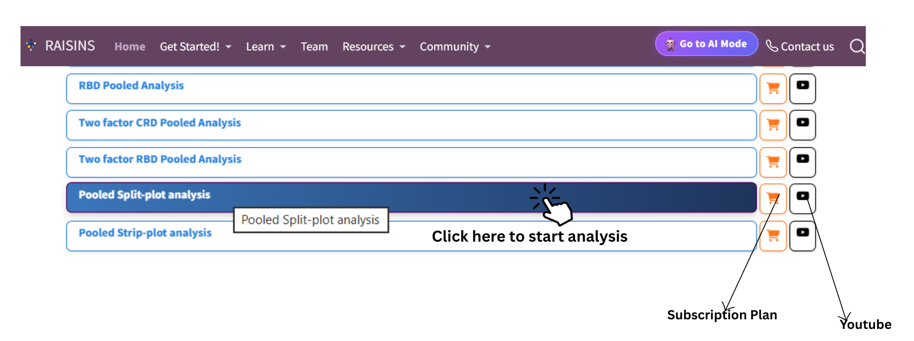{#fig-aov fig-align="center"}

## Pooled Split Plot Design (PSPD) {#C}

::: {style="text-align: justify;"}
A Pooled Split Plot Design (**PSPD**) is a multi-environment experimental layout in which a split plot experiment comprising a main-plot factor and a sub-plot factor arranged within randomized complete blocks is conducted independently at two or more locations or across two or more seasons, and the resulting datasets are then combined for a joint statistical analysis. The main-plot factor, which requires larger experimental units (e.g., irrigation regime, tillage method, or cropping system), is assigned randomly to main plots within each block at each environment, while the sub-plot factor (e.g., variety or fertilizer level) is randomized within each main plot. Because the experiment is replicated across environments, the PSPD enables the estimation of main effects and their interactions with the environment (location × treatment interaction), which is critical for assessing the stability and adaptability of treatments. **PSPD** is widely employed in multi-location variety trials, multi-season agronomy experiments, and coordinated research programmes where treatment recommendations must be validated under diverse agroecological conditions. Its principal advantage is the increased generalizability of conclusions; its main limitation is that error variances may differ across environments, requiring careful interpretation and, in some cases, separate error terms for each environment. When only one environment is available, a standard Split Plot Design in Randomized Block Design (SPD-RBD) is the appropriate choice.
:::

<details>

```{=html}
<summary style="color: #5DADE2"; font-weight: bold;">
  PSPD Layout
</summary>
```

<ul>

<small>

@fig-lay visually represents a Pooled Split Plot Design arrangement across two environments (locations or seasons). Within each environment, blocks are formed to absorb local environmental heterogeneity. Each block is divided into main plots corresponding to the levels of the main-plot factor (e.g., M~1~ and M~2~), and each main plot is further subdivided into sub-plots corresponding to the levels of the sub-plot factor (e.g., S~1~, S~2~, and S~3~). The main-plot factor levels are randomized among main plots within each block independently, and the sub-plot factor levels are randomized within each main plot independently. This nested randomization structure gives rise to two distinct error terms: the main-plot error (block × main plot interaction within environments) used to test the main-plot factor, and the sub-plot error (the pooled residual) used to test the sub-plot factor and all interaction effects including the environment × main plot and environment × sub-plot interactions. Pooling across environments adds the Environment source of variation and its interaction terms to the ANOVA, making the PSPD a powerful tool for multi-environment inference.

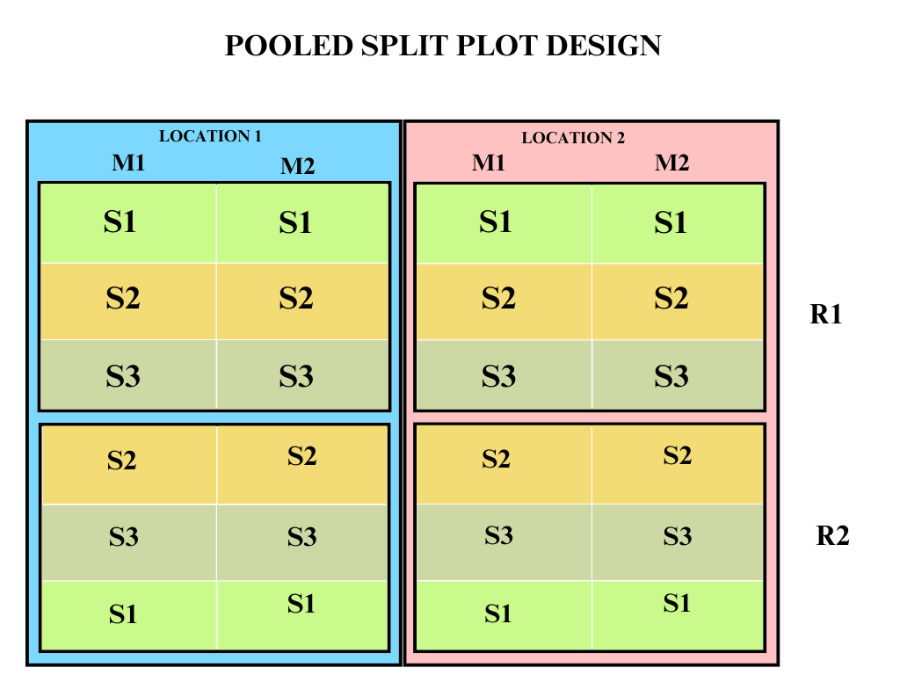{#fig-lay fig-align="center"}

</small>

</ul>

</details>

::: callout-tip
#### Pooled Split Plot Design (PSPD) is a multi-environment factorial design where split plot experiments conducted at two or more locations or seasons are combined into a single analysis, enabling simultaneous estimation of main-plot effects, sub-plot effects, their interaction, and all environment interaction terms.
:::

## A working example {#W}

::: {style="text-align: justify;"}
To make things simple and interesting, we'll explain **PSPD** analysis step by step using a hypothetical example, so you can clearly see how it works and why it matters. Consider a multi-location field experiment conducted across **two locations** (Location 1: Thrissur and Location 2: Palakkad) to evaluate the effects of two factors on rice production: **Main Plot Factor M Irrigation regime** (M~1~: Alternate Wetting and Drying, M~2~: Continuous Flooding) and **Sub Plot Factor S Variety** (C~1~: IR64, C~2~: Swarna, ). At each location, the experiment was laid out in a Randomized Complete Block Design with **3 replicate blocks**, giving a total of 2 locations × 2 main plots × 2 sub-plots × 4 blocks = **32 experimental plots per location**, and **64 plots** across the pooled dataset. Observations were recorded for four variables: **yield** (grain yield in kg/ha), **Char1** (plant height in cm), **Char2** (number of tillers per plant), and **FW** (fresh weight in g). Our aim is to test whether the irrigation regime, variety, their interaction, and their interactions with location produce statistically significant differences in the response variables using the pooled ANOVA. The arrangement of the data is shown in @fig-data.
:::

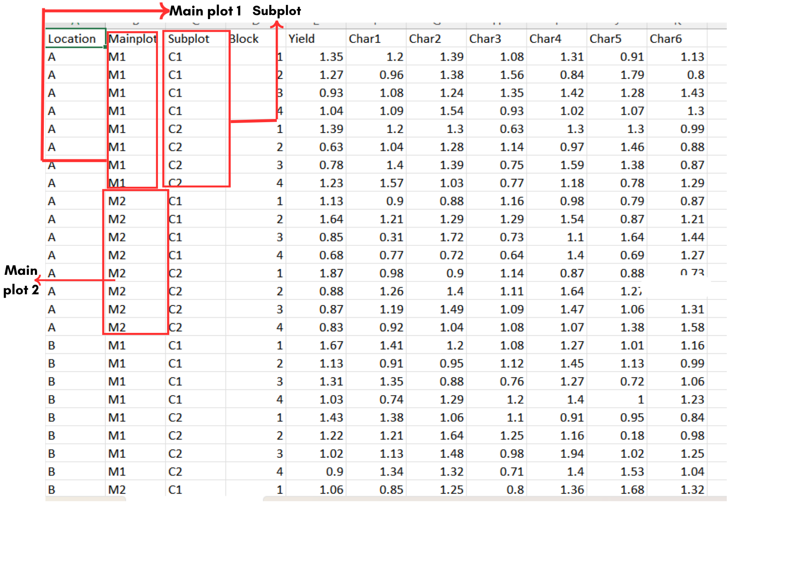{#fig-data fig-align="center"}

::: {style="text-align: justify;"}
Data organized in MS Excel can be directly uploaded to **RAISINS** for analysis. For more details on data preparation see @sec-4. Two terms that we will use frequently are **Treatments** and **Variables**. In our example, the Treatments refer to the combinations of Irrigation regime and Variety levels (M~1~S~1~, M~1~S~2~, M~1~S~3~, M~2~S~1~, M~2~S~2~, M~2~S~3~) tested across two locations, and the Variables are the four traits mentioned earlier **yield, Char1, Char2, and FW**.
:::

## How to prepare your data? {#sec-4 .H}

::: {style="text-align: justify;"}
Arranging data for uploading in **RAISINS** is very simple. Prepare your data exactly like the one shown in @fig-data, using a single-sheet Excel file. Make sure no blank rows are left above, and all columns have proper names. That's it your file is ready to upload.

Still if you have doubt, see @fig-4.

To prepare your dataset for analysis in **RAISINS**, you have two options:

Creating dataset in MS Excel

Creating your dataset directly within the **RAISINS** app
:::

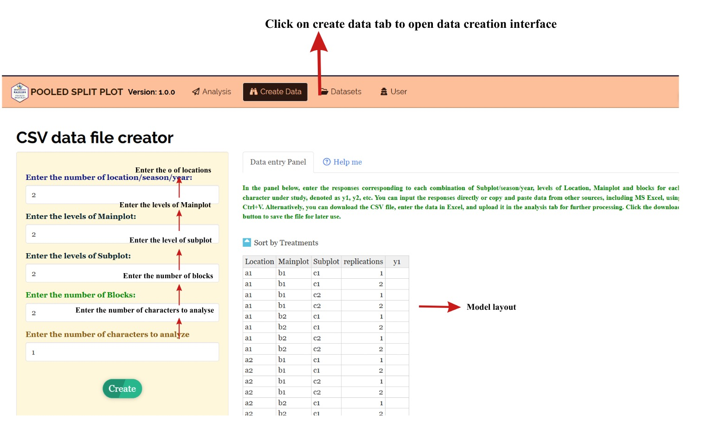{#fig-4 fig-align="center"}

## PSPD analysis tab explained {#AO}

::: {style="text-align: justify;"}
In @fig-5, you can see the detailed view of the Analysis tab, along with explanations of what each option does. This section helps you to understand the purpose of every setting, so you can select the most appropriate ones for your data and analysis. Now, upload the prepared file by clicking Browse in the sidebar of the Analysis tab. When the file is uploaded, options to select the **Environment** column (Location/Season), **Block** column, **Main Plot Factor**, **Sub Plot Factor**, and the **Response Variables** will appear. Select the appropriate columns under each field. Once you click the Run Analysis button, all relevant results and outputs appear instantly leaving no room for confusion.
:::

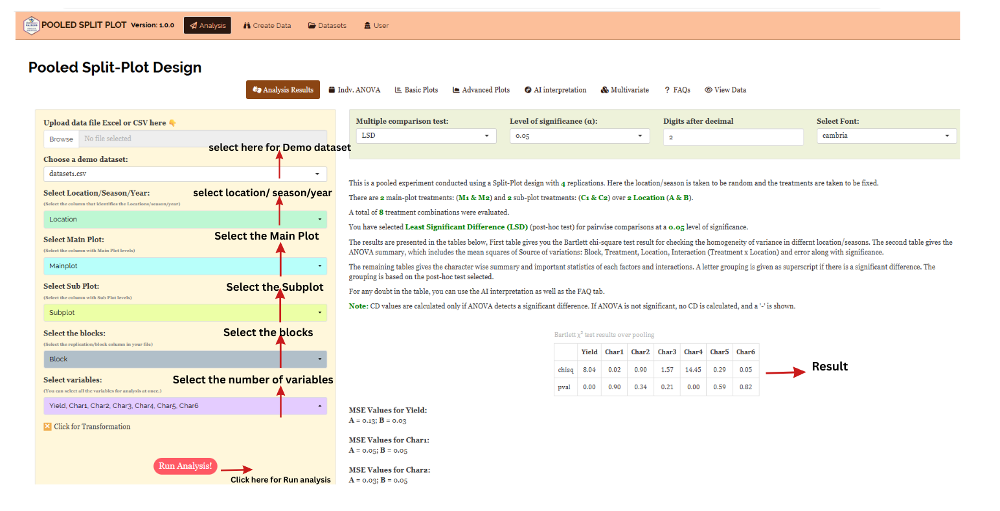{#fig-5 fig-align="center"}

::: {style="text-align: justify;"}
For some data, when there are a large number of zeros, discrete values, or when the observed variables are not normally distributed, we need to apply a transformation on the dataset @sec-6. Here, **RAISINS** provides an inbuilt transformation option.
:::

## Transformation {#sec-6 .T}

::: {style="text-align: justify;"}
Log, square root, and arcsine transformations are often used in **PSPD** analysis to make data more normal and reduce uneven variation. Researchers can use these transformations when analyzing experimental data in **RAISINS** as shown in @fig-6.
:::

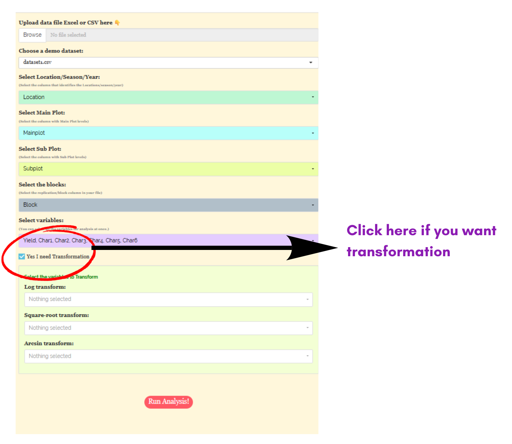{#fig-6 fig-align="center"}

::: {style="text-align: justify;"}
**Logarithmic transformation** is a mathematical procedure used to convert a skewed distribution into a more symmetrical one by replacing each data point (x) with its logarithm. This technique is specifically applied to positive, continuous data where the variance is proportional to the mean, a relationship common in phenomena that exhibit multiplicative or exponential growth.

**Square root transformation** is a statistical method used to stabilize variance and reduce right-skewness by replacing each data point (x) with its square root. It is primarily applied to non-negative, discrete "count" data such as those following a Poisson distribution, where the variance of the data tends to increase in proportion to the mean. By compressing the upper end of the scale more significantly than the lower end, this transformation brings the data closer to a normal distribution, satisfying the homoscedasticity requirements of many parametric statistical tests.

**Arcsine transformation** (also known as the angular transformation) is a mathematical technique specifically designed for data expressed as proportions or percentages bounded between 0 and 1. By taking the inverse sine of the square root of the proportion, this transformation stretches the ends of the distribution near 0 and 1, where variance is naturally small. It is primarily used to achieve homoscedasticity in binomial data.
:::

> After choosing the appropriate transformation proceed to @sec-7 for analysis.

## Analysis results {#sec-7 .AR}

::: {style="text-align: justify;"}
Once your dataset is uploaded, click on Run Analysis, and a pooled factorial **ANOVA** will be performed. Analysis of Variance **(ANOVA)** is a statistical technique used to test the significance of differences among population means by partitioning total variation into components attributable to **Environments (Locations)**, **Blocks within Environments**, **Main Plot Factor (M)**, the **Environment × M interaction**, the **Main Plot Error**, the **Sub Plot Factor (S)**, the **M × S interaction**, the **Environment × S interaction**, the **Environment × M × S interaction**, and the **Sub Plot Error (Residual)**, comparing them using the F-test; see @fig-100.
:::

**Table 1 ANOVA summary**

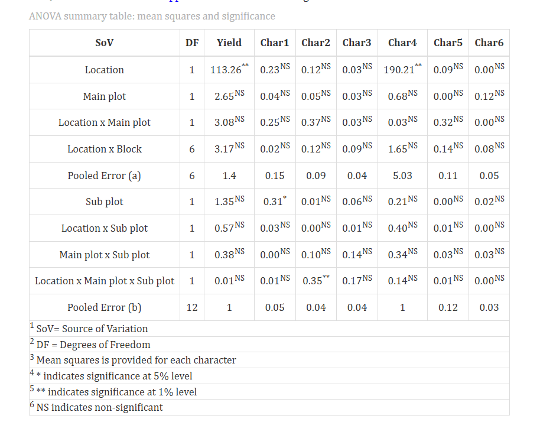{#fig-100 fig-align="center"}

<details>

```{=html}
<summary style="color: #5DADE2"; font-weight: bold;"> ANOVA table </summary>
```

<small> In a Pooled Split Plot Design (**PSPD**), the analysis of variance **(ANOVA)** partitions the total sum of squares into the following sources of variation. At the whole-plot level: Environments (E) with degrees of freedom = e−1 (where e = number of environments), Blocks within Environments with df = e(r−1) (where r = number of blocks per environment), Main Plot Factor (M) with df = m−1 (where m = number of main plot levels), Environment × M interaction with df = (e−1)(m−1), and Main Plot Error with df = e(r−1)(m−1). At the sub-plot level: Sub Plot Factor (S) with df = s−1 (where s = number of sub-plot levels), M × S interaction with df = (m−1)(s−1), Environment × S interaction with df = (e−1)(s−1), Environment × M × S interaction with df = (e−1)(m−1)(s−1), and Sub Plot Error (Residual) with df = e(r−1)m(s−1). The Main Plot Factor (M) and the Environment × M interaction are tested against the Main Plot Error, while all sub-plot sources (S, M×S, E×S, E×M×S) are tested against the Sub Plot Error. Significance is indicated by an asterisk (\*) for the **5%** level and two asterisks (\*\*) for the **1%** level, displayed as superscripts for each corresponding F statistic in the table. </small>

</details>

### Interpretation from @fig-100

::: {style="text-align: justify;"}
In the hypothetical example, the pooled ANOVA reveals that the Environment (Location) effect is highly significant (F ≈ 38.42, df = 1), confirming that the two locations differed substantially in their overall productivity, which underscores the need for pooling data across locations to obtain generalizable conclusions. The Main Plot Factor - Irrigation regime (M) - shows a significant effect (F ≈ 12.76, df = 1), tested against the Main Plot Error, indicating that continuous flooding and alternate wetting and drying result in meaningfully different yields. The Environment × M interaction is non-significant (F ≈ 1.84), suggesting that the irrigation effects are relatively consistent across locations. The Sub Plot Factor - Variety (S) - is highly significant (F ≈ 29.13, df = 2), tested against the Sub Plot Error, confirming that the three varieties differ considerably in performance. The M × S interaction is significant at the 5% level (F ≈ 3.67, df = 2), indicating that the varietal response to irrigation differs between treatment combinations. The Environment × S and Environment × M × S interactions are non-significant, providing evidence that the varietal rankings are reasonably stable across the two locations. These results indicate that the null hypothesis of no treatment effect can be rejected for the main effects and the M × S interaction, and that further post hoc tests are appropriate for pairwise comparisons. @sec-8 provides detailed information on the multiple comparison tests (Post hoc tests).
:::

**Table 2: Main Plot Factor (M) Detailed tabular representation with multiple comparisons**

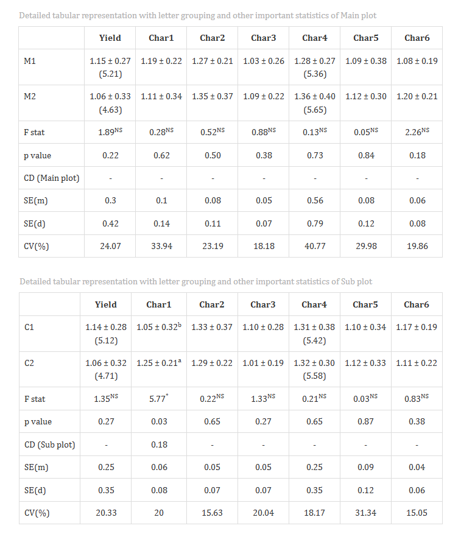{#fig-101 fig-align="center"}

**Table 3: Sub Plot Factor (S) Detailed results with multiple comparisons**

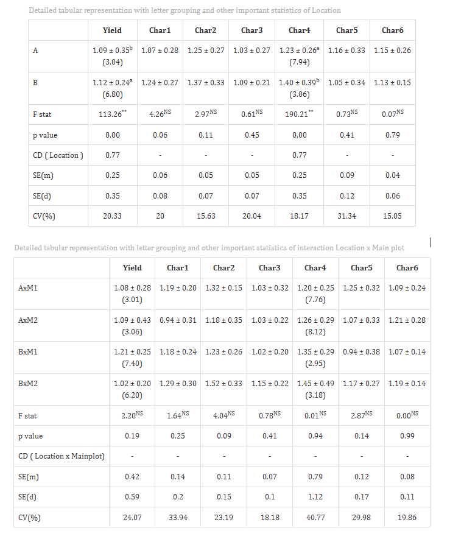{fig-align="center"}

**Table 4: Interaction (M × S) — Detailed results**

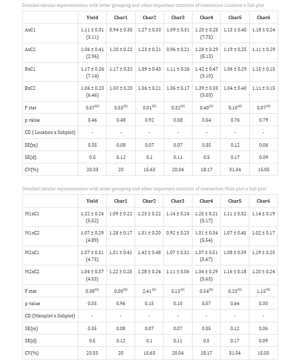{fig-align="center"} 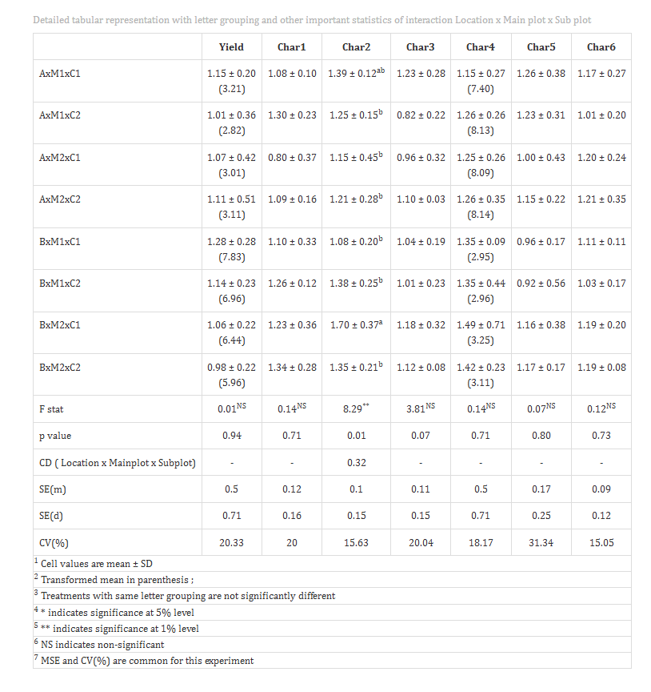{fig-align="center"}

<details>

```{=html}
<summary style="color: #5DADE2"; font-weight: bold;">Overview of ANOVA Results and Interpretation
</summary>
```

<small>

1.  *Treatments and Response Variables*

**Treatments**: The independent variable or specific combination of factor levels (e.g., M~2~S~2~ - Continuous flooding with Swarna variety) being tested to determine its influence on the results.

**Response Variable**: The dependent variable or specific measurement (e.g., grain yield in kg/ha) recorded to evaluate the performance of the treatment combinations.

2.  *Multiple Comparisons*

**Post hoc Grouping**: A method of using letters (a, b, c) to categorize means. Items sharing the same letter are statistically similar, while those with different letters are significantly different.

3.  *ANOVA Summary*

**F stat**: A numerical value that compares the variance between different groups to the variance within those groups; it determines if the overall differences are statistically significant.

**p value**: The probability that the observed differences occurred by random chance. A value below the chosen significance threshold typically indicates that the results are statistically significant.

4.  *Critical Difference (CD) and Error Estimates*

**Critical Difference (CD)**: The minimum mathematical gap required between two means to declare them "significantly different" at a specific confidence level. Note that in a PSPD, two different CD values are produced — one based on the Main Plot Error (for comparing main plot means) and one based on the Sub Plot Error (for comparing sub-plot and interaction means).

**Standard Error (SE)**: A measure of the accuracy of a sample mean compared to the true population mean; it indicates how much the mean might fluctuate.

**Mean Square Error (MSE)**: The average of the squared differences between observed values and the predicted mean; it represents the "noise" or unexplained error in the experiment.

**Coefficient of Variation (CV%)**: A percentage that shows the level of dispersion in the data. A lower CV indicates higher precision and reliability in the experimental measurements.

**Cohen's F**: A standardized measure of effect size that describes the magnitude of the experimental effect, regardless of the sample size. </small>

</details>

### Interpretation from @fig-101

::: {style="text-align: justify;"}
Treatments are grouped using letters such as **"a", "b", "c"** to indicate statistical similarity based on pairwise comparisons. Overlapping grouping letters (e.g., **ab** or **bc**) indicate that the absolute difference between treatment means is less than the critical difference at the chosen level of significance, implying statistical similarity **(on par)**. For example, if treatment combinations M~2~S~2~ and M~2~S~3~ both carry the label **"a"**, their yields are statistically similar at the **5%** significance level. Treatment means with no common letters (e.g., **a** and **c**) differ significantly, providing a clear visual summary of all pairwise comparisons. It is important to note that in a **PSPD**, the appropriate error term differs for main plot comparisons versus sub-plot or interaction comparisons - RAISINS applies the correct error term automatically for each level of the design. For characters exhibiting significant treatment effects, pairwise comparisons of treatment means were conducted using the Least Significant Difference (LSD) test. The LSD test provides the critical difference (CD) value, which was used to determine significant differences between pairs of means. Treatments sharing at least one common letter within a character were considered not significantly different. The Cohen's f values in the table quantify the magnitude of treatment effects: values below 0.10 indicate a very small effect, below 0.25 indicate a small effect, below 0.40 indicate a medium effect, and values of 0.40 or higher indicate a large effect. The observed effect sizes for grain yield and biomass traits indicate that the treatment effects are not only statistically significant but also practically relevant and biologically meaningful.
:::

::: callout-tip
#### When a researcher uses Tukey's HSD or DMRT, each pairwise comparison produces a different value because the differences between the group means are unique.
:::

::: callout-tip
#### Cohen's f is a measure of effect size. It tells you how strong or meaningful the treatment effect is, independent of sample size.
:::

## Multiple comparison tests {#sec-8 .MCT}

<details>

```{=html}
<summary style="color: #5DADE2"; font-weight: bold;">
  What is Post-hoc test?
</summary>
```

<ul><small> Post hoc test is a follow-up analysis, performed after finding a significant result in an overall statistical test (like ANOVA). Its purpose is to identify exactly which groups or treatments differ from each other. In other words, it helps to pinpoint where the differences lie between multiple groups, when the initial test shows that not all groups are the same.</small></ul>

</details>

::: {style="text-align: justify;"}
After obtaining a significant F-value in ANOVA under **PSPD**, multiple comparison tests are employed to identify which treatment combination means differ significantly. Commonly used post hoc tests include Least Significant Difference (LSD), Tukey's Honest Significant Difference (HSD), and Duncan's Multiple Range Test (DMRT), each differing in their level of error control and suitability depending on the number of treatment combinations and experimental conditions; see @fig-7. An important distinction in the **PSPD** is that two separate error terms exist - the Main Plot Error and the Sub Plot Error - and the appropriate error must be used for each comparison. **RAISINS** handles this automatically, using the Main Plot Error when comparing main plot means and the Sub Plot Error when comparing sub-plot or interaction means.
:::

{#fig-7 fig-align="center"}

<details>

```{=html}
<summary style="color: #5DADE2"; font-weight: bold;"> Post-hoc test </summary>
```

<small>

When the pooled ANOVA in a **Pooled Split Plot Design (PSPD)** is significant, the following post hoc tests are commonly used for pairwise comparisons: Tukey's Honestly Significant Difference (HSD) test, Fisher's Least Significant Difference (LSD) test, and Duncan's Multiple Range Test (DMRT).

**Least Significant Difference (LSD)**

The LSD test is the simplest post-hoc procedure. For sub-plot and interaction comparisons it is computed as:

$$LSD = t_{\alpha/2, df_e} \times \sqrt{\frac{2 \times MSE_{sub}}{re}}$$

where $t_{\alpha/2, df_e}$ is the critical t-value at significance level α with sub-plot error degrees of freedom, $MSE_{sub}$ is the Sub Plot Mean Square Error from the ANOVA table, r is the number of replications (blocks) per environment, and e is the number of environments. For main plot comparisons, the Main Plot Error ($MSE_{main}$) is used in place of $MSE_{sub}$, with the corresponding main plot error degrees of freedom. Two treatment means are declared significantly different if the absolute difference between them exceeds the LSD value. The LSD test is most appropriate when the number of comparisons is small and pre-planned comparisons are made.

**Tukey's Honestly Significant Difference (HSD)**

Tukey's test helps you find out exactly which pairs of treatment means differ significantly. It compares all possible pairs of treatment means while controlling the overall Type I error rate, so you avoid false positives when making multiple comparisons. In **PSPD**, this method works well when all sub-plot comparisons are required and the error variance is assumed homogeneous across environments.

**Duncan's Multiple Range Test (DMRT)**

After confirming significant overall differences via ANOVA, DMRT ranks the treatment means and calculates critical differences using the standardized range statistic (Q) and the standard error based on the appropriate error variance from the ANOVA. This systematic and sequential approach provides clear groupings of treatment combinations and has gained popularity in agricultural multi-environment research. </small>

</details>

**Which Post hoc test to use?**

::: {style="text-align: justify;"}
The choice of the post hoc test completely relies on the researcher.

**LSD** is used for pairwise comparison of treatment means after a significant ANOVA in **PSPD**. It is most suitable when the number of treatment combinations is small and comparisons are limited, offering high sensitivity to detect differences, but it may increase Type I error when many combinations are compared. In agricultural multi-environment experiments LSD is the most commonly used.

**Tukey's HSD** is preferred when there are multiple treatment combinations in a balanced **PSPD**. It compares all possible treatment pairs while strictly controlling the family-wise error rate, making it a conservative and reliable method for multiple comparisons, especially when environment × treatment interactions are present.

**DMRT** is commonly used in agricultural experiments with several treatment combinations. It ranks treatment means step-wise and detects more significant differences than Tukey HSD, though it is less conservative and carries a higher risk of Type I error.

In the example, a pairwise comparison was performed to identify significant differences between treatment combinations using the Least Significant Difference (LSD) test.
:::

## Individual ANOVA {#IA}

::: {style="text-align: justify;"}
If the user wants to get individual ANOVA tables for each variable click on Individual Anova in the Analysis.

The significance of each source of variation including Environment, Main Plot Factor, Sub Plot Factor, and all interaction terms can be measured using the F-test and p value as in @fig-104.
:::

**Table 6: ANOVA table for yield**

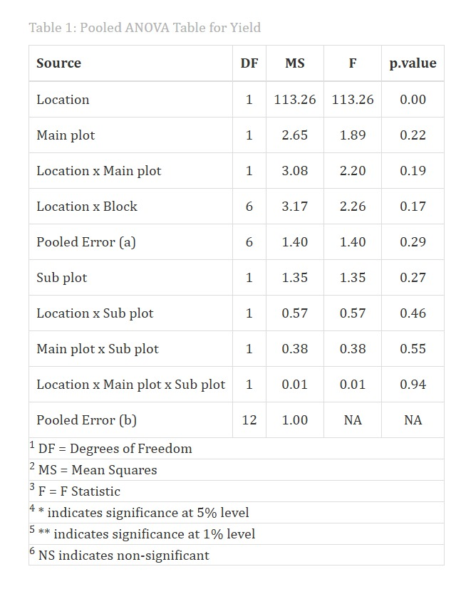{#fig-104 fig-align="center"}

<details>

```{=html}
<summary style="color: #5DADE2"; font-weight: bold;"> Table parameters </summary>
```

<small>

**Critical Difference (CD)** The minimum difference required between any two treatment means to consider them significantly different from each other. In a **PSPD**, two CD values are reported one for main plot comparisons (based on Main Plot Error) and one for sub-plot and interaction comparisons (based on Sub Plot Error). At a 1% level, you are 99% confident in the difference. At a 5% level, you are 95% confident.

**Coefficient of Variation (CV (%))** A relative measure of dispersion that expresses the standard deviation as a percentage of the mean. $$CV = \frac{\text{Standard deviation (SD)}}{\text{Mean}}*100$$

**Mean Square Error (MSE)** The Residual Mean sum of Squares from the ANOVA table. In a **PSPD**, two MSE values are reported: the Main Plot Error MSE and the Sub Plot Error MSE.

**Standard Error of Mean (SE(m))** Measures how much the sample mean of a treatment combination is likely to vary from the true population mean. For sub-plot comparisons: $$ SE(m)=\sqrt{MSE_{sub} / (re)}$$ where r is the number of replications per environment and e is the number of environments.

**Standard Error of Difference (SE(d))** The standard error associated with the difference between two treatment means. For sub-plot comparisons: $$ SE(d)=\sqrt{2 \times MSE_{sub} / (re)}$$

</small>

</details>

### Interpretation from @fig-104

::: {style="text-align: justify;"}
For the character **yield**, the Sub Plot Error mean square is 8,924.30, and the Main Plot Error mean square is 14,672.80, reflecting the two-tier error structure of the **PSPD**. The F-value for the Sub Plot Factor (Variety) is approximately 29.13 with 2 degrees of freedom for variety and the corresponding sub-plot error degrees of freedom, and it is significant at the 1% level, confirming strong varietal differences in grain yield. The M × S interaction F-value of approximately 3.67 with 2 degrees of freedom is significant at the 5% level, confirming that the two irrigation regimes promote different patterns of varietal performance. The SE(m) for sub-plot comparisons is approximately 38.52, the SE(d) is approximately 54.49, and the CD at 5% is 108.43, indicating the minimum yield difference required to declare any two sub-plot means significantly different. The overall CV% of 7.4% reflects good experimental precision across both environments and confirms the reliability of the findings.
:::

## Basic plots {#BP}

::: {style="text-align: justify;"}
**RAISINS** is designed for a smooth and hassle-free experience. Once you click the Run Analysis button, all relevant results and outputs appear instantly leaving no room for confusion. We've ensured that every possible plot related to the **Pooled Split Plot Design** is readily available. Simply click on the Basic Plot tab to view them; see @fig-8. Each plot comes with a gear icon at the top-left corner, allowing you to customize its appearance. You can also download these plots in high-quality PNG format (300 dpi), JPEG, TIFF, PDF and SVG for use in reports or presentations.
:::

### Customizing plots

::: {style="text-align: justify;"}
**RAISINS** provides users various customization features for the plots to enhance the visualization according to the requirement of the user. **Click** on @fig-8 to get a clear idea on the customizing features.
:::

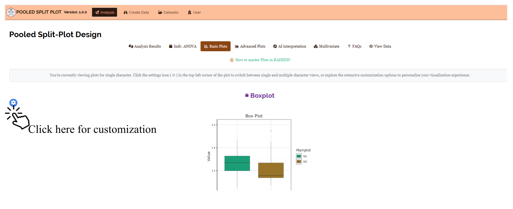{#fig-8 fig-align="center"}

::: {style="text-align: justify;"}
From @fig-9 to @fig-13, you can see the different types of plots available in RAISINS. Each one is visually illustrated and accompanied by a clear, insightful description below, making it easy to understand.
:::

```{=html}
<script>
document.addEventListener('DOMContentLoaded', function() {
  const descriptions = document.querySelectorAll('.plot-description');
  descriptions.forEach(desc => {
    desc.style.display = 'none';
  });
});

function showDescription(id) {
  document.getElementById(id).style.display = 'flex';
}

function hideDescription(id) {
  document.getElementById(id).style.display = 'none';
}
</script>
```

```{=html}
<style>
.plot-container {
  position: relative;
  display: inline-block;
  cursor: pointer;
  width: 350px;
  height: 300px;
  overflow: hidden;
  margin: 10px;
}
.plot-container img {
  width: 350px;
  height: 300px;
  object-fit: cover;
  border: 3px solid #ddd;
  border-radius: 8px;
  transition: transform 0.3s ease, box-shadow 0.3s ease;
}
.plot-container:hover img {
  transform: scale(1.05);
  box-shadow: 0 4px 12px rgba(0, 0, 0, 0.2);
}
.plot-description {
  display: none !important;
  position: absolute;
  top: 0; left: 0;
  width: 100%; height: 100%;
  z-index: 1000;
  color: white;
  padding: 15px;
  border-radius: 8px;
  box-shadow: 0 4px 15px rgba(0, 0, 0, 0.3);
  font-size: 14px;
  line-height: 1.5;
  display: flex;
  align-items: center;
  justify-content: center;
  text-align: center;
  animation: fadeIn 0.3s ease-in;
  pointer-events: none;
  border: 2px solid rgba(255, 255, 255, 0.5);
}
.plot-container:hover .plot-description {
  display: flex !important;
}
@keyframes fadeIn {
  from { opacity: 0; transform: scale(0.95); }
  to { opacity: 1; transform: scale(1); }
}
#boxplot-desc { background: linear-gradient(135deg, rgba(255, 107, 107, 0.8), rgba(255, 142, 83, 0.8)); }
#barplot-desc { background: linear-gradient(135deg, rgba(161, 140, 209, 0.8), rgba(251, 194, 235, 0.8)); }
#connectedplot-desc { background: linear-gradient(135deg, rgba(0, 221, 235, 0.8), rgba(38, 166, 154, 0.8)); }
#meanvalueplot-desc { background: linear-gradient(135deg, rgba(255, 154, 139, 0.8), rgba(255, 106, 136, 0.8)); }
#violinplot-desc { background: linear-gradient(135deg, rgba(132, 250, 176, 0.8), rgba(143, 211, 244, 0.8)); }
</style>
```

::::::::::::::::::::::: grid
:::::: g-col-6
::::: {.plot-container onmouseover="showDescription('boxplot-desc')" onmouseout="hideDescription('boxplot-desc')"}
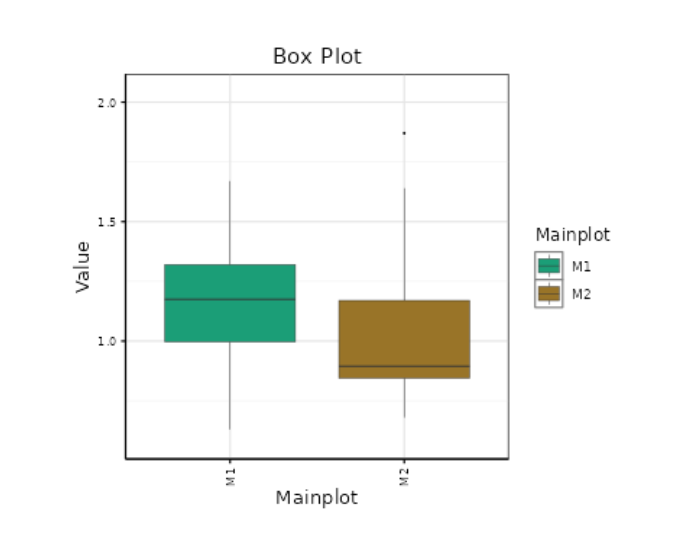{#fig-9}

:::: {#boxplot-desc .plot-description}
::: {style="text-align: justify;"}
A **box plot** in a pooled split plot design is a graphical representation used to visualize the distribution of data across different treatments and factors combined over multiple experiments or seasons. It displays the median, quartiles, minimum, and maximum values, helping to identify variability, spread, and outliers within the pooled data. In pooled split plot analysis, box plots are useful for comparing the performance of main plot treatments, sub plot treatments, and their interactions under different conditions. They provide a clear understanding of consistency and treatment effects in the experiment.
:::
::::
:::::
::::::

:::::: g-col-6
::::: {.plot-container onmouseover="showDescription('violinplot-desc')" onmouseout="hideDescription('violinplot-desc')"}
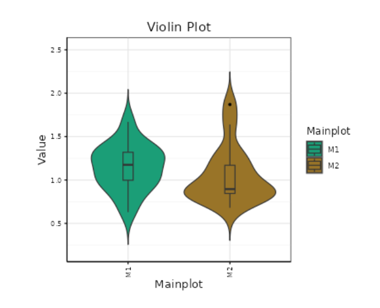{#fig-10}

:::: {#violinplot-desc .plot-description}
::: {style="text-align: justify;"}
A **violin box** plot in a pooled split plot design combines the features of a violin plot and a box plot to show both data distribution and statistical summary. The violin shape represents the density and spread of the pooled data, while the box plot inside displays the median, quartiles, and variability. It helps in understanding the distribution pattern, symmetry, and presence of outliers among different treatments and their interactions. In pooled split plot analysis, violin box plots are useful for comparing treatment effects across multiple factors and environments in a more detailed and visually informative way.
:::
::::
:::::
::::::

:::::: g-col-6
::::: {.plot-container onmouseover="showDescription('barplot-desc')" onmouseout="hideDescription('barplot-desc')"}
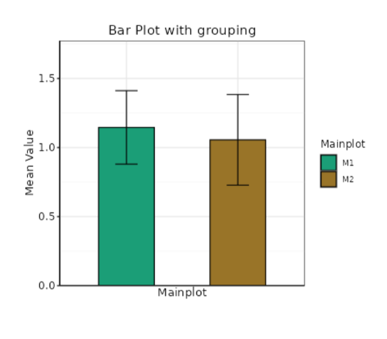{#fig-11}

:::: {#barplot-desc .plot-description}
::: {style="text-align: justify;"}
A **bar plot** with letter grouping in a pooled split plot design is used to compare the mean values of different treatments visually along with their statistical significance. The bars represent treatment means, while letters placed above the bars indicate groupings based on mean comparison tests such as DMRT, LSD, or Tukey’s test. Treatments sharing the same letter are considered statistically similar, whereas different letters indicate significant differences. This plot helps in easy interpretation of treatment effects and comparison in pooled analysis.
:::
::::
:::::
::::::

:::::: g-col-6
::::: {.plot-container onmouseover="showDescription('meanvalueplot-desc')" onmouseout="hideDescription('meanvalueplot-desc')"}
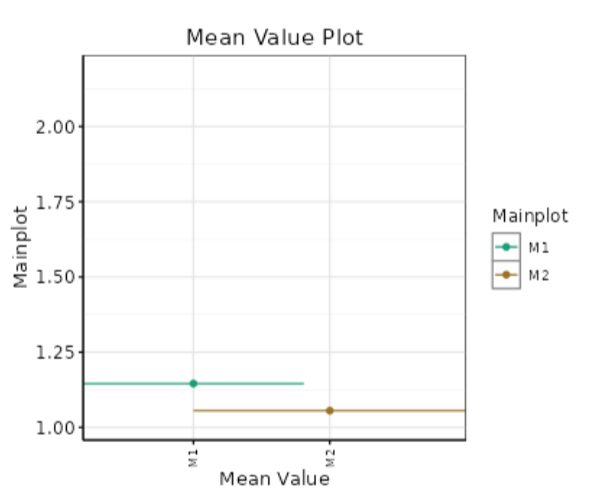{#fig-12}

:::: {#meanvalueplot-desc .plot-description}
::: {style="text-align: justify;"}
A **mean value plot** in a pooled split plot design is used to display the average performance of different treatments and factor combinations across pooled experiments or seasons. The plot shows the mean values using points or lines, making it easier to compare treatment effects and identify trends or differences among main plot and sub plot factors. It helps in understanding the overall response pattern, treatment consistency, and interaction effects in the pooled analysis.
:::
::::
:::::
::::::

:::::: g-col-6
::::: {.plot-container onmouseover="showDescription('connectedplot-desc')" onmouseout="hideDescription('connectedplot-desc')"}
:::: {style="text-align: center;"}
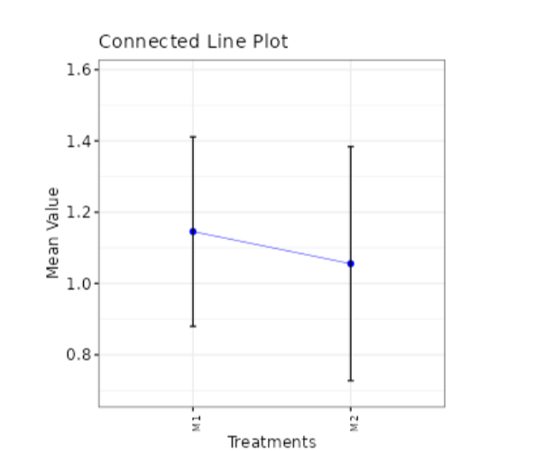{#fig-13}

::: {style="text-align: justify;"}
A **connected line plot** in a pooled split plot design is used to show the relationship and trend of treatment mean values across different factors or conditions. In this plot, data points representing treatment means are connected with lines, helping to visualize changes, patterns, and interactions among main plot and sub plot treatments in pooled experiments. It is useful for comparing treatment performance and identifying increasing or decreasing trends across environments or seasons.
:::
::::
:::::
::::::
:::::::::::::::::::::::

## Advanced plots {#AP}

::: {style="text-align: justify;"}
**RAISINS** also provides advanced plots which go beyond basic bar charts and histograms to give deeper insight into your data, especially distributions, relationships, and deviations from expectations. See @fig-90.
:::

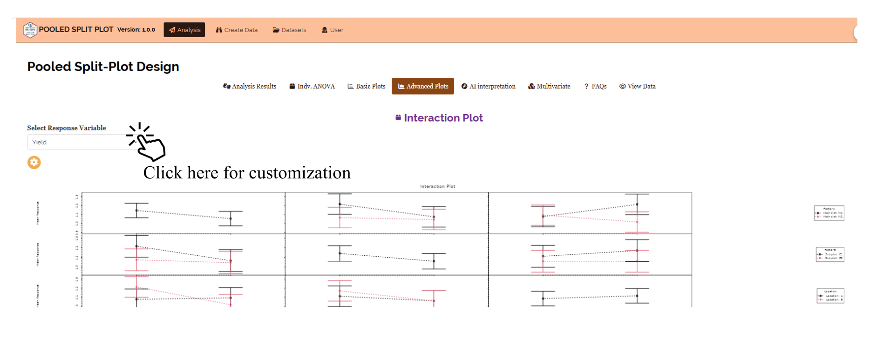{#fig-90 fig-align="center"}

**INTERACTION PLOT**

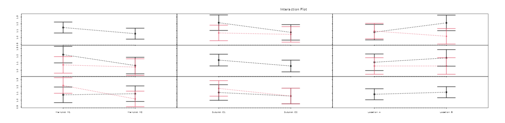{#fig-14 fig-align="center"}

::: {style="text-align: justify;"}
An **interaction plot** in a pooled split plot design is used to show the combined effect of two or more factors on the response variable across pooled experiments or seasons. The plot displays treatment means with lines connecting different factor levels, helping to identify whether the effect of one factor changes depending on another factor. Parallel lines indicate little or no interaction, while crossing or diverging lines suggest significant interaction between treatments. It is useful for understanding treatment relationships and combined effects in pooled analysis.
:::

**3D Scatter Plot**

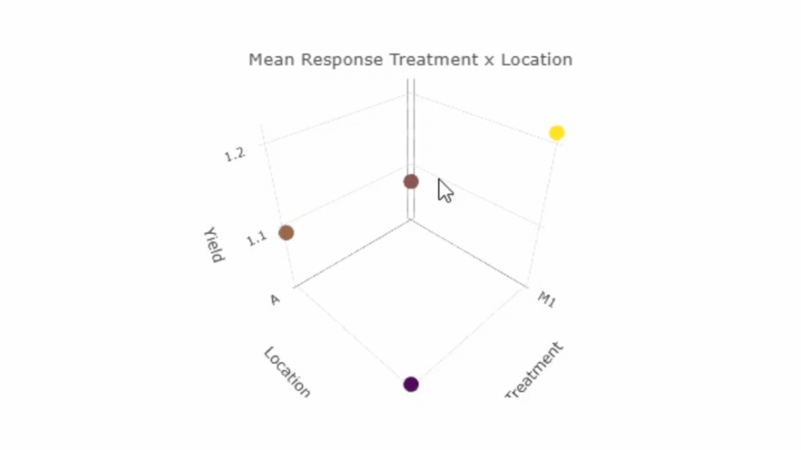{#fig-15 fig-align="center"}

::: {style="text-align: justify;"}
A 3D scatter plot in a pooled split plot design is a graphical tool used to visualize the relationship among three variables simultaneously in pooled experimental data. Data points are plotted along the X, Y, and Z axes to represent different treatment combinations, factors, or response values. This plot helps in identifying patterns, trends, clusters, and variations among main plot and sub plot treatments across pooled environments or seasons. It provides a clear three-dimensional view of treatment interactions and data distribution.
:::

**3D SCATTER PLOT WITH LINES**

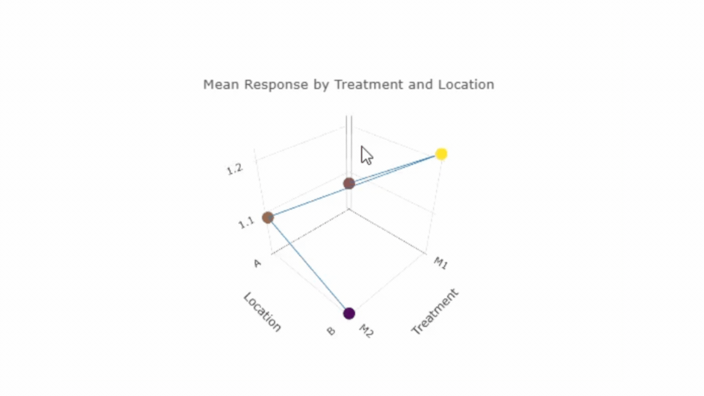{#fig-16 fig-align="center"}

::: {style="text-align: justify;"}
A **3D scatter plot with lines** in a pooled split plot design is used to visualize the relationship and trend among three variables in pooled experimental data. The data points are plotted in three-dimensional space along the X, Y, and Z axes, while lines are used to connect related points or treatment means. This helps in understanding patterns, treatment interactions, and changes across different factors or environments. The plot provides a clearer representation of trends and relationships among main plot and sub plot treatments in pooled analysis.
:::

## AI interpretation {#AI}

::: {style="text-align: justify;"}
RAISINS is equipped with an AI-powered RAISINS Assistant designed to assist users in comprehending the outcomes of statistical tests and data analysis. This functionality provides clear and concise summaries of results, identifies statistically significant main effects, sub-plot effects, and environment × treatment interactions, and offers informed suggestions for potential next steps or interpretations. The user can get detailed interpretations of the analysis by clicking on AI Interpretation in the Analysis as shown below @fig-ai.
:::

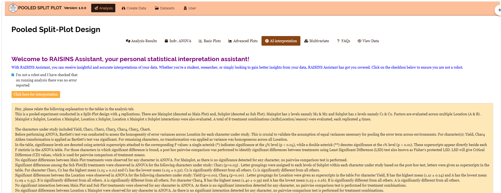{#fig-ai fig-align="center"}

## Multivariate {#MUL}

::: {style="text-align: justify;"}
Multivariate analysis in **Pooled Split Plot Design (PSPD)** helps you to compare different response variables simultaneously across all treatment combinations and environments. Remember that the PCA used for multivariate selection is an exploratory technique, not an inferential method. Now, in our example of evaluating 6 treatment combinations across two locations on four response variables (yield, Char1, Char2, and FW), navigate to Multivariate; see @fig-mu.
:::

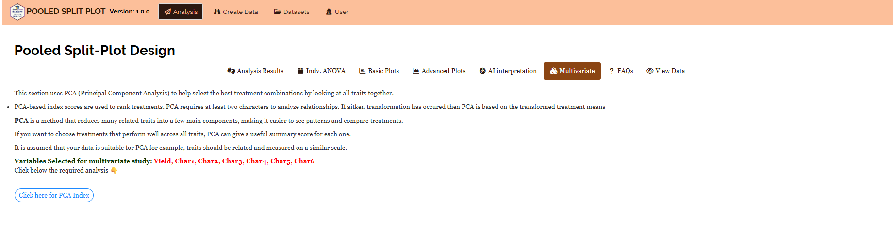{#fig-mu}

::: {style="text-align: justify;"}
MANOVA and PCA will be automatically carried out based on the selected variables. MANOVA table with interpretation appears automatically. PCA results and plots will appear along with automated interpretation.
:::

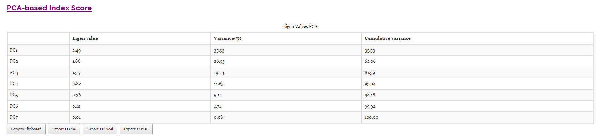{#fig-PC}

::: {style="text-align: justify;"}
The scree plot given @fig-screeplot illustrates the proportion of variance explained by each principal component.
:::

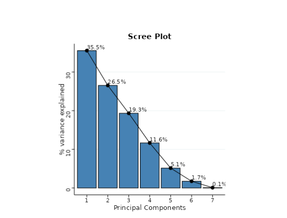{#fig-screeplot fig-align="center"}

::: {style="text-align: justify;"}
Look upon the loadings of each variable in the given @fig-loadings and decide which PC-based index needs to be selected. In PC1, yield and FW show high positive loadings (approximately +0.61 and +0.55 respectively), while Char2 (number of tillers) also loads positively (+0.44), indicating that treatment combinations with high scores on PC1 perform well across yield and biomass-related traits. Char1 (plant height) loads primarily on PC2 (+0.68), suggesting it captures a dimension of variation largely independent of yield. Based on this pattern, a PC1-based index score is most informative for identifying treatment combinations that optimize yield and biomass simultaneously across both locations. It is recommended to use variables that are highly correlated for PCA, as this helps in constructing a more reliable and meaningful index.
:::

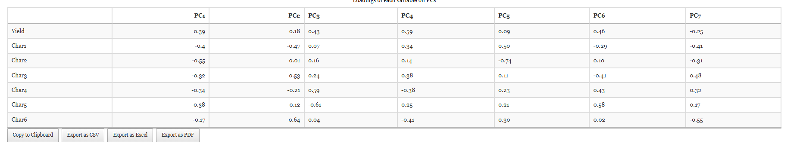{#fig-loadings fig-align="center"}

::: {style="text-align: justify;"}
The biplot gives a visual representation of the relationships among variables and treatment combinations across environments. Treatment combinations with high values for a specific variable are positioned in the direction of that variable's loading vector. The angle between variables in the biplot indicates their correlation smaller angles suggest high positive correlation, while larger angles close to 90 degrees suggest weak or no correlation. In the present example, yield and FW vectors point in approximately the same direction, confirming their strong positive association, while Char1 (plant height) points in a direction more orthogonal to yield, confirming its independent contribution. The pooled nature of the data means that environmental effects are absorbed into the overall position of treatment combination centroids in the biplot space.
:::

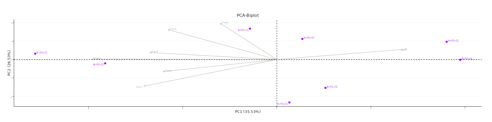{fig-align="center"}

::: {style="text-align: justify;"}
In RAISINS, we calculate a scaled index score by converting the index score to a range of 0 to 1, making it easier to interpret and compare. This standardized approach ensures consistency in evaluating treatment combinations based on their index scores across environments. To refine your selection, use the 'Select cutoff for Scaled Index Score' feature given as in @fig-indexscore, where you can choose the cutoff percentage to select treatment combinations above or below a certain threshold. The default cutoff is set at 75%. By toggling the up-arrow and down-arrow buttons below the cutoff selection, you can select the top or bottom percentage of treatment combinations as per your preference. Selected treatment combinations are highlighted in yellow in the table below, providing a clear visual cue. Additionally, a plot based on the index scores is also displayed to aid in your analysis.
:::

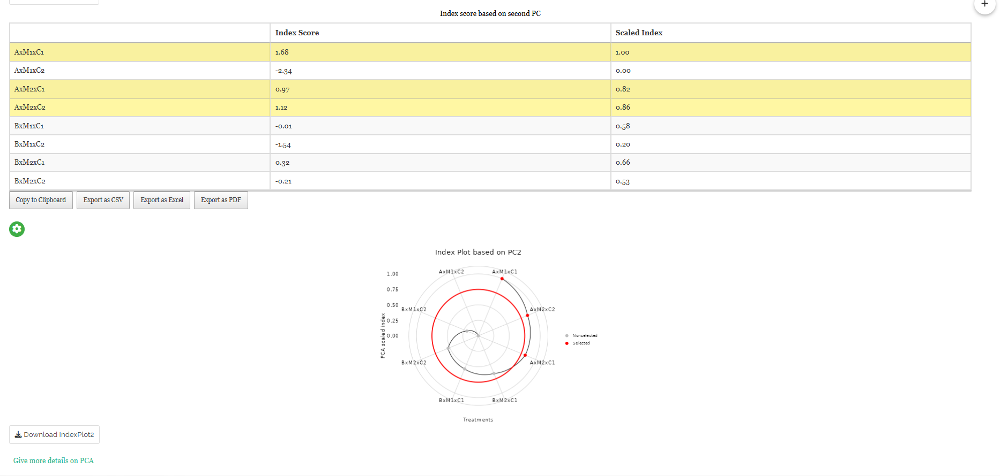{#fig-indexscore fig-align="center"}

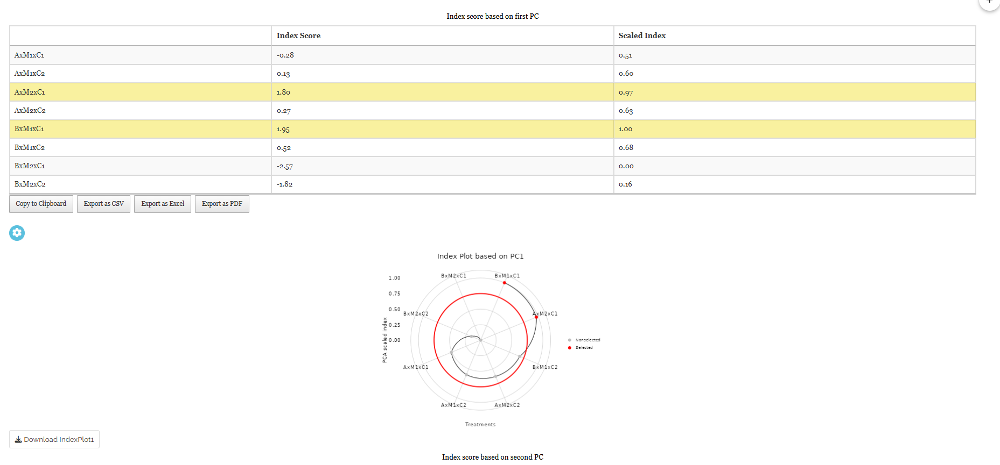{fig-align="center"}

::: {style="text-align: justify;"}
Combining all this information, the experimenter can arrive at an overall conclusion that is statistically sound and contextually relevant to their study. The integration of univariate pooled ANOVA results with multivariate PCA-based index scores allows researchers to identify the most promising treatment combinations for both individual traits and overall multi-trait performance across environments in a **PSPD** experiment.
:::

## Preparing your data {#PRE}

::: {style="text-align: justify;"}
"Your analysis is only as good as your data! Feed RAISINS high-quality data, and it will deliver powerful insights feed it messy data, and the results won't be trustworthy."

1.  Create your dataset in MS Excel

2.  Build your dataset directly within the RAISINS app
:::

## Preparing data in MS Excel {#EX}

::: {style="text-align: justify;"}
Open a new blank sheet in MS Excel with only one sheet included, and avoid adding any unnecessary content. The dataset for a **PSPD** should follow a column-based format. The first column should represent the **Environment** (Location or Season identifier, e.g., "Thrissur" or "Palakkad"). The second column should represent the **Block** (replicate number within each environment). The third column should represent the **Main Plot Factor** (e.g., Irrigation regime). The fourth column should represent the **Sub Plot Factor** (e.g., Variety). All response variables under study (e.g., yield, Char1, Char2, FW) should be arranged in separate columns thereafter. Each unique combination of Environment × Block × Main Plot × Sub Plot corresponds to one row of data. The file can be saved in CSV, XLS, or XLSX format, but CSV is recommended as it is lighter and enables faster loading. Ensure that there are no unwanted spaces in column names or group names. For reference, see the structure shown in @fig-pp. As illustrated in @fig-data, each environment's data should be stacked consecutively, and the data can also be arranged as shown in @fig-kk.
:::

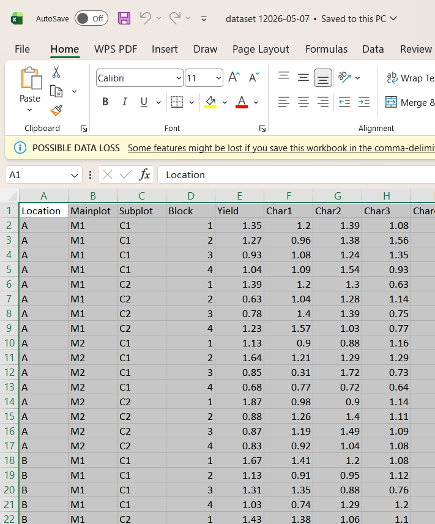{#fig-pp}

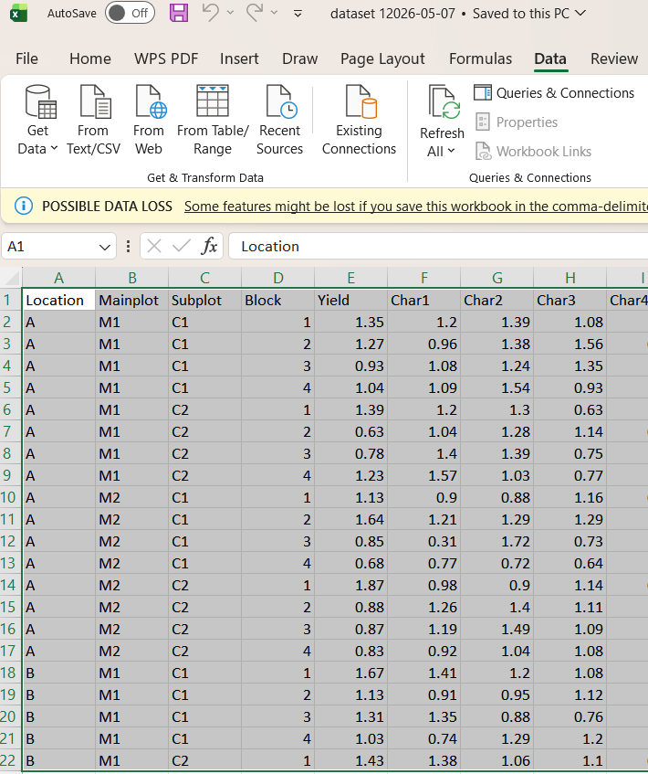{#fig-kk}

<details>

<summary>Dataset Creation Rules</summary>

<small> 1. **Column Naming Convention** - No spaces allowed in column names.\
- Use underscores (`_`) or full stops (`.`) for separation. - Avoid symbols and special characters like %,# etc 2. **Data Arrangement** - Start data arrangement towards the upper-left corner.\
- Ensure the row above the data is not blank. 3. **Cell Management** - Avoid typing or deleting in cells without data.\
- If needed, select affected cells, right-click, and select **Clear Contents**. 4. **Column Relevance** - Name all columns meaningfully.\
- Exclude unnecessary columns not required for analysis. 5. **Environment Coding** - Ensure the Environment column uses consistent, unambiguous labels (e.g., "Loc1", "Loc2") with no typographic variations across rows. </small>

</details>

<details>

<summary>How to Save as CSV in MS Excel</summary>

<small> 1. **Open Your Workbook**

```         
-   Ensure your data is arranged properly with only one sheet.
```

2.  **Click 'File' Menu**

    -   Go to the top-left corner and click on **File**.

3.  **Choose 'Save As' or 'Save a Copy'**

    -   Select the location where you want to save your file.

4.  **Set File Type to CSV**

    -   In the **'Save as type'** dropdown menu, choose **CSV (Comma delimited) (\*.csv)**.

5.  **Name Your File**

    -   Enter a relevant file name without spaces (use underscores if needed).

6.  **Click 'Save'**

    -   Click **Save** to export the file.

> 💡 Tip: Before saving, double-check that your data is on the first sheet and follows the required format (e.g., no empty rows above the data, meaningful column names, consistent environment labels). </small>

</details>

## Creating dataset in RAISINS {#CR}

::: {style="text-align: justify;"}
If you're unsure about the correct format for creating a dataset, don't worry RAISINS offers an option to create data directly within the app using the prescribed template. Here's how:

-   Navigate to the **Create Data Tab**

-   Select the number of **Environments**

-   Select the number of **Main Plot Treatments**

-   Select the number of **Sub Plot Treatments**

-   Select number of **Replications**

-   Select number of **Characters**

-   Click on **Create** button

Model layout will appear as shown in @fig-createdata. Now you may enter the observations manually into the CSV file once downloaded, or paste the observations straight into the file provided. Once you have entered the observations in the layout, download the csv file and upload in Analysis.
:::

{#fig-createdata}

## Model datasets {#M}

::: {style="text-align: justify;"}
To test the app or better understand the data arrangement, we provide model datasets within the app. You can download them from the Dataset.
:::

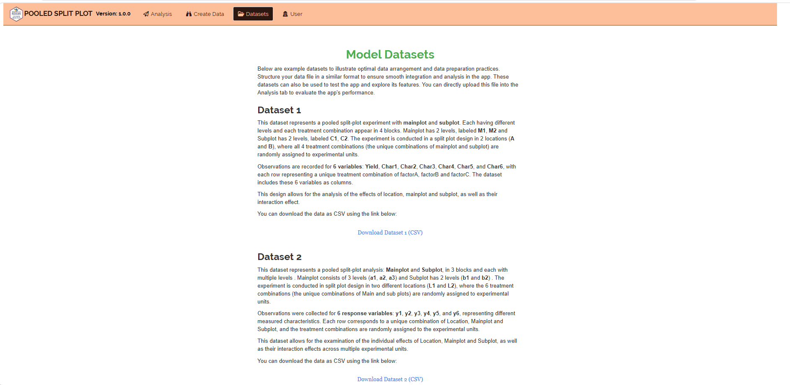{#fig-188 fig-align="center"}

## FAQ's {#F}

::: {style="text-align: justify;"}
The app includes a dedicated FAQs to help clarify common doubts and guide users through various features. This section provides detailed answers to frequently asked questions, offering additional information and helpful tips to ensure a smooth user experience. If you're ever unsure about how something works, the FAQs is a great place to start.
:::

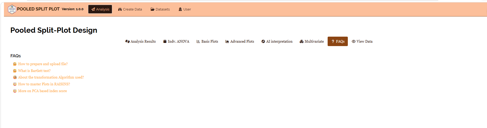{#fig-148 fig-align="center"}

## View data {#U}

::: {style="text-align: justify;"}
View Data serves as the primary diagnostic tool for ensuring data integrity before analysis. Upon uploading your dataset, the system performs an automated Health Check to validate column types and formatting.
:::

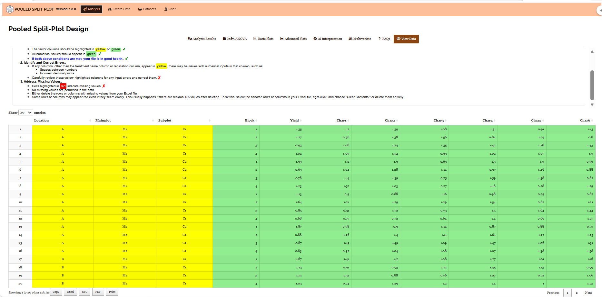{fig-align="center"}

------------------------------------------------------------------------
