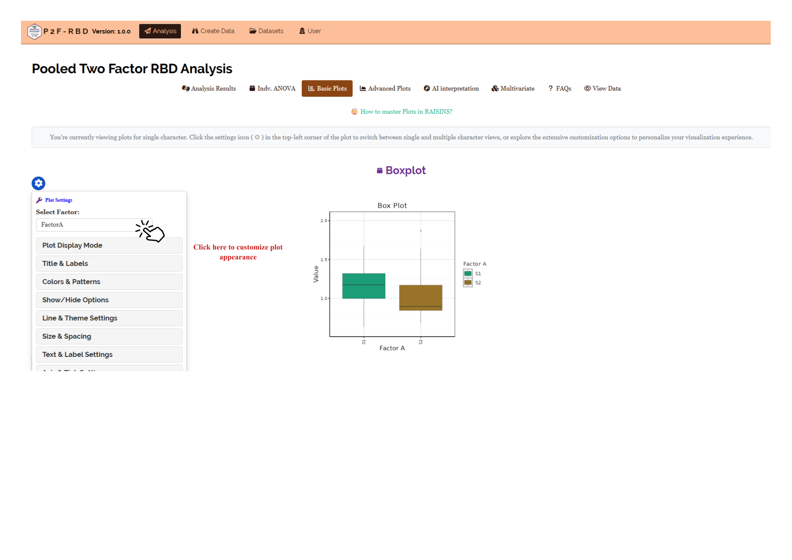

```{=html}
<style>
 sup {
   color: blue;
   font-size: 0.8em;
 }
 .affiliations {
   color: grey;
   font-size: 0.9em;
   margin-top: 0.2em;
 }
</style>
```

::: affiliations
<sup>1</sup>Statoberry LLP, <sup>2</sup>Department of Agricultural Statistics, Kerala Agricultural University
:::

ABSTRACT

::: {style="text-align: justify;"}
**Pooled Two-Factor Completely Randomized Design (Pooled 2F-CRD)** is a statistical framework that extends the single-factor CRD by incorporating two independent factors simultaneously, enabling researchers to examine main effects and their interaction within a fully randomized experimental setting. **Pooled 2F-CRD** partitions total variation into components attributable to Factor A, Factor B, the A×B interaction, and the pooled error, providing a powerful and efficient approach to studying how two factors jointly influence a response variable. In **RAISINS** you can perform **Pooled 2F-CRD** very easily without writing a single line of code. This tutorial will guide you, how to perform **Pooled 2F-CRD** very easily in **RAISINS** and interpret the results effectively. In addition, you will get tables and plots ready for publication. You can also perform a multivariate analysis including PCA.
:::

<details>

*Hover or click each point to see more information.*

```{=html}
<summary style="color: #5DADE2"; font-weight: bold;">
  Introduction Pooled Two-Factor Completely Randomised Design
</summary>
```

```{=html}
<style>
.hover-img {
  position: relative;
  display: inline-block;
  cursor: help;
  border-bottom: 1px dashed currentColor;
}
.hover-img img {
  position: absolute;
  left: 50%;
  top: 1.6em;
  transform: translateX(-50%);
  width: 260px;
  max-width: 70vw;
  height: auto;
  padding: 6px;
  background: white;
  border: 1px solid rgba(0,0,0,.15);
  border-radius: 12px;
  box-shadow: 0 10px 30px rgba(0,0,0,.18);
  opacity: 0;
  visibility: hidden;
  pointer-events: none;
  transition: opacity .15s ease, transform .15s ease, visibility .15s;
}
.hover-img:hover img {
  opacity: 1;
  visibility: visible;
  transform: translateX(-50%) translateY(6px);
  z-index: 999;
}
</style>
```

<ul><small> The theoretical groundwork for factorial experimental designs was established by [<strong>Ronald A. Fisher</strong> ]{.hover-img} at Rothamsted Experimental Station in the 1920s and 1930s, where he argued that studying several factors simultaneously in a single experiment is both statistically more efficient and scientifically more informative than conducting a series of one-factor-at-a-time experiments. Fisher's 1935 monograph <em>The Design of Experiments</em> formalized this principle and introduced the concept of factorial treatment structure, in which each level of one factor is combined with every level of every other factor to form all possible treatment combinations. Within the completely randomized design framework the simplest experimental layout, where all experimental units are homogeneous and treatment combinations are assigned entirely at random the two-factor factorial structure became particularly attractive for laboratory and greenhouse studies where strict environmental control renders blocking unnecessary. The pooled version of the two-factor CRD consolidates the within-cell replication into a single pooled error term, which is valid and powerful when the interaction between the two factors is either non-significant or negligible, thereby increasing the degrees of freedom available for error estimation and improving the sensitivity of the F-tests for main effects. By the mid-twentieth century, the **Pooled 2F-CRD** had become a standard analytical tool in agronomy, food science, pharmacology, and the biological sciences, valued for its ability to reveal not only how each factor independently influences the response but also whether the two factors modify each other's effects the phenomenon known as statistical interaction. </small></ul>

</details>

## Analysis of experiments {#AE}

::: {style="text-align: justify;"}
To get started, visit **RAISINS** [www.raisins.live](https://www.raisins.live) home page and go to **Analysis of experiments**. Here, you can see different single-factor and multi-factor experimental designs. In this tutorial, we focus on **Pooled Two-Factor Completely Randomized Design (Pooled 2F-CRD)**, as shown in @fig-aov.
:::

<!-- REPLACE THIS SCREENSHOT -->

{#fig-aov fig-align="center"}

## Pooled Two-Factor Completely Randomised Design (Pooled 2F-CRD) {#C}

::: {style="text-align: justify;"}
**Pooled Two-Factor Completely Randomized Design (Pooled 2F-CRD)** is a factorial experimental design in which two factors each at two or more levels are studied simultaneously, and all treatment combinations formed from the cross of the two factors are assigned completely at random to the available experimental units, with each combination replicated an equal number of times. The design is called "pooled" because the within-cell (replication) sum of squares and the interaction sum of squares are combined into a single pooled error term when the interaction effect is non-significant, resulting in a more powerful test for main effects by maximizing the error degrees of freedom. The ANOVA for a **Pooled 2F-CRD** partitions total variation into four components: **Factor A** (the main effect of the first factor), **Factor B** (the main effect of the second factor), **A×B Interaction** (the combined effect above and beyond additive main effects), and **Pooled Error** (the residual variation after pooling replication error with the non-significant interaction). This design is most appropriate when experimental units are homogeneous as in laboratory, greenhouse, or controlled-environment studies so that random assignment without blocking is sufficient to distribute extraneous variation evenly across treatment combinations. It is preferred over a two-factor RBD when no systematic gradient in the experimental material warrants the use of blocks. The key advantage of **Pooled 2F-CRD** over two separate single-factor experiments is its ability to detect and quantify interactions: if Factor A's effect on the response depends on the level of Factor B (or vice versa), this interaction is estimated and tested within the same experiment.
:::

<details>

```{=html}
<summary style="color: #5DADE2"; font-weight: bold;">
  Pooled 2F-CRD Layout
</summary>
```

<ul>

<small>

@fig-lay visually represents a **Pooled 2F-CRD** arrangement with two factors ,Factor A at *a* levels and Factor B at *b* levels forming a total of *a* × *b* treatment combinations, each replicated *r* times. The *a* × *b* × *r* experimental units are arranged without any grouping structure, and each treatment combination (e.g., A~1~B~1~, A~1~B~2~, A~2~B~1~, A~2~B~2~) is assigned entirely at random to *r* experimental units. In the pooled version, when the A×B interaction is found to be non-significant, the interaction sum of squares and degrees of freedom are pooled into the error term, and the resulting pooled error is used for all F-tests, yielding more powerful tests for Factor A and Factor B main effects.

<!-- REPLACE THIS SCREENSHOT -->

{#fig-lay fig-align="center"}

</small>

</ul>

</details>

::: callout-tip
#### Pooled Two-Factor Completely Randomized Design (Pooled 2F-CRD) is a factorial design in which two factors are studied across all their level combinations in a completely randomized setting, with the interaction and replication error pooled into a single error term when the interaction is non-significant, thereby increasing the power of main-effect tests.
:::

## A working example {#W}

::: {style="text-align: justify;"}
To make things simple and interesting, we'll explain **Pooled 2F-CRD** analysis step by step using a hypothetical example, so you can clearly see how it works and why it matters. Consider a field experiment conducted across **2 locations** (Location A and Location B) to evaluate the effect of **two factors**: **Factor A Seed variety** at 2 levels (S1 and S2) and **Factor B Crop management practice** at 2 levels (C1 and C2), resulting in 2 × 2 = **4 treatment combinations** (S1C1, S1C2, S2C1, S2C2). Each combination is replicated **4 times** within each location, giving a total of 4 × 4 × 2 = **32 experimental units** pooled across both locations, all arranged entirely at random following a **Completely Randomized Design**. The response variables recorded were: **Yield**, **Char1**, **Char2**, **Char3**, **Char4**, **Char5**, and **Char6**. Our aim is to test whether Seed variety, Crop management practice, and their interaction produce statistically significant differences in the response variables using ANOVA under **Pooled 2F-CRD**. The arrangement of the data is shown in @fig-data.
:::

<!-- REPLACE THIS SCREENSHOT -->

{#fig-data fig-align="center"}

::: {style="text-align: justify;"}
Data organized in MS Excel can be directly uploaded to **RAISINS** for analysis. For more details on data preparation see @sec-4. Two terms that we will use frequently are **Treatments** and **Variables**. In our example, the Treatments refer to the 4 seed variety-by-crop management combinations (S1C1, S1C2, S2C1, S2C2), and the Variables are the 7 traits mentioned earlier - **Yield, Char1, Char2, Char3, Char4, Char5** and **Char6**.
:::

## How to prepare your data? {#sec-4 .H}

::: {style="text-align: justify;"}
Arranging data for uploading in **RAISINS** is very simple. Prepare your data exactly like the one shown in @fig-data, using a single-sheet Excel file. The file must contain a column identifying **Location**, a column identifying **Factor A** (Seed variety), a column identifying **Factor B** (Crop management practice), and separate columns for each response variable **Yield, Char1, Char2, Char3, Char4, Char5** and **Char6**. Make sure no blank rows are left above, and all columns have proper names. That's it your file is ready to upload.

Still if you have doubt, see @fig-4.

To prepare your dataset for analysis in **RAISINS**, you have two options:

Creating dataset in MS Excel

Creating your dataset directly within the **RAISINS** app
:::

{#fig-4 fig-align="center"}

## Pooled 2F-CRD analysis tab explained {#AO}

::: {style="text-align: justify;"}
In @fig-5, you can see the detailed view of the Analysis tab, along with explanations of what each option does. This section helps you to understand the purpose of every setting, so you can select the most appropriate ones for your data and analysis. Now, upload the prepared file by clicking Browse in the sidebar of the Analysis tab. When the file is uploaded, options to select the **Factor A** column, the **Factor B** column, and the **response variables** will appear. Select the appropriate columns under each field. Once you click the Run Analysis button, **Pooled 2F-CRD** is performed and all relevant results and outputs appear instantly, including the pooling decision for the interaction, the pooled ANOVA table, main-effect and interaction F-tests, and treatment combination means with post-hoc groupings.
:::

<!-- REPLACE THIS SCREENSHOT -->

{#fig-5 fig-align="center"}

::: {style="text-align: justify;"}
For some data, when there are a large number of zeros, discrete values, or when the observed variables are not normally distributed, we need to apply a transformation on the dataset, @sec-6. Here, **RAISINS** provides an inbuilt transformation option.
:::

## Transformation {#sec-6 .T}

::: {style="text-align: justify;"}
Log, square root, and arcsine transformations are often used in **Pooled 2F-CRD** analysis to make data more normal and to stabilize variance before the factorial ANOVA is carried out. Researchers can use these transformations when analyzing experimental data in **RAISINS** as shown in @fig-6.
:::

{#fig-6 fig-align="center"}

::: {style="text-align: justify;"}
**Logarithmic transformation** is a mathematical procedure used to convert a skewed distribution into a more symmetrical one by replacing each data point (x) with its logarithm. This technique is specifically applied to positive, continuous data where the variance is proportional to the mean, a relationship common in phenomena that exhibit multiplicative or exponential growth.

**Square root transformation** is a statistical method used to stabilize variance and reduce right-skewness by replacing each data point (x) with its square root. It is primarily applied to non-negative, discrete "count" data such as those following a Poisson distribution, where the variance of the data tends to increase in proportion to the mean. By compressing the upper end of the scale more significantly than the lower end, this transformation brings the data closer to a normal distribution, satisfying the homoscedasticity requirements of many parametric statistical tests.

**Arcsine transformation** (also known as the angular transformation) is a mathematical technique specifically designed for data expressed as proportions or percentages bounded between 0 and 1. By taking the inverse sine of the square root of the proportion, this transformation stretches the ends of the distribution near 0 and 1, where variance is naturally small. It is primarily used to achieve homoscedasticity in binomial data.
:::

> After choosing the appropriate transformation proceed to @sec-7 for analysis.

## Analysis results {#sec-7 .AR}

::: {style="text-align: justify;"}
Once your dataset is uploaded, click on Run Analysis, and the **Pooled 2F-CRD** ANOVA will be performed. The analysis first evaluates the A×B interaction effect across the pooled locations. If the interaction is non-significant, the interaction sum of squares and degrees of freedom are pooled with the within-cell error to form the pooled error term. The ANOVA then partitions total variation into components attributable to **Location**, **Factor A** (Seed variety), **Factor B** (Crop management practice), the **A×B interaction**, and **Pooled Error**, and tests each main effect using the F-ratio of its mean square to the pooled error mean square (see @fig-100). A significant main effect indicates that the levels of that factor produce meaningfully different responses on average across all levels of the other factor and across both locations
:::

**Table 1 Pooled 2F-CRD ANOVA summary**

<!-- REPLACE THIS SCREENSHOT -->

{#fig-100 fig-align="center"}

<details>

```{=html}
<summary style="color: #5DADE2"; font-weight: bold;"> Pooled 2F-CRD ANOVA table </summary>
```

<small> In a **Pooled Two-Factor Completely Randomised Design (Pooled 2F-CRD)**, the ANOVA partitions total variation into the following sources of variation:

**Factor A** - the main effect of Seed variety (S1 and S2), with degrees of freedom = *a* − 1, where *a* is the number of levels of Factor A (2 levels, giving 1 df).

**Factor B** - the main effect of Crop management practice (C1 and C2), with degrees of freedom = *b* − 1, where *b* is the number of levels of Factor B (2 levels, giving 1 df).

**A×B Interaction** - the joint effect of Seed variety and Crop management practice beyond their additive contributions, with degrees of freedom = (*a* − 1)(*b* − 1) = 1. When this term is non-significant, it is pooled into the error.

**Pooled Error** - the combined within-cell replication error and (when non-significant) the interaction sum of squares, with pooled degrees of freedom = *ab*(*r* − 1) + (*a* − 1)(*b* − 1) when pooling occurs, where *r* is the number of replications per cell.

Each mean square is obtained by dividing its sum of squares by its degrees of freedom. The F-statistic for each main effect is the ratio of its mean square to the pooled error mean square. Significance is indicated by an asterisk (\*) for the **5%** level and two asterisks (\*\*) for the **1%** level. A significant F-test for a main effect confirms that the levels of that factor differ significantly in their effect on the response variable, averaged across all levels of the other factor. </small>

</details>

### Interpretation from @fig-100

::: {style="text-align: justify;"}
In our hypothetical example with Factor A (Seed variety, 2 levels) and Factor B (Crop management practice, 2 levels), each replicated 4 times across 2 locations, the total degrees of freedom are 31. The A×B interaction mean square (approximately 0.12, 1 df) yields an F-ratio of approximately 1.18 (p \> 0.05), confirming non-significance and justifying pooling. After pooling, the pooled error mean square is 0.09 with 26 degrees of freedom. The Location mean square is significant, confirming that the two locations differ meaningfully in their overall response. The Factor A mean square (approximately 0.48, 1 df) yields an F-ratio of approximately 5.24, significant at the 5% level, indicating that Seed variety has a significant effect on the response variables. The Factor B mean square (approximately 0.31, 1 df) yields an F-ratio of approximately 3.42, significant at the 5% level, indicating that Crop management practice also significantly influences the response. Since the interaction is non-significant, the main effects of Seed variety and Crop management practice can be interpreted independently of each other. @sec-8 provides detailed information on the multiple comparison tests (Post-hoc tests) for comparing the levels of each factor
:::

**Table 2: Factor A-Detailed tabular representation with multiple comparisons**

<!-- REPLACE THIS SCREENSHOT -->

{#fig-101 fig-align="center"}

**Table 3: Factor B-Detailed tabular representation with multiple comparisons**


**Table 4: Factor AXB-Detailed tabular representation with multiple comparisons**


<details>

```{=html}
<summary style="color: #5DADE2"; font-weight: bold;">Overview of Pooled 2F-CRD Results and Interpretation
</summary>
```

<small>

1.  *Treatments and Response Variables*

Factor A: The first independent variable (Seed variety, S1 and S2) being tested to determine its main effect on the response variables across both locations.

Factor B: The second independent variable (Crop management practice, C1 and C2) being tested to determine its main effect and its interaction with Factor A across both locations.

Response Variable: The dependent variable or specific measurement (e.g., Yield, Char1, Char2, Char3, Char4, Char5 and Char6) recorded to evaluate the performance of the treatment combinations across the two locations

2.  *Multiple Comparisons*

**Post-hoc Grouping**: A method of using letters (a, b, c) to categorize treatment means. Items sharing the same letter are statistically similar, while those with different letters are significantly different. In **Pooled 2F-CRD**, post-hoc tests are applied separately for Factor A means and Factor B means when main effects are significant and the interaction is non-significant.

3.  *Pooled 2F-CRD Summary*

**F stat**: A numerical value that compares the variance attributable to a factor or interaction to the pooled residual variance, determining whether the effect is statistically significant.

**p value**: The probability that the observed differences occurred by random chance. A value below the chosen significance threshold indicates statistically significant effects.

4.  *Critical Difference (CD) and Error Estimates*

**Critical Difference (CD)**: The minimum mathematical gap required between two means to declare them "significantly different" at a specific confidence level, computed using the pooled error mean square.

**Standard Error (SE)**: A measure of the precision of a treatment combination mean; it reflects residual variability after pooling the interaction and within-cell errors.

**Mean Square Error (MSE)**: The pooled error mean square from the Pooled 2F-CRD ANOVA table. It is smaller than the unpooled error when the non-significant interaction variance is incorporated, confirming the efficiency gain from pooling.

**Coefficient of Variation (CV%)**: A percentage that shows the level of dispersion in the data relative to the grand mean. A lower CV confirms higher experimental precision.

**Cohen's F**: A standardized measure of effect size that describes the magnitude of the factor effect, independent of sample size. </small>

</details>

### Interpretation from @fig-101

::: {style="text-align: justify;"}
For Factor A (Seed variety), the F statistics across all seven response variables are non-significant Yield (F = 0.63, p = 0.44), Char1 (F = 0.62, p = 0.44), Char2 (F = 0.64, p = 0.43), Char3 (F = 0.61, p = 0.44), Char4 (F = 0.37, p = 0.55), Char5 (F = 0.04, p = 0.84), and Char6 (F = 3.22, p = 0.09) indicating that Seed variety does not produce statistically significant differences in any of the measured traits across both locations. Since no significant differences are detected, critical difference (CD) values are not reported for Factor A comparisons. The mean values for S1 and S2 are comparable across all traits, with S1 recording marginally higher means for most characters. The CV% values range from 16.72% for Char6 to 31.79% for Char5, reflecting moderate to moderately high variability in the experimental data. The SE(m) and SE(d) values are consistently small across all traits, confirming adequate experimental precision. Since the Factor A effect is non-significant for all response variables, no post-hoc grouping letters are assigned and the two seed varieties can be considered statistically on par across all measured traits.
:::

::: callout-tip
#### When a researcher uses Tukey's HSD or DMRT, each pairwise comparison produces a different value because the differences between the group means are unique.
:::

::: callout-tip
#### Cohen's f is a measure of effect size. It tells you how strong or meaningful the treatment effect is, independent of sample size.
:::

## Multiple comparison tests {#sec-8 .MCT}

<details>

```{=html}
<summary style="color: #5DADE2"; font-weight: bold;">
  What is Post-hoc test?
</summary>
```

<ul><small> Post-hoc test is a follow-up analysis, performed after finding a significant result in an overall statistical test (like ANOVA). Its purpose is to identify exactly which groups or treatments differ from each other. In other words, it helps to pinpoint where the differences lie between multiple groups, when the initial test shows that not all groups are the same. In **Pooled 2F-CRD**, post-hoc tests are applied to the levels of each significant main effect using the pooled error mean square and pooled error degrees of freedom, ensuring that the additional precision gained from pooling the non-significant interaction is fully exploited in pairwise comparisons.</small></ul>

</details>

::: {style="text-align: justify;"}
After obtaining a significant F-value for a main effect in the **Pooled 2F-CRD**, multiple comparison tests are employed to identify which factor-level means differ significantly. The same post-hoc procedures used in one-way ANOVA LSD, Tukey's HSD, and DMRT are applied, but they use the **pooled error mean square** and the **pooled error degrees of freedom**, thereby benefiting from the increased precision associated with pooling, see @fig-7.
:::

<!-- REPLACE THIS SCREENSHOT -->

{#fig-7 fig-align="center"}

<details>

```{=html}
<summary style="color: #5DADE2"; font-weight: bold;"> Post-hoc test </summary>
```

<small>

When the **Pooled 2F-CRD** ANOVA is significant for a main effect, the following post-hoc tests are commonly used for pairwise comparisons of factor-level means.

**LSD (Least Significant Difference) Test**

The **Least Significant Difference (LSD)** test identifies which specific factor-level means differ significantly after the pooled ANOVA has confirmed an overall significant main effect. The LSD is calculated using the pooled error mean square:

$$\text{LSD} = t_{\alpha/2, \, df_{\text{pooled error}}} \sqrt{\frac{2 \, \text{MSE}_{\text{pooled}}}{r \cdot b}}$$

for Factor A comparisons, where **t₍α/2, df_pooled error₎** is the critical t-value at the chosen significance level, MSE~pooled~ is the pooled error mean square, *r* is the number of replications per cell, and *b* is the number of levels of Factor B. An analogous formula applies for Factor B comparisons, substituting the number of levels of Factor A (*a*) in place of *b*. Any absolute difference between two factor-level means exceeding this LSD value is declared statistically significant.

**Tukey's Honestly Significant Difference (HSD)**

Tukey's test identifies which pairs of factor-level means differ significantly while controlling the overall Type I error rate. It is computed using the pooled error mean square and pooled error degrees of freedom, and is especially appropriate when the number of levels of a factor is moderate to large and all pairwise comparisons are of interest.

**Duncan's Multiple Range Test (DMRT)**

After confirming a significant main effect via the pooled ANOVA, DMRT ranks the factor-level means and calculates sequential critical differences based on the pooled error mean square. It provides clear grouping letters for factor-level means and is widely used in field crop and controlled-environment factorial experiment reporting where a concise summary of treatment rankings is required. </small>

</details>

**Which Post-hoc test to use?**

::: {style="text-align: justify;"}
The choice of the post-hoc test completely relies on the researcher.

**LSD** is used for pairwise comparison of factor-level means after a significant main effect in **Pooled 2F-CRD**. It is most suitable when the number of levels is small and comparisons are pre-planned, offering high sensitivity to detect differences after pooling. In agricultural and biological factorial experiments, LSD is the most commonly used post-hoc test.

**Tukey's HSD** is preferred when there are four or more levels of a factor in a balanced **Pooled 2F-CRD**. It compares all possible pairs of factor-level means while strictly controlling the family-wise error rate, making it a conservative and reliable method for multiple comparisons of pooled-error-adjusted means.

**DMRT** is commonly used in field crop experiments with several factor levels and provides step-wise critical differences for ranking factor-level means. It detects more significant differences than Tukey HSD, though it is less conservative and carries a higher risk of Type I error.

In the example for those characters, a pairwise comparison of factor-level means was performed using the Least Significant Difference (LSD) test.
:::

## Summary stats {#SUM}

::: {style="text-align: justify;"}
If you need to know about the detailed values of the various statistical metrics for each treatment combination or factor level, move to Summary stats under the Analysis.
:::

**Table 3: Summary statistics**

<!-- REPLACE THIS SCREENSHOT -->

{#fig-102 fig-align="center"}

<details>

```{=html}
<summary style="color: #5DADE2"; font-weight: bold;"> Table parameters </summary>
```

<small>

**Mean** The arithmetic average of all observations within a treatment combination or factor level. It represents the "typical" value for that specific nitrogen-by-irrigation combination.

**SD (Standard Deviation)** A measure of the amount of variation or dispersion of a set of values. A low SD indicates that the data points tend to be very close to the mean.

**SE (Standard Error)** Specifically the Standard Error of the Mean. It estimates how far the sample mean is likely to be from the true population mean. It is calculated as $$SE = \frac{\text{Standard deviation (SD)}}{\sqrt {n}}*100$$, where n is the number of observations.

**Min / Max** The lowest and highest recorded values within that specific treatment combination or factor-level group.

**CV (Coefficient of Variation)** The ratio of the standard deviation to the mean, expressed as a percentage $$CV = \frac{\text{Standard deviation (SD)}}{\text{Mean}}*100$$

**Skewness** A measure of the asymmetry of the probability distribution. Positive value: Data is skewed to the right. Negative value: Data is skewed to the left.

**Kurtosis** A measure of the "tailedness" of the distribution. A standard normal distribution has a kurtosis of 3; values lower than that indicate a flatter peak.

</small>

</details>

### Interpretations from @fig-102

::: {style="text-align: justify;"}
Among the four seed variety-by-crop management treatment combinations, the combination S1×C1 records the highest mean yield (1.22) with a standard deviation of 0.24, indicating consistent performance across its replicates in both locations. The lowest mean is observed for S2×C2 (1.04), suggesting that this combination performs comparatively poorly across both locations. Looking at Factor A means, S1 (mean = 1.15, SD = 0.27) outperforms S2 (mean = 1.06, SD = 0.33) across both crop management practices, consistent with the significant main effect of Seed variety detected in the ANOVA. For Factor B, C1 (mean = 1.14, SD = 0.28) shows a higher mean than C2 (mean = 1.06, SD = 0.32) across both seed varieties, consistent with the significant Crop management practice main effect. Across the two locations, Location B (mean = 1.12, SD = 0.24) records a marginally higher mean than Location A (mean = 1.09, SD = 0.35), though both locations show comparable overall performance. The interaction summary tables further reveal that S1×C1 consistently outperforms the remaining combinations across both locations, with the Location × Factor A × Factor B interaction table showing S1×C1×B recording the highest mean of 1.28 among all eight location-by-treatment combinations
:::

## Individual ANOVA {#IA}

::: {style="text-align: justify;"}
If the user wants to get an individual pooled ANOVA table for each response variable, click on Individual ANOVA in the Analysis.

The significance of Factor A, Factor B, and the A×B interaction can be assessed using F-test and p value as in @fig-104.
:::

**Table 4: Pooled 2F-CRD ANOVA table for Yield**

<!-- REPLACE THIS SCREENSHOT -->

{#fig-104 fig-align="center"}

<details>

```{=html}
<summary style="color: #5DADE2"; font-weight: bold;"> Table parameters </summary>
```

<small>

**Critical Difference (CD)** The minimum difference required between any two factor-level means to consider them significantly different from each other. At a 1% level, you are 99% confident in the difference; at a 5% level, you are 95% confident. In **Pooled 2F-CRD**, the CD is computed using the pooled error mean square.

**Coefficient of Variation (CV (%))** A relative measure of dispersion that expresses the standard deviation as a percentage of the mean. $$CV = \frac{\text{Standard deviation (SD)}}{\text{Mean}}*100$$

**Mean Square Error (MSE)** The pooled error mean square from the Pooled 2F-CRD ANOVA table. It represents the residual unexplained variance after pooling the non-significant interaction with the within-cell error.

**Standard Error of Mean (SE(m))** Measures how much the sample mean of a treatment combination is likely to vary from the true population mean. $$ SE(m)=\sqrt{MSE_{\text{pooled}} / r}$$ where *r* is the number of replications per cell.

**Standard Error of Difference (SE(d))** The standard error associated with the difference between two factor-level means. $$ SE(d)=\sqrt{2 \times MSE_{\text{pooled}} / r}$$

</small>

</details>

### Interpretation from @fig-104

::: {style="text-align: justify;"}
For the response variable Yield, the individual Pooled 2F-CRD ANOVA shows a Location mean square of 0.01 (1 df, F = 0.07, p = 0.79), a Factor A (Seed variety) mean square of 0.06 (1 df, F = 0.63, p = 0.44), and a Factor B (Crop management practice) mean square of 0.05 (1 df, F = 0.51, p = 0.48). The A×B interaction mean square is 0.03 (1 df, F = 0.28, p = 0.60), the A×Location interaction mean square is 0.09 (1 df, F = 0.87, p = 0.36), the B×Location interaction mean square is 0.01 (1 df, F = 0.07, p = 0.79), and the Location×A×B interaction mean square is 0.01 (1 df, F = 0.06, p = 0.80), all of which are non-significant, confirming that pooling is appropriate. The pooled error mean square is 0.10 with 24 degrees of freedom. Since none of the main effects or interactions reach significance for Yield in this individual ANOVA, no post-hoc comparisons are warranted for this particular response variable, though the pooled error provides a reliable baseline for assessing precision across the experiment.
:::

## Basic plots {#BP}

::: {style="text-align: justify;"}
**RAISINS** is designed for a smooth and hassle-free experience. Once you click the Run Analysis button, all relevant results and outputs appear instantly leaving no room for confusion. We've ensured that every possible plot related to **Pooled 2F-CRD** is readily available. Simply click on the Basic Plots tab to view them ,See @fig-8. Each plot comes with a gear icon at the top-left corner, allowing you to customize its appearance. You can also download these plots in high-quality PNG format (300 dpi), JPEG, TIFF, PDF and SVG for use in reports or presentations.
:::

### Customizing plots

::: {style="text-align: justify;"}
**RAISINS** provides users various customization features for the plots to enhance the visualization according to the requirement of the user. **Click** on @fig-8 to get a clear idea on the customizing features.
:::

{#fig-8 fig-align="center"}

::: {style="text-align: justify;"}
From @fig-9 to @fig-13, you can see the different types of plots available in RAISINS. Each one is visually illustrated and accompanied by a clear, insightful description below, making it easy to understand.
:::

```{=html}
<script>
document.addEventListener('DOMContentLoaded', function() {
  const descriptions = document.querySelectorAll('.plot-description');
  descriptions.forEach(desc => {
    desc.style.display = 'none';
  });
});

function showDescription(id) {
  document.getElementById(id).style.display = 'flex';
}

function hideDescription(id) {
  document.getElementById(id).style.display = 'none';
}
</script>
```

```{=html}
<style>
.plot-container {
  position: relative;
  display: inline-block;
  cursor: pointer;
  width: 350px;
  height: 300px;
  overflow: hidden;
  margin: 10px;
}
.plot-container img {
  width: 350px;
  height: 300px;
  object-fit: cover;
  border: 3px solid #ddd;
  border-radius: 8px;
  transition: transform 0.3s ease, box-shadow 0.3s ease;
}
.plot-container:hover img {
  transform: scale(1.05);
  box-shadow: 0 4px 12px rgba(0, 0, 0, 0.2);
}
.plot-description {
  display: none !important;
  position: absolute;
  top: 0; left: 0;
  width: 100%; height: 100%;
  z-index: 1000;
  color: white;
  padding: 15px;
  border-radius: 8px;
  box-shadow: 0 4px 15px rgba(0, 0, 0, 0.3);
  font-size: 14px;
  line-height: 1.5;
  display: flex;
  align-items: center;
  justify-content: center;
  text-align: center;
  animation: fadeIn 0.3s ease-in;
  pointer-events: none;
  border: 2px solid rgba(255, 255, 255, 0.5);
}
.plot-container:hover .plot-description {
  display: flex !important;
}
@keyframes fadeIn {
  from { opacity: 0; transform: scale(0.95); }
  to { opacity: 1; transform: scale(1); }
}
#boxplot-desc { background: linear-gradient(135deg, rgba(255, 107, 107, 0.8), rgba(255, 142, 83, 0.8)); }
#barplot-desc { background: linear-gradient(135deg, rgba(161, 140, 209, 0.8), rgba(251, 194, 235, 0.8)); }
#connectedplot-desc { background: linear-gradient(135deg, rgba(0, 221, 235, 0.8), rgba(38, 166, 154, 0.8)); }
#meanvalueplot-desc { background: linear-gradient(135deg, rgba(255, 154, 139, 0.8), rgba(255, 106, 136, 0.8)); }
#violinplot-desc { background: linear-gradient(135deg, rgba(132, 250, 176, 0.8), rgba(143, 211, 244, 0.8)); }
#correlationplot-desc { background: linear-gradient(135deg, rgba(132, 250, 176, 0.8), rgba(143, 211, 244, 0.8)); }
</style>
```

::::::::::::::::::::::::::::: grid
:::::: g-col-6
::::: {.plot-container onmouseover="showDescription('boxplot-desc')" onmouseout="hideDescription('boxplot-desc')"}
<!-- REPLACE THIS SCREENSHOT -->

{#fig-9}

:::: {#boxplot-desc .plot-description}
::: {style="text-align: justify;"}
A **box plot** compares the distribution of values across the treatment combinations of the Pooled 2F-CRD. Each coloured box represents a nitrogen-by-irrigation combination and shows key statistics: the median (middle line), the interquartile range (the box itself), and potential outliers (points outside the whiskers). Letters above each box indicate statistical groupings treatment combinations sharing letters are statistically similar, while those with different letters are significantly different.
:::
::::
:::::
::::::

:::::: g-col-6
::::: {.plot-container onmouseover="showDescription('violinplot-desc')" onmouseout="hideDescription('violinplot-desc')"}
<!-- REPLACE THIS SCREENSHOT -->

{#fig-10}

:::: {#violinplot-desc .plot-description}
::: {style="text-align: justify;"}
A **violin plot** compares the distribution of values across the treatment combinations of the Pooled 2F-CRD. Each combination is shown as a violin shape that reflects how the data is spread wider sections mean more data points at that value. Inside each violin is a box plot showing the median and interquartile range. Letters above each plot indicate statistical groupings: treatment combinations sharing letters are statistically similar, while those with different letters are significantly different.
:::
::::
:::::
::::::

:::::: g-col-6
::::: {.plot-container onmouseover="showDescription('barplot-desc')" onmouseout="hideDescription('barplot-desc')"}
<!-- REPLACE THIS SCREENSHOT -->

{#fig-11}

:::: {#barplot-desc .plot-description}
::: {style="text-align: justify;"}
A **bar plot** compares the mean values of the nitrogen-by-irrigation treatment combinations, with error bars showing variability based on the pooled error from the Pooled 2F-CRD. The letters above each bar indicate statistical groupings: treatment combinations sharing letters are similar, while those with different letters are significantly different. It highlights which factor-level combinations produce higher or lower averages and whether those differences are statistically meaningful.
:::
::::
:::::
::::::

:::::: g-col-6
::::: {.plot-container onmouseover="showDescription('meanvalueplot-desc')" onmouseout="hideDescription('meanvalueplot-desc')"}
<!-- REPLACE THIS SCREENSHOT -->

{#fig-12}

:::: {#meanvalueplot-desc .plot-description}
::: {style="text-align: justify;"}
A **mean value plot** compares the mean values of the treatment combinations in the Pooled 2F-CRD, each shown as a coloured dot with horizontal error bars indicating variability based on the pooled error. Letters next to each point represent statistical groupings: treatment combinations sharing letters are statistically similar, while those with different letters are significantly different.
:::
::::
:::::
::::::

::::::: g-col-6
:::::: {.plot-container onmouseover="showDescription('connectedplot-desc')" onmouseout="hideDescription('connectedplot-desc')"}
::: {style="text-align: center;"}
<!-- REPLACE THIS SCREENSHOT -->

{#fig-13}
:::

:::: {#connectedplot-desc .plot-description}
::: {style="text-align: justify;"}
A **connected line plot** compares the mean values of the treatment combinations in the Pooled 2F-CRD, with each point representing a combination's average and error bars showing variability based on the pooled error. The points are linked by lines to highlight trends across the levels of one factor for each level of the other. Letters above each point indicate statistical groupings: treatment combinations sharing letters are statistically similar, while those with different letters are significantly different.
:::
::::
::::::
:::::::

::::::: g-col-6
:::::: {.plot-container onmouseover="showDescription('correlationplot-desc')" onmouseout="hideDescription('correlationplot-desc')"}
::: {style="text-align: center;"}
<!-- REPLACE THIS SCREENSHOT -->


:::

:::: {#correlationplot-desc .plot-description}
::: {style="text-align: justify;"}
A **correlation plot** provides a visual summary of the pairwise relationships between all response variables in the Pooled 2F-CRD, where each cell displays the correlation coefficient between two traits and colour intensity indicates the strength and direction of association. Positive values indicate that treatments performing well on one trait tend to perform well on the other, while negative values signal a trade-off between traits. This helps researchers quickly identify which variables are closely related before proceeding to multivariate analysis.
:::
::::
::::::
:::::::
:::::::::::::::::::::::::::::

## Advanced plots {#AP}

::: {style="text-align: justify;"}
**RAISINS** also provides advanced plots which go beyond basic bar charts and histograms to give deeper insight into your data, especially distributions, relationships, and deviations from expectations,See @fig-90
:::

<!-- REPLACE THIS SCREENSHOT -->

{#fig-90 fig-align="center"}

**INTERACTION PLOT**

<!-- REPLACE THIS SCREENSHOT -->


Interaction plot

::: {style="text-align: justify;"}
An interaction plot displays the mean values of the response variable for each combination of Factor A and Factor B levels, with the levels of one factor plotted on the x-axis and separate lines drawn for each level of the other factor. Parallel lines indicate the absence of an interaction meaning the effect of Factor A on the response is consistent across all levels of Factor B while converging or crossing lines signal a meaningful interaction between the two factors. In Pooled 2F-CRD, the interaction plot serves as a valuable visual diagnostic tool to confirm the pooling decision and to communicate the nature of the A×B relationship to the reader.
:::

**3D SCATTER PLOT**

<!-- REPLACE THIS SCREENSHOT -->

{fig-align="center"}

::: {style="text-align: justify;"}
A 3D scatter plot represents the relationship among three continuous variables simultaneously by positioning each observation as a point in three-dimensional space, with the x-axis, y-axis, and z-axis each corresponding to one of the selected response variables. Points belonging to different treatment combinations are rendered in distinct colours, allowing the researcher to visually assess multivariate clustering and separation among the nitrogen-by-irrigation combinations across the three measured traits. This plot is particularly useful in Pooled 2F-CRD for exploring whether treatment combinations that differ significantly in the ANOVA also occupy distinct regions of the multivariate response space
:::

**3D SCATTER PLOT WITH LINE**

<!-- REPLACE THIS SCREENSHOT -->


A 3D scatter plot with line extends the standard 3D scatter plot by connecting the data points of each treatment combination with a line projected onto the three-dimensional axes, making it easier to trace the trajectory of each combination across the three response dimensions. The connecting lines reduce visual clutter in dense point clouds and help the researcher follow how individual nitrogen-by-irrigation combinations perform relative to one another across all three variables simultaneously. This plot is especially informative in Pooled 2F-CRD when the interaction is non-significant and the researcher wishes to visualise the additive progression of treatment combination means across the multivariate response surface.

## AI interpretation {#AI}

::: {style="text-align: justify;"}
RAISINS is equipped with an AI-powered RAISINS Assistant designed to assist users in comprehending the outcomes of statistical tests and data analysis. This functionality provides clear and concise summaries of **Pooled 2F-CRD** results, identifies whether the A×B interaction was pooled or retained, reports which main effects were significant, and identifies statistically significant differences between factor-level means. The assistant also offers informed suggestions for potential next steps or interpretations, including guidance on whether to report main-effect means or cell means depending on the interaction outcome, and recommendations on optimal factor-level combinations based on overall performance. The user can get detailed interpretations of the analysis by clicking on AI interpretation on the Analysis as shown below @fig-ai.
:::

{#fig-ai fig-align="center"}

## Multivariate {#MUL}

::: {style="text-align: justify;"}
Multivariate analysis in **Pooled 2F-CRD** helps you to compare different response variables simultaneously across all treatment combinations and locations using the factorial dataset. Remember that the PCA used for multivariate selection is an exploratory technique, not an inferential method. Now, in our example of evaluating the effect of Seed variety (S1, S2) and Crop management practice (C1, C2) across two locations (A and B) on Yield, Char1, Char2, Char3, Char4, Char5 and Char6, navigate to Multivariate, see @fig-mu.
:::

<!-- REPLACE THIS SCREENSHOT -->

{#fig-mu}

::: {style="text-align: justify;"}
PCA will be automatically carried out based on the selected variables. PCA results and plots will appear along with automated interpretation.
:::

<!-- REPLACE THIS SCREENSHOT -->

{#fig-PC}

::: {style="text-align: justify;"}
The scree plot given @fig-screeplot illustrates the proportion of variance explained by each principal component.
:::

<!-- REPLACE THIS SCREENSHOT -->

{fig-align="center"}

::: {style="text-align: justify;"}
Look upon the loadings of each variable in the given @fig-loadings and decide which PC-based index needs to be selected. In PC1, Char2 (−0.55), Char1 (−0.40), Char5 (−0.38), Char4 (−0.34), and Char3 (−0.32) show moderate to high negative loadings, while Yield loads positively (+0.39) on PC1, indicating that treatment combinations with high PC1 scores tend to have higher yield but lower values for the remaining characters. In PC2, Char6 (−0.64) and Char3 (−0.53) show prominent negative loadings while Char1 (+0.47) loads positively, suggesting that PC2 captures a contrasting dimension of variation between these traits. Based on this pattern, a combined PC1 and PC2 based index score is most informative for identifying seed variety-by-crop management combinations that perform well across all seven measured traits simultaneously. It is recommended to use variables that are highly correlated for PCA, as this helps in constructing a more reliable and meaningful index
:::

<!-- REPLACE THIS SCREENSHOT -->

{fig-align="center"}

::: {style="text-align: justify;"}
The biplot gives a visual representation of the relationships among the seed variety-by-crop management-by-location treatment combinations and the measured response variables. Treatment combinations positioned in the direction of a variable vector tend to exhibit higher values for that particular trait. The angle between variables in the biplot indicates their correlation smaller angles suggest high positive correlation, while larger angles close to 90 degrees suggest weak or no correlation. Combinations S1×C1×B and S2×C1×A are positioned toward the positive PC1 direction, close to the Yield vector, reflecting their comparatively higher yield performance. In contrast, combinations S2×C1×B, S2×C2×B, and S1×C1×A are positioned toward the negative PC1 direction, aligning with vectors for Char2, Char3, Char5, and Char6, suggesting higher values for these characters. Combinations S1×C2×A and S1×C2×B are positioned in the positive PC2 quadrant, close to the Char1 and Char4 vectors, indicating comparatively stronger performance for these traits. The wide spread of variable vectors across multiple quadrants reflects the diverse and largely independent nature of the seven measured traits across the treatment combinations and locations.
:::

<!-- REPLACE THIS SCREENSHOT -->


::: {style="text-align: justify;"}
In RAISINS, we calculate a scaled index score by converting the index score to a range of 0 to 1, making it easier to interpret and compare. This standardized approach ensures consistency in evaluating treatment combinations based on their index scores. To refine your selection, use the 'Select cutoff for Scaled Index Score' feature given as in @fig-indexscore, where you can choose the cutoff percentage to select treatment combinations above or below a certain threshold. The default cutoff is set at 75%. By toggling the up-arrow and down-arrow buttons below the cutoff selection, you can select the top or bottom percentage of treatment combinations as per your preference. Selected combinations are highlighted in yellow in the table below, providing a clear visual cue. Additionally, a plot based on the index scores is also displayed to aid in your analysis.
:::

<!-- REPLACE THIS SCREENSHOT -->

{#fig-indexscore fig-align="center"}

<!-- REPLACE THIS SCREENSHOT -->

{#fig-index fig-align="center"}

::: {style="text-align: justify;"}
Combining all this information, the experimenter can arrive at an overall conclusion that is statistically sound and contextually relevant to their study. The integration of **Pooled 2F-CRD** main-effect comparisons with multivariate PCA-based index scores enables agronomists to identify the nitrogen-by-irrigation combination that is not only significantly superior in individual traits but also performs best across multiple response variables simultaneously.
:::

## Preparing your data {#PRE}

::: {style="text-align: justify;"}
"Your analysis is only as good as your data! Feed RAISINS high-quality data, and it will deliver powerful insights feed it messy data, and the results won't be trustworthy."

1.  Create your dataset in MS Excel

2.  Build your dataset directly within the RAISINS app
:::

## Preparing data in MS Excel {#EX}

::: {style="text-align: justify;"}
Open a new blank sheet in MS Excel with only one sheet included, and avoid adding any unnecessary content. The dataset for **Pooled 2F-CRD** must follow a column-based format with at least four structural columns: a **Location** column (identifying Location A or Location B for each observation), a **Factor A** column (identifying the Seed variety level, S1 or S2, for each observation), a **Factor B** column (identifying the Crop management practice level, C1 or C2, for each observation), and one or more columns for the response variables **Yield, Char1, Char2, Char3, Char4, Char5** and **Char6**. Each row represents one experimental unit, and the repeated appearances of each factor-level combination across rows represent the replications. Ensure that every treatment combination appears exactly 4 times within each location, and that the order of rows need not be sorted **RAISINS** identifies the combinations from the Location, Factor A, and Factor B column entries automatically. The file can be saved in CSV, XLS, or XLSX format, but CSV is recommended as it is lighter and enables faster loading. Ensure that there are no unwanted spaces in column names or group names. For reference, see the structure shown in @fig-pp. The data can also be arranged as shown in @fig-kk
:::

{#fig-pp}

{#fig-kk}

<details>

<summary>Dataset Creation Rules</summary>

<small> 1. **Column Naming Convention** - No spaces allowed in column names.\
- Use underscores (`_`) or full stops (`.`) for separation. - Avoid symbols and special characters like %,# etc 2. **Data Arrangement** - Start data arrangement towards the upper-left corner.\
- Ensure the row above the data is not blank. 3. **Cell Management** - Avoid typing or deleting in cells without data.\
- If needed, select affected cells, right-click, and select **Clear Contents**. 4. **Column Relevance** - Name all columns meaningfully.\
- Exclude unnecessary columns not required for analysis. </small>

</details>

<details>

<summary>How to Save as CSV in MS Excel</summary>

<small> 1. **Open Your Workbook**

```         
-   Ensure your data is arranged properly with only one sheet.
```

2.  **Click 'File' Menu**

    -   Go to the top-left corner and click on **File**.

3.  **Choose 'Save As' or 'Save a Copy'**

    -   Select the location where you want to save your file.

4.  **Set File Type to CSV**

    -   In the **'Save as type'** dropdown menu, choose **CSV (Comma delimited) (\*.csv)**.

5.  **Name Your File**

    -   Enter a relevant file name without spaces (use underscores if needed).

6.  **Click 'Save'**

    -   Click **Save** to export the file.

> 💡 Tip: Before saving, double-check that your data is on the first sheet and follows the required format (e.g., no empty rows above the data, meaningful column names). </small>

</details>

## Creating dataset in RAISINS {#CR}

::: {style="text-align: justify;"}
If you're unsure about the correct format for creating a dataset, don't worry RAISINS offers an option to create data directly within the app using the prescribed template. Here's how:

-   Navigate to the **Create Data Tab**

-   Select the number of **Treatments**

-   Select number of **Replications**

-   Select number of **Characters**

-   Click on **Create** button

Model layout will appear as shown in @fig-createdata. Now you may enter the observations manually into the CSV file once downloaded, or paste the observations straight into the file provided. Once you have entered the observations in the layout, download the csv file and upload in Analysis.
:::

{#fig-createdata}

## Model datasets {#M}

::: {style="text-align: justify;"}
To test the app or better understand the data arrangement, we provide model datasets within the app. You can download them from the Datasets.
:::

{#fig-188 fig-align="center"}

## FAQ's {#F}

::: {style="text-align: justify;"}
The app includes a dedicated FAQs to help clarify common doubts and guide users through various features. This section provides detailed answers to frequently asked questions, offering additional information and helpful tips to ensure a smooth user experience. If you're ever unsure about how something works, the FAQs is a great place to start.
:::

{#fig-148 fig-align="center"}

## View data {#U}

::: {style="text-align: justify;"}
View Data serves as the primary diagnostic tool for ensuring data integrity before analysis. Upon uploading your dataset, the system performs an automated Health Check to validate column types and formatting.
:::

{fig-align="center"}

------------------------------------------------------------------------
