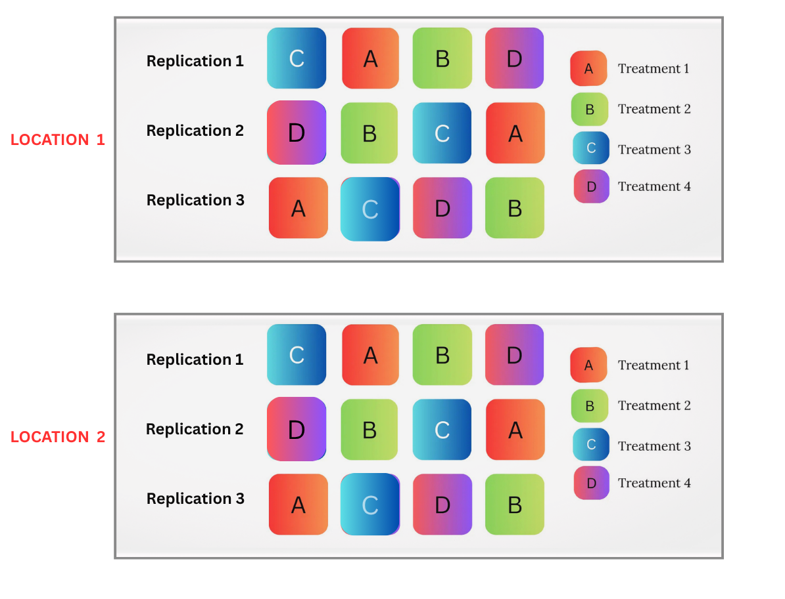
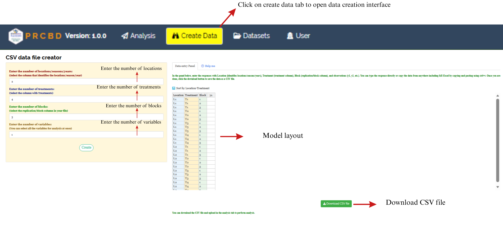

```{=html}
<style>
 sup {
   color: blue;
   font-size: 0.8em;
 }
 .affiliations {
   color: grey;
   font-size: 0.9em;
   margin-top: 0.2em;
 }
</style>
```

::: affiliations
<sup>1</sup>Statoberry LLP, <sup>2</sup>Department of Agricultural Statistics, Kerala Agricultural University
:::

ABSTRACT

::: {style="text-align: justify;"}
**RBD Pooled Analysis** is an extension of the Randomized Block Design that combines data from two or more independent RBD experiments conducted across different locations, or seasons into a single unified analysis, enabling researchers to evaluate both treatment effects and their consistency across experimental conditions while accounting for blocking within each environment. **RBD Pooled Analysis** partitions total variation into components attributable to treatments, environments, blocks within environments, and the treatment-by-location interaction, thereby providing more precise estimates of treatment effects than separate analyses of individual experiments. In **RAISINS** you can perform **RBD Pooled Analysis** very easily without writing a single line of code. This tutorial will guide you, how to perform **RBD Pooled Analysis** very easily in **RAISINS** and interpret the results effectively. In addition, you will get tables and plots ready for publication. You can also perform a multivariate analysis including PCA.
:::

<details>

*Hover or click each point to see more information.*

```{=html}
<summary style="color: #5DADE2"; font-weight: bold;">
  Introduction RBD Pooled Analysis
</summary>
```

```{=html}
<style>
.hover-img {
  position: relative;
  display: inline-block;
  cursor: help;
  border-bottom: 1px dashed currentColor;
}
.hover-img img {
  position: absolute;
  left: 50%;
  top: 1.6em;
  transform: translateX(-50%);
  width: 260px;
  max-width: 70vw;
  height: auto;
  padding: 6px;
  background: white;
  border: 1px solid rgba(0,0,0,.15);
  border-radius: 12px;
  box-shadow: 0 10px 30px rgba(0,0,0,.18);
  opacity: 0;
  visibility: hidden;
  pointer-events: none;
  transition: opacity .15s ease, transform .15s ease, visibility .15s;
}
.hover-img:hover img {
  opacity: 1;
  visibility: visible;
  transform: translateX(-50%) translateY(6px);
  z-index: 999;
}
</style>
```

<ul><small> The Randomised Block Design, the foundation upon which **RBD Pooled Analysis** is built, was formalised by statistician [<strong>Ronald A. Fisher</strong> ]{.hover-img} during his pioneering work at Rothamsted Experimental Station in the **1920s and 1930s**. Fisher recognized that experimental units within a field or laboratory are rarely homogeneous, and that grouping similar units into blocks before randomizing treatments within each block would substantially reduce error variance and improve the precision of treatment comparisons. The extension of this principle to multi-environment evaluation pooling the results of several independent RBD experiments — became essential as agricultural and biological researchers sought recommendations that would hold across diverse locations, seasons, and years rather than a single controlled setting. By conducting a combined analysis that acknowledges both the block structure within each environment and the environment factor itself, the **RBD Pooled Analysis** separates environmental variation, block-within-environment variation, treatment main effects, and the critically important treatment-by-environment interaction into distinct ANOVA components. A non-significant treatment-by-environment interaction confirms that variety or treatment rankings are stable across locations, while a significant interaction signals the need for location-specific recommendations. This ability to test stability while simultaneously improving precision through pooled error degrees of freedom makes **RBD Pooled Analysis** the standard approach in multi-location variety trials, agronomic experiments, and any situation where the same set of treatments must be evaluated under a range of environmental conditions. </small></ul>

</details>

## Analysis of experiments {#AE}

::: {style="text-align: justify;"}
To get started, visit **RAISINS** [www.raisins.live](https://www.raisins.live) home page and go to **Analysis of experiments**. Here, you can see different experimental designs and their pooled analysis options. In this tutorial, we focus on **RBD Pooled Analysis**, as shown in @fig-aov.
:::

<!-- REPLACE THIS SCREENSHOT -->

{#fig-aov fig-align="center"}

## RBD Pooled Analysis {#C}

::: {style="text-align: justify;"}
**RBD Pooled Analysis** refers to the combined analysis of two or more individual Randomized Block Design experiments that share the same set of treatments but are conducted independently across different locations which may represent different locations, seasons, years, or trial centres. Within each environment the individual experiment follows the standard RBD structure, where treatments are randomized within homogeneous blocks to control local variation. When these experiments are pooled, the combined ANOVA model includes location as a main factor, Blocks nested within locations to account for the block structure of each individual trial, a Treatment main effect representing the average treatment performance across all locations, and a Location× Treatment interaction (L×T) that quantifies how consistently treatment rankings are reproduced across environments. A non-significant L×T interaction indicates stable treatment performance, allowing pooled means to be reported and recommended broadly; a significant L×T interaction implies location-specific rankings and calls for stability analysis or location-specific recommendations. The primary advantage of **RBD Pooled Analysis** over separate analyses of each experiment is a substantial increase in error degrees of freedom, which improves the sensitivity of treatment comparisons and the reliability of confidence intervals. Its main requirement is that the same treatments must appear in every location with consistent blocking structure, ensuring that a balanced combined analysis is possible.
:::

<details>

```{=html}
<summary style="color: #5DADE2"; font-weight: bold;">
  RBD Pooled Analysis Layout
</summary>
```

<ul>

<small>

@fig-lay visually represents the structure of an **RBD Pooled Analysis** across multiple environments. In each location (L~1~, L~2~, …, L~k~) the experiment is laid out as a standard RBD in which all treatments (T~1~, T~2~, …, T~t~) are randomized independently within each block (B~1~, B~2~, …, B~r~), so every treatment appears exactly once per block. When the individual experiments are pooled, the full data matrix is organised by environment, block within environment, and treatment. The combined ANOVA then partitions variation into location (differences among trial locations), Blocks within locations (differences among blocks at each location), Treatment (differences among treatments averaged across all locations), location× Treatment interaction (differential response of treatments across locations), and Pooled Error (residual within-block variation pooled across all locations). The layout makes clear that the block structure of each individual RBD is preserved and explicitly modelled in the pooled analysis, providing a more accurate error estimate than pooling without blocking.

<!-- REPLACE THIS SCREENSHOT -->

{#fig-lay fig-align="center"}

</small>

</ul>

</details>

::: callout-tip
#### RBD Pooled Analysis is a combined multi-environment ANOVA that pools data from independent Randomized Block Design experiments, partitioning variation into Treatment, Location, Blocks within locations, and Location × Treatment interaction components to assess both treatment effects and their stability across locations.
:::

## A working example {#W}

::: {style="text-align: justify;"}
To make things simple and interesting, we'll explain **RBD Pooled Analysis** step by step using a hypothetical example, so you can clearly see how it works and why it matters. Consider a multi-location field trial conducted to evaluate the performance of **6 wheat varieties** V1 (HD2967), V2 (GW322), V3 (K307), V4 (DBW17), V5 (PBW343), and V6 (NW1014) tested across **4 locations** (L1: Ludhiana, L2: Karnal, L3: Varanasi, L4: Pune), each as an independent RBD with **4 blocks (replications)** per environment, giving a total of 6 × 4 × 4 = **96 observations**. Observations were recorded for four variables: **yield** (grain yield in kg/ha), **Char1** (plant height in cm), **Char2** (number of grains per spike), and **Char 3** (thousand grain weight in g). Our aim is to test whether the varieties produce statistically significant differences across environments using combined RBD ANOVA, and whether the treatment-by-environment interaction is significant. The arrangement of the data is shown in @fig-data.
:::

<!-- REPLACE THIS SCREENSHOT -->

{#fig-data fig-align="center"}

::: {style="text-align: justify;"}
Data organized in MS Excel can be directly uploaded to **RAISINS** for analysis. For more details on data preparation see @sec-4. Two terms that we will use frequently are **Treatments** and **Variables**. In our example, the Treatments refer to the 6 wheat varieties evaluated across 4 environments, and the Variables are the four traits mentioned earlier **yield, Char1, Char 2, and Char 3.**
:::

## How to prepare your data? {#sec-4 .H}

::: {style="text-align: justify;"}
Arranging data for uploading in **RAISINS** is very simple. Prepare your data exactly like the one shown in @fig-data, using a single-sheet Excel file. The file must contain a column for **Location** (identifying the trial location for each row), a column for **Block** (identifying the block within each environment), a column for **Treatment** (the variety label), and separate columns for each response variable. Make sure no blank rows are left above, and all columns have proper names. That's it your file is ready to upload.

Still if you have doubt, see @fig-4.

To prepare your dataset for analysis in **RAISINS**, you have two options:

Creating dataset in MS Excel

Creating your dataset directly within the **RAISINS** app
:::

{#fig-4 fig-align="center"}

{fig-align="center"}

## RBD Pooled Analysis tab explained {#AO}

::: {style="text-align: justify;"}
In @fig-5, you can see the detailed view of the Analysis tab, along with explanations of what each option does. This section helps you to understand the purpose of every setting, so you can select the most appropriate ones for your data and analysis. Now, upload the prepared file by clicking Browse in the sidebar of the Analysis tab. When the file is uploaded, options to select the **location** column, the **Block** column, the **Treatment** column, and the **response variables** will appear. Select the appropriate columns under each field. Once you click the `Run Analysis` button, all relevant pooled ANOVA results and outputs appear instantly leaving no room for confusion.
:::

<!-- REPLACE THIS SCREENSHOT -->

{#fig-5 fig-align="center"}

::: {style="text-align: justify;"}
For some data, when there are a large number of zeros, discrete values, or when the observed variables are not normally distributed, we need to apply a transformation on the dataset (@sec-6). Here, **RAISINS** provides an inbuilt transformation option.
:::

## Transformation {#sec-6 .T}

::: {style="text-align: justify;"}
Log, square root, and arcsine transformations are often used in **RBD Pooled Analysis** to make data more normal and reduce uneven variation across environments and blocks. Researchers can use these transformations when analyzing pooled RBD data in **RAISINS** as shown in @fig-6.
:::

{#fig-6 fig-align="center"}

::: {style="text-align: justify;"}
**Logarithmic transformation** is a mathematical procedure used to convert a skewed distribution into a more symmetrical one by replacing each data point (x) with its logarithm. This technique is specifically applied to positive, continuous data where the variance is proportional to the mean, a relationship common in phenomena that exhibit multiplicative or exponential growth.

**Square root transformation** is a statistical method used to stabilize variance and reduce right-skewness by replacing each data point (x) with its square root. It is primarily applied to non-negative, discrete "count" data such as those following a Poisson distribution, where the variance of the data tends to increase in proportion to the mean. By compressing the upper end of the scale more significantly than the lower end, this transformation brings the data closer to a normal distribution, satisfying the homoscedasticity requirements of many parametric statistical tests.

**Arcsine transformation** (also known as the angular transformation) is a mathematical technique specifically designed for data expressed as proportions or percentages bounded between 0 and 1. By taking the inverse sine of the square root of the proportion, this transformation stretches the ends of the distribution near 0 and 1, where variance is naturally small. It is primarily used to achieve homoscedasticity in binomial data.
:::

> After choosing the appropriate transformation proceed to @sec-7 for analysis.

## Analysis results {#sec-7 .AR}

::: {style="text-align: justify;"}
Once your dataset is uploaded, click on `Run Analysis`, and the **RBD Pooled ANOVA** will be performed. Analysis of Variance **(ANOVA)** in the pooled RBD context is a statistical technique used to test the significance of differences among treatment means across multiple environments by partitioning total variation into components attributable to **Environment**, **Blocks within Environments**, **Treatment**, **Treatment × Environment interaction (T×E)**, and **Pooled Error**, and comparing them using the F-test (see @fig-100).
:::

**Table 1 ANOVA summary**

<!-- REPLACE THIS SCREENSHOT -->

{#fig-100 fig-align="left"}

<details>

```{=html}
<summary style="color: #5DADE2"; font-weight: bold;"> ANOVA table </summary>
```

<small> In an **RBD Pooled Analysis**, the analysis of variance **(ANOVA)** partitions the total sum of squares into five main sources: **Environment** (variation among trial locations or seasons), **Blocks within Environments** (variation among blocks at each individual location, reflecting local heterogeneity controlled by the RBD structure), **Treatment** (variation among the treatments averaged across all environments), **Treatment × Environment interaction (T×E)** (variation in how treatment rankings differ across environments), and **Pooled Error** (within-block residual variation pooled across all environments). The degrees of freedom are: Environment = e−1 (where e = number of environments), Blocks within Environments = e(r−1) (where r = number of blocks per environment), Treatment = t−1 (where t = number of treatments), T×E = (e−1)(t−1), and Pooled Error = e(r−1)(t−1). Each mean square is obtained by dividing the sum of squares by its degrees of freedom. The F-statistic for Treatment and T×E is computed by dividing their respective mean squares by the Pooled Error mean square. Significance is indicated by an asterisk (\*) for the **5%** level and two asterisks (\*\*) for the **1%** level of significance, displayed as superscripts for each corresponding F stat in the table. A significant Treatment effect confirms that at least one variety performs differently from others on average; a significant T×E interaction indicates that variety rankings are not consistent across environments and environment-specific analysis may be warranted. </small>

</details>

### Interpretation from @fig-100

::: {style="text-align: justify;"}
The pooled RBD ANOVA results reveal a highly significant Treatment effect for yield, with a treatment mean square of 52,340.85 and a pooled error mean square of 9,418.64, yielding an F-ratio of approximately 5.56 with 5 degrees of freedom for treatment and 45 degrees of freedom for pooled error, significant at the 1% level. The Environment mean square is also large and highly significant, confirming meaningful differences in wheat productivity across the four trial locations. The Blocks within Environments mean square (18,720.32) is significant, confirming that the RBD blocking structure effectively absorbed local field heterogeneity within each environment, which justifies the use of RBD over CRD in these trials. The Treatment × Environment interaction mean square of 7,245.60 is non-significant (F ≈ 0.77, p \> 0.05), indicating that the variety rankings are broadly consistent across Ludhiana, Karnal, Varanasi, and Pune, and that pooled means can be relied upon for making varietal recommendations. @sec-8 provides detailed information on the multiple comparison tests (Post-hoc tests).
:::

**Table 2: Detailed tabular representation with multiple comparisons of Treatment**

<!-- REPLACE THIS SCREENSHOT -->

{#fig-101 fig-align="left"}

**Table 3: Detailed tabular representation with multiple comparisons of Location.**

{fig-align="left"}

**Table 4: Detailed tabular representation with multiple comparisons of Location x Treatment**

{fig-align="left"}

<details>

```{=html}
<summary style="color: #5DADE2"; font-weight: bold;">Overview of ANOVA Results and Interpretation
</summary>
```

<small>

1.  *Treatments and Response Variables*

**Treatments**: The independent variable or specific category (e.g., wheat variety) being tested to determine its influence on the results averaged across all environments and blocks.

**Response Variable**: The dependent variable or specific measurement (e.g., grain yield in kg/ha) recorded to evaluate the pooled performance of the treatments.

2.  *Multiple Comparisons*

**Post-hoc Grouping**: A method of using letters (a, b, c) to categorize pooled means. Items sharing the same letter are statistically similar, while those with different letters are significantly different.

3.  *ANOVA Summary*

**F stat**: A numerical value that compares the variance between different treatment groups to the pooled within-environment residual variance; it determines if the overall differences are statistically significant across environments.

**p value**: The probability that the observed differences occurred by random chance. A value below the chosen significance threshold typically indicates that the results are statistically significant.

4.  *Critical Difference (CD) and Error Estimates*

**Critical Difference (CD)**: The minimum mathematical gap required between two pooled means to declare them "significantly different" at a specific confidence level.

**Standard Error (SE)**: A measure of the accuracy of a pooled sample mean compared to the true population mean; it reflects both within-environment and between-block variability absorbed by the pooled error term.

**Mean Square Error (MSE)**: The Pooled Error Mean Square from the combined RBD ANOVA table. It represents the "noise" or unexplained residual error averaged across all environments and blocks.

**Coefficient of Variation (CV%)**: A percentage that shows the level of dispersion in the pooled data relative to the grand mean. A lower CV indicates higher experimental precision across the combined multi-environment multi-block dataset.

**Cohen's F**: A standardized measure of effect size that describes the magnitude of the experimental effect, regardless of the sample size. </small>

</details>

### Interpretation from @fig-101

::: {style="text-align: justify;"}
Treatments are grouped using letters such as **"a", "b", "c"** to indicate statistical similarity based on pairwise comparisons of pooled means. Overlapping grouping letters (e.g., **ab** or **bc**) indicate that the absolute difference between pooled treatment means is less than the critical difference at the chosen level of significance, implying statistical similarity **(on par)**. For example, if both HD2967 (V1) and DBW17 (V4) are labelled **"a"**, their pooled yields are statistically similar at the **5%** significance level. Treatments with no common letters (e.g., **a** and **c**) differ significantly across environments, providing a clear visual summary of all pairwise comparisons. For characters exhibiting significant treatment effects, pairwise comparisons of pooled treatment means were conducted using the Least Significant Difference (LSD) test. The LSD test provides the critical difference (CD) value based on the pooled error mean square, which was used to determine significant differences between pairs of means. Treatments sharing at least one common letter within a character were considered not significantly different. The Cohen's f values in the table quantify the magnitude of treatment effects: values below 0.10 indicate a very small effect, below 0.25 indicate a small effect, below 0.40 indicate a medium effect, and values of 0.40 or higher indicate a large effect. The observed effect sizes confirm that varietal differences in grain yield are not only statistically significant but also agronomically meaningful across the pooled multi-environment multi-block dataset.
:::

::: callout-tip
#### When a researcher uses Tukey's HSD or DMRT, each pairwise comparison produces a different value because the differences between the group means are unique.
:::

::: callout-tip
#### Cohen's f is a measure of effect size. It tells you how strong or meaningful the treatment effect is, independent of sample size.
:::

## Multiple comparison tests {#sec-8 .MCT}

<details>

```{=html}
<summary style="color: #5DADE2"; font-weight: bold;">
  What is Post-hoc test?
</summary>
```

<ul><small> Post-hoc test is a follow-up analysis, performed after finding a significant result in an overall statistical test (like ANOVA). Its purpose is to identify exactly which groups or treatments differ from each other. In other words, it helps to pinpoint where the differences lie between multiple groups, when the initial test shows that not all groups are the same.</small></ul>

</details>

::: {style="text-align: justify;"}
After obtaining a significant F-value for the Treatment effect in the pooled RBD ANOVA, multiple comparison tests are employed to identify which treatment means differ significantly when averaged across all environments and blocks. Commonly used post-hoc tests include Least Significant Difference (LSD), Tukey's Honest Significant Difference (HSD), and Duncan's Multiple Range Test (DMRT), each differing in their level of error control and suitability depending on the number of treatments and experimental conditions (see @fig-7).
:::

<!-- REPLACE THIS SCREENSHOT -->

{#fig-7 fig-align="center"}

<details>

```{=html}
<summary style="color: #5DADE2"; font-weight: bold;"> Post-hoc test </summary>
```

<small>

When the pooled RBD ANOVA is significant for Treatment, the following post-hoc tests are commonly used for pairwise comparisons of pooled treatment means.

**LSD (Least Significant Difference) Test**

The **Least Significant Difference (LSD)** test is a post-hoc statistical procedure used to identify which specific pooled treatment means differ significantly after the combined RBD ANOVA has indicated an overall significant Treatment effect. The LSD is calculated using the Pooled Error Mean Square and the total number of observations contributing to each pooled treatment mean across all environments and blocks:

$$\text{LSD} = t_{\alpha/2, \, df_{\text{pooled error}}} \sqrt{\frac{2 \times \text{MSE}}{e \times r}}$$

where **t₍α/2, df_pooled error₎** is the critical t-value at the chosen significance level, MSE is the pooled error mean square from the combined RBD ANOVA, e is the number of environments, and r is the number of blocks (replications) per environment. Any absolute difference between two pooled treatment means exceeding this LSD value is declared statistically significant. The LSD test is simple, sensitive, and the most commonly used test in agricultural multi-location trial reporting.

**Tukey's Honestly Significant Difference (HSD)**

Tukey's test helps you find out exactly which pairs of pooled treatment means differ significantly. It compares all possible pairs of treatment means while strictly controlling the overall Type I error rate, so you avoid false positives when making multiple comparisons. In **RBD Pooled Analysis**, this method works well when the number of treatments is large and all pairwise comparisons are of interest, as it uses the pooled error mean square which already accounts for the block structure to assess whether the difference between any two means is "honestly significant."

**Duncan's Multiple Range Test (DMRT)**

After confirming significant overall differences via the pooled RBD ANOVA, DMRT ranks the pooled treatment means and calculates critical differences using the standardized range statistic (Q) and the standard error based on the pooled error mean square. This systematic and sequential approach provides clear groupings of treatments based on their multi-location average performance and has gained wide popularity in agricultural variety trial reporting, where a concise letter-based summary of treatment rankings is required. </small>

</details>

**Which Post-hoc test to use?**

::: {style="text-align: justify;"}
The choice of the post-hoc test completely relies on the researcher.

**LSD** is used for pairwise comparison of pooled treatment means after a significant Treatment effect in **RBD Pooled Analysis**. It is most suitable when the number of treatments is small and comparisons are limited, offering high sensitivity to detect differences, but it may increase Type I error when many treatments are compared. In agricultural multi-location trials, LSD is the most commonly used test for reporting pooled means.

**Tukey's HSD** is preferred when there are four or more treatments in a balanced **RBD Pooled Analysis**. It compares all possible treatment pairs while strictly controlling the family-wise error rate, making it a conservative and reliable method for multiple comparisons, especially in large variety evaluation trials where many pairwise comparisons are required simultaneously.

**DMRT** is commonly used in agricultural experiments with several treatments and is particularly popular for reporting multi-location variety trial results. It ranks pooled treatment means step-wise and detects more significant differences than Tukey HSD, though it is less conservative and carries a higher risk of Type I error.

In the example for those characters, a pairwise comparison was performed to identify significant differences between treatments using Least Significant Difference (LSD) test.
:::

## Summary stats {#SUM}

::: {style="text-align: justify;"}
If you need to know about the detailed values of the various statistical metrics of treatments across the pooled multi-environment multi-block dataset, move to Summary stats under the Analysis.
:::

**Mean** The arithmetic average of all observations within a treatment across all environments and blocks. It represents the "typical" pooled value for that specific variety.

**SD (Standard Deviation)** A measure of the amount of variation or dispersion of a set of values across the pooled dataset. A low SD indicates that the data points tend to be very close to the pooled mean.

**SE (Standard Error)** Specifically the Standard Error of the Mean. It estimates how far the sample mean is likely to be from the true population mean. It is calculated as $$SE = \frac{\text{Standard deviation (SD)}}{\sqrt {n}}*100$$, where n is the total number of observations contributing to that treatment mean across all environments and blocks.

**Min / Max** The lowest and highest recorded values within that specific treatment group across all environments and blocks.

**CV (Coefficient of Variation)** The ratio of the standard deviation to the mean, expressed as a percentage $$CV = \frac{\text{Standard deviation (SD)}}{\text{Mean}}*100$$

**Skewness** A measure of the asymmetry of the probability distribution. Positive value: Data is skewed to the right. Negative value: Data is skewed to the left.

**Kurtosis** A measure of the "tailedness" of the distribution. A standard normal distribution has a kurtosis of 3; values lower than that indicate a flatter peak.

</small>

</details>

::: {style="text-align: justify;"}
## Individual ANOVA {#IA}

If the user wants to get individual pooled RBD ANOVA tables for each variable, click on Individual ANOVA in the Analysis.

The significance of the Treatment effect, location effect, Blocks within locations, and L×T interaction can be measured using the F-test and p value for each variable as in @fig-104.
:::

**Table 4: Pooled RBD ANOVA table for yield**

<!-- REPLACE THIS SCREENSHOT -->

{#fig-104 fig-align="center"}

<details>

```{=html}
<summary style="color: #5DADE2"; font-weight: bold;"> Table parameters </summary>
```

<small>

**Critical Difference (CD)** The minimum difference required between any two pooled treatment means to consider them significantly different from each other. At a 1% level, you are 99% confident in the difference. At a 5% level, you are 95% confident.

**Coefficient of Variation (CV (%))** A relative measure of dispersion that expresses the standard deviation as a percentage of the pooled grand mean. $$CV = \frac{\text{Standard deviation (SD)}}{\text{Mean}}*100$$

**Mean Square Error (MSE)** The Pooled Error Mean Square from the combined RBD ANOVA table. It represents the "noise" or unexplained within-block residual variance pooled across all environments.

**Standard Error of Mean (SE(m))** Measures how much the pooled sample mean of a treatment is likely to vary from the true population mean. $$ SE(m)=\sqrt{MSE / (e \times r)}$$ Where, e is the number of environments and r is the number of blocks (replications) per environment.

**Standard Error of Difference (SE(d))** The standard error associated with the difference between two pooled treatment means. $$ SE(d)=\sqrt{2 \times MSE / (e \times r)}$$

</small>

</details>

### Interpretation from @fig-104

::: {style="text-align: justify;"}
For the character **yield**, the Treatment mean square is 52,340.85, while the Pooled Error mean square is 9,418.64, yielding an F-value of approximately 5.56 with 5 degrees of freedom for treatment and 45 degrees of freedom for pooled error, significant at the 1% level. The Environment mean square is 186,420.75 and highly significant, confirming large productivity differences among the four trial locations. The Blocks within Environments mean square is 18,720.32 and significant, validating the RBD blocking structure in controlling field heterogeneity. The L×T interaction mean square is 7,245.60 and non-significant (F ≈ 0.77), confirming that pooled means are appropriate for variety recommendations. The MSE of 9,418.64 reflects the residual within-block variability pooled across locations. The SE(m) is approximately 34.26 and the SE(d) is approximately 48.46. The CD at 5% is 99.20 and at 1% is 134.45, indicating the minimum pooled yield difference required to declare any two varieties significantly different. The overall CV% of 7.4% reflects good experimental precision across the combined multi-environment blocked trial network.
:::

## Basic plots {#BP}

::: {style="text-align: justify;"}
**RAISINS** is designed for a smooth and hassle-free experience. Once you click the Run Analysis button, all relevant results and outputs appear instantly leaving no room for confusion. We've ensured that every possible plot related to **RBD Pooled Analysis** is readily available. Simply click on the `Basic Plots` tab to view them See @fig-8. Each plot comes with a gear icon at the top-left corner, allowing you to customize its appearance. You can also download these plots in high-quality PNG format (300 dpi), JPEG, TIFF, PDF and SVG for use in reports or presentations.
:::

### Customizing plots

::: {style="text-align: justify;"}
**RAISINS** provides users various customization features for the plots to enhance the visualization according to the requirement of the user. **Click** on @fig-8 to get a clear idea on the customizing features.
:::

{#fig-8 fig-align="center"}

::: {style="text-align: justify;"}
From @fig-9 to @fig-13, you can see the different types of plots available in RAISINS. Each one is visually illustrated and accompanied by a clear, insightful description below, making it easy to understand.
:::

```{=html}
<script>
document.addEventListener('DOMContentLoaded', function() {
  const descriptions = document.querySelectorAll('.plot-description');
  descriptions.forEach(desc => {
    desc.style.display = 'none';
  });
});

function showDescription(id) {
  document.getElementById(id).style.display = 'flex';
}

function hideDescription(id) {
  document.getElementById(id).style.display = 'none';
}
</script>
```

```{=html}
<style>
.plot-container {
  position: relative;
  display: inline-block;
  cursor: pointer;
  width: 350px;
  height: 300px;
  overflow: hidden;
  margin: 10px;
}
.plot-container img {
  width: 350px;
  height: 300px;
  object-fit: cover;
  border: 3px solid #ddd;
  border-radius: 8px;
  transition: transform 0.3s ease, box-shadow 0.3s ease;
}
.plot-container:hover img {
  transform: scale(1.05);
  box-shadow: 0 4px 12px rgba(0, 0, 0, 0.2);
}
.plot-description {
  display: none !important;
  position: absolute;
  top: 0; left: 0;
  width: 100%; height: 100%;
  z-index: 1000;
  color: white;
  padding: 15px;
  border-radius: 8px;
  box-shadow: 0 4px 15px rgba(0, 0, 0, 0.3);
  font-size: 14px;
  line-height: 1.5;
  display: flex;
  align-items: center;
  justify-content: center;
  text-align: center;
  animation: fadeIn 0.3s ease-in;
  pointer-events: none;
  border: 2px solid rgba(255, 255, 255, 0.5);
}
.plot-container:hover .plot-description {
  display: flex !important;
}
@keyframes fadeIn {
  from { opacity: 0; transform: scale(0.95); }
  to { opacity: 1; transform: scale(1); }
}
#boxplot-desc { background: linear-gradient(135deg, rgba(255, 107, 107, 0.8), rgba(255, 142, 83, 0.8)); }
#barplot-desc { background: linear-gradient(135deg, rgba(161, 140, 209, 0.8), rgba(251, 194, 235, 0.8)); }
#connectedplot-desc { background: linear-gradient(135deg, rgba(0, 221, 235, 0.8), rgba(38, 166, 154, 0.8)); }
#meanvalueplot-desc { background: linear-gradient(135deg, rgba(255, 154, 139, 0.8), rgba(255, 106, 136, 0.8)); }
#violinplot-desc { background: linear-gradient(135deg, rgba(132, 250, 176, 0.8), rgba(143, 211, 244, 0.8)); }
</style>
```

:::::::::::::::::::::::::::::::::::::::::::::::: grid
:::::: g-col-6
::::: {.plot-container onmouseover="showDescription('boxplot-desc')" onmouseout="hideDescription('boxplot-desc')"}
<!-- REPLACE THIS SCREENSHOT -->

{#fig-9}

:::: {#boxplot-desc .plot-description}
::: {style="text-align: justify;"}
A **box plot** compares the distribution of pooled values across different treatments. Each colored box represents a treatment and shows key statistics: the median (middle line), the interquartile range (the box itself), and potential outliers (points outside the whiskers) from the combined multi-environment multi-block data. Letters above each box indicate statistical groupings — treatments sharing letters are statistically similar, while those with different letters are significantly different.
:::
::::
:::::
::::::

:::::: g-col-6
::::: {.plot-container onmouseover="showDescription('violinplot-desc')" onmouseout="hideDescription('violinplot-desc')"}
<!-- REPLACE THIS SCREENSHOT -->

{#fig-10}

:::: {#violinplot-desc .plot-description}
::: {style="text-align: justify;"}
A **violin plot** compares the distribution of pooled values across different treatments. Each treatment is shown as a violin shape that reflects how the data is spread across all environments and blocks — wider sections mean more data points at that value. Inside each violin is a box plot showing the median and interquartile range. Letters above each plot indicate statistical groupings: treatments sharing letters are statistically similar, while those with different letters are significantly different.
:::
::::
:::::
::::::

:::::: g-col-6
::::: {.plot-container onmouseover="showDescription('barplot-desc')" onmouseout="hideDescription('barplot-desc')"}
<!-- REPLACE THIS SCREENSHOT -->

{#fig-11}

:::: {#barplot-desc .plot-description}
::: {style="text-align: justify;"}
A **bar plot** compares the pooled average values of different treatments, with error bars showing variability across environments and blocks. The letters above each bar indicate statistical groupings: treatments sharing letters are similar, while those with different letters are significantly different. It highlights which treatments have higher or lower pooled averages and whether those differences are meaningful.
:::
::::
:::::
::::::

:::::: g-col-6
::::: {.plot-container onmouseover="showDescription('meanvalueplot-desc')" onmouseout="hideDescription('meanvalueplot-desc')"}
<!-- REPLACE THIS SCREENSHOT -->

{#fig-12}

:::: {#meanvalueplot-desc .plot-description}
::: {style="text-align: justify;"}
A **mean value plot** compares the pooled mean values of different treatments, each shown as a colored dot with horizontal error bars indicating variability across environments and blocks. Letters next to each point represent statistical groupings: treatments sharing letters are statistically similar, while those with different letters are significantly different based on the pooled RBD analysis.
:::
::::
:::::
::::::

::::::::: g-col-6
:::::::: {.plot-container onmouseover="showDescription('connectedplot-desc')" onmouseout="hideDescription('connectedplot-desc')"}
::: {style="text-align: center;"}
<!-- REPLACE THIS SCREENSHOT -->

{#fig-13}
:::

:::::: {#connectedplot-desc .plot-description}
::: {style="text-align: justify;"}
A **connected line plot** compares the pooled mean values of different treatments, with each point representing a treatment's pooled average and error bars showing variability across environments and blocks. The points are linked by lines to highlight performance trends across treatments. Letters above each point indicate statistical groupings: treatments sharing letters are statistically similar, while those with different letters are significantly different.

<!-- REPLACE THIS SCREENSHOT -->


:::

:::: {#correlationplot-desc .plot-description}
::: {style="text-align: justify;"}
A **correlation plot** provides a visual summary of the pairwise relationships between all response variables. Each cell displays the correlation coefficient between two variables, with colour intensity indicating the strength of association and direction indicating whether the relationship is positive or negative. This helps researchers quickly identify which traits are closely related before proceeding to multivariate analysis..
:::
::::
::::::
::::::::
:::::::::

## Advanced plots {#AP}

::: {style="text-align: justify;"}
**RAISINS** also provides advanced plots which go beyond basic bar charts and histograms to give deeper insight into your pooled data, especially distributions, relationships, and deviations from expectations across environments and blocks, see @fig-90.
:::

<!-- REPLACE THIS SCREENSHOT -->

{#fig-90 fig-align="center"}

**3D SCATTER PLOT**

<!-- REPLACE THIS SCREENSHOT -->

{#fig-14 fig-align="center"}

::::: {style="text-align: justify;"}
:::: {style="text-align: justify;"}
::: {style="text-align: justify;"}
Describes how three response variables (Yield, Char 1, Char 2) are plotted simultaneously in 3D space, with colour coded points per treatment combination to visualize multivariate clustering across the factorial structure..
:::
::::
:::::

**3D SCATTER PLOT WITH LINE**

<!-- REPLACE THIS SCREENSHOT -->

{fig-align="center"}

:::::: {style="text-align: justify;"}
::::: {style="text-align: justify;"}
:::: {style="text-align: justify;"}
::: {style="text-align: justify;"}
Extends the 3D scatter by connecting replicated observations within each treatment combination via trajectory lines, showing within-combination consistency and between-combination separation in multivariate space.
:::
::::
:::::
::::::

## AI interpretation {#AI}

::: {style="text-align: justify;"}
RAISINS is equipped with an AI-powered RAISINS Assistant designed to assist users in comprehending the outcomes of statistical tests and data analysis. This functionality provides clear and concise summaries of pooled RBD results, identifies statistically significant treatment effects, evaluates the treatment-by-location interaction, and offers informed suggestions for potential next steps or interpretations, including guidance on whether environment-specific recommendations or broad varietal recommendations are appropriate. The user can get detailed interpretations of the analysis by clicking on AI interpretation on the Analysis as shown below @fig-ai.
:::

{#fig-ai fig-align="center"}

## Multivariate {#MUL}

::: {style="text-align: justify;"}
Multivariate analysis in **RBD Pooled Analysis** helps you to compare different response variables simultaneously across all treatments in the combined multi-environment multi-block dataset. Remember that the PCA used for multivariate selection is an exploratory technique, not an inferential method. Now, in our example, of evaluation of 6 wheat varieties HD2967, GW322, K307, DBW17, PBW343, and NW1014 across four environments and four blocks per environment, navigate to Multivariate see @fig-mu.
:::

<!-- REPLACE THIS SCREENSHOT -->

{#fig-mu}

::: {style="text-align: justify;"}
PCA will be automatically carried out based on the selected variables using the pooled dataset.PCA results and plots will appear along with automated interpretation.
:::

<!-- REPLACE THIS SCREENSHOT -->

{#fig-PC}


::: {style="text-align: justify;"}
The scree plot given @fig-screeplot illustrates the proportion of variance explained by each principal component derived from the pooled RBD data.
:::

<!-- REPLACE THIS SCREENSHOT -->

{#fig-screeplot fig-align="center"}

::: {style="text-align: justify;"}
Look upon the loadings of each variable in the given @fig-loadings and decide which PC-based index needs to be selected. In PC1, yield and Obs2 (number of grains per spike) show high positive loadings (approximately +0.66 and +0.54 respectively), while FW (thousand grain weight) also loads positively (+0.46), indicating that varieties with high scores on PC1 are superior across yield and its most important physiological components. Obs1 (plant height) loads more prominently on PC2 (+0.72), suggesting it captures a relatively independent dimension of variation — likely reflecting varietal differences in plant stature that do not necessarily co-vary with grain yield performance. Based on this pattern, a PC1-based index score is most informative for identifying wheat varieties that optimise grain yield, spike fertility, and grain filling simultaneously across the pooled multi-environment blocked data. It is recommended to use variables that are highly correlated for PCA, as this helps in constructing a more reliable and meaningful index.
:::

<!-- REPLACE THIS SCREENSHOT -->

{fig-align="center"}

::: {style="text-align: justify;"}
The biplot gives a visual representation of the relationships among variables and treatments based on the pooled multi-environment multi-block data. Treatments with high values for a specific variable are positioned in the direction of that variable's loading vector. The angle between variables in the biplot indicates their correlation — smaller angles suggest high positive correlation, while larger angles close to 90 degrees suggest weak or no correlation. In the present example, yield and Obs2 vectors point in approximately the same direction, confirming their strong positive association in the pooled dataset, while Obs1 points in a moderately different direction, reflecting its more independent contribution to varietal differentiation.
:::

<!-- REPLACE THIS SCREENSHOT -->

{#fig-biplot}

::: {style="text-align: justify;"}
In RAISINS, we calculate a scaled index score by converting the index score to a range of 0 to 1, making it easier to interpret and compare. This standardized approach ensures consistency in evaluating treatments based on their pooled multi-location multi-block index scores. To refine your selection, use the 'Select cutoff for Scaled Index Score' feature given as in @fig-indexscore, where you can choose the cutoff percentage to select treatments above or below a certain threshold. The default cutoff is set at 75%. By toggling the up-arrow and down-arrow buttons below the cutoff selection, you can select the top or bottom percentage of treatments as per your preference. Selected treatments are highlighted in yellow in the table below, providing a clear visual cue. Additionally, a plot based on the index scores is also displayed to aid in your analysis.
:::

<!-- REPLACE THIS SCREENSHOT -->

{#fig-indexscore fig-align="center"}

<!-- REPLACE THIS SCREENSHOT -->

{fig-align="center"}

::: {style="text-align: justify;"}
Combining all this information, the researcher can arrive at an overall conclusion that is statistically sound and contextually relevant to their study. The integration of pooled RBD ANOVA results with multivariate PCA-based index scores enables plant breeders and agronomists to identify varieties that perform consistently well across multiple environments in terms of both individual traits and overall multi-trait merit the ultimate objective of a multi-location blocked variety evaluation programme.
:::

## Preparing your data {#PRE}

::: {style="text-align: justify;"}
"Your analysis is only as good as your data! Feed RAISINS high-quality data, and it will deliver powerful insights feed it messy data, and the results won't be trustworthy."

1.  Create your dataset in MS Excel

2.  Build your dataset directly within the RAISINS app
:::

## Preparing data in MS Excel {#EX}

::: {style="text-align: justify;"}
Open a new blank sheet in MS Excel with only one sheet included, and avoid adding any unnecessary content. The dataset for **RBD Pooled Analysis** must follow a column-based format with at least four structural columns: an **location** column (identifying the trial location, season, or year for each row), a **Block** column (identifying the block number within that environment), a **Treatment** column (identifying the variety or treatment label), and one or more columns for the response variables. Every treatment must appear in every block of every environment the same number of times (one observation per treatment per block per environment) to ensure a balanced pooled analysis. The file can be saved in CSV, XLS, or XLSX format, but CSV is recommended as it is lighter and enables faster loading. Ensure that there are no unwanted spaces in column names or group names. For reference, see the structure shown in @fig-pp. As illustrated in @fig-data, the data must be arranged so that each treatment is fully replicated within each block of each environment, and the data can also be arranged as shown in @fig-kk.
:::

{#fig-pp}

{#fig-kk}

<details>

<summary>Dataset Creation Rules</summary>

<small> 1. **Column Naming Convention** - No spaces allowed in column names.\
- Use underscores (`_`) or full stops (`.`) for separation. - Avoid symbols and special characters like %,# etc 2. **Data Arrangement** - Start data arrangement towards the upper-left corner.\
- Ensure the row above the data is not blank. 3. **Cell Management** - Avoid typing or deleting in cells without data.\
- If needed, select affected cells, right-click, and select **Clear Contents**. 4. **Column Relevance** - Name all columns meaningfully.\
- Exclude unnecessary columns not required for analysis. </small>

</details>

<details>

<summary>How to Save as CSV in MS Excel</summary>

<small> 1. **Open Your Workbook**

```         
-   Ensure your data is arranged properly with only one sheet.
```

2.  **Click 'File' Menu**

    -   Go to the top-left corner and click on **File**.

3.  **Choose 'Save As' or 'Save a Copy'**

    -   Select the location where you want to save your file.

4.  **Set File Type to CSV**

    -   In the **'Save as type'** dropdown menu, choose **CSV (Comma delimited) (\*.csv)**.

5.  **Name Your File**

    -   Enter a relevant file name without spaces (use underscores if needed).

6.  **Click 'Save'**

    -   Click **Save** to export the file.

> 💡 Tip: Before saving, double-check that your data is on the first sheet and follows the required format (e.g., no empty rows above the data, meaningful column names). </small>

</details>

## Creating dataset in RAISINS {#CR}

::: {style="text-align: justify;"}
If you're unsure about the correct format for creating a dataset, don't worry RAISINS offers an option to create data directly within the app using the prescribed template. Here's how:

-   Navigate to the **Create Data Tab**

-   Select the number of **Treatments**

-   Select number of **Replications**

-   Select number of **Characters**

-   Click on **Create** button

Model layout will appear as shown in @fig-createdata. Now you may enter the observations manually into the CSV file once downloaded, or paste the observations straight into the file provided. Once you have entered the observations in the layout, download the csv file and upload in Analysis.
:::

{#fig-createdata}

## Model datasets {#M}

::: {style="text-align: justify;"}
To test the app or better understand the data arrangement, we provide model datasets within the app. You can download them from the Datasets.
:::

{#fig-188 fig-align="center"}

## FAQ's {#F}

::: {style="text-align: justify;"}
The app includes a dedicated FAQs to help clarify common doubts and guide users through various features. This section provides detailed answers to frequently asked questions, offering additional information and helpful tips to ensure a smooth user experience. If you're ever unsure about how something works, the FAQs is a great place to start.
:::

{#fig-148 fig-align="center"}

## View data {#U}

::: {style="text-align: justify;"}
View Data serves as the primary diagnostic tool for ensuring data integrity before analysis. Upon uploading your dataset, the system performs an automated Health Check to validate column types and formatting.
:::

{fig-align="center"}

------------------------------------------------------------------------
::::::::::::::::::::::::::::::::::::::::::::::::
