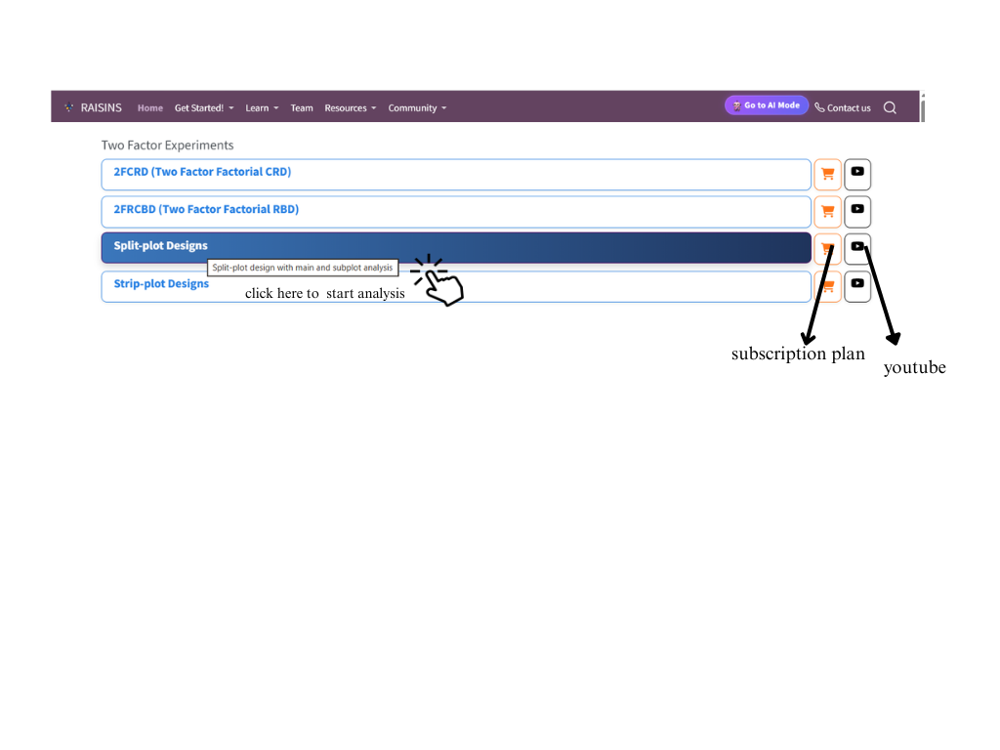
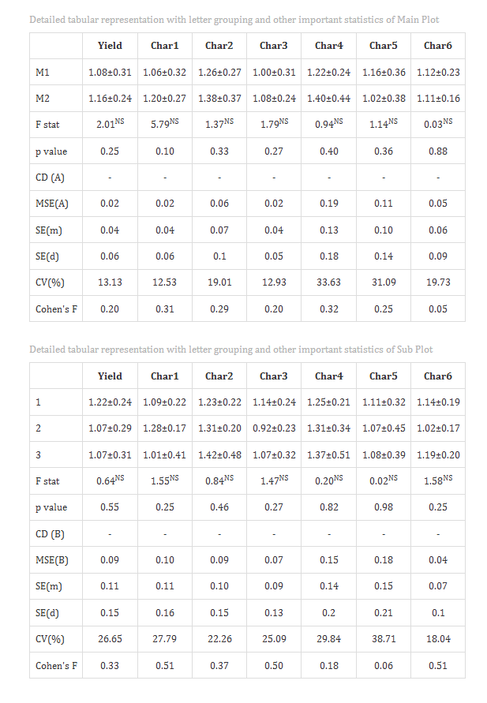
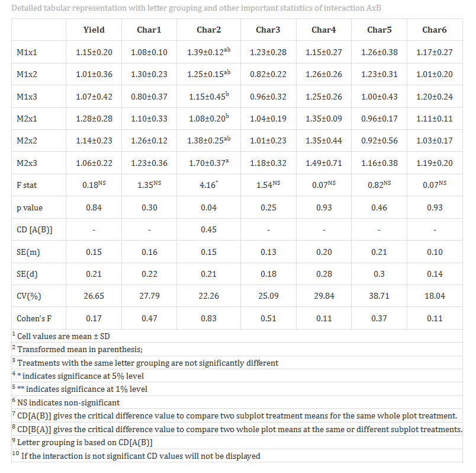

```{=html}
<style>
 sup {
   color: blue;
   font-size: 0.8em;
 }
 .affiliations {
   color: grey;
   font-size: 0.9em;
   margin-top: 0.2em;
 }
</style>
```

::: affiliations
<sup>1</sup>Statoberry LLP, <sup>2</sup>Department of Agricultural Statistics, Kerala Agricultural University
:::

ABSTRACT

::: {style="text-align: justify;"}
Split Plot Design **(SPD)** is a two-factor experimental design in which experimental units are arranged in two layers — main plots and sub-plots — allowing factors that require larger experimental units to be assigned to main plots while factors requiring smaller, more precise units are assigned within sub-plots. **SPD** accommodates two distinct sources of experimental error, one for main plot comparisons and another for sub-plot and interaction comparisons, thereby improving precision for sub-plot factor estimates. In **RAISINS** you can perform SPD very easily without writing a single line of code. This tutorial will guide you, how to perform SPD very easily in **RAISINS** and interpret the results effectively. In addition, you will get tables and plots ready for publication. You can also perform a multivariate analysis including MANOVA and PCA.
:::

<details>

*Hover or click each point to see more information.*

```{=html}
<summary style="color: #5DADE2"; font-weight: bold;">
  Introduction Split Plot Design
</summary>
```

```{=html}
<style>
.hover-img {
  position: relative;
  display: inline-block;
  cursor: help;
  border-bottom: 1px dashed currentColor;
}

.hover-img img {
  position: absolute;
  left: 50%;
  top: 1.6em;
  transform: translateX(-50%);
  width: 260px;
  max-width: 70vw;
  height: auto;
  padding: 6px;
  background: white;
  border: 1px solid rgba(0,0,0,.15);
  border-radius: 12px;
  box-shadow: 0 10px 30px rgba(0,0,0,.18);

  opacity: 0;
  visibility: hidden;
  pointer-events: none;
  transition: opacity .15s ease, transform .15s ease, visibility .15s;
}

.hover-img:hover img {
  opacity: 1;
  visibility: visible;
  transform: translateX(-50%) translateY(6px);
  z-index: 999;
}
</style>
```

<ul><small> The concept of the **Split Plot Design (SPD)** originated in the early twentieth century within the fertile intellectual environment of [<strong>Ronald A. Fisher</strong> ]{.hover-img} at the Rothamsted Experimental Station in England. As agricultural researchers began investigating experiments involving two factors simultaneously — such as irrigation methods and crop varieties — it became clear that certain factors (like large-scale tillage or irrigation treatments) could not be practically randomised at the same level as more manageable subplot factors (like seed rates or fertilizer doses). Fisher and his colleagues formalised the split plot framework, in which the experimental area is first divided into larger units called main plots, to which the levels of the first factor (Factor A) are randomly assigned. Each main plot is then subdivided into smaller sub-plots, within which the levels of the second factor (Factor B) are independently randomised. The fundamental statistical insight behind SPD is that two separate error terms emerge naturally from this structure — the main plot error, which captures the variability between main plots within replications, and the sub-plot error, which captures the residual variability within sub-plots after fitting main plot, sub-plot, and interaction effects. Because the sub-plot error is typically smaller than the main plot error, SPD achieves higher precision for sub-plot and interaction comparisons than for main plot comparisons. This asymmetric precision is both its defining strength and a critical consideration in the interpretation of results. The design became foundational to experimental statistics in agronomy, horticulture, and plant breeding, where the practical constraints of field experimentation naturally lead to hierarchical plot structures. </small></ul>

</details>

## Analysis of experiments {#AE}

::: {style="text-align: justify;"}
To get started, visit **RAISINS** [www.raisins.live](https://www.raisins.live) home page and go to **Analysis of experiments**. Here, you can see different two-factor experimental designs. In this tutorial, we focus on **Split Plot Design (SPD)**, as shown in @fig-aov.
:::

{#fig-aov fig-align="center"}

## Split Plot Design (SPD) {#C}

::: {style="text-align: justify;"}
A Split Plot Design **(SPD)** is a two-factor experimental design in which the experimental area is divided hierarchically into main plots and sub-plots. The levels of one factor — typically the one that is more difficult or impractical to randomise, such as irrigation method, tillage system, or spacing — are randomly assigned to the main plots within each replication. Each main plot is then sub-divided into as many sub-plots as there are levels of the second factor, and these levels are randomly assigned within each main plot. This hierarchical randomisation generates two independent experimental errors: the **main plot error** (Error a), used to test the main plot factor (Factor A), and the **sub-plot error** (Error b), used to test the sub-plot factor (Factor B) and the interaction between A and B. Because the sub-plot error reflects variation at a finer spatial or temporal scale, it is generally smaller than the main plot error, making SPD particularly efficient for detecting differences due to Factor B and the A×B interaction. SPD is widely used in field agronomy, horticulture, and food science whenever one factor requires a larger experimental unit. When neither factor requires differential plot sizes, a Factorial RBD may be more appropriate as it provides equal precision for all comparisons.
:::

<details>

```{=html}
<summary style="color: #5DADE2"; font-weight: bold;">
  SPD Layout
</summary>
```

<ul>

<small>

@fig-lay In this design, the experimental area is first divided into large plots, known as main plots, to which the main plot treatments such as A1, A2, A3 are randomly assigned (these represent different levels of the main factor, for example different irrigation levels). Each main plot is then further subdivided into smaller units called subplots, where the subplot treatments such as B1, B2, B3, B4 are applied randomly (these represent levels of another factor, for example different fertilizer types). This results in two levels of experimental units and two stages of randomization. The design is particularly useful in agricultural experiments where one factor is difficult or costly to change, while another factor can be applied more easily. It allows the study of both main effects and interactions between treatments, but involves more complex analysis and provides less precision for main plot treatments compared to subplot treatments.The design produces 3 × 4 = 12 treatment combinations in total, with each combination replicated three times across the three replications, yielding 36 experimental units overall.

{#fig-lay fig-align="center"}

</small>

</ul>

</details>

::: callout-tip
#### Split Plot Design (SPD) is a two-factor experimental design in which main plot treatments are randomised across larger experimental units and sub-plot treatments are independently randomised within each main plot, generating two distinct error terms that reflect the hierarchical structure of the experiment.
:::

## A working example {#W}

::: {style="text-align: justify;"}
To make things simple and interesting, we'll explain SPD analysis step by step using a hypothetical example, so you can clearly see how it works and why it matters. Consider a field experiment designed to study the effect of irrigation method and nitrogen fertilizer dose on rice. The main plot factor is Irrigation method, with two levels: M1 (Drip irrigation) and M2 (Flood irrigation). The sub-plot factor is Nitrogen dose, with three levels: S1 (60 kg N/ha), S2 (90 kg N/ha), and S3 (120 kg N/ha). The experiment is laid out in 4 replications, giving a total of 2 × 3 × 4 = 24 experimental units. Observations were recorded for seven variables: Yield (tonnes per hectare), Char1 (plant height in cm), and Char2 (number of tillers per hill) Char3 (number of panicles per hill) Char4 (grain weight in gram) Char5 (biomass yield in t/ha ) Char6 (harvest index in %) . Our aim is to test whether the main plot factor, the sub-plot factor, and their interaction produce statistically significant differences using ANOVA. The arrangement of the data is shown in @fig-data.
:::

{#fig-data fig-align="center"}

::: {style="text-align: justify;"}
As shown in @fig-data, the dataset should follow the structure described in the image above. Ensure there is only one sheet in the uploaded file. The **first three columns** must represent the **main plot treatments**, **subplot treatments**, and **replication** respectively — these can be named as per your preference (e.g., Mainplot, Subplot, Replication). All characters under study are arranged in subsequent columns. For example, Mainplot (with two levels M1 and M2) is the main plot factor, Subplot (with three levels 1, 2, 3) is the subplot factor nested within main plots, and Replication indicates the number of replicates (e.g., 1 to 4). The characters under study (e.g., Yield, Char1, Char2,Char3,etc) are arranged in columns corresponding to each main plot, subplot, and replication combination. Data organized in MS Excel can be directly uploaded to **RAISINS** for analysis. For more details on data preparation see @sec-4. Two terms that we will use frequently are **Main Plot Treatments** and **Sub-plot Treatments**. In our example, the Main Plot Treatments refer to the irrigation methods (M1, M2), and the Sub-plot Treatments refer to the nitrogen doses (S1, S2, S3).
:::

## How to prepare your data? {#sec-4 .H}

::: {style="text-align: justify;"}
Arranging data for uploading in **RAISINS** is very simple. Prepare your data exactly like the one shown in @fig-data, using a single-sheet Excel file with three leading columns — one for the main plot factor, one for the sub-plot factor, and one for replication — followed by all response variable columns. Make sure no blank rows are left above, and all columns have proper names. That's it — your file is ready to upload.

Still if you have doubt, see @fig-4.

{fig-align="center"}

To prepare your dataset for analysis in **RAISINS**, you have two options:

Creating dataset in MS Excel

Creating your dataset directly within the **RAISINS** app
:::

\![Illustrating how to create a dataset\] \## SPD analysis tab explained {#AO}

## SPD analysis tab explained {#sec-5 .T}

::: {style="text-align: justify;"}
In @fig-5, you can see the detailed view of the Analysis tab, along with explanations of what each option does. This section helps you to understand the purpose of every setting, so you can select the most appropriate ones for your data and analysis. Now, upload the prepared file by clicking `Browse` in the sidebar of the `Analysis` tab. When the file is uploaded, options to select the **Main Plot**, **Sub-plot**, **Replication**, and **Variables** will appear. Select the appropriate column representing the main plot factor under **Main Plot**, the sub-plot factor column under **Sub-plot**, and the replication identifier under **Replication**. Then select the response variables you wish to analyse. Once you click the `Run Analysis` button, all relevant results and outputs appear instantly leaving no room for confusion.
:::

-02.png){#fig-5 fig-align="center"}

For some data, when there are large number of zeros / discrete values / when the observed variables are not normally distributed, we need to do transformation on the dataset (@sec-6). Here, **RAISINS** provide inbuilt transformation option.

## Transformation {#sec-6 .T}

::: {style="text-align: justify;"}
Log, square root, and arcsine transformations are often used in SPD analysis to make data more normal and reduce uneven variation. Researchers can use these transformations when analyzing experimental data in **RAISINS** as shown in @fig-6.
:::

{#fig-6 fig-align="center"}

::: {style="text-align: justify;"}
**Logarithmic transformation** is a mathematical procedure used to convert a skewed distribution into a more symmetrical one by replacing each data point (x) with its logarithm. This technique is specifically applied to positive, continuous data where the variance is proportional to the mean, a relationship common in phenomena that exhibit multiplicative or exponential growth.

**Square root transformation** is a statistical method used to stabilize variance and reduce right-skewness by replacing each data point (x) with its square root. It is primarily applied to non-negative, discrete "count" data such as those following a Poisson distribution, where the variance of the data tends to increase in proportion to the mean. By compressing the upper end of the scale more significantly than the lower end, this transformation brings the data closer to a normal distribution, satisfying the homoscedasticity requirements of many parametric statistical tests.

**Arcsine transformation** (also known as the angular transformation) is a mathematical technique specifically designed for data expressed as proportions or percentages bounded between 0 and 1. By taking the inverse sine of the square root of the proportion, this transformation stretches the ends of the distribution near 0 and 1, where variance is naturally small. It is primarily used to achieve homoscedasticity in binomial data.
:::

> After choosing the appropriate transformation proceed to @sec-7 for analysis.

## Analysis results {#sec-7 .AR}

::: {style="text-align: justify;"}
Once your dataset is uploaded, click on `Run Analysis`, and the **Split Plot ANOVA** will be performed. Analysis of Variance **(ANOVA)** in a Split Plot Design partitions the total variation into components attributable to Replications, Main Plot factor (A), Main Plot Error (Error a), Sub-plot factor (B), the A×B Interaction, and Sub-plot Error (Error b). Critically, the F-test for the Main Plot factor uses the **Main Plot Error** as its denominator, while the F-tests for the Sub-plot factor and the Interaction use the **Sub-plot Error** as their denominator (see @fig-100).
:::

**Table 1 ANOVA summary**

{#fig-100 fig-align="center"}

<details>

```{=html}
<summary style="color: #5DADE2"; font-weight: bold;"> ANOVA table </summary>
```

<small> In a **Split Plot Design (SPD)**, the total sum of squares is partitioned into six components, each associated with specific degrees of freedom as shown below. With **a** = number of main plot levels, **b** = number of sub-plot levels, and **r** = number of replications:

| Source of Variation       | Degrees of Freedom |
|---------------------------|--------------------|
| Replications              | r − 1              |
| Main Plot (A)             | a − 1              |
| Main Plot Error (Error a) | (a − 1)(r − 1)     |
| Sub-plot (B)              | b − 1              |
| A × B Interaction         | (a − 1)(b − 1)     |
| Sub-plot Error (Error b)  | a(b − 1)(r − 1)    |
| **Total**                 | **abr − 1**        |

In our example with a = 2 main plot levels, b = 3 sub-plot levels, and r = 3 replications: Replication df = 2, Main Plot df = 1, Main Plot Error df = 2, Sub-plot df = 2, Interaction df = 2, Sub-plot Error df = 8, Total df = 17. The F-value for the Main Plot factor is computed as MS(A) / MS(Error a), while the F-values for the Sub-plot and Interaction are computed as MS(B) / MS(Error b) and MS(A×B) / MS(Error b) respectively. Significance is indicated by an asterisk ( \* ) for the **5%** level and two asterisks (\*\*) for the **1%** level of significance, displayed as superscripts for each corresponding F stat in the table. If the computed F value exceeds the critical value, the null hypothesis is rejected for that source of variation. </small>

</details>

### Interpretation from @fig-100

::: {style="text-align: justify;"}
The Split Plot ANOVA results presented in Table 1 show the effects of the main plot factor (A), sub plot factor (B), and their interaction (A×B) on Yield and characters (Char1 to Char6). For Yield, both the main plot and sub plot factors were found to be non-significant (NS), indicating that neither factor independently influenced yield. The interaction effect was also non-significant, suggesting no combined influence of A and B on yield. Similarly, for **Char1**, all sources of variation—main plot, sub plot, and interaction—were non-significant, indicating no treatment effect. In the case of **Char2,** while the main plot and sub plot factors were non-significant, the interaction effect (A×B) was significant at the 5% level (\*), showing that the response of Char2 depends on the combination of treatments rather than individual effects. For **Char3, Char4, Char5, and Char6**, all sources of variation remained non-significant, indicating that these characters were not affected by either factor or their interaction. Overall, the analysis reveals that there were no significant treatment effects on Yield and most characters, except for Char2 where a significant interaction effect was observed, suggesting the importance of considering treatment combinations for this character.
:::

**Table 2: Detailed tabular representation with multiple comparisons**

<!-- REPLACE THIS SCREENSHOT -->

{#fig-101 fig-align="center"}

{fig-align="center"}

<details>

```{=html}
<summary style="color: #5DADE2"; font-weight: bold;">Overview of ANOVA Results and Interpretation
</summary>
```

<small>

1.  *Treatments and Response Variables*

**Main Plot Treatments**: The primary independent variable assigned to large experimental units (e.g., irrigation method) whose effect is tested against the Main Plot Error.

**Sub-plot Treatments**: The secondary independent variable assigned within each main plot (e.g., nitrogen dose) whose effect is tested against the Sub-plot Error.

**Response Variable**: The dependent variable or specific measurement (e.g., Yield or Char1) recorded to evaluate the performance of the treatment combinations.

2.  *Multiple Comparisons*

**Post-hoc Grouping**: A method of using letters (a, b, c) to categorize means. Items sharing the same letter are statistically similar, while those with different letters are significantly different. In SPD, different critical differences apply when comparing main plot means, sub-plot means, or treatment combination means.

3.  *ANOVA Summary*

**F stat**: A numerical value that compares the variance between different groups to the variance within those groups; it determines if the overall differences are statistically significant.

**p value**: The probability that the observed differences occurred by random chance. A value less than 0.05 typically indicates that the results are statistically significant.

4.  *Critical Difference (CD) and Error Estimates*

**Critical Difference (CD)**: The minimum mathematical gap required between two means to declare them "significantly different" at a specific confidence level. In SPD, separate CD values are calculated for main plot comparisons (using Error a) and sub-plot / interaction comparisons (using Error b).

**Standard Error (SE)**: A measure of the accuracy of a sample mean compared to the true population mean; it indicates how much the mean might fluctuate.

**Mean Square Error (MSE)**: The average of the squared differences between observed values and the predicted mean; it represents the "noise" or unexplained error in the experiment. SPD produces two MSE values — MSE(a) for main plots and MSE(b) for sub-plots.

**Coefficient of Variation (CV%)**: A percentage that shows the level of dispersion in the data. A lower CV indicates higher precision and reliability in the experimental measurements.

**Cohen's F**: A standardized measure of effect size that describes the magnitude of the experimental effect, regardless of the sample size. </small>

</details>

### Interpretation from @fig-101

::: {style="text-align: justify;"}

The statistical comparison of treatment means for the main plot (A), sub plot (B), and their interaction (A×B). Treatments sharing common letters are statistically at par, while those without common letters differ significantly. For the **main plot factor (A),** both M1 and M2 showed no significant differences for Yield and all characters, as confirmed by non-significant F-values and absence of grouping distinctions, indicating that irrigation methods did not influence the traits. For the **sub plot factor (B),** the treatment means across levels (1, 2, and 3) were also non-significant for all variables, suggesting that sub plot treatments did not produce statistically different effects. However, in the interaction (A×B), a significant effect was observed only for Char2 at the 5% level. The letter groupings (a, ab, b) for Char2 indicate that certain treatment combinations differ significantly, while some remain statistically similar. Specifically, combinations sharing letters are at par, whereas those without common letters show significant differences, confirming that Char2 response depends on the interaction between main and sub plot factors. For Yield and the remaining characters (Char1, Char3, Char4, Char5, and Char6), the interaction effect was non-significant, indicating no meaningful differences among treatment combinations. The Cohen’s f values suggest generally small to moderate effect sizes, supporting the conclusion that treatment effects are minimal except for Char2 interaction. Overall, the results highlight that only **Char2** is influenced by treatment combinations, while all other traits remain statistically unaffected.
:::

::: callout-tip
#### When a researcher uses Tukey's HSD or DMRT, each pairwise comparison produces a different value because the differences between the group means are unique.
:::

::: callout-tip
#### Cohen's f is a measure of effect size. It tells you how strong or meaningful the treatment effect is, independent of sample size.
:::

## Multiple comparison tests {#sec-8 .MCT}

<details>

```{=html}
<summary style="color: #5DADE2"; font-weight: bold;">
  What is Post-hoc test?
</summary>
```

<ul><small> Post-hoc test is a follow-up analysis, performed after finding a significant result in an overall statistical test (like ANOVA). Its purpose is to identify exactly which groups or treatments differ from each other. In other words, it helps to pinpoint where the differences lie between multiple groups, when the initial test shows that not all groups are the same.</small></ul>

</details>

::: {style="text-align: justify;"}
After obtaining a significant F-value in the SPD ANOVA, multiple comparison tests are employed to identify which treatment means differ significantly. Commonly used post hoc tests include Least Significant Difference (LSD), Tukey's Honest Significant Difference (HSD), and Duncan's Multiple Range Test (DMRT), each differing in their level of error control and suitability depending on the number of treatments and experimental conditions (see @fig-7). A key feature of SPD post-hoc comparisons is that **different standard errors and critical differences apply** depending on whether you are comparing main plot means, sub-plot means within the same main plot, sub-plot means across different main plots, or treatment combination means.
:::

.png){#fig-7 fig-align="center"}

<details>

```{=html}
<summary style="color: #5DADE2"; font-weight: bold;"> Post-hoc test </summary>
```

<small>

When the ANOVA in a **Split Plot Design (SPD)** is significant, the following post hoc tests are commonly used for pairwise comparisons: Tukey's Honestly Significant Difference (HSD) test, Fisher's Least Significant Difference (LSD) test, and Duncan's Multiple Range Test (DMRT). Because SPD has two error terms, the standard error used in these tests depends on which comparison is being made.

**LSD (Least Significant Difference) Test**

The **Least Significant Difference (LSD)** test identifies which specific treatment means differ significantly after ANOVA indicates an overall significant effect. In SPD, three types of LSD values are relevant:

For comparing **main plot means** (using Error a): $$\text{LSD}_A = t_{\alpha/2,\,df_{Ea}} \sqrt{\frac{2\,\text{MSE}_a}{r \cdot b}}$$

For comparing **sub-plot means within the same main plot** (using Error b): $$\text{LSD}_{B(A)} = t_{\alpha/2,\,df_{Eb}} \sqrt{\frac{2\,\text{MSE}_b}{r}}$$

For comparing **sub-plot means across different main plots** (using a combined error): $$\text{LSD}_{B} = t_{\alpha/2,\,df_{Eb}} \sqrt{\frac{2\,\text{MSE}_b}{r \cdot a}}$$

where r = number of replications, a = number of main plot levels, b = number of sub-plot levels, MSE_a = Main Plot Error mean square, and MSE_b = Sub-plot Error mean square.

**Tukey's Honestly Significant Difference (HSD)**

Tukey's test compares all possible pairs of treatment means while controlling the overall Type I error rate. In SPD, when comparing treatment combination means or sub-plot means within a main plot, the Sub-plot Error (MSE_b) is used as the basis for the HSD calculation. For main plot comparisons, the Main Plot Error (MSE_a) is used. This test is particularly recommended when there are multiple treatment combinations being compared simultaneously.

**Duncan's Multiple Range Test (DMRT)**

After confirming significant overall differences via ANOVA, DMRT ranks the treatment means and calculates critical differences using the studentized range statistic and the standard error based on the appropriate error variance from the SPD ANOVA table. DMRT is popular in agricultural experiments because it provides clear letter-based groupings and detects more significant differences than Tukey HSD, though it carries a higher risk of Type I error. </small>

</details>

**Which Post-hoc test to use?**

::: {style="text-align: justify;"}
The choice of the post-hoc test completely relies on the researcher.

**LSD** is used for pairwise comparison of means after a significant ANOVA in SPD. It is most suitable when the number of treatment combinations is small and comparisons are pre-planned, offering high sensitivity to detect differences. However, it may increase the Type I error rate when many combinations are compared simultaneously. In agricultural experiments LSD is the most commonly used.

**Tukey's HSD** is preferred when there are four or more treatment combinations in a balanced SPD and all pairwise comparisons are of interest. It compares all possible pairs of means while strictly controlling the family-wise error rate, making it a conservative and reliable method.

**DMRT** is commonly used in agricultural experiments with several treatment combinations. It ranks means step-wise and detects more significant differences than Tukey HSD, though it is less conservative and carries a higher risk of Type I error.

In the example, pairwise comparisons were performed to identify significant differences between treatment combinations using the Least Significant Difference (LSD) test, with separate critical differences computed for main plot comparisons, sub-plot comparisons within the same main plot, and sub-plot comparisons across different main plots.
:::

## Summary stats {#SUM}

::: {style="text-align: justify;"}
If you need to know about the detailed values of the various statistical metrics of treatments, move to `Summary stats` under the `Analysis`.
:::

**Table 3: Summary statistics**

<!-- REPLACE THIS SCREENSHOT -->

{#fig-102 fig-align="center"}

<details>

```{=html}
<summary style="color: #5DADE2"; font-weight: bold;"> Table parameters </summary>
```

<small>

**Mean** The arithmetic average of all observations within a treatment combination. It represents the "typical" value for that specific main plot and sub-plot combination.

**SD (Standard Deviation)** A measure of the amount of variation or dispersion of a set of values. A low SD indicates that the data points tend to be very close to the mean.

**SE (Standard Error)** Specifically the Standard Error of the Mean. It estimates how far the sample mean is likely to be from the true population mean. It is calculated as $$SE = \frac{\text{Standard deviation (SD)}}{\sqrt {n}}*100$$, where n is the number of observations.

**Min / Max** The lowest and highest recorded values within that specific treatment combination group.

**CV (Coefficient of Variation)** The ratio of the standard deviation to the mean, expressed as a percentage $$CV = \frac{\text{Standard deviation (SD)}}{\text{Mean}}*100$$

It allows you to compare the variability between groups with different scales.

**Skewness** A measure of the asymmetry of the probability distribution. Positive value: Data is skewed to the right (long tail on the right). Negative value: Data is skewed to the left (long tail on the left).

**Kurtosis** A measure of the "tailedness" of the distribution. A standard normal distribution has a kurtosis of 3; values lower than that indicate a flatter peak.

</small>

</details>

### Interpretations from @fig-102

::: {style="text-align: justify;"}
The summary statistics table presents performance across the six treatment combinations (M1S1, M1S2, M1S3, M2S1, M2S2, M2S3) evaluated in the SPD experiment with three replications. The combination M2S1 (Flood irrigation with 60 kg N/ha) recorded the highest mean yield (1.28 t/ha), while M1S2 (Drip irrigation with 90 kg N/ha) recorded the lowest (0.93 t/ha), suggesting that the benefit of increasing nitrogen dose differs between irrigation methods. Among the main plot means, M2 (Flood irrigation) showed a marginally higher overall mean yield than M1 (Drip irrigation). Among the sub-plot means, S1 (60 kg N/ha) consistently produced the highest mean yield across both irrigation methods. Treatment combination M1S3 showed the highest variability in Yield (CV = 32.6%), indicating inconsistent response to high nitrogen under drip irrigation, while M2S2 was the most stable across replications (CV = 14.8%). Skewness values are modest and close to zero for most combinations, and kurtosis values indicate relatively flat distributions, which is expected with only three replications per treatment combination.
:::

## Individual ANOVA {#IA}

::: {style="text-align: justify;"}
If the user wants to get individual ANOVA table for each variable click on `Individual ANOVA` in the `Analysis`.

The significance of the main plot factor, sub-plot factor, and their interaction can be measured using F-test and p values as shown in @fig-104.
:::

**Table 4: ANOVA table for Yield**

<!-- REPLACE THIS SCREENSHOT -->

{#fig-104 fig-align="center"}

<details>

```{=html}
<summary style="color: #5DADE2"; font-weight: bold;"> Table parameters </summary>
```

<small>

**Critical Difference (CD)**

The minimum difference required between any two treatment means to consider them significantly different from each other. In SPD, separate CD values are reported: **CD for Main Plot means** (based on MSE_a and its df), **CD for Sub-plot means within the same main plot** (based on MSE_b), and **CD for Sub-plot means across different main plots** (based on MSE_b with an adjusted standard error). At the 1% level you are 99% confident in the difference; at the 5% level you are 95% confident.

**Coefficient of Variation (CV (%))**

A relative measure of dispersion that expresses the standard deviation as a percentage of the mean. $$CV = \frac{\text{Standard deviation (SD)}}{\text{Mean}}*100$$

**Mean Square Error — Main Plot (MSE_a)**

The residual mean square from the main plot stratum of the SPD ANOVA. It represents unexplained variability between main plots within replications and is used as the error for testing the main plot factor.

**Mean Square Error — Sub-plot (MSE_b)**

The residual mean square from the sub-plot stratum. It represents unexplained variability within sub-plots after fitting all effects and is used as the error for testing the sub-plot factor and the interaction.

**Standard Error of Mean (SE(m))**

Measures how much the sample mean of a treatment is likely to vary from the true population mean. For sub-plot comparisons: $$ SE(m)=\sqrt{MSE_b / r}$$ where r is the number of replications.

**Standard Error of Difference (SE(d))**

The standard error associated with the difference between two treatment means. For sub-plot comparisons within the same main plot: $$ SE(d)=\sqrt{2 \times MSE_b / r}$$

</small>

</details>

### Interpretation from @fig-104

::: {style="text-align: justify;"}
The individual ANOVA table for Yield in the SPD experiment shows a Main Plot sum of squares of 0.05 with 1 degree of freedom (MS = 0.05), tested against the Main Plot Error mean square of 0.09 (df = 2), giving F = 0.56 — **not significant (NS)**. This indicates that the two irrigation methods did not produce significantly different overall mean yields. The Sub-plot factor (Nitrogen dose) sum of squares is 0.32 with 2 degrees of freedom (MS = 0.16), tested against the Sub-plot Error mean square of 0.06 (df = 8), giving F = 4.21, which is significant at the **5% level** (\*). The A×B Interaction sum of squares is 0.48 with 2 degrees of freedom (MS = 0.24), yielding F = 3.89 — significant at the **5% level** (\*). Because the interaction is significant, sub-plot means should be compared within each level of the main plot factor. The CD for sub-plot comparisons within the same main plot is 0.39 at 5% and 0.55 at 1%. The CV% for this experiment is 21.4%, which is acceptable for a field experiment with highly variable agronomic conditions, reflecting the inherent variability among replications in field-based rice research.
:::

**Table 5: Summary statistics with letter groupings**

<!-- REPLACE THIS SCREENSHOT -->

{#fig-103 fig-align="center"}

### Interpretation from @fig-103

::: {style="text-align: justify;"}
The table compares treatment combination means for Yield with letter groupings derived from the LSD test. Within Drip irrigation (M1), the combination M1S1 (1.18 t/ha, **"a"**) was the highest yielding and statistically superior to M1S2 (0.93 t/ha, **"b"**), while M1S3 (1.15 t/ha, **"ab"**) was statistically at par with both. Within Flood irrigation (M2), M2S1 (1.28 t/ha, **"a"**) led, followed by M2S2 (1.18 t/ha, **"ab"**) and M2S3 (1.04 t/ha, **"b"**). Combinations sharing any common letter within a main plot level are statistically on par; those with no overlapping letters are significantly different. The overall pattern confirms that the response to increasing nitrogen dose is more beneficial under drip irrigation at lower levels but shows diminishing returns at the highest nitrogen dose under both methods.
:::

## Basic plots {#BP}

::: {style="text-align: justify;"}
**RAISINS** is designed for a smooth and hassle-free experience. Once you click the `Run Analysis` button, all relevant results and outputs appear instantly — leaving no room for confusion. We've ensured that every possible plot related to the Split Plot Design is readily available. Simply click on the `Basic Plots` tab to view them (See @fig-8). Each plot comes with a gear icon at the top-left corner, allowing you to customize its appearance. You can also download these plots in high-quality PNG format (300 dpi), JPEG, TIFF, PDF and SVG for use in reports or presentations.
:::

### Customizing plots

::: {style="text-align: justify;"}
**RAISINS** provides users various customization features for the plots to enhance the visualization according to the requirement of the user. **Click** on @fig-8 to get a clear idea on the customizing features.
:::

{#fig-8 fig-align="center"}

::: {style="text-align: justify;"}
From @fig-9 to @fig-13, you can see the different types of plots available in RAISINS. Each one is visually illustrated and accompanied by a clear, insightful description below, making it easy to understand.
:::

```{=html}
<script>
document.addEventListener('DOMContentLoaded', function() {
  const descriptions = document.querySelectorAll('.plot-description');
  descriptions.forEach(desc => {
    desc.style.display = 'none';
  });
});

function showDescription(id) {
  document.getElementById(id).style.display = 'flex';
}

function hideDescription(id) {
  document.getElementById(id).style.display = 'none';
}
</script>
```

```{=html}
<style>
.plot-container {
  position: relative;
  display: inline-block;
  cursor: pointer;
  width: 350px;
  height: 300px;
  overflow: hidden;
  margin: 10px;
}

.plot-container img {
  width: 350px;
  height: 300px;
  object-fit: cover;
  border: 3px solid #ddd;
  border-radius: 8px;
  transition: transform 0.3s ease, box-shadow 0.3s ease;
}

.plot-container:hover img {
  transform: scale(1.05);
  box-shadow: 0 4px 12px rgba(0, 0, 0, 0.2);
}

.plot-description {
  display: none !important;
  position: absolute;
  top: 0;
  left: 0;
  width: 100%;
  height: 100%;
  z-index: 1000;
  color: white;
  padding: 15px;
  border-radius: 8px;
  box-shadow: 0 4px 15px rgba(0, 0, 0, 0.3);
  font-size: 14px;
  line-height: 1.5;
  display: flex;
  align-items: center;
  justify-content: center;
  text-align: center;
  animation: fadeIn 0.3s ease-in;
  pointer-events: none;
  border: 2px solid rgba(255, 255, 255, 0.5);
}

.plot-container:hover .plot-description {
  display: flex !important;
}

@keyframes fadeIn {
  from { opacity: 0; transform: scale(0.95); }
  to { opacity: 1; transform: scale(1); }
}

#boxplot-desc { background: linear-gradient(135deg, rgba(255, 107, 107, 0.8), rgba(255, 142, 83, 0.8)); }
#barplot-desc { background: linear-gradient(135deg, rgba(161, 140, 209, 0.8), rgba(251, 194, 235, 0.8)); }
#connectedplot-desc { background: linear-gradient(135deg, rgba(0, 221, 235, 0.8), rgba(38, 166, 154, 0.8)); }
#meanvalueplot-desc { background: linear-gradient(135deg, rgba(255, 154, 139, 0.8), rgba(255, 106, 136, 0.8)); }
#violinplot-desc { background: linear-gradient(135deg, rgba(132, 250, 176, 0.8), rgba(143, 211, 244, 0.8)); }
</style>
```

:::::::::::::::::::::::: grid
:::::: g-col-6
::::: {.plot-container onmouseover="showDescription('boxplot-desc')" onmouseout="hideDescription('boxplot-desc')"}
<!-- REPLACE THIS SCREENSHOT -->

{#fig-9}

:::: {#boxplot-desc .plot-description}
::: {style="text-align: justify;"}
A **box plot** compares the distribution of values across different treatment combinations in the SPD. Each colored box represents a main plot–sub-plot combination and shows key statistics: the median (middle line), the interquartile range (the box itself), and potential outliers (points outside the whiskers). Letters above each box indicate statistical groupings — treatment combinations sharing letters are statistically similar, while those with different letters are significantly different.
:::
::::
:::::
::::::

:::::: g-col-6
::::: {.plot-container onmouseover="showDescription('violinplot-desc')" onmouseout="hideDescription('violinplot-desc')"}
<!-- REPLACE THIS SCREENSHOT -->

{#fig-10}

:::: {#violinplot-desc .plot-description}
::: {style="text-align: justify;"}
A **violin plot** compares the distribution of values across treatment combinations. Each combination is shown as a violin shape reflecting how the data is spread — wider sections indicate more data points at that value. Inside each violin is a box plot showing the median and interquartile range. Letters above each plot indicate statistical groupings: treatment combinations sharing letters are statistically similar, while those with different letters are significantly different.
:::
::::
:::::
::::::

:::::: g-col-6
::::: {.plot-container onmouseover="showDescription('barplot-desc')" onmouseout="hideDescription('barplot-desc')"}
<!-- REPLACE THIS SCREENSHOT -->

{#fig-11}

:::: {#barplot-desc .plot-description}
::: {style="text-align: justify;"}
A **bar plot** compares the average values of different treatment combinations, with error bars showing variability. The letters above each bar indicate statistical groupings: combinations sharing letters are statistically similar, while those with different letters are significantly different. It highlights which main plot–sub-plot combinations have higher or lower averages and whether those differences are meaningful.
:::
::::
:::::
::::::

:::::: g-col-6
::::: {.plot-container onmouseover="showDescription('meanvalueplot-desc')" onmouseout="hideDescription('meanvalueplot-desc')"}
<!-- REPLACE THIS SCREENSHOT -->

{#fig-12}

:::: {#meanvalueplot-desc .plot-description}
::: {style="text-align: justify;"}
A **mean value plot** compares the mean values of different treatment combinations, each shown as a colored dot with horizontal error bars indicating variability. Letters next to each point represent statistical groupings: combinations sharing letters are statistically similar, while those with different letters are significantly different. This plot is particularly useful for visualising the relative ranking of all SPD treatment combinations.
:::
::::
:::::
::::::

::::::: g-col-6
:::::: {.plot-container onmouseover="showDescription('connectedplot-desc')" onmouseout="hideDescription('connectedplot-desc')"}
::: {style="text-align: center;"}
<!-- REPLACE THIS SCREENSHOT -->

{#fig-13}
:::

:::: {#connectedplot-desc .plot-description}
::: {style="text-align: justify;"}
A **connected line plot** compares the mean values of treatment combinations, with each point representing a combination's average and error bars showing variability. The points are linked by lines to highlight how the response variable changes across sub-plot levels within each main plot. This plot is especially informative in SPD as it visually reveals the nature of the A×B interaction — diverging or crossing lines indicate a significant interaction.
:::
::::
::::::
:::::::
::::::::::::::::::::::::

## Advanced plots {#AP}

::: {style="text-align: justify;"}
**RAISINS** also provides `advanced plots` which goes beyond basic bar charts and histograms to give deeper insight into your data, especially distributions, relationships, and deviations from expectations. (See @fig-90)
:::

<!-- REPLACE THIS SCREENSHOT -->

{#fig-90 fig-align="center"}

**SUMMARY PLOT**

<!-- REPLACE THIS SCREENSHOT -->

{#fig-14 fig-align="center"}

::: {style="text-align: justify;"}
A summary plot is a visual representation that shows how data are distributed across treatment combinations in the SPD. It helps quickly understand the pattern, spread, and central tendency of the data for each main plot–sub-plot combination.
:::

**ADVANCED RAINCLOUD PLOT**

<!-- REPLACE THIS SCREENSHOT -->

{#fig-15 fig-align="center"}

::: {style="text-align: justify;"}
Advanced raincloud plot combines a density plot, boxplot, and individual data points to show the full distribution of each treatment combination. The colored density ("cloud") shows where values are most concentrated, the boxplot summarizes the median and quartiles, and the dots ("rain") represent individual observations. In SPD, this plot is useful for assessing within-group variability across the six main plot–sub-plot combinations.
:::

**QQ PLOT**

<!-- REPLACE THIS SCREENSHOT -->

{#fig-16 fig-align="center"}

::: {style="text-align: justify;"}
Q–Q (quantile–quantile) plot is used to assess normality of the data. The points represent observed data quantiles plotted against theoretical quantiles from a normal distribution. When points lie close to the diagonal reference line, the data approximately follows a normal distribution, satisfying the normality assumption of the SPD ANOVA.
:::

**RAIN CLOUD PLOT**

<!-- REPLACE THIS SCREENSHOT -->

{#fig-17 fig-align="center"}

::: {style="text-align: justify;"}
Raincloud plot shows the distribution of the response variable across each treatment combination. The half-violin (cloud) represents the data density, indicating where values are most concentrated. The boxplot summarizes the median and interquartile range, and the jittered points (rain) show individual observations for each of the six combinations in the SPD.
:::

**DISTRIBUTION PLOT**

<!-- REPLACE THIS SCREENSHOT -->

{#fig-18 fig-align="center"}

::: {style="text-align: justify;"}
The distribution plot shows how the data values are spread for each treatment combination in the SPD. It provides a visual comparison of the pattern, spread, and variability of observations across main plot–sub-plot combinations, helping to understand overall differences, interaction patterns, and consistency of the data within each combination.
:::

## AI interpretation {#AI}

::: {style="text-align: justify;"}
RAISINS is equipped with an AI-powered RAISINS Assistant designed to assist users in comprehending the outcomes of statistical tests and data analysis. This functionality provides clear and concise summaries of results, identifies statistically significant differences between groups, and offers informed suggestions for potential next steps or interpretations. In SPD, the AI assistant is particularly helpful in explaining the distinction between main plot error and sub-plot error, and in interpreting the practical significance of a significant interaction term. The user can get detailed interpretations of the analysis by clicking on `AI interpretation` on the `Analysis` as shown below @fig-ai.
:::

{#fig-ai fig-align="center"}

## Multivariate {#MUL}

::: {style="text-align: justify;"}
Multivariate analysis in Split Plot Design **(SPD)** helps you to compare different response variables simultaneously across all treatment combinations. Remember the PCA used for multivariate selection is an exploratory technique, not an inferential method. Now, in our example of evaluating the effect of irrigation method and nitrogen dose on rice — with treatment combinations M1S1, M1S2, M1S3, M2S1, M2S2, and M2S3 — by an agronomist, navigate to `Multivariate` see @fig-mu.
:::

<!-- REPLACE THIS SCREENSHOT -->

{#fig-mu}

::: {style="text-align: justify;"}
MANOVA and PCA will be automatically carried out based on the selected variables. MANOVA table with interpretation appears automatically. PCA results and plots will appear along with automated interpretation.
:::

<!-- REPLACE THIS SCREENSHOT -->

{#fig-MAN2 fig-align="center"}

::: {style="text-align: justify;"}
A MANOVA was conducted to test the null hypothesis that the mean vectors of the characters under study are the same across all treatment combinations against the alternative that at least one pair of mean vectors differs. In this study we are evaluating whether there is any significant difference among the six treatment combinations (M1S1, M1S2, M1S3, M2S1, M2S2, M2S3) for the combined dependent variables: Yield, Char1, and Char2. Pillai's trace was used as the test statistic as it is the most powerful and robust test even under potential assumption violations. The Pillai's trace statistic for the treatment combination effect, its corresponding F-statistic, and p-value indicate whether the six combinations differ significantly for the combined character set. The partial eta squared value indicates the proportion of total variance in the dependent variables explained by the treatment combination differences. A significant MANOVA result, combined with PCA-based index scoring, enables the identification of the overall best-performing treatment combination. Now you can combine this result with PCA-based index score to identify a treatment combination based on overall score.
:::

::: {style="text-align: justify;"}
The table titled 'Eigen Values PCA' given @fig-PC provides information about the eigenvalues and the percentage of variance explained by each principal component. The principal components with eigenvalues greater than one are considered important for further analysis. PC1 accounts for the largest proportion of variance in the dataset, capturing the dominant direction of variability among the six treatment combinations. Together, PC1 and PC2 typically explain a substantial proportion of the total variance (cumulative variance). Since PC1 explains more than 40% of the variance, a PC1-based index score is a strong consideration. Additionally, if both PCs together explain more than 60% of the variance, an index score based on both PCs is also appropriate. The scree plot below illustrates the proportion of variance explained by each principal component.
:::

<!-- REPLACE THIS SCREENSHOT -->

{#fig-PC}

::: {style="text-align: justify;"}
The scree plot given @fig-screeplot illustrates the proportion of variance explained by each principal component.
:::

<!-- REPLACE THIS SCREENSHOT -->

{#fig-screeplot fig-align="center"}

::: {style="text-align: justify;"}
Look upon the loadings of each variable in the given @fig-loadings and decide which PC-based index needs to be selected. Variables with positive loadings in PC1 indicate that treatment combinations with high PC1 index scores perform well for those traits. Variables with negative loadings in PC1 suggest that low PC1 index scores favour those traits. For PC2, a similar interpretation applies. In the context of the rice SPD experiment, if Yield and Char1 both have positive loadings in PC1, treatment combinations with high PC1-based index scores (such as M2S1 or M1S1) would be recommended as overall superior combinations. It is recommended to use variables that are highly correlated for PCA, as this helps in constructing a more reliable and meaningful index.
:::

<!-- REPLACE THIS SCREENSHOT -->

{#fig-loadings fig-align="center"}

::: {style="text-align: justify;"}
The biplot gives a visual representation of the relationships among variables and treatment combinations. Treatment combinations with high values for a specific variable are positioned in the direction of that variable's arrow. The angle between variable arrows in the biplot indicates their correlation — smaller angles suggest high positive correlation, while larger angles close to 90 degrees suggest weak or no correlation. The biplot thus aids in identifying which treatment combinations perform well for which traits simultaneously, providing a holistic view of the SPD results across all measured variables.
:::

<!-- REPLACE THIS SCREENSHOT -->

{#fig-biplot}

::: {style="text-align: justify;"}
In RAISINS, we calculate a scaled index score by converting the index score to a range of 0 to 1, making it easier to interpret and compare. This standardised approach ensures consistency in evaluating treatment combinations based on their index scores. To refine your selection, use the 'Select cutoff for Scaled Index Score' feature given as in @fig-indexscore, where you can choose the cutoff percentage to select combinations above or below a certain threshold. The default cutoff is set at 75%. By toggling the up-arrow and down-arrow buttons below the cutoff selection, you can select the top or bottom percentage of combinations as per your preference. Selected combinations are highlighted in yellow in the table below, providing a clear visual cue. Additionally, a plot based on the index scores is also displayed to aid in your analysis.
:::

<!-- REPLACE THIS SCREENSHOT -->

{#fig-indexscore fig-align="center"}

<!-- REPLACE THIS SCREENSHOT -->

{#fig-index fig-align="center"}

::: {style="text-align: justify;"}
Combining all this information, the experimenter can arrive at an overall conclusion that is statistically sound and contextually relevant to their study. For example, if M2S1 consistently achieves a high scaled index score based on PC1, and MANOVA confirms significant multivariate differences among combinations, the agronomist can confidently recommend Flood irrigation at 60 kg N/ha as the optimal treatment combination for rice production under the given experimental conditions.
:::

## Preparing your data {#PRE}

::: {style="text-align: justify;"}
"Your analysis is only as good as your data! Feed RAISINS high-quality data, and it will deliver powerful insights — feed it messy data, and the results won't be trustworthy."

1.  Create your dataset in MS Excel

2.  Build your dataset directly within the RAISINS app
:::

## Preparing data in MS Excel {#EX}

::: {style="text-align: justify;"}
Open a new blank sheet in MS Excel with only one sheet included, and avoid adding any unnecessary content. The dataset should follow a column-based format where the **first three columns** represent the main plot treatments, sub-plot treatments, and replication respectively — you can name these columns as per your preference (e.g., Mainplot, Subplot, Replication). All characters under study (e.g., Yield, Char1, Char2) should be arranged in subsequent columns. In SPD with 2 main plot levels, 3 sub-plot levels, and 3 replications, the total number of rows will equal 2 × 3 × 3 = 18. The file can be saved in CSV, XLS, or XLSX format, but CSV is recommended as it is lighter and enables faster loading. Ensure that there are no unwanted spaces in column names or group names, and that main plot and sub-plot level labels are consistent throughout (e.g., use M1/M2, not M1/m2 or M1/M 2). For reference, see the structure shown in @fig-pp. The data should be arranged such that for each replication, all combinations of main plot and sub-plot levels appear, and the observations for each variable are recorded in the corresponding row as shown in @fig-kk.
:::

<!-- REPLACE THIS SCREENSHOT -->

{#fig-pp}

<!-- REPLACE THIS SCREENSHOT -->

{#fig-kk}

<details>

<summary>Dataset Creation Rules</summary>

<small> 1. **Column Naming Convention** - No spaces allowed in column names.\
- Use underscores (`_`) or full stops (`.`) for separation. - Avoid symbols and special characters like %,# etc 2. **Data Arrangement** - Start data arrangement towards the upper-left corner.\
- Ensure the row above the data is not blank. - The first three columns must always be: Main Plot factor, Sub-plot factor, Replication — in that order. 3. **Cell Management** - Avoid typing or deleting in cells without data.\
- If needed, select affected cells, right-click, and select **Clear Contents**. 4. **Column Relevance** - Name all columns meaningfully.\
- Exclude unnecessary columns not required for analysis. 5. **Level Labels** - Ensure main plot and sub-plot level names are consistent and free from leading/trailing spaces. - Numeric sub-plot levels (1, 2, 3) are acceptable and will be recognised correctly by RAISINS. </small>

</details>

<details>

<summary>How to Save as CSV in MS Excel</summary>

<small> 1. **Open Your Workbook**

```         
-   Ensure your data is arranged properly with only one sheet.
```

2.  **Click 'File' Menu**

    -   Go to the top-left corner and click on **File**.

3.  **Choose 'Save As' or 'Save a Copy'**

    -   Select the location where you want to save your file.

4.  **Set File Type to CSV**

    -   In the **'Save as type'** dropdown menu, choose **CSV (Comma delimited) (\*.csv)**.

5.  **Name Your File**

    -   Enter a relevant file name without spaces (use underscores if needed).

6.  **Click 'Save'**

    -   Click **Save** to export the file.

> 💡 Tip: Before saving, double-check that your data is on the first sheet and follows the required format (no empty rows above the data, meaningful column names, and consistent level labels for both the main plot and sub-plot factors). </small>

</details>

## Creating dataset in RAISINS {#CR}

::: {style="text-align: justify;"}
If you're unsure about the correct format for creating a dataset, don't worry — RAISINS offers an option to create data directly within the app using the prescribed template. Here's how:

-   Navigate to the **Create Data Tab**

-   Select the number of **Main Plot levels**

-   Select the number of **Sub-plot levels**

-   Select number of **Replications**

-   Select number of **Characters**

-   Click on **Create** button

Model layout will appear as shown in @fig-createdata. Now you may enter the observations manually into the CSV file once downloaded, or paste the observations straight into the file provided. Once you have entered the observations in the layout, download the csv file and upload in `Analysis`.
:::

{#fig-createdata width="1011"}

## Model datasets {#M}

::: {style="text-align: justify;"}
To test the app or better understand the data arrangement, we provide model datasets within the app. You can download them from the `Datasets`.
:::

{#fig-188 fig-align="center"}

## FAQ's {#F}

::: {style="text-align: justify;"}
The app includes a dedicated `FAQs` to help clarify common doubts and guide users through various features. This section provides detailed answers to frequently asked questions, offering additional information and helpful tips to ensure a smooth user experience. If you're ever unsure about how something works, the `FAQs` is a great place to start.
:::

{#fig-148 fig-align="center"}

## View data {#U}

::: {style="text-align: justify;"}
`View Data` serves as the primary diagnostic tool for ensuring data integrity before analysis. Upon uploading your dataset, the system performs an automated Health Check to validate column types and formatting. For SPD data, the Health Check confirms that the main plot, sub-plot, and replication columns are correctly identified and that all treatment combinations are complete and balanced before analysis proceeds.
:::

{fig-align="center"}

------------------------------------------------------------------------
