```{=html}
<style>
 sup {
   color: blue;
   font-size: 0.8em;
 }
 .affiliations {
   color: grey;
   font-size: 0.9em;
   margin-top: 0.2em;
 }
</style>
```

::: affiliations
<sup>1</sup>Statoberry LLP, <sup>2</sup>Department of Agricultural Statistics, Kerala Agricultural University
:::

ABSTRACT

::: {style="text-align: justify;"}
The **Split Plot(2,1) Design** is a two-factor experimental design where one factor (the main plot factor) is assigned to larger experimental units called main plots, and the other factor (the sub-plot factor) is assigned to smaller units within each main plot, enabling differential precision in estimating the two factor effects. **Split Plot** **(2,1)Design** is particularly suitable for experiments where one factor requires large plot sizes or involves difficult-to-change conditions, while the second factor can be applied flexibly within those larger units. In **RAISINS** you can perform **Split Plot (2,1) Design** very easily without writing a single line of code. This tutorial will guide you how to perform **Split Plot (2,1) Design** very easily in **RAISINS** and interpret the results effectively. In addition, you will get tables and plots ready for publication. You can also perform a multivariate analysis including MANOVA and PCA.
:::

<details>

*Hover or click each point to see more information.*

```{=html}
<summary style="color: #5DADE2"; font-weight: bold;">
  Introduction Split Plot Design
</summary>
```

```{=html}
<style>
.hover-img {
  position: relative;
  display: inline-block;
  cursor: help;
  border-bottom: 1px dashed currentColor;
}
.hover-img img {
  position: absolute;
  left: 50%;
  top: 1.6em;
  transform: translateX(-50%);
  width: 260px;
  max-width: 70vw;
  height: auto;
  padding: 6px;
  background: white;
  border: 1px solid rgba(0,0,0,.15);
  border-radius: 12px;
  box-shadow: 0 10px 30px rgba(0,0,0,.18);
  opacity: 0;
  visibility: hidden;
  pointer-events: none;
  transition: opacity .15s ease, transform .15s ease, visibility .15s;
}
.hover-img:hover img {
  opacity: 1;
  visibility: visible;
  transform: translateX(-50%) translateY(6px);
  z-index: 999;
}
</style>
```

<ul><small> The Split Plot Design has its roots in agricultural field experimentation and is closely associated with the pioneering work of [Sir Ronald A. Fisher]{.hover-img}, the father of modern statistics, who developed the foundational principles of experimental design at Rothamsted Experimental Station in the 1920s and 1930s. The design emerged as a practical solution to experiments where two factors of interest differed markedly in the scale of their application for example, irrigation methods (which required large field areas) and crop varieties (which could be tested in smaller subplots within those areas). Frank Yates, a close collaborator of Fisher, further formalized the statistical theory of the split plot design and extended its applications to more complex factorial structures. The notation "2,1" specifically refers to a two-level hierarchy of experimental units: two strata of randomization one for the main plot factor and one for the sub-plot factor reflecting the nested structure of the design. Over time, the split plot framework became indispensable in agronomy, horticulture, and industrial experimentation wherever logistical constraints prevent complete randomization of all factor combinations at the same scale of experimental unit. </small></ul>

</details>

## Analysis of experiments {#AE}

::: {style="text-align: justify;"}
To get started, visit **RAISINS** [www.raisins.live](https://www.raisins.live) home page and go to **Analysis of experiments**. Here, you can see different single-factor and multi-factor experimental designs. In this tutorial, we focus on **Split Plot (2,1) Design** , as shown in @fig-aov.
:::

<!-- REPLACE THIS SCREENSHOT -->

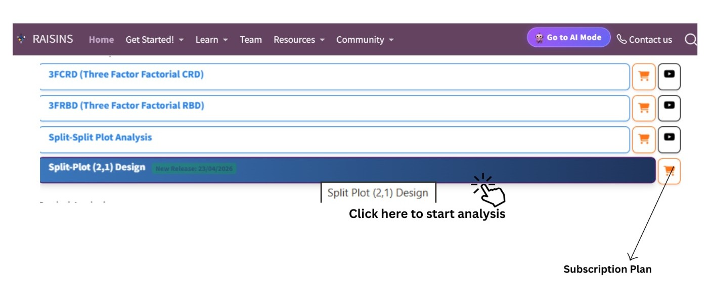{#fig-aov fig-align="center"}

## Split Plot **(2,1)** Design {#C}

::: {style="text-align: justify;"}
The **Split Plot (2,1) Design** is a two-factor experimental layout in which the levels of one factor called the **Main Plot Factor (Factor A)** are assigned to larger experimental units (main plots) following a Randomised Block Design (RBD) arrangement, while the levels of the second factor called the **Sub-plot Factor (Factor B)** are randomly assigned within each main plot. The notation "2,1" refers to the two levels of experimental units in the design: the main plot (level 2) and the subplot (level 1). This hierarchical structure results in two separate error terms one for the main plot comparisons and another, typically smaller, error for the subplot and interaction comparisons, making the design more sensitive to subplot effects and the interaction between the two factors. The **Split Plot Design** is widely used in agricultural and horticultural research when one factor is difficult or impractical to apply at the scale of a subplot such as tillage methods, irrigation regimes, or spacing arrangements while the second factor, such as variety or fertilizer dose, can be applied more flexibly within those larger units. However, the **Split Plot Design** sacrifices precision in estimating main plot factor effects compared to a fully randomised factorial design, so it is recommended only when logistical constraints genuinely necessitate the split plot structure.
:::

<details>

```{=html}
<summary style="color: #5DADE2"; font-weight: bold;">
  SPD Layout
</summary>
```

<ul>

<small>

@fig-lay visually represents a Split Plot Design arrangement with two main plot treatments (Factor A levels) assigned across three blocks, each main plot further subdivided into sub-plots receiving the levels of Factor B. The main plot treatments are randomised independently within each block, and within each main plot, the subplot treatments are again randomised independently. This two-stage randomisation produces the nested error structure that characterises the **Split Plot Design**. In the layout diagram, each large rectangle represents a block, the medium-sized divisions within each block represent main plots, and the smaller cells within each main plot represent the sub-plots to which Factor B levels are applied.

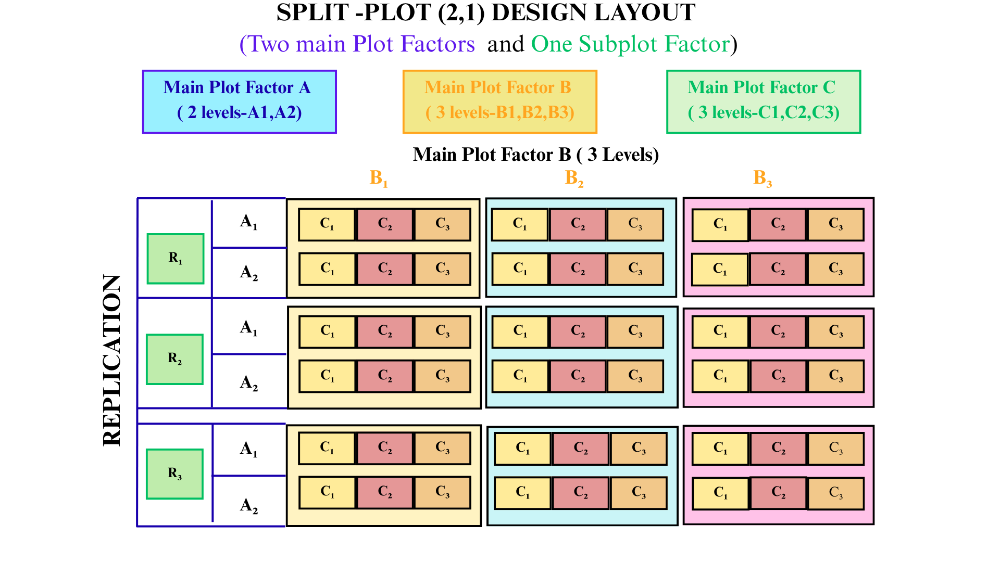{#fig-lay fig-align="center"}

</small>

</ul>

</details>

::: callout-tip
#### Split Plot **(2,1)** Design is a two-factor experimental design in which the main plot factor is randomised at the block level and the subplot factor is randomised within each main plot, yielding two distinct error terms that provide higher precision for subplot and interaction comparisons.
:::

## A working example {#W}

::: {style="text-align: justify;"}
To make things simple and interesting, we'll explain **Split Plot Design** analysis step by step using a hypothetical example, so you can clearly see how it works and why it matters. Consider a field experiment conducted by an agronomist to evaluate the effect of **Irrigation Method** (Factor A Main Plot Factor) and **Rice Variety** (Factor B Sub-plot Factor) on the performance of rice. The experiment is laid out in **3 Blocks** (replications). Factor A consists of **2 irrigation methods**: Surface Irrigation (A1), Drip Irrigation (A2), and . Factor B consists of **3 rice varieties**: B1,B2 and B3. Each combination of irrigation method and variety is thus represented once within each block, giving a total of 3 × 2 × 3 = 18 experimental units. The response variables recorded are **Grain Yield (kg/ha)**, **Plant Height (cm)**, **Number of Tillers**, and **1000 Grain Weight (g)**. Our aim is to test whether irrigation methods, varieties, and their interaction produce statistically significant differences in the response variables using ANOVA. The arrangement of the data is shown in @fig-data.
:::

.png){#fig-data fig-align="center"}

::: {style="text-align: justify;"}
Data organized in MS Excel can be directly uploaded to **RAISINS** for analysis. For more details on data preparation see @sec-4. Three terms that we will use frequently are **Main Plot Factor**, **Sub-plot Factor**, and **Variables**. In our example, the Main Plot Factor refers to the **Irrigation Methods (A1,A2)**, the Sub-plot Factor refers to the **Rice Varieties (V1, V2, V3,)**, and the Variables are the 4 traits mentioned earlier — **Grain Yield, Plant Height, Number of Tillers, and 1000 Grain Weight**.
:::

## How to prepare your data? {#sec-4 .H}

::: {style="text-align: justify;"}
Arranging data for uploading in **RAISINS** is very simple. Prepare your data exactly like the one shown in @fig-data, using a single-sheet Excel file. For a **Split Plot (2,1) Design** , ensure that your data contains separate columns for the Block, the Main Plot Factor (Factor A), and the Sub-plot Factor (Factor B), followed by the response variable columns. Make sure no blank rows are left above, and all columns have proper names. That's it your file is ready to upload.

Still if you have doubt, see @fig-4.

To prepare your dataset for analysis in **RAISINS**, you have two options:

Creating dataset in MS Excel

Creating your dataset directly within the **RAISINS** app
:::

-01.png){#fig-4 fig-align="center"}

## Split Plot Design analysis tab explained {#AO}

::: {style="text-align: justify;"}
In @fig-5, you can see the detailed view of the Analysis tab, along with explanations of what each option does. This section helps you to understand the purpose of every setting, so you can select the most appropriate ones for your data and analysis. Now, upload the prepared file by clicking Browse in the sidebar of the Analysis tab. When the file is uploaded, options to select the Block, Main Plot Factor, Sub-plot Factor, and Variables will appear. Select the appropriate column for each of these fields. Once you click the Run Analysis button, all relevant results and outputs appear instantly, leaving no room for confusion.
:::

<!-- REPLACE THIS SCREENSHOT -->

{#fig-5 fig-align="center"}

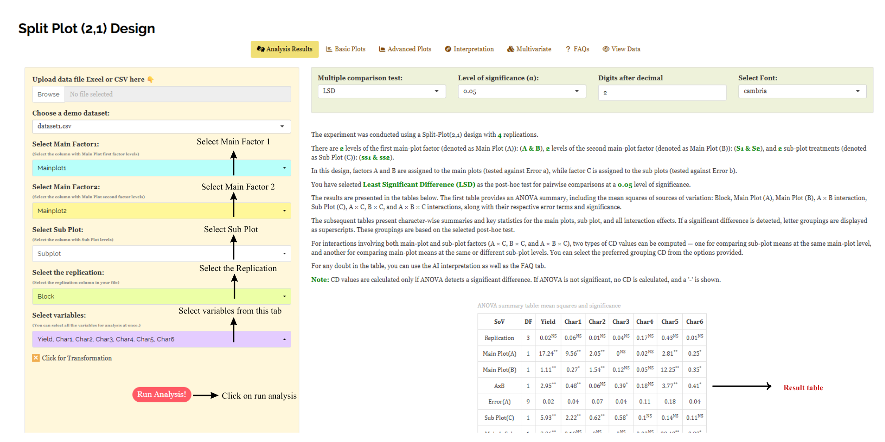{fig-align="center"}

::: {style="text-align: justify;"}
For some data, when there are large number of zeros, discrete values, or when the observed variables are not normally distributed, we need to do transformation on the dataset (@sec-6). Here, **RAISINS** provides an inbuilt transformation option.
:::

## Transformation {#sec-6 .T}

::: {style="text-align: justify;"}
Log, square root, and arcsine transformations are often used in **Split Plot** **(2,1) Design** analysis to make data more normal and reduce uneven variation. Researchers can use these transformations when analyzing experimental data in **RAISINS** as shown in @fig-6.
:::

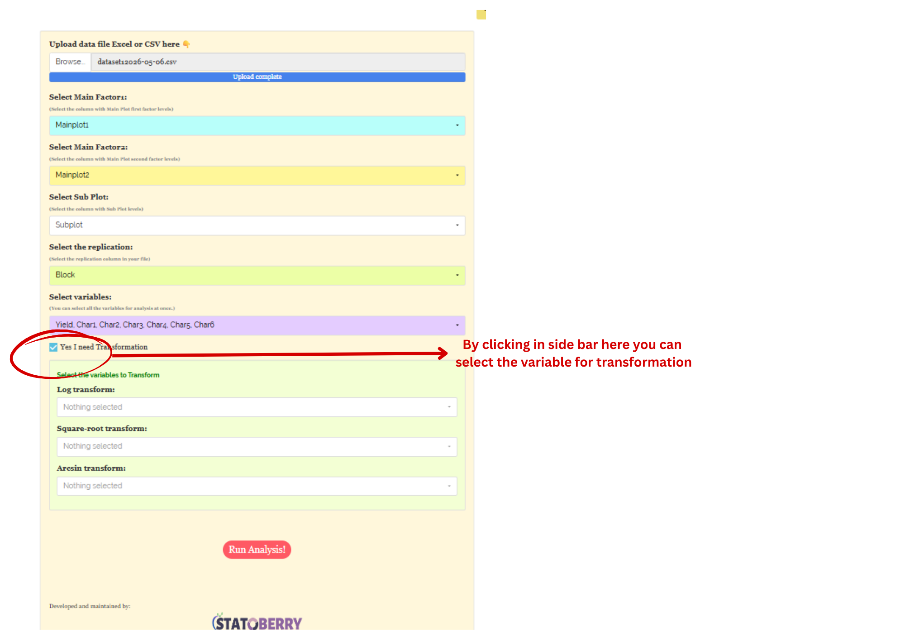{#fig-6 fig-align="center"}

{fig-align="center"}

::: {style="text-align: justify;"}
**Logarithmic transformation** is a mathematical procedure used to convert a skewed distribution into a more symmetrical one by replacing each data point (x) with its logarithm. This technique is specifically applied to positive, continuous data where the variance is proportional to the mean, a relationship common in phenomena that exhibit multiplicative or exponential growth.

**Square root transformation** is a statistical method used to stabilize variance and reduce right-skewness by replacing each data point (x) with its square root. It is primarily applied to non-negative, discrete "count" data such as those following a Poisson distribution, where the variance of the data tends to increase in proportion to the mean. By compressing the upper end of the scale more significantly than the lower end, this transformation brings the data closer to a normal distribution, satisfying the homoscedasticity requirements of many parametric statistical tests.

**Arcsine transformation** (also known as the angular transformation) is a mathematical technique specifically designed for data expressed as proportions or percentages bounded between 0 and 1. By taking the inverse sine of the square root of the proportion, this transformation stretches the ends of the distribution near 0 and 1, where variance is naturally small. It is primarily used to achieve homoscedasticity in binomial data.
:::

> After choosing the appropriate transformation proceed to @sec-7 for analysis.

## Analysis results {#sec-7 .AR}

::: {style="text-align: justify;"}
Once your dataset is uploaded, click on Run Analysis, and the **Split Plot ANOVA** will be performed. Analysis of Variance **(ANOVA)** in the **Split Plot (2,1) Design** partitions the total variation into components attributable to **Blocks**, **Main Plot Factor (Factor A)**, **Main Plot Error (Error A)**, **Sub-plot Factor (Factor B)**, **Interaction (A × B)**, and **Sub-plot Error (Error B)**, and compares them using appropriate F-tests at each stratum (see @fig-100).
:::

**Table 1 ANOVA summary**

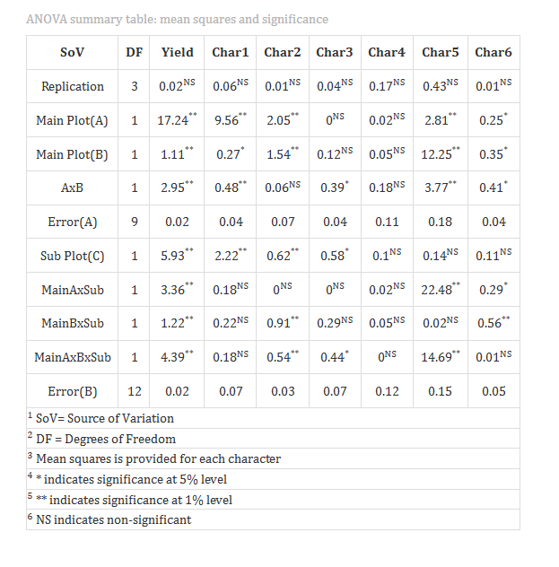{#fig-100 fig-align="center"}

<details>

```{=html}
<summary style="color: #5DADE2"; font-weight: bold;"> ANOVA table </summary>
```

<small> In a **Split Plot (2,1) Design** , the analysis of variance **(ANOVA)** uses a hierarchical error structure with two distinct error terms. The main plot factor (Factor A) is tested against the **Main Plot Error (Error A)**, which is derived from the interaction of Blocks × Factor A. The sub-plot factor (Factor B) and the interaction term (A × B) are each tested against the **Sub-plot Error (Error B)**, which captures the residual variation within main plots. The degrees of freedom are apportioned as follows: Blocks have (r − 1) degrees of freedom, Factor A has (a − 1) degrees of freedom, Error A has (r − 1)(a − 1) degrees of freedom, Factor B has (b − 1) degrees of freedom, A × B interaction has (a − 1)(b − 1) degrees of freedom, and Error B has a(r − 1)(b − 1) degrees of freedom, where r is the number of blocks (replications), a is the number of main plot factor levels, and b is the number of sub-plot factor levels. Significance is indicated by an asterisk (\*) for the **5%** level and two asterisks (\*\*) for the **1%** level of significance, displayed as superscripts for each corresponding F stat in the table. If the computed F value exceeds the critical value, the null hypothesis is rejected, indicating that at least one treatment mean differs significantly from the others within that stratum. </small>

</details>

### Interpretation from @fig-100

::: {style="text-align: justify;"}
The ANOVA results obtained from the Split Plot Design indicated that the treatment factors and their interactions had significant effects on yield and several associated characters. The replication effect was non-significant for all traits, showing uniformity among experimental blocks. Main Plot Factor A significantly influenced Yield, Char1, Char2, Char5, and Char6, while Main Plot Factor B showed significant effects on Yield, Char2, Char5, and Char6. The interaction effect between A × B was also significant for Yield and certain characters, indicating that the combined performance of both factors varied across treatments. The Sub Plot Factor C significantly affected Yield, Char1, Char2, and Char3, demonstrating the importance of subplot treatments in influencing these traits. Further, the interactions between main plot and subplot factors were significant for some characters, especially Yield and Char5, suggesting that treatment combinations responded differently under varying subplot conditions. The three-way interaction among Factors A, B, and C was also significant for Yield and a few other characters, revealing the combined influence of all treatment factors. Overall, the ANOVA analysis confirmed the presence of significant treatment variation and highlighted the importance of both individual and interaction effects on crop performance. refer to @sec-8 for details on multiple comparison tests applicable in **Split Plot Design**.
:::

**Table 2: Detailed tabular representation with multiple comparisons**

{#fig-101 fig-align="center"} {fig-align="center"}

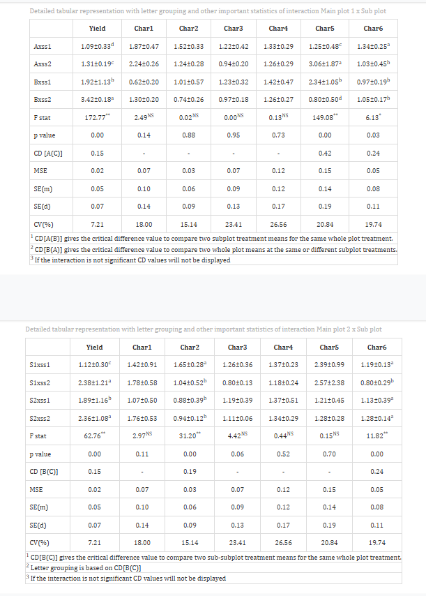{fig-align="center"} 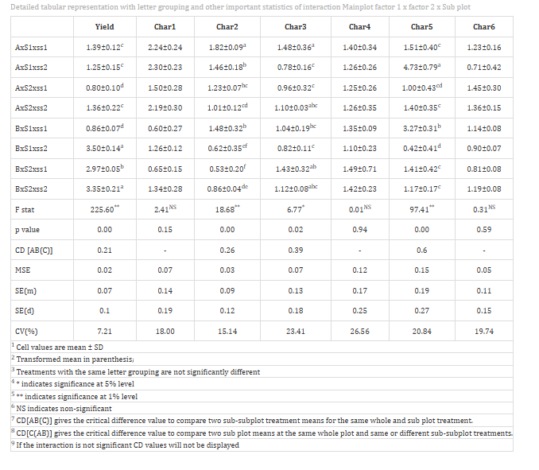{fig-align="center"}

<details>

```{=html}
<summary style="color: #5DADE2"; font-weight: bold;">Overview of ANOVA Results and Interpretation
</summary>
```

<small>

1.  *Treatments and Response Variables*

**Main Plot Factor (Factor A)**: The primary independent variable assigned to larger experimental units — in our example, the Irrigation Methods (I1, I2, I3) — whose effect is tested against the main plot error.

**Sub-plot Factor (Factor B)**: The secondary independent variable assigned within each main plot — in our example, Rice Varieties (V1, V2, V3, V4) — whose effect and interaction with Factor A are tested against the sub-plot error.

**Response Variable**: The dependent variable or specific measurement (e.g., Grain Yield) recorded to evaluate the combined performance of Factor A and Factor B levels.

2.  *Multiple Comparisons*

**Post-hoc Grouping**: A method of using letters (a, b, c) to categorize means. Items sharing the same letter are statistically similar, while those with different letters are significantly different. In **SPD**, separate post-hoc comparisons are performed for main plot means, sub-plot means, and interaction means, each using their respective error term.

3.  *ANOVA Summary*

**F stat**: A numerical value that compares the variance between different groups to the variance within those groups using the appropriate error term; it determines if the overall differences are statistically significant at the relevant stratum.

**p value**: The probability that the observed differences occurred by random chance. A value below 0.05 typically indicates that the results are statistically significant.

4.  *Critical Difference (CD) and Error Estimates*

**Critical Difference (CD)**: The minimum mathematical gap required between two means to declare them "significantly different" at a specific confidence level. In **SPD**, the CD for Factor A comparisons is calculated using Error A, while the CD for Factor B and interaction comparisons is calculated using Error B.

**Standard Error (SE)**: A measure of the accuracy of a sample mean compared to the true population mean; it indicates how much the mean might fluctuate.

**Mean Square Error (MSE)**: The average of the squared differences between observed values and the predicted mean; it represents the "noise" or unexplained error in the experiment — in **SPD**, there are two MSE values (one for main plots and one for sub-plots).

**Coefficient of Variation (CV%)**: A percentage that shows the level of dispersion in the data. A lower CV indicates higher precision and reliability in the experimental measurements. In **SPD**, CV% is typically reported separately for main plots and sub-plots, and it is expected that the sub-plot CV% will be smaller, reflecting higher precision at that stratum.

**Cohen's F**: A standardized measure of effect size that describes the magnitude of the experimental effect, regardless of the sample size. </small>

</details>

### Interpretation from @fig-101

::: {style="text-align: justify;"}
The multiple comparison results from our hypothetical example reveal that, for Grain Yield, among the Irrigation Methods (Factor A), Drip Irrigation (I2) recorded the highest mean grain yield and was assigned letter grouping "a", indicating it is significantly superior to Surface Irrigation (I1, grouping "b") and Sprinkler Irrigation (I3, grouping "b"). I1 and I3 were statistically at par with each other. Among the Varieties (Factor B), V3 recorded the highest grain yield (grouping "a"), followed by V1 (grouping "ab"), V4 (grouping "bc"), and V2 (grouping "c"). For the interaction (A × B), the combination of I2 × V3 produced the maximum grain yield, reflecting the synergistic effect of drip irrigation and variety V3. Treatments sharing the same letter are statistically similar, while those with different letters differ significantly at the 5% level of significance using the LSD test. Cohen's f values for Factor A and Factor B both exceeded 0.40, indicating a large and practically meaningful effect of both irrigation method and variety on grain yield.
:::

::: callout-tip
#### When a researcher uses Tukey's HSD or DMRT in an SPD, separate critical values are computed for main plot comparisons (using Error A) and sub-plot comparisons (using Error B), so each pairwise comparison must use the correct error term.
:::

::: callout-tip
#### Cohen's f is a measure of effect size. It tells you how strong or meaningful the treatment effect is, independent of sample size.
:::

## Multiple comparison tests {#sec-8 .MCT}

<details>

```{=html}
<summary style="color: #5DADE2"; font-weight: bold;">
  What is Post-hoc test?
</summary>
```

<ul><small> Post-hoc test is a follow-up analysis, performed after finding a significant result in an overall statistical test (like ANOVA). Its purpose is to identify exactly which groups or treatments differ from each other. In other words, it helps to pinpoint where the differences lie between multiple groups, when the initial test shows that not all groups are the same. In a **Split Plot (2,1)Design** , post-hoc tests must be applied separately for Factor A comparisons, Factor B comparisons, and the A × B interaction comparisons, each using the appropriate error term (Error A or Error B). </small></ul>

</details>

<details>

```{=html}
<summary style="color: #5DADE2"; font-weight: bold;">
  Post hoc tests available in RAISINS
</summary>
```

<small>

<!-- REPLACE THIS SCREENSHOT -->

{#fig-posthoc fig-align="center"}

**Least Significant Difference (LSD)**

The LSD test is the most commonly used post-hoc method in agricultural experiments. In the **SPD**, two LSD values are computed — one for comparing main plot (Factor A) means using Error A, and another for comparing sub-plot (Factor B) means and interaction means using Error B. The LSD formulas are:

For Factor A comparisons (using Error A):

$$LSD_A = t_{\alpha, df_{Error A}} \times \sqrt{\frac{2 \times MS_{Error A}}{r \times b}}$$

For Factor B comparisons and A × B interaction (using Error B):

$$LSD_B = t_{\alpha, df_{Error B}} \times \sqrt{\frac{2 \times MS_{Error B}}{r \times a}}$$

Where r = number of blocks, a = number of main plot factor levels, b = number of sub-plot factor levels, and the t value corresponds to the respective error degrees of freedom.

**Tukey's Honestly Significant Difference (HSD)**

Tukey's test compares all possible pairs of treatment means while controlling the overall Type I error rate, avoiding false positives when making multiple comparisons. In **SPD**, Tukey's HSD is computed separately for Factor A comparisons (using Error A MSE and its degrees of freedom) and for Factor B and interaction comparisons (using Error B MSE and its degrees of freedom), maintaining the correct error structure of the design.

**Duncan's Multiple Range Test (DMRT)**

After confirming significant overall differences via ANOVA, DMRT ranks the treatment means and calculates critical differences using the studentized range statistic (Q) and the standard error based on the relevant error variance from ANOVA. In **SPD**, DMRT is applied separately for main plot means (using Error A) and for sub-plot and interaction means (using Error B). This systematic and sequential approach provides clear groupings of treatments and has gained popularity in agricultural research. </small>

</details>

**Which Post-hoc test to use?**

::: {style="text-align: justify;"}
The choice of the post-hoc test completely relies on the researcher.

**LSD** is the most commonly used post-hoc method in agricultural **SPD** experiments. It is most suitable when the number of treatments is small and planned comparisons are limited, offering high sensitivity to detect differences. However, applying LSD for a large number of pairwise comparisons — especially for the A × B interaction — may increase the Type I error rate.

**Tukey's HSD** is preferred when there are four or more levels of either factor in a balanced **SPD**. It compares all possible treatment pairs while strictly controlling the family-wise error rate, making it a conservative and reliable method for multiple comparisons across all factorial combinations.

**DMRT** is commonly used in agricultural experiments with several treatments. It ranks treatment means step-wise and detects more significant differences than Tukey HSD, though it is less conservative and carries a higher risk of Type I error compared to Tukey's method.

In the example for those characters, a pairwise comparison was performed to identify significant differences between treatments using the Least Significant Difference (LSD) test.
:::

## Basic plots {#BP}

::: {style="text-align: justify;"}
**RAISINS** is designed for a smooth and hassle-free experience. Once you click the Run Analysis button, all relevant results and outputs appear instantly — leaving no room for confusion. We've ensured that every possible plot related to the **Split Plot (2,1) Design** is readily available. Simply click on the Basic Plots tab to view them (See @fig-8). Each plot comes with a gear icon at the top-left corner, allowing you to customize its appearance. You can also download these plots in high-quality PNG format (300 dpi), JPEG, TIFF, PDF and SVG for use in reports or presentations.
:::

### Customizing plots

::: {style="text-align: justify;"}
**RAISINS** provides users various customization features for the plots to enhance the visualization according to the requirement of the user. **Click** on @fig-8 to get a clear idea on the customizing features.
:::

{#fig-8 fig-align="center"}

::: {style="text-align: justify;"}
From @fig-9 to @fig-13, you can see the different types of plots available in RAISINS. Each one is visually illustrated and accompanied by a clear, insightful description below, making it easy to understand.
:::

```{=html}
<script>
document.addEventListener('DOMContentLoaded', function() {
  const descriptions = document.querySelectorAll('.plot-description');
  descriptions.forEach(desc => {
    desc.style.display = 'none';
  });
});

function showDescription(id) {
  document.getElementById(id).style.display = 'flex';
}

function hideDescription(id) {
  document.getElementById(id).style.display = 'none';
}
</script>
```

```{=html}
<style>
.plot-container {
  position: relative;
  display: inline-block;
  cursor: pointer;
  width: 350px;
  height: 300px;
  overflow: hidden;
  margin: 10px;
}
.plot-container img {
  width: 350px;
  height: 300px;
  object-fit: cover;
  border: 3px solid #ddd;
  border-radius: 8px;
  transition: transform 0.3s ease, box-shadow 0.3s ease;
}
.plot-container:hover img {
  transform: scale(1.05);
  box-shadow: 0 4px 12px rgba(0, 0, 0, 0.2);
}
.plot-description {
  display: none !important;
  position: absolute;
  top: 0; left: 0;
  width: 100%; height: 100%;
  z-index: 1000;
  color: white;
  padding: 15px;
  border-radius: 8px;
  box-shadow: 0 4px 15px rgba(0, 0, 0, 0.3);
  font-size: 14px;
  line-height: 1.5;
  display: flex;
  align-items: center;
  justify-content: center;
  text-align: center;
  animation: fadeIn 0.3s ease-in;
  pointer-events: none;
  border: 2px solid rgba(255, 255, 255, 0.5);
}
.plot-container:hover .plot-description {
  display: flex !important;
}
@keyframes fadeIn {
  from { opacity: 0; transform: scale(0.95); }
  to { opacity: 1; transform: scale(1); }
}
#boxplot-desc { background: linear-gradient(135deg, rgba(255, 107, 107, 0.8), rgba(255, 142, 83, 0.8)); }
#barplot-desc { background: linear-gradient(135deg, rgba(161, 140, 209, 0.8), rgba(251, 194, 235, 0.8)); }
#connectedplot-desc { background: linear-gradient(135deg, rgba(0, 221, 235, 0.8), rgba(38, 166, 154, 0.8)); }
#meanvalueplot-desc { background: linear-gradient(135deg, rgba(255, 154, 139, 0.8), rgba(255, 106, 136, 0.8)); }
#violinplot-desc { background: linear-gradient(135deg, rgba(132, 250, 176, 0.8), rgba(143, 211, 244, 0.8)); }
</style>
```

::::::::::::::::::::::::: grid
:::::: g-col-6
::::: {.plot-container onmouseover="showDescription('boxplot-desc')" onmouseout="hideDescription('boxplot-desc')"}
<!-- REPLACE THIS SCREENSHOT -->

{#fig-9}

:::: {#boxplot-desc .plot-description}
::: {style="text-align: justify;"}
A **box plot** in a split (2,1) design is a graphical method used to summarize and compare the distribution of data across treatment combinations where one factor has two levels (main plot factor) and the other represents a single subplot level or repeated observations within each main plot. Each box corresponds to a treatment level of the main factor (e.g., A₁ and A₂), showing key statistical measures such as the median, quartiles, and overall range of the observations. The box represents the interquartile range, the line inside indicates the median, and the whiskers show the spread of the data, while any outliers are plotted separately. This type of plot helps in understanding variability within each main plot level, identifying extreme values, and comparing the performance and consistency of the two treatments in a clear and simple manner.
:::
::::
:::::
::::::

:::::: g-col-6
::::: {.plot-container onmouseover="showDescription('violinplot-desc')" onmouseout="hideDescription('violinplot-desc')"}
<!-- REPLACE THIS SCREENSHOT -->

{#fig-10}

:::: {#violinplot-desc .plot-description}
::: {style="text-align: justify;"}
A **violin plot** in a split (2,1) design is used to display the distribution and variation of data for different treatment combinations in a detailed way. In this design, one factor has two levels (main plots) and another factor is applied within them (subplots). Each violin represents a treatment combination, where the shape shows the density of the data—wider sections indicate more observations, and narrower sections indicate fewer. It often includes a central line or small box showing the median and interquartile range. This plot not only helps in comparing central values but also reveals the spread, symmetry, and patterns of the data, making it easier to identify differences, variability, and possible outliers among treatments.
:::
::::
:::::
::::::

:::::: g-col-6
::::: {.plot-container onmouseover="showDescription('barplot-desc')" onmouseout="hideDescription('barplot-desc')"}
<!-- REPLACE THIS SCREENSHOT -->

{#fig-11}

:::: {#barplot-desc .plot-description}
::: {style="text-align: justify;"}
A **bar plot** in a split (2,1) design is a graphical representation used to compare the values or mean performance of different treatment combinations. In this design, one factor has two levels (main plots) and another factor is applied within them (subplots). Each bar represents the mean value of a specific treatment combination, and the height of the bar indicates the magnitude of the response. Different colors or patterns may be used to distinguish between factor levels. Error bars can also be added to show variability or standard error. This type of plot helps in easily comparing treatments, identifying differences among factor levels, and understanding the overall performance of the treatments in a clear and visual manner.
:::
::::
:::::
::::::

:::::: g-col-6
::::: {.plot-container onmouseover="showDescription('meanvalueplot-desc')" onmouseout="hideDescription('meanvalueplot-desc')"}
{#fig-12}

:::: {#meanvalueplot-desc .plot-description}
::: {style="text-align: justify;"}
A **mean value plot** in a split (2,1) design is used to represent the average values of different treatment combinations in a clear and organized manner. In this design, one factor has two levels (main plots) and another factor is applied within each main plot (subplots). Each point on the graph indicates the mean of a particular treatment combination, and these points are often connected by lines to show trends or interactions between factors. Error bars may be included to represent variability, such as standard error or confidence intervals. This plot helps in easily comparing treatment effects, identifying differences between factor levels, and understanding overall patterns in the data.
:::
::::
:::::
::::::

:::::: g-col-6
::::: {.plot-container onmouseover="showDescription('meanvalueplot-desc')" onmouseout="hideDescription('meanvalueplot-desc')"}


:::: plot-description
::: {style="text-align: justify;"}
A **connected line plot** in a split (2,1) design is used to display and compare treatment effects by linking mean values across different factor levels. In this design, one factor has two levels (main plots) and another factor is applied within them (subplots). Each point on the graph represents the mean value of a treatment combination, and points belonging to the same factor level are connected with lines. These lines help to visualize trends and interactions between factors. Differences in the slope or pattern of the lines indicate variation in treatment responses, making it easier to understand relationships, compare effects, and identify any interaction between the factors.
:::
::::
:::::
::::::

:::: g-col-6
::: {.plot-container onmouseover="showDescription('connectedplot-desc')" onmouseout="hideDescription('connectedplot-desc')"}
{#fig-13}

:::: {#connected line plot-desc .plot-description} ::: {style="text-align: justify;"} A **connected line plot** in a split (2,1) design is used to display and compare treatment effects by linking mean values across different factor levels. In this design, one factor has two levels (main plots) and another factor is applied within them (subplots). Each point on the graph represents the mean value of a treatment combination, and points belonging to the same factor level are connected with lines. These lines help to visualize trends and interactions between factors. Differences in the slope or pattern of the lines indicate variation in treatment responses, making it easier to understand relationships, compare effects, and identify any interaction between the factors.
:::
::::
:::::::::::::::::::::::::

::::::

## Advanced plots {#AP}

::: {style="text-align: justify;"}
**RAISINS** also provides advanced plot which goes beyond basic bar charts and histograms to give deeper insight into your data, especially distributions, relationships, and deviations from expectations. (See @fig-90)
:::

<!-- REPLACE THIS SCREENSHOT -->

.png){#fig-90 fig-align="center"}

**SUMMARY PLOT**

{#fig-14 fig-align="center"}

{fig-align="center"}

::: {style="text-align: justify;"}
A **summary plot** in a split (2,1) design is a graphical method used to summarize and compare the overall performance of different treatment combinations in a single figure. In this design, one factor has two levels as main plots and another factor is applied within them as subplots. The plot combines important statistical features such as mean values, variability, confidence intervals, and interaction effects to provide a detailed understanding of the data. Different colors, symbols, or line patterns are used to clearly separate the factor levels and treatment combinations. This type of plot helps in identifying trends, comparing treatment responses, understanding variability, and detecting interactions between factors in a clear and informative manner.
:::

**ADVANCED RAINCLOUD PLOT**

{#fig-15 fig-align="center"}

{fig-align="center"}

::: {style="text-align: justify;"}
An advanced **rain cloud plot** in a split (2,1) design is a detailed graphical method used to visualize the distribution, variability, and summary statistics of different treatment combinations in a single plot. It combines features of a violin plot, box plot, and scatter plot to provide a complete view of the data. In this design, one factor has two levels as main plots and another factor is applied within them as subplots. The “cloud” part shows the density distribution of the data, the box plot displays median and quartiles, and the scattered points represent individual observations. This plot helps in comparing treatment effects, understanding variability, identifying outliers, and observing data patterns more clearly and effectively.
:::

**QQ PLOT**

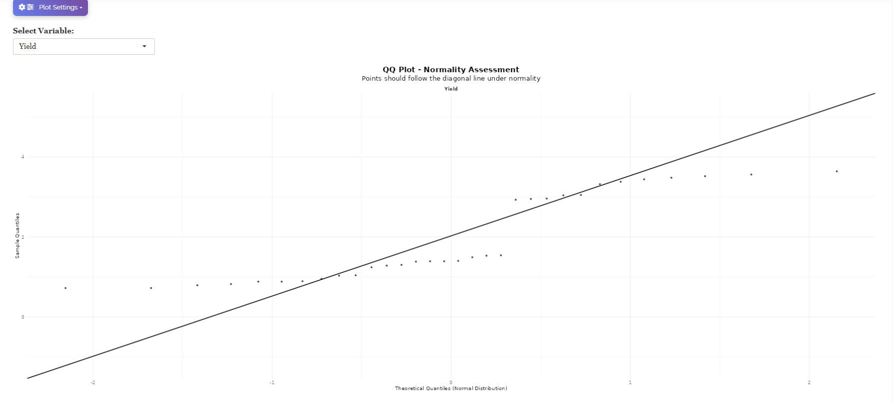{#fig-16 fig-align="center"}

::: {style="text-align: justify;"}
A **Q-Q (Quantile–Quantile) plot** in a split (2,1) design is a graphical method used to check whether the data follows a normal distribution for different treatment combinations. In this design, one factor has two levels as main plots and another factor is applied within them as subplots. The plot compares the observed data quantiles with the expected quantiles of a normal distribution. If the points lie close to a straight line, the data is considered approximately normal, while deviations from the line indicate non-normality or outliers. This plot is useful for assessing the distributional assumptions of the data before performing statistical analysis.
:::

**RAIN CLOUD PLOT**

<!-- REPLACE THIS SCREENSHOT -->

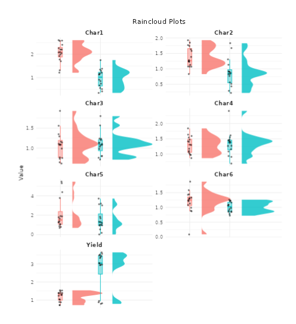{#fig-17 fig-align="center"}

::: {style="text-align: justify;"}
A rain cloud plot in a split (2,1) design is a graphical method used to display the distribution, spread, and individual observations of data for different treatment combinations. In this design, one factor has two levels as main plots and another factor is applied within them as subplots. The plot combines features of a density plot, box plot, and scatter plot in a single figure. The “cloud” portion shows the data distribution, the box plot summarizes measures such as median and quartiles, and the scattered points represent individual observations. This type of plot helps in understanding variability, comparing treatment effects, identifying outliers, and visualizing data patterns in a clear and informative way.
:::

**DISTRIBUTION PLOT**

<!-- REPLACE THIS SCREENSHOT -->

{#fig-18 fig-align="center"}

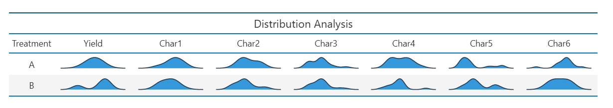{fig-align="center"}

::: {style="text-align: justify;"}
A distribution plot in a split (2,1) design is used to visualize the overall pattern and spread of data for different treatment combinations. In this design, one factor has two levels as main plots and another factor is applied within them as subplots. The plot shows how the observations are distributed across different values, helping to identify the concentration, symmetry, and variability of the data. It may also reveal skewness, peaks, gaps, or outliers in the distribution. This type of plot is useful for comparing treatment responses and understanding the underlying data pattern in a clear and informative way.
:::

**PAIR PLOT**

<!-- REPLACE THIS SCREENSHOT -->

{fig-align="center"}

::: {style="text-align: justify;"}
A pair plot in a split (2,1) design is a graphical method used to display the relationships between multiple variables and treatment combinations in a single figure. In this design, one factor has two levels as main plots and another factor is applied within them as subplots. The plot consists of scatter plots arranged in a matrix form, where each variable is compared with every other variable. Diagonal panels often show the distribution of individual variables using histograms or density plots. This type of plot helps in identifying correlations, trends, variability, and patterns among variables, making it useful for understanding the overall relationship between treatments and observations.
:::

**CIRCULAR PLOT**

{fig-align="center"}

::: {style="text-align: justify;"}
A circular plot in a split (2,1) design is a graphical representation used to display relationships, patterns, and comparisons among different treatment combinations in a circular layout. In this design, one factor has two levels as main plots and another factor is applied within them as subplots. The plot arranges the treatments or variables around a circle, and connections, segments, or colored regions are used to show interactions, similarities, or differences between them. This type of plot helps in visualizing complex relationships, comparing treatment effects, and understanding overall data patterns in an attractive and organized manner.
:::

**CORRELATION PLOT**

<!-- REPLACE THIS SCREENSHOT -->

{fig-align="center"}

::: {style="text-align: justify;"}
A correlation plot in a split (2,1) design is used to show the strength and direction of relationships between different variables or treatment combinations. In this design, one factor has two levels as main plots and another factor is applied within them as subplots. The plot usually displays correlation coefficients using colors, circles, or numerical values, where positive correlations indicate variables increasing together and negative correlations indicate opposite trends. Strong correlations are shown with darker colors or larger symbols, while weak correlations appear lighter or smaller. This type of plot helps in understanding associations, identifying patterns, and analyzing relationships among variables in a clear and visual manner.
:::

**3D SCATTER PLOT**

<!-- REPLACE THIS SCREENSHOT -->

.gif){fig-align="center"}

::: {style="text-align: justify;"}
A 3D scatter plot in a split (2,1) design is a graphical method used to visualize the relationship among three variables or treatment factors in a three-dimensional space. In this design, one factor has two levels as main plots and another factor is applied within them as subplots. Each point in the plot represents an observation, positioned according to its values on the three axes. Different colors or symbols may be used to distinguish treatment combinations or factor levels. This plot helps in identifying trends, clusters, interactions, and variability among treatments, providing a more detailed understanding of complex relationships in the data.
:::

**3D SCATTER PLOT WITH LINES PLOT**

<!-- REPLACE THIS SCREENSHOT -->

{fig-align="center"}

::: {style="text-align: justify;"}
A 3D scatter line plot in a split (2,1) design is a graphical method used to display the relationship among three variables while also showing trends through connected lines. In this design, one factor has two levels as main plots and another factor is applied within them as subplots. Each point in the three-dimensional space represents an observation based on values along the x, y, and z axes, and related points are connected with lines to highlight patterns or progression among treatment combinations. Different colors or symbols may be used to distinguish factor levels. This type of plot helps in understanding trends, interactions, and variability among treatments in a more detailed and visual manner.
:::

## AI interpretation {#AI}

::: {style="text-align: justify;"}
RAISINS is equipped with an AI-powered RAISINS Assistant designed to assist users in comprehending the outcomes of statistical tests and data analysis. This functionality provides clear and concise summaries of results, identifies statistically significant differences between groups, and offers informed suggestions for potential next steps or interpretations. The user can get detailed interpretations of the analysis by clicking on AI Interpretaton on the Analysis as shown below @fig-ai.
:::

{#fig-ai fig-align="center"}

## Multivariate {#MUL}

::: {style="text-align: justify;"}
Multivariate analysis in **Split Plot (2,1)Design** helps you to compare different response variables simultaneously across all treatment combinations of Factor A and Factor B. Remember the PCA used for multivariate selection, is an exploratory technique, not an inferential method. Now, in our example, of evaluation of three irrigation methods — Surface Irrigation (I1), Drip Irrigation (I2), and Sprinkler Irrigation (I3) — across four rice varieties (V1, V2, V3, V4), as studied by an agronomist, navigate to Multivariate see @fig-mu.
:::

<!-- REPLACE THIS SCREENSHOT -->

{#fig-mu}

-01.png)

::: {style="text-align: justify;"}
MANOVA and PCA will be automatically carried out based on the selected variables. MANOVA table with interpretation appears automatically. PCA results and plots will appear along with automated interpretation.
:::

<!-- REPLACE THIS SCREENSHOT -->

::: {style="text-align: justify;"}
The table titled 'Eigen Values PCA' given @fig-PC provides information about the eigen values and the percentage of variance explained by each principal component. The principal components PC1, PC2 have eigenvalues greater than one and are considered important for further analysis. PC1 accounts for approximately 54% of the variance in the dataset, while PC2 accounts for about 28% of the variance. Together, PC1 and PC2 explain approximately 82% of the total variance (termed as cumulative variance). Since PC1 explains more than 40% of the variance, a PC1-based index score is a strong consideration. Additionally, since both PCs explain more than 60% of the variance in the data, an index score based on both PCs is also appropriate. The scree plot below illustrates the proportion of variance explained by each principal component.
:::

<!-- REPLACE THIS SCREENSHOT -->

{#fig-PC}


::: {style="text-align: justify;"}
The scree plot given @fig-screeplot illustrates the proportion of variance explained by each principal component.
:::

<!-- REPLACE THIS SCREENSHOT -->

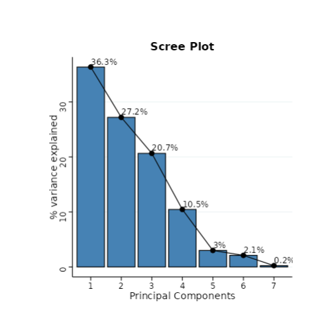{#fig-screeplot fig-align="center"}

::: {style="text-align: justify;"}
Look upon the loadings of each variable in the given @fig-loadings and decide which PC-based index needs to be selected. In our example, PC1 shows strong positive loadings for Grain Yield and 1000 Grain Weight, indicating that treatment combinations with high PC1 scores tend to produce heavier grains and higher overall yield. PC2 shows positive loadings for Plant Height and Number of Tillers, suggesting that PC2 captures vegetative growth patterns independent of grain-related traits. Based on these loadings, a PC1-based index score would be most appropriate for identifying superior treatment combinations for yield improvement. It is recommended to use variables that are highly correlated for PCA, as this helps in constructing a more reliable and meaningful index.
:::

<!-- REPLACE THIS SCREENSHOT -->

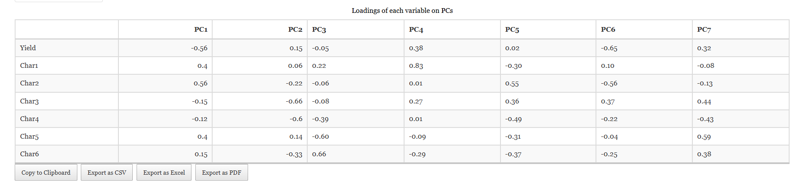{#fig-loadings fig-align="center"}

::: {style="text-align: justify;"}
The biplot gives a visual representation of the relationships among variables and treatment combinations. Treatment combinations with high values for a specific variable are positioned in the direction of that variable. The angle between variables in the biplot indicates their correlation — smaller angles suggest high positive correlation, while larger angles close to 90 degrees suggest weak or no correlation. In our example, the I2 × V3 combination is positioned in the direction of Grain Yield and 1000 Grain Weight vectors, confirming its superior performance for yield-related traits.
:::

<!-- REPLACE THIS SCREENSHOT -->

{#fig-biplot}

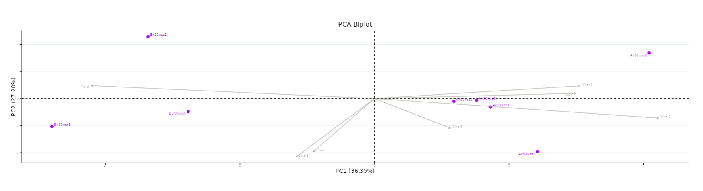

::: {style="text-align: justify;"}
In RAISINS, we calculate a scaled index score by converting the index score to a range of 0 to 1, making it easier to interpret and compare. This standardized approach ensures consistency in evaluating treatment combinations based on their index scores. To refine your selection, use the 'Select cutoff for Scaled Index Score' feature given as in @fig-indexscore, where you can choose the cutoff percentage to select treatment combinations above or below a certain threshold. The default cutoff is set at 75%. By toggling the up-arrow and down-arrow buttons below the cutoff selection, you can select the top or bottom percentage of treatment combinations as per your preference. Selected treatment combinations are highlighted in yellow in the table below, providing a clear visual cue. Additionally, a plot based on the index scores is also displayed to aid in your analysis.
:::

<!-- REPLACE THIS SCREENSHOT -->

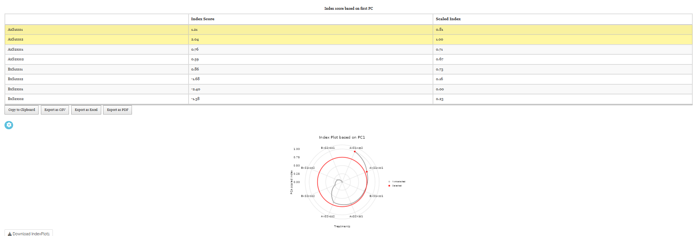{#fig-indexscore fig-align="center"}

<!-- REPLACE THIS SCREENSHOT -->

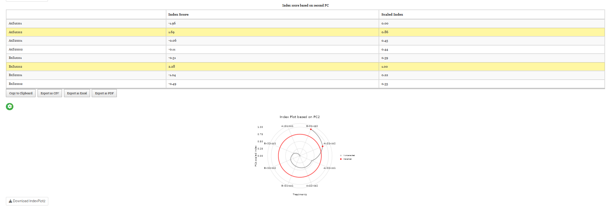{#fig-index fig-align="center"}

::: {style="text-align: justify;"}
Combining all this information, the experimenter can arrive at an overall conclusion that is statistically sound and contextually relevant to their study. In our hypothetical example, the multivariate analysis confirms that the I2 × V3 combination (Drip Irrigation with Variety V3) is the top-ranked treatment combination across all four response variables, and should be the primary recommendation from this experiment.
:::

## Preparing your data {#PRE}

::: {style="text-align: justify;"}
"Your analysis is only as good as your data! Feed RAISINS high-quality data, and it will deliver powerful insights — feed it messy data, and the results won't be trustworthy."

1.  Create your dataset in MS Excel

2.  Build your dataset directly within the RAISINS app
:::

## Preparing data in MS Excel {#EX}

::: {style="text-align: justify;"}
Open a new blank sheet in MS Excel with only one sheet included, and avoid adding any unnecessary content. For a **Split Plot (2,1) Design** , the dataset must follow a column-based format with a minimum of four structural columns: one for the Block, one for the Main Plot Factor (Factor A), one for the Sub-plot Factor (Factor B), followed by the response variable columns. Name each column clearly — for example, "Block", "Irrigation", "Variety", "Grain_Yield", "Plant_Height", "Tillers", "Grain_Weight_1000". Each unique combination of Block × Factor A × Factor B should appear on a separate row. The file can be saved in CSV, XLS, or XLSX format, but CSV is recommended as it is lighter and enables faster loading. Ensure that there are no unwanted spaces in column names or group names. For reference, see the structure shown in @fig-pp. As illustrated in @fig-data, the data can also be arranged as shown in @fig-kk.
:::

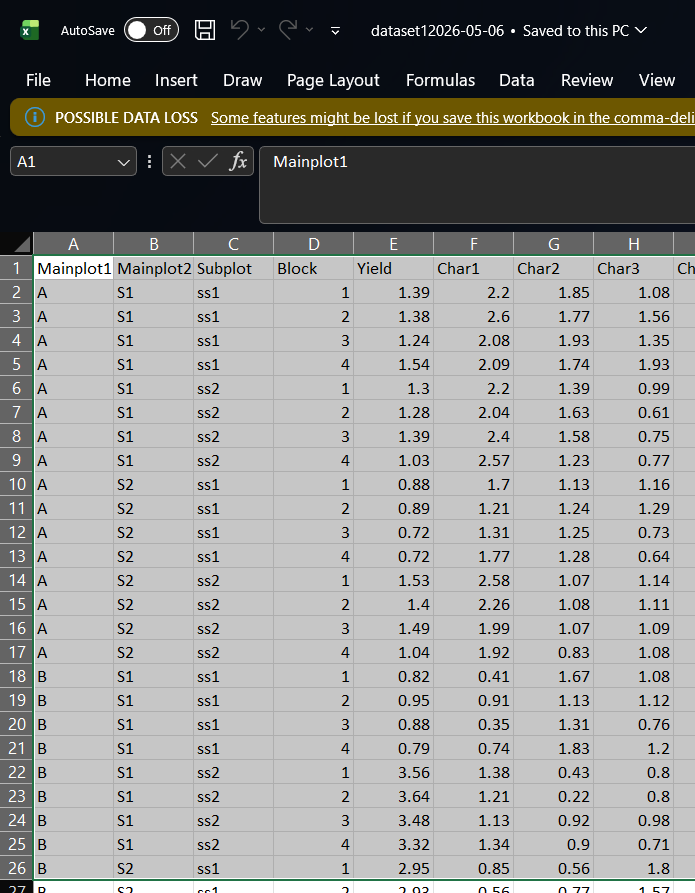{#fig-pp}

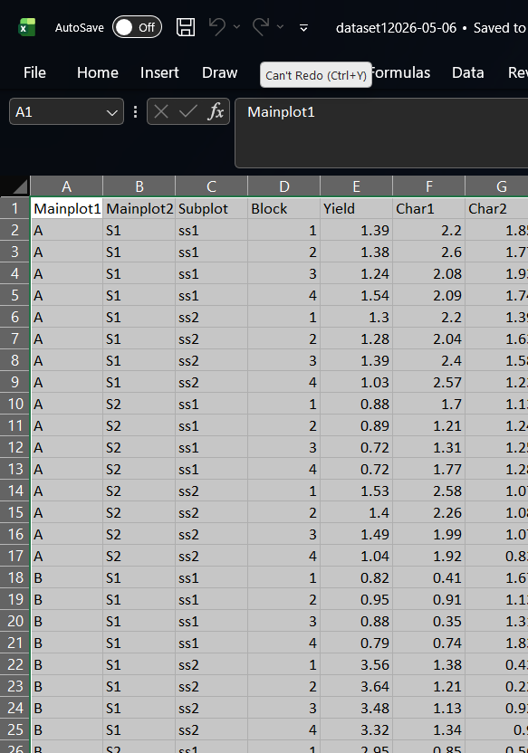{#fig-kk}

<details>

<summary>Dataset Creation Rules</summary>

<small> 1. **Column Naming Convention** - No spaces allowed in column names.\
- Use underscores (`_`) or full stops (`.`) for separation. - Avoid symbols and special characters like %,# etc 2. **Data Arrangement** - Start data arrangement towards the upper-left corner.\
- Ensure the row above the data is not blank. - For **SPD**, include separate columns for Block, Main Plot Factor, and Sub-plot Factor before the response variable columns. 3. **Cell Management** - Avoid typing or deleting in cells without data.\
- If needed, select affected cells, right-click, and select **Clear Contents**. 4. **Column Relevance** - Name all columns meaningfully.\
- Exclude unnecessary columns not required for analysis. </small>

</details>

<details>

<summary>How to Save as CSV in MS Excel</summary>

<small> 1. **Open Your Workbook**

```         
-   Ensure your data is arranged properly with only one sheet.
```

2.  **Click 'File' Menu**

    - Go to the top-left corner and click on **File**.

3.  **Choose 'Save As' or 'Save a Copy'**

    - Select the location where you want to save your file.

4.  **Set File Type to CSV**

    - In the **'Save as type'** dropdown menu, choose **CSV (Comma delimited) (\*.csv)**.

5.  **Name Your File**

    - Enter a relevant file name without spaces (use underscores if needed).

6.  **Click 'Save'**

    - Click **Save** to export the file.

> 💡 Tip: Before saving, double-check that your data is on the first sheet and follows the required format (e.g., no empty rows above the data, meaningful column names, separate columns for Block, Main Plot Factor, and Sub-plot Factor). </small>

</details>

## Creating dataset in RAISINS {#CR}

::: {style="text-align: justify;"}
If you're unsure about the correct format for creating a dataset, don't worry — RAISINS offers an option to create data directly within the app using the prescribed template. Here's how:

- Navigate to the **Create Data Tab**

- Select the number of **Main Plot Treatments**

- Select the number of **Sub-plot Treatments**

- Select number of **Replications (Blocks)**

- Select number of **Characters**

- Click on **Create** button

Model layout will appear as shown in @fig-createdata. Now you may enter the observations manually into the CSV file once downloaded, or paste the observations straight into the file provided. Once you have entered the observations in the layout, download the csv file and upload in `Analysis`.
:::

{#fig-createdata width="1011"}

## Model datasets {#M}

::: {style="text-align: justify;"}
To test the app or better understand the data arrangement, we provide model datasets within the app. You can download them from the `Datasets`.
:::

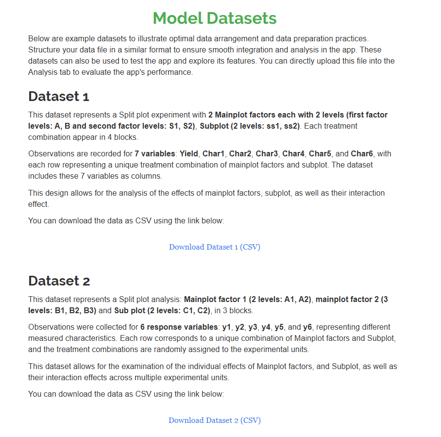{#fig-188 fig-align="center"}

## FAQ's {#F}

::: {style="text-align: justify;"}
The app includes a dedicated `FAQs` to help clarify common doubts and guide users through various features. This section provides detailed answers to frequently asked questions, offering additional information and helpful tips to ensure a smooth user experience. If you're ever unsure about how something works, the `FAQs` is a great place to start.
:::

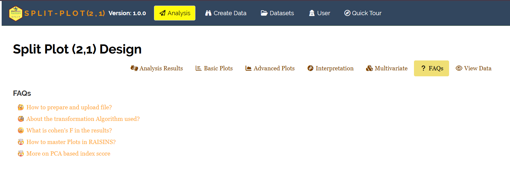{#fig-148 fig-align="center"}

## View data {#U}

::: {style="text-align: justify;"}
`View Data` serves as the primary diagnostic tool for ensuring data integrity before analysis. Upon uploading your dataset, the system performs an automated Health Check to validate column types and formatting. This is especially important in a **Split Plot (2,1) Design** where the correct identification of the Block, Main Plot Factor, and Sub-plot Factor columns is critical for the ANOVA to be partitioned correctly.
:::

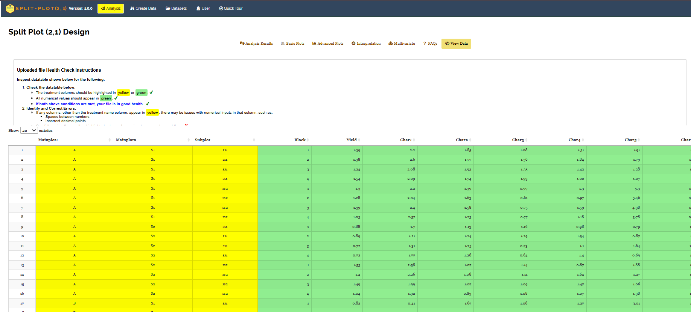{fig-align="center"}

------------------------------------------------------------------------
