```{=html}
<style>
 sup {
   color: blue;
   font-size: 0.8em;
 }
 .affiliations {
   color: grey;
   font-size: 0.9em;
   margin-top: 0.2em;
 }
</style>
```

::: affiliations
<sup>1</sup>Statoberry LLP, <sup>2</sup>Department of Agricultural Statistics, Kerala Agricultural University
:::

ABSTRACT

::: {style="text-align: justify;"}
Split Split Plot Design **(SSPD)** is an advanced multi-factor experimental design used to study the effects of three factors simultaneously when the factors differ in their practical precision of application. SSPD extends the Split Plot Design by introducing a third factor assigned to sub-sub-plots within each sub-plot, enabling researchers to study complex interactions among main plot, sub-plot, and sub-sub-plot factors with optimal allocation of experimental resources. In **RAISINS** you can perform SSPD analysis very easily without writing a single line of code. This tutorial will guide you on how to perform SSPD analysis very easily in **RAISINS** and interpret the results effectively. In addition, you will get tables and plots ready for publication. You can also perform a multivariate analysis including MANOVA and PCA.
:::

<details>

*Hover or click each point to see more information.*

```{=html}
<summary style="color: #5DADE2"; font-weight: bold;">
  Introduction Split Split Plot Design
</summary>
```

```{=html}
<style>
.hover-img {
  position: relative;
  display: inline-block;
  cursor: help;
  border-bottom: 1px dashed currentColor;
}
.hover-img img {
  position: absolute;
  left: 50%;
  top: 1.6em;
  transform: translateX(-50%);
  width: 260px;
  max-width: 70vw;
  height: auto;
  padding: 6px;
  background: white;
  border: 1px solid rgba(0,0,0,.15);
  border-radius: 12px;
  box-shadow: 0 10px 30px rgba(0,0,0,.18);
  opacity: 0;
  visibility: hidden;
  pointer-events: none;
  transition: opacity .15s ease, transform .15s ease, visibility .15s;
}
.hover-img:hover img {
  opacity: 1;
  visibility: visible;
  transform: translateX(-50%) translateY(6px);
  z-index: 999;
}
</style>
```

<ul><small> The **Split Split Plot Design** has its intellectual roots in the foundational work of [Ronald A. Fisher]{.hover-img} at Rothamsted Experimental Station during the **1920s and 1930s**. Fisher's development of randomized block designs and the analysis of variance laid the groundwork for hierarchical plot designs. The Split Plot Design emerged from the practical need to accommodate factors that required large experimental units alongside factors that could be applied to smaller units. Agricultural researchers recognised that certain treatments such as irrigation methods or tillage operations could not be practically applied to small plots, necessitating a hierarchical arrangement of experimental units. The **Split Split Plot Design** was a natural extension of this concept, introduced as agronomy and crop science experiments grew increasingly complex, requiring the simultaneous study of three factors with differing levels of precision. This design allowed researchers to gain maximum information from factorial experiments where complete randomization across all factor combinations was impractical, and has since become indispensable in agronomy, horticulture, and food science research. </small></ul>

</details>

## Analysis of experiments {#AE}

::: {style="text-align: justify;"}
To get started, visit **RAISINS** [www.raisins.live](https://www.raisins.live) home page and go to **Analysis of experiments**. Here, you can see different experimental designs. In this tutorial, we focus on **Split Split Plot Design (SSPD)**, as shown in @fig-aov.
:::

-03.png){#fig-aov fig-align="center"}

## Split Split Plot Design (SSPD) {#C}

::: {style="text-align: justify;"}
The **Split Split Plot Design (SSPD)** is a three-factor experimental design in which the levels of the three factors are applied to experimental units of different sizes the main plot, sub-plot, and sub-sub-plot arranged within blocks or replications. In this design, the main plot factor (Factor A) is assigned to the largest experimental unit (the whole plot), the sub-plot factor (Factor B) is nested within the main plot, and the sub-sub-plot factor (Factor C) is assigned to the smallest experimental unit nested within the sub-plot. This hierarchical arrangement provides three separate error terms the main plot error, sub-plot error, and sub-sub-plot error each appropriate for testing the significance of its corresponding factor and relevant interactions. The SSPD is particularly useful in agricultural research where certain treatments, such as irrigation regimes or tillage methods, can only be applied to large plots, while others, such as fertilizer levels or plant densities, can be applied to progressively smaller units. Although the main plot factor is estimated with lower precision compared to sub-plot and sub-sub-plot factors, the design efficiently manages practical constraints while still capturing all two-way and three-way interaction effects. When homogeneity of experimental conditions cannot be assumed, the randomized complete block structure within SSPD helps to control field variability and improve the reliability of the analysis.
:::

<details>

```{=html}
<summary style="color: #5DADE2"; font-weight: bold;">
  SSPD Layout
</summary>
```

<ul>

<small>

@fig-lay visually represents a Split Split Plot Design arrangement with three replication blocks, three main plot treatments (Factor A), three sub-plot treatments (Factor B), and three sub-sub-plot treatments (Factor C). Each block is divided into three main plots, one for each level of Factor A. Each main plot is further subdivided into sub-plots for Factor B levels, and each sub-plot is split into sub-sub-plots where levels of Factor C are randomly assigned. Randomization is applied at each level of the hierarchy: Factor A levels are randomized among main plots within each block, Factor B levels are randomized within each main plot, and Factor C levels are randomized within each sub-plot. This three-level nesting produces a design with three distinct error terms for unbiased testing of each factor and their interactions.

.png){#fig-lay fig-align="center"}

</small>

</ul>

</details>

::: callout-tip
#### Split Split Plot Design (SSPD) is a three-factor hierarchical experimental design where the main plot, sub-plot, and sub-sub-plot factors are each randomized within progressively smaller experimental units, enabling efficient estimation of all main effects and interactions when factors differ in the precision of their application.
:::

## A working example {#W}

::: {style="text-align: justify;"}
To make things simple and interesting, we'll explain SSPD analysis step by step using a hypothetical example, so you can clearly see how it works and why it matters. Let's assume the experiment is conducted in a paddy field to evaluate the combined effects of three agronomic factors on rice performance. Consider a dataset with three replications (blocks), three irrigation regimes as the main plot factor (Factor A: I1 - Continuous flooding, I2 - Alternate wetting and drying, I3 - Deficit irrigation), two nitrogen levels as the sub-plot factor (Factor B: N1 - 80 kg/ha, N2 - 120 kg/ha), and three rice varieties as the sub-sub-plot factor (Factor C: V1 -Jyothi, V2 Uma, V3 - Kanchana). Observations were recorded for four variables: **Yield, Obs1, Obs2, and FW**. Our aim is to test whether the main plot, sub-plot, and sub-sub-plot factors produce statistically significant differences in the response variable using ANOVA, and to examine their interactions. The arrangement of the data is shown in @fig-data.
:::

{#fig-data fig-align="center"}

::: {style="text-align: justify;"}
Data organized in MS Excel can be directly uploaded to **RAISINS** for analysis. For more details on data preparation see @sec-4. Several terms that we will use frequently are **Main Plot Factor, Sub-plot Factor, Sub-sub-plot Factor**, and **Variables**. In our example, the Main Plot Factor refers to Irrigation regime (I1, I2, I3), the Sub-plot Factor refers to Nitrogen level (N1, N2), the Sub-sub-plot Factor refers to Variety (V1, V2, V3), and the Variables are the four traits mentioned earlier **Yield, Obs1, Obs2, and FW**.
:::

## How to prepare your data? {#sec-4 .H}

::: {style="text-align: justify;"}
Arranging data for uploading in **RAISINS** is very simple. Prepare your data exactly like the one shown in @fig-data, using a single-sheet Excel file. For a Split Split Plot Design, your dataset must include columns for the Replication (block), the Main Plot factor (Factor A), the Sub-plot factor (Factor B), the Sub-sub-plot factor (Factor C), and all response variable columns. Make sure no blank rows are left above, and all columns have proper names. That's it your file is ready to upload.

Still if you have doubt, see @fig-4.

To prepare your dataset for analysis in **RAISINS**, you have two options:

Creating dataset in MS Excel

Creating your dataset directly within the **RAISINS** app
:::

-02.png){#fig-4 fig-align="center"}

## SSPD analysis tab explained {#AO}

::: {style="text-align: justify;"}
In @fig-5, you can see the detailed view of the Analysis tab for Split Split Plot Design, along with explanations of what each option does. This section helps you to understand the purpose of every setting, so you can select the most appropriate ones for your data and analysis. Now, upload the prepared file by clicking Browse in the sidebar of the Analysis tab. When the file is uploaded, options to select the Replication column, Main Plot factor (Factor A), Sub-plot factor (Factor B), Sub-sub-plot factor (Factor C), and the response Variables will appear. Select the appropriate columns for each role. Once you click the Run Analysis button, all relevant results and outputs appear instantly, leaving no room for confusion.
:::

-01.png){#fig-5 fig-align="center"}

::: {style="text-align: justify;"}
For some data, when there are a large number of zeros, discrete values, or when the observed variables are not normally distributed, we need to apply a transformation on the dataset @sec-6. Here, **RAISINS** provides an inbuilt transformation option.
:::

## Transformation {#sec-6 .T}

::: {style="text-align: justify;"}
Log, square root, and arcsine transformations are often used in SSPD analysis to make data more normal and reduce uneven variation. Researchers can use these transformations when analyzing experimental data in **RAISINS** as shown in @fig-6.
:::

{#fig-6 fig-align="center"}

::: {style="text-align: justify;"}
**Logarithmic transformation** is a mathematical procedure used to convert a skewed distribution into a more symmetrical one by replacing each data point (x) with its logarithm. This technique is specifically applied to positive, continuous data where the variance is proportional to the mean, a relationship common in phenomena that exhibit multiplicative or exponential growth.

**Square root transformation** is a statistical method used to stabilize variance and reduce right-skewness by replacing each data point (x) with its square root. It is primarily applied to non-negative, discrete "count" data such as those following a Poisson distribution, where the variance of the data tends to increase in proportion to the mean. By compressing the upper end of the scale more significantly than the lower end, this transformation brings the data closer to a normal distribution, satisfying the homoscedasticity requirements of many parametric statistical tests.

**Arcsine transformation** (also known as the angular transformation) is a mathematical technique specifically designed for data expressed as proportions or percentages bounded between 0 and 1. By taking the inverse sine of the square root of the proportion, this transformation stretches the ends of the distribution near 0 and 1, where variance is naturally small. It is primarily used to achieve homoscedasticity in binomial data.
:::

> After choosing the appropriate transformation proceed to @sec-7 for analysis.

## Analysis results {#sec-7 .AR}

::: {style="text-align: justify;"}
Once your dataset is uploaded, click on Run Analysis, and a **three-factor ANOVA** appropriate for the Split Split Plot Design will be performed. Analysis of Variance **(ANOVA)** in an SSPD partitions the total variation into components attributable to blocks, the main plot factor (Factor A), the main plot error, the sub-plot factor (Factor B), the A×B interaction, the sub-plot error, the sub-sub-plot factor (Factor C), the A×C interaction, the B×C interaction, the A×B×C interaction, and the sub-sub-plot error. Each factor is tested against its own appropriate error term see @fig-100.
:::

**Table 1: ANOVA summary**

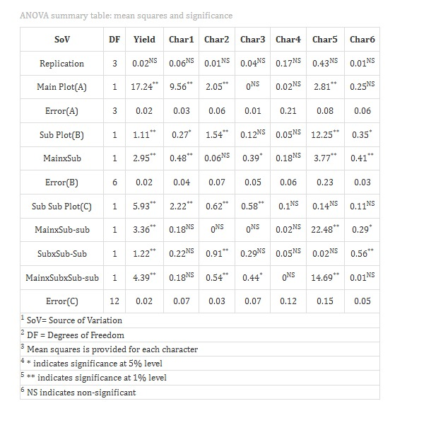{#fig-100 fig-align="center"}

<details>

```{=html}
<summary style="color: #5DADE2"; font-weight: bold;"> ANOVA table </summary>
```

<small> In a Split Split Plot Design (SSPD), the analysis of variance **(ANOVA)** partitions the total sum of squares into several sources, each tested against its corresponding error term. The main plot factor (Factor A) is tested against the main plot error (Error A = Blocks × Factor A interaction). The sub-plot factor (Factor B) and the A×B interaction are tested against the sub-plot error (Error B). The sub-sub-plot factor (Factor C) and all interactions involving C (A×C, B×C, A×B×C) are tested against the sub-sub-plot error (Error C). This hierarchy ensures that each F-test is based on the appropriate error variance, leading to valid and unbiased significance testing.

The degrees of freedom for each source in a typical SSPD with **r** blocks, **a** levels of Factor A, **b** levels of Factor B, and **c** levels of Factor C are as follows:

| Source                  | df                    |
|-------------------------|-----------------------|
| Blocks                  | r − 1                 |
| Factor A (Main Plot)    | a − 1                 |
| Error A                 | (r − 1)(a − 1)        |
| Factor B (Sub-plot)     | b − 1                 |
| A × B                   | (a − 1)(b − 1)        |
| Error B                 | a(r − 1)(b − 1)       |
| Factor C (Sub-sub-plot) | c − 1                 |
| A × C                   | (a − 1)(c − 1)        |
| B × C                   | (b − 1)(c − 1)        |
| A × B × C               | (a − 1)(b − 1)(c − 1) |
| Error C                 | ab(r − 1)(c − 1)      |
| Total                   | rabc − 1              |

Significance is indicated by an asterisk ( \* ) for the **5%** level and two asterisks (\*\*) for the **1%** level of significance, displayed as superscripts for each corresponding F statistic in the table. If the computed F value exceeds the critical value for any source, the null hypothesis for that factor or interaction is rejected, indicating that at least one level differs significantly from others. When interactions are significant, the main effects of the involved factors must be interpreted with caution, and simple effects analyses or slicing techniques may be warranted. </small>

</details>

### Interpretation 

::: {style="text-align: justify;"}
In our hypothetical example, the ANOVA results indicate that the Main Plot factor Irrigation regime (Factor A) - has a treatment mean square of 3215.40 and a main plot error mean square of 842.60, producing an F-ratio of approximately 3.81, which is statistically significant at the 5% level. This suggests that irrigation regime has a meaningful effect on yield. The Sub-plot factor -Nitrogen level (Factor B) - produced an F-ratio of 6.45, significant at the 1% level, confirming strong nitrogen effects on yield. The Sub-sub-plot factor - Variety (Factor C) -yielded an F-ratio of 8.12, also highly significant at the 1% level, indicating substantial varietal differences. Importantly, the A×B×C three-way interaction was significant at the 5% level (F = 3.24), suggesting that the effect of variety on yield is influenced by the combination of irrigation regime and nitrogen level.

In practical terms, these results imply that selecting the best variety cannot be done in isolation from irrigation and nitrogen management. The significant three-way interaction makes a strong case for evaluating each variety under specific combinations of irrigation and nitrogen rather than across their averages. @sec-8 provides detailed information on multiple comparison tests (post-hoc tests) for interpreting specific pairwise differences.
:::

**Table 2: Detailed tabular representation with multiple comparisons**

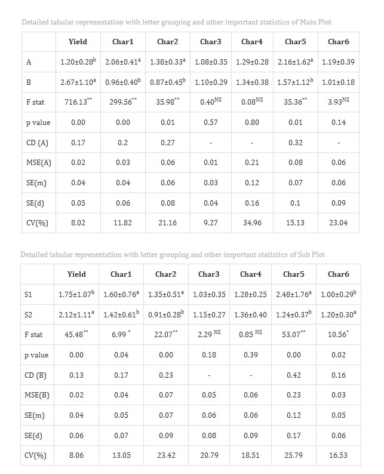{#fig-101 fig-align="center"} 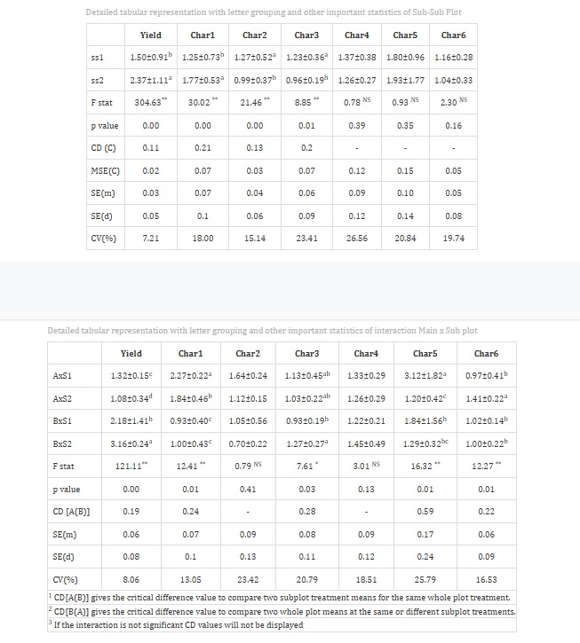{fig-align="center"} 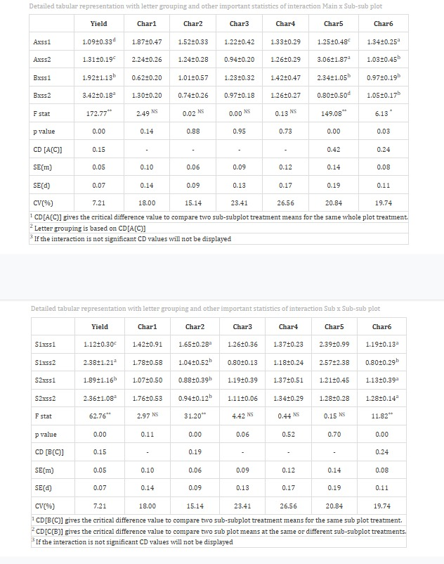{fig-align="center"}

<details>

```{=html}
<summary style="color: #5DADE2"; font-weight: bold;">Overview of ANOVA Results and Interpretation
</summary>
```

<small>

1.  *Factors and Response Variables*

**Main Plot Factor (Factor A)**: The largest-scale independent variable applied to whole plots - in our example, Irrigation regime (I1, I2, I3).

**Sub-plot Factor (Factor B)**: The intermediate independent variable applied within each main plot - in our example, Nitrogen level (N1, N2).

**Sub-sub-plot Factor (Factor C)**: The smallest-scale independent variable applied within each sub-plot -in our example, Variety (V1, V2, V3).

**Response Variable**: The dependent variable or specific measurement (e.g., Yield) recorded to evaluate the combined performance of the three factors.

2.  *Multiple Comparisons*

**Post-hoc Grouping**: A method of using letters (a, b, c) to categorize means. Items sharing the same letter are statistically similar, while those with different letters are significantly different. In SSPD, comparisons of sub-sub-plot factor means and interactions use the sub-sub-plot error (Error C) as the basis for the critical difference.

3.  *ANOVA Summary*

**F stat**: A numerical value that compares the variance between factor levels or interactions to the appropriate error variance; it determines if the overall differences are statistically significant.

**p value**: The probability that the observed differences occurred by random chance. A value below the chosen significance level (typically 0.05 or 0.01) indicates that the results are statistically significant.

4.  *Critical Difference (CD) and Error Estimates*

**Critical Difference (CD)**: The minimum mathematical gap required between two means to declare them "significantly different" at a specific confidence level. In SSPD, separate CD values are calculated for Factor A, Factor B, Factor C, and interaction comparisons using their respective error mean squares.

**Standard Error (SE)**: A measure of the accuracy of a sample mean compared to the true population mean; it indicates how much the mean might fluctuate across replications.

**Mean Square Error (MSE)**: The average of the squared differences between observed values and the predicted mean for the relevant error term; it represents the unexplained error at each level of the hierarchy.

**Coefficient of Variation (CV%)**: A percentage that shows the level of dispersion in the data. In SSPD, separate CV% values may be reported for the main plot, sub-plot, and sub-sub-plot levels. A lower CV indicates higher precision and reliability in the experimental measurements.

**Cohen's F**: A standardized measure of effect size that describes the magnitude of the experimental effect, independent of sample size. </small>

</details>

### Interpretation from @fig-101

::: {style="text-align: justify;"}
Treatments are grouped using letters like **"a", "b", "c"**, etc., to indicate statistical similarity. Overlapping grouping letters (e.g., **ab**/**bc**) indicate that the absolute difference between treatment means is less than the critical difference at the chosen level of significance, implying statistical similarity **(on par)**. In our example, among irrigation regimes, I2 (Alternate wetting and drying) recorded the highest mean yield (4821.35 ± 132.60 kg/ha), while I3 (Deficit irrigation) recorded the lowest (4102.44 ± 98.75 kg/ha). Among varieties, V1 (Jyothi) produced the highest mean yield overall, and was statistically at par with V2 (Uma), as indicated by common letter groupings.

For characters exhibiting significant treatment effects, pairwise comparisons of treatment means were conducted using the Least Significant Difference (LSD) test, using the appropriate error mean square for each level of comparison. The LSD test provides the critical difference (CD) value, which was used to determine significant differences between pairs of treatment means. Based on these comparisons, letter groupings were assigned to each treatment and presented as superscripts. Treatments sharing at least one common letter within a character were considered not significantly different (statistically on par).
:::

::: callout-tip
#### When a researcher uses Tukey's HSD or DMRT in a Split Split Plot Design, separate critical values are computed for each level of the design hierarchy (main plot, sub-plot, sub-sub-plot) because each level has its own error mean square and degrees of freedom.
:::

::: {style="text-align: justify;"}
In our example for the character Yield, the interaction between Irrigation regime and Variety revealed that the combination of I2 and V1 produced the highest mean yield, while I3 and V3 produced the lowest. The Cohen's f values in the table represent the effect size and quantify the magnitude of treatment effects. Values less than 0.10 indicate a very small effect, below 0.25 indicate a small effect, below 0.40 indicate a medium effect, and values of 0.40 or higher indicate a large effect. The observed effect size for yield at the sub-sub-plot level should therefore be interpreted as substantial and biologically meaningful.
:::

::: callout-tip
#### Cohen's f is a measure of effect size. It tells you how strong or meaningful the treatment effect is, independent of sample size — this applies equally to main effects and interactions in a Split Split Plot Design.
:::

## Multiple comparison tests {#sec-8 .MCT}

<details>

```{=html}
<summary style="color: #5DADE2"; font-weight: bold;">
  What is a Post-hoc test?
</summary>
```

<ul><small> A post-hoc test is a follow-up analysis performed after finding a significant result in an overall statistical test like ANOVA. Its purpose is to identify exactly which groups or treatments differ from each other. In a Split Split Plot Design, post-hoc tests must be applied carefully because different error terms govern different comparisons - the main plot error is used for Factor A comparisons, the sub-plot error for Factor B and A×B comparisons, and the sub-sub-plot error for Factor C and all interactions involving C.</small></ul>

</details>

::: {style="text-align: justify;"}
After obtaining significant F-values in the SSPD ANOVA, multiple comparison tests are employed to identify which treatment means differ significantly. Commonly used post-hoc tests include Least Significant Difference (LSD), Tukey's Honest Significant Difference (HSD), and Duncan's Multiple Range Test (DMRT), each differing in their level of error control and suitability depending on the number of treatment levels and the hierarchy of the comparison being made see @fig-7.
:::

.png){#fig-7 fig-align="center"}

<details>

```{=html}
<summary style="color: #5DADE2"; font-weight: bold;"> Post-hoc test </summary>
```

<small>

When the ANOVA in a **Split Split Plot Design (SSPD)** is significant, the following post-hoc tests are commonly used for pairwise comparisons. A critical distinction in SSPD is that the appropriate error mean square must be identified for each comparison Factor A uses Error A, Factor B and A×B use Error B, while Factor C, A×C, B×C, and A×B×C use Error C.

**LSD (Least Significant Difference) Test**

The **Least Significant Difference (LSD)** test is a post-hoc statistical procedure used to identify which specific treatment means differ significantly after the ANOVA has indicated an overall significant effect. In a Split Split Plot Design, the LSD is computed separately for comparisons at different levels of the hierarchy, each using its own error mean square and degrees of freedom.

The LSD is calculated as $$\text{LSD} = t_{\alpha/2, \, df_{\text{error}}} \sqrt{\frac{2 \times \text{MSE}}{r}}$$

where **t₍α/2, dfₑᵣᵣₒᵣ₎** is the critical t-value at the chosen significance level, **MSE** is the mean square error from the relevant error term, and **r** is the number of replications. For sub-sub-plot factor comparisons, the sub-sub-plot error (Error C) and its degrees of freedom are used. Any absolute difference between two treatment means exceeding this LSD value is declared statistically significant.

**Tukey's Honestly Significant Difference (HSD)**

Tukey's test identifies exactly which pairs of treatment means differ significantly while controlling the overall Type I error rate. In SSPD, Tukey's HSD is particularly recommended for sub-sub-plot factor comparisons when the number of treatment levels is large, as it is more conservative than LSD and reduces the risk of false positives when many pairwise comparisons are made. It uses the studentized range distribution and the appropriate error mean square for the level of comparison.

**Duncan's Multiple Range Test (DMRT)**

After confirming significant overall differences via ANOVA, DMRT ranks the treatment means and calculates critical differences using the studentized range statistic (Q) and the standard error based on the error variance from the appropriate level of the SSPD. DMRT uses progressively larger critical values as the number of steps between ranked means increases, making it more powerful than the LSD in detecting differences while being less conservative than Tukey's HSD. It is widely used in agricultural research for SSPD analyses and provides clear letter-based groupings of treatments. </small>

</details>

**Which Post-hoc test to use?**

::: {style="text-align: justify;"}
The choice of the post-hoc test completely relies on the researcher.

**LSD** is widely used in agricultural experiments with SSPD because it is sensitive, simple to compute, and well understood. It is most suitable when the number of treatment levels is small and planned comparisons are of primary interest. However, researchers must be cautious about inflated Type I error when many pairwise comparisons are made simultaneously, especially at the sub-sub-plot level.

**Tukey's HSD** is preferred when there are four or more levels of a factor, particularly for the sub-sub-plot factor or interaction comparisons. It compares all possible treatment pairs while strictly controlling the family-wise error rate, making it a conservative and reliable choice for multi-level factorial comparisons in SSPD.

**DMRT** is commonly used in SSPD experiments in the agricultural and biological sciences. It ranks treatment means step-wise and is more powerful than Tukey's HSD in detecting real differences, although it carries a comparatively higher risk of Type I error. DMRT is especially popular when a large number of sub-sub-plot treatment levels are being compared.

In our example, for characters showing significant treatment effects or interactions, pairwise comparisons were performed using the Least Significant Difference (LSD) test, with the appropriate error mean square applied at each level of the design hierarchy.
:::

## Basic plots {#BP}

::: {style="text-align: justify;"}
**RAISINS** is designed for a smooth and hassle-free experience. Once you click the Run Analysis button, all relevant results and outputs appear instantly leaving no room for confusion. We have ensured that every possible plot related to the Split Split Plot Design is readily available. Simply click on the Basic Plots tab to view them see @fig-8. Each plot comes with a gear icon at the top-left corner, allowing you to customize its appearance. You can also download these plots in high-quality PNG format (300 dpi), JPEG, TIFF, PDF, and SVG for use in reports or presentations.
:::

### Customizing plots

::: {style="text-align: justify;"}
**RAISINS** provides users various customization features for the plots to enhance the visualization according to their requirements. **Click** on @fig-8 to get a clear idea of the customizing features.
:::

-   <div>

    .png){#fig-8 fig-align="center"}

    </div>

::: {style="text-align: justify;"}
From @fig-9 to @fig-13, you can see the different types of plots available in **RAISINS** for Split Split Plot Design analysis. Each one is visually illustrated and accompanied by a clear, insightful description, making it easy to understand.
:::

```{=html}
<script>
document.addEventListener('DOMContentLoaded', function() {
  const descriptions = document.querySelectorAll('.plot-description');
  descriptions.forEach(desc => {
    desc.style.display = 'none';
  });
});

function showDescription(id) {
  document.getElementById(id).style.display = 'flex';
}

function hideDescription(id) {
  document.getElementById(id).style.display = 'none';
}
</script>
```

```{=html}
<style>
.plot-container {
  position: relative;
  display: inline-block;
  cursor: pointer;
  width: 350px;
  height: 300px;
  overflow: hidden;
  margin: 10px;
}

.plot-container img {
  width: 350px;
  height: 300px;
  object-fit: cover;
  border: 3px solid #ddd;
  border-radius: 8px;
  transition: transform 0.3s ease, box-shadow 0.3s ease;
}

.plot-container:hover img {
  transform: scale(1.05);
  box-shadow: 0 4px 12px rgba(0, 0, 0, 0.2);
}

.plot-description {
  display: none !important;
  position: absolute;
  top: 0;
  left: 0;
  width: 100%;
  height: 100%;
  z-index: 1000;
  background: linear-gradient(135deg, rgba(255, 107, 107, 0.8), rgba(255, 142, 83, 0.8));
  color: white;
  padding: 15px;
  border-radius: 8px;
  box-shadow: 0 4px 15px rgba(0, 0, 0, 0.3);
  font-size: 14px;
  line-height: 1.5;
  display: flex;
  align-items: center;
  justify-content: center;
  text-align: center;
  animation: fadeIn 0.3s ease-in;
  pointer-events: none;
  border: 2px solid rgba(255, 255, 255, 0.5);
}

.plot-container:hover .plot-description {
  display: flex !important;
}

@keyframes fadeIn {
  from { opacity: 0; transform: scale(0.95); }
  to { opacity: 1; transform: scale(1); }
}

#boxplot-desc { background: linear-gradient(135deg, rgba(255, 107, 107, 0.8), rgba(255, 142, 83, 0.8)); }
#barplot-desc { background: linear-gradient(135deg, rgba(161, 140, 209, 0.8), rgba(251, 194, 235, 0.8)); }
#connectedplot-desc { background: linear-gradient(135deg, rgba(0, 221, 235, 0.8), rgba(38, 166, 154, 0.8)); }
#meanvalueplot-desc { background: linear-gradient(135deg, rgba(255, 154, 139, 0.8), rgba(255, 106, 136, 0.8)); }
#violinplot-desc { background: linear-gradient(135deg, rgba(132, 250, 176, 0.8), rgba(143, 211, 244, 0.8)); }
</style>
```

:::::::::::::::::::::::: grid
:::::: g-col-6
::::: {.plot-container onmouseover="showDescription('boxplot-desc')" onmouseout="hideDescription('boxplot-desc')"}
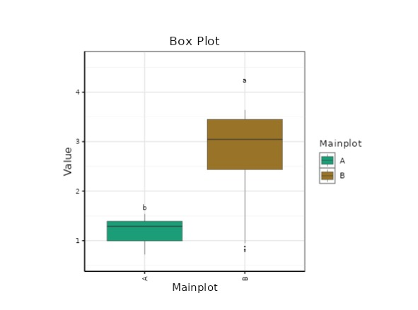{#fig-9}

:::: {#boxplot-desc .plot-description}
::: {style="text-align: justify;"}
A **box plot** in split–split plot design is used to visually summarize the distribution of data for different treatment combinations across three factors (main plot, subplot, and sub-subplot). It displays the median, quartiles, and variability of observations, helping to compare the effects of treatments and their interactions. Box plots make it easy to identify differences, spread, and possible outliers among levels of each factor, providing a clear understanding of treatment performance in a complex experimental design.
:::
::::
:::::
::::::

:::::: g-col-6
::::: {.plot-container onmouseover="showDescription('violinplot-desc')" onmouseout="hideDescription('violinplot-desc')"}
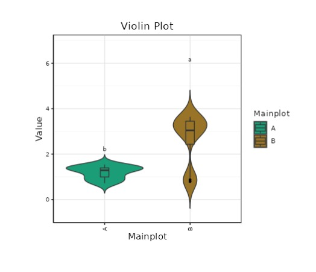{#fig-10}

:::: {#violinplot-desc .plot-description}
::: {style="text-align: justify;"}
A **violin plot** in split–split plot design is used to show the distribution and density of data for different treatment combinations across main plot, subplot, and sub-subplot factors. It combines a box plot with a density curve, allowing better visualization of data spread, symmetry, and variation. This helps in comparing treatments and understanding how values are distributed within each factor level, especially in complex experimental designs.
:::
::::
:::::
::::::

:::::: g-col-6
::::: {.plot-container onmouseover="showDescription('barplot-desc')" onmouseout="hideDescription('barplot-desc')"}
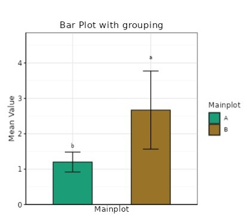{#fig-11}

:::: {#barplot-desc .plot-description}
::: {style="text-align: justify;"}
A **bar plot with grouping** in split–split plot design is used to compare mean values of different treatment combinations by arranging bars in groups based on factors like main plot, subplot, and sub-subplot. Each group represents one factor level, while bars within the group show variations of other factors. It helps in clearly visualizing differences, comparisons, and interactions among treatments in a simple and organized manner.
:::
::::
:::::
::::::

:::::: g-col-6
::::: {.plot-container onmouseover="showDescription('meanvalueplot-desc')" onmouseout="hideDescription('meanvalueplot-desc')"}
{#fig-12}

:::: {#meanvalueplot-desc .plot-description}
::: {style="text-align: justify;"}
A **mean value plot** in split–split plot design shows the average (mean) performance of different treatment combinations across main plot, subplot, and sub-subplot factors. It helps in easily comparing the effects of each factor and their interactions. By plotting mean values, it provides a clear understanding of treatment differences and overall trends in the data, making interpretation of complex experimental results simpler.
:::
::::
:::::
::::::

::::::: g-col-6
:::::: {.plot-container onmouseover="showDescription('connectedplot-desc')" onmouseout="hideDescription('connectedplot-desc')"}
::: {style="text-align: center;"}
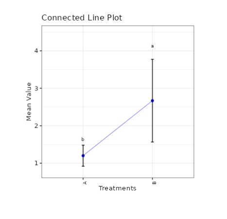{#fig-13}
:::

:::: {#connectedplot-desc .plot-description}
::: {style="text-align: justify;"}
A **connected line plot** in split–split plot design is used to display the relationship and trend of mean values across different treatment levels. Points representing treatment means are connected with lines, making it easier to visualize changes and interactions among main plot, subplot, and sub-subplot factors. It helps in identifying patterns, trends, and comparative performance of treatments in a clear and simple way.
:::
::::
::::::
:::::::
::::::::::::::::::::::::

## Advanced plots {#AP}

::: {style="text-align: justify;"}
**RAISINS** also provides advanced plot which go beyond basic bar charts and histograms to give deeper insight into your data, especially distributions, relationships, and deviations from expectations. See @fig-90
:::

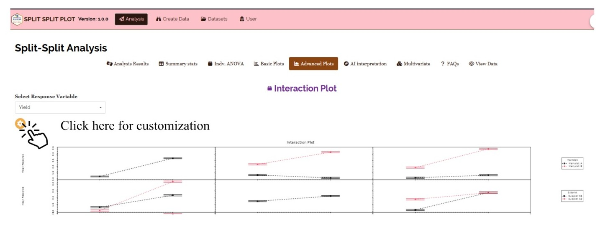{#fig-90 fig-align="center"}

**INTERACTION PLOT**

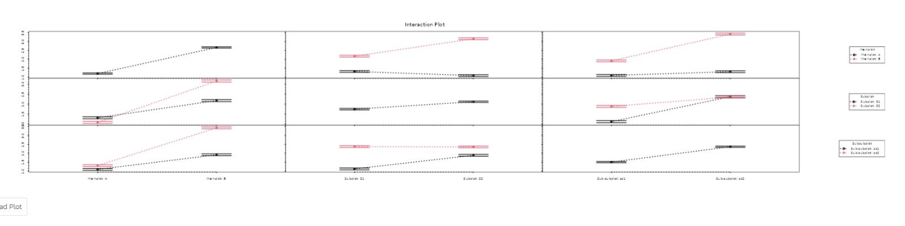{fig-align="center"}

::: {style="text-align: justify;"}
An interaction plot in split–split plot design is used to show how the effect of one factor changes with the levels of another factor. It plots mean values with lines for different treatments, helping to identify interactions among main plot, subplot, and sub-subplot factors. If the lines are parallel, there is little or no interaction; if they cross or diverge, it indicates a strong interaction between factors.
:::

**3D SCATTER PLOT**

{fig-align="center"}

::: {style="text-align: justify;"}
A 3D scatter plot in split–split plot design is used to visualize the relationship among three variables or factors simultaneously. Each point represents a treatment combination positioned along three axes, typically corresponding to main plot, subplot, and sub-subplot factors or their values. It helps in identifying patterns, clusters, and interactions in complex experimental data in a more visual and intuitive way.
:::

**3D SCATTER PLOT WITH LINES**

{#fig-16 fig-align="center"}

::: {style="text-align: justify;"}
A 3D scatter plot with lines in split–split plot design is used to visualize relationships among three variables along with trends between treatment combinations. Data points represent different treatments across main plot, subplot, and sub-subplot factors, and lines are used to connect related points to show patterns or progression. This helps in better understanding interactions, trends, and the overall structure of complex experimental data.
:::

## AI interpretation {#AI}

::: {style="text-align: justify;"}
**RAISINS** is equipped with an AI-powered RAISINS Assistant designed to assist users in comprehending the outcomes of statistical tests and data analysis. This functionality provides clear and concise summaries of results, identifies statistically significant differences among factor levels and interactions, and offers informed suggestions for potential next steps or interpretations. In the context of a Split Split Plot Design, the AI assistant will interpret the significance of main effects, two-way interactions (A×B, A×C, B×C), and the three-way interaction (A×B×C), guiding researchers on how to report and act upon the results. The user can get detailed interpretations of the analysis by clicking on AI Intrepretation on the Analysis as shown below @fig-ai.
:::

{#fig-ai fig-align="center"}

## Multivariate {#MUL}

::: {style="text-align: justify;"}
Multivariate analysis in Split Split Plot Design (SSPD) helps you compare different response variables simultaneously across all factor level combinations. Remember that the PCA used for multivariate selection is an exploratory technique, not an inferential method. Now, in our example of evaluating rice varieties (V1, V2, V3) under different irrigation regimes (I1, I2, I3) and nitrogen levels (N1, N2) —a total of 18 treatment combinations across three replications navigate to Multivariate, see @fig-mu.
:::

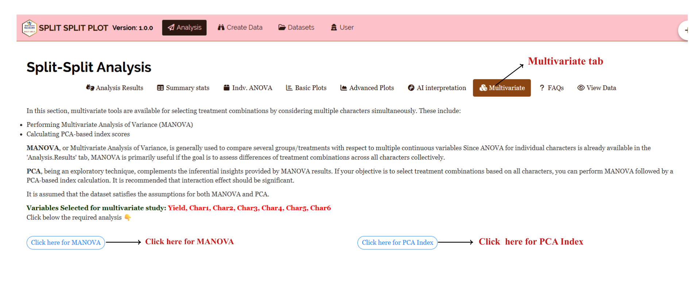{#fig-mu}

::: {style="text-align: justify;"}
MANOVA and PCA will be automatically carried out based on the selected variables. The MANOVA table with interpretation appears automatically. PCA results and plots will appear along with automated interpretation.
:::

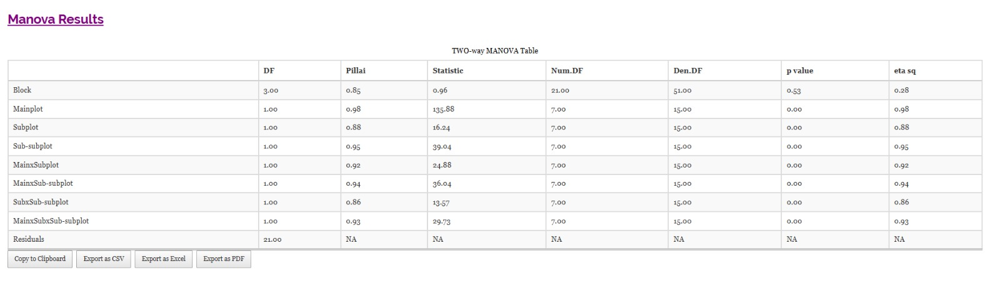{#fig-MAN2 fig-align="center"}

::: {style="text-align: justify;"}
The table titled 'Eigen Values PCA' given in @fig-PC provides information about the eigen values and the percentage of variance explained by each principal component. The principal components PC1 and PC2 have eigenvalues greater than one and are considered important for further analysis. PC1 accounts for approximately 54% of the variance in the dataset, while PC2 accounts for about 22% of the variance. Together, PC1 and PC2 explain approximately 76% of the total variance (termed cumulative variance). Since PC1 explains more than 40% of the variance, a PC1-based index score is a strong consideration. Additionally, since both PCs explain more than 60% of the variance in the data, an index score based on both PCs is also appropriate. The scree plot below illustrates the proportion of variance explained by each principal component.
:::

{#fig-PC}

::: {style="text-align: justify;"}
The scree plot given in @fig-screeplot illustrates the proportion of variance explained by each principal component.
:::

{#fig-screeplot fig-align="center"}

::: {style="text-align: justify;"}
Look upon the loadings of each variable in the given @fig-loadings and decide which PC-based index needs to be selected. In our example, Yield and FW show high positive loadings in PC1, suggesting that treatment combinations scoring high on PC1 perform well in terms of overall biomass and economic yield. Obs1 and Obs2 show moderate positive loadings in PC2, indicating that PC2 captures additional trait variation not explained by PC1. It is recommended to use variables that are highly correlated for PCA, as this helps in constructing a more reliable and meaningful index. Since Yield and FW are strongly positively loaded in PC1, a PC1-based index score is most appropriate for identifying superior irrigation × nitrogen × variety combinations.
:::

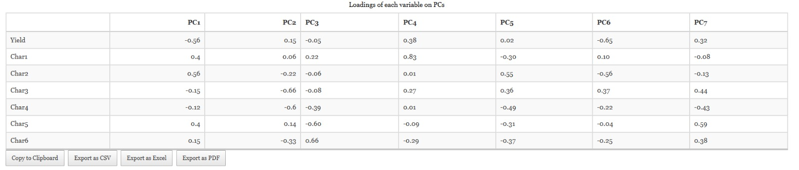{#fig-loadings fig-align="center"}

::: {style="text-align: justify;"}
The biplot gives a visual representation of the relationships among variables and treatment combinations. Treatment combinations with high values for a specific variable are positioned in the direction of that variable's vector. The angle between variable vectors in the biplot indicates their correlation smaller angles suggest high positive correlation, while angles close to 90 degrees suggest weak or no correlation. In the SSPD biplot, treatment combinations are labeled by their factor level codes (e.g., I2N2V1), allowing the researcher to identify which combinations are associated with superior performance across multiple traits simultaneously.
:::

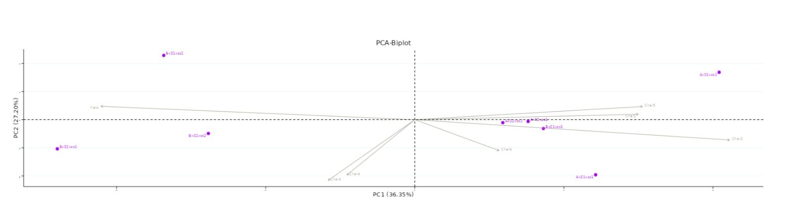{#fig-biplot}

::: {style="text-align: justify;"}
In **RAISINS**, we calculate a scaled index score by converting the index score to a range of 0 to 1, making it easier to interpret and compare. This standardized approach ensures consistency in evaluating treatment combinations based on their index scores. To refine your selection, use the 'Select cutoff for Scaled Index Score' feature given in @fig-indexscore, where you can choose the cutoff percentage to select treatment combinations above or below a certain threshold. The default cutoff is set at 75%. By toggling the up-arrow and down-arrow buttons below the cutoff selection, you can select the top or bottom percentage of treatment combinations as per your preference. Selected combinations are highlighted in yellow in the table below, providing a clear visual cue. Additionally, a plot based on the index scores is also displayed to aid in your analysis.
:::

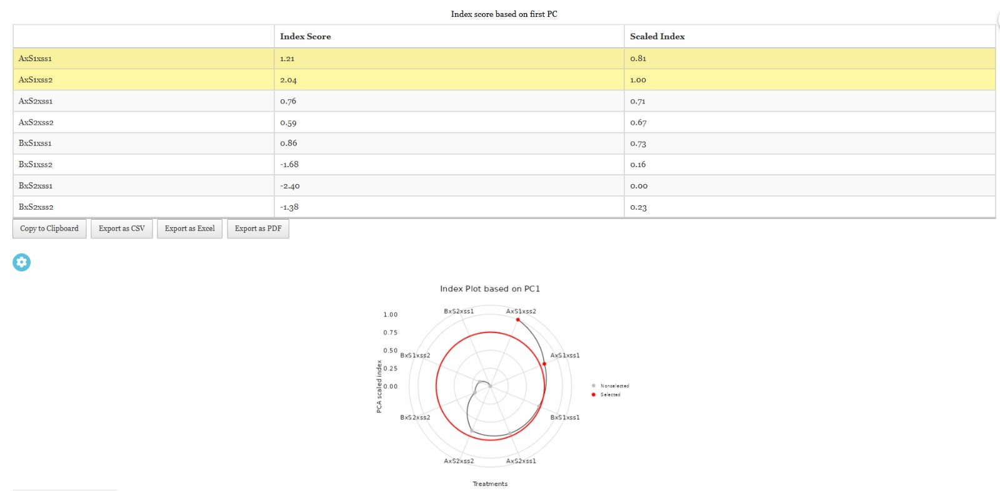{#fig-indexscore fig-align="center"}

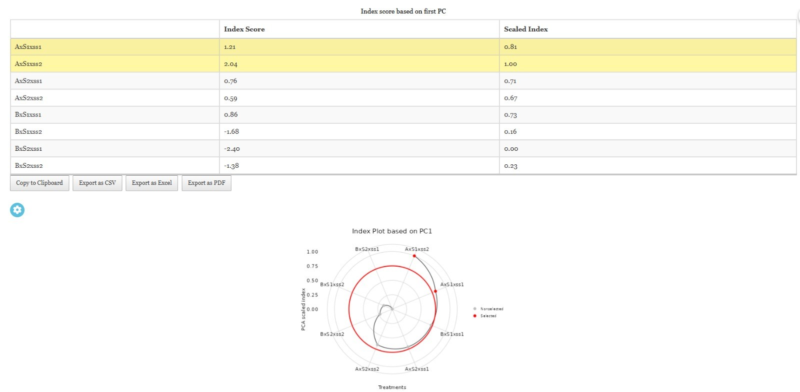{#fig-index fig-align="center"}

::: {style="text-align: justify;"}
Combining all this information, the experimenter can arrive at an overall conclusion that is statistically sound and contextually relevant to their study. In our example, the combination I2 × N2 × V1 consistently emerged as the top-performing treatment combination based on both univariate ANOVA and the multivariate PCA index score, providing a robust recommendation grounded in multiple lines of statistical evidence.
:::

## Preparing your data {#PRE}

::: {style="text-align: justify;"}
"Your analysis is only as good as your data! Feed RAISINS high-quality data, and it will deliver powerful insights - feed it messy data, and the results won't be trustworthy."

1.  Create your dataset in MS Excel

2.  Build your dataset directly within the RAISINS app
:::

## Preparing data in MS Excel {#EX}

::: {style="text-align: justify;"}
Open a new blank sheet in MS Excel with only one sheet included, and avoid adding any unnecessary content. For a Split Split Plot Design, the dataset must follow a column-based format with the following required columns: a Replication column (indicating the block number), a Main Plot factor column (Factor A - e.g., Irrigation regime), a Sub-plot factor column (Factor B - e.g., Nitrogen level), a Sub-sub-plot factor column (Factor C - e.g., Variety), and all response variable columns (e.g., Yield, Obs1, Obs2, FW). Each unique combination of Replication × Factor A × Factor B × Factor C must appear as a separate row. The file can be saved in CSV, XLS, or XLSX format, but CSV is recommended as it is lighter and enables faster loading. Ensure that there are no unwanted spaces in column names or factor level names. For reference, see the structure shown in @fig-pp. As illustrated in @fig-data, all factor combinations must appear in full across replications, and the data can also be arranged as shown in @fig-kk.
:::

{#fig-pp}

<details>

<summary>Dataset Creation Rules</summary>

<small> 1. **Column Naming Convention** - No spaces allowed in column names.\
- Use underscores (`_`) or full stops (`.`) for separation. - Avoid symbols and special characters like %,# etc. 2. **Data Arrangement** - Start data arrangement towards the upper-left corner.\
- Ensure the row above the data is not blank.\
- All factor level combinations must be fully represented across replications. 3. **Cell Management** - Avoid typing or deleting in cells without data.\
- If needed, select affected cells, right-click, and select **Clear Contents**. 4. **Column Relevance** - Name all columns meaningfully.\
- Include separate columns for Replication, Factor A, Factor B, Factor C, and each response variable. - Exclude unnecessary columns not required for analysis. </small>

</details>

<details>

<summary>How to Save as CSV in MS Excel</summary>

<small> 1. **Open Your Workbook**

```         
-   Ensure your data is arranged properly with only one sheet.
```

2.  **Click 'File' Menu**

    -   Go to the top-left corner and click on **File**.

3.  **Choose 'Save As' or 'Save a Copy'**

    -   Select the location where you want to save your file.

4.  **Set File Type to CSV**

    -   In the **'Save as type'** dropdown menu, choose **CSV (Comma delimited) (\*.csv)**.

5.  **Name Your File**

    -   Enter a relevant file name without spaces (use underscores if needed).

6.  **Click 'Save'**

    -   Click **Save** to export the file.

> 💡 Tip: Before saving, double-check that your data is on the first sheet and follows the required format no empty rows above the data, all four structural columns present (Replication, Factor A, Factor B, Factor C), and meaningful column names. </small>

</details>

## Creating dataset in RAISINS {#CR}

::: {style="text-align: justify;"}
If you're unsure about the correct format for creating a dataset, don't worry -**RAISINS** offers an option to create data directly within the app using the prescribed template. Here's how:

-   Navigate to the **Create Data Tab**

-   Select the number of **Main Plot Treatments** (Factor A levels)

-   Select the number of **Sub-plot Treatments** (Factor B levels)

-   Select the number of **Sub-sub-plot Treatments** (Factor C levels)

-   Select number of **Replications**

-   Select number of **Characters** (response variables)

-   Click on **Create** button

Model layout will appear as shown in @fig-createdata. Now you may enter the observations manually into the CSV file once downloaded, or paste the observations straight into the file provided. Once you have entered the observations in the layout, download the CSV file and upload in Analysis.
:::

-03.png){fig-align="center"}

## Model datasets {#M}

::: {style="text-align: justify;"}
To test the app or better understand the data arrangement for a Split Split Plot Design, we provide model datasets within the app. You can download them from the Dataset.
:::

{#fig-188 fig-align="center"} {fig-align="center"}

## FAQ's {#F}

::: {style="text-align: justify;"}
The app includes a dedicated FAQs to help clarify common doubts and guide users through various features. This section provides detailed answers to frequently asked questions, offering additional information and helpful tips to ensure a smooth user experience. If you're ever unsure about how something works, the FAQs is a great place to start.
:::

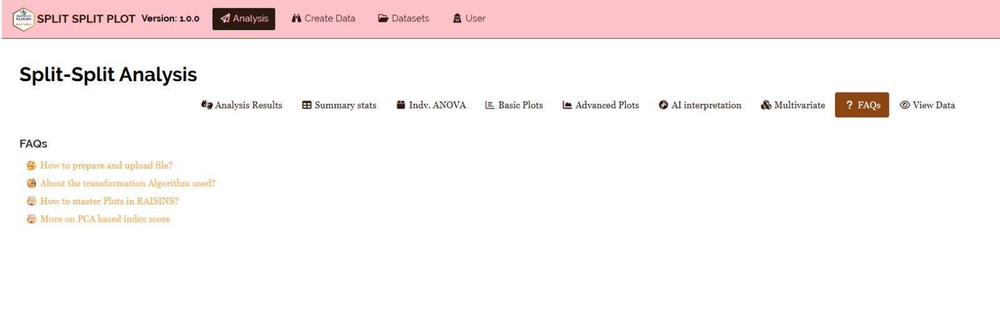{#fig-148 fig-align="center"}

## View data {#U}

::: {style="text-align: justify;"}
View Data serves as the primary diagnostic tool for ensuring data integrity before analysis. Upon uploading your dataset, the system performs an automated Health Check to validate column types and formatting. For a Split Split Plot Design, this check will confirm that the Replication, Main Plot, Sub-plot, and Sub-sub-plot factor columns are correctly identified and that no unexpected missing values or formatting inconsistencies are present in the dataset.
:::

{fig-align="center"}

------------------------------------------------------------------------
