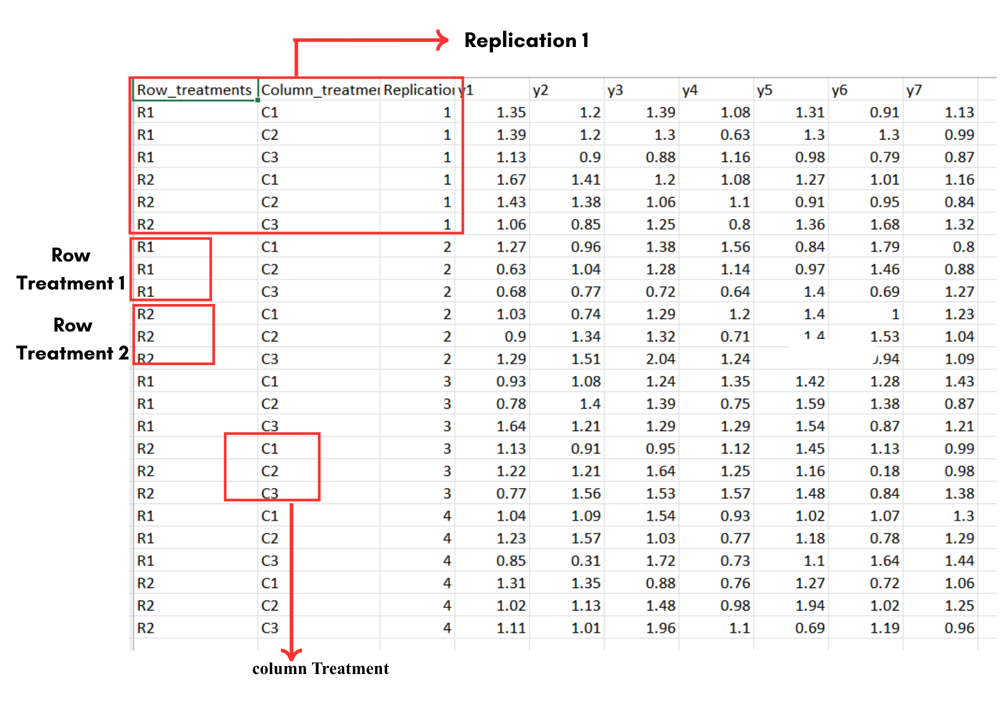
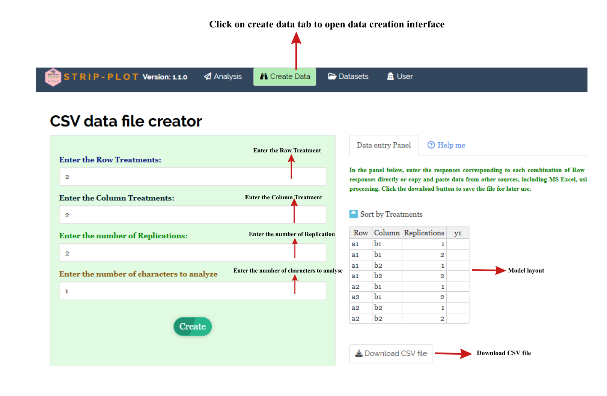

```{=html}
<style>
 sup {
   color: blue;
   font-size: 0.8em;
 }
 .affiliations {
   color: grey;
   font-size: 0.9em;
   margin-top: 0.2em;
 }
</style>
```

::: affiliations
<sup>1</sup>Statoberry LLP, <sup>2</sup>Department of Agricultural Statistics, Kerala Agricultural University
:::

ABSTRACT

::: {style="text-align: justify;"}
**Strip Plot Design** is a two-factor experimental design that arranges treatments in horizontal strips and vertical strips across blocks, making it especially suitable for experiments involving large-scale field operations such as irrigation, tillage, or mechanized sowing. Strip Plot Design partitions experimental variation into three distinct error terms - one for horizontal strip factor, one for vertical strip factor, and one for their interaction - thereby providing greater precision for the interaction effect. In **RAISINS** you can perform Strip Plot Design analysis very easily without writing a single line of code. This tutorial will guide you through how to perform **Strip Plot Design** analysis in **RAISINS** and interpret the results effectively. In addition, you will get tables and plots ready for publication. You can also perform a multivariate analysis including MANOVA and PCA.
:::

<details>

*Hover or click each point to see more information.*

```{=html}
<summary style="color: #5DADE2"; font-weight: bold;">
  Introduction Strip Plot Design
</summary>
```

```{=html}
<style>
.hover-img {
  position: relative;
  display: inline-block;
  cursor: help;
  border-bottom: 1px dashed currentColor;
}
.hover-img img {
  position: absolute;
  left: 50%;
  top: 1.6em;
  transform: translateX(-50%);
  width: 260px;
  max-width: 70vw;
  height: auto;
  padding: 6px;
  background: white;
  border: 1px solid rgba(0,0,0,.15);
  border-radius: 12px;
  box-shadow: 0 10px 30px rgba(0,0,0,.18);
  opacity: 0;
  visibility: hidden;
  pointer-events: none;
  transition: opacity .15s ease, transform .15s ease, visibility .15s;
}
.hover-img:hover img {
  opacity: 1;
  visibility: visible;
  transform: translateX(-50%) translateY(6px);
  z-index: 999;
}
</style>
```

<ul><small> The **Strip Plot Design** evolved from the pioneering work of **Ronald A Fisher**{alt="Preview"} and his colleagues at Rothamsted Experimental Station during the 1920s and 1930s. As agricultural research began to incorporate large-scale mechanised operations such as irrigation by flood or furrow, deep tillage, and combine harvesting experimenters recognised that standard Randomised Block Designs could not efficiently accommodate treatments that needed to be applied across wide strips of land. The Strip Plot Design was formalised as a practical solution, allowing one set of treatments (horizontal strips) and a second set of treatments (vertical strips) to be laid out independently across each block, with their crossing generating interaction plots. This arrangement sacrifices some precision for the main effects compared to a factorial RBD, but it greatly enhances precision for the interaction between the two factors precisely the comparison of greatest agronomic interest in many cropping system studies. The design became widely adopted in agronomy, irrigation research, and variety-by-management studies throughout the twentieth century, and remains a cornerstone of field experimental methodology to this day. </small></ul>

</details>

## Analysis of experiments {#AE}

::: {style="text-align: justify;"}
To get started, visit **RAISINS** [www.raisins.live](https://www.raisins.live) home page and go to **Analysis of experiments**. Here, you can see different experimental designs available on the platform. In this tutorial, we focus on **Strip Plot Design** , as shown in @fig-aov.
:::

-01.png){#fig-aov fig-align="center"}

## Strip Plot Design (SPD) {#C}

::: {style="text-align: justify;"}
A Strip Plot Design is a two-factor experimental layout in which the levels of one factor (called the **horizontal strip factor** or Factor A) are assigned to horizontal strips running across each block, while the levels of a second factor (called the **vertical strip factor** or Factor B) are assigned to vertical strips running down each block. Each block is thereby divided into a grid of interaction plots, where every level of Factor A intersects every level of Factor B exactly once. This arrangement is replicated across two or more blocks, and treatments within each factor are randomised independently within each block. Strip Plot Design is particularly suited to experiments where one or both factors require large, contiguous areas for mechanised application such as irrigation regimes, tillage depths, or sowing methods making it impractical to use a fully randomised split-plot or factorial arrangement. The design produces three separate error terms: one for the horizontal factor, one for the vertical factor, and one for their interaction, providing the highest precision for the interaction effect. When factors do not require large-scale application equipment and experimental units are relatively homogeneous, a Randomised Block Design (RBD) or Split Plot Design may be more appropriate.
:::

<details>

```{=html}
<summary style="color: #5DADE2"; font-weight: bold;">
  SPD Layout
</summary>
```

<ul>

<small>

@fig-lay visually represents a Strip Plot Design (SPD) arrangement with three blocks (replications), three levels of the horizontal strip factor (A1, A2, A3) running across each block as rows, and three levels of the vertical strip factor (B1, B2, B3,B4) running down each block as columns. Each cell in the grid represents one interaction plot where a specific level of Factor A and a specific level of Factor B are applied simultaneously. Within each block, the levels of Factor A are randomised across the horizontal strips, and the levels of Factor B are randomised independently across the vertical strips. The resulting grid of interaction subplots provides the finest level of experimental comparison and carries the smallest error term, making the interaction analysis the most precise component of Strip Plot Design.

{#fig-lay fig-align="center"}

</small>

</ul>

</details>

::: callout-tip
#### Strip Plot Design is a two-factor experimental design where one factor is applied in horizontal strips and another in vertical strips across each block, producing three independent error terms and maximum precision for the interaction between the two factors.
:::

## A working example {#W}

::: {style="text-align: justify;"}
To make things simple and interesting, we'll explain Strip Plot Design analysis step by step using a hypothetical example, so you can clearly see how it works and why it matters.A working example of the given figure can be explained using a Strip Plot Design experiment conducted to study the combined effect of **irrigation levels** and **rice varieties** on yield and related traits. In this experiment, Factor A (row treatments) consists of different irrigation levels such as continuous flooding and alternate wetting and drying, while Factor B (column treatments) includes rice varieties like IR64, Swarna and ADT45. The experiment is arranged in several replications to improve accuracy. Within each replication, the field is divided into horizontal strips representing irrigation levels and vertical strips representing varieties, and their intersections form individual plots where observations are recorded. For example, in Replication 1, each combination of **irrigation level** (R1, R2) and **variety** (C1, C2, C3) is measured for variables such as **yield, Panicle length, number of spikelets, and grain weight** (shown as y1, y2, y3… values). This structure is repeated across replications (Replication 2, 3, and 4), ensuring that every treatment combination appears in each block. The collected data are then analyzed using ANOVA to determine whether irrigation levels, varieties, and their interaction have a significant effect on crop performance. This layout helps in clearly separating and evaluating the main and interaction effects of both factors in an efficient and systematic manner. @fig-data.
:::

{#fig-data fig-align="center"}

::: {style="text-align: justify;"}
Data organised in MS Excel can be directly uploaded to **RAISINS** for analysis. For more details on data preparation see @sec-4. Two terms that we will use frequently are **Treatments** and **Variables**. In our example, the Treatments refer to the combinations of irrigation level and rice variety, and the Variables are the four traits mentioned earlier **Yield, Panicle length, Spikelet number, and Grain weight**.
:::

## How to prepare your data? {#sec-4 .H}

::: {style="text-align: justify;"}
Arranging data for uploading in **RAISINS** is very simple. Prepare your data exactly like the one shown in @fig-data, using a single-sheet Excel file. Make sure no blank rows are left above, and all columns have proper names. That's it your file is ready to upload.

Still if you have doubt, see @fig-4.

To prepare your dataset for analysis in **RAISINS**, you have two options:

Creating dataset in MS Excel

Creating your dataset directly within the **RAISINS** app
:::

{#fig-4 fig-align="center"}

## Strip Plot Design analysis tab explained {#AO}

::: {style="text-align: justify;"}
In @fig-5, you can see the detailed view of the Analysis tab, along with explanations of what each option does. This section helps you to understand the purpose of every setting, so you can select the most appropriate ones for your data and analysis. Now, upload the prepared file by clicking Browse in the sidebar of the Analysis tab. When the file is uploaded, options to select the **Horizontal Strip Factor (Factor A)**, **Vertical Strip Factor (Factor B)**, **Block**, and **Variables** will appear. Select the appropriate columns for each field. Once you click the Run Analysis button, all relevant results and outputs appear instantly, leaving no room for confusion.
:::

{#fig-5 fig-align="center"}

::: {style="text-align: justify;"}
For some data, when there are large numbers of zeros, discrete values, or when the observed variables are not normally distributed, it may be necessary to apply a transformation to the dataset see @sec-6. **RAISINS** provides a built-in transformation option to handle such situations.
:::

## Transformation {#sec-6 .T}

::: {style="text-align: justify;"}
Log, square root, and arcsine transformations are often used in Strip Plot Design analysis to make data more normal and reduce uneven variation. Researchers can use these transformations when analysing experimental data in **RAISINS** as shown in @fig-6.
:::

-05.png){#fig-6 fig-align="center"}

::: {style="text-align: justify;"}
**Logarithmic transformation** is a mathematical procedure used to convert a skewed distribution into a more symmetrical one by replacing each data point (x) with its logarithm. This technique is specifically applied to positive, continuous data where the variance is proportional to the mean, a relationship common in phenomena that exhibit multiplicative or exponential growth.

**Square root transformation** is a statistical method used to stabilise variance and reduce right-skewness by replacing each data point (x) with its square root. It is primarily applied to non-negative, discrete count data such as those following a Poisson distribution, where the variance of the data tends to increase in proportion to the mean. By compressing the upper end of the scale more significantly than the lower end, this transformation brings the data closer to a normal distribution, satisfying the homoscedasticity requirements of many parametric statistical tests.

**Arcsine transformation** (also known as the angular transformation) is a mathematical technique specifically designed for data expressed as proportions or percentages bounded between 0 and 1. By taking the inverse sine of the square root of the proportion, this transformation stretches the ends of the distribution near 0 and 1, where variance is naturally small. It is primarily used to achieve homoscedasticity in binomial data.
:::

> After choosing the appropriate transformation proceed to @sec-7 for analysis.

## Analysis results {#sec-7 .AR}

::: {style="text-align: justify;"}
Once your dataset is uploaded, click on Run Analysis, and the **Strip Plot ANOVA** will be performed. Analysis of Variance **(ANOVA)** in the Strip Plot Design partitions the total variation into contributions from the horizontal strip factor (Factor A), the vertical strip factor (Factor B), their interaction (A × B), and three separate error terms corresponding to each of these sources (see @fig-100).
:::

**Table 1: ANOVA summary**

{#fig-100 fig-align="center"}

<details>

```{=html}
<summary style="color: #5DADE2"; font-weight: bold;"> ANOVA table </summary>
```

<small> In a Strip Plot Design (SPD), the analysis of variance **(ANOVA)** partitions the total sum of squares into the following sources: **Blocks**, **Factor A** (horizontal strips) with its error term **Error(a)**, **Factor B** (vertical strips) with its error term **Error(b)**, the **A × B Interaction** with its error term **Error(ab)**, and **Total**. Each factor and the interaction are tested against their own independent error term, which is a key feature distinguishing Strip Plot Design from a standard two-factor RBD. The degrees of freedom for Factor A are (a − 1), for Factor B are (b − 1), for the interaction are (a − 1)(b − 1), and for the blocks are (r − 1), where a, b, and r are the number of levels of Factor A, Factor B, and the number of replications (blocks), respectively.

Significance is indicated by an asterisk (\*) for the **5%** level and two asterisks (\*\*) for the **1%** level of significance, displayed as superscripts for each corresponding F statistic in the table.

If the computed F value for a source exceeds the critical value, the null hypothesis for that source is rejected, indicating significant differences attributable to that factor or interaction. When a significant interaction is detected, interpretation of main effects must be made with caution, as the effect of one factor depends on the level of the other. Post-hoc tests are then performed on the interaction cell means to identify specific differences. </small>

</details>

### Interpretation from @fig-100

::: {style="text-align: justify;"}
The ANOVA results show that the mean square for Factor A (Irrigation level) is substantially larger than Error(a), producing a statistically significant F-ratio at the 5% level, indicating that irrigation levels differ significantly in their effect on grain yield. Factor B (Variety) also shows a significant F-ratio when tested against Error(b), confirming meaningful differences among rice varieties. The A × B interaction mean square exceeds Error(ab) and is significant at the 5% level, suggesting that the response of varieties to irrigation levels is not consistent that is, some varieties perform relatively better under certain irrigation conditions than others. This significant interaction implies that recommendations cannot be made for either factor in isolation, and pairwise comparisons at the interaction level are warranted.

@sec-8 provides detailed information on the multiple comparison tests (post-hoc tests) available in **RAISINS** for Strip Plot Design.
:::

**Table 2: Detailed tabular representation with multiple comparisons**

{#fig-101 fig-align="center"}

{fig-align="center"}

<details>

```{=html}
<summary style="color: #5DADE2"; font-weight: bold;">Overview of SPD ANOVA Results and Interpretation
</summary>
```

<small>

1.  *Treatments and Response Variables*

**Factor A (Horizontal Strip Factor)**: The first independent variable assigned to horizontal strips across each block (e.g., Irrigation level). Tested against Error(a).

**Factor B (Vertical Strip Factor)**: The second independent variable assigned to vertical strips down each block (e.g., Rice variety). Tested against Error(b).

**Interaction (A × B)**: The combined effect of Factor A and Factor B applied simultaneously in each interaction subplot. Tested against Error(ab), the smallest and most precise error term in Strip Plot Design.

**Response Variable**: The dependent variable measured on each interaction subplot (e.g., Yield, Grain_weight).

2.  *Multiple Comparisons*

**Post-hoc grouping letters**: Treatments or treatment combinations sharing the same letter are not significantly different from each other at the chosen level of significance. Treatments assigned different letters differ significantly.

3.  *Precision Statistics*

**F statistic**: The ratio of the treatment mean square to the appropriate error mean square. A larger F value provides stronger evidence against the null hypothesis.

**p value**: The probability of observing an F ratio at least as extreme as the one calculated, assuming the null hypothesis is true. A p value less than 0.05 indicates significance at the 5% level; less than 0.01 indicates significance at the 1% level.

**CD (Critical Difference)**: The minimum difference required between any two treatment means to declare them statistically different. Separate CD values are computed for Factor A means, Factor B means, and interaction cell means using their respective error terms.

**SE (Standard Error)**: The standard error of a treatment mean or of a difference between two treatment means. Computed from the relevant error mean square.

**MSE (Mean Square Error)**: The residual variance from the ANOVA. Three MSE values appear in Strip Plot Design one for Error(a), one for Error(b), and one for Error(ab).

**CV% (Coefficient of Variation)**: Expressed as a percentage, it reflects the relative experimental error. Lower CV% values indicate a more precise experiment. In field trials, a CV% below 15% is generally considered acceptable.

**Cohen's f**: An effect size measure indicating the practical magnitude of the treatment effect, independent of sample size. Values of 0.10, 0.25, and 0.40 are conventionally regarded as small, medium, and large effects respectively.

</small>

</details>

### Interpretation from @fig-101

::: {style="text-align: justify;"}
The detailed results confirm that significant differences exist among irrigation levels, among varieties, and for their interaction for grain yield. The critical difference (CD) values for the A × B interaction cell means are computed from Error(ab) and are smaller than those for the main effects, reflecting the greater precision of the interaction comparisons in Strip Plot Design. Among irrigation levels, I1 (continuous flooding) and I2 (alternate wetting and drying) produced the highest mean yields, while I3 (deficit irrigation) recorded the lowest. Among varieties, V2 (Swarna) and V4 (Jyothi) showed superior grain yield across irrigation levels. The significant interaction indicates that V2 and V4 maintained relatively high yields even under I2 conditions, making them suitable candidates for water-saving cultivation practices. The CV% values are within acceptable limits, and Cohen's f values indicate medium to large effect sizes for both main effects and the interaction.
:::

::: callout-tip
#### Tukey's HSD and DMRT in Strip Plot Design

In Strip Plot Design, post-hoc comparisons must use the appropriate error mean square for each type of comparison. Comparisons among levels of Factor A use Error(a), comparisons among levels of Factor B use Error(b), and comparisons among interaction cell means (A × B combinations) use Error(ab). **RAISINS** handles this automatically simply select the desired post-hoc test and the software will apply the correct error term for each comparison.
:::

::: callout-tip
#### Cohen's f — Effect Size

Cohen's f is a standardised effect size statistic that quantifies the magnitude of treatment differences relative to the within-group variability. Unlike p values, Cohen's f is not influenced by sample size and provides a direct measure of practical significance. In Strip Plot Design, a large Cohen's f for the A × B interaction confirms that the combined effect of irrigation level and variety is not only statistically detectable but also agronomically meaningful.
:::

## Multiple comparison tests {#sec-8 .MCT}

<details>

```{=html}
<summary style="color: #5DADE2"; font-weight: bold;"> What is a post-hoc test? </summary>
```

<small> A post-hoc test (also called a multiple comparison test) is a follow-up procedure performed after a significant ANOVA result to determine which specific group means differ from one another. ANOVA only informs you that at least one pair of means is different; it does not identify which pairs. Post-hoc tests correct for the inflated Type I error rate that arises when performing many pairwise comparisons simultaneously. In Strip Plot Design, post-hoc comparisons are conducted separately for Factor A means (using Error(a)), Factor B means (using Error(b)), and interaction cell means (using Error(ab)), ensuring that each comparison is tested against the appropriate precision. </small>

</details>

::: {style="text-align: justify;"}
**RAISINS** provides three post-hoc tests for Strip Plot Design analysis: **Fisher's LSD**, **Tukey's HSD**, and **DMRT**. Each test controls Type I error at different levels of stringency, and the appropriate choice depends on the number of comparisons and the researcher's tolerance for false positives.

**Fisher's Least Significant Difference (LSD)** is the simplest post-hoc test, computing a single critical difference value used to declare any two means significantly different. For Factor A means compared using Error(a), the LSD is calculated as:

$$LSD_A = t_{\alpha, df_{E(a)}} \times \sqrt{\frac{2 \times MSE(a)}{rb}}$$

where $t_{\alpha, df_{E(a)}}$ is the critical t-value at significance level $\alpha$ with degrees of freedom equal to those of Error(a), $MSE(a)$ is the mean square of Error(a), $r$ is the number of blocks, and $b$ is the number of levels of Factor B. Analogous formulae apply for Factor B means (using Error(b)) and for interaction cell means (using Error(ab)). LSD is the most sensitive test and is most appropriate when the number of comparisons is small.

**Tukey's Honest Significant Difference (HSD)** controls the family-wise error rate across all pairwise comparisons simultaneously by using the studentised range distribution. It is more conservative than LSD and is preferred when four or more treatment levels are being compared, as it strongly limits the probability of any false positive declaration across the full set of comparisons.

**Duncan's Multiple Range Test (DMRT)** ranks treatment means in ascending or descending order and applies a step-wise critical range that increases with the number of steps between means being compared. It detects more significant differences than Tukey's HSD and is widely used in agricultural research, though it is less conservative and carries a somewhat higher risk of Type I error.
:::

{#fig-MCT fig-align="center"}

<details>

```{=html}
<summary style="color: #5DADE2"; font-weight: bold;"> Full post-hoc test details </summary>
```

<small>

**LSD for Factor B (Variety) means:**

$$LSD_B = t_{\alpha, df_{E(b)}} \times \sqrt{\frac{2 \times MSE(b)}{ra}}$$

where $MSE(b)$ is the mean square of Error(b), $r$ is the number of blocks, and $a$ is the number of levels of Factor A.

**LSD for Interaction (A × B) cell means:**

$$LSD_{AB} = t_{\alpha, df_{E(ab)}} \times \sqrt{\frac{2 \times MSE(ab)}{r}}$$

where $MSE(ab)$ is the mean square of Error(ab) and $r$ is the number of blocks.

**Tukey's HSD**: Uses the studentised range statistic $q_{\alpha, k, df_{error}}$, where $k$ is the number of means being compared. The HSD value is $q \times \sqrt{MSE/n}$, with the appropriate error mean square and $n$ depending on whether Factor A, Factor B, or interaction means are being compared.

**DMRT**: Computes a set of critical ranges $R_p = q_p \times SE$, where $q_p$ is the studentised range value for comparing $p$ ordered means and SE is the standard error of a treatment mean from the relevant error term. Means separated by less than the critical range $R_p$ for the number of steps between them are declared not significantly different.

</small>

</details>

**Which post-hoc test to use?**

::: {style="text-align: justify;"}
The choice of post-hoc test in Strip Plot Design depends on the researcher's priorities and the number of treatment levels being compared.

**LSD** is appropriate when comparisons are planned and limited in number, and when sensitivity to real differences is paramount. In agricultural Strip Plot Design studies with few treatment levels, LSD is the most commonly used test and provides the highest power to detect genuine differences.

**Tukey's HSD** is preferred when all pairwise comparisons among four or more treatment levels are to be made simultaneously and strict control of the family-wise error rate is required. It is the most reliable choice for making strong statistical claims across a large number of comparisons.

**DMRT** is widely adopted in agronomic research, particularly when a large number of treatment levels are evaluated and a degree of increased sensitivity relative to Tukey's HSD is acceptable. It ranks means step-wise and is more likely than HSD to detect significant differences, though with a slightly elevated Type I error risk.

In the working example, pairwise comparisons for the significant interaction effect are performed using LSD with Error(ab) to identify which irrigation level-by-variety combinations differ significantly in grain yield.
:::

## Basic plots {#BP}

::: {style="text-align: justify;"}
**RAISINS** is designed for a smooth and hassle-free experience. Once you click the Run Analysis button, all relevant results and outputs appear instantly leaving no room for confusion. Every possible plot related to the Strip Plot Design is readily available. Simply click on the Basic Plot tab to view them see @fig-8. Each plot comes with a gear icon at the top-left corner, allowing you to customise its appearance. You can also download these plots in high-quality PNG format (300 dpi), JPEG, TIFF, PDF, and SVG for use in reports or presentations.
:::

### Customizing plots

::: {style="text-align: justify;"}
**RAISINS** provides users with various customisation features for plots to enhance visualisation according to the requirement of the user. **Click** on @fig-8 to get a clear idea of the customising features.
:::

{#fig-8 fig-align="center"}

::: {style="text-align: justify;"}
From @fig-9 to @fig-13, you can see the different types of plots available in **RAISINS** for Strip Plot Design. Each one is visually illustrated and accompanied by a clear, insightful description below, making it easy to understand.
:::

```{=html}
<script>
document.addEventListener('DOMContentLoaded', function() {
  const descriptions = document.querySelectorAll('.plot-description');
  descriptions.forEach(desc => {
    desc.style.display = 'none';
  });
});

function showDescription(id) {
  document.getElementById(id).style.display = 'flex';
}

function hideDescription(id) {
  document.getElementById(id).style.display = 'none';
}
</script>
```

```{=html}
<style>
.plot-container {
  position: relative;
  display: inline-block;
  cursor: pointer;
  width: 350px;
  height: 300px;
  overflow: hidden;
  margin: 10px;
}

.plot-container img {
  width: 350px;
  height: 300px;
  object-fit: cover;
  border: 3px solid #ddd;
  border-radius: 8px;
  transition: transform 0.3s ease, box-shadow 0.3s ease;
}

.plot-container:hover img {
  transform: scale(1.05);
  box-shadow: 0 4px 12px rgba(0, 0, 0, 0.2);
}

.plot-description {
  display: none !important;
  position: absolute;
  top: 0;
  left: 0;
  width: 100%;
  height: 100%;
  z-index: 1000;
  background: linear-gradient(135deg, rgba(255, 107, 107, 0.8), rgba(255, 142, 83, 0.8));
  color: white;
  padding: 15px;
  border-radius: 8px;
  box-shadow: 0 4px 15px rgba(0, 0, 0, 0.3);
  font-size: 14px;
  line-height: 1.5;
  display: flex;
  align-items: center;
  justify-content: center;
  text-align: center;
  animation: fadeIn 0.3s ease-in;
  pointer-events: none;
  border: 2px solid rgba(255, 255, 255, 0.5);
}

.plot-container:hover .plot-description {
  display: flex !important;
}

@keyframes fadeIn {
  from { opacity: 0; transform: scale(0.95); }
  to { opacity: 1; transform: scale(1); }
}

#boxplot-desc { background: linear-gradient(135deg, rgba(255, 107, 107, 0.8), rgba(255, 142, 83, 0.8)); }
#barplot-desc { background: linear-gradient(135deg, rgba(161, 140, 209, 0.8), rgba(251, 194, 235, 0.8)); }
#connectedplot-desc { background: linear-gradient(135deg, rgba(0, 221, 235, 0.8), rgba(38, 166, 154, 0.8)); }
#meanvalueplot-desc { background: linear-gradient(135deg, rgba(255, 154, 139, 0.8), rgba(255, 106, 136, 0.8)); }
#violinplot-desc { background: linear-gradient(135deg, rgba(132, 250, 176, 0.8), rgba(143, 211, 244, 0.8)); }
</style>
```

::::::::::::::::::::::: grid
:::::: g-col-6
::::: {.plot-container onmouseover="showDescription('boxplot-desc')" onmouseout="hideDescription('boxplot-desc')"}
{#fig-9}

:::: {#boxplot-desc .plot-description}
::: {style="text-align: justify;"}
A **box plot** in strip plot design is a graphical method used to summarize and compare the distribution of data across different treatment combinations. It displays important statistical measures such as the median, quartiles, and range of the observations. The box represents the interquartile range, while the line inside shows the median value, and whiskers indicate the spread of the data. Outliers, if any, are shown as separate points. Each box corresponds to a specific combination of factors in the design. This type of plot helps in understanding the variability, identifying extreme values, and comparing the performance of different treatments in a clear and simple way.
:::
::::
:::::
::::::

:::::: g-col-6
::::: {.plot-container onmouseover="showDescription('violinplot-desc')" onmouseout="hideDescription('violinplot-desc')"}
{#fig-10}

:::: {#violinplot-desc .plot-description}
::: {style="text-align: justify;"}
A **violin box** plot in strip plot design is an advanced graphical method that combines a box plot with a density plot. It not only shows the median, quartiles, and range like a box plot, but also displays the distribution shape of the data through a symmetrical “violin” curve. The width of the violin indicates the concentration of data at different values. Each violin represents a treatment combination, making it easy to compare both variability and data distribution between treatments. This plot helps in better understanding patterns, spread, and skewness of observations in the experiment.
:::
::::
:::::
::::::

:::::: g-col-6
::::: {.plot-container onmouseover="showDescription('barplot-desc')" onmouseout="hideDescription('barplot-desc')"}
{#fig-11}

:::: {#barplot-desc .plot-description}
::: {style="text-align: justify;"}
A **bar plot** with letter groupings in strip plot design is used to compare the mean values of different treatment combinations along with their statistical significance. Each bar represents the mean value of a treatment, and letters (such as a, b, c) are placed above the bars to indicate grouping based on post-hoc tests like DMRT or Tukey. Treatments sharing the same letter are not significantly different, while those with different letters show significant differences. This type of plot helps in easy interpretation of both mean performance and statistical comparison among treatments in a clear visual form.
:::
::::
:::::
::::::

:::::: g-col-6
::::: {.plot-container onmouseover="showDescription('meanvalueplot-desc')" onmouseout="hideDescription('meanvalueplot-desc')"}
{#fig-12}

:::: {#meanvalueplot-desc .plot-description}
::: {style="text-align: justify;"}
A **mean value plot** in strip plot design is used to show the average (mean) performance of different treatment combinations. Each point on the graph represents the mean value of a particular treatment, often connected by lines to show trends across factors. It helps in easily comparing the central tendency between treatments and identifying which combination gives higher or lower results. Sometimes, error bars are added to indicate variability around the mean. This plot provides a clear and simple way to understand treatment effects in the experiment.
:::
::::
:::::
::::::

:::::: g-col-6
::::: {.plot-container onmouseover="showDescription('connectedplot-desc')" onmouseout="hideDescription('connectedplot-desc')"}
{#fig-13}

:::: {#connectedplot-desc .plot-description}
::: {style="text-align: justify;"}
A **connected line plot** in strip plot design is used to display the relationship and trend between different treatment combinations. In this graph, mean values or observations are plotted as points and then connected with lines. It helps to clearly show how one factor changes across the levels of another factor. Each line usually represents a level of one factor, making comparisons easier. This plot is useful for identifying trends, interactions, and patterns between treatments. It provides a simple and effective way to visualize experimental results.
:::
::::
:::::
::::::
:::::::::::::::::::::::

## Advanced plots {#AP}

::: {style="text-align: justify;"}
In addition to the basic plots, **RAISINS** offers a suite of advanced visualisations accessible from the Advanced Plot tab. These plots provide deeper insight into the distributional properties of the data and the structure of treatment differences, complementing the ANOVA results with rich graphical summaries.
:::


**PLOT WISE GRAPH**

.jpeg){fig-align="center"}

::: {style="text-align: justify;"}
A **plot-wise graph** in strip plot design is used to display the observations recorded from each individual experimental plot. Instead of summarizing data into averages, it shows the actual values of each plot under different treatment combinations. This helps in understanding the variability within treatments and identifying any unusual or outlier values. Each point or bar represents a single plot, making the data more detailed and transparent. It is useful for checking consistency and reliability of experimental results.A plot-wise graph in strip plot design is used to display the observations recorded from each individual experimental plot. Instead of summarizing data into averages, it shows the actual values of each plot under different treatment combinations. This helps in understanding the variability within treatments and identifying any unusual or outlier values. Each point or bar represents a single plot, making the data more detailed and transparent. It is useful for checking consistency and reliability of experimental results.
:::

**INTERACTION PLOT**

{fig-align="center"}

::: {style="text-align: justify;"}
An **interaction plot** in strip plot design is used to show how two factors interact with each other in influencing the response variable. It displays the mean values of one factor across the levels of another factor, usually with lines connecting the points. If the lines are parallel, it indicates no interaction between factors, while non-parallel or crossing lines suggest the presence of interaction. This plot helps in understanding whether the effect of one treatment depends on the level of another treatment. It provides a clear visual interpretation of combined treatment effects.
:::

**3D SCATTER PLOT**

{#fig-AP3 fig-align="center"}

::: {style="text-align: justify;"}
A **3D scatter plot** in strip plot design is used to visualize the relationship among three variables in an experiment. Each point in the graph represents a treatment combination or observation, positioned along three axes (X, Y, and Z). It helps in understanding how two factors together influence the response variable. This plot makes it easier to identify patterns, trends, and clusters in the data. It is especially useful for studying interactions and variations in a more detailed and visual way.
:::

**3D SCATTER PLOT WITH LINES**

{fig-align="center"}

::: {style="text-align: justify;"}
A **3D scatter plot** with lines in strip plot design is used to show the relationship among three variables along with the trend between them. Each point represents an observation or treatment combination in three-dimensional space (X, Y, and Z axes), and lines are added to connect points to highlight patterns or changes across levels of factors. It helps in visualizing how two factors together influence the response variable while also showing the direction and continuity of the data. This plot is useful for identifying trends, interactions, and overall structure of the experimental results in a clear visual form.
:::

## AI Interpretation {#AI}

::: {style="text-align: justify;"}
**RAISINS** includes a built-in AI Assistant that automatically reads your Strip Plot Design analysis results and generates a plain-language interpretation. The AI Assistant summarises the significance of Factor A, Factor B, and their interaction, identifies the best-performing treatment combinations based on post-hoc groupings, highlights any notable patterns in the interaction, and suggests appropriate next steps such as further confirmation trials, transformation checks, or multivariate analysis. This feature saves time and ensures that results are interpreted correctly, even by users who are not specialists in experimental statistics. The AI Interpretation panel is shown in @fig-ai.
:::

{#fig-ai fig-align="center"}

## Multivariate {#MUL}

::: {style="text-align: justify;"}
Multivariate analysis in Strip Plot Design (SPD) helps you to compare different response variables simultaneously, accounting for the correlations among traits. Remember that the PCA used for multivariate selection is an exploratory technique, not an inferential method. Now, in our example evaluation of irrigation levels (I1, I2, I3) crossed with rice varieties (IR64, Swarna, ADT45, Jyothi) for grain yield and related traits navigate to Multivariate see @fig-mu.
:::

{#fig-mu}

::: {style="text-align: justify;"}
The table titled 'Eigen Values PCA' given in @fig-PC provides information about the eigenvalues and the percentage of variance explained by each principal component. The principal components PC1 and PC2 have eigenvalues greater than one and are considered important for further analysis. PC1 accounts for approximately 58% of the variance in the dataset, while PC2 accounts for about 24% of the variance. Together, PC1 and PC2 explain approximately 82% of the total variance (termed as cumulative variance). Since PC1 explains more than 40% of the variance, a PC1-based index score is a strong consideration. Additionally, since both PCs explain more than 60% of the variance in the data, an index score based on both PCs is also appropriate. The scree plot below illustrates the proportion of variance explained by each principal component.
:::

{#fig-PC}

::: {style="text-align: justify;"}
The scree plot given in @fig-screeplot illustrates the proportion of variance explained by each principal component.
:::

{#fig-screeplot fig-align="center"}

::: {style="text-align: justify;"}
Look upon the loadings of each variable given in @fig-loadings and decide which PC-based index needs to be selected. In this example, Yield and Grain_weight show strong positive loadings on PC1, while Panicle_length and Spikelet_number have moderate positive loadings on both PC1 and PC2. This pattern suggests that PC1 captures the primary yield formation axis, while PC2 reflects a secondary morphological component. Treatment combinations with high positive scores on PC1 are those with the most desirable yield and grain characteristics. It is recommended to use variables that are highly correlated for PCA, as this helps in constructing a more reliable and meaningful index.
:::

{#fig-loadings fig-align="center"}

::: {style="text-align: justify;"}
The biplot gives a visual representation of the relationships among variables and treatment combinations. Treatment combinations with high values for a specific variable are positioned in the direction of that variable's loading vector. The angle between variables in the biplot indicates their correlation smaller angles suggest high positive correlation, while larger angles close to 90 degrees suggest weak or no correlation. Thus, the biplot aids in understanding the contributions of variables to each PC and in identifying patterns among the Factor A × Factor B combinations.
:::


::: {style="text-align: justify;"}
In **RAISINS**, we calculate a scaled index score by converting the index score to a range of 0 to 1, making it easier to interpret and compare across treatment combinations. This standardised approach ensures consistency in evaluating treatments based on their index scores. To refine your selection, use the 'Select cutoff for Scaled Index Score' feature shown in @fig-indexscore, where you can choose the cutoff percentage to select treatment combinations above or below a certain threshold. The default cutoff is set at 75%. By toggling the up-arrow and down-arrow buttons below the cutoff selection, you can select the top or bottom percentage of treatment combinations as per your preference. Selected treatment combinations are highlighted in yellow in the table below, providing a clear visual cue. Additionally, a plot based on the index scores is also displayed to aid in your analysis.
:::

{#fig-indexscore fig-align="center"}

{#fig-index fig-align="center"}

::: {style="text-align: justify;"}
Combining all this information, the experimenter can arrive at an overall conclusion that is statistically sound and contextually relevant to their study.
:::

## Preparing your data {#PRE}

::: {style="text-align: justify;"}
"Your analysis is only as good as your data! Feed RAISINS high-quality data, and it will deliver powerful insights feed it messy data, and the results won't be trustworthy."

1.  Create your dataset in MS Excel

2.  Build your dataset directly within the RAISINS app
:::

## Preparing data in MS Excel {#EX}

::: {style="text-align: justify;"}
Open a new blank sheet in MS Excel with only one sheet included, and avoid adding any unnecessary content. The dataset for Strip Plot Design should follow a column-based format. The first column should identify the **Block** (replication), the second column should identify the **Factor A** level (horizontal strip), the third column should identify the **Factor B** level (vertical strip), and all subsequent columns should contain the measured response variables for example, Yield, Panicle_length, Spikelet_number, and Grain_weight. Each unique combination of Block, Factor A level, and Factor B level should appear as a separate row. The file can be saved in CSV, XLS, or XLSX format, but CSV is recommended as it is lighter and enables faster loading. Ensure that there are no unwanted spaces in column names or group names. For reference, see the structure shown in @fig-pp. The data can also be arranged as shown in @fig-kk.
:::

{#fig-pp}

{#fig-kk}

<details>

<summary>Dataset Creation Rules</summary>

<small> 1. **Column Naming Convention** - No spaces allowed in column names.\
- Use underscores (`_`) or full stops (`.`) for separation. - Avoid symbols and special characters like %,# etc 2. **Data Arrangement** - Start data arrangement towards the upper-left corner.\
- Ensure the row above the data is not blank. 3. **Cell Management** - Avoid typing or deleting in cells without data.\
- If needed, select affected cells, right-click, and select **Clear Contents**. 4. **Column Relevance** - Name all columns meaningfully.\
- Exclude unnecessary columns not required for analysis. </small>

</details>

<details>

<summary>How to Save as CSV in MS Excel</summary>

<small> 1. **Open Your Workbook**

```         
-   Ensure your data is arranged properly with only one sheet.
```

2.  **Click 'File' Menu**

    - Go to the top-left corner and click on **File**.

3.  **Choose 'Save As' or 'Save a Copy'**

    - Select the location where you want to save your file.

4.  **Set File Type to CSV**

    - In the **'Save as type'** dropdown menu, choose **CSV (Comma delimited) (\*.csv)**.

5.  **Name Your File**

    - Enter a relevant file name without spaces (use underscores if needed).

6.  **Click 'Save'**

    - Click **Save** to export the file.

> 💡 Tip: Before saving, double-check that your data is on the first sheet and follows the required format (e.g., no empty rows above the data, meaningful column names, and a separate column for Block, Factor A, and Factor B). </small>

</details>

## Creating dataset in RAISINS {#CR}

::: {style="text-align: justify;"}
If you're unsure about the correct format for creating a dataset, don't worry **RAISINS** offers an option to create data directly within the app using the prescribed template. Here's how:

- Navigate to the **Create Data Tab**

- Select the number of **Factor A levels** (Horizontal Strips)

- Select the number of **Factor B levels** (Vertical Strips)

- Select the number of **Blocks** (Replications)

- Select the number of **Characters** (Response variables)

- Click on the **Create** button

A model layout will appear as shown in @fig-createdata. You may enter the observations manually into the CSV file once downloaded, or paste the observations directly into the file provided. Once you have entered the observations in the layout, download the CSV file and upload it in Analysis.
:::

{#fig-createdata}

## Model datasets {#M}

::: {style="text-align: justify;"}
To test the app or better understand the data arrangement, we provide model datasets within the app. You can download them from the Datasets tab.
:::

{#fig-188 fig-align="center"}

## FAQ's {#F}

::: {style="text-align: justify;"}
The app includes a dedicated FAQs section to help clarify common doubts and guide users through various features. This section provides detailed answers to frequently asked questions, offering additional information and helpful tips to ensure a smooth user experience. If you're ever unsure about how something works, the FAQs is a great place to start.
:::

{#fig-148 fig-align="center"}

## View data {#U}

::: {style="text-align: justify;"}
View Data serves as the primary diagnostic tool for ensuring data integrity before analysis. Upon uploading your dataset, the system performs an automated Health Check to validate column types and formatting.
:::

{fig-align="center"}

------------------------------------------------------------------------
